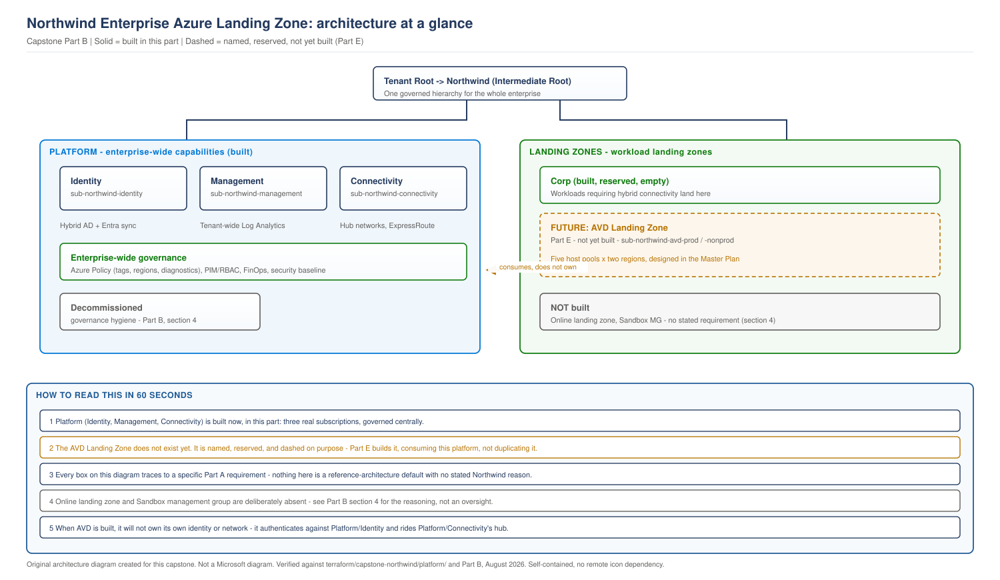

# Northwind Capstone, Part B: Azure Enterprise Landing Zone

> **Part of:** [Northwind Capstone Master Plan](../../appendices/capstone-northwind-master-plan.md)
> **Sequence:** Part B of A-H. Built as the direct, traceable consequence of [Part A](part-a-discovery-and-requirements.md)'s discovery, not as a starting assumption.
> **Terraform:** [`terraform/capstone-northwind/platform/`](../../terraform/capstone-northwind/platform/)
> **Diagram:** [`capstone-landing-zone-architecture.svg`](../../diagrams/architecture/capstone-landing-zone-architecture.svg)
> **Technical baseline:** August 2026

---

## 0. Scope discipline, stated before anything else

Every management group, subscription, policy, and RBAC role in this document exists because a specific line in Part A required it. Where Microsoft's own Cloud Adoption Framework reference structure includes something Part A did not establish a need for, this document says so explicitly and does not build it - section 4 is the record of that discipline, not an afterthought. A landing zone with unused management groups and empty policy initiatives is not a more impressive landing zone. It is unreviewed complexity someone else has to maintain.

---

## 1. From Part A requirements to landing zone principles

This table is the actual traceability the engagement runs on - every row below is checked against Part A's requirement register, not asserted from general landing zone practice.

| Part A requirement | Landing zone consequence |
|---|---|
| TR-04: naming, tagging, and policy enforced as code, not convention | Drives section 2.4 (naming/tagging) and 2.5 (Azure Policy) directly |
| TR-05: every decision distinguishes platform-owned from workload-owned | Drives the entire management group and subscription split in sections 2.1-2.2 |
| C-01: two Azure regions only, unless a documented exception is approved | Enforced as a policy rule (2.5), not left as a design intention someone could quietly violate |
| Section 12 (SOX made concrete): audit trail requirement | Drives the tenant-wide monitoring baseline (2.7) and the Defender for Cloud scoping decision (2.6) |
| Stakeholder requirement, CISO: PIM and Conditional Access enforced tenant-wide, not just for AVD | Drives the RBAC and PIM design (2.6) at the platform layer, before any AVD-specific role exists |
| Stakeholder requirement, CFO: cost at or below the on-premises baseline | Drives the FinOps baseline (2.8) |
| ADR-CAP-00: build a dedicated landing zone, not an isolated AVD subscription | The reason this document exists as real work rather than an assumption |
| Principle 6 (Part A, section 15): no component without a stated reason | The test every subsection below has to pass, and the reason section 4 exists |

---

## 2. Component-by-component design

### 2.1 Management group hierarchy

**Requirement.** TR-05 (platform/workload separation), ADR-CAP-00 (a landing zone exists to be extended, not shaped only around AVD).

**Principle applied.** Platform before workload (Part A, principle 1).

**Options considered.**
- *A single flat subscription* with resource groups separating concerns. Rejected: resource groups do not provide a policy or RBAC boundary strong enough to prevent a mistake in one area reaching another - this book has already demonstrated the same reasoning at a different scale in [Project 03](../../scenarios/project-03-global-enterprise-governance.md).
- *A management group per business function* (Finance MG, Engineering MG, and so on). Rejected: Northwind is a single enterprise with one AVD program, not a multi-business-unit conglomerate like Project 03's customer. A function-based hierarchy would be organised around Northwind's org chart, not its actual platform/workload risk boundary - and Chapter 3's own standing warning applies directly here even though it was written about host pools: never build a structure because a department asked for one.
- *Microsoft's enterprise-scale reference hierarchy, adopted in full*, including Sandbox and Online landing zones Northwind has no stated need for. Rejected - see section 4.

**Decision.** A minimal hierarchy, present only where Part A establishes a need:

```text
Tenant Root Group
  Northwind (Intermediate Root)
    Platform
      Identity          <- Part A: hybrid AD, domain controllers (TR-01, TR-02)
      Management        <- Part A: SOX audit trail requirement (section 12)
      Connectivity        <- Part A: two-region requirement, ExpressRoute at two sites (C-01, C-02)
    Landing Zones
      Corp                <- Part A: AVD requires hybrid connectivity, lands here per Chapter 12's existing guidance
    Decommissioned          <- governance hygiene: see section 4 for why this one small addition is justified
```

**Why the Intermediate Root exists at all.** Scoping policy and RBAC at the tenant root itself would require tenant-root-level access for routine platform changes - a genuinely dangerous default. The Intermediate Root lets every policy and role in this design be scoped to Northwind specifically, without ever needing tenant-root privilege for day-to-day work.

**Implementation approach.** `azurerm_management_group` resources, one per node above, built with explicit `parent_management_group_id` references so the hierarchy is declared once and any drift is visible in `terraform plan`, not discovered by clicking through the portal.

**Governance and operational consequence.** Every future workload Northwind onboards - not just AVD - has a defined place to land (Corp, if it needs hybrid connectivity; a future Online branch would need to be justified the same way Corp was here, not assumed). The platform team owns Platform; workload teams own their landing zone; this document is the reason that boundary is real rather than aspirational.

---

### 2.2 Subscription strategy: platform vs workload

**Requirement.** TR-05, and the same blast-radius reasoning already proven in Project 03.

**Principle applied.** Every exception is owned and dated (principle 2) - applied here in reverse: every subscription boundary is owned and justified, not just every exception to one.

**Options considered.**
- *One subscription for the whole platform.* Rejected: a single subscription-wide Azure Policy assignment or a compromised service principal would reach identity, connectivity, and monitoring simultaneously - exactly the blast radius this design exists to contain.
- *Three platform subscriptions, exactly matching the three Platform management groups.* Selected.

**Decision.**

| Subscription | Management group | Why Northwind specifically needs this one |
|---|---|---|
| `sub-northwind-identity` | Platform/Identity | Hosts the domain controllers Part A section 1.2 (via Chapter 7) already commits to - two per region, synced with the on-premises forest |
| `sub-northwind-management` | Platform/Management | Hosts the tenant-wide Log Analytics workspace the SOX audit-trail requirement (Part A section 12) needs from day one, not bolted on once AVD exists |
| `sub-northwind-connectivity` | Platform/Connectivity | Hosts the hub networks and ExpressRoute circuits Part A's two-region, two-ExpressRoute-site requirement (C-01, C-02) already commits to |

**What is explicitly not created here.** `sub-northwind-avd-prod` and `sub-northwind-avd-nonprod` are named in the Master Plan (Part E) as the future AVD Landing Zone's subscriptions. **Neither is created in this part.** Creating them now, before Part E has designed what actually needs to live in them, would be building workload infrastructure ahead of the workload design - the exact anti-pattern Part A's principle 1 exists to prevent. Section 5's architecture diagram shows them as a reserved, not-yet-built placeholder for this reason.

**Implementation approach.** This design assumes Northwind's three platform subscriptions already exist as billing entities (created through Northwind's Enterprise Agreement or Microsoft Customer Agreement, which is how subscription creation actually happens in a real tenant, not through Terraform) - stated as an **[ASSUMPTION]**, consistent with Part A's own discipline. Terraform's job, and this document's actual deliverable, is `azurerm_management_group_subscription_association`: moving those existing subscription IDs into the correct management group, and applying policy and RBAC once they're there.

**Governance and operational consequence.** A policy or RBAC mistake in the future AVD Landing Zone (Part E) cannot reach identity, connectivity, or management - the subscription boundary, not just a naming convention, prevents it.

---

### 2.3 Production vs non-production separation

**Requirement.** Section 6 of Part A (current-state assessment) establishes that any pilot or validation work for the AVD platform needs a genuinely separate environment, not a resource-group split inside production.

**Decision, stated now, built in Part E.** `sub-northwind-avd-nonprod`, a separate subscription from `sub-northwind-avd-prod`, both under Landing Zones/Corp. This is a **Part E decision**, recorded here only because Part A's requirement drives it and a reader tracing the requirement chain should find where it lands. No non-production subscription exists yet - see 2.2.

---

### 2.4 Naming and tagging

**Requirement.** TR-04 (policy as code, not convention).

**Principle applied.** State the number, not the adjective (principle 3) - a tag schema is only governance if it's enforced, not just documented.

**Options considered.**
- *A tagging convention documented in a wiki page.* Rejected on this book's own standing evidence: [Project 03](../../scenarios/project-03-global-enterprise-governance.md) found that exactly this approach, at a different customer, had produced four different naming conventions across four business units within two years, discovered only during a governance audit.
- *Tags enforced by Azure Policy, at the point of resource creation.* Selected.

**Decision.**

| Tag | Purpose | Northwind-specific reason |
|---|---|---|
| `BusinessUnit` | Reserved for future multi-BU growth | Northwind is one enterprise today; this tag costs nothing to reserve and avoids a breaking schema change if that changes |
| `Environment` | `prod` / `nonprod` | Required the moment Part E creates two AVD subscriptions |
| `CostCentre` | Finance chargeback | Directly serves the CFO's stated requirement (Part A, section 14) |
| `DataClassification` | Flags SOX-scope resources | Directly serves the SOX audit-trail requirement (Part A, section 12) - a resource holding financial data needs to be findable by that fact alone, not by remembering which subscription it's in |
| `Owner` | Named accountable role | Principle 2 (every exception is owned) requires an owner to exist as a queryable fact, not an assumption |

**Implementation approach.** Enforced by the Azure Policy initiative in 2.5, not documented separately - a tag schema with no enforcement mechanism is exactly the failure mode Project 03 already found.

---

### 2.5 Azure Policy

**Requirement.** TR-04, C-01 (two regions only).

**Options considered.**
- *A single, large policy initiative covering every conceivable control.* Rejected: Part A's principle 6 (no component without a stated reason) applies to policy definitions as much as to management groups. A policy nobody can trace to a requirement is a policy nobody will maintain correctly.
- *A small, tightly scoped initiative, assigned at the Intermediate Root, containing only what Part A actually requires.* Selected.

**Decision.** Three policies, each traceable:

| Policy | Effect | Traces to |
|---|---|---|
| Require the five tags from 2.4 | `Deny` on resources missing them | TR-04 |
| Allowed locations: East US 2, West Europe only | `Deny` on any other region | C-01 - a workload wanting a third region needs a documented, reviewed exception, not a default the policy silently permits |
| Mandatory diagnostic settings to the platform Log Analytics workspace | `DeployIfNotExists` | The SOX audit-trail requirement (Part A section 12) - logs exist from the moment a resource is created, not from whenever someone remembers to configure it |

**Implementation approach.** `azurerm_policy_set_definition` (the initiative) and `azurerm_management_group_policy_assignment` at the `Northwind` Intermediate Root, so every subscription under it - platform and future workload alike - inherits the same three controls without needing to redeclare them per subscription.

**Governance and operational consequence.** AVD-specific policy (host pool naming patterns, session host baselines) is explicitly **not** here - it belongs in Part E, assigned at the AVD Landing Zone subscription level, narrower than this tenant-wide baseline. This document's policies are the floor every workload stands on; they are not AVD's ceiling.

---

### 2.6 RBAC and privileged access

**Requirement.** CISO stakeholder requirement (Part A, section 14): PIM and Conditional Access enforced tenant-wide, not just for AVD.

**Options considered.**
- *Standing access for all platform roles*, matching how many organisations actually operate before a governance review finds the gap. Rejected outright - this is the exact finding [Project 03](../../scenarios/project-03-global-enterprise-governance.md) built its entire PIM remediation around for a different customer.
- *PIM for every role, no exceptions.* Considered and rejected for one role - see below - following the same proportionality reasoning Project 03 already established: blanket PIM on a low-blast-radius, high-frequency role creates workaround pressure that undermines PIM everywhere else.

**Decision.**

| Role | Scope | Standing or PIM | Why |
|---|---|---|---|
| Platform Engineer | Platform management group | PIM-eligible | Can change identity, connectivity, or management infrastructure - real blast radius, matches the CISO requirement directly |
| Subscription Owner | Individual platform subscription | PIM-eligible | Same reasoning, scoped narrower |
| Security Reader (CISO's team) | Tenant root, read-only | **Standing** | Visibility should never require activation friction - a CISO's team needing to activate a role before they can see whether something is wrong is a design that fails exactly when it matters most |

**Implementation approach.** Role definitions and PIM eligibility rules via `azurerm_role_definition` and the Entra PIM configuration, scoped at the management groups from 2.1 - not at individual subscriptions, so a new platform subscription added later inherits the same access model automatically.

**Governance and operational consequence.** AVD's own operational roles (Session Host Operator, Service Desk, End User) are explicitly out of scope here - Part E's job, scoped inside the AVD Landing Zone subscriptions only. This section's roles govern the platform three subscriptions built in 2.2; they do not reach into a workload landing zone that doesn't exist yet.

---

### 2.7 Security baseline

**Requirement.** Part A section 12 (SOX made concrete) - access controls and audit trail.

**Decision.** Microsoft Defender for Cloud, free tier, enabled at the `Northwind` Intermediate Root - covering every subscription with baseline recommendations at no cost. The enhanced (paid) tier is scoped only to subscriptions holding SOX-relevant data - which, at this point in the build, is none yet, since no AVD workload subscription exists. **This is stated explicitly as a forward commitment, not a current cost:** once Part E creates `sub-northwind-avd-prod`, the enhanced tier is scoped to it specifically, because that is where the finance persona's SOX-scoped resources will actually live.

**Why not the enhanced tier everywhere, now.** Cost-consciousness (Part A, BR-05) applies to the platform layer too. Paying for enhanced protection on subscriptions with no SOX-relevant data yet would be exactly the kind of unexamined default this document's section 0 commits to avoiding.

---

### 2.8 Monitoring and logging

**Requirement.** Part A section 12, and the CISO's tenant-wide visibility requirement.

**Decision.** One Log Analytics workspace in `sub-northwind-management`, receiving platform-level diagnostics: Azure Policy compliance state, Microsoft Defender for Cloud alerts, and Entra ID sign-in logs. This is deliberately **not** the same workspace AVD's own regional monitoring will use once Part H builds it - the same reasoning this book already proved out in [Labs 11-20](../../appendices/labs-11-20-plan.md): a shared workspace across independently-important layers is a single point of failure for visibility into both.

**Implementation approach.** `azurerm_log_analytics_workspace` in the Management subscription, with `azurerm_monitor_diagnostic_setting` at the management-group scope (via the policy in 2.5) ensuring every current and future subscription's resources report here by default.

---

### 2.9 FinOps

**Requirement.** BR-05 (cost ceiling), CFO stakeholder requirement.

**Decision.** Cost Management scoped at the `Northwind` Intermediate Root, with a budget and alert per platform subscription. This is the enterprise-level visibility the CFO's requirement needs; it is explicitly not yet the AVD-specific cost model (the actual on-prem-versus-Azure comparison) - that requires the AVD platform to exist first, and is Part H's job. This section commits to where that future number will be visible once it exists, not to producing it now.

---

## 3. Enterprise-wide platform capabilities vs platform subscriptions vs workload landing zones

A single table making the layering explicit, since this is the specific distinction requested for this part:

| Layer | What it is | What's in it, right now |
|---|---|---|
| **Enterprise-wide platform capabilities** | The management group structure and the policies/RBAC/monitoring baseline that apply to everything under it | Sections 2.1, 2.5-2.9 - built in this part |
| **Platform subscriptions** | The three concrete Azure subscriptions holding platform infrastructure | `sub-northwind-identity`, `sub-northwind-management`, `sub-northwind-connectivity` - referenced in this part's Terraform, assumed to exist as billing entities |
| **Workload landing zones** | The management group branch (`Landing Zones/Corp`) reserved for workloads needing hybrid connectivity | The `Corp` management group node exists (2.1); nothing is deployed inside it yet |
| **Future AVD Landing Zone** | The specific workload landing zone this whole capstone is building toward | Named and reserved (`sub-northwind-avd-prod`/`-nonprod`, per the Master Plan's Part E), **not created, not configured, no AVD resource of any kind exists** |

---

## 4. What was deliberately not built, and why

Microsoft's enterprise-scale reference architecture includes two elements this design does not build. Naming them, and stating why, is the actual discipline this section exists to demonstrate - not silently including them because the reference architecture does, and not silently omitting them without a reason a reviewer could check.

**`Landing Zones/Online` - not built.** This branch exists in Microsoft's reference structure for internet-facing workloads that don't need hybrid/on-premises connectivity. Nothing in Part A's discovery identifies any such workload. AVD itself needs hybrid AD and ExpressRoute (Chapter 7, Chapter 12), so it lands in Corp, not Online. Building an empty Online branch now would be reserving structure for a requirement that doesn't exist - if Northwind later has a genuine internet-only workload, that decision gets made and justified then, the same way Corp was justified here, not pre-built speculatively.

**A `Sandbox` management group - not built.** Microsoft's reference structure includes a Sandbox for experimentation, isolated from production policy. Part A's discovery identified no experimentation or innovation-lab requirement - Northwind's stated need is a production platform replacement, with `sub-northwind-avd-nonprod` (Part E) already covering the specific "safe place to pilot an AVD change before it touches production" need this engagement actually has. A generic, tenant-wide Sandbox would duplicate that need at a broader, less-justified scope.

**`Decommissioned` - built, and here's why that's different from the two above.** This one small management group is kept, for a specific, stated reason: Part A's current-state assessment (section 6) states as an assumption that Northwind may have pre-existing, ungoverned Azure subscriptions related to the platform being replaced. `Decommissioned` is where a subscription goes when it's being retired - not a reference-architecture default, but a real answer to "what happens to Northwind's old, ungoverned subscriptions once this governance model exists." An empty management group with a clear, single purpose is a materially different complexity cost than two additional unused branches with no stated Northwind need.

---

## 5. Architecture at a glance

> **OUR ORIGINAL ARCHITECTURE DIAGRAM.** Created for this capstone. Not a Microsoft diagram.
> Editable source: [`capstone-landing-zone-architecture.drawio`](../../diagrams/architecture/capstone-landing-zone-architecture.drawio)



**How to read this in one pass.** Solid borders show resources represented in the Part B reference design. Dashed borders show later workload layers. The diagram describes the target architecture; it is not deployment evidence.

---

## 6. Terraform delivered

`terraform/capstone-northwind/platform/management-groups/`: the management group hierarchy (2.1) and the subscription associations (2.2), taking Northwind's three platform subscription IDs as input variables rather than creating the subscriptions themselves - subscription creation is a billing-account action outside Terraform's scope in a real Azure tenant, and this module says so rather than implying a capability that doesn't exist.

`terraform/capstone-northwind/platform/policy/`: the tag, region, and diagnostic-settings policy initiative (2.5), assigned at the Intermediate Root.

**Module location note.** RBAC/PIM, security, monitoring, and FinOps are implemented as separate modules under `terraform/capstone-northwind/platform/`. They are kept separate from the management-group module because they have different dependencies and change cycles.

> This Terraform has not been run against a live Azure subscription. It has been checked for balanced syntax and internal consistency against the design above. Confirm your own plan output, and confirm your actual platform subscription IDs are correct, before applying.

---

## 7. What Part B validates, and what remains

**Validated:** every design decision above traced to a specific Part A requirement, checked against the actual Part A document, not memory. The management group and policy Terraform checked for structural (brace/reference) correctness. The diagram rendered, inspected, and corrected before being included here - see the validation report accompanying this part's delivery.

**Not yet done, correctly so at this stage:** RBAC, security baseline, monitoring, and FinOps Terraform (section 6). No live Azure deployment of any kind. Part C (Identity and Connectivity Foundation) is the next real build, landing inside the `sub-northwind-identity` and `sub-northwind-connectivity` subscriptions this part has now defined and associated into the hierarchy.

---

## What comes next

[Part C - Identity and Connectivity Foundation](../../appendices/capstone-northwind-master-plan.md#part-c---identity-and-connectivity-foundation) builds the domain controllers, hub networks, and ExpressRoute connectivity inside the platform subscriptions this part created the governance shell for - the hub-and-spoke decision (already cited from Chapter 12 in the Master Plan) applied for the first time to real Terraform.
