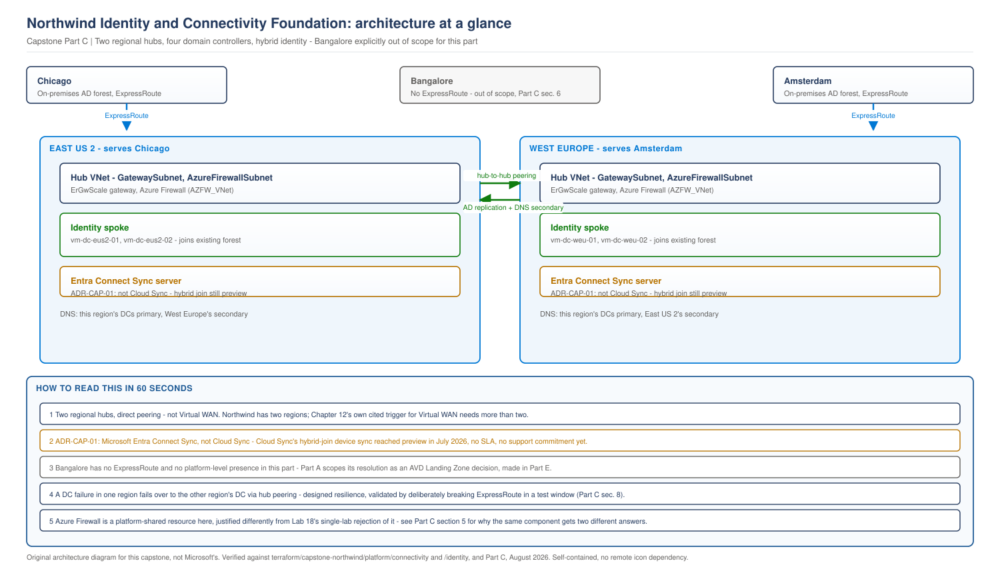

# Northwind Capstone, Part C: Identity and Connectivity Foundation

> **Part of:** [Northwind Capstone Master Plan](../../appendices/capstone-northwind-master-plan.md)
> **Sequence:** Part C of A-H. Built inside the platform subscriptions Part B created the governance shell for.
> **Terraform:** [`terraform/capstone-northwind/platform/connectivity/`](../../terraform/capstone-northwind/platform/connectivity/), [`terraform/capstone-northwind/platform/identity/`](../../terraform/capstone-northwind/platform/identity/)
> **Diagram:** [`capstone-identity-connectivity-topology.svg`](../../diagrams/architecture/capstone-identity-connectivity-topology.svg)
> **ADR:** [ADR-CAP-01: Microsoft Entra Connect Sync, not Cloud Sync](../adr/adr-cap-01-identity-sync-method.md)
> **Technical baseline:** August 2026

---

## 0. Scope discipline, stated before anything else

This part builds the network and identity infrastructure two things actually need it: Northwind's hybrid identity requirement (Part A, TR-01/TR-02) and the two ExpressRoute-connected sites (Part A, TR-03, C-02). Bangalore gets no platform-level network presence in this part - not an oversight, a decision, explained in section 6. Everything here lives in the platform subscriptions Part B created (`sub-northwind-identity`, `sub-northwind-connectivity`); nothing here is AVD-specific, and section 7 states exactly where that boundary sits.

---

## 1. From Part A requirements to this part's decisions

| Part A requirement | This part's consequence |
|---|---|
| TR-01: preserve the on-premises AD forest and GPO, no forest redesign | Drives the domain controller placement (section 4) and the identity sync method decision (section 3) |
| TR-02: hybrid identity, not cloud-only | Same |
| TR-03/C-02: ExpressRoute at Chicago and Amsterdam, no assumption of a third circuit | Drives the two-region network design (section 2) and explicitly excludes any platform footprint for Bangalore (section 6) |
| C-01: two Azure regions only | Confirms the hub-and-spoke decision applies to exactly two hubs, not a design that has to anticipate a third |
| Section 8 (availability, 43.8 hours/year): a design has to be checked against a real number | Drives the failure-scenario analysis (section 8) |
| Principle 1 (platform before workload) | The reason this part exists before Part E |
| Principle 6 (no component without a stated reason) | The test section 6 applies to Bangalore, and the test the Firewall decision (section 5) has to pass |

---

## 2. Network topology: hub-and-spoke, not Virtual WAN

**Requirement.** C-01 (two regions), TR-03 (ExpressRoute at two sites).

**Principle applied.** No component without a stated reason (Part A, principle 6).

**Options considered.**
- *Azure Virtual WAN.* Rejected. This book's own existing guidance ([Chapter 12](../../chapters/ch12-enterprise-topologies-ip-planning.md)) states Microsoft's actual trigger directly: *"the trigger is more than two regions plus a need for global transit, not spoke count on its own."* Northwind has two regions and no stated need for automated any-to-any transit between them beyond what a direct hub-to-hub peering already provides.
- *Hub-and-spoke, one hub per region.* Selected - already the Master Plan's stated decision (Part C1); this section is where it's actually built.

**Decision.** One hub VNet in East US 2, one in West Europe, each holding that region's ExpressRoute gateway, Azure Firewall, and DNS resolution. The two hubs are peered directly to each other - no third, shared transit component, because two regions don't need one.

**Implementation approach.** `azurerm_virtual_network` for each hub, `azurerm_virtual_network_peering` (both directions) connecting them - the same mechanism this book already proved out at lab scale in [Labs 11-20](../../appendices/labs-11-20-plan.md), applied here at the platform layer for the first time.

**Governance and operational consequence.** If Northwind ever adds a third region with genuine multi-region transit needs, that's the point Virtual WAN's trigger is actually met - this design doesn't block that future, it just doesn't build for a requirement that doesn't exist today.

---

## 3. Identity synchronization: Microsoft Entra Connect Sync, not Cloud Sync

**Requirement.** TR-01, TR-02 - fifteen years of on-premises AD and GPO, hybrid identity, and Chapter 7's existing commitment that AVD session hosts are hybrid-joined.

**Principle applied.** State the number, not the adjective (principle 3) - "use the modern sync tool" is an adjective; what actually matters is whether that tool supports a production hybrid-join requirement today.

**What was actually checked, not assumed.** Microsoft is running a strategic transition from Microsoft Entra Connect Sync to Microsoft Entra Cloud Sync, with tenant migration notifications beginning July 2026. That much is well-established and would normally argue for building Northwind directly on Cloud Sync as the forward-looking choice. Checking further: **Cloud Sync's support for Hybrid Microsoft Entra Join - the specific capability Chapter 7's AVD session-host design depends on - is in public preview as of this book's baseline**, shipped via an AD-to-Entra device sync job first released in preview in July 2026, carrying supplemental preview terms with no SLA and no support commitment. A separate, also-preview mechanism (client-initiated hybrid join via Microsoft Entra Kerberos, no device sync required) reached preview in February 2026 and is specifically called out by Microsoft's own community guidance as suited to non-persistent VDI - directly relevant to AVD, and worth revisiting once it's GA, but not something this capstone adopts today.

**Options considered.**
- *Microsoft Entra Cloud Sync, adopting the hybrid-join device sync preview.* Rejected for the same reason this book's ADR rejected Session Host Configuration in Labs 11-20: a required, production dependency should not sit on a capability carrying no SLA and no support commitment, however strategically it's positioned.
- *Microsoft Entra Connect Sync (Connect Sync), Microsoft's previous-generation but currently still fully supported tool.* Selected. It supports hybrid join today, with a full support commitment, and does not require Northwind's production identity path to depend on preview terms.

**Decision.** Microsoft Entra Connect Sync, deployed against both regions' domain controllers, for hybrid identity sync including Hybrid Microsoft Entra Join.

**Implementation approach.** Connect Sync is installed on a dedicated, domain-joined server - not on a domain controller itself, matching Microsoft's own long-standing guidance - inside `sub-northwind-identity`. This is an installation and configuration action on a VM, not a declarative Azure resource; the VM itself is Terraform-managed (section 4), the Connect Sync installation and its sync rules are a documented, scripted post-deployment step, the same pattern this book already uses for AD DS promotion in [Lab 4](../../labs/lab-04-identity-integration.md) and [Lab 12](../../labs/lab-12-regional-identity.md).

**Governance and operational consequence, including the revisit trigger.** This is not a permanent decision. [ADR-CAP-01](../adr/adr-cap-01-identity-sync-method.md) states explicitly what would change it: Cloud Sync's hybrid-join device sync (or the Entra Kerberos path) reaching general availability with a full support commitment. Given Microsoft's stated migration direction, this is a when, not an if - the ADR names the review trigger so this decision doesn't quietly become stale.

---

## 4. Domain controller placement

**Requirement.** [Chapter 7](../../chapters/ch07-identity-architecture-foundations.md)'s existing decision (Part A, section 1.2): two domain controllers in East US 2, two in West Europe, synced with the on-premises forest.

**This is not re-decided here.** It's built, inside `sub-northwind-identity`, following exactly the pattern [Lab 4](../../labs/lab-04-identity-integration.md) and [Lab 12](../../labs/lab-12-regional-identity.md) already proved: `Install-ADDSDomainController` joining the existing forest (not creating a new one), placed in each region's identity spoke, with static private IPs that become that region's primary DNS servers.

**Implementation approach.** Four `azurerm_windows_virtual_machine` resources (two per region), domain-joined via the same imperative post-deployment pattern as Labs 4 and 12, since domain promotion is not a Terraform-declarable action.

**Governance and operational consequence.** These four VMs are platform infrastructure, owned by the Platform/Identity team, not the future AVD Landing Zone team. AVD session hosts (Part F) will authenticate against them but never manage them - the same ownership boundary Part B, section 2.1, establishes structurally.

---

## 5. DNS, Private Endpoints, and egress control

**Requirement.** TR-01/TR-02 (identity resolution must work correctly in both regions), Part A section 12 (SOX audit trail - egress traffic needs to be inspectable).

**Decision: DNS.** Each region's two domain controllers serve as that region's primary DNS, with the other region's domain controllers as secondary - the same pattern this book validated at lab scale in Labs 11-12, applied here as platform infrastructure rather than a lab convenience.

**Decision: Private Endpoints.** Every platform PaaS service (the Log Analytics workspace from Part B, Key Vault for VM credentials) is reachable only via Private Endpoint - this book's standing default since Chapter 13, not a fresh decision for Northwind.

**Decision: Azure Firewall.** One Azure Firewall per regional hub.

**Options considered for egress control.**
- *NSGs only, no Firewall*, matching the cost-conscious choice [Lab 18](../../labs/lab-18-regional-security-monitoring.md) made for a single lab environment's egress control.
- *Azure Firewall at each hub.* Selected here - and the reasoning is genuinely different from Lab 18's, not a default carried over unexamined. Lab 18's Firewall was rejected because it would have been a single lab's cost for a single lab's traffic. Here, the Firewall is a **platform-shared resource** every current and future workload landing in Corp will use - the SOX audit-trail requirement (Part A, section 12) specifically benefits from Firewall's centralized, queryable egress logging in a way NSG flow logs alone don't match as directly. The same component, two different contexts, two different conclusions - stated explicitly so this isn't read as an inconsistency.

**ExpressRoute Gateway SKU.** `ErGwScale`, confirmed via Microsoft Learn as the current-generation, availability-zone-redundant, autoscaling ExpressRoute gateway SKU (up to 40 Gbps, scaling 2-40 units). Chosen specifically to avoid guessing a fixed-capacity SKU (`ErGw1AZ`/`ErGw2AZ`/`ErGw3AZ`) against traffic volumes this engagement doesn't have real data for yet - the autoscaling range means an under-sizing mistake doesn't require a gateway rebuild.

**Implementation approach.** `azurerm_firewall` and `azurerm_virtual_network_gateway` (type `ExpressRoute`, SKU `ErGwScale`) per regional hub, with UDRs routing spoke-to-spoke and spoke-to-on-premises traffic through the regional firewall rather than a direct peering bypass.

---

## 6. Bangalore: explicitly addressed, deliberately not built here

**This section exists because Bangalore cannot be silently absent from a document covering Northwind's three sites - it has to be named and reasoned about, even though the decision it needs is not this part's to make.**

Bangalore has no ExpressRoute (Part A, C-02) and Part A's regional strategy requirement (A8) explicitly frames its resolution as an AVD Landing Zone - workload - decision, not a platform one, made in Part E once the AVD Landing Zone's network spokes exist to connect into. **No hub, no VNet, no ExpressRoute circuit, and no platform-level network resource of any kind is built for Bangalore in this part.** This is not an oversight this document is quietly hoping nobody notices - it's the direct, stated consequence of Part A's own scoping decision, restated here so a reader arriving at Part C doesn't wonder where Bangalore went.

What Part E will actually decide (previewed, not committed here): whether Bangalore reaches the platform via an internet path into an existing regional hub, secured by Conditional Access, or some other workload-layer mechanism. That decision needs the AVD Landing Zone's actual shape to exist first - deciding it now, in the platform part, would mean designing a workload decision before the workload exists, exactly what principle 1 exists to prevent.

---

## 7. What AVD will consume from this part, and what it will not own

| AVD (Part E/F) consumes | AVD does not own |
|---|---|
| Authentication against the four domain controllers built here | The domain controllers themselves - Platform/Identity's, not AVD's |
| DNS resolution via the same regional DC pattern | The DNS server configuration - inherited, not redeclared |
| Network reachability via the regional hub's spoke peering | The hub, the ExpressRoute circuit, or the Firewall - Platform/Connectivity's |
| Egress logging already flowing to the platform's centralized capability | A second, competing egress control layer - AVD's own regional monitoring (Part H) is additional, not a replacement |

This table exists for the same reason Part B's equivalent table did: a hiring manager should be able to check, line by line, that AVD is designed as a workload consuming a platform, not a workload quietly redefining what the platform means.

---

## 8. Availability, failure scenarios, and dependency analysis

**Requirement.** Part A section 8's quantified target: 43.8 hours/year permitted downtime.

**Dependency analysis.** A future AVD session host's ability to authenticate depends on: its own region's domain controllers (primary), the other region's domain controllers (secondary, reachable via hub-to-hub peering), and - transitively - the hub network and Firewall being up. It does **not** depend on ExpressRoute being up for authentication specifically, once Connect Sync has completed an initial sync - this is a deliberately engineered property, not an accident, and it's the same authentication-resilience principle Chapter 7 already established.

**Failure scenario 1: one region's domain controllers become unreachable.** Sessions in that region fail over to the other region's DCs via the hub peering (section 2). Cost: added authentication latency for the duration, not an outage. This is the concrete test [Chapter 7](../../chapters/ch07-identity-architecture-foundations.md)'s own validation method calls for - see the next scenario for how it's actually verified, not just designed.

**Failure scenario 2: ExpressRoute circuit failure at one site (Chicago or Amsterdam).** On-premises users at that site lose their private path to Azure. This is a real, uncontained impact this design does not claim to solve - there is no secondary ExpressRoute circuit in this design, because Part A's cost ceiling (BR-05) does not support paying for one against a risk this document has not been asked to insure against at that cost. Stated as an accepted risk, not hidden as a gap nobody flagged.

**Failure scenario 3: the regional hub's Azure Firewall fails.** Egress traffic for that region's spoke workloads stops - UDRs route through the firewall, not around it. This is the direct cost of the centralized-logging benefit in section 5: a single Firewall instance is a single point of failure for that region's egress. Azure Firewall's own zone-redundant deployment (available at deployment time) mitigates a zone failure specifically; a full regional Firewall service issue is not separately insured against here, consistent with the same cost-versus-risk reasoning as scenario 2.

**The actual validation requirement, carried forward from Chapter 7, not invented here.** Measure authentication time per region separately, then deliberately break the ExpressRoute path in a controlled test window and confirm regional DCs keep local logons working without it. This is a live-Azure validation step - not performed in this document, and not claimed to be. It is the specific evidence Part H's operational validation owes this design before "43.8 hours/year" can be called anything more than a target.

---

## 9. Architecture at a glance

> **OUR ORIGINAL ARCHITECTURE DIAGRAM.** Created for this capstone. Not a Microsoft diagram.
> Editable source: [`capstone-identity-connectivity-topology.drawio`](../../diagrams/architecture/capstone-identity-connectivity-topology.drawio)

This diagram is included because Part C introduces genuinely new spatial content - two real regional hubs, ExpressRoute termination, domain controller placement - that Part B's management-group diagram couldn't show and that a reader needs to see laid out, not just described in prose.

---

## 10. Terraform delivered

`terraform/capstone-northwind/platform/connectivity/`: hub VNets (both regions), hub-to-hub peering, ExpressRoute gateways (`ErGwScale`), Azure Firewall, NSGs and UDRs.

`terraform/capstone-northwind/platform/identity/`: four domain controller VMs (two per region), matching Labs 4/12's proven resource shape.

**What is deliberately not in this Terraform.** The actual ExpressRoute circuit resources themselves are not created here - a circuit is provisioned jointly with the connectivity provider and Northwind's network team, a process Terraform can reference (via `azurerm_express_route_circuit` once the provider has allocated it) but not originate. This module's gateway is built ready to connect to a circuit that exists through that separate process, stated as a boundary, not an omission. Microsoft Entra Connect Sync's installation and sync rule configuration is documented as a post-deployment script, not Terraform, for the same reason AD DS promotion always has been in this book.

> This Terraform has not been run against a live Azure subscription. Confirm your own plan output before applying - a change to gateway SKU or peering configuration in a live environment carries real connectivity risk to production identity infrastructure.

---

## 11. What Part C validates, and what remains

**Validated:** every design decision traced to a Part A requirement, checked against the actual document. The hub-and-spoke citation checked against Chapter 12's exact text. The identity sync decision checked against current Microsoft documentation on Cloud Sync's hybrid-join preview status, not assumed. The ExpressRoute Gateway SKU confirmed against Microsoft Learn directly. The diagram rendered, inspected, and corrected before inclusion.

**Not yet done:** the actual ExpressRoute circuit provisioning (out of Terraform's scope, per section 10). Connect Sync's real installation and sync rule validation. Any live Azure deployment. The authentication-resilience test from section 8 - designed, not executed.

---

## What comes next

[Part D - Governance and Security Foundation](../../appendices/capstone-northwind-master-plan.md#part-d---governance-and-security-foundation) is largely already delivered alongside Part B, per that part's own stated reasoning (D1). Part E - the AVD Landing Zone - is the next genuinely new build, and it is the first part that gets to answer the Bangalore question this part deliberately left open.
