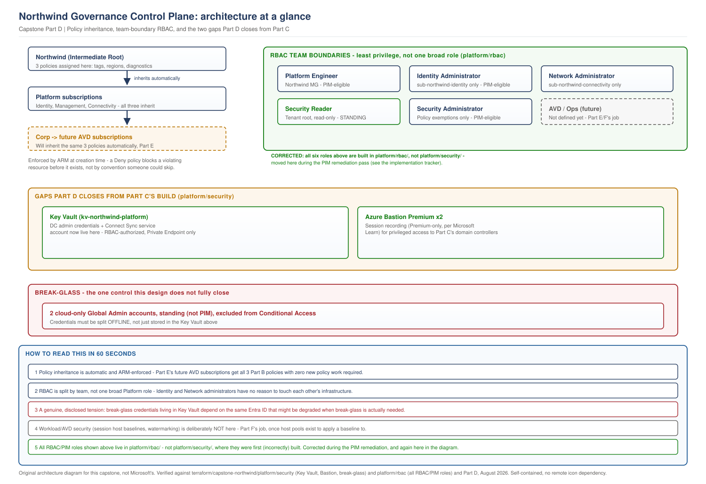

# Northwind Capstone, Part D: Governance and Security Foundation

> **Part of:** [Northwind Capstone Master Plan](../../appendices/capstone-northwind-master-plan.md)
> **Sequence:** Part D of A-H. Extends the governance baseline Part B established and the network Part C built, into a working control plane rather than a checklist.
> **Terraform:** [`terraform/capstone-northwind/platform/security/`](../../terraform/capstone-northwind/platform/security/)
> **Diagram:** [`capstone-governance-control-plane.svg`](../../diagrams/architecture/capstone-governance-control-plane.svg)
> **Technical baseline:** August 2026

---

## 0. Scope discipline, and why this part is not a repeat of Part B

Part B already built three Azure Policy assignments, three RBAC roles, a Defender for Cloud baseline, and a monitoring workspace. This part does not rebuild any of that. What it does: explains and diagrams how those controls actually flow through the hierarchy rather than just naming them, closes a real gap Part C's build surfaced (where do admin credentials and secrets actually live, and how does anyone reach the domain controllers without a public IP), deepens the RBAC model into an actual team-boundary design, and covers the two areas neither Part B nor Part C touched at all: break-glass access and SOX evidence collection made concrete. Every addition below exists because something specific required it - section 8 names what was considered and rejected for the same reason.

---

## 1. Traceability: Part A through Part D, as one continuous design

| Part A requirement | Part B | Part C | Part D |
|---|---|---|---|
| TR-04 (policy as code) | Three policies assigned at the root | - | Section 3: how those policies actually inherit, and where a workload could still exempt itself if this weren't checked |
| Stakeholder requirement, CISO (PIM tenant-wide) | Three roles, platform-scoped | - | Section 4: the full team-boundary model - Platform, Identity, Network, Security, and where AVD's future roles will sit without overlapping them |
| Section 12 (SOX audit trail) | Tenant-wide Log Analytics workspace | Firewall logging as a platform-shared capability | Section 6: what that workspace actually has to prove, and what it explicitly does not |
| TR-01/TR-02 (hybrid identity) | - | Domain controllers, Entra Connect Sync server | Section 3.4 (Key Vault): where the credentials for both of those actually live, a gap Part C's build left open |
| C-01/C-02 (regions, no public exposure implied) | - | DCs with no public IP, NSGs denying internet inbound | Section 3.5 (Bastion): how anyone reaches them at all |
| 99.5% availability (43.8 hrs/year) | - | Failure scenarios for network/identity | Section 7: failure scenarios for the control plane itself - what happens when governance, not infrastructure, is what fails |

This table is deliberately read left to right: nothing in this column exists without the requirement two columns to its left, and nothing in Part D duplicates what Part B or C already own.

---

## 2. The eight control areas, distinguished

| Area | What it controls | Where it's built |
|---|---|---|
| **Azure Policy governance** | What configurations are allowed to exist at all | Part B (assignment), Part D section 3 (inheritance mechanics) |
| **RBAC / PIM** | Who can act, and under what activation conditions | Part B (three platform roles), Part D section 4 (the full team-boundary model) |
| **Microsoft Defender for Cloud / posture** | Continuous assessment of what's actually misconfigured | Part B (tenant-wide free tier, enhanced scoping deferred) |
| **Key Vault / secrets** | Where credentials and keys actually live, and who can read them | **New in Part D**, section 3.4 |
| **Logging / auditing** | What happened, provably, after the fact | Part B (workspace), Part D section 6 (what it has to prove for SOX specifically) |
| **Network security** | What can reach what | Part C (Firewall, NSGs, UDRs) |
| **Workload / AVD security** | Controls specific to the AVD platform itself | **Explicitly not this part** - Part F's job, previewed only in section 5 |
| **Operational governance** | Exceptions, break-glass, day-2 access decisions | **New in Part D**, sections 4.4 and 5 |

---

## 3. Policy inheritance: where controls are actually enforced

**Requirement.** TR-04, and the practical question Part B's assignment left implicit: if a policy is assigned at the `Northwind` intermediate root, does a resource created in `sub-northwind-avd-prod` two years from now actually inherit it, or could a workload team exempt itself without anyone noticing?

**How Azure Policy inheritance actually works, stated precisely.** A policy assigned at a management group applies to every subscription and resource group beneath it in the hierarchy, with no re-assignment required at each level down. This is enforced by Azure Resource Manager at evaluation time, not by convention - a resource creation request that violates a `Deny`-effect policy assigned three levels up is rejected by the platform itself, not by a process someone could skip under deadline pressure. This is the actual mechanism that makes Part B's tag, region, and diagnostic-settings policies apply to `sub-northwind-avd-prod` automatically, the moment it's associated into `Landing Zones/Corp`, with zero new policy work required in Part E.

**The one place this could still be bypassed, named rather than assumed away.** A policy exemption (`azurerm_resource_policy_exemption` or its management-group equivalent) can excuse a specific scope from a specific policy. This is a legitimate, documented Azure capability - and also exactly the mechanism a well-intentioned engineer could misuse to work around an inconvenient control without going through the exception process Part B's governance model (section 3.1 below) requires. The control that closes this gap is not technical - it's the RBAC boundary in section 4: only the Platform Engineer role (PIM-eligible, requiring activation and, per section 4.4, subject to audit) can create a policy exemption, not a workload team acting on its own.

### 3.1 The exceptions process, restated with teeth

Part B named this process (Project 03's discipline: every exception owned and dated). This section states what actually enforces it: a policy exemption in Azure has an optional `expiresOn` field. This design's operational standard is that **every exemption created must set it** - a permanent, undated exemption is functionally a silent policy change, not an exception. This is not currently enforced by an additional policy-on-policy control in this build (see section 8 for why that's a deliberate, not accidental, omission), but it is the standard this design's RBAC and audit logging (section 6) are built to make checkable after the fact.

### 3.2 Key Vault: where platform secrets actually live

**Requirement.** TR-01/TR-02 - Part C's domain controllers and Entra Connect Sync server both need admin credentials, and Part C's Terraform took them as `sensitive` variables without stating where they persist afterward. That's a real gap, not a stylistic choice - a `terraform.tfvars` file sitting on someone's laptop is not a credential store.

**Options considered.**
- *Credentials stored only in Terraform state*, relying on state file encryption at rest. Rejected: state files are a broad-access artifact for an entire module, not a scoped, auditable secret store - anyone with read access to the state file gets every secret in it, not just the one they need.
- *A dedicated platform Key Vault, RBAC-scoped per secret.* Selected.

**Decision.** One Key Vault, `kv-northwind-platform-prd`, in `sub-northwind-management` - the shared platform-services subscription, not `sub-northwind-identity` specifically, because this vault will hold secrets for more than identity infrastructure over time (Bastion's session-recording storage credentials, section 3.5, are the first non-identity example). Access is via Azure RBAC (not the older vault access-policy model), so the same PIM-eligible roles from section 4 govern who can read which secret, rather than a second, parallel permission system.

**Implementation approach.** `azurerm_key_vault` with `enable_rbac_authorization = true`, Private Endpoint only (Part C's existing standard), storing the domain controller admin credentials and the Entra Connect Sync service account credential as `azurerm_key_vault_secret` resources referenced by the identity module going forward - closing the gap Part C's `terraform.tfvars.example` files left open.

### 3.3 Microsoft Defender for Cloud: unchanged from Part B, restated for completeness

Free tier tenant-wide, enhanced tier scoped once a SOX-relevant workload subscription exists (Part B, section 2.7). No new decision here - included in this table only so a reader tracing the eight areas in section 2 finds where each one actually lives.

### 3.4 Azure Bastion: how anyone reaches the domain controllers

**Requirement.** Part C built four domain controllers with no public IP and an NSG denying internet-inbound RDP. That's correct security posture and it creates a real, unaddressed operational question: how does the Platform/Identity team actually manage them.

**Options considered.**
- *A jump-box VM with a public IP, tightly NSG-restricted.* Rejected: still a public attack surface, and every session through it is only as auditable as whatever's bolted on afterward - not a built-in capability.
- *Azure Bastion, Standard SKU.* Considered and rejected in favour of Premium - see below.
- *Azure Bastion, Premium SKU.* Selected.

**Decision, and why Premium specifically, not a default top-tier choice.** Confirmed directly against Microsoft Learn: session recording - the specific capability that turns "someone connected to a domain controller" into "here is the recorded, reviewable session of what they did" - requires the Premium SKU; Standard does not include it. Given this design's identity infrastructure is exactly the kind of privileged-access surface a SOX audit would ask about, Premium is chosen for that stated reason, not because it's the newest or most expensive option available.

**Implementation approach.** One Bastion Premium instance per regional hub (Part C's existing hub VNets, each gaining an `AzureBastionSubnet`). Session recording itself - the storage account, container, and the specific configuration mechanism (Microsoft has documented both a shared-access-signature and a managed-identity authentication path for this) - is **not** decided here as a specific implementation detail. It is marked **[VERIFY BEFORE IMPLEMENTATION]** in the Terraform (`bastion.tf`): confirm the current `azurerm_bastion_host` schema's support for session-recording configuration, and which authentication path is current best practice, against Microsoft Learn before building it. Choosing the SKU (Premium) is a decision this document stands behind; choosing the exact recording-configuration mechanism is not yet, and this section should not read as if it were.

---

## 4. Privileged access: the full team-boundary model

**Requirement.** CISO stakeholder requirement (Part A, section 14): PIM enforced tenant-wide. Part B built three roles; this section builds out the model those three roles were always meant to be part of, made explicit now because Part D is where the operational question "who can actually do what, across every team this platform will eventually involve" has to be answered concretely.

| Team | Scope | Role | Standing or PIM |
|---|---|---|---|
| Platform | `Northwind` management group | Platform Engineer (Part B) | PIM-eligible |
| Identity | `sub-northwind-identity` | Identity Administrator | PIM-eligible |
| Network/Connectivity | `sub-northwind-connectivity` | Network Administrator | PIM-eligible |
| Security | Tenant root, read-only | Security Reader (Part B) | **Standing** - unchanged reasoning: visibility should never require activation friction |
| Security | `Northwind` management group, policy-exemption rights specifically | Security Administrator | PIM-eligible, and the only role permitted to create a policy exemption (section 3.1) |
| AVD Platform *(future, Part E)* | `sub-northwind-avd-prod`/`-nonprod` | Not yet defined | Explicitly out of scope here - see the boundary statement below |
| Operations *(future, Part F/H)* | AVD Landing Zone, scoped narrower than Platform Engineer | Not yet defined | Explicitly out of scope here |

**Why Identity and Network are split into separate roles, not folded into Platform Engineer.** A single, broad Platform Engineer role covering identity, network, and everything else recreates exactly the blast-radius problem Part B's subscription split exists to prevent - a role, not just a subscription boundary, needs to reflect least privilege. Someone managing ExpressRoute connectivity has no operational reason to hold rights over domain controller configuration, and vice versa.

**What "least privilege" actually means here, stated precisely rather than implied.** The subscription-scoped split above genuinely achieves least privilege *across* teams - an Identity Administrator has zero standing rights in `sub-northwind-connectivity`, and vice versa. It does **not** yet achieve least privilege *within* a subscription: the Terraform in section 10 grants Identity Administrator via the built-in `Contributor` role, which can modify anything in `sub-northwind-identity` - not narrowly scoped to domain-controller-specific actions. This is marked `[VERIFY BEFORE IMPLEMENTATION]` in the Terraform rather than presented here as a solved problem: a narrower custom role definition is the correct next step, and this document does not claim that step has already been taken.

**The explicit boundary this section will not cross.** AVD-specific operational roles (Session Host Operator, Service Desk, End User - the model already proven in Project 03) are not defined here. Defining them now, before Part E's AVD Landing Zone exists to scope them against, would mean guessing at a boundary this document doesn't yet have the workload shape to draw correctly - the same discipline Part C applied to Bangalore.

### 4.4 Break-glass and emergency access

**Requirement.** A tenant-wide PIM model (section 4) creates a real operational risk this design has to name: if Entra ID itself is unreachable, or every PIM-eligible administrator's account is locked out simultaneously, there has to be a documented way back in that does not itself depend on the system that's failed.

**Design, following Microsoft's own long-standing, stable guidance for this scenario rather than an invented procedure.** Two cloud-only emergency-access accounts, excluded from Conditional Access policies and from the standard MFA requirement (secured instead by a very long, complex credential, split and stored in two physically separate secure locations), assigned the Global Administrator role as a **standing**, not PIM-eligible, assignment - because an account whose entire purpose is working when PIM itself might not be reachable cannot depend on PIM to activate. Sign-in to these accounts triggers a high-priority alert to the Security team, reviewed as an incident every time, whether or not the use turns out to have been legitimate.

**What this section does not invent.** The exact current Microsoft-recommended monitoring configuration for break-glass sign-in alerts (specific alert rule names, specific log queries) is not stated here as a fixed implementation, since Microsoft's own guidance for this has been refined over time and a specific alert configuration should be confirmed against current documentation at implementation time - marked **[VERIFY BEFORE IMPLEMENTATION]** rather than guessed.

**A genuine tension this design surfaces rather than hides.** This build's Terraform stores the break-glass account credentials in the platform Key Vault (section 3.2), for consistency with how every other platform secret is managed. That is in tension with break-glass's actual purpose: if Entra ID itself is degraded, Key Vault's RBAC-based access control - which depends on Entra ID to evaluate - may be part of what's degraded too. The credential split Microsoft's guidance actually calls for (two physically separate, offline secure locations) is what resolves this in practice, and it is an operational control outside what Terraform or Key Vault can enforce. This document states the tension explicitly rather than implying Key Vault's existence has already solved break-glass access - it has not, on its own.

**Implementation approach.** The two accounts themselves are created via `azuread_user` (section 10's Terraform). The Conditional Access exclusion and the monitoring alert are portal/Graph API configuration, not modelled as Terraform in this pass - consistent with this document's standard of not inventing an implementation detail that needs to be verified against current guidance first.

---

## 5. Workload and AVD security: named, not built

The eighth control area from section 2. Session host security baselines, watermarking decisions, FSLogix-specific access controls, and every AVD-specific control this book's own [Project 11](../../scenarios/project-11-highly-secure-regulated.md) already demonstrates the pattern for - all of it is Part F's job, once host pools exist to apply a baseline to. This section exists only to state that boundary explicitly, so a reader checking whether Part D "covers AVD security" gets a direct answer: no, on purpose, and here is where it will be covered instead.

---

## 6. SOX evidence collection: in scope and out of scope, made concrete

**Requirement.** Part A, section 12 - restated here at the level of an actual, checkable capability rather than a requirement statement.

**What this platform's logging is actually being asked to prove, for the finance persona once it exists (Part F).** Who accessed a SOX-scoped system, from where, and when - retrievable in minutes, following [Project 11](../../scenarios/project-11-highly-secure-regulated.md)'s proven pattern exactly: a saved, tested KQL query joining sign-in logs with resource-access logs, not a general-purpose dashboard someone has to manually correlate under audit pressure.

**What is genuinely buildable now, versus what needs Part F to exist first.** The query pattern itself - the join logic and the log sources - is platform-layer design and is stated here. The specific query naming the finance host pool's resource ID cannot be written until that host pool exists. This mirrors exactly how Part B treated Defender for Cloud's enhanced tier: designed and reasoned about now, instantiated once there's a real resource to point it at.

**The retention requirement, stated as an open item rather than a number this document invents.** How long SOX-relevant access evidence must actually be retained is a legal and audit-scope question for Northwind's own compliance function to confirm, not an Azure technical capability this document can verify against Microsoft documentation. No specific retention period is asserted here. Part B's tenant-wide Log Analytics workspace (section 2.8) was designed but, as Part B's own section 6 discloses, not yet built as Terraform - when it is built, its retention setting should be confirmed against Northwind's compliance function's actual answer first, not defaulted to a generic figure and revisited later.

**What this platform's audit capability explicitly does not cover, restated from Part A so this document doesn't imply more than it delivers.** Application-level controls inside SAP, segregation of duties for financial transaction approval, physical security, and staff training are outside this platform's control surface entirely. This design's compliance contribution is the desktop platform's own access and change evidence - one control among several a SOX audit would actually examine, not the whole of it.

---

## 7. Failure scenarios: governance and security, not just infrastructure

Part C covered network and identity failure scenarios. This section covers what happens when the *control plane itself* fails, which is a genuinely different category of risk.

**Scenario 1: an Azure Policy assignment fails to apply correctly, and a non-compliant resource gets created anyway.** Azure Policy's `Deny` effect is enforced at creation time for supported resource types, but a policy created after a resource already exists does not retroactively block it - it flags it as non-compliant on the next evaluation cycle. This design's mitigation is not prevention (that gap is a documented Azure Policy characteristic, not a fixable defect) but detection: the compliance-state diagnostic setting (Part B, section 2.8) feeds the platform's central workspace, so a drifted resource is visible, not silent.

**Scenario 2: a PIM-eligible role is activated and misused before anyone notices.** PIM activation itself is logged. The mitigation this design relies on is the same logging pipeline, not a faster human reviewer - a misuse is discoverable after the fact, on a timeline bounded by how often the Security team's standing read access (section 4) is actually exercised, which this document does not claim to be real-time.

**Scenario 3: a policy exemption is created and never expires**, the specific failure mode section 3.1 names. This design does not currently have an automated control that flags an exemption with no `expiresOn` value - stated honestly as a gap, not solved by an unbuilt policy-on-policy control invented to look complete. See section 8 for why that specific control is deliberately deferred rather than added here.

**Scenario 4: the break-glass accounts are used, appropriately or not, and the alert doesn't fire** (a monitoring configuration failure, not an account-design failure). This is exactly why section 4.4 marks the specific alert configuration `[VERIFY BEFORE IMPLEMENTATION]` rather than asserting it as already solved - a break-glass design without a genuinely tested alert path has a false sense of security built into it.

---

## 8. What was deliberately not built, and why

**Microsoft Sentinel, as a fully onboarded SIEM.** Project 11's evidence-query pattern (section 6) does not require a full Sentinel deployment - it requires a saved KQL query against Log Analytics, which this design already has. Standing up Sentinel now, with no SOX-scoped AVD workload yet generating meaningful signal, would mean paying for and operating a SIEM with nothing substantive to analyse - the same "museum" failure mode Part B rejected for Sandbox and Online. Revisit once Part F's finance persona exists and produces real signal worth Sentinel's analytics rules.

**An automated policy-exemption expiry control.** Named as a real gap in section 7, scenario 3, not solved here. Building a custom Azure Policy that audits other policies' exemptions for a missing `expiresOn` is a legitimate future control - but it's additional complexity this document is not adding speculatively in the same pass that just finished naming the "no component without a stated reason" principle. The gap is disclosed; closing it is a stated future item, not quietly skipped.

**Privileged Access Workstations (PAWs).** A genuinely stronger control for the Identity and Security teams' own endpoints than "any managed device." Not built here because Part A's discovery never established a requirement or a threat model specific enough to justify it over the Conditional Access and PIM controls already in place - adding it now would be exactly "a security product because a reference architecture has one," which this document's own instruction rules out.

---

## 9. Architecture at a glance

> **OUR ORIGINAL ARCHITECTURE DIAGRAM.** Created for this capstone. Not a Microsoft diagram.
> Editable source: [`capstone-governance-control-plane.drawio`](../../diagrams/architecture/capstone-governance-control-plane.drawio)

This diagram earns its place because Part D introduces a genuinely different kind of content from Parts B and C - not new infrastructure, but the control relationships between infrastructure that already exists, which prose alone makes harder to check at a glance than a hierarchy diagram does.

---

## 10. Terraform delivered

`terraform/capstone-northwind/platform/security/`: the platform Key Vault (RBAC-authorized, Private Endpoint only), Azure Bastion Premium per regional hub (consuming Part C's hub VNet outputs), the two break-glass Entra ID accounts, and the Identity Administrator, Network Administrator, and Security Administrator role assignments extending Part B's three platform roles.

**What is deliberately not in this Terraform.** The Conditional Access exclusion policy and break-glass sign-in alert (section 4.4) - portal/Graph API configuration, marked `[VERIFY BEFORE IMPLEMENTATION]` rather than modelled with an invented resource shape. The policy-exemption expiry control (section 8) - a disclosed future item, not built speculatively.

> This Terraform has not been run against a live Azure subscription. Confirm your own plan output before applying - this includes Key Vault and Bastion configuration protecting production identity infrastructure.

---

## 11. What Part D validates, and what remains

**Validated:** every decision traced to a Part A requirement or a gap Part C's own build actually surfaced, checked against both documents. The Azure Bastion Premium/session-recording requirement confirmed directly against Microsoft Learn. Azure Policy inheritance behaviour checked against Microsoft's documented enforcement model, not assumed. The diagram rendered, inspected, and corrected before inclusion.

**Not yet done:** live validation of policy inheritance against a real resource creation attempt. The break-glass alert configuration, marked for verification rather than built. AVD-specific security and RBAC - correctly deferred to Part E/F. **A carried-forward gap, not a new one:** Part B's section 6 flagged the tenant-wide monitoring workspace and FinOps budgets as deferred to "a focused follow-up pass before Part C begins." That pass did not happen - Part D built Key Vault and Bastion instead, which were the more pressing gaps Part C's own build surfaced. The monitoring workspace and FinOps budgets remain undelivered as Terraform after three parts, and this document tracks that honestly here rather than letting it quietly disappear from view. It should be closed before or alongside Part E, not carried forward a second time without comment.

---

## What comes next

[Part E - Dedicated AVD Landing Zone](../../appendices/capstone-northwind-master-plan.md#part-e---dedicated-avd-landing-zone) is the first part that gets to draw the AVD-specific RBAC and policy boundary this part deliberately left open, and the first part that answers Bangalore's connectivity question, deferred since Part C, section 6.
