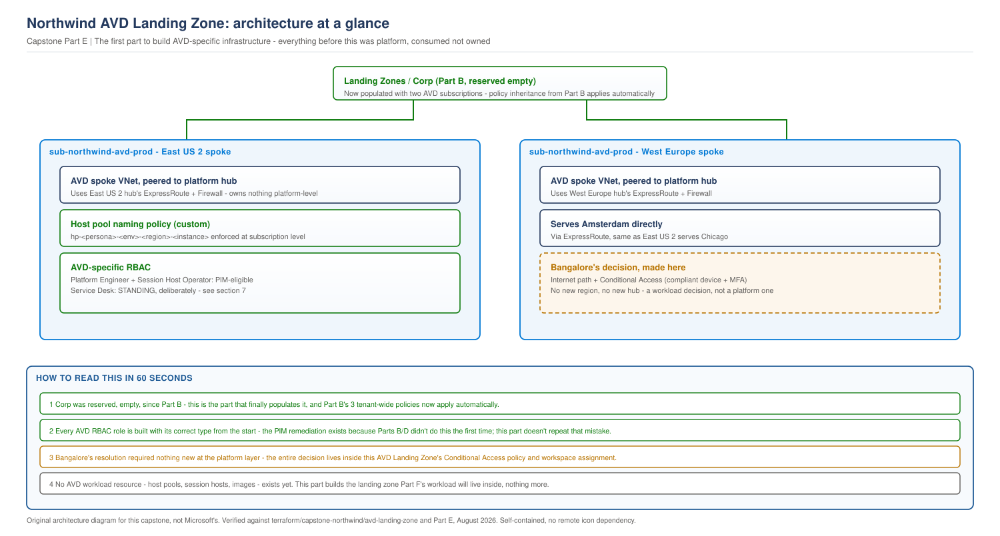

# Northwind Capstone, Part E: Dedicated AVD Landing Zone

> **Part of:** [Northwind Capstone Master Plan](../../appendices/capstone-northwind-master-plan.md)
> **Sequence:** Part E of A-H. The first part to build AVD-specific infrastructure - everything before this has been platform, consumed but never owned by AVD.
> **Terraform:** [`terraform/capstone-northwind/avd-landing-zone/`](../../terraform/capstone-northwind/avd-landing-zone/)
> **Diagram:** [`capstone-avd-landing-zone.svg`](../../diagrams/architecture/capstone-avd-landing-zone.svg)
> **Status discipline:** every component below is tagged with exactly one of **Architecturally designed** / **Terraform implemented** / **Structurally validated** / **Requires live Azure validation** / **Business/compliance decision required**, per the standing rule applied from this part forward. Consult the [implementation tracker](../implementation-tracker.md) before assuming any Part A-D item is further along than it states.

---

## 0. Scope discipline, and what this part inherits without re-checking

This is the first part that gets to build something with "AVD" in its name. Everything it consumes - the platform hubs, the domain controllers, the Key Vault, the monitoring workspace, the PIM-eligible platform roles - was built in Parts B-D, and this part does not re-validate any of it. It does, however, respect the tracker's dependency warnings exactly as stated: the monitoring workspace exists but its policy isn't re-applied yet; the Connect Sync server exists but isn't configured yet; PIM is real for platform roles but untested against a live subscription. Part E's own new components do not inherit a false sense of completeness from any of that.

---

## 1. Traceability: Part A through Part E

| Requirement | Part | Part E's consequence |
|---|---|---|
| BR-02 (three sites), section 11 (regional strategy requirement) | A | Bangalore's connectivity is finally decided here - section 4 |
| C-01/C-02 (two regions, no third ExpressRoute) | A | Directly constrains section 4's options |
| TR-05 (platform/workload ownership never mixed) | A | Section 2's ownership table is this principle's concrete test at the AVD layer specifically |
| Principle 6 (no component without a stated reason) | A | Applied to every policy and role in sections 5-6 |
| Chapter 12's Corp landing zone guidance | B | Section 3 places the AVD subscriptions inside the `Corp` node Part B reserved, empty, for exactly this |
| The PIM remediation | Remediation | Section 6's roles are built correctly from the start - no role here is called "PIM-eligible" without the actual resource backing it |

---

## 2. What lives in the AVD Landing Zone, and what does not - now built, not just tabled

Part B's original version of this table was a design intention. This is the same table, now checked against what section 7 actually delivers:

| Lives in the AVD Landing Zone | Status | Lives in the Platform, consumed not owned |
|---|---|---|
| `sub-northwind-avd-prod`, `sub-northwind-avd-nonprod` | **Terraform implemented** (subscription association only - see section 3) | Domain controllers, Connect Sync servers - `platform/identity` |
| AVD network spokes, both regions | **Terraform implemented** | Hub VNets, ExpressRoute, Firewall - `platform/connectivity` |
| AVD-specific Azure Policy (naming, session host baseline) | **Terraform implemented** | Tenant-wide tag/region/diagnostic policy - `platform/policy` |
| AVD-specific RBAC (Session Host Operator, Service Desk, End User) | **Terraform implemented** | Platform Engineer, Identity/Network/Security Administrators - `platform/rbac` |
| Bangalore's Conditional Access policy | **Architecturally designed**, **Requires live Azure validation** for the actual CA policy object | N/A - this is a genuinely new, workload-layer control with no platform equivalent |

---

## 3. AVD Landing Zone subscriptions

**Requirement.** Part B, section 2.2, named `sub-northwind-avd-prod` and `sub-northwind-avd-nonprod` but explicitly did not create them - "creating them now, before Part E has designed what actually needs to live in them, would mean building workload infrastructure ahead of the workload design."

**Status: Terraform implemented (association only), Business/compliance decision required (the subscriptions' actual existence).** Exactly like Part B's three platform subscriptions, this design assumes the two AVD subscriptions already exist as billing entities - created through Northwind's Enterprise Agreement or Microsoft Customer Agreement, not by Terraform. What this part's Terraform does is the same thing Part B's `management-groups` module did: take existing subscription IDs as input and associate them into `Landing Zones/Corp`, the empty node Part B reserved for exactly this.

**The moment this makes Part B's policy inheritance real, not theoretical.** Part D's diagram made a specific claim: "Part E's future AVD subscriptions get all 3 Part B policies with zero new policy work required." This is the section where that claim is actually tested - once these two subscriptions are associated into `Corp`, the tag, region, and diagnostic-settings policies from `platform/policy` apply to them automatically, by Azure Resource Manager's own inheritance mechanism, not by anything this part has to do again.

---

## 4. Bangalore's connectivity: decided

**Requirement.** Part A section 11, Part C section 6 - both deferred this explicitly to "once the AVD Landing Zone's network spokes exist to connect into." They now do (section 5).

**Options considered, restated with the actual AVD Landing Zone now in view, not abstractly.**
- **Option A: internet-based access to the West Europe AVD spoke's workspace, secured by Conditional Access requiring a compliant device and MFA.** No new platform region, no new hub, no new ExpressRoute circuit.
- **Option B: a third platform region dedicated to Bangalore.** Would require reopening Part B and Part C - a new hub, a new subscription, a new domain controller pair - directly against the cost ceiling (BR-05) for a decision that was always going to be made at the workload layer, not the platform layer.

**Decision: Option A.** Bangalore's users connect to the West Europe AVD workspace (built in section 5) over the internet, with a Conditional Access policy requiring a compliant device and multi-factor authentication before the session is granted.

**Status: Architecturally designed. The Conditional Access policy itself: requires live Azure validation** - Conditional Access policies are Entra ID configuration, not something this document models as a fabricated Terraform resource shape it hasn't verified. The decision and its reasoning are settled; the actual policy object, once created, needs to be tested against a real sign-in attempt from a non-compliant device to confirm it actually blocks, not just that it exists.

---

## 5. AVD Landing Zone network spokes

**Requirement.** Section 3's subscriptions need somewhere to put session hosts; TR-05 requires that "somewhere" to be workload-owned, not a new platform hub.

**Decision.** One AVD spoke VNet per region, peered to that region's platform hub (from `platform/connectivity`), following the same spoke pattern Part C's identity module already established - a workload spoke consuming a platform hub, not building its own.

**Status: Terraform implemented, structurally validated (brace-balanced, cross-references checked against the connectivity module's actual outputs). Requires live Azure validation** for the peering actually reaching `Connected` state and for a real host (none exist yet - that's Part F) to prove reachability.

---

## 6. AVD-specific Azure Policy

**Requirement.** Principle 6 - AVD's own naming and session-host baseline needs enforcement narrower than the tenant-wide baseline Part B built, per Part B section 2.5's own stated boundary ("AVD-specific policy... is assigned at the Landing Zones/Corp level or narrower, not tenant-wide").

**Decision.** One policy, assigned at the `sub-northwind-avd-prod` subscription (not the management group - Part B's policies already inherit that far; this is additive, narrower): enforce the `hp-<persona>-<env>-<region>-<instance>` naming pattern already fixed by four existing chapters, so a host pool created outside that convention is rejected at creation, not caught in a later audit.

**Status: Terraform implemented, structurally validated.** No live Azure resource exists to test this against yet - that's Part F's host pools.

---

## 7. AVD-specific RBAC: built correctly from the start

**Requirement.** Part D section 4's explicit boundary: "AVD-specific operational roles... are not defined here... Part E's job."

**The lesson this section deliberately applies, not repeats.** The PIM remediation exists because Parts B and D described roles as PIM-eligible without the Terraform to back it. This section does not make that mistake a third time: every role below is built with the correct resource type from the start, checked against what it actually needs.

| Role | Scope | Type, decided deliberately | Reasoning |
|---|---|---|---|
| AVD Platform Engineer | `sub-northwind-avd-prod` | `azurerm_pim_eligible_role_assignment` | Can change host pool configuration - real blast radius, matches the same reasoning as the platform's own Identity/Network Administrator roles |
| Session Host Operator | `sub-northwind-avd-prod`, scoped to session host resources | `azurerm_pim_eligible_role_assignment` | Day-2 operational access (restart, drain), not permanent - activation-on-demand is the right model |
| Service Desk | AVD application groups only | **Standing `azurerm_role_assignment`, deliberately, not PIM-eligible** | A service desk agent disconnecting a stuck session is a high-frequency, low-blast-radius action - the same proportionality reasoning [Project 03](../../scenarios/project-03-global-enterprise-governance.md) already established for exactly this role. Forcing activation friction onto a high-frequency task creates the workaround pressure that undermines PIM everywhere else, the same risk Part D section 4 already named for a different role. |
| End User | Individual application groups, via `platform/rbac`'s non-overlapping group model once Part F assigns personas | **Standing**, correctly - a user does not "activate" the ability to use their own desktop | Stated so plainly no reader mistakes this for an oversight the way the platform roles' standing-vs-PIM status once was |

**Status: Terraform implemented, structurally validated.** No live Azure validation yet - no host pool exists for these roles to actually govern access to (Part F).

---

## 8. Failure and governance scenarios specific to this part

**Scenario: Bangalore's Conditional Access policy is misconfigured and blocks legitimate compliant devices.** This design's mitigation is not prevention - CA policy testing before enforcement is standard Microsoft guidance - but a clear rollback path: the policy is workload-scoped (this AVD workspace specifically), not tenant-wide, so a misconfiguration's blast radius is contained to Bangalore's access path, not every Conditional Access-governed resource in the tenant.

**Scenario: the two AVD subscriptions are associated into `Corp` before their own policy (section 6) is applied.** Part B's tenant-wide policies apply automatically on association (section 3) - the AVD-specific naming policy does not, since it's a separate, narrower assignment. A host pool could theoretically be created in the gap between association and this section's policy being applied. Mitigated by sequencing: this document states the naming policy is applied as part of the same change that associates the subscriptions, not a later, separable step - stated as a sequencing requirement, not assumed automatic.

---

## 9. Architecture at a glance

> **OUR ORIGINAL ARCHITECTURE DIAGRAM.** Created for this capstone. Not a Microsoft diagram.
> Editable source: [`capstone-avd-landing-zone.drawio`](../../diagrams/architecture/capstone-avd-landing-zone.drawio)

---

## 10. Terraform delivered, with status per file

| File | Status |
|---|---|
| `avd-landing-zone/network-spokes/` - subscription associations, spoke VNets, peering | Terraform implemented, structurally validated |
| `avd-landing-zone/policy/` - naming policy assignment | Terraform implemented, structurally validated |
| `avd-landing-zone/rbac/` - four AVD-specific roles, correctly typed from the start | Terraform implemented, structurally validated |
| Bangalore's Conditional Access policy | **Not Terraform** - Entra ID/Graph configuration, matching this book's standing rule for CA policies, marked for live validation, not modelled with an invented resource shape |

> This Terraform has not been run against a live Azure subscription.

---

## 11. What Part E validates, and what remains

**Validated:** every decision traced to a Part A-D requirement or an explicitly-deferred question from an earlier part, checked against the actual source document. The RBAC table built with the PIM lesson applied deliberately, not by accident. The diagram rendered, inspected, and corrected before inclusion.

**Not yet done:** the actual Conditional Access policy object. Live validation of the subscription association actually inheriting Part B's policies. AVD platform infrastructure itself - host pools, images, FSLogix - correctly deferred to Part F, which is what this Landing Zone now exists to receive.

---

## What comes next

[Part F - AVD Platform Architecture](../../appendices/capstone-northwind-master-plan.md#part-f---avd-platform-architecture) builds the first actual AVD resource - host pools - inside the subscriptions and spokes this part built, governed by the policy and RBAC this part put in place before any workload resource existed to need them.
