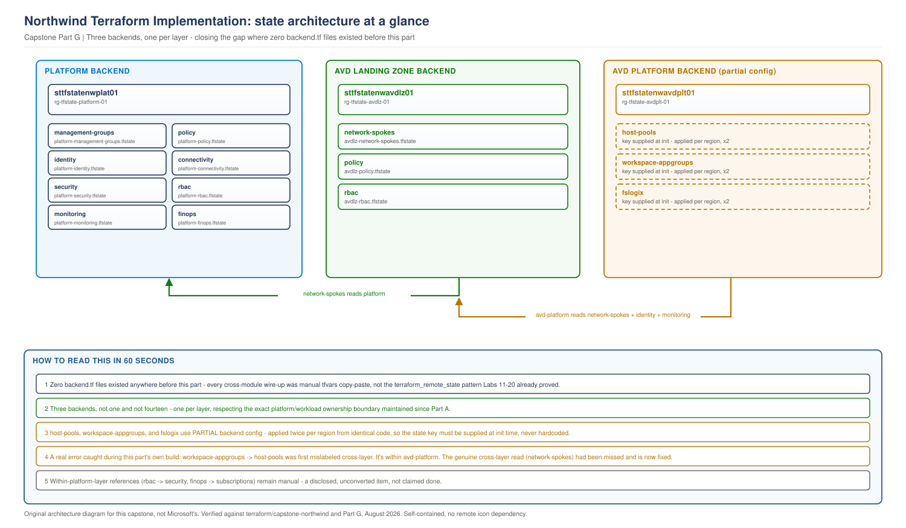

# Northwind Capstone, Part G: Implementation with Terraform

> **Part of:** [Northwind Capstone Master Plan](../../appendices/capstone-northwind-master-plan.md)
> **Sequence:** Part G of A-H. Not new AVD infrastructure - this part audits and completes the module structure and remote-state strategy that Parts B-F's actual builds have been running on.
> **Status discipline:** every claim tagged **Architecturally designed** / **Terraform implemented** / **Structurally validated** / **Requires live Azure validation** / **Business/compliance decision required**.

---

## 0. What this part found by inspecting the repository first

Before writing anything, this part checked whether the master plan's Part G design (G1: layered module structure, G2: one remote-state backend per layer) actually matches what Parts B-F built. It mostly does, with two real, honest exceptions - found by inspection, not assumed:

**G1, module structure - matches, with one naming deviation.** The master plan's proposed tree names `host-pools-eastus2/` and `host-pools-westeurope/` as separate directories. What was actually built is **one** `host-pools/` module, applied twice with different `terraform.tfvars` files - the same explicit-repetition pattern this book has used since Labs 11-20, and arguably a better fit for G1's own stated principle (one reviewable module, not two copies that can drift). Noted as a deliberate, reasoned deviation, not a defect. The `platform/security` module also exists as its own directory - not explicitly named in the master plan's proposed tree, but a direct, necessary consequence of the Part D remediation.

**G2, remote-state strategy - designed, but not implemented anywhere until this part.** This is the real finding. **Zero `backend.tf` files exist across all 14 modules built in Parts B-F.** Every cross-module dependency so far has been wired by manually copying a `terraform output` value into the next module's `terraform.tfvars` - functional, but not the scriptable `terraform_remote_state` mechanism this book proved out in Labs 11-20, and not what the master plan's G2 actually specifies. This part closes that gap - not by claiming it was already done, but by building it now.

---

## 1. The three-backend strategy

**Requirement.** The master plan's G2: one remote-state backend per layer, not per module within a layer, mirroring Labs 11-20's proven pattern where many labs share one storage account, differentiated by state key.

**Decision.** Three storage accounts, one per layer, respecting the exact platform/workload ownership boundary this capstone has maintained since Part A:

| Layer | Backend storage account | Resource group | Owned by |
|---|---|---|---|
| Platform | `sttfstatenwplat01` | `rg-tfstate-platform-01` | Platform team |
| AVD Landing Zone | `sttfstatenwavdlz01` | `rg-tfstate-avdlz-01` | AVD Platform Engineer role |
| AVD Platform | `sttfstatenwavdplt01` | `rg-tfstate-avdplt-01` | AVD Platform Engineer role |

**Why three, not one, and not fourteen.** One shared backend for everything would mean the AVD platform team's routine state operations could, in principle, touch the same storage account as identity and connectivity state - the exact blast-radius mixing Part B's subscription split exists to prevent, now reappearing one layer down if left unaddressed. Fourteen separate backends (one per module) would technically work but adds real operational overhead - a credential and access grant to manage per module - for boundaries that don't need to exist within a single team's own layer.

**Status: Architecturally designed, Terraform implemented (the backend blocks), Requires live Azure validation** - these storage accounts must actually be created and their access-controlled before any `terraform init` against them succeeds; this part does not claim that has happened.

---

## 2. Remote-state cross-referencing: what was converted, and what wasn't

**Requirement.** The master plan's G2, applying Labs 11-20's proven `data "terraform_remote_state"` mechanism in place of manual tfvars copy-paste.

**Decision, scoped honestly rather than claimed complete everywhere at once.** This part converts the cross-**layer** dependencies - the architecturally significant boundary this whole capstone has been built around - to real `terraform_remote_state` data sources:

| Consumer | Now reads via remote state from | Previously |
|---|---|---|
| `avd-platform/host-pools` | `avd-landing-zone/network-spokes` (subnet, resource group), `platform/identity` (DC IPs), `platform/monitoring` (workspace ID) | Manual tfvars copy-paste |
| `avd-platform/workspace-appgroups` | `avd-landing-zone/network-spokes` (resource group - the genuine cross-layer dependency) **and**, within the same `avd-platform` layer, `avd-platform/host-pools` (host pool IDs) | Manual tfvars copy-paste |
| `avd-platform/fslogix` | `avd-landing-zone/network-spokes` (subnet, resource group) | Manual tfvars copy-paste |
| `avd-landing-zone/network-spokes` | `platform/management-groups` (Corp management group ID), `platform/connectivity` (hub VNet IDs, resource groups, names) | Manual tfvars copy-paste |

**A correction made during this part's own build, not after.** The first draft of this table listed `workspace-appgroups → host-pools` as a cross-layer conversion. It isn't - both modules live in the `avd-platform` layer, so that reference is within-layer. The genuinely cross-layer dependency this module has - `avd_resource_group`, sourced from `avd-landing-zone/network-spokes` - had been missed. Both are now correctly converted, and the table above reflects the actual code, not the first draft's claim about it.

**What was not converted, disclosed rather than silently left inconsistent.** Within-layer references inside the platform layer itself (for example, `platform/rbac` reading `platform/security`'s Key Vault ID, or `platform/finops` reading subscription IDs) still use the manual-variable pattern from Parts B-D. This is a real, remaining mechanical task - not claimed as done here. The cross-layer conversions above were prioritised because they demonstrate the principle the master plan actually cares about (platform and workload, cleanly separated, even in how their Terraform talks to each other); converting every within-layer reference too is valuable but not the point this part exists to prove.

**Status: Terraform implemented (the four conversions above), structurally validated. Requires live Azure validation** for the actual cross-backend state reads to succeed against real deployed state.

---

## 3. Architecture at a glance

> **OUR ORIGINAL ARCHITECTURE DIAGRAM.** Created for this capstone. Not a Microsoft diagram.
> Editable source: [`capstone-terraform-state-architecture.drawio`](../../diagrams/architecture/capstone-terraform-state-architecture.drawio)

---

## 4. What Part G validates, and what remains

**Validated:** every module's `backend.tf` checked for internal consistency (correct key naming, no two modules in the same layer sharing a key). The four converted `terraform_remote_state` data sources checked against the actual, current outputs of the modules they read from - not assumed to still match after Parts B-F's own edits.

**Not yet done, stated plainly:** the three backend storage accounts do not exist yet - this is Terraform that describes where state should live, not a live deployment of that state infrastructure. Within-layer remote-state conversions (noted in section 2) remain a disclosed, unconverted item. No `terraform init` has been run against any of this.

---

## What comes next

[Part H - Operations, DR, Monitoring and FinOps](../../appendices/capstone-northwind-master-plan.md#part-h---operations-dr-monitoring-and-finops) is the final part - autoscaling, HA/DR, the real cost model, and the closing report that gives every item in the implementation tracker its final disposition.
