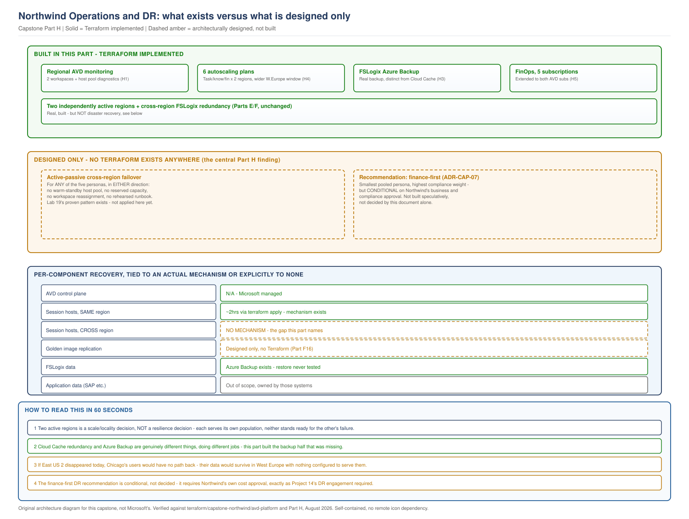

# Northwind Capstone, Part H: Operations, DR, Monitoring and FinOps

> **Part of:** [Northwind Capstone Master Plan](../../appendices/capstone-northwind-master-plan.md)
> **Sequence:** Part H of A-H. The final part. Closes the operational readiness gaps this capstone has carried since Part F, without claiming more than what Parts A-G's actual repository state supports.
> **Terraform:** [`terraform/capstone-northwind/avd-platform/{monitoring,autoscaling,backup}/`](../../terraform/capstone-northwind/avd-platform/), [`terraform/capstone-northwind/platform/finops/`](../../terraform/capstone-northwind/platform/finops/)
> **Diagram:** [`capstone-operations-dr-architecture.svg`](../../diagrams/architecture/capstone-operations-dr-architecture.svg)
> **Status discipline:** every claim tagged **Architecturally designed** / **Terraform implemented** / **Structurally validated** / **Requires live Azure validation** / **Business/compliance decision required**.

---

## 0. What this part found by inspecting the repository first

Before writing anything, this part checked what Parts A-G's actual Terraform supports, not what the master plan's H1-H8 outline assumed would exist by this point. Two findings shaped everything that follows:

**No active-passive DR infrastructure exists anywhere in this capstone.** Confirmed by grep, not assumed: zero references to a warm-standby pattern, a `deploy_active`-style toggle, or any cross-region failover target across all Terraform built in Parts B-G. The master plan's H2 describes "active-passive cross-region relationship" as though it were already the design in place. It is the *intended* design - Part F's own document even invokes "active-passive reasoning" by name - but no infrastructure implements it. Section 3 below treats this as the central finding of this part, not a footnote.

**Cloud Cache has been carrying redundancy and backup responsibilities that are not the same thing.** Part F's FSLogix design gives Northwind cross-region storage redundancy. Nothing in Parts A-G built actual backup - point-in-time, restorable, protected against corruption or deletion propagating to both copies - until this part's H3 work. This is the same finding [Project 14](../../scenarios/project-14-disaster-recovery.md) already documented for a different customer, now found and corrected here rather than assumed already handled because "the data is protected" sounds true either way.

---

## 1. Traceability: Part A through Part H

| Requirement | Earlier part | Part H's consequence |
|---|---|---|
| A6: 99.5% availability, quantified as 43.8 hours/year permitted downtime | A | Section 2's RTO targets are checked against this number, not chosen to sound appropriately serious |
| C-01/C-02: two regions, cost ceiling | A/C | Directly constrains what DR investment section 3 can recommend |
| Part F9's Cloud Cache design (redundancy, not backup, and why) | F | Section 4's backup work is the concrete completion of that distinction, not a restatement of it |
| "Explicitly Part H's scope" for autoscaling | F (tracker) | Section 5, now built |
| Part B section 2.9 / 6's deferred FinOps rollup | B | Section 6, now extended to the AVD subscriptions |
| Project 14's per-component RTO/RPO method and backup-vs-redundancy distinction | Existing project | Applied directly to Northwind in sections 2-4, not re-derived |
| Project 15's 10-layer troubleshooting method | Existing project | Applied to two real Northwind-specific scenarios in section 7 |

---

## 2. High availability and disaster recovery, precisely distinguished

This section exists because "two active regions" and "a tested DR solution" are not the same claim, and this capstone's own prior documents have come close to blurring them. Six distinct things, stated separately, not as synonyms for each other:

### 2.1 Existing multi-region active architecture

**Status: Terraform implemented, structurally validated.** East US 2 and West Europe each run their own independent set of ten host pools, serving their own assigned population (Chicago; Amsterdam and Bangalore). This is real, built infrastructure - Parts E and F. It is a *scale and locality* decision, not a *resilience* decision: each region exists to serve its own users well, not to stand ready for the other region's users if that region fails.

### 2.2 Service availability

**Status: Architecturally designed. Requires live Azure validation.** Within each region, session hosts and storage are intended to be zone-redundant (Chapter 17/20's existing guidance, referenced but not independently re-verified as actually configured in Part F's Terraform for every resource type - a gap worth naming rather than assuming closed). This protects against a single availability zone failing. It does nothing if the region itself becomes unavailable.

### 2.3 Data redundancy

**Status: Terraform implemented, structurally validated.** FSLogix storage uses ZRS within each region (zone redundancy) and Cloud Cache across regions (Part F9). This is real protection against a single zone or a single region's storage account failing outright. **It is not disaster recovery**, and section 2.4 states exactly why not.

### 2.4 Actual disaster recovery capability

**Status: This is the finding, stated as a gap, not a completed capability.** Disaster recovery means a defined, tested path to restore service after the *primary way of serving a population* becomes unavailable - not just its data, its compute and identity path too. Today, if East US 2 became entirely unavailable, Chicago's 1,400+ users have **no standing alternative host pool, no pre-positioned capacity, and no rehearsed runbook** to fail over to. The data (FSLogix profiles) would survive, via Cloud Cache replication to West Europe - but there is nothing in West Europe today that expects to serve Chicago's users, no host pool scoped for them, no capacity reserved, no DNS or workspace assignment ready to redirect them. Redundant data with no compute path to reach it is not disaster recovery.

### 2.5 Active-passive recovery capacity

**Status: Architecturally designed only. Not implemented for Northwind.** The proposed pattern uses a standby pool in the alternate region, based on the design exercise in [Lab 19](../../labs/lab-19-disaster-recovery-failover.md). Lab 19 provides implementation and validation steps; this repository does not claim a timed Northwind failover test.

### 2.6 Recommended future DR investment, conditional, not decided here

**Status: Business/compliance decision required.** Building Lab 19's pattern for all five personas, in both directions, would mean ten additional warm-standby host pools (a near-doubling of Part F's already-built footprint) - a real cost this document does not have authority to commit Northwind to. The recommendation: **finance first**, if and only if Northwind's business and compliance stakeholders confirm the investment is justified. Finance is the smallest pooled persona (250 users, one region's worth is a fraction of task or knowledge workers' footprint), carries the SOX-relevant compliance weight that makes downtime costliest to justify after the fact, and already has a partially-differentiated storage story (ADR-CAP-06) that a DR conversation would naturally extend. This is a recommendation with a stated rationale, not a decision - it requires Northwind's own sign-off on cost, exactly as Project 14's DR engagement required its own customer's explicit approval before building anything, not assumed as self-evidently correct because a book chapter suggested it.

### 2.7 Per-component RTO/RPO, tied to an actual mechanism or explicitly to none

Following Project 14's exact method - one number for "AVD" is meaningless, because different components recover through different mechanisms with different acceptable loss.

| Component | RTO | RPO | Actual recovery mechanism | Status |
|---|---|---|---|---|
| AVD control plane | N/A | N/A | Microsoft-managed SLA, not Northwind's design problem | N/A |
| Session hosts, host pool | ~2 hours, *if* rebuilt via Terraform in a surviving region | N/A, stateless | `terraform apply` against Part F's `host-pools` module, in the *same* region only - **no mechanism exists to rebuild a region's population's hosts in the other region** | Terraform implemented for same-region rebuild; **no mechanism for cross-region rebuild (section 2.4)** |
| Golden image | Would need to already exist in both regions | 0, if pre-replicated | Azure Compute Gallery multi-region replication - **architecturally designed, no Terraform built** (tracker, Part F16) | Architecturally designed only |
| FSLogix profile data | Depends on restore method used | Up to 24 hours with the default daily policy (section 4) | Azure Backup, this part's section 4 - **restore path is a portal/CLI action, not yet scripted, and has never been tested against a real restore** | Terraform implemented (the backup mechanism); **requires live Azure validation for an actual tested restore** |
| Cross-region compute failover for any persona | Undefined - no target exists | N/A | None currently exists (section 2.4/2.5) | **No mechanism - the central gap this section names** |
| Application data (SAP, LOB systems) | Outside AVD's scope | Outside AVD's scope | Owned by those systems' own DR plans, which this platform's plan references but does not duplicate | Out of scope, by design |

**What this table is for.** A reader should be able to point at any row and know whether recovering that component today means running a command, or means there is currently nothing to run. Rows 2 (cross-region), 3, and the cross-region failover row are the honest, load-bearing gaps this part surfaces rather than closes.

---

## 3. Backup and recovery boundaries

**Status: Terraform implemented (the mechanism), structurally validated. Requires live Azure validation for an actual restore. Business/compliance decision required for retention period.**

Full detail in `terraform/capstone-northwind/avd-platform/backup/`. Restated here at the level a reader needs without opening the Terraform:

### 3.1 What is protected

The FSLogix `profiles` file share in each region's storage account, daily, via Azure Backup's file-share-native protection - a snapshot-based mechanism, not a separate copy requiring the storage account to be readable at restore time the way some backup approaches do.

### 3.2 What is explicitly not protected

Session host OS disks (disposable, rebuilt from image, never restored from backup - Chapter 23's standing principle, unchanged here). The dedicated finance storage account, if Northwind later enables it via ADR-CAP-06's gated option - this backup module was built before that decision and does not yet cover it, a genuine follow-up item, not silently assumed included. Application-level data inside SAP or other LOB systems - out of scope, per section 2.7's table.

### 3.3 Recovery boundaries, stated precisely

A file-share backup restores the **share's contents at the chosen recovery point** - it does not restore a single user's profile in isolation without restoring (or extracting from a restored copy of) the whole share, unless the specific restore tooling used supports item-level recovery, which has not been verified for this configuration. This is a real operational constraint: restoring one user's corrupted profile is not necessarily a quick, isolated action, and the actual procedure has never been exercised.

### 3.4 Restore testing requirement, named as a real gap

**No restore has ever been performed or validated against this backup configuration.** A backup nobody has restored from is a hypothesis, not a capability - stated plainly rather than implied solved by the policy existing. Before this backup can be relied upon operationally, a real restore exercise, timed and documented, is required - the same discipline [Lab 19](../../labs/lab-19-disaster-recovery-failover.md) already established for failover specifically (a real, timed exercise, not a design reviewed and assumed to work).

---

## 4. Autoscaling and capacity strategy

**Status: Terraform implemented, structurally validated.** Full detail in section 5 of the prior status update and `terraform/capstone-northwind/avd-platform/autoscaling/`. Six independent Power Management Autoscale plans, West Europe's window deliberately wider than East US 2's to cover both Amsterdam and Bangalore's business hours across their real timezone gap.

---

## 5. Cost optimization and FinOps

**Status: Terraform implemented, structurally validated. Business/compliance decision required for every budget figure.** `platform/finops` now covers all five subscriptions (three platform, two AVD) - closing the "rolling up into B10" requirement the master plan states. Every figure remains an explicit placeholder: this engagement has never been given Northwind's real on-premises baseline cost, so there is still no real number to check the AVD budgets against, only a mechanism ready to receive one.

---

## 6. Troubleshooting and operational scenarios

Following [Project 15](../../scenarios/project-15-production-troubleshooting.md)'s 10-layer isolation method, applied to two scenarios this capstone's own architecture actually produces - not generic AVD troubleshooting disconnected from what was built.

### Scenario 1: A West Europe task worker reports intermittent sign-in failures, East US 2 users report none

**Layer-by-layer, using this capstone's real components.** Client → network (Bangalore's internet path and Conditional Access, per Part E's ADR - is the failing user in Bangalore, connecting over the internet path, or in Amsterdam, on a materially different path?) → Entra ID sign-in logs (does Conditional Access show a block, specifically checking whether the compliant-device requirement is the actual cause) → West Europe hub Firewall (Part C, egress logging - is West Europe's Firewall instance healthy, distinct from East US 2's) → West Europe domain controllers (Part C, DNS order lists West Europe's DCs primary - are they responding) → West Europe host pool (Part F) → session host (West Europe's `hp-task-prd-weu-01` specifically, not the whole environment).

**Where this capstone's specific design choices actually matter to the diagnosis.** Because Bangalore and Amsterdam share one region and one Conditional Access policy but reach it via genuinely different paths (internet vs. presumably a more direct path, per Part E's ADR), a fault isolated to "West Europe" could still be specific to one sub-population within it - the investigation has to ask *which* West Europe user, not stop at the region.

### Scenario 2: Finance users report a shared drive appears empty after a profile reattach

**Layer-by-layer.** FSLogix event log on the affected session host → the `ERROR_LOCK_VIOLATION`-style failure Lab 15 already documented for a different reason (that lab's was cross-region active-active reattachment; this capstone's finance persona is not active-active, so a lock violation here would point somewhere else) → the RBAC split from ADR-CAP-06 (is the finance-specific group actually applied correctly, or did a user get placed in the wrong group during onboarding, landing them without the NTFS permissions their profile needs) → whether `enable_finance_dedicated_storage` is set inconsistently between what documentation assumes and what is actually deployed (a real, checkable configuration-drift question this capstone's own gated toggle creates, that would not exist in a simpler, non-tiered design).

**Why this scenario is genuinely different from Lab 15's, not a copy.** Lab 15's failure mode was about active-active users legitimately connecting from two regions at once. Northwind's finance users are geography-assigned, not active-active-eligible (Part F9) - so the same *symptom* here should prompt investigating RBAC and storage-toggle configuration first, not cross-region session conflict, which structurally shouldn't be possible in this design. Diagnosing this scenario correctly requires knowing that difference, not pattern-matching the symptom to Lab 15's cause.

---

## 7. Architecture decision records

Five ADRs, per the master plan's H7 requirement, at `capstone/adr/`. ADR-CAP-01 and ADR-CAP-06 already existed; the following three are new in this part, numbered to avoid collision:

- **ADR-CAP-02:** Hub-and-spoke, not Virtual WAN (already reasoned in Part C, formalized as a standalone ADR here)
- **ADR-CAP-03:** Bangalore served via internet path, not a dedicated platform region (already reasoned in Part E, formalized here)
- **ADR-CAP-04:** Standard host-pool management, not Session Host Configuration (already reasoned via the existing book-wide ADR and Part F8, formalized as a capstone-specific ADR here)
- **ADR-CAP-05:** Separate platform and AVD Landing Zone subscriptions (already reasoned in Part B/E, formalized here)
- **ADR-CAP-07:** No active-passive DR capability currently exists; recommend finance-first investment, conditional on approval (this part's own finding, section 2, formalized as a decision record)

Each is a genuine document, not a restatement - see `capstone/adr/`.

---

## 8. Senior Architect interview scenarios

Grounded in what this capstone actually built and found, not generic AVD interview content:

**1. "You built two active regions for Northwind. Is that your disaster recovery plan?"**
No, and conflating the two is exactly the mistake this capstone's own Part H review caught and corrected. Two active regions is a scale and locality decision - each serves its own assigned population well. Neither region has any standing capacity, runbook, or rehearsed path to serve the *other* region's population if it fails. That gap is named explicitly in this design (section 2.4), not glossed over, and the recommended fix (Lab 19's proven warm-standby pattern, finance first) is conditional on the customer approving the cost, not built speculatively.

**2. "Your FSLogix storage replicates across regions. Isn't that your backup?"**
It's redundancy, not backup, and the distinction is the one [Project 14](../../scenarios/project-14-disaster-recovery.md) is built entirely around. Redundancy protects against one copy failing while a healthy copy exists elsewhere. It does nothing against corruption or deletion that propagates to every copy, and it provides no point-in-time restore. This capstone had exactly that gap until Part H specifically closed it with real Azure Backup Terraform - found by checking, not assumed already covered because "the data is replicated" sounds protected.

**3. "Walk me through what actually happens if East US 2 disappears right now."**
Chicago's users lose access entirely - there is no mechanism to rebuild their compute path in West Europe today. Their profile data survives via Cloud Cache, replicated into West Europe's storage, but nothing in West Europe is configured to serve them: no host pool scoped for their persona there, no capacity, no workspace assignment pointed at them. Redundant data with no compute path to reach it is not a working recovery - that's precisely why section 2.4 states this as a gap, not a mitigated risk.

**4. "Why finance first, and why is that only a recommendation, not something you built?"**
Finance is the smallest pooled persona, carries the compliance weight that makes an outage costliest to justify after the fact, and already has a partially-differentiated story via the storage isolation ADR - a DR conversation extends naturally from ground already covered. It's a recommendation, not a decision, because building it for real means roughly doubling Part F's footprint for that persona, a genuine cost commitment only Northwind's own stakeholders can approve - the same discipline Project 14's DR engagement required explicit customer sign-off for, not something an architecture document commits an organization to unilaterally.

**5. "How would you actually validate that a restore from your Azure Backup configuration works?"**
I'd say plainly that it hasn't been validated yet, because it hasn't - a backup nobody has restored from is a hypothesis. The next concrete step is a real, timed restore exercise against a non-production copy of the share, documented with the actual recovery time observed, following the same discipline Lab 19 already established for DR failover specifically: a rehearsed exercise with a recorded result, not a design reviewed on paper and assumed to work.

**6. "Defend the management group and subscription structure - why not one subscription for everything?"**
Blast radius. A single subscription means a misconfigured policy or a compromised credential in the AVD workload can reach identity, connectivity, and every platform capability at once. Splitting them, as Part B did from Project 03's proven pattern, means the AVD team's routine mistakes stay contained to the AVD team's own subscriptions - a real, checkable property, not a compliance-sounding gesture.

**7. "Where exactly does the enterprise landing zone end and the AVD landing zone begin?"**
The enterprise landing zone is Parts B-D: the management group hierarchy, the three platform subscriptions, and the governance baseline every current and future workload inherits automatically. The AVD Landing Zone is Part E: the two AVD subscriptions, associated into the `Corp` node the platform reserved empty for exactly this, consuming platform identity and connectivity without owning any of it. The test that actually proves the boundary is real, not just a diagram convention: Part E's AVD-specific policies and RBAC are scoped narrower than the platform's, at the AVD subscription level - if they'd needed to reach up into the management group to work, the boundary wouldn't be real.

---

## 9. Architecture at a glance

> **OUR ORIGINAL ARCHITECTURE DIAGRAM.** Created for this capstone. Not a Microsoft diagram.
> Editable source: [`capstone-operations-dr-architecture.drawio`](../../diagrams/architecture/capstone-operations-dr-architecture.drawio)

---

## 10. What Part H validates, and what remains

**Validated:** every Terraform claim in this part checked against the actual files in `terraform/capstone-northwind/avd-platform/{monitoring,autoscaling,backup}/` and `platform/finops/`, not asserted from the plan. The zero-DR-infrastructure finding confirmed by direct grep across the entire capstone tree before this part's design work began. The Azure Backup schema checked against a real, published example, catching one real error (vault resource group, not storage account resource group) before the module was considered complete.

**Not yet done, stated as this part's own honest closing account:** no active-passive DR capability exists for any persona - designed, not built, pending a business decision this document does not have authority to make. No restore from the new Azure Backup configuration has ever been tested. Golden image replication (Part F16) remains undelivered. Zone-redundancy configuration within each region has not been independently re-verified as actually applied to every relevant resource type in Part F's Terraform.

---

## What comes next

Part H is the final part of the master plan's A-H sequence. What remains is the end-to-end audit across all eight parts - a separate, independent verification pass, not an extension of this part's own self-review, per the explicit instruction governing how this capstone closes.
