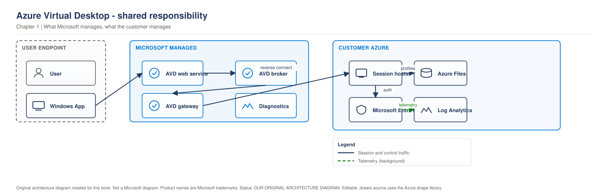

# Chapter 1 - What Azure Virtual Desktop Actually Is (and What It Is Not)

> **Book:** Azure Virtual Desktop - Architect to Hands-on Implementation
> **Part I:** AVD Fundamentals and the Architect's Mental Model
> **Technical baseline:** August 2026

---

## Chapter Information

| Item | Detail |
|---|---|
| **Chapter number** | 1 |
| **Objective** | Understand what AVD is as a service, what Microsoft runs, what you run, and when AVD is the wrong answer |
| **Prerequisites** | Basic Azure knowledge (subscriptions, resource groups, virtual machines). No AVD experience needed |
| **Dependencies** | None. This is the entry point |
| **Estimated lab time** | 0 minutes (no lab in this chapter - Lab 1 starts in Chapter 2) |
| **Azure resources required** | None. Reading only. No cost |

---

## What You Will Learn

- The actual problem AVD was built to solve, explained from first principles
- What Azure Virtual Desktop is as a service, and what it is *not*
- The split between Microsoft-managed and customer-managed components
- How AVD got here: RDS → WVD → AVD → today's platform
- How AVD compares to Windows 365, Citrix DaaS, and traditional on-premises VDI
- How AVD licensing works at a level you can explain in an interview
- When an architect should recommend **against** AVD
- The Northwind Global capstone customer you will design for across the whole book

---

## Why This Matters

Most engineers learn AVD by clicking through the Azure portal. They create a host pool, add session hosts, publish a desktop, and it works. Then a real project starts and the questions change:

- "Why is logon taking 90 seconds?"
- "Can we run this without any inbound internet access to the session hosts?"
- "We already pay for Microsoft 365 E3 - do we need extra licences?"
- "Should we use AVD or Windows 365 for these 400 contractors?"
- "The desktops are up but nobody can connect. Whose problem is it - ours or Microsoft's?"

Every one of those is an architecture question, not a portal question. And that last one is the important one. You cannot troubleshoot or design a service properly until you know exactly where Microsoft's responsibility ends and yours begins.

That is what this chapter builds. Everything else in the book sits on top of it.

---

## 1. The Problem AVD Solves

Start with the business problem, not the technology.

An organisation needs to give people a Windows desktop and a set of Windows applications. Simple enough. Now add real-world constraints:

- People work from home, from offices, from airports, from personal laptops.
- Some applications only run on Windows and cannot be rewritten.
- Data cannot be allowed to sit on a laptop that might be stolen.
- Contractors need access for three months and then need it removed cleanly.
- The company acquired another business and needs 600 more desktops in six weeks.
- Auditors want to know exactly who accessed what and from where.

Handing everyone a managed laptop solves some of this and fails at the rest. The data still lands on the endpoint. Onboarding takes days. Acquisitions take months. And an application that needs to sit next to a database in a datacentre performs badly over a home broadband connection.

The traditional answer was VDI: run the Windows desktops centrally, and stream only the screen to the user. That works, and it has worked for twenty years. But classic on-premises VDI has its own bill attached:

- You buy hardware for your **peak** capacity and it sits idle the rest of the time.
- You run and patch the broker, gateway, licensing and connection infrastructure yourself.
- Scaling up means a purchase order and a lead time, not a command.
- High availability means buying the whole thing twice.

AVD's proposition is narrow and specific: **Microsoft runs the hard, boring, always-on parts of a VDI platform for you, and you keep control of the Windows machines and everything inside them.**

That is the sentence to remember. It explains almost every design decision in the rest of this book.

---

## 2. What Azure Virtual Desktop Actually Is

Azure Virtual Desktop is a **desktop and application virtualisation service that runs in Azure**. It gives users access to Windows desktops and Windows applications that are actually running on virtual machines in your Azure subscription.

Two parts, and it matters that you separate them:

**Part one - the service Microsoft runs.** This is the AVD control plane. It handles finding the right virtual machine for a user, brokering the connection, gatewaying the traffic, and holding the configuration objects that describe your environment. You do not deploy it, patch it, scale it, or make it highly available. It is a platform service. You consume it.

**Part two - the infrastructure you run.** The virtual machines that users log into, the network they sit on, the storage that holds user profiles, the Windows operating system, the applications, the antivirus, the patching, the images, the identity. All of that is yours. It is billed to your subscription and it fails when you get it wrong.

Here is the split visually.

> **OUR ORIGINAL ARCHITECTURE DIAGRAM.** Based on the architecture documented by Microsoft. Not a Microsoft image.

> **OUR ORIGINAL ARCHITECTURE DIAGRAM.** Created for this book using the draw.io MCP connector against official Azure icons. Not a Microsoft diagram.
> Editable source: [`ch01-shared-responsibility.drawio`](../diagrams/architecture/ch01-shared-responsibility.drawio)

### Reading the diagram

1. The user's client app talks to the **Microsoft-managed service** first. It does not talk directly to a virtual machine, and it does not need to know that any virtual machine exists.
2. The Microsoft-managed service works out which resources the user is entitled to, picks a suitable session host, and sets up the connection path.
3. The actual Windows session runs on **your** virtual machine, in **your** virtual network, using **your** profile storage and **your** identity system.
4. The screen, keyboard, mouse and redirected devices flow between the two.

The important consequence: **your session hosts never need an inbound connection from the internet.** The session host makes an outbound connection to the AVD service, and the user's session is delivered over that established path. This is called reverse connect, and Chapter 4 pulls it apart properly.

In practical terms this means a correctly designed AVD environment does not expose TCP 3389 to the public internet, and does not need a public IP address on any session host. That single property removes an entire category of attack that on-premises RDS deployments have suffered from for years.

### What AVD is *not*

Being precise here saves you from bad conversations with stakeholders.

- **AVD is not a virtual machine service.** Azure already has one. AVD is the brokering, publishing and access layer on top of virtual machines.
- **AVD is not a fully managed desktop.** Microsoft does not patch your session hosts, manage your image, or fix your application. If you want that model, you want Windows 365 - covered in section 6.
- **AVD is not a licence.** It does not, by itself, entitle a user to Windows. Entitlement comes from a separate licence they already hold. Section 5 covers this.
- **AVD is not free of infrastructure work.** The control plane is free of charge, but everything you run underneath is billed and operated by you.
- **AVD is not automatically cheaper than what you have today.** It can be, with good design. Badly sized, it is comfortably more expensive than the on-premises VDI it replaced.

---

## 3. How AVD Got Here

You need this history for two reasons: interviewers ask, and half the material you will find online is describing an older version of the product.

**Remote Desktop Services (RDS).** The on-premises ancestor. You built and ran everything: Connection Broker, Session Host, Web Access, Gateway, Licensing. Multiple servers, all yours to patch and make highly available. Still supported, still widely deployed, still a perfectly reasonable answer for some workloads.

**Windows Virtual Desktop (WVD), 2019.** Microsoft took the broker, gateway, web access and diagnostics components and ran them as an Azure service. The headline feature was Windows 10 Enterprise multi-session - a Windows client OS that allows several users to have interactive sessions on the same VM at the same time, available only in Azure. Management at this stage was through PowerShell and a separate tenant concept, not through Azure Resource Manager.

**Azure Virtual Desktop, 2021.** The rename came with the change that actually mattered: the service moved onto Azure Resource Manager. Host pools, application groups and workspaces became real Azure resources. That gave the service Azure RBAC, tags, policy, activity logs, ARM templates, Terraform and Bicep support, and normal portal management. This is the version you deploy today.

**The old model is going away.** AVD (classic) - the pre-ARM version - has been closed to new tenants for some time and Microsoft has stated support ends in September 2026. If you find yourself in an environment still running it, migration is not optional and the clock is short. `CURRENCY FLAG - verified August 2026`

**2024-2026: the platform matured into an operations product.** A short list of what changed, because it directly affects how you design today:

| Change | Status as of Aug 2026 | Why an architect cares |
|---|---|---|
| **App Attach** replaced MSIX App Attach | Original MSIX-only feature retired 1 June 2025 | Application delivery design is different now, and supports MSIX, Appx and App-V packages |
| **Session host configuration management** | Available for pooled host pools | The AVD service can create, update, and scale hosts from a stored configuration |
| **Dynamic autoscaling** | Available for pooled pools with session host configuration | Autoscale can create and delete session hosts as well as manage power state |
| **Ephemeral OS disks for session hosts** | Available for pooled host pools with session host configuration | Use only for stateless workloads and design around the documented lifecycle limits |
| **RDP Multipath (redundant TCP)** | GA July 2026 | Connection resilience on unreliable networks |
| **Session hosts via Azure Arc** | Announced May 2026 | Session hosts on other hypervisors or bare metal, managed alongside Azure ones |
| **Windows App replaced the old Windows client** | MSRDC retired March 2026 | Client rollout and support conversations changed |

`CURRENCY FLAG - checked 6 September 2026. Recheck Azure Virtual Desktop prerequisites, host pool management approaches, and What's new before using this table in a design.`

The lesson for an architect is not the feature list. It is that **AVD moves quickly, and any AVD design older than about twelve months should be reviewed rather than trusted.**

---

## 4. Meet the Capstone Customer: Northwind Global Manufacturing

Every chapter in this book uses the same customer. Same users, same regions, same requirements. By the last chapter you will have designed their entire environment and be able to defend it as if you built it.

**Northwind Global Manufacturing**

| Attribute | Detail |
|---|---|
| Users | 3,200 |
| Sites | Chicago (HQ), Amsterdam (EMEA hub), Bangalore (engineering) |
| Identity | On-premises Active Directory synced to Microsoft Entra ID |
| Connectivity | ExpressRoute at Chicago and Amsterdam; internet-only at Bangalore |
| Applications | SAP, a licensed CAD suite, ~40 line-of-business applications |
| Compliance | Financial data in scope for SOX controls |
| Availability target | 99.5% for the desktop service |
| Budget | Must not exceed the current on-premises VDI run cost |

**User personas**

| Persona | Users | Profile |
|---|---|---|
| Task workers | 1,400 | Small application set, high density, shift patterns |
| Knowledge workers | 1,100 | Office apps, Teams, browser-heavy |
| Finance / regulated | 250 | Restricted data, tighter controls, audit requirements |
| Engineers (CAD) | 180 | GPU workloads, large files |
| Developers | 170 | High CPU and memory, local admin needed |
| Executives | 100 | Low volume, high visibility, mobile |

Notice what this list already tells you. Six personas with genuinely different needs means this will not be one host pool. It means at least three different sizing decisions, two identity conversations, and a GPU cost discussion. We have not touched a single Azure resource yet and the shape of the design is already forming.

That is architect thinking: **requirements first, technology second.**

---

## 5. Licensing, Explained Simply

Licensing is where a lot of otherwise strong candidates lose an interview. It is not complicated once you split it into three separate questions.

### Question 1 - Does the user have the right to use AVD?

AVD access rights are **not** purchased as an AVD product for your own employees. They come from a licence the user already holds. If employees already hold eligible Microsoft 365 or Windows licences, they can access Azure Virtual Desktop with no additional service charge, and no separate VDA licence is needed.

Typical qualifying licences include Microsoft 365 E3/E5/F3/Business Premium, and Windows Enterprise E3/E5 or per-user VDA. Always check the current eligible-licence table on the Microsoft pricing page for the specific SKU in front of you rather than working from memory - the list changes.

### Question 2 - What operating system are the session hosts running?

This changes the answer.

- **Windows 10/11 Enterprise multi-session or single-session:** covered by the eligible per-user licence above. No RDS CAL involved.
- **Windows Server session hosts:** an RDS CAL is required. This is a genuinely different licensing path and is a common gap in designs that use Windows Server for cost or application-compatibility reasons.

### Question 3 - Are the users internal or external?

This is the one people miss.

The licence you need depends on whether you are using a Windows client or Windows Server operating system for your session hosts, and whether it is for internal or external commercial purposes. For your own staff and for contractors serving your internal purposes, you buy eligible licences.

For genuinely external users - for example a software vendor selling remote access to its own application to its customers - there is a separate model. Per-user access pricing lets you pay for AVD access rights for external commercial purposes, and you must enrol in it to build a compliant deployment for external users. You pay through your enrolled Azure subscription on top of your virtual machine, storage and other Azure charges, and each billing cycle you only pay for users who actually connected at least once that month.

Two details worth memorising because they come up as follow-up questions:

- If you have internal users with eligible licences, Microsoft recommends giving them access through a separate subscription that is not enrolled in per-user access pricing, to avoid effectively paying twice.
- A per-user access licence is not a replacement for a Windows licence. It grants AVD access rights only, and does not include Microsoft Office, Microsoft Defender XDR, or Universal Print.

### The part people forget

Access rights are only one line of the bill. The bigger line is Azure infrastructure: the session host VMs, their disks, profile storage, networking, and log ingestion. The AVD control plane itself carries no service charge for internal users, but **the environment is not free**. [Project 03](../scenarios/project-03-global-enterprise-governance.md) builds a complete cost model at scale. For now, hold this: *access rights are usually the small number, compute is usually the big number.*

**Northwind applied:** Northwind already runs Microsoft 365 E3 for all 3,200 staff, so AVD access rights are covered with no new purchase. Their CAD suite and SAP have their own licensing which is unaffected by AVD. If they later choose Windows Server session hosts for a specific application group, RDS CALs enter the picture and the design must say so explicitly.

---

## 6. AVD vs Windows 365 vs Citrix DaaS vs On-Premises VDI

This comparison is asked in almost every senior interview, usually as "when would you *not* use AVD?"

Weak answers list features. Strong answers start with the operating model.

### The decision, in one line each

- **AVD** - you want control and elasticity, and you have the skills to run infrastructure.
- **Windows 365** - you want simplicity and predictable per-user cost, and you are willing to give up control and elasticity.
- **Citrix DaaS (or Omnissa Horizon) on Azure** - you need capabilities or an operating model that native AVD does not provide, and you accept extra licence cost and an extra platform to run.
- **On-premises VDI** - data, latency or regulation genuinely will not allow the workload to sit in a public cloud.

### The comparison that matters

| Dimension | AVD | Windows 365 | Citrix DaaS on Azure | On-prem VDI |
|---|---|---|---|---|
| Who manages the broker | Microsoft | Microsoft | Citrix | You |
| Who manages the desktop VM | You | Microsoft (largely) | You | You |
| Multi-session (shared VM) | Yes | No - one VM per user | Yes | Yes |
| Cost model | Consumption (Azure billing) | Fixed price per user per month | Azure consumption **plus** Citrix licences | CapEx plus operations |
| Scale down when idle | Yes, this is a core strength | No - the Cloud PC is always allocated | Yes | No |
| Sizing flexibility | Very high | Fixed SKUs | Very high | High but capped by hardware |
| Operational skill required | Medium to high | Low | High | High |
| Best fit | Variable demand, mixed personas, cost-sensitive at scale | Predictable 1:1 users, small teams, low IT overhead | Complex estates, specific protocol or management needs, existing Citrix skills | Regulatory or latency blockers |

### How to reason about it, not just recite it

The clearest separator is **multi-session plus autoscaling**.

Windows 365 gives each user their own Cloud PC. It is always there, it costs the same whether the user works eight hours or zero, and it is beautifully simple to run. For 40 contractors who each need a reliable desktop and where you have no VDI team, that simplicity is worth real money.

AVD lets ten task workers share one virtual machine, and lets you switch that machine off overnight. For Northwind's 1,400 task workers on shift patterns, that difference is the entire business case. Running 1,400 always-on Cloud PCs would cost far more than a pooled AVD estate that scales down outside shift hours.

But that saving is not free. Somebody has to build the images, manage FSLogix, tune the session limits, watch the autoscaling, and troubleshoot logon performance. AVD trades money for operational effort. **If the customer has no capacity to absorb that effort, AVD will disappoint them regardless of how elegant the architecture is.**

Citrix sits differently again. Nobody should choose it because it is "better than AVD" in the abstract. It is chosen when there is a concrete requirement AVD does not meet - a specific management or protocol capability, a very large mixed estate spanning on-prem and multiple clouds, or an existing team and toolset the business does not want to discard. That is a legitimate decision, and it costs an additional licence layer and an additional platform to operate.

`Note: this book teaches native AVD. Where a third-party platform sits on top of AVD or Azure, it is called out as optional and non-Microsoft.`

---

## 7. When an Architect Should Say No to AVD

Recommending against your own preferred technology is one of the fastest ways to establish credibility with a customer - and with an interviewer.

**Say no, or at least push back hard, when:**

1. **The application is latency-sensitive to the endpoint, not the datacentre.** Real-time control systems, some medical imaging, some trading front-ends. Moving the desktop away from the device can make the experience worse, not better.

2. **The user count is small and the persona is uniform.** Fifty users who each need one always-on desktop and no shared capacity. Windows 365 will likely be cheaper once you count the engineering time AVD needs.

3. **There is no identity foundation.** AVD depends completely on a working, healthy identity platform. If Active Directory is broken, unsynchronised, or nobody owns it, fix identity first. AVD will simply expose the mess at logon time.

4. **The network is not ready.** No reliable path to Azure, no DNS design, unmanaged internet egress. AVD is a network-dependent service and a poor network produces a poor desktop.

5. **The organisation has no capacity to operate it.** No image process, no monitoring, no patching discipline. AVD is a platform, not an appliance.

6. **A hard regulatory or data residency rule blocks it.** Rare, and increasingly rare, but real. Check before designing rather than after.

7. **The real problem is application delivery, not desktop delivery.** If users need three applications and already have managed laptops, publishing three RemoteApps or fixing the applications may be a smaller, cheaper answer than a full desktop estate.

The honest architect position: **AVD is an excellent answer to a specific set of problems, and an expensive answer to problems it was not built for.**

---

## 8. Common Mistakes

These are the ones that show up repeatedly in real projects.

- **Treating AVD as "just VMs."** Teams deploy VMs, install the agent, and skip profiles, images, monitoring and scaling. The environment works for the pilot group and falls apart at 200 users.
- **Assuming Microsoft's management extends further than it does.** Microsoft runs the control plane. Nobody is patching your session hosts unless you built something to do it.
- **Costing the project on compute alone.** Storage, egress, log ingestion, backup and non-production environments are all real numbers.
- **Designing before the personas exist.** One host pool for 3,200 mixed users is not a design, it is a future incident.
- **Copying a blog post from 2023.** Given the App Attach, Session Host Configuration and client changes listed earlier, a lot of published guidance is now describing a product that no longer works that way.
- **Skipping the licensing conversation until deployment.** Windows Server session hosts and external users both have licensing consequences that are painful to discover late.

---

## 9. The Architect's View

Before the next chapter, internalise these four positions. They are the ones you will defend repeatedly.

**AVD is a shared-responsibility service.** Microsoft's half is invisible and reliable. Your half is where every incident you will ever handle comes from. Know the line precisely.

**Reverse connect is a security feature, not a technical footnote.** Being able to say "we do not expose RDP to the internet and our session hosts have no public IP addresses" is one of the strongest points in an AVD business case.

**Multi-session plus autoscaling is the economic engine.** If a design does not exploit both, it is probably paying cloud prices for on-premises behaviour.

**Requirements drive everything.** Personas, network, identity and compliance decide the architecture. Host pool settings are the last thing you choose, not the first.

---

## 10. Interview Preparation

### Q1. What is Azure Virtual Desktop?

**Simple answer**
It is Microsoft's desktop and application virtualisation service in Azure. Microsoft runs the brokering and gateway layer, and you run the Windows virtual machines that users actually log into.

**Strong senior architect answer**
"AVD is a shared-responsibility virtualisation platform. Microsoft operates the control plane - the broker, the gateway, the diagnostics service and the ARM objects that describe the environment - and I don't deploy or maintain any of it. What I own is everything underneath: the session hosts, the image, the network, profile storage, identity and security. The design consequence I care about most is reverse connect. My session hosts open an outbound connection to the service, so I never publish RDP to the internet and I don't need public IPs on hosts. That, plus Windows multi-session and autoscaling, is usually the core of the business case."

**Real-world example**
"On a 3,200-user manufacturing design, the pooled task-worker hosts scale down outside shift hours. That's only possible because profiles are external to the VM and the VM itself is disposable."

**Follow-up you should expect**
"So what happens if the AVD control plane has an outage?"
Answer honestly: existing sessions may survive, but new connections depend on the service. Say that you cannot engineer around a control plane you do not run, so you plan for it in the availability conversation and set expectations with the business rather than promising something you cannot deliver. [Project 13](../scenarios/project-13-multi-region-architecture.md) covers this properly.

**How to say it out loud**
Lead with the responsibility split. Do not open with a feature list - it sounds like you memorised a product page.

---

### Q2. When would you *not* recommend AVD?

**30-second answer**
"When the problem doesn't fit the model. If it's a small number of users who each need one always-on desktop, Windows 365 is simpler and often cheaper. If identity or the network isn't healthy, AVD will just expose that. And if the customer has no capacity to run images, profiles and monitoring, they'll struggle regardless of how good the design is."

**2-minute answer**
Add the reasoning. AVD's value comes from multi-session density and the ability to switch capacity off. If the workload can't use either - 1:1 desktops that run all day - then you're paying AVD's operational overhead without collecting its main saving. Then talk about prerequisites: AVD sits on identity, network and storage, and a weakness in any of the three shows up as a slow or failed logon that users will blame on AVD. Finish with the application-delivery point: sometimes the real requirement is three applications, not a desktop, and RemoteApp or fixing the application is a smaller answer.

**Deep-dive answer**
Work through it as a decision. Requirement, options, trade-offs, decision, reason. Take a 400-user contractor scenario: options are AVD pooled, AVD personal, and Windows 365. Contractors work unpredictable hours, so density is poor and autoscaling saves less than it looks. They need a fixed, simple environment, and the customer's IT team is four people. Windows 365 gives predictable per-user cost and almost no operational load. Recommend Windows 365 - and say explicitly what you traded away: elasticity, sizing flexibility, and the cost advantage you would get at higher density. Naming the trade-off is what makes it a senior answer.

---

### Q3. Does AVD need extra licences if the customer already has Microsoft 365 E3?

**Simple answer**
For internal users on Windows 10/11 multi-session or single-session, an eligible Microsoft 365 or Windows Enterprise licence covers AVD access rights, so no additional AVD licence is needed. Azure infrastructure is still billed normally.

**Where the follow-up goes**
Two directions, and you should raise both before you are asked:
- If session hosts run Windows Server, an RDS CAL is required - that is a different path.
- If the users are genuinely external commercial users, per-user access pricing applies and the subscription must be enrolled for it. Keep internal users on a separate, non-enrolled subscription so you are not paying twice.

**How to say it out loud**
"Three questions: what licence do the users hold, what OS are the session hosts running, and are these internal or external users? The answers decide it." Framing it as three questions signals that you have handled it in the real world.

---

## 11. Practical Exercise

No Azure resources. No cost. Twenty minutes with a notepad.

1. Write one paragraph, in your own words and without looking back at this chapter, describing the split between what Microsoft manages and what you manage in AVD.
2. Take the six Northwind personas. For each, write a single sentence answering: *pooled or personal, and why?* Do not worry about being right - you will check your answers against Chapter 15.
3. Pick your current or most recent employer. Write three reasons AVD would suit them and three reasons it would not.
4. Say the Q2 30-second answer out loud, timed. If it runs over 45 seconds, cut it down. Interview answers are a skill you practise, not a text you read.

---

## 12. Key Takeaways

- AVD is a shared-responsibility service: Microsoft runs the control plane, you run the session hosts and everything they depend on.
- Session hosts connect outbound to the service. No inbound RDP from the internet and no public IPs on hosts - this is a headline security advantage.
- Multi-session plus autoscaling is where AVD's cost advantage comes from. A design that uses neither is probably the wrong design.
- AVD access rights normally come from a licence the user already holds. Windows Server session hosts need RDS CALs, and external commercial users need per-user access pricing.
- Windows 365 wins on simplicity and predictable cost; AVD wins on control, density and elasticity; Citrix is chosen for a specific requirement, not by default.
- The platform changed significantly in 2025-2026. Verify against current Microsoft documentation before trusting any AVD guidance, including this book's.

---

## 13. Official References

- Azure Virtual Desktop documentation - https://learn.microsoft.com/en-us/azure/virtual-desktop/
- What is Azure Virtual Desktop? - https://learn.microsoft.com/en-us/azure/virtual-desktop/overview
- Licensing Azure Virtual Desktop - https://learn.microsoft.com/en-us/azure/virtual-desktop/licensing
- Enroll in per-user access pricing - https://learn.microsoft.com/en-us/azure/virtual-desktop/enroll-per-user-access-pricing
- Azure Virtual Desktop pricing - https://azure.microsoft.com/en-us/pricing/details/virtual-desktop/
- What's new in Azure Virtual Desktop - https://learn.microsoft.com/en-us/azure/virtual-desktop/whats-new
- App Attach setup - https://learn.microsoft.com/en-us/azure/virtual-desktop/app-attach-setup

---

## 10. Production Scenarios

Three real decisions. Each one is a conversation you will have.

### Scenario 1: The 60 user firm that should not use AVD

**Requirement.** An architecture practice with 60 staff wants AVD because a competitor uses it. They have one part time IT contractor. Everyone needs a desktop all day, every day, with CAD software.

**The decision.** Recommend Windows 365 instead, with a scoped AVD pool only if a shared GPU workload appears later.

**Reasoning.** AVD earns its money through multi-session density and switching capacity off. Sixty users who each need a dedicated desktop all day use neither. What is left is the operational load: images, FSLogix, monitoring, scaling, patching. A part time contractor cannot carry that.

**Implementation.** Size Cloud PCs per persona, confirm the CAD software is supported on the chosen SKU, and migrate in two waves.

**What can go wrong.** The customer hears "no" as a lack of capability. Present it as a cost and risk comparison with numbers, not an opinion.

**Validation.** Compare twelve month total cost including estimated engineering hours. If AVD only wins when you value engineering time at zero, the recommendation is sound.

**Business impact.** A 60 user firm avoided an estimated year of unnecessary operational load and a platform two IT staff could not sustain.

**Interview lesson.** Being able to describe a project where you recommended against AVD, with numbers, is one of the strongest answers you can give.

**Architect's lesson.** Recommending against your preferred technology builds more credibility than deploying it.

### Scenario 2: The manufacturer whose business case was wrong

**Requirement.** A manufacturer builds a business case for 2,000 users based on compute cost alone, and claims a 40 percent saving over their existing on-premises VDI.

**The decision.** Rebuild the model before the board sees it.

**Reasoning.** The model omitted profile storage, egress, Log Analytics ingestion, backup, non-production environments and RDS CALs for the Windows Server pool they had quietly assumed. Those lines are not rounding errors.

**Implementation.** Rebuild with every cost line, label every assumption, and produce three cases: conservative, expected and optimistic.

**What can go wrong.** Finding this after approval. The project then has to explain a cost increase, which damages trust in the whole programme.

**Validation.** A finance stakeholder can trace every number to a source and challenge each assumption individually.

**Business impact.** A claimed 40 percent saving that would not have survived the first invoice, presented to a board.

**Interview lesson.** Naming the cost lines people forget, storage, egress, log ingestion and CALs, shows you have built a real business case.

**Architect's lesson.** Compute is the visible cost. Storage, telemetry and licensing are where the model breaks. See [Project 03](../scenarios/project-03-global-enterprise-governance.md).

### Scenario 3: Where AVD hides an identity problem

**Requirement.** A 700 user services business wants AVD to fix slow logons on ageing laptops.

**The decision.** Fix identity and profiles first. Deploy AVD second.

**Reasoning.** AVD depends completely on identity. If Active Directory is unhealthy, or Entra Connect has been failing quietly, AVD does not hide it. It concentrates it, because now every user hits the same identity path at the same time each morning.

**Implementation.** Audit Entra Connect sync health, domain controller placement, DNS, and current logon time decomposition before designing anything.

**What can go wrong.** Deploying first. The logons are still slow, and now the desktop platform is blamed for a pre-existing fault.

**Validation.** Measure logon time on the existing estate, fix what is broken, measure again. That baseline becomes the target for the AVD design.

**Business impact.** 700 users would have moved onto a platform that concentrated an existing identity problem into one 9am event.

**Interview lesson.** Saying you would fix identity before deploying, and measure logon time first, demonstrates that you diagnose before you design.

**Architect's lesson.** AVD makes existing weaknesses visible and simultaneous. Audit the foundations before you build on them.

---

## 11. The Architect's Four Questions

**What do I check first when someone asks for AVD?** Whether the workload can share a host and whether capacity can be switched off. If neither is true, question the fit before designing anything.

**What can I safely decide early?** Personas, which are a business conversation and rarely change. Region selection based on user location. Whether identity is healthy.

**What must not be decided casually?** Host pool type, which cannot be changed after creation. Session host OS, which changes licensing. Address space, which cannot overlap. Join model, which shapes everything downstream.

**When do I escalate to Microsoft?** Not at this stage. Pre-sales architecture questions go to your Microsoft account team or partner, not support. Support is for a broken service, and there is nothing deployed yet.

---

## Architect's Reality Check

**What engineers commonly get wrong.** They start from the technology. Someone decides AVD is the answer before anyone has written down what problem it solves, and then the design becomes an exercise in justifying a decision that was already made.

**What I would check first in production.** Whether the workload can share a host and whether capacity can be switched off. If neither is true, the two things that make AVD cheaper than the alternatives do not apply, and I would say so early.

**What I would ask the customer.** What breaks today. Not what they want to buy. If the honest answer is that laptops are slow and old, a hardware refresh may be a better use of the money, and saying that builds more trust than selling them a platform.

**What I would decide as the architect.** Personas first, then region, then identity health. Nothing about host pools until those three are settled. Host pool type cannot be changed later, and it is downstream of all three.

**What I would say in an interview.** That AVD is a shared responsibility service, that Microsoft's half is invisible and reliable, and that every incident I will ever handle comes from my half. Then that I have recommended against AVD before, and why. Interviewers remember the second part.

---

## How This Changes With Scale

**Around 100 users.** The business case is fragile. Operational effort does not scale down, so a small estate pays most of the same overhead as a large one. Windows 365 is often the better answer, and comparing honestly is part of the job.

**Around 1,000 users.** The economics work. Personas become real, multi-session density starts paying for the engineering effort, and the design questions shift from whether to build to how to segment.

**Around 5,000 users and beyond.** Governance becomes the constraint rather than technology. Image pipelines, naming, delegation, cost attribution and change control decide whether the estate stays manageable. The architecture is rarely what fails at this size. The operating model is.

---

## Chapter Close

**What was completed**
You now have the service definition, the responsibility split, the platform history, the licensing model, the comparison against the main alternatives, and the capstone customer.

**What you should test**
Nothing technical yet. Test yourself with the practical exercise, especially the spoken answers.

**What comes next**
Chapter 2 opens up the control plane properly - broker, gateway, web access and diagnostics - and shows what actually breaks when each one is unavailable. **Lab 1 (Azure prerequisites, subscription, quota and tooling) also begins in Chapter 2.** Lab 1 creates no billable resources.

**Interview preparation carried forward**
Be able to deliver Q1 and Q2 out loud without notes before moving on. Chapter 2's questions build directly on the responsibility split you just learned.

---

## Chapter Self-Review

**Pass 1, technical verification.** Service definition, responsibility split, licensing model and platform history verified against Microsoft Learn overview, licensing and per-user access pricing pages. Currency table for 2025 to 2026 platform changes carries a currency flag.

**Pass 2, readability.** Long sentences split. Filler openings removed. Three production scenarios added during the Chapter Contract audit, covering a poor-fit small firm, a broken business case and an identity problem hidden behind a VDI request.

| Check | Result |
|---|---|
| Technical accuracy | Verified against current Microsoft Learn pages |
| Current capability verified | Yes, August 2026 |
| Supported versus unsupported separated | Yes |
| Commands, portal paths, KQL | Exact paths given where the chapter includes investigation steps |
| Production scenarios | Three, in the required format |
| Architect's four questions | Present |
| Mermaid diagram | Renders and matches the text |
| Architecture consistency | Naming conventions, lab environment and Northwind design consistent with other chapters |
| Links and cross references | Checked |
| Cost statements | Accurate, with running and deallocated figures where compute is involved |
| Security implications | Stated |
| Interview answers | Read aloud |
| Duplicate content | Cross referenced rather than repeated |
| Simple English | Reviewed |
| AI sounding language | Removed |
| Long dash characters | None |
