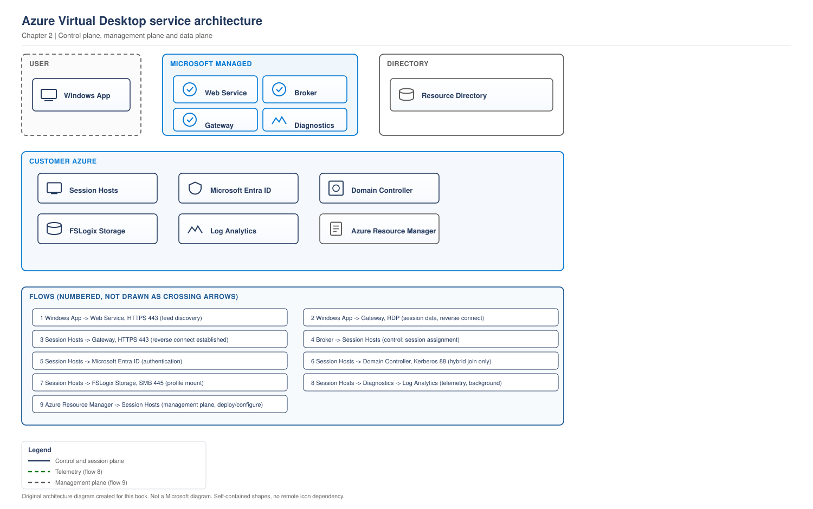

# Chapter 2 - The Control Plane, Management Plane and Data Plane

> **Book:** Azure Virtual Desktop - Architect to Hands-on Implementation
> **Part I:** AVD Fundamentals and the Architect's Mental Model
> **Technical baseline:** August 2026

---

## Chapter Information

| Item | Detail |
|---|---|
| **Chapter number** | 2 |
| **Objective** | Understand every Microsoft-managed AVD component, what each one does, what breaks when it fails, and how AVD separates management traffic from session traffic |
| **Prerequisites** | Chapter 1. An Azure subscription you can create resources in (for Lab 1) |
| **Dependencies** | Builds directly on the responsibility split from Chapter 1 |
| **Estimated lab time** | 45 minutes (Lab 1) |
| **Azure resources required** | None billable. Lab 1 registers providers, checks quota, installs tooling and creates a budget alert |
| **Estimated Lab 1 cost** | **$0.00** - no compute, storage or network resources are created |

---

## What You Will Learn

- The five Microsoft-managed AVD services and what each one actually does
- How AVD separates the **control plane**, the **management plane** and the **data plane**
- Where your host pool's configuration data physically lives, and why that changed recently
- What users experience when each individual component fails
- Why "AVD is down" is usually not true, and how to prove it
- **Lab 1:** prepare your Azure subscription, tooling and cost guardrails for the rest of the book

---

## Why This Matters

At 09:10 on a Monday, users cannot connect. Someone says "AVD is down."

Almost always, it is not. In the overwhelming majority of real incidents, the Microsoft-managed service is fine and something in your half of the architecture has failed - the session hosts are off, the agent has stopped reporting, the domain controller is unreachable, or the profile share is throttled.

An architect who knows the component model can narrow that down in two minutes. An engineer who does not will open a Microsoft support case and wait.

This chapter gives you that component model. It is also the foundation for Chapter 4 (the full connection flow) and [Project 13](../scenarios/project-13-multi-region-architecture.md) (availability and multi-region design), so it is worth reading properly rather than skimming.

---

## 1. Three Planes, Not One

People say "control plane" to mean everything Microsoft runs. That is close enough for a conversation, but for design and troubleshooting you want three distinct ideas.

**Control plane.** The Microsoft-run services that get a user connected: the web service, the broker, the gateway, the resource directory and the diagnostics service. You do not deploy or scale these. Microsoft does.

**Management plane.** Azure Resource Manager. This is how *you* create and change AVD objects - host pools, application groups, workspaces, scaling plans, App Attach packages. Portal, PowerShell, Azure CLI, Terraform and Bicep all talk to ARM. This is also where RBAC, tags, policy and activity logs apply.

**Data plane.** The actual remote session: screen, keyboard, mouse, audio, printers, redirected drives. This is RDP traffic flowing between the user's device and your session host.

Why separate them? Because they fail independently and they have different consequences.

| Plane | If it has a problem | User impact |
|---|---|---|
| Control plane | Microsoft service issue | New connections fail. Existing sessions may keep working |
| Management plane | ARM or RBAC issue | Admins cannot change configuration. Users are usually unaffected |
| Data plane | Network, session host or protocol issue | Sessions are slow, freeze, or drop |

That table alone answers a very common interview question: *"If Microsoft's AVD service has an outage, do users lose their sessions?"* Not necessarily - the session traffic is a separate path from the brokering that set it up. Say that, then be honest that new connections depend on the service.

---

## 2. The Microsoft-Managed Components

> **OFFICIAL MICROSOFT ARCHITECTURE**
> Microsoft publishes an official high-level diagram of these components and their responsibilities. Open it alongside this section:
> https://learn.microsoft.com/en-us/azure/virtual-desktop/service-architecture-resilience
>
> Per that documentation, the Azure Virtual Desktop control plane includes the web, broker, gateway, resource directory, and diagnostics services. Microsoft manages the control plane and supports regional failover.

The original diagram below expresses the same architecture in this book's visual style.

> **OUR ORIGINAL ARCHITECTURE DIAGRAM.** Created for this book. Not a Microsoft diagram.
> Editable source: [`ch02-avd-control-plane.drawio`](../diagrams/architecture/ch02-avd-control-plane.drawio)



### What this diagram shows

Four layers, and one boundary that matters more than the rest. Everything in the Microsoft managed box is operated by Microsoft. Everything in the customer managed box is yours, billed to your subscription, and it is where every incident you will handle comes from.

Azure Resource Manager sits apart because it is how you administer the environment, not how a user connects to it. The two are different paths and they fail independently.

### Step by step flow

1. The user authenticates and requests their feed from the **web service** over HTTPS 443. The web service reads entitlements from the **resource directory**.
2. The user launches a desktop or app. The request goes to the **broker service**, which reads host pool configuration from the resource directory.
3. The broker selects a session host and instructs it through the AVD agent already running on it.
4. The heavy arrows are the important ones. The session host holds a persistent **outbound** TCP 443 connection to the **gateway service**, established before any user connects. The client opens its own outbound 443 connection. The gateway relays RDP between the two.
5. Inside the customer boundary, the session host authenticates the user against identity, mounts the FSLogix profile over SMB 445, and sends telemetry to the diagnostics service.
6. Diagnostic settings forward data into your Log Analytics workspace, which is where AVD Insights reads from.

### Architect's interpretation

The dotted line at the bottom is the design point. There is no inbound path to a session host. No public IP, no open 3389. That property comes from the persistent outbound connection in step 4, and it is the strongest single security argument in an AVD business case.

The second thing to read from this diagram is the split of effort. Microsoft's half needs no engineering from you. Your half needs image management, identity, storage, network and monitoring. That is where your design work goes.

### Important design decisions

- **Session host outbound connectivity is a hard dependency.** The whole model rests on it. See [Chapter 11](ch11-network-fundamentals-required-connectivity.md).
- **Profile storage placement.** Keeping it inside the same virtual network avoids peering charges on every sign in. See [Chapter 12](ch12-enterprise-topologies-ip-planning.md#4-cost-honestly).
- **Identity placement.** If session hosts depend on domain controllers, those controllers belong in the same region. See [Chapter 7](ch07-identity-architecture-foundations.md#4-if-you-still-need-domain-controllers).
- **Diagnostic settings are opt in.** Nothing reaches your workspace until you configure them. See [Project 02](../scenarios/project-02-enterprise-850-users.md), where monitoring architecture is worked through in full.

### Failure points

| Point | Symptom | Where to look |
|---|---|---|
| Web service or resource directory | Cannot sign in, or empty feed | Service Health, then assignment |
| Broker | Feed loads, launch fails | Session host availability and agent health |
| Gateway | New connections fail | Service Health, then the client network path |
| Session host outbound 443 | Hosts show unavailable | Event ID 3701 in the WVD-Agent log |
| Identity path | Sign in hangs or fails at Windows logon | Domain controller reachability and DNS |
| Storage path | Slow logon or temporary profile | Share reachability, permissions, throttling |
| Diagnostics | No user impact, monitoring gaps only | Diagnostic settings configuration |

**Official reference:** https://learn.microsoft.com/en-us/azure/virtual-desktop/service-architecture-resilience

---

## 3. Where Your Configuration Actually Lives

This is a detail most engineers never learn, and it decides your regional availability story.

When you create a host pool, its configuration metadata is stored by the service. Microsoft now offers two models for where that happens, and the difference matters for resilience.

Geographical host pools (the classic model) store host pool metadata in a geographical database serving multiple Azure regions within the same Azure geography. Regional host pools store metadata in a per-region database deployed into the region you select, with multiple replicas spanning availability zones in that region and metadata replicated to a paired region for cross-region failover.

The practical difference: with regional host pools, a problem in one region affects only the host pools in that region, which removes the cross-region dependency that the geographical model has. Otherwise, the two models work the same way - they differ only in database architecture, metadata location and resiliency characteristics.

`CURRENCY FLAG - verified August 2026. Regional host pools are a relatively recent addition. Confirm current availability, supported regions and any migration guidance on Microsoft Learn before committing to a model in a design document. [VERIFY BEFORE IMPLEMENTATION]`

**Why an architect cares.** Two reasons:

1. **Data residency questions.** Customers in regulated sectors ask where AVD metadata is stored. You need a real answer, and the answer now depends on which model the host pool uses.
2. **Blast radius.** A metadata store shared across a geography means a problem can reach host pools in regions you were not thinking about. A per-region store contains it. When you design a multi-region environment in [Project 13](../scenarios/project-13-multi-region-architecture.md), this is one of the inputs.

Note what is *not* stored here: no user data, no profile data, no application data. This is configuration metadata about your AVD objects.

---

## 4. How Microsoft Makes the Service Resilient

You do not build redundancy for the control plane. It is worth knowing how Microsoft does it, because interviewers ask and because it shapes what you can promise the business.

Per Microsoft's service architecture documentation, the Microsoft-managed components are located in around 40 Azure regions to be closer to users and provide a resilient service, with resiliency implemented globally, geographically and within a region. Azure Traffic Manager directs traffic for the web service, and Azure Front Door directs traffic for the gateway service. Microsoft also notes that when a gateway instance is affected, all other sessions handled by other instances of the gateway service are unaffected.

And for regional failure: when a region experiences an outage, control plane components fail over automatically and continue to function - you don't need to set up control plane redundancy.

**The honest architect position.** You cannot engineer around a service you do not operate. What you *can* do:

- Design your own half - session hosts, storage, identity, network - to be resilient (Chapters 36-38).
- Set expectations with the business in writing, so a control plane incident is a known, accepted risk rather than a surprise.
- Have a communication runbook, so that on the day, someone can quickly say "this is a Microsoft service issue, here is the Azure Status link" rather than the team spending an hour proving it.

Never claim in an interview that you can make the control plane highly available. The correct answer is that Microsoft already does, that you verify it during incidents rather than assuming it, and that you focus your engineering effort on the parts you control.

---

## 5. What Breaks When Each Component Fails

This table is the practical payoff of the whole chapter. Learn it.

| Component fails | What the user sees | What still works | First thing to check |
|---|---|---|---|
| Web service | Cannot sign in to the client, or the feed is empty | Existing sessions continue | Azure Status / Service Health; then check the user's licence and assignment |
| Broker service | Feed loads with icons, but launching fails | Existing sessions continue | Service Health; then session host availability and agent status |
| Resource directory | Feed is wrong, missing, or stale | Existing sessions continue | Service Health; then whether the objects actually exist in ARM |
| Gateway service | New connections fail; some existing sessions drop | Sessions already on RDP Shortpath may survive | Service Health; then client-side network path to AVD URLs |
| Diagnostics service | Nothing user-visible | Everything | Monitoring gaps only - do not chase this during an outage |
| **Your session hosts** | "No resources available", or connect-then-drop | Feed still loads normally | Host power state, drain mode, agent health, available sessions |
| **Your identity platform** | Sign-in fails, or logon hangs at "Please wait" | Feed may still load | Domain controller reachability, DNS, Entra Connect sync health |
| **Your profile storage** | Logon very slow, or temporary profile | Connection itself succeeds | Share reachability, permissions, throttling |

Notice the shape of it: **when the feed loads but the session does not start, the problem is almost always yours.** That single heuristic will save you hours.

---

## 6. Common Mistakes

- **Calling a Microsoft outage before checking your own half.** Check host availability and agent status first. It is faster and it is usually the answer.
- **Assuming the diagnostics service is a monitoring solution.** It provides connection telemetry. It is not a replacement for Azure Monitor, Log Analytics and proper alerting (Chapters 30-32).
- **Forgetting that the management plane is ARM.** People look for AVD-specific permissions when the real problem is a missing Azure RBAC role assignment at the right scope.
- **Believing a session host with no outbound internet path will work.** It will not register, and this is a design decision that must be made deliberately (Chapter 11), not discovered during deployment.
- **Promising control plane availability in an SLA you wrote.** Reference Microsoft's SLA, do not invent your own.

---

## 7. Interview Preparation

### Q4. Walk me through what Microsoft manages in AVD.

**Simple answer**
Microsoft runs the web service, the broker, the resource directory, the gateway and the diagnostics service. I run the session hosts, network, identity, storage and everything inside Windows.

**Strong senior architect answer**
"There are five Microsoft-managed services. The web service is the user-facing endpoint that returns the feed. The resource directory holds the metadata for my host pools, app groups and workspaces. The broker orchestrates the connection and decides which session host serves the user. The gateway is a websocket relay that carries RDP over reverse connect. And the diagnostics service collects the connection telemetry I later consume in Insights. I don't deploy or scale any of it - Microsoft runs it across many regions with automatic failover. My engineering effort goes entirely into the customer-managed side, because that's where every incident I'll actually handle comes from."

**Follow-up you should expect**
"Where is your host pool configuration stored?" - this is where you mention geographical versus regional host pools, and that regional pools keep metadata in the selected region with zone-redundant replicas and paired-region replication, which contains the blast radius. Very few candidates know this. It lands well.

---

### Q5. Users say AVD is down. How do you triage it?

**30-second answer**
"First I establish which layer is failing. If the feed loads and the icons are there, the control plane is fine and the problem is mine - usually session host availability, agent health, identity or profile storage. If the feed doesn't load at all, I check Azure Service Health before I touch anything else."

**2-minute answer**
Walk the layers. Feed loads or not? Does it fail for one user, one host pool, or everyone? One user points at licensing, assignment or Conditional Access. One host pool points at session hosts, agents or capacity. Everyone across all pools points at identity or the service itself. Then check the obvious operational causes: hosts powered off after a scaling event, drain mode left on after maintenance, hosts at their session limit, or agents unhealthy after a failed update. Mention that you check Azure Service Health early but not first, because the answer is usually on your side.

**Deep-dive answer**
It helps to name the plane separation explicitly: existing sessions ride the data plane and can survive a control plane problem, so "some people are still working" does not prove the service is healthy. There is also the reverse-connect dependency to name: session hosts need outbound access to the required AVD URLs, so a firewall or proxy change is a genuine cause of mass registration failure, and it looks exactly like a service outage from the helpdesk's point of view. Finish with prevention - synthetic connection monitoring and agent health alerting, so you know before users call.

---

## 8. Key Takeaways

- Five Microsoft-managed services: web, broker, resource directory, gateway, diagnostics.
- Three planes: control (getting connected), management (ARM, how you administer), data (the session itself). They fail independently.
- Host pool metadata lives either in a geographical database or, with regional host pools, in your selected region with zone-redundant replicas and paired-region replication.
- Reverse connect means outbound-only from session hosts, and no public inbound path is required.
- If the feed loads but the session does not start, the fault is almost always on your side.

---

## 9. Official References

- AVD service architecture and resilience - https://learn.microsoft.com/en-us/azure/virtual-desktop/service-architecture-resilience
- Multiregion BCDR for AVD (Azure Architecture Center) - https://learn.microsoft.com/en-us/azure/architecture/example-scenario/azure-virtual-desktop/azure-virtual-desktop-multi-region-bcdr
- AVD network topology and connectivity (Cloud Adoption Framework) - https://learn.microsoft.com/en-us/azure/cloud-adoption-framework/scenarios/azure-virtual-desktop/eslz-network-topology-and-connectivity
- Required URLs for Azure Virtual Desktop - https://learn.microsoft.com/en-us/azure/virtual-desktop/required-fqdn-endpoint

---

## Hands-on Lab

This chapter's practical work is in **[Lab 1](../labs/lab-01-azure-prerequisites-and-tooling.md)**.

---

## 10. Production Scenarios

### Scenario 1: "AVD is down" on a Monday morning

**Problem.** At 09:05, roughly 400 users cannot connect. The service desk declares a Microsoft outage.

**Symptoms.** Feed loads normally and icons appear. Launching a desktop returns "no resources available". Users already connected before 09:00 are working fine.

**Business impact.** 400 users unable to start work at shift start. Around 200 service desk calls in the first hour, and an escalation to a Microsoft support case that was never needed.

**Initial hypothesis.** The feed loading proves the control plane is healthy. The failure is at brokering, which means session hosts. Most likely a scaling or drain mode issue rather than a Microsoft fault.

**Investigation.**

Portal path: *Azure portal > Azure Virtual Desktop > Host pools > `hp-avd-lab-eus2-01` > Session hosts*. Check status and allow new sessions.

```powershell
Get-AzWvdSessionHost -ResourceGroupName rg-avd-service-lab-eus2-01 -HostPoolName hp-avd-lab-eus2-01 |
  Select-Object Name, Status, AllowNewSession, Session, UpdateState
```

```bash
az vm list -d --resource-group rg-avd-hosts-lab-eus2-01 --query "[].{name:name,power:powerState}" -o table
```

Then check Azure Service Health, but second rather than first.

**Evidence.** All hosts show `AllowNewSession : False`, or all VMs show deallocated. Either points at your side.

**Root cause.** In this case, maintenance the previous Friday left every host in drain mode. Nobody noticed over the weekend because nobody connected.

**Fix.**

```powershell
Update-AzWvdSessionHost -ResourceGroupName rg-avd-service-lab-eus2-01 `
  -HostPoolName hp-avd-lab-eus2-01 -Name <host.fqdn> -AllowNewSession:$true
```

**Validation.** A test user connects and lands on a session host. Confirm available sessions across the pool, not just one host.

**Prevention.** Alert on host pools where no host accepts new sessions. Add "confirm drain mode cleared" to the maintenance runbook, with a named owner.

**Architect lesson.** Feed loads plus session fails equals your problem. That heuristic prevents premature support cases.

**Interview lesson.** Opening a triage answer with a single eliminating question, rather than a list of checks, is what makes it sound like experience.

**Architect's lesson.** Feed loads plus session fails equals your problem. That one heuristic saves hours and stops premature support cases.

### Scenario 2: Hosts unavailable after a firewall change

**Problem.** A network change window on Saturday. On Monday, 30 of 40 session hosts show unavailable.

**Symptoms.** Hosts are running in Azure. AVD reports them unavailable. Restarting does not help. The ten healthy hosts are in a different region.

**Business impact.** 30 of 40 hosts unavailable, so capacity drops to a quarter. Users who do connect land on overloaded hosts, which turns an availability incident into a performance one as well.

**Initial hypothesis.** Blocked outbound FQDNs. The regional split is the clue, because part of the required FQDN list is region specific.

**Investigation.**

On an affected host: *Event Viewer > Windows Logs > Application > WVD-Agent*, filtered for event ID 3701. That event names the blocked FQDNs directly.

```bash
az vm run-command invoke -g rg-avd-hosts-lab-eus2-01 -n <vm> \
  --command-id RunPowerShellScript \
  --scripts "Get-WinEvent -LogName Application -MaxEvents 200 | Where-Object {\$_.Id -eq 3701} | Select-Object -First 5 TimeCreated, Message | Format-List"
```

**Evidence.** Event 3701 lists specific FQDNs the agent cannot reach, matching URLs newly blocked by the firewall rule.

**Root cause.** A tightened egress rule removed access to required AVD endpoints. Microsoft does not support deployments where these are blocked. See [Chapter 4](ch04-connection-flow-end-to-end.md#3-what-session-hosts-actually-need-outbound).

**Fix.** Unblock the FQDNs named in event 3701, per region. Use the AVD service tag and FQDN tag rather than an IP list, because AVD does not publish static IP ranges.

**Validation.** Hosts return to available within minutes. Confirm with a real connection, not just status.

**Prevention.** Give the network team the service tag and FQDN tag names in writing. Add AVD connectivity to the firewall change checklist. Run the AVD Agent URL Tool after any egress change.

**Architect lesson.** Reverse connect trades inbound exposure for an outbound dependency, and that dependency needs a named owner.

**Interview lesson.** Naming event 3701 as the first check demonstrates hands on troubleshooting rather than theory.

**Architect's lesson.** Reverse connect trades inbound exposure for an outbound dependency. That dependency must be documented and owned, or a routine network change becomes a desktop outage.

### Scenario 3: Data residency question during a regulator review

**Problem.** A regulator asks where AVD configuration metadata is stored for a financial services customer.

**Symptoms.** Not a failure. A question the project cannot answer, which stalls sign off.

**Business impact.** No user impact. Sign off is blocked, which delays go live and holds up the wider programme.

**Initial hypothesis.** The answer depends on whether host pools use the geographical or the regional metadata model.

**Investigation.** Identify the model for each host pool, confirm the location property on host pools, application groups and workspaces, and confirm that no user or profile data is held in the control plane.

**Evidence.** Documented host pool locations plus the Microsoft service architecture page describing where metadata is held for each model.

**Root cause.** Not a fault. A gap in the design documentation.

**Fix.** Produce a short data residency statement covering what metadata is stored, where, and what is not stored in the control plane. Reference the Microsoft page rather than paraphrasing it.

**Validation.** The security and compliance owner accepts the statement in writing.

**Prevention.** Add a data residency section to the standard AVD design document template. Regulated customers always ask, so answer it before they do.

**Architect lesson.** Metadata placement is a sign off dependency, not trivia.

**Interview lesson.** Very few candidates know where host pool metadata lives. Mentioning regional host pools stands out.

**Architect's lesson.** Knowing where metadata lives is not trivia. It is a sign off dependency, and it changed with regional host pools.

---

## 11. The Architect's Four Questions

**What do I check first?** Does the feed load. If it does, the control plane is working and the fault is on your side.

**What can I safely change now?** Clearing drain mode on one host. Restarting a single session host in drain mode. Reading configuration with `Get-` commands. Checking Service Health.

**What must not be changed blindly?** Removing hosts from a host pool. Changing host pool RDP properties. Editing firewall egress rules without knowing which FQDNs AVD needs. Mass logoff during business hours.

**When do I escalate to Microsoft?** When Service Health shows an active incident affecting AVD, or when hosts are healthy, outbound connectivity is proven, event 3701 is clean, and brokering still fails. Collect first: host pool name and region, session host names and agent versions, timestamps in UTC, the client correlation ID and the relevant diagnostic rows.

---

## Architect's Reality Check

**What engineers commonly get wrong.** They call a Microsoft outage before checking their own half. The feed loading is proof the control plane is working, and most teams never learn that one signal.

**What I would check first in production.** Whether the feed loads. Then session host availability and drain mode. Azure Service Health comes third, not first, because it is usually not the answer.

**What I would ask the customer.** Who is affected. One user, one host pool, or everyone. That question narrows the problem faster than any tool, and most service desks do not ask it before escalating.

**What I would decide as the architect.** That the operations team gets a one page symptom to layer map, and that it lives in the runbook rather than in someone's head. The component model is only useful if the people on shift at 09:05 have it.

**What I would say in an interview.** Name the five Microsoft managed components, then immediately say what that means for troubleshooting. Reciting the list is a junior answer. Explaining that the feed loading eliminates the control plane is a senior one.

---

## How This Changes With Scale

**Around 100 users.** A single host pool in one region. Control plane behaviour is almost invisible because problems are small and quickly attributed.

**Around 1,000 users.** Incidents now affect enough people to need a defined triage path. The symptom to layer map earns its place, and Service Health alerts need an owner.

**Around 5,000 users and beyond.** Metadata placement becomes a real design input. Regional host pools contain the blast radius of a regional problem, and data residency questions arrive from compliance rather than from engineering. Communication during an incident becomes as important as the fix, because thousands of people are affected at once.

---

## Chapter Close

**What was completed**
You now know the five Microsoft-managed components, the three-plane model, where host pool metadata lives, and what each failure mode looks like from the user's side. Your subscription and tooling are ready, and cost guardrails are in place.

**What you should test**
Every item on the Lab 1 validation checklist. Then, from memory, write the "what breaks when each component fails" table and check it against section 5.

**What comes next**
Chapter 3 covers the AVD object model - host pools, application groups and workspaces, how they relate, and the assignment rules that cause more design mistakes than any other topic in AVD.

**Interview preparation carried forward**
Q4 and Q5 should both be deliverable out loud without notes. Q5 in particular is a favourite opener for senior interviews, because it separates people who have run an environment from people who have only read about one.
