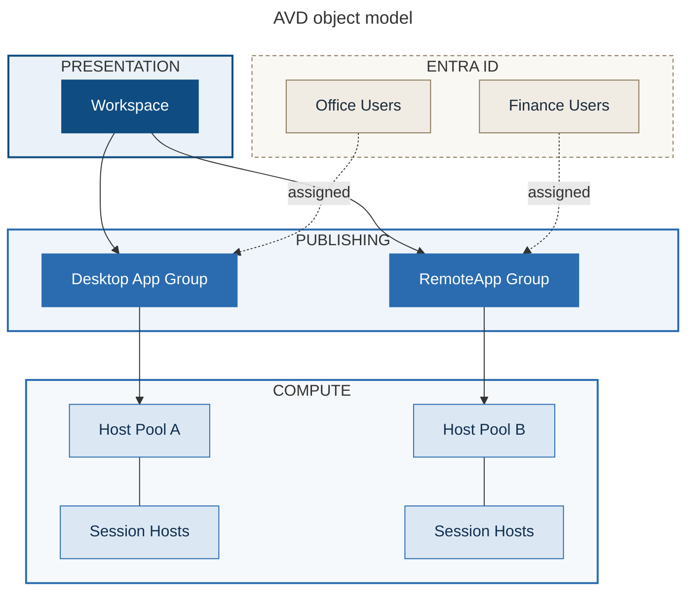

# Chapter 3 - The AVD Object Model: Host Pools, Application Groups and Workspaces

> **Book:** Azure Virtual Desktop - Architect to Hands-on Implementation
> **Part I:** AVD Fundamentals and the Architect's Mental Model
> **Technical baseline:** August 2026

---

## Chapter Information

| Item | Detail |
|---|---|
| **Chapter number** | 3 |
| **Objective** | Understand how AVD objects relate to each other, the rules that constrain them, and how to design an object model that survives contact with 3,000 users |
| **Prerequisites** | Chapters 1-2, Lab 1 complete |
| **Dependencies** | Uses the responsibility split (Ch 1) and the resource directory concept (Ch 2) |
| **Estimated lab time** | 60 minutes (Lab 2) |
| **Azure resources required** | Resource groups, one storage account for Terraform state |
| **Estimated Lab 2 cost** | **Under $1.00/month** - a small storage account holding a state file a few kilobytes in size |

---

## What You Will Learn

- The four core AVD objects and how they connect
- The cardinality rules - what can be attached to what, and how many times
- Why an application group can't exist on its own, and why location matters
- The preferred application group type setting, and the problem it exists to prevent
- The two host pool management approaches available today
- How to design an object model for six user personas without creating a mess
- **Lab 2:** Terraform remote state, resource groups, and the governance foundation for every later lab

---

## Why This Matters

The AVD object model looks trivial. Four object types, a few relationships. Most people learn it in ten minutes from a portal wizard and move on.

Then a real environment grows. Someone needs a second desktop published from the same hosts. Someone else needs a group of contractors to see three apps and nothing else. A region gets added. And suddenly the team discovers a set of rules they never learned - an application group can only live in one workspace, you can only have one desktop application group per host pool, and everything has to be in the same location.

Those constraints are not obstacles. They are the shape of the design. Once you know them, the right structure is usually obvious. Once you have deployed the wrong structure to 3,000 users, changing it is a project.

---

## 1. The Four Objects

Start with plain definitions.

**Host pool.** A collection of session host virtual machines that share the same configuration. This is the unit of compute. It defines whether desktops are shared or dedicated, how users are balanced across hosts, and how many sessions each host accepts.

**Session host.** One virtual machine inside a host pool, running Windows plus the AVD agent. It is a normal Azure VM with extra software on it.

**Application group.** The publishing object. It controls what users get from a host pool. Microsoft defines it as controlling access to a full desktop or a logical grouping of applications available on session hosts in a single host pool. Two types exist: **Desktop** (the full Windows desktop) and **RemoteApp** (individual published applications).

**Workspace.** A logical grouping of application groups. It is what the user actually subscribes to in the client. Each application group must be associated with a workspace for users to see the desktops and applications published to them.

The mental model that helps most people:

- Host pool = **where the compute is**
- Application group = **what gets published**
- Workspace = **what the user subscribes to**
- Assignment = **who gets it**

---

## 2. How They Connect

> **BOOK REFERENCE ARCHITECTURE** - original diagram created for this book.
> Microsoft's official terminology page covers the same objects and is the authoritative source: https://learn.microsoft.com/en-us/azure/virtual-desktop/terminology



### What the diagram shows

One workspace at the top. Users subscribe to it and see everything they are entitled to inside it. Underneath sit three application groups - one publishing a full desktop, two publishing sets of applications. Each application group points at exactly one host pool. Each host pool contains session hosts. Access is granted by assigning Entra ID groups to application groups, not to host pools.

Notice that `hp-office-prd-eus2-01` has two application groups attached: a desktop group and a RemoteApp group. That is allowed, and section 4 explains the setting that keeps it from causing trouble.

### Step-by-step flow

1. The user signs in to the client and subscribes to the **workspace**.
2. The service checks which **application groups** in that workspace the user is assigned to, through their Entra ID group membership.
3. The client displays the desktops and applications from those application groups. Nothing else appears, even if other application groups exist in the same workspace.
4. The user launches a resource. The broker looks up which **host pool** that application group belongs to.
5. The broker selects a **session host** in that host pool and brokers the connection.

The assignment is on the application group. That is the single most important line in this chapter.

### Architect's view

This structure separates three concerns that people routinely mix up: compute (host pool), publishing (application group) and presentation (workspace). Keeping them separate is what lets you add a new set of published applications without touching compute, or move a persona to different hardware without republishing anything.

The trade-off is indirection. There are four objects to reason about instead of one, and a misconfiguration in any of them produces the same symptom - the user sees nothing. [Project 15](../scenarios/project-15-production-troubleshooting.md) turns that into a diagnostic sequence, the 10-layer isolation method.

**Official reference:** https://learn.microsoft.com/en-us/azure/virtual-desktop/terminology

---

## 3. The Cardinality Rules

These are the constraints that decide your design. Learn them properly, because they come up in interviews and they are the reason otherwise reasonable designs fail.

| Rule | Detail |
|---|---|
| Application group → host pool | An application group can only be assigned to a single host pool, but you can assign multiple application groups to the same host pool. |
| Application group → workspace | An application group can only be assigned to a single workspace. |
| Desktop application groups per host pool | You can only assign a single desktop application group to a host pool, but you can assign multiple RemoteApp application groups to the same host pool. |
| Application group existence | An application group can't exist without a host pool. |
| RemoteApp availability | Desktop application groups work with pooled or personal host pools. RemoteApp application groups are available with pooled host pools only. |
| User → application groups | Users can be assigned to multiple application groups across multiple host pools, which lets you vary the applications and desktops they can access. |
| Multiple RemoteApp groups | Users assigned to multiple RemoteApp application groups on the same host pool get access to the aggregate of all applications in those groups. |
| Host pool type | Once you create a host pool, you can't change its type. You can move registered VMs to a different host pool of another type. |

### The location rule

This one catches people out during multi-region designs.

All service resources have a location. A host pool's location determines which geography the service metadata for the host pool is stored in. To make sure data isn't transferred between multiple locations, the application group's location should be the same as the host pool's, and workspaces must be in the same location as their application groups.

**Practical consequence:** you cannot have one global workspace containing application groups from every region. In a multi-region design you will have a workspace per region. Users in more than one region subscribe to more than one workspace. Plan for that in your communications and client rollout, because "why do I have two workspaces?" is a helpdesk question you can avoid by explaining it up front.

`CURRENCY FLAG - see Chapter 2 on regional versus geographical host pools, which changes where metadata is stored. Re-verify the current model before writing a data residency statement for a customer.`

---

## 4. Preferred Application Group Type

This setting exists to solve a specific, real problem, and it is a favourite interview question because it shows whether you have run an environment or just built one.

**The problem.** A pooled host pool can have both a desktop application group and RemoteApp application groups attached. If a user is assigned to both, they could open a full desktop *and* a published app from the same host pool. That means two separate sessions to the same host pool, for the same user, at the same time.

Microsoft is direct about the consequence: if a user ends up with two different sessions to the same host pool, it can cause a negative experience and session performance issues for that user and for other users. Two sessions means double the profile handling, double the resource consumption, and a real chance of profile conflicts.

**The control.** Pooled host pools have a Preferred application group type setting to help prevent users connecting to a desktop and a RemoteApp from application groups assigned to the same host pool. You set it to Desktop or RemoteApp.

**Details worth knowing:**

- You must specify the preferred application group type when you create the host pool.
- The Azure portal defaults it to Desktop, and automatically creates and assigns a desktop application group named after the host pool with a `-DAG` suffix - for example `hp01-DAG` - regardless of which type you select. You can remove that application group afterwards if you only want RemoteApp. These portal-specific default behaviours don't occur when you create a host pool with PowerShell or the CLI.
- It's still technically possible to connect to both a desktop and RemoteApp from the same host pool using the `ms-avd:connect` URI scheme regardless of this setting, but Microsoft doesn't recommend it.

**Architect's rule of thumb.** Do not mix desktop and RemoteApp delivery on the same host pool for the same users unless you have a specific reason and have thought through the session behaviour. If a persona needs both, the cleaner design is usually two host pools. It costs more compute but it removes a whole class of support ticket.

**Interview framing:** *"The setting exists because a user could otherwise get two concurrent sessions on the same host pool, which doubles their profile and resource footprint. I set it deliberately at creation time, and I generally separate desktop and RemoteApp delivery into different host pools when both are genuinely needed."*

---

## 5. Two Host Pool Management Approaches

`CURRENCY FLAG - verified August 2026. This is a recent and significant change.`

Microsoft now offers two ways to manage a host pool:

**Session host configuration** is available for pooled host pools with session hosts on Azure. AVD manages the lifecycle of the session hosts for you using a combination of native features. **Standard management** is available for pooled and personal host pools with session hosts on Azure or Azure Local, and you manage creating, updating and scaling session hosts yourself.

In plain terms: session host configuration is the newer, configuration-driven model where you describe what a session host should look like and the service builds and updates them. Standard management is the classic model where you build the VMs.

`[VERIFY BEFORE IMPLEMENTATION]` - documentation for this feature has been changing as it moved to general availability. Confirm current GA status, supported scenarios, and any limitations for your region and host pool type before designing around it. Chapter 16 covers this properly, including brownfield migration.

**Why it appears here:** because the management approach is chosen at host pool creation and you cannot change a host pool's type afterwards. It belongs in the object model conversation, not only in the deployment conversation.

---

## 6. Designing the Object Model for Northwind

Time to apply this. Northwind Global Manufacturing has six personas (Chapter 1), two primary regions, and 3,200 users.

**Bad design - one of everything.** One workspace, one host pool, one desktop application group, everyone assigned. It deploys in twenty minutes and it fails within a month, because a CAD engineer and a task worker cannot share a VM sizing decision, and finance data cannot sit on the same hosts as everything else.

**Reasonable first-pass design:**

| Persona | Host pool | Type | Application group | Reason |
|---|---|---|---|---|
| Task workers | `hp-task-prd-eus2-01` | Pooled | Desktop | High density, uniform app set |
| Knowledge workers | `hp-know-prd-eus2-01` | Pooled | Desktop | Different sizing to task workers |
| Finance / regulated | `hp-fin-prd-eus2-01` | Pooled | Desktop | Isolation is a compliance requirement, not a technical one |
| Engineers (CAD) | `hp-cad-prd-eus2-01` | Personal | Desktop | GPU, large local working sets |
| Developers | `hp-dev-prd-eus2-01` | Personal | Desktop | Local admin, unpredictable resource use |
| Executives | `hp-know-prd-eus2-01` | Pooled | Desktop | Small group; no case for separate compute |
| LOB apps for external partners | `hp-apps-prd-eus2-01` | Pooled | RemoteApp | Apps only, no desktop |

Plus the same structure in West Europe for Amsterdam users, with its own workspace because of the location rule.

**Reasoning, in the format you should use in an interview:**

- *Requirement:* six personas with genuinely different compute, security and licensing needs.
- *Options:* one host pool for all; one per persona; or one per persona group.
- *Trade-offs:* fewer host pools means cheaper and simpler operations but forces a single sizing compromise and blocks security separation. More host pools mean better fit and isolation but more images, more monitoring surface and higher minimum capacity cost.
- *Decision:* separate pools where sizing or security genuinely differ; combine where they do not. Executives join the knowledge worker pool because 100 users do not justify their own capacity floor.
- *Reason:* the driver is sizing and isolation, not org chart. Never build a host pool because a department asked for one.

That last line is worth remembering. It is the difference between an architect and an order-taker.

---

## 7. Common Mistakes

- **Assigning users to host pools.** You cannot. Assignment happens on the application group. This is the most common conceptual error and it produces the "user sees nothing" symptom.
- **Building a host pool per department.** Build per sizing and security requirement. Departments are a naming concern, not an architecture one.
- **Deleting the auto-created `-DAG` application group without understanding why it exists.** Fine if you are RemoteApp-only. Not fine if you later want to publish a desktop and cannot work out where it went.
- **Assuming one global workspace works.** The location rule prevents it. Design workspace-per-region from the start.
- **Assigning a user to both a desktop and a RemoteApp group on the same host pool.** Two sessions, doubled resource use, unhappy users.
- **Choosing the host pool type casually.** You cannot change it afterwards. Pooled versus personal is a design decision with cost and operational consequences (Chapter 15).

---

## 8. Interview Preparation

### Q6. Explain the relationship between host pools, application groups and workspaces.

**Simple answer**
The host pool is the compute. The application group publishes either a desktop or a set of apps from that host pool. The workspace groups application groups together so the user can subscribe to them. Users are assigned to application groups.

**Strong senior architect answer**
"Three layers with clean separation. Host pool is compute - VM configuration, load balancing, session limits. Application group is publishing - one per host pool for desktops, and you can have several RemoteApp groups on the same pool. Workspace is presentation - it's what the user subscribes to in the client. Access control sits on the application group, through Entra ID groups, never on the host pool. The constraints that shape the design are that an app group belongs to exactly one host pool and exactly one workspace, only one desktop app group per host pool, and everything has to share a location - which is why multi-region means a workspace per region rather than one global one."

**Follow-up you should expect**
"What happens if a user is assigned to both a desktop and a RemoteApp group on the same host pool?" - that is section 4. Two concurrent sessions, doubled profile and resource footprint, and the preferred application group type setting exists to prevent it.

---

### Q7. A user subscribes to the workspace and sees nothing. Walk me through it.

**30-second answer**
"I'd check the assignment first - the user needs to be assigned to an application group, not to a host pool, and that's usually where it's gone wrong. Then whether the app group is actually attached to the workspace the user subscribed to. Then whether the client is subscribed to the right workspace URL at all."

**2-minute answer**
Work down the object model in order, because each layer can silently produce the same symptom.
1. Is the user assigned to an application group? Check the group membership, not just the user object.
2. Is that application group associated with a workspace? An app group with no workspace is invisible.
3. Did the user subscribe to the right workspace?
4. Is group membership actually flowing? If it's an on-premises group synced to Entra ID, check sync.
5. Is a Conditional Access policy blocking the feed rather than the session?
6. Has the feed cached a stale state? Sign out and re-subscribe.
Only after all of that would I look at host pools or session hosts - because if the feed itself is empty, the compute layer hasn't even been consulted yet.

**Deep-dive answer**
Add the timing dimension. Group membership changes are not always instant end to end; there is directory sync, token refresh and feed refresh. So "I added them five minutes ago and it doesn't work" is often not a fault at all. Explain that you'd confirm with a known-good test account in the same group to separate a user-specific problem from a configuration problem, and that you'd use the diagnostics data to see whether the feed request even reached the service. Finish with prevention: assign through groups only, never individual users, and keep one source of truth for entitlement.

---

## 9. Key Takeaways

- Host pool = compute. Application group = publishing. Workspace = subscription. Assignment = on the application group.
- One application group belongs to one host pool and one workspace. One desktop application group per host pool. Multiple RemoteApp groups allowed.
- Application groups cannot exist without a host pool, and host pool, application group and workspace must share a location.
- Preferred application group type prevents a user getting two sessions on the same host pool.
- Host pool type cannot be changed after creation. Choose deliberately.
- Design host pools around sizing and security requirements, not org structure.

---

## 10. Official References

- Azure Virtual Desktop terminology - https://learn.microsoft.com/en-us/azure/virtual-desktop/terminology
- Preferred application group type behavior - https://learn.microsoft.com/en-us/azure/virtual-desktop/preferred-application-group-type
- Deploy Azure Virtual Desktop - https://learn.microsoft.com/en-us/azure/virtual-desktop/deploy-azure-virtual-desktop
- Azure Virtual Desktop FAQ - https://learn.microsoft.com/en-us/azure/virtual-desktop/faq

---

## Hands-on Lab

This chapter's practical work is in **[Lab 2](../labs/lab-02-terraform-foundation-and-governance.md)**.

---

## 9. Production Scenarios

### Scenario 1: New starters see an empty workspace

**Problem.** Twelve new starters join. They subscribe successfully but see nothing.

**Symptoms.** Sign-in works. Workspace subscribes. No icons. Existing users in the same team are fine.

**Business impact.** Twelve new starters unable to work on day one, which is the most visible possible failure for a new platform.

**Initial hypothesis.** Assignment. Users are assigned to application groups, never to host pools, and new starters are the population most likely to be missing group membership.

**Investigation.**

Portal path: *Azure portal > Azure Virtual Desktop > Application groups > `ag-desktop-office` > Assignments*.

```powershell
Get-AzRoleAssignment -ResourceGroupName rg-avd-service-lab-eus2-01 |
  Where-Object { $_.RoleDefinitionName -eq "Desktop Virtualization User" } |
  Select-Object DisplayName, Scope
```

Then confirm the application group is actually attached to the workspace the users subscribed to:

```powershell
Get-AzWvdApplicationGroup -ResourceGroupName rg-avd-service-lab-eus2-01 |
  Select-Object Name, ApplicationGroupType, HostPoolArmPath, WorkspaceArmPath
```

**Evidence.** The group the new starters belong to has no assignment on the application group, or the users are not yet members of the assigned group.

**Root cause.** Onboarding added the users to an HR group that was never linked to the AVD assignment group.

**Fix.** Add the users to the assigned Entra group. Have them sign out and re-subscribe, because the feed caches.

**Validation.** A test account in the same HR group receives icons after re-subscribing, without any direct assignment.

**Prevention.** Assign through groups only, never individual users. Make AVD group membership part of the joiner process, and add a check for it. Consider dynamic group membership so this cannot be forgotten.

**Architect lesson.** An empty feed means the compute layer has not been consulted yet, so start at assignment.

**Interview lesson.** Correctly saying that assignment lives on the application group answers the question most candidates get wrong.

**Architect's lesson.** Empty feed almost always means assignment, and the compute layer has not even been consulted yet.

### Scenario 2: One user, two sessions, terrible performance

**Problem.** A finance user reports a very slow desktop. Their profile appears twice on the host.

**Symptoms.** The user has both a published desktop and a published application from the same host pool. Performance is poor for them and for others on the same host.

**Business impact.** One user with a poor experience and measurable degradation for everyone else sharing that host.

**Initial hypothesis.** The user is assigned to both a desktop application group and a RemoteApp application group on the same host pool, which produces two concurrent sessions.

**Investigation.** List application groups attached to the host pool and check which ones the user is assigned to. Then check the preferred application group type setting on the host pool.

**Evidence.** Two assignments on the same host pool, and two active sessions for the same user in the session host view.

**Root cause.** Both groups were assigned to the same Entra group, and preferred application group type was never set deliberately.

**Fix.** Decide which delivery method that persona needs, and remove the other assignment. Set preferred application group type explicitly. If the persona genuinely needs both, split them into two host pools.

**Validation.** The user connects and holds one session only. Host CPU and memory return to expected levels.

**Prevention.** Make preferred application group type part of the host pool build standard. Add a check that no Entra group is assigned to both a desktop and a RemoteApp group on the same host pool.

**Architect lesson.** Two sessions doubles a user's footprint and degrades the host for everyone on it.

**Interview lesson.** Explaining why the preferred application group type setting exists shows you understand the failure it prevents.

**Architect's lesson.** Two sessions doubles a user's profile and resource footprint and degrades the host for everyone else on it. This is why the setting exists.

### Scenario 3: Multi-region rollout blocked by the location rule

**Problem.** A global rollout plans one workspace for all users. It fails during build in the second region.

**Symptoms.** The application group in West Europe cannot be added to the existing East US 2 workspace.

**Business impact.** Second region rollout blocked mid build. Rework rather than outage, and a change to the user communication plan.

**Initial hypothesis.** The location rule. Host pool, application group and workspace must share a location.

**Investigation.** Compare the location property on the workspace and the new application group.

**Evidence.** The workspace is in East US 2. The new application group is in West Europe. They cannot be associated.

**Root cause.** The design assumed a single global workspace, which the service does not support.

**Fix.** Create a workspace per region. Users who need resources in both regions subscribe to both.

**Validation.** A user in each region subscribes and sees only their regional resources. A dual region user sees both workspaces.

**Prevention.** Put workspace per region into the design pattern and into the user communication plan, because "why do I have two workspaces" becomes a helpdesk question otherwise.

**Architect lesson.** Constraints found during build become rework. Found during design they become architecture.

**Interview lesson.** Knowing the location rule prevents the common wrong answer of one global workspace.

**Architect's lesson.** Constraints found during build become rework. Constraints found during design become architecture.

---

## 10. The Architect's Four Questions

**What do I check first?** Whether the feed is empty or the launch fails. Empty feed is assignment or workspace association. Launch failure is host pool or session hosts.

**What can I safely change now?** Adding a group assignment. Setting preferred application group type on a new host pool. Reading configuration.

**What must not be changed blindly?** Deleting an application group, which removes access for everyone assigned to it. Changing workspace association. Removing the auto-created desktop application group without knowing whether a desktop is published from it. Host pool type cannot be changed at all after creation.

**When do I escalate to Microsoft?** Rarely for object model problems, because these are almost always configuration. Escalate when assignments and associations are provably correct and the feed still does not reflect them after a full sign out and re-subscribe.

---

## Architect's Reality Check

**What engineers commonly get wrong.** They think users are assigned to host pools. Assignment lives on the application group, and this single misunderstanding produces most of the empty feed tickets in a new deployment.

**What I would check first in production.** Whether the feed is empty or the launch fails. Empty feed is the object model. Launch failure is compute. That takes ten seconds and removes half the possibilities.

**What I would ask the customer.** Which groups drive access, and where those groups come from. If AVD access is granted by adding individual users by hand, the object model is fine and the process will fail.

**What I would decide as the architect.** Assignment through groups only. Preferred application group type set at creation. Workspace per region because the location rule allows nothing else. And host pools built around sizing and isolation rather than departments.

**What I would say in an interview.** The three layer split, then the constraints that shape the design: one application group per host pool, one workspace per application group, one desktop application group per pool, and everything in the same location.

---

## How This Changes With Scale

**Around 100 users.** One workspace, one or two application groups. The object model barely matters and almost any structure works.

**Around 1,000 users.** Personas force multiple host pools and application groups. Naming and assignment discipline start to matter, because a badly named application group is now a support problem.

**Around 5,000 users and beyond.** Multi-region is normal, so workspace per region is mandatory and users may subscribe to more than one. Entitlement becomes a joiner and leaver process rather than an admin task, and dynamic group membership stops being optional.

---

## Chapter Close

**What was completed**
You know the AVD object model, the cardinality and location rules, the preferred application group type behaviour, and both host pool management approaches. Your Terraform foundation, remote state and resource groups are deployed.

**What you should test**
The full Lab 2 validation checklist, especially the drift test. Then sketch Northwind's object model from memory and compare it against section 6.

**What comes next**
Chapter 4 walks the complete connection flow end to end - feed discovery, brokering, reverse connect, RDP Shortpath and RDP Multipath - with a step-by-step trace of what happens between clicking an icon and seeing a desktop. **Lab 3 (VNet, subnets, NSGs and DNS) also begins there, and is the first lab with recurring network cost.**

**Interview preparation carried forward**
Q6 and Q7 are both high-frequency questions. Q7 in particular is a common practical screen, because the answer reveals immediately whether you understand that assignment lives on the application group.
