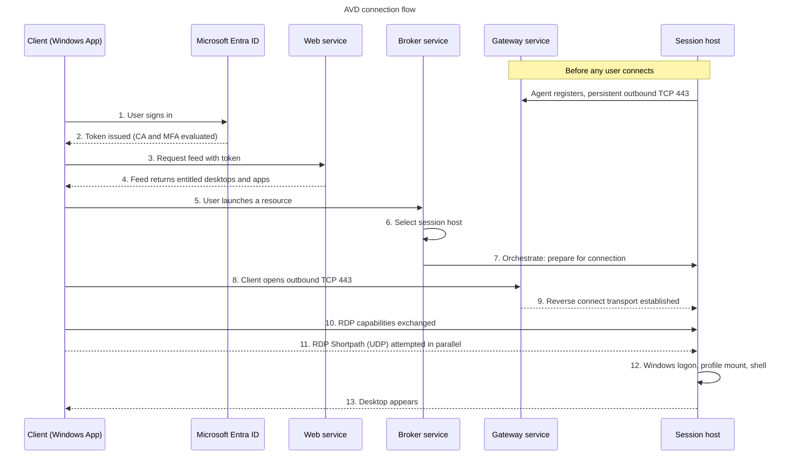

# Chapter 4 - The Connection Flow, End to End

> **Book:** Azure Virtual Desktop - Architect to Hands-on Implementation
> **Part I:** AVD Fundamentals and the Architect's Mental Model
> **Technical baseline:** August 2026

---

## Chapter Information

| Item | Detail |
|---|---|
| **Chapter number** | 4 |
| **Objective** | Trace every step between a user clicking an icon and a desktop appearing, and be able to explain where it can break |
| **Prerequisites** | Chapters 1-3, Labs 1-2 complete |
| **Dependencies** | Uses the control plane components from [Chapter 2](ch02-control-plane-management-plane-data-plane.md) and the object model from [Chapter 3](ch03-avd-object-model.md) |
| **Estimated lab time** | 90 minutes ([Lab 3](../labs/lab-03-vnet-subnets-nsg-dns.md)) |
| **Azure resources required** | Virtual network, subnets, NSGs, DNS settings |
| **Estimated Lab 3 cost** | **$0.00/month for the base build.** Optional Azure Bastion adds roughly $140/month - read the warning in Lab 3 before deploying it |

---

## What You Will Learn

- The complete connection sequence, in order, with the component responsible for each step
- What reverse connect actually is and why it removes inbound firewall rules
- The FQDNs and service tags session hosts genuinely need
- How RDP Shortpath is negotiated, and the difference between managed and public networks
- Where each step fails in production, and the single event ID that solves most registration problems

---

## Why This Matters

Almost every AVD incident is a connection problem wearing a costume. "Slow logon", "black screen", "no resources available", "disconnects at 4pm" - all of them are a specific step in one sequence failing.

If you know the sequence, you can bisect it. If you do not, you are guessing.

This is also the most common senior interview question in the whole subject. Interviewers ask it because the answer cannot be faked: you either know the order or you don't.

---

## 1. The Sequence, in Order

> **BOOK REFERENCE ARCHITECTURE** - original diagram.
> Microsoft documents the same flow across its service architecture and RDP Shortpath pages:
> https://learn.microsoft.com/en-us/azure/virtual-desktop/service-architecture-resilience and https://learn.microsoft.com/en-us/azure/virtual-desktop/rdp-shortpath



### What the diagram shows

The session host registers with the gateway **before any user is involved**. That persistent outbound connection is what makes everything else possible. When a user connects, the client and the session host each have their own outbound connection to Microsoft, and the gateway joins them together.

Nothing in this sequence involves an inbound connection to your session host from the internet.

### Step-by-step flow

**Steps 1-2 - Authentication.** The client authenticates the user against Microsoft Entra ID. Conditional Access and MFA are evaluated here. Note that this is authentication to the *service*, not to Windows - that happens later at step 12. Chapter 8 pulls the three separate authentications apart.

**Steps 3-4 - Feed.** The client presents its token to the web service and receives the list of entitled resources. This reads from the resource directory (Chapter 2) and depends on the object model and assignments (Chapter 3). If the feed is empty, nothing below this line has been attempted yet.

**Steps 5-7 - Brokering.** The broker decides which session host serves the request. It considers host pool type, load balancing algorithm, max session limit, host availability as reported by the agent, and whether the user already has a disconnected session to reconnect to. Then it instructs that host, through its agent, to prepare.

**Steps 8-9 - Reverse connect.** Both sides already have, or now open, outbound TCP 443 connections to the gateway. The gateway relays between them. This is the default transport.

**Steps 10-11 - Transport negotiation.** Per Microsoft, all connections begin by establishing a TCP-based reverse connect transport over the AVD gateway; the client and session host then establish the initial RDP transport and exchange capabilities, with the session host sending its list of IPv4 and IPv6 addresses to the client. While that is happening, there are simultaneous attempts to connect using RDP Shortpath for managed networks through port 3390 by default, and RDP Shortpath for public networks through the ICE/STUN protocol. If a UDP path succeeds, the session moves to it. If not, it stays on TCP through the gateway.

**Step 12 - Windows logon.** Only now does Windows authenticate the user, apply policy, and mount the FSLogix profile. This is where most "slow logon" complaints actually live, and [Project 15](../scenarios/project-15-production-troubleshooting.md) decomposes it as part of the 10-layer isolation method.

**Step 13 - Shell.** The desktop or application appears.

### Architect's view

Two design consequences.

**The failure point is usually identifiable from the symptom.** Feed empty means steps 3-4 - an assignment or object model problem. "No resources available" means steps 5-7 - the broker found no usable host. Connect-then-drop means steps 8-11 - transport or network. Slow-to-desktop means step 12 - profile, policy or identity. This mapping is the whole basis of the troubleshooting method in [Project 15](../scenarios/project-15-production-troubleshooting.md), the 10-layer isolation method.

**Latency compounds.** Every step adds time, and the user experiences the sum. Optimising the protocol is pointless if the profile takes 40 seconds to mount. Measure before you tune.

---

## 2. Reverse Connect, Properly Explained

The name confuses people. Nothing is reversed. It simply means the *session host* initiates the connection rather than receiving one.

Traditional RDS: the user's client opens a connection *to* the gateway you host, which needs a public endpoint and inbound firewall rules.

AVD: the session host opens an outbound connection to Microsoft's gateway and keeps it open. When a user needs that host, Microsoft already has a path to it.

Microsoft's own network guidance states it plainly: the AVD control plane gateway uses a public endpoint and manages client connections, and as a result AVD clients create outbound connections to required AVD URLs.

**What you gain:**

- No public IP addresses on session hosts
- No inbound NSG rules for RDP
- No RDS gateway servers to build, patch and make highly available
- TCP 3389 never exposed to the internet

**What you take on:**

- A hard dependency on outbound connectivity. Block the wrong FQDN and the host is unusable.
- Less visibility into the transport, since Microsoft operates the relay.

That trade is almost always worth it, and being able to articulate both halves is what makes it a senior answer rather than a marketing line.

---

## 3. What Session Hosts Actually Need Outbound

`CURRENCY FLAG - checked 6 September 2026. This list changes. Build firewall rules from the current Microsoft page, not from this snapshot.`

Microsoft is unambiguous about the requirement: these are the FQDNs and endpoints your session host VMs need to access for AVD. All entries are outbound; you don't need to open inbound ports for Azure Virtual Desktop. And: Microsoft doesn't support Azure Virtual Desktop deployments where the FQDNs and endpoints listed in this article are blocked.

The required set for session hosts, as documented:

| Address | Protocol | Port | Purpose | Service tag |
|---|---|---|---|---|
| `login.microsoftonline.com` | TCP | 443 | Authentication to Microsoft Online Services | - |
| `*.wvd.microsoft.com` | TCP | 443 | Service traffic | `WindowsVirtualDesktop` |
| `*.prod.warm.ingest.monitor.core.windows.net` | TCP | 443 | Agent traffic, diagnostic output | `AzureMonitor` |
| `catalogartifact.azureedge.net` | TCP | 443 | Azure Marketplace | `AzureFrontDoor.Frontend` |
| `gcs.prod.monitoring.core.windows.net` | TCP | 443 | Agent traffic | `AzureCloud` |
| `azkms.core.windows.net` | TCP | 1688 | Windows activation | `Internet` |
| `mrsglobalsteus2prod.blob.core.windows.net` | TCP | 443 | Agent and SxS stack updates | `AzureCloud` |
| `wvdportalstorageblob.blob.core.windows.net` | TCP | 443 | Azure portal support | `AzureCloud` |
| `*.service.windows.cloud.microsoft` | TCP | 443 | Service traffic | `WindowsVirtualDesktop` |
| `*.windows.cloud.microsoft` | TCP | 443 | Service traffic | - |
| `*.windows.static.microsoft` | TCP | 443 | Service traffic | - |
| `51.5.0.0/16` | UDP | 3478 | Relayed RDP connectivity | `WindowsVirtualDesktop` |
| `169.254.169.254` | TCP | 80 | Azure Instance Metadata Service | - |
| `168.63.129.16` | TCP/UDP | 80, 32526, and 53 when Azure-provided DNS is used | Azure platform communication | - |
| `oneocsp.microsoft.com` | TCP | 80 | Certificates | - |
| `www.microsoft.com` | TCP | 80 | Certificates | - |
| `*.aikcertaia.microsoft.com` | TCP | 80 | Certificates | - |
| `azcsprodeusaikpublish.blob.core.windows.net` | TCP | 80 | Certificates | - |
| `*.microsoftaik.azure.net` | TCP | 80 | Certificates | - |
| `ctldl.windowsupdate.com` | TCP | 80 | Certificates | - |

Two things to notice.

**This list is not everything.** It doesn't include FQDNs and endpoints for other services such as Microsoft Entra ID, Office 365, custom DNS providers, or time services. Entra endpoints are documented separately in the Office 365 URLs and IP address ranges list. If you are designing a locked-down egress policy, budget time for this - it is always bigger than people expect.

**Use service tags, not IP lists.** Service tags represent groups of IP address prefixes for a given Azure service. Microsoft manages the prefixes and updates the tag automatically, which reduces the complexity of frequent rule updates. Service tags can be used in NSG and Azure Firewall rules, and in user-defined routes. Azure Firewall also supports FQDN tags, and AVD has both a service tag and an FQDN tag entry available - Microsoft recommends using them. Critically: AVD doesn't publish a list of IP address ranges you can unblock instead of FQDNs, so a next-generation firewall needs a dynamic list of Azure IP addresses.

**Architect's note.** "We'll just allow the AVD IP ranges" is a request you will receive from network teams. The answer is that those ranges do not exist as a static list. Use the service tag and the FQDN tag.

---

## 4. RDP Shortpath

Shortpath is the UDP transport that bypasses the gateway when it can. It matters because UDP handles packet loss far better than TCP for interactive graphics.

There are two modes, and they solve different problems.

### Managed networks

For private connectivity - ExpressRoute private peering, site-to-site or point-to-site VPN.

You need direct connectivity between the client and the session host, meaning the client can reach the session host on port 3390 by default and isn't blocked by firewalls (including Windows Firewall) or a Network Security Group. To use it you must enable a UDP listener on your session hosts; port 3390 is the default though you can change it.

Note the significant exception: when the listener isn't enabled and an inbound port isn't allowed, managed networks can still use RDP Shortpath through ICE/STUN, which uses a dynamic port and doesn't require an inbound listener.

### Public networks

For users on home, hotel and café networks.

There are two connection types with a public connection: a direct UDP connection between client and session host using STUN, or an indirect connection relayed through TURN. The requirements are:

- Outbound UDP from session hosts to the AVD STUN and TURN services on port 3478
- UDP connections from RDP clients in the port range 49152-65535

And an important reassurance for security reviews: the setting that configures these connections is turned on by default and maintains the same level of encryption as TCP reverse connect.

### How it is chosen

Both are attempted at once. When the client initiates the connection, there are simultaneous attempts using managed-network Shortpath through port 3390 and public-network Shortpath through ICE/STUN. The best available path wins. If none succeed, the session stays on TCP reverse connect and still works - just with less resilience to packet loss.

### RDP Multipath

`CURRENCY FLAG - RDP Multipath (redundant TCP paths) reached GA in July 2026. [VERIFY BEFORE IMPLEMENTATION] - confirm current requirements and client version support on Microsoft Learn before designing around it.` Chapter 14 covers protocol optimisation in full.

### Architect's view

Shortpath is not a switch you flip for "better performance". It is a network design outcome.

- On ExpressRoute with a controlled client estate, enable the managed-network listener and get a clean direct UDP path.
- For remote and BYOD users, public-network Shortpath is on by default and works without you doing anything - as long as UDP 3478 outbound is not blocked by your egress policy.
- If a security team blocks all outbound UDP, you have silently removed Shortpath for every user. Sessions still work over TCP, so nobody reports a fault - they just report that "AVD feels laggy". This is a genuinely common and hard-to-diagnose situation. Verify UDP egress explicitly.

---

## 5. Where It Breaks in Production

| Symptom | Step | Likely cause | First check |
|---|---|---|---|
| Cannot sign in to client | 1-2 | Identity, licence, Conditional Access | Entra sign-in logs |
| Feed loads but is empty | 3-4 | Assignment or workspace association | Application group assignment ([Ch 3](ch03-avd-object-model.md)) |
| "No resources available" | 5-7 | Hosts off, drain mode, at session limit, agent unhealthy | Session host status in the portal |
| Session host shows Unavailable | Pre-flight | Blocked outbound FQDN, DNS failure, agent broken | **Event ID 3701** - see below |
| Connects then drops immediately | 8-10 | Transport, proxy, TLS inspection | Client-side network path |
| Session works but feels laggy | 11 | Shortpath not established, UDP blocked | Connection Information in the client |
| Desktop takes 60+ seconds | 12 | Profile, policy, DNS, domain controller | [Slow sign-in and logon storm runbook](../troubleshooting/runbook-04-slow-signin-logon-storm.md) |

### The single most useful troubleshooting step in AVD

When a session host will not register, Microsoft's guidance is specific: on a session host, open Event Viewer, go to Windows Logs > Application > WVD-Agent and look for event ID 3701. Unblock the FQDNs that you find under event ID 3701. The FQDNs under event ID 3701 are region-specific, so repeat this for each Azure region you deploy session hosts in.

There is also a supported tool: the Azure Virtual Desktop Agent URL Tool validates each FQDN and endpoint and shows whether your session hosts can access them.

Learn both. Event 3701 turns a multi-day firewall argument into a ten-minute fix, because it tells you exactly which FQDN was blocked instead of leaving you to guess.

---

## 6. Common Mistakes

- **Opening inbound RDP "just in case".** It is never needed for AVD and it reintroduces the risk the architecture was designed to remove.
- **Building firewall rules from a blog post.** The FQDN list changes. Build from the live Microsoft page and re-verify at each release.
- **Blocking all outbound UDP.** Shortpath disappears silently. Sessions still work, so nobody raises a ticket - they just complain that it feels slow.
- **Assuming TLS inspection is harmless.** Intercepting AVD service traffic breaks certificate validation and produces confusing, intermittent failures. Bypass the AVD FQDNs.
- **Forgetting the region-specific FQDNs.** Event 3701 exists precisely because part of the list depends on the region you deploy in.
- **Treating slow logon as a protocol problem.** Step 12 is Windows, profile and policy - not the transport.

---

## 7. Interview Preparation

### Q8. Walk me through what happens when a user connects to AVD.

**30-second answer**
"The user authenticates to Entra ID, the client gets its feed from the web service, and the user launches a resource. The broker picks a session host and tells its agent to prepare. Both client and host have outbound 443 connections to the gateway, and the gateway relays RDP between them - that's reverse connect. Then Shortpath is attempted over UDP, and finally Windows logon and the profile mount happen on the host."

**2-minute answer**
Walk the thirteen steps with the components named, and make two points explicitly. First, that the session host registers with the gateway *before* any user connects, which is why no inbound path is required. Second, that there are three separate authentications - to the service, to the host, and inside Windows - and people conflate them, which is why MFA troubleshooting goes wrong. Shortpath is attempted in parallel for managed and public networks, and if neither succeeds the session still works over TCP, just without the optimisation.

**Deep-dive answer**
Add the negotiation detail: connections always begin as TCP reverse connect over the gateway, capabilities are exchanged, the host sends its IP addresses to the client, and managed-network Shortpath on 3390 and public-network Shortpath via ICE/STUN are attempted simultaneously. Explain the dependency chain - Entra, DNS, the required FQDNs, agent health, profile storage - and that a failure in any one presents as "AVD is broken" to the user. Finish by mapping symptoms to steps, because that is what you actually do at 09:10 on a Monday.

---

### Q9. Do you need to open any inbound ports for AVD?

**Simple answer**
No. All required AVD traffic from session hosts is outbound. The session host connects out to the AVD gateway on 443 and the gateway relays the session.

**The follow-up that separates candidates**
"What about RDP Shortpath?" - this is where you show depth. Public-network Shortpath needs no inbound rule; it works with outbound UDP 3478 from the host and a client port range of 49152-65535. Managed-network Shortpath with the UDP listener *does* need the client to reach the session host on 3390 - but that is over ExpressRoute or VPN, not from the internet, and it is optional because managed networks can also use ICE/STUN without a listener.

**How to say it out loud**
Answer "no" first, confidently, then add the Shortpath nuance yourself. Volunteering the exception is what makes it sound like experience rather than a memorised fact.

---

### Q10. Users say the session feels laggy but nothing is broken. Where do you look?

**Strong answer**
"First I'd check whether Shortpath is actually being used - the client's Connection Information shows the transport. If it's on TCP, I'd look at whether outbound UDP 3478 is blocked by the egress policy, because that silently disables public-network Shortpath and it's a common side effect of a firewall tightening. Then I'd separate protocol latency from host performance: round-trip time is a network problem, but a session that's slow because the host is at 95% CPU is a density problem, and the fixes are completely different. AVD Insights gives me both."

---

## 8. Key Takeaways

- The connection sequence is: authenticate → feed → launch → broker selects host → orchestrate → reverse connect via gateway → negotiate transport → Shortpath attempt → Windows logon → shell.
- Session hosts register outbound before any user connects. No inbound ports are required for AVD.
- Session hosts need a specific set of outbound FQDNs. Blocking them is unsupported. Use service tags and FQDN tags, not IP lists - AVD does not publish static IP ranges.
- Shortpath is attempted for managed networks (UDP 3390 listener, or ICE/STUN) and public networks (STUN/TURN, UDP 3478) simultaneously. TCP reverse connect is the fallback.
- Blocking outbound UDP silently removes Shortpath. Sessions still work, so nobody reports it as a fault.
- Event ID 3701 in the WVD-Agent log names the exact blocked FQDN.

---

## 9. Official References

- RDP Shortpath - https://learn.microsoft.com/en-us/azure/virtual-desktop/rdp-shortpath
- Configure RDP Shortpath - https://learn.microsoft.com/en-us/azure/virtual-desktop/configure-rdp-shortpath
- Required FQDNs and endpoints - https://learn.microsoft.com/en-us/azure/virtual-desktop/required-fqdn-endpoint
- Network topology and connectivity design guidance - https://learn.microsoft.com/en-us/azure/cloud-adoption-framework/scenarios/azure-virtual-desktop/eslz-network-topology-and-connectivity
- Service architecture and resilience - https://learn.microsoft.com/en-us/azure/virtual-desktop/service-architecture-resilience

---

## Hands-on Lab

This chapter's practical work is in **[Lab 3 - VNet, Subnets, NSGs and DNS](../labs/lab-03-vnet-subnets-nsg-dns.md)**.

---

## 10. Production Scenarios

### Scenario 1: Sessions feel laggy after a security hardening project

**Problem.** A security programme tightens outbound firewall rules. No connection failures, but users across the estate describe sessions as sluggish, especially on video calls.

**Symptoms.** Everything connects. No errors. Complaints are vague and hard to reproduce in the office. Worse for home workers.

**Business impact.** Degraded experience for every remote user, with no tickets raised because nothing fails. The cost is user confidence in the platform, which is hard to recover later.

**Initial hypothesis.** RDP Shortpath is no longer establishing, so sessions have fallen back to TCP reverse connect. Public network Shortpath needs outbound UDP 3478 to the STUN and TURN services.

**Investigation.**

Ask an affected user to open the connection information in the client and report the transport in use.

Check the NSG and firewall rules for outbound UDP:

```bash
az network nsg rule list --resource-group rg-avd-network-lab-eus2-01 \
  --nsg-name nsg-hosts-lab-eus2-01 -o table
```

From a session host, confirm outbound UDP is possible on 3478 to the AVD STUN and TURN service.

**Evidence.** Client shows TCP transport. No outbound UDP 3478 rule exists, or an explicit deny was added during the change window.

**Root cause.** Outbound UDP was blocked as part of a general hardening rule. Shortpath silently stopped being used. Sessions kept working, so nothing was reported as broken.

**Fix.** Restore outbound UDP 3478 for the session host subnet. See the rule in [Lab 3](../labs/lab-03-vnet-subnets-nsg-dns.md).

**Validation.** The client reports UDP transport after reconnecting. Confirm with users on at least two different home networks, not from the office.

**Prevention.** Document UDP 3478 as a required rule with a comment explaining what breaks without it. Add transport type to the monitoring dashboard so a drop in UDP usage is visible.

**Architect lesson.** The worst failures are the ones that do not fail. Silent degradation produces complaints without tickets.

**Interview lesson.** Describing a failure that generates no errors shows you think about detectability, not just causes.

**Architect's lesson.** The worst failures are the ones that do not fail. A silent degradation generates complaints without tickets, and it is only findable if you know the transport should be UDP.

### Scenario 2: Half the estate stops registering after a proxy change

**Problem.** A proxy with TLS inspection is introduced. Session hosts begin reporting unavailable over the following days.

**Symptoms.** Intermittent at first, then widespread. Restarting hosts sometimes helps briefly. Feed and existing sessions work.

**Business impact.** Capacity falls progressively over several days. By the time it is noticed, most of the estate is affected and the change window that caused it is a week in the past.

**Initial hypothesis.** TLS inspection is breaking certificate validation on the AVD service endpoints, or required FQDNs are not exempt from the proxy.

**Investigation.** Event ID 3701 in *Event Viewer > Windows Logs > Application > WVD-Agent* on affected hosts. Then the AVD Agent URL Tool to validate each required endpoint from the host.

**Evidence.** Event 3701 names endpoints the agent cannot reach. The URL tool fails on the same set.

**Root cause.** TLS inspection was applied to AVD service traffic, breaking the trust chain the agent expects.

**Fix.** Bypass TLS inspection for the AVD FQDNs and use the AVD FQDN tag on Azure Firewall.

**Validation.** URL tool passes for every endpoint. Hosts return to available. Confirm with a real connection.

**Prevention.** Record TLS inspection bypass for AVD in the network standard. Add the URL tool to the post change checklist for any proxy or firewall work.

**Architect lesson.** Anything that inspects the outbound path is an architecture change, not a network tweak.

**Interview lesson.** Connecting TLS inspection to certificate validation failure is a specific, credible detail.

**Architect's lesson.** Reverse connect means outbound connectivity is a hard dependency, not a convenience. Anything that inspects or intercepts that path is an architecture change, not a network tweak.

### Scenario 3: Users disconnect at the same time every afternoon

**Problem.** A call centre reports disconnections clustered in the early afternoon.

**Symptoms.** Sessions drop and reconnect. Not all agents. Worse on the busiest shift.

**Business impact.** Call centre agents dropped mid call during the busiest shift, which affects customer calls rather than just internal productivity.

**Initial hypothesis.** Two candidates. A network path problem at peak, or host resource exhaustion. The connection flow tells you which, because a transport problem and a host problem produce different evidence.

**Investigation.**

```kusto
WVDConnections
| where TimeGenerated > ago(7d)
| where State == "Completed"
| summarize Disconnects = count() by bin(TimeGenerated, 1h), SessionHostName
| order by Disconnects desc
```

`[VERIFY BEFORE IMPLEMENTATION]` Confirm diagnostic table names in your workspace.

Then correlate against host CPU and memory over the same window, and check whether disconnects cluster on specific hosts.

**Evidence.** If disconnects cluster on a few hosts that are also at high CPU, it is density. If they are spread evenly across hosts and correlate with a time of day rather than load, look at the network path.

**Root cause.** In this case, disconnects clustered on four hosts running at sustained high CPU after a new CRM version increased per user memory and CPU use.

**Fix.** Reduce the max session limit for the pool and add hosts, then re-measure. See [Project 07](../scenarios/project-07-call-centre-high-density.md), where density economics is worked through in full.

**Validation.** Disconnects stop, and CPU stays within target during the busiest shift for a full week.

**Prevention.** Re-measure density after any significant application change. Alert on sustained high CPU per host rather than only on availability.

**Architect lesson.** An application update can invalidate a sizing decision made six months earlier.

**Interview lesson.** Separating a network cause from a density cause with evidence is exactly what the question is testing.

**Architect's lesson.** Density is not set once. An application update can invalidate a sizing decision made six months earlier.

---

## 11. The Architect's Four Questions

**What do I check first?** Which step of the connection flow failed. Feed, launch, connect, or in session. That single question removes most possible causes.

**What can I safely change now?** Reading NSG rules. Running the AVD Agent URL Tool. Checking event 3701. Putting one host into drain mode for testing.

**What must not be changed blindly?** Firewall egress rules for the session host subnet. Proxy or TLS inspection scope. Host pool RDP properties. Any change touching outbound connectivity affects every host at once.

**When do I escalate to Microsoft?** When event 3701 is clean, the URL tool passes for all endpoints, DNS resolves, and hosts still fail to register. Collect: host name, agent version, event 3701 output, URL tool results, region, and UTC timestamps.

---

## Architect's Reality Check

**What engineers commonly get wrong.** They treat a slow session as a sizing problem. Very often it is transport, and the client tells you in one click whether the session is on UDP or TCP.

**What I would check first in production.** Which step of the connection flow failed. Feed, launch, connect, or in session. Everything else follows from that.

**What I would ask the customer.** What changed on the network recently. Firewall tightening and proxy work are the most common causes of registration and transport problems, and they are rarely mentioned unless you ask.

**What I would decide as the architect.** Outbound UDP 3478 allowed, documented with a comment saying what breaks without it. Event 3701 and the Agent URL Tool in the runbook as the first two checks. No inbound rules to session hosts, ever.

**What I would say in an interview.** Walk the flow in order, then make the point that the session host registers before any user connects. That is what removes the inbound path, and it is the strongest security argument in an AVD business case.

---

## How This Changes With Scale

**Around 100 users.** One region, one egress path. Shortpath either works or it does not, and either way nobody notices much.

**Around 1,000 users.** Remote and office users have different experiences, and the difference is transport. Monitoring needs to show which transport is in use, because a silent fall back to TCP produces complaints without tickets.

**Around 5,000 users and beyond.** Region selection becomes latency management. Required FQDNs are region specific, so egress rules must be maintained per region, and a firewall change in one region can take out one part of the estate while the rest stays healthy. That partial failure is harder to diagnose than a total one.

---

## Chapter Close

**What was completed**
You can now trace a connection end to end, explain reverse connect and its trade-offs, state what session hosts need outbound, and describe how Shortpath is negotiated.

**What you should test**
Lab 3's validation checklist. Then, from memory, write out the thirteen steps and map each of the seven symptoms in section 5 to its step.

**What comes next**
Chapter 5 covers operating systems, multi-session and licensing - including why Windows Enterprise multi-session behaves as a distinct OS edition, which matters for both Intune ([Ch 24](ch24-intune-and-avd-endpoint-management.md)) and application compatibility.

**Interview preparation carried forward**
Q8 is the highest-frequency question in this book. Practise the 30-second version until it is automatic, then the 2-minute version. Interviewers commonly open with it and judge the rest of the conversation on how you handle it.
