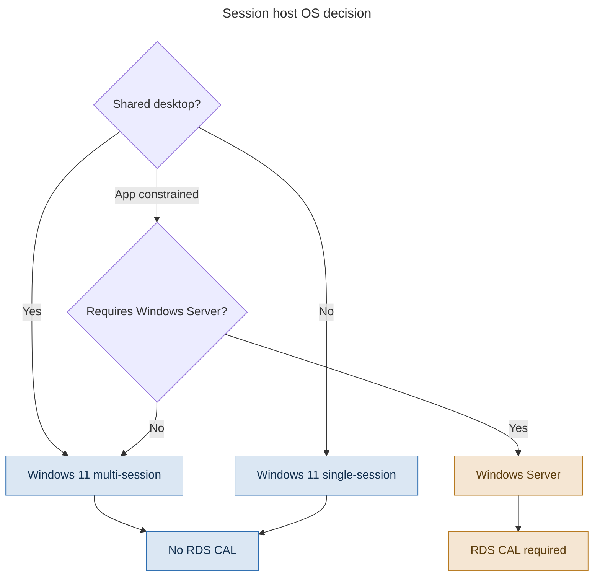

# Chapter 5 - Operating Systems, Multi-session and Licensing

> **Book:** Azure Virtual Desktop - Architect to Hands-on Implementation
> **Part I:** AVD Fundamentals and the Architect's Mental Model
> **Technical baseline:** August 2026

---

## Chapter Information

| Item | Detail |
|---|---|
| **Chapter number** | 5 |
| **Objective** | Choose the right session host operating system for a workload, and explain the licensing consequences of that choice without hedging |
| **Prerequisites** | Chapters 1-4 |
| **Dependencies** | Extends the licensing section of [Chapter 1](ch01-what-avd-actually-is.md#5-licensing-explained-simply); feeds [Chapter 17](ch17-session-host-sizing-compute-selection.md) sizing and [Chapter 24](ch24-intune-and-avd-endpoint-management.md) endpoint management |
| **Estimated lab time** | None. Lab 4 begins in [Chapter 7](ch07-identity-architecture-foundations.md) |
| **Azure resources required** | None. Reading only |
| **Cost** | **$0.00** |

---

## What You Will Learn

- What multi-session actually is, and why it is a separate Windows edition rather than a setting
- Single-session versus multi-session as an architecture decision, not a preference
- When Windows Server is the right session host, and what it costs you in licensing
- How session density is really determined
- The activation rules that differ between Azure and Azure Local
- The three licensing questions, applied to real OS choices

---

## Why This Matters

The OS choice looks like a small decision on a deployment form. It is not. It determines your licensing model, your density economics, your management tooling, your application compatibility story, and whether half your Intune policies will silently report *Not applicable*.

It is also difficult to reverse. Changing session host OS means a new image, a new host pool in most cases, application retesting, and a migration for users. Get it right at design time.

---

## 1. Single-session and Multi-session

**Single-session** means one interactive user at a time on a VM. This is normal Windows behaviour - Windows 11 Enterprise on a desktop, or Windows 11 Enterprise on an Azure VM. In AVD this is used for personal host pools where each user has their own machine.

**Multi-session** means several users have their own interactive Windows session on the same VM at the same time.

Microsoft's own framing is the clearest: Windows 10 Enterprise multi-session and Windows 11 Enterprise multi-session allow multiple concurrent interactive sessions - previously only Windows Server could do this. This gives users a familiar Windows experience for session hosts in a pooled host pool, and IT gets the cost advantages of multi-session while using existing per-user Windows licensing instead of RDS Client Access Licenses.

That sentence contains the entire business case. Before multi-session Windows client existed, high-density VDI meant giving users a Windows Server desktop that looked and behaved differently from the Windows their organisation actually ran - and it meant buying RDS CALs.

### Multi-session is a distinct edition, not a feature

This is the single most important technical point in the chapter, and it explains a large share of the problems people hit later.

Windows 11 Enterprise multi-session is not standard Windows 11 with a checkbox enabled. It is a separate edition, licensed and deployed differently, and Windows treats it as such. Microsoft states plainly that Windows Enterprise multi-session VMs are treated as a separate OS edition and some Windows Enterprise configurations won't be supported for this edition.

The consequences show up everywhere:

- Intune policies that work on physical laptops may report **Not applicable** ([Chapter 24](ch24-intune-and-avd-endpoint-management.md) and the [Intune support matrix](../appendices/intune-avd-support-matrix.md))
- Windows Update ring policies do not apply
- Some applications check the OS edition and refuse to install
- Some vendor support statements do not cover it

It is also constrained to one place. Multi-session is supported in production only as part of Azure Virtual Desktop running in Azure. It is not a general-purpose server or workstation edition, and it is not something you deploy on-premises as a standalone VM. `[VERIFY BEFORE IMPLEMENTATION]` - support boundaries for multi-session in newer AVD deployment models (Azure Local, Arc-enabled hosts, AVD hybrid scenarios) have been changing during 2026. Confirm on Microsoft Learn before designing around them.

---

## 2. The OS Options

> **BOOK REFERENCE ARCHITECTURE** - original decision diagram.
> Microsoft's supported-OS guidance: https://learn.microsoft.com/en-us/azure/virtual-desktop/prerequisites



> This is a decision flow diagram, so it uses the reduced explanation set defined in the [diagram standard](../DIAGRAM-STANDARD.md): what it shows, step by step, architect's interpretation, and the official reference. Failure points do not apply to a decision tree.

### What the diagram shows

Three viable paths, chosen by workload characteristics, not by preference. Each carries a different licensing consequence, and that consequence is the thing most people forget until deployment.

### Step-by-step reasoning

1. **Does the user need a machine to themselves?** Local admin rights, persistent installed software, unpredictable resource consumption, or a GPU workload that does not share well - that is single-session on a personal host pool.
2. **If not, can the workload share?** Task workers, knowledge workers, call centre staff. Multi-session on a pooled host pool, and this is where AVD's cost advantage lives.
3. **Is there a hard requirement for Windows Server?** An application that only supports Server, a vendor support statement that requires it, or an existing estate the organisation is not ready to move. Choose it deliberately, and put the RDS CAL cost in the business case on day one.

### Architect's view

Default to **Windows 11 Enterprise multi-session** for shared desktops and justify anything else. It gives users the Windows they recognise, it avoids RDS CALs, and it is where Microsoft's investment in AVD is concentrated.

Choose **Windows Server** only for a stated requirement. "We've always used Server" is not a requirement. Server session hosts bring a different user experience, a different support matrix, and a licensing line item that is easy to forget when you are comparing costs against Windows 365 or a Citrix estate.

**Official reference:** https://learn.microsoft.com/en-us/azure/virtual-desktop/prerequisites

---

## 3. Density: What Actually Determines It

People want a number. Microsoft, correctly, will not give one: how many interactive sessions can be active at the same time relies on your system's hardware resources (vCPU, memory, disk, and vGPU), how your users use their apps while signed in, and how heavy your system's workload is.

That is not evasion - it is the truth. Density is a measured outcome, not a specification.

**What drives it:**

| Factor | Effect |
|---|---|
| vCPU count and generation | The primary constraint for most workloads |
| Memory | Often the real limit before CPU, especially with browser-heavy users |
| Disk IOPS | Logon storms are an IO problem before they are a CPU problem |
| Profile storage performance | A slow profile share caps density regardless of host size |
| Application mix | One badly behaved LOB app can halve density |
| User behaviour | Number of browser tabs is a genuine engineering input, unfortunately |

**The honest method** (developed properly in [Project 07](../scenarios/project-07-call-centre-high-density.md)):

1. Start from a defensible assumption for the persona, and label it clearly as an assumption.
2. Deploy a small pilot with real users and real applications.
3. Measure CPU, memory, disk and logon duration under genuine peak load.
4. Adjust the max session limit from measurement, not from a blog post.
5. Re-measure after any significant application or image change.

**Interview framing.** If asked "how many users per host?", never answer with a bare number. Say: *"It depends on the persona and the application mix, so I'd start from an assumption, pilot it, and set the session limit from measured data. For a task worker on a D8s-class host I'd start around 8-10 and expect to adjust. What I won't do is publish a number I haven't measured, because that's how you end up with a host pool that falls over at 9am."* That answer scores far better than a confident guess.

---

## 4. Activation

Activation differs by where the session host runs, and it is a common source of confusion in hybrid designs.

**Session hosts on Azure.** Marketplace images activate against Azure's KMS infrastructure. This is why `azkms.core.windows.net` on TCP 1688 appears in the required outbound list ([Chapter 4](ch04-connection-flow-end-to-end.md#3-what-session-hosts-actually-need-outbound)). Block it and you get activation failures that surface days later as licensing warnings on user desktops.

**Session hosts on Azure Local.** The rules are explicit: for session hosts on Azure Local you must license and activate the VMs before using them with AVD. For activating VMs that use Windows 10 Enterprise multi-session, Windows 11 Enterprise multi-session, and Windows Server 2022 Datacenter: Azure Edition, use Azure verification for VMs. For all other OS images - such as Windows 10 Enterprise, Windows 11 Enterprise, and other editions of Windows Server - continue to use existing activation methods.

**Architect's note.** Two activation paths in one estate is a real operational burden. If a customer runs both Azure and Azure Local session hosts, document which hosts use which method and who owns it, or it will be discovered during an audit rather than during design.

---

## 5. Entra Joined Session Hosts Change the Prerequisites

Worth flagging here because the OS choice and the join model interact.

For Entra-joined session hosts, Microsoft notes additional steps beyond just deploying the VM: for session hosts on Azure that are joined to Microsoft Entra ID, you also need to enable single sign-on or earlier authentication protocols, assign an RBAC role to users, and review your multifactor authentication policies so that users can sign in to the VMs.

That RBAC requirement catches people out. On a domain-joined host, being assigned to the application group is enough. On an Entra-joined host, the user also needs an Azure RBAC role - Virtual Machine User Login or Virtual Machine Administrator Login - on the session hosts. Miss it and the user connects and is then rejected at Windows logon, which looks like an authentication fault rather than a missing role assignment.

Full treatment in [Chapter 7](ch07-identity-architecture-foundations.md) and [Chapter 8](ch08-authentication-flows-in-detail.md).

---

## 6. Licensing, Applied to the OS Choice

[Chapter 1](ch01-what-avd-actually-is.md#5-licensing-explained-simply) established the three questions. Here is how the OS answers the second one.

| Session host OS | AVD access rights | RDS CAL | Notes |
|---|---|---|---|
| Windows 11 Enterprise multi-session | From eligible per-user licence | Not required | The default choice for pooled |
| Windows 11 Enterprise single-session | From eligible per-user licence | Not required | Personal host pools |
| Windows 10 Enterprise multi-session | From eligible per-user licence | Not required | Support lifecycle - see below |
| Windows Server (any edition) | From eligible per-user licence | **Required** | Separate purchase, separate management |

`CURRENCY FLAG - Windows 10 reached end of support in October 2025. Extended Security Update arrangements for Windows 10 Enterprise multi-session on AVD have their own terms and dates. [VERIFY BEFORE IMPLEMENTATION] - confirm the current position on Microsoft Learn before recommending Windows 10 for any new deployment. For greenfield work in 2026, deploy Windows 11.`

**The mistake to avoid.** Comparing an AVD design against Windows 365 or Citrix on compute cost alone, having quietly chosen Windows Server session hosts and left the RDS CALs out of the model. Someone will find it, usually in front of a finance stakeholder.

---

## 7. Northwind Applied

Applying this to the [capstone customer](ch01-what-avd-actually-is.md#4-meet-the-capstone-customer-northwind-global-manufacturing):

| Persona | Users | OS choice | Reason |
|---|---|---|---|
| Task workers | 1,400 | Windows 11 Enterprise multi-session | Density is the whole business case |
| Knowledge workers | 1,100 | Windows 11 Enterprise multi-session | Same, with a larger host size |
| Finance / regulated | 250 | Windows 11 Enterprise multi-session | Separate host pool for isolation, same OS |
| Engineers (CAD) | 180 | Windows 11 Enterprise single-session | GPU, large working sets, personal pool |
| Developers | 170 | Windows 11 Enterprise single-session | Local admin, unpredictable resource use |
| Executives | 100 | Windows 11 Enterprise multi-session | Joins the knowledge worker pool |

**Result: no RDS CALs anywhere in the design.** That is a real number in the business case, and it is worth stating explicitly in the architecture document rather than leaving it implicit.

**The decision to document.** If Northwind's SAP or CAD vendor later requires Windows Server for a specific component, that becomes a scoped exception - one small Server-based RemoteApp host pool with its own CAL line - not a reason to move the whole estate to Server.

---

## 8. Common Mistakes

- **Treating multi-session as a setting.** It is a distinct edition with distinct behaviour and distinct support boundaries.
- **Choosing Windows Server out of habit.** It carries an RDS CAL cost and a different user experience. Choose it for a stated requirement.
- **Publishing a density number before measuring.** Density is measured, then adjusted.
- **Forgetting KMS egress.** Blocking TCP 1688 produces activation failures that appear long after deployment.
- **Assuming physical-desktop policies transfer to multi-session.** They partly do. The gap is where your incidents come from.
- **Deploying Windows 10 for new work in 2026.** Check the lifecycle position first, and default to Windows 11.
- **Forgetting the RBAC role on Entra-joined hosts.** It looks like an authentication failure and it is a missing role assignment.

---

## 9. Interview Preparation

### Q11. What is Windows Enterprise multi-session and why does it matter?

**Simple answer**
It is a Windows client edition that allows multiple users to have their own interactive session on one VM at the same time. Before it existed, only Windows Server could do that. It means users get a familiar Windows desktop, and you use existing per-user licensing instead of RDS CALs.

**Strong senior architect answer**
"It's what makes pooled AVD economically viable. Multiple concurrent interactive sessions on one host, with a client OS experience, covered by the per-user Microsoft 365 or Windows Enterprise licence rather than RDS CALs. The important architectural point is that it's a *separate OS edition*, not a feature of Windows 11 - so Windows treats it differently. That's why some Intune policies report Not applicable, why update rings don't work on it, and why you have to check vendor support statements rather than assume. It also only runs in production as part of AVD in Azure, so it isn't a general-purpose Windows edition."

**Follow-up you should expect**
"So when would you use Windows Server instead?" - a stated requirement only: an application that requires Server, or a vendor support statement. And you immediately raise the RDS CAL cost, because that is the thing that gets missed in comparisons.

---

### Q12. How many users can you put on a session host?

**30-second answer**
"It depends on the persona and the application mix, so I won't give you a number I haven't measured. I'd start from an assumption for the persona, pilot with real users and real apps, and set the max session limit from measured CPU, memory, disk and logon time. For a task worker on a D8s-class host I'd start around 8-10 and expect to adjust."

**Why this scores well**
The question is a trap for people who memorise sizing tables. Microsoft's own guidance is that density depends on hardware, application behaviour and workload. Refusing to give a number *and then explaining exactly how you'd get one* demonstrates method rather than recall.

**Deep-dive answer**
Explain the constraint order: memory usually binds before CPU for browser-heavy users, disk IO binds during logon storms, and profile storage performance can cap density no matter how large the host is - so sizing the host without sizing the storage is meaningless. Mention that density interacts with the load balancing algorithm: breadth-first spreads users and improves experience, depth-first packs them and improves cost, and the right choice depends on whether the customer is optimising for experience or spend. Finish by noting that density is not a one-time exercise - it has to be re-measured after image and application changes.

---

### Q13. A customer wants Windows Server session hosts. How do you respond?

**Strong answer**
"First I'd ask why, because the answer changes the design. If it's an application that genuinely requires Server, or a vendor support statement, that's a legitimate requirement and I'd scope it - often as a small Server-based RemoteApp host pool rather than moving the whole estate. If the answer is that they've always used Server, I'd walk through the trade-offs: Server means RDS CALs, which is a real cost line that's easy to leave out of a comparison, and it gives users a desktop that doesn't look like the Windows they use elsewhere, which generates support calls. Windows 11 multi-session gives the same density with a familiar experience and no CALs. But I'd present it as a decision with a cost attached rather than telling them they're wrong."

**Why this works**
It shows you can push back without being combative, you quantify the trade-off, and you offer a scoped compromise instead of an all-or-nothing answer. That is what senior means in practice.

---

## 10. Key Takeaways

- Multi-session allows several concurrent interactive sessions on one host, and is covered by per-user licensing rather than RDS CALs.
- It is a **separate OS edition**, which is why some policies, tools and applications behave differently on it.
- Windows Server session hosts require RDS CALs. Choose Server for a stated requirement, and put the CAL cost in the business case immediately.
- Density depends on hardware, application mix and user behaviour. Measure it; do not quote it.
- Activation differs between Azure and Azure Local. Azure hosts need TCP 1688 outbound to KMS.
- Entra-joined session hosts need an Azure RBAC role for users in addition to application group assignment.
- For greenfield work in 2026, deploy Windows 11 and verify the Windows 10 lifecycle position before considering it.

---

## 11. Official References

- Prerequisites for Azure Virtual Desktop - https://learn.microsoft.com/en-us/azure/virtual-desktop/prerequisites
- Windows Enterprise multi-session FAQ - https://learn.microsoft.com/en-us/azure/virtual-desktop/windows-multisession-faq
- Add session hosts to a host pool - https://learn.microsoft.com/en-us/azure/virtual-desktop/add-session-hosts-host-pool
- Manage the operating system of session hosts - https://learn.microsoft.com/en-us/azure/virtual-desktop/management
- Licensing Azure Virtual Desktop - https://learn.microsoft.com/en-us/azure/virtual-desktop/licensing

---

## 8. Production Scenarios

### Scenario 1: Intune policies report Not applicable on multi-session

**Problem.** A security team applies its standard Windows hardening policies to a new multi-session host pool. Around a third report Not applicable and the compliance dashboard shows the hosts as unmanaged.

**Symptoms.** Policies apply cleanly to physical laptops. Same policies, same tenant, different result on session hosts. No error, just Not applicable.

**Business impact.** No user impact. The security team cannot evidence compliance for the session host estate, which blocks sign off.

**Initial hypothesis.** Multi-session is a separate OS edition and some Windows Enterprise configurations are not supported on it. This is documented behaviour rather than a fault.

**Investigation.** Portal path: *Microsoft Intune admin center > Devices > Configuration > the policy > Device assignment status*, and compare a session host against a laptop. Then filter the Settings catalog by **Enterprise multi-session** to see which settings are actually available for the edition. Cross check against the [Intune and AVD support matrix](../appendices/intune-avd-support-matrix.md).

**Evidence.** The unsupported settings do not appear when the catalog is filtered for multi-session.

**Root cause.** The policies were built for a different OS edition.

**Fix.** Rebuild the baseline using settings available for Enterprise multi-session, and accept that a small number of controls have to be met another way, through the image or through host pool settings.

**Validation.** Policy status shows Succeeded for the intended settings on a test host, and the compliance policy targeting the multi-session device group evaluates correctly.

**Prevention.** Maintain two baselines, one for physical endpoints and one for multi-session, and state clearly which controls are delivered by the image instead. Pilot every policy on one host before broad assignment.

**Architect lesson.** Multi session being a separate edition changes your management tooling, and the gap is where incidents come from.

**Interview lesson.** Explaining Not applicable as documented behaviour rather than a bug shows real Intune experience.

**Architect's lesson.** Multi-session being a separate edition is not trivia. It changes management tooling, and the gap is where the incidents come from.

### Scenario 2: The RDS CAL nobody budgeted for

**Problem.** Two weeks before go live, licensing review flags that the RemoteApp host pool uses Windows Server session hosts. No RDS CALs were purchased.

**Symptoms.** Nothing technical. A procurement and compliance problem discovered late.

**Business impact.** Unbudgeted licence cost two weeks before go live, and a compliance exposure until it is resolved.

**Initial hypothesis.** The OS choice was made by the application team for compatibility, and the licensing consequence never reached the business case.

**Investigation.** Confirm the session host OS for every host pool, then check whether each pool genuinely requires Server or was chosen by default.

**Evidence.** One pool of eight hosts serving a single legacy application requires Server. The other four pools do not.

**Root cause.** A technical decision with a licensing consequence, made without the licensing conversation.

**Fix.** Purchase RDS CALs for the affected user group only, and scope the Server pool as narrowly as possible. Move every other workload to Windows 11 multi-session.

**Validation.** Licensing position documented and accepted, with the CAL count matched to the assigned user group rather than the whole estate.

**Prevention.** Add "does any host pool use Windows Server" to the design review checklist, and require the licensing line in the business case before OS selection is signed off.

**Architect lesson.** OS selection is a licensing decision as much as a technical one.

**Interview lesson.** Raising RDS CALs unprompted in an OS discussion signals commercial awareness, which senior roles look for.

**Architect's lesson.** OS selection is a licensing decision as much as a technical one. Raise it at design time, when it is a cost line, rather than at go live, when it is a problem.

### Scenario 3: Activation failures three weeks after deployment

**Problem.** Users start seeing Windows activation warnings on session hosts that were working fine.

**Symptoms.** Delayed onset. Only affects newly built hosts and hosts that were rebuilt. Original hosts are unaffected.

**Business impact.** Activation warnings visible to users on newly built hosts, which erodes confidence even though nothing has actually stopped working.

**Initial hypothesis.** Outbound access to Azure KMS on TCP 1688 is blocked. Activation has a grace period, which explains the delay between the change and the symptom.

**Investigation.** Check outbound rules for TCP 1688 from the session host subnet. Then from a host:

```bash
az vm run-command invoke -g rg-avd-hosts-lab-eus2-01 -n <vm> \
  --command-id RunPowerShellScript \
  --scripts "Test-NetConnection -ComputerName azkms.core.windows.net -Port 1688; slmgr.vbs /dlv"
```

**Evidence.** The port test fails and the licensing status shows the host is not activated.

**Root cause.** An egress rule change removed TCP 1688. Existing hosts stayed activated, so nothing broke immediately.

**Fix.** Restore outbound TCP 1688 to KMS. See the rule in [Lab 3](../labs/lab-03-vnet-subnets-nsg-dns.md).

**Validation.** Activation succeeds on a rebuilt host, and the licensing status is confirmed rather than assumed.

**Prevention.** Include activation in the post build validation for every session host, so a failure is caught at build rather than weeks later.

**Architect lesson.** Delayed symptoms make correlation hard, so validate at build time.

**Interview lesson.** Explaining why a grace period delays the symptom shows you reason about timelines, not just causes.

**Architect's lesson.** Delayed symptoms make correlation hard. Validate at build time, so the gap between a change and its effect stays small.

---

## 9. The Architect's Four Questions

**What do I check first?** Which OS edition the host pool is running, and whether that matches what the tooling and licensing assume.

**What can I safely change now?** Max session limit on a pool. Adding a host. Reading licensing status.

**What must not be changed blindly?** Session host OS, which means a new image, retesting and often a new host pool. Host pool type, which cannot be changed at all. Max session limit in production during working hours, because it affects where users land.

**When do I escalate to Microsoft?** For activation failures where outbound 1688 is proven open, or where a documented multi-session capability does not behave as documented. Collect the output of `slmgr.vbs /dlv`, the connectivity test, the image publisher, offer, SKU and version, and the region.

---

## Architect's Reality Check

**What engineers commonly get wrong.** They treat multi-session as a Windows 11 feature. It is a separate edition, and that is why policies, tools and some applications behave differently on it.

**What I would check first in production.** Which OS edition the host pool runs, and whether the management tooling assumes something else. A third of Intune policies reporting Not applicable is not a fault, it is an edition mismatch.

**What I would ask the customer.** Whether any application requires Windows Server. If yes, that is a licensing conversation on day one rather than two weeks before go live.

**What I would decide as the architect.** Windows 11 multi-session for shared desktops unless there is a stated requirement otherwise, and any Windows Server pool scoped as narrowly as possible with the CAL cost written into the business case.

**What I would say in an interview.** Refuse to quote a density number. Explain the method instead, and name the constraint order: memory usually binds before CPU, and disk binds during logon storms.

---

## How This Changes With Scale

**Around 100 users.** One image, one OS choice. Density hardly matters because you are running few hosts either way.

**Around 1,000 users.** Density is now money. A difference of two users per host changes host count by twenty percent, which is why the pilot measurement earns its time.

**Around 5,000 users and beyond.** Multiple images for multiple personas, each with its own lifecycle. Licensing exceptions need tracking rather than remembering, and an unnoticed Windows Server pool becomes a compliance finding rather than a cost surprise.

---

## Chapter Close

**What was completed**
You can choose a session host OS from workload requirements, explain the licensing consequence of that choice, describe why multi-session behaves as a separate edition, and answer a density question without guessing.

**What you should test**
No lab. Instead: take your current employer's user population, split it into personas, and assign an OS to each with a one-line justification. Then check whether any of them would need RDS CALs.

**What comes next**
Chapter 6 covers clients and the endpoint story - Windows App, the web client, the MSRDC retirement, and what actually differs between platforms. That closes Part I. **Lab 4 (identity integration) begins in Chapter 7 and is the first lab with running compute cost.**

**Interview preparation carried forward**
Q12 is the one to practise. Most candidates answer it with a number and lose the point. Practise the version that refuses the number and supplies the method instead.

---

## Chapter Self-Review

**Pass 1, technical verification.** Multi-session as a separate OS edition, density guidance, activation rules for Azure and Azure Local, and the Entra join prerequisites verified against the AVD prerequisites, multi-session FAQ and licensing pages. Currency flag on the Windows 10 lifecycle position.

**Pass 2, readability.** Three production scenarios and the architect's four questions added during the audit, covering Intune policy applicability, an unbudgeted RDS CAL and delayed activation failures.

| Check | Result |
|---|---|
| Technical accuracy | Verified against current Microsoft Learn pages |
| Current capability verified | Yes, August 2026 |
| Supported versus unsupported separated | Yes |
| Commands, portal paths, KQL | Exact paths given where the chapter includes investigation steps |
| Production scenarios | Three, in the required format |
| Architect's four questions | Present |
| Mermaid diagram | Renders and matches the text |
| Architecture consistency | Naming conventions, lab environment and Northwind design consistent with other chapters |
| Links and cross references | Checked |
| Cost statements | Accurate, with running and deallocated figures where compute is involved |
| Security implications | Stated |
| Interview answers | Read aloud |
| Duplicate content | Cross referenced rather than repeated |
| Simple English | Reviewed |
| AI sounding language | Removed |
| Long dash characters | None |
