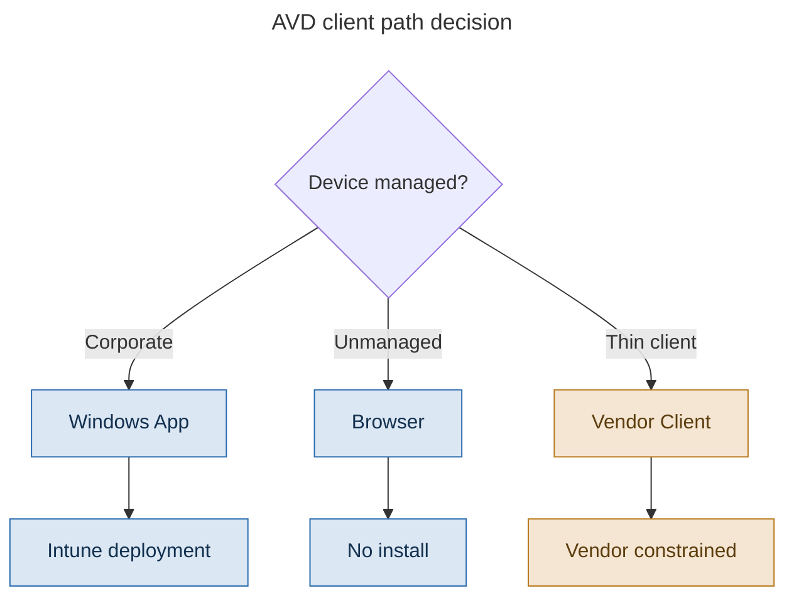

# Chapter 6 - Clients and the Endpoint Story

> **Book:** Azure Virtual Desktop - Architect to Hands-on Implementation
> **Part I:** AVD Fundamentals and the Architect's Mental Model
> **Technical baseline:** August 2026

---

## Chapter Information

| Item | Detail |
|---|---|
| **Chapter number** | 6 |
| **Objective** | Choose and roll out the right AVD client, and plan a client migration without breaking access for users |
| **Prerequisites** | Chapters 1 to 5 |
| **Dependencies** | Uses the connection flow from [Chapter 4](ch04-connection-flow-end-to-end.md) |
| **Estimated lab time** | None. Lab 4 begins in [Chapter 7](ch07-identity-architecture-foundations.md) |
| **Azure resources required** | None |
| **Cost** | $0.00 |

---

## What You Will Learn

- Which clients are supported today and which have been retired
- The MSRDC end of support dates, including the ones that differ by cloud
- What Windows App is and why Microsoft moved to it
- How to plan a client migration for a few thousand users
- Where client choice affects your architecture, not just the user's desktop shortcut

---

## Why This Matters

The client feels like the least architectural part of AVD. It is a shortcut on a laptop. Nobody puts it in a design document.

Then a support date passes, the old client stops working, and 3,000 people cannot get to their desktop on a Monday morning. That happened to a lot of organisations in 2026.

Client choice also quietly shapes the design. Whether you can use RDP Shortpath, whether users on unmanaged devices get a browser or an installed app, how you deploy updates, and how much your helpdesk hears about it are all client decisions.

---

## 1. The Client Situation Right Now

`CURRENCY FLAG - verified August 2026. Client lifecycle dates have moved several times. Check the current Microsoft page before you build a migration plan.`

Microsoft has consolidated a confusing set of clients into one. The old names overlapped badly and people still mix them up, so start by getting the names straight.

| Client | What it actually was | Status as of August 2026 |
|---|---|---|
| **Windows App** | The current unified client for AVD, Windows 365, Dev Box, RDS and remote PCs | Supported. This is the one you deploy |
| Remote Desktop client for Windows (MSRDC, the MSI installer) | The standalone MSI, app name "Remote Desktop" | Retired for public cloud |
| Remote Desktop app for Windows (Microsoft Store) | A separate Store app, also called "Remote Desktop" | Retired |
| Remote Desktop web client | The older browser client | Retired for public cloud |
| `mstsc.exe` | The built in Windows RDP tool | Still present. Not the AVD client. Used for direct RDP to a machine |

The dates, from Microsoft's own lifecycle page:

As of March 27, 2026, the Microsoft Remote Desktop Client for Windows (MSI) and the Remote Desktop web client are no longer supported for customers using public cloud environments. Support for the Remote Desktop Client for Windows (MSI) has been extended until September 28, 2026 for Azure Government, Azure operated by 21Vianet and AVD Classic. There is currently no announced end of support date for the Remote Desktop web client in Azure Government or Azure operated by 21Vianet. The Remote Desktop app for Windows from the Microsoft Store is no longer supported and is no longer available for download or installation, having reached end of support in September 2025.

Two details that catch people out.

**The sovereign cloud dates are different.** If you run in Azure Government or Azure operated by 21Vianet, the MSI client has a later date. That does not mean you should wait. It means you have a bit more room to plan.

**AVD Classic is on the extended list too.** If you still have a classic deployment, you have two clocks running at once. The classic service itself is also ending. See [Chapter 1](ch01-what-avd-actually-is.md#3-how-avd-got-here).

---

## 2. What Windows App Is

Windows App is one client that connects to several Microsoft remote services. Microsoft describes it as the new way to connect all of your cloud and remote resources, replacing the Remote Desktop client, covering Windows hosted in the cloud from Azure Virtual Desktop, Windows 365 and Microsoft Dev Box, along with Remote Desktop Services on premises and point to point connections with remote PCs.

The reason for the change is worth understanding. Before Windows App, a user with a Cloud PC, an AVD desktop and a Dev Box needed to think about which app to open. Now it is one app and one list of resources.

Windows App runs on Windows, macOS, iOS and iPadOS, Android and in a browser. Feature coverage is not identical across those platforms, which matters when you have a mixed endpoint estate. Check the current per platform comparison on Microsoft Learn rather than assuming parity. `[VERIFY BEFORE IMPLEMENTATION]`

**Be honest about parity.** Microsoft has said it is working to ensure Windows App reaches feature parity with the Remote Desktop client for Windows to ease this migration. That wording tells you parity was not complete when the statement was made. If your users depend on a specific redirection or a specific setting, test it before you remove the old client, not after.

---

## 3. Where Client Choice Touches the Architecture

Four places where this stops being a desktop support topic and becomes a design topic.

**RDP Shortpath.** The transport is negotiated between client and session host. Client version and platform affect whether UDP is used. If half your users are on an old client build, part of your estate is silently on TCP only. See [Chapter 4, section 4](ch04-connection-flow-end-to-end.md#4-rdp-shortpath).

**Managed versus unmanaged devices.** An installed client needs a deployment mechanism. A browser does not. That single fact often decides how you handle contractors and BYOD users.

**Conditional Access.** Device based policies need a device you can evaluate. Browser access from an unmanaged laptop is a different risk conversation to an installed client on an Intune managed device. See [Chapter 9](ch09-conditional-access-mfa-zero-trust.md).

**Update control.** Store deployed and MSI deployed clients update differently. If you need to pin a version because of an application issue, know which delivery method gives you that control before you commit to it.

---

## 4. Choosing a Client Path

> This is a decision flow diagram, so it uses the reduced explanation set defined in the [diagram standard](../DIAGRAM-STANDARD.md): what it shows, step by step, architect's interpretation, and the official reference. Failure points do not apply to a decision tree.

**What the diagram shows.** Client choice is decided by who manages the endpoint, not by preference. Each path carries a different set of constraints, and those constraints reach into security design and protocol behaviour rather than staying in the desktop team.

**Step by step.** Establish who owns the device. A managed device supports an installed client, version control and device based Conditional Access. An unmanaged device pushes you towards the browser, which removes the install and the offboarding step but moves your controls inside the session. Thin clients remove the choice entirely, so the vendor's supported client has to be confirmed before anything else is agreed.

**Architect's view.** The trade is between device assurance and endpoint management effort. Managed devices give you more signal to make access decisions with. Browser access gives you speed and zero endpoint footprint, and you compensate with session controls such as redirection restrictions and watermarking. See [Project 06](../scenarios/project-06-byod-remote-workforce.md).

**Official reference:** https://learn.microsoft.com/en-us/windows-app/

---

## 5. Real-World Examples

### Example 1: A 4,000 seat manufacturer running out of runway

**The requirement.** In late 2025 a manufacturer had 4,000 users on the MSI Remote Desktop client. The March 2026 date was approaching. They had no client inventory and no deployment tooling for it, because the client had been installed once, years earlier, by a project team that no longer existed.

**The decision.** Migrate to Windows App through Intune, in waves, with both clients installed side by side during the overlap.

**Why this approach.** A big bang cutover on a client with incomplete feature parity is a bad trade. Running both for a period costs nothing and gives users a fallback. Intune was already deployed for laptops, so it was the deployment path with the least new work.

**How it was implemented.**

1. Inventory first. Find every device with the old client, using Intune discovered apps or Configuration Manager inventory.
2. Deploy Windows App to a pilot group of about 50 users covering every persona, including one CAD user and one call centre user.
3. Test the redirections that matter to those personas. Printers, USB devices, cameras, smart cards, multi monitor.
4. Roll out in waves by department, keeping the old client installed.
5. Only after the last wave, remove the old client.

**What could go wrong.** The pilot group is picked for convenience rather than coverage. Ten head office knowledge workers all pass, and then the CAD team finds a redirection gap on the day of their wave. Pick pilots by persona, not by who sits nearby.

**How an architect validates it.** Deployment reporting shows Windows App installed. Connection data confirms users are actually connecting through it. Helpdesk ticket volume during each wave stays flat. If tickets spike, pause the next wave rather than pushing through.

### Example 2: 400 contractors on unmanaged laptops

**The requirement.** A financial services firm brings in contractors for three to nine month engagements. They use their own laptops. The firm will not manage those devices and will not ship hardware.

**The decision.** Browser access through Windows App in the browser. No installed client. Conditional Access requiring MFA, plus session controls that block clipboard and drive redirection.

**Why this approach.** Installing software on a device you do not manage creates support and liability you do not want. A browser removes the install step entirely, which also removes the offboarding step. When the engagement ends you remove the group membership and access stops.

**How it was implemented.** Publish the workspace URL in the onboarding pack. Create a Conditional Access policy scoped to the contractor group requiring MFA. Apply redirection controls on the host pool so data cannot leave the session. Session hosts for contractors live in their own host pool with tighter policy. See [Project 06](../scenarios/project-06-byod-remote-workforce.md).

**What could go wrong.** Browser support has real requirements. Microsoft's guidance for the older web client set a clear expectation: only browser versions that are 12 months old on a rolling basis are supported, the browser must support the AVC codec, and WebGL must be enabled. Contractors on an old browser build will have a poor experience and will blame AVD. Put the browser requirement in the onboarding pack.

**How an architect validates it.** A test connection from an unmanaged device outside the corporate network, before the first contractor starts. Not from the office, and not from a corporate laptop, because both hide the problems you are trying to find.

### Example 3: A call centre on thin clients

**The requirement.** 600 agents on shift, using thin client hardware bought three years ago. Agents use a softphone and a CRM application. Audio quality is the thing that gets escalated to the operations director.

**The decision.** Confirm the thin client vendor's supported client before anything else in the design is agreed.

**Why this approach.** Thin clients run a locked down OS. The AVD client available on it is whatever the vendor ships. You do not get to choose freely. This constrains protocol features and therefore audio quality, and it is much cheaper to find that out during design than during pilot.

**How it was implemented.** The vendor's firmware was checked for a supported and current client. Audio was tested with the real softphone under load, not with a media player. Where the thin client could not deliver acceptable audio, the answer was a hardware refresh for that group, which had to go into the business case as a cost.

**What could go wrong.** The project assumes the endpoint estate is fine because it works today with an older platform. Then audio quality is poor, and by that point the budget is spent and the launch date is fixed.

**How an architect validates it.** Test with the actual softphone, on the actual hardware, over the actual network, with 20 concurrent agents. Measure round trip time and confirm the transport in use. A single tester in a quiet office proves nothing.

---

## 6. Planning a Client Migration

A short, reusable sequence. It works for any client change, not just this one.

1. **Inventory.** You cannot migrate what you cannot see. Intune discovered apps, Configuration Manager, or a login script that reports installed versions.
2. **Group by persona.** Task workers, engineers, call centre, BYOD, executives. Each has different redirection needs.
3. **Pilot across personas.** At least one real user from each. Not volunteers from the IT floor.
4. **Test the features people actually use.** Printers, USB, cameras, smart cards, multi monitor, audio, clipboard behaviour.
5. **Deploy alongside, do not replace.** Keep the old client until the wave is proven.
6. **Communicate before, not after.** Users need to know which icon to click and what changes.
7. **Watch tickets per wave.** Ticket volume is your real success metric.
8. **Remove the old client last.** Once, at the end, deliberately.

**The mistake to avoid.** Treating this as a desktop team task with no architect involvement. Client capability affects protocol behaviour, redirection policy and Conditional Access design. It belongs in the architecture conversation.

---

## 7. Common Mistakes

- Assuming `mstsc.exe` and the AVD client are the same thing. They are not. `mstsc.exe` still exists and is not the AVD client.
- Planning a migration from a blog post date instead of the Microsoft lifecycle page. The sovereign cloud dates differ.
- Assuming full feature parity between the old client and Windows App. Test what your users depend on.
- Picking a pilot group by convenience. You need persona coverage, not volume.
- Ignoring browser requirements for BYOD users, then blaming AVD for a poor experience on a three year old browser build.
- Leaving thin client capability out of the design and discovering it during pilot.
- Removing the old client at the start of the migration rather than the end.

---

## 8. Interview Preparation

### Q14. What is the current AVD client situation?

**Simple answer**
Windows App is the current client. It replaced the MSI Remote Desktop client, the Store app and the old web client. The MSI client and the old web client ended support for public cloud in March 2026, with later dates for Azure Government and 21Vianet.

**Strong senior architect answer**
"Windows App is the one client now. It covers AVD, Windows 365, Dev Box, RDS and direct PC connections, which removes the old problem of users having to know which app to open. The MSI Remote Desktop client and the old web client went out of support for public cloud in March 2026, and the Store app went earlier. Sovereign clouds have later dates, so I check the environment before I plan. The part I care about as an architect is that the client is not just a desktop rollout. It affects whether Shortpath is used, how I handle unmanaged devices, and what Conditional Access can evaluate."

**Follow-up you should expect**
"How would you run that migration for 4,000 users?" That is the sequence in section 5. Lead with inventory and persona based piloting, and make the point about deploying alongside rather than replacing.

### Q15. Contractors on their own laptops need AVD access. What do you do?

**30 second answer**
"Browser access, no installed client. That removes the install and the offboarding problem in one go. I would pair it with Conditional Access requiring MFA and put the contractors in their own host pool with redirection locked down so data cannot leave the session."

**2 minute answer**
Add the reasoning. Installing software on a device you do not manage creates support you cannot deliver and a liability you do not want. Browser access means access ends when you remove group membership. Then the controls. MFA through Conditional Access, clipboard and drive redirection blocked at the host pool, and a separate host pool so contractor policy does not affect employees. Then the honest limitation. Browsers have version and codec requirements, so put that in the onboarding pack, and test from a genuinely unmanaged device off the corporate network before the first contractor starts.

**Deep dive answer**
There is a risk conversation worth having explicitly. A browser session on an unmanaged device is a different risk profile to a managed device, and you cannot evaluate device compliance on something you do not manage. So the controls shift from the device to the session. Watermarking, screen capture protection and redirection controls all apply at the host pool level. See [Project 06](../scenarios/project-06-byod-remote-workforce.md) and [Project 11](../scenarios/project-11-highly-secure-regulated.md), where the same controls are applied proportionately to a higher-risk population. Finish with the point that this is a deliberate trade. You accept less device assurance in exchange for zero endpoint management, and you compensate inside the session.

### Q16. Users say AVD stopped working after a client update. How do you handle it?

**Strong answer**
"First I would find out whether it is everyone or one persona, because that usually tells me if it is the client or something behind it. Then I would check what actually changed. If the client updated, I would compare a working machine and a broken machine on client version, and check whether the failure is at sign in, at the feed, or at the session. That maps to the connection flow, so I can tell quickly whether the client is even the problem. For prevention, I would want client version reporting so I know what my estate is running, and a small pilot ring that gets updates first."

**Why this works**
It shows a method rather than a guess, it reuses the connection flow, and it ends with prevention. Interviewers notice when a candidate finishes a troubleshooting answer with how they would stop it happening again.

---

## 9. Key Takeaways

- Windows App is the current client for AVD, Windows 365, Dev Box, RDS and remote PCs.
- The MSI Remote Desktop client and the old web client ended support for public cloud on 27 March 2026. Azure Government, 21Vianet and AVD Classic have a later date of 28 September 2026 for the MSI client.
- The Store based Remote Desktop app reached end of support in September 2025.
- `mstsc.exe` is not the AVD client and still exists for direct RDP.
- Do not assume full feature parity. Test the redirections your users depend on.
- Migrate in waves by persona, with the old client left in place until each wave is proven.
- Client choice affects Shortpath, unmanaged device access and Conditional Access design, so it belongs in the architecture.

---

## 10. Official References

- Windows App documentation - https://learn.microsoft.com/en-us/windows-app/
- Remote Desktop client overview and lifecycle - https://learn.microsoft.com/en-us/previous-versions/remote-desktop-client/overview
- Connect to Azure Virtual Desktop with Windows App - https://learn.microsoft.com/en-us/azure/virtual-desktop/users/connect-windows
- Prepare for the Remote Desktop client for Windows end of support - https://techcommunity.microsoft.com/blog/windows-itpro-blog/prepare-for-the-remote-desktop-client-for-windows-end-of-support/4397724

---

## 11. Production Troubleshooting

### Scenario 1: A group of users cannot connect after the client retirement date

**Problem.** On the Monday after the MSI client end of support date, around 200 users cannot reach their desktops.

**Symptoms.** Affected users are on laptops that have not connected to the corporate network for weeks. Everyone else is fine. The error is client side, not a service error.

**Business impact.** 200 users unable to work on a Monday, concentrated in field and remote roles who have least local support.

**Initial hypothesis.** These devices never received the Windows App deployment because they were offline during the rollout waves.

**Investigation.** Portal path: *Microsoft Intune admin center > Apps > Windows > Windows App > Device install status*. Filter for Not installed or Error, and compare against the affected user list. Then check last device check in time for those devices.

**Evidence.** Affected devices show the app as not installed, and their last Intune check in predates the deployment.

**Root cause.** The rollout assumed every device would check in during the migration window. Long term remote and field devices did not.

**Fix.** Direct affected users to browser access as an immediate workaround so they can work today, then get the devices online to receive the deployment.

**Validation.** Each affected device shows the app installed, and the user connects with it rather than the browser.

**Prevention.** Include a device check in age report in every client migration plan, and treat devices that have not checked in recently as a separate wave with a different communication approach.

**Architect lesson.** Deployment coverage is not deployment success. Measure who received it.

**Interview lesson.** Offering browser access as the same day workaround shows you separate restoring service from fixing the cause.

**Architect's lesson.** Deployment coverage is not the same as deployment success. Measure who actually received it, not who was targeted.

### Scenario 2: Redirection stops working for a specific team after migration

**Problem.** A design team loses access to a USB device inside the session after moving to the new client.

**Symptoms.** Only that team. Only that device type. Everything else works.

**Business impact.** One team unable to use hardware their work depends on. Small in headcount and capable of blocking the whole migration.

**Initial hypothesis.** A feature parity gap, or a redirection setting that was configured on the old client and not carried across.

**Investigation.** Compare the host pool RDP properties against what the team requires, then test the same device on the old client if it is still available on one machine. Check the client platform and version, because parity varies by platform.

**Evidence.** The device works on the old client and not on the new one, with the same host pool settings.

**Root cause.** A redirection capability difference for that device class on the current client version.

**Fix.** Confirm the current supported redirection behaviour on the Microsoft documentation for the client and platform in use, then either adjust host pool RDP properties or, if it is a genuine gap, keep that team on a supported path until it is closed.

**Validation.** The device works inside a session for two users on the team, on their real hardware.

**Prevention.** Test redirections by persona during pilot, not by volume of users. A team of eight can block a migration if their hardware is not covered.

**Architect lesson.** A team of eight can block a migration if their hardware is not covered.

**Interview lesson.** Choosing pilot groups by persona rather than volume is a small detail that signals real rollout experience.

**Architect's lesson.** Feature parity claims are directional. Test what your users depend on rather than what the release notes summarise.

### Scenario 3: BYOD users report a poor experience that nobody can reproduce

**Problem.** Contractors on browser access describe slow, blurry sessions. Internal testing looks fine.

**Symptoms.** Only external users. Only some of them. Internal tests from corporate laptops pass.

**Business impact.** Contractors delivering slowly and blaming the platform, with no way for the service desk to reproduce or prove the cause.

**Initial hypothesis.** Browser requirements. Older browser builds and missing codec or WebGL support degrade the experience without failing outright.

**Investigation.** Collect browser name and version from affected users. Check them against the current documented browser requirements. Confirm whether the affected users share a browser or a version range.

**Evidence.** Affected users are on browser builds outside the supported window, or with hardware acceleration disabled.

**Root cause.** Unmanaged devices running outdated browsers.

**Fix.** Publish the browser requirement in the contractor onboarding pack and ask affected users to update.

**Validation.** A previously affected user reports a normal experience after updating, tested from their own network.

**Prevention.** State browser requirements at onboarding rather than in troubleshooting. Test from a genuinely unmanaged device off the corporate network before any BYOD rollout.

**Architect lesson.** If you can only test from a managed device on the corporate network, you cannot see what BYOD users see.

**Interview lesson.** Describing how you would test from a genuinely unmanaged device is more convincing than any technical answer here.

**Architect's lesson.** If you can only test from a managed device on the corporate network, you cannot see what your BYOD users see.

---

## 12. The Architect's Four Questions

**What do I check first?** Client name, version and platform. Half of the tickets in this area are answered by knowing exactly what the user is running.

**What can I safely change now?** Directing a user to browser access as a workaround. Adding a user to a pilot ring. Reading deployment status.

**What must not be changed blindly?** Removing the old client before every wave is proven. Changing host pool RDP properties, which affects every user on that pool at their next connection. Forcing a client update across the estate without a pilot ring.

**When do I escalate to Microsoft?** When a documented feature does not work on a supported client version and platform, and you can reproduce it on a clean device. Collect the client version, platform, host pool RDP properties, a screen recording if the issue is visual, and the connection correlation ID.

---

## Architect's Reality Check

**What engineers commonly get wrong.** They treat the client as a desktop team task. Client version affects transport, redirection and what Conditional Access can evaluate, so it belongs in the architecture.

**What I would check first in production.** Client name, version and platform. Half the tickets in this area are answered by that alone.

**What I would ask the customer.** How they inventory installed clients today. If the answer is that they do not, the migration plan needs an inventory phase before anything else.

**What I would decide as the architect.** Migrate in waves by persona, keep the old client installed until each wave is proven, and remove it once at the end. Browser access for unmanaged devices, with session controls doing the work the device cannot.

**What I would say in an interview.** Name the current client and the retirement dates, then move straight to how you would run the migration. The dates are recall. The migration plan is the answer.

---

## How This Changes With Scale

**Around 100 users.** A client rollout is an afternoon. Test with a few users and deploy.

**Around 1,000 users.** Persona coverage matters more than volume. A team of eight with unusual hardware can block a wave, so the pilot has to include them.

**Around 5,000 users and beyond.** Devices that have not checked in for weeks become a real population, and they are the ones that miss the deployment. Inventory freshness becomes part of the plan, and browser access is the fallback that keeps people working on the day.

---

## Chapter Close

**What was completed**
Part I is done. You can explain what AVD is, what Microsoft runs, how the objects fit together, how a connection is made, which OS to choose, and which client to deploy.

**What you should test**
Take your own environment and answer three questions. Which client are users on today. What is your inventory method. Which personas would you put in a pilot group.

**What comes next**
Chapter 7 starts Part II with identity. This is where AVD designs succeed or fail, and it is the highest yield area in interviews after FSLogix. **[Lab 4](../labs/lab-04-identity-integration.md) begins there and is the first lab with running compute cost, roughly $30 to $70 per month for a single domain controller if left running.** The lab shows how to deallocate it between sessions.

**Interview preparation carried forward**
Q15 is the one to practise out loud. The BYOD contractor question comes up constantly, and a good answer covers the decision, the controls and the honest limitation.
