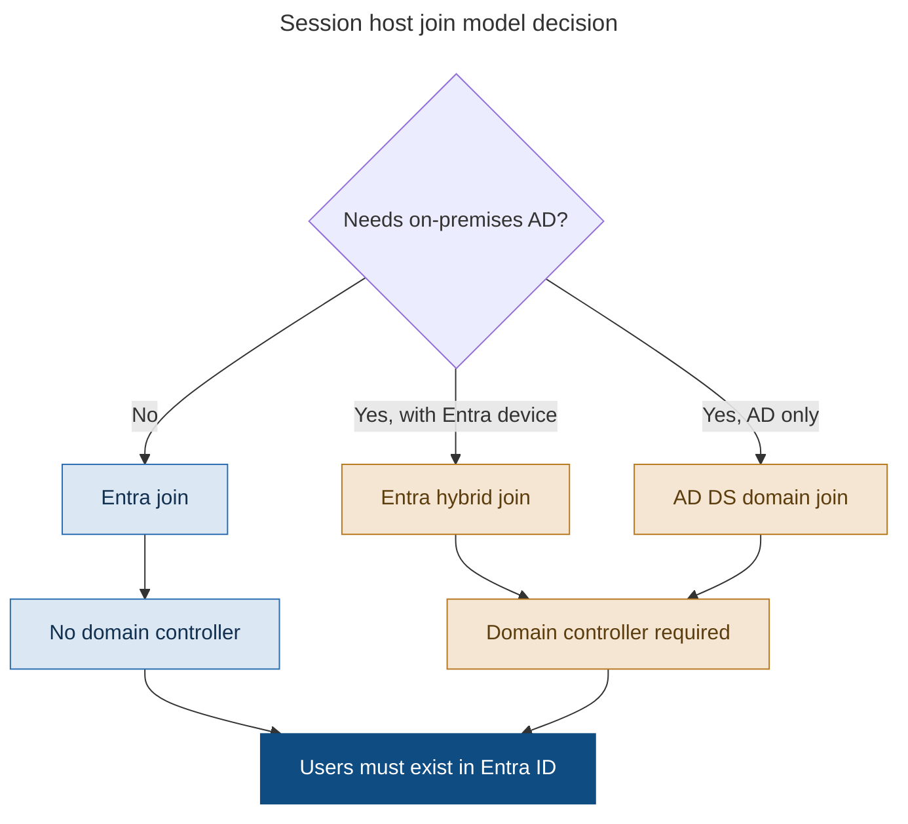

# Chapter 7 - Identity Architecture Foundations

> **Book:** Azure Virtual Desktop - Architect to Hands-on Implementation
> **Part II:** Identity and Authentication
> **Technical baseline:** August 2026

---

## Chapter Information

| Item | Detail |
|---|---|
| **Chapter number** | 7 |
| **Objective** | Choose a join model for session hosts, and understand what each one enables and blocks before you build anything |
| **Prerequisites** | Chapters 1 to 6. Labs 1 to 3 complete |
| **Dependencies** | Uses the connection flow from [Chapter 4](ch04-connection-flow-end-to-end.md) and the OS choice from [Chapter 5](ch05-operating-systems-multisession-licensing.md) |
| **Estimated lab time** | 120 minutes ([Lab 4](../labs/lab-04-identity-integration.md)) |
| **Azure resources required** | One Windows Server VM, static private IP, VNet DNS change |
| **Estimated Lab 4 cost** | **$30 to $70 per month if left running.** Under $5 if you deallocate between sessions. First lab with real compute cost |

---

## What You Will Learn

- The three join models and what each one actually gives you
- Why the user must exist in Microsoft Entra ID no matter which model you pick
- How Entra Kerberos changed cloud-native AVD design
- Where to put domain controllers when you still need them
- How to choose a join model from requirements rather than habit

---

## Why This Matters

More AVD projects fail on identity than on anything else. Not because identity is hard in theory, but because the join model decision is made early, made casually, and then constrains everything after it.

Pick Entra join and you may not need a domain controller at all. Pick domain join and every session host needs a clear network path to a DC, forever, including during a DR failover. That one choice ripples into networking, storage, profile design, patching and cost.

It is also the second highest yield interview topic after FSLogix. Interviewers ask about join models because the answer shows whether you have built a cloud-native environment or only ever extended an on-premises one.

---

## 1. Start With The Rule That Applies To Everyone

Whatever join model you choose, the user must be findable in Microsoft Entra ID. Microsoft is explicit about this: since users must be discoverable through Microsoft Entra ID to access Azure Virtual Desktop, user identities that exist only in Active Directory Domain Services aren't supported.

So an on-premises-only account is not an option. You either sync it to Entra ID or you create it there.

There is a second rule in the same guidance that causes real problems when ignored: Azure Virtual Desktop supports scenarios where the same Microsoft Entra ID identity is used to authenticate to the service and to sign in to the session host. Signing in with different identities at the same time can lead to users reconnecting to the wrong session host, incorrect or missing information in the Azure portal, error messages when using App Attach, and bypassed Microsoft Entra ID authentication and Conditional Access enforcement.

Read that last part again. **Bypassed Conditional Access enforcement.** If a user authenticates to the AVD service as one identity and signs in to Windows as another, your access controls are not doing what you think they are doing. Microsoft recommends single sign-on with Entra authentication, and so should you. That is covered in [Chapter 8](ch08-authentication-flows-in-detail.md).

---

## 2. The Three Join Models



> This is a decision flow diagram, so it uses the reduced explanation set defined in the [diagram standard](../DIAGRAM-STANDARD.md): what it shows, step by step, architect's interpretation, and the official reference. Failure points do not apply to a decision tree.

### What the diagram shows

The question that decides the model is not "what are we used to". It is "what does this workload actually need to reach". Everything else follows from that.

### Microsoft Entra join

The session host joins Entra ID only. There is no computer object in on-premises Active Directory.

Microsoft's summary of the benefit is direct: Microsoft Entra joined VMs remove the need to have line-of-sight from the VM to an on-premises or virtualized Active Directory domain controller, or to deploy Microsoft Entra Domain Services. In some cases it can remove the need for a DC entirely, simplifying deployment and management. These VMs can also be automatically enrolled in Intune.

This is the model to aim for on greenfield work. No DC to build, patch, licence and make highly available. No line of sight requirement to worry about during a DR failover. Session hosts become genuinely disposable.

**The limitations you must check.** Microsoft's Entra join guidance has historically listed restrictions, including that Microsoft Entra joined VMs don't currently support external identities such as Microsoft Entra B2B and B2C, and the Remote Desktop Store app for Windows doesn't support Microsoft Entra joined VMs.

`CURRENCY FLAG - verified August 2026, and there is a documentation discrepancy here worth knowing about.` The older restriction stated that Entra joined VMs could only access Azure Files for **hybrid** users. The current Entra joined session hosts page states something broader: Microsoft Entra joined VM access to Azure Files shares for hybrid, cloud-only and external identities using Microsoft Entra Kerberos for FSLogix user profiles is fully supported. The FSLogix documentation adds a scope limit: hybrid identities are supported in the Azure cloud, Azure for US Government, and Azure operated by 21Vianet, while cloud-only or external identities are only supported in the Azure cloud.

Different Microsoft pages have said different things during this transition. Check the current Entra joined session hosts page and the current Azure Files identity page together before you commit a design that depends on cloud-only identities. `[VERIFY BEFORE IMPLEMENTATION]`

### Microsoft Entra hybrid join

The session host is joined to on-premises AD and also registered in Entra ID. Two identities for one machine.

This is the most common model in real migrations, because most organisations already have AD, existing GPOs, and applications that expect a domain. You get GPO and Intune together, which is useful during a transition but creates the setting ownership problem covered in [Chapter 24](ch24-intune-and-avd-endpoint-management.md).

The cost is a permanent dependency. Session hosts need a working network path to a domain controller. That path has to exist in every region you deploy to, and it has to survive a DR event.

### AD DS domain join

Classic domain join with no Entra device registration. Users still have to be synced to Entra ID, because of the rule in section 1. The machine is managed by GPO and Configuration Manager.

Choose this when there is no requirement for an Entra device object and no plan to use Intune for session hosts. It is a shrinking use case, but it is not wrong.

---

## 3. Entra Kerberos Changed The Design

This deserves its own section because it removed the main technical blocker to cloud-native AVD.

The old problem was simple. Session hosts could be Entra joined, but FSLogix profiles live on an SMB file share, and SMB wanted Kerberos, and Kerberos wanted a domain controller. So you ended up deploying a DC anyway just to authenticate a file share.

Entra Kerberos solves that. Microsoft describes it as follows: in hybrid scenarios, Microsoft Entra Kerberos allows your Microsoft Entra ID tenant to operate as a dedicated Kerberos realm alongside your existing on-premises Active Directory realm. Microsoft Entra Kerberos authentication enables hybrid identities as well as cloud-only identities to access Azure file shares using Kerberos authentication, with Entra ID issuing the necessary Kerberos tickets to access the file share through SMB. FSLogix can then read the user profile from Azure Files and load the Azure Virtual Desktop session.

And the practical effect for FSLogix: when used for FSLogix profiles in Azure Virtual Desktop, the session hosts don't need network line-of-sight to the domain controller. However, a system with network line-of-sight to the DC is required to configure the permissions.

That second sentence matters. You still need a machine that can reach the DC in order to **set NTFS permissions** on the share during setup, even though the session hosts do not need it at runtime. People miss this and then cannot work out why they still need a DC. The answer is: for configuration, not for operation. In a hybrid scenario. Chapter 20 covers the permission model properly.

**Constraints to know:**

- You can only enable one identity source on your storage account for identity-based authentication with Azure Files. If the storage account is already configured for AD DS or Entra Domain Services, that has to be removed before you enable Entra Kerberos.
- Entra Kerberos doesn't issue partial TGTs to identities that aren't synced to Microsoft Entra ID. Back to the rule in section 1.
- Entra Kerberos doesn't currently support cross-tenant access, and government cloud scenarios aren't supported for external users. Azure Files SMB support for external identities is currently limited to FSLogix scenarios running on Azure Virtual Desktop.
- When configuring CloudKerberosTicketRetrievalEnabled through Intune, use the Settings catalog rather than the OMA-URI method, because OMA-URI doesn't work on Azure Virtual Desktop multi-session devices. That is a very specific trap and it fits the pattern from [Chapter 5](ch05-operating-systems-multisession-licensing.md): multi-session is a separate edition and behaves differently.

There is also a sizing note that is easy to miss. For hybrid scenarios with large groups, Microsoft recommends ensuring that sufficient DCs are available and geographically close to the environment to maintain responsiveness. Cloud Kerberos does not mean you can starve your DCs.

---

## 4. If You Still Need Domain Controllers

Three options, and the choice is usually about who operates them.

**IaaS domain controllers in Azure.** You build and run Windows Server VMs as DCs in an Azure subnet. Full control, full responsibility. This is what [Lab 4](../labs/lab-04-identity-integration.md) builds, because it is the model most enterprises actually have.

**Microsoft Entra Domain Services.** A managed domain that syncs from Entra ID. You do not patch it, but you also do not get Domain Admin, so schema extensions and some legacy applications will not work. Useful when you need a domain but do not want to run one.

**Line of sight back to on-premises DCs.** Over ExpressRoute or VPN. Works, and it is common, but it makes every logon depend on a WAN link. If the link drops, users cannot sign in even though everything in Azure is healthy.

**The design rule.** If session hosts depend on domain controllers, put at least one DC close to the session hosts in every region you run them in. Do not make Chicago users authenticate over a WAN link to Amsterdam because it saved a VM. Latency at logon is felt directly by users, and a single WAN failure becomes a total outage of your desktop service.

---

## 5. Real-World Examples

### Example 1: Greenfield 300 user professional services firm

**The requirement.** No on-premises Active Directory at all. Everything already runs on Microsoft 365. They want AVD for a Windows-only line of business application, and they have two IT staff.

**The decision.** Entra join, cloud-only identities, FSLogix profiles on Azure Files with Entra Kerberos. No domain controller anywhere.

**Why this approach.** Building a DC for 300 users would add two VMs, a patching regime, a backup requirement and a DR plan, purely to authenticate a file share. Entra Kerberos removes the reason for it to exist. With two IT staff, every component you do not deploy is a real saving.

**How it would be implemented.** Entra joined host pool. Storage account with Entra Kerberos as the identity source. Session hosts enrolled in Intune automatically at deployment. Users assigned the Virtual Machine User Login RBAC role on the session hosts, which is required for Entra joined hosts and is covered in [Chapter 5, section 5](ch05-operating-systems-multisession-licensing.md#5-entra-joined-session-hosts-change-the-prerequisites).

**What could go wrong.** Cloud-only identity support has scope limits and has changed during 2025 and 2026. Verify the current position before committing, and verify it for your specific cloud. If the answer changes, the fallback is a small DC pair, which is exactly the outcome you were trying to avoid, so confirm this early rather than late.

**How an architect validates it.** A test user signs in on a fresh session host, the profile container mounts on Azure Files, and the session host has no route to any domain controller because none exists. If the profile mounts, the design is proven.

### Example 2: Northwind Global, 3,200 users, existing AD

**The requirement.** Established on-premises Active Directory with fifteen years of GPO. SAP and a CAD suite. ExpressRoute at Chicago and Amsterdam. See the full profile in [Chapter 1](ch01-what-avd-actually-is.md#4-meet-the-capstone-customer-northwind-global-manufacturing).

**The decision.** Entra hybrid join, with domain controllers deployed in both Azure regions.

**Why this approach.** The CAD and SAP components expect a domain. Fifteen years of GPO is not something you rewrite as a side effect of a VDI project. Hybrid join keeps GPO working while giving the devices an Entra identity, which unlocks Intune for security baselines and compliance policies feeding Conditional Access.

**How it would be implemented.** Two DCs in the East US 2 region and two in West Europe, each in the identity subnet, synced with the on-premises forest. Session hosts joined to the domain and registered in Entra ID. Setting ownership documented up front so that GPO and Intune are not both trying to manage the same thing.

**What could go wrong.** The classic failure is putting DCs only in the primary region to save money. Amsterdam users then authenticate across a WAN link, logon time becomes unpredictable, and a single link failure takes down desktops in a region that is otherwise perfectly healthy.

**How an architect validates it.** Measure logon time in both regions separately. Then deliberately break the ExpressRoute path in a test window and confirm the regional DCs keep local logons working.

### Example 3: A merged company with two forests

**The requirement.** An acquisition. Two Active Directory forests, no trust between them, one Entra ID tenant after the M365 migration. 900 users from the acquired business need desktops in six weeks.

**The decision.** A separate Entra joined host pool for the acquired users, rather than extending the existing domain joined estate.

**Why this approach.** Building a forest trust to deliver desktops takes longer than six weeks and creates a long-lived dependency you may not want. The users already exist in the shared Entra tenant, so an Entra joined host pool needs nothing from the old forest. If the acquired business has applications that need the old domain, those get published separately rather than blocking the whole migration.

**How it would be implemented.** New host pool, Entra joined, its own image, its own profile storage. Assignment through Entra groups sourced from the acquired business unit. Applications assessed individually, and the ones with a hard domain dependency stay on the old platform until they are dealt with properly.

**What could go wrong.** Someone discovers a critical application that authenticates against the old forest in week five. Do the application assessment first, not last. That is the piece of work that determines whether this plan is viable.

**How an architect validates it.** A pilot of twenty users from the acquired business, running their real application set, before the wider rollout starts.

---

## 6. Common Mistakes

- Assuming AD DS-only accounts will work. They will not. Users must be discoverable in Entra ID.
- Letting users authenticate to the service as one identity and to Windows as another. It breaks Conditional Access enforcement and produces very confusing symptoms.
- Deploying a domain controller out of habit when Entra Kerberos would have removed the need for one.
- Assuming Entra Kerberos means no DC at all in a hybrid scenario. You still need line of sight from somewhere to configure permissions.
- Enabling Entra Kerberos on a storage account that already has AD DS configured. Only one identity source is allowed.
- Putting DCs in one region only, then wondering why logons are slow in the other.
- Using the OMA-URI method for CloudKerberosTicketRetrievalEnabled on multi-session hosts. Use the Settings catalog.
- Choosing hybrid join because it is familiar, without checking whether anything actually requires the domain.

---

## 7. Interview Preparation

### Q17. What are the join options for AVD session hosts and how do you choose?

**Simple answer**
Entra join, Entra hybrid join, and AD DS domain join. I choose based on whether the workload needs on-premises AD resources. If it does not, Entra join, because it removes the domain controller dependency.

**Strong senior architect answer**
"Three options. Entra join means no line of sight to a domain controller, automatic Intune enrolment, and session hosts I can rebuild freely. Hybrid join gives the machine both an AD identity and an Entra identity, so existing GPO keeps working while I get Intune for baselines and compliance. Straight domain join is the classic model with no Entra device object. The deciding question is what the workload actually needs to reach. If nothing needs the domain, I go Entra join, because every DC I do not deploy is one less thing to patch, back up and fail over. The thing that made that realistic is Entra Kerberos, which lets FSLogix profiles on Azure Files authenticate without the session host needing a DC. One rule applies to all three though. Users have to be discoverable in Entra ID, so AD-only accounts are not supported."

**Follow-up you should expect**
"So can you run AVD with no domain controller at all?" Yes, in a cloud-only scenario with Entra join and Entra Kerberos. But be precise about the hybrid case, where you still need something with line of sight to the DC to configure share permissions. Being precise here is what separates a real answer from a repeated headline.

### Q18. Explain Entra Kerberos and why it matters.

**30 second answer**
"It lets Entra ID issue Kerberos tickets so a session host can authenticate to an Azure Files share over SMB without needing a domain controller. That matters because FSLogix profiles sit on SMB, and before this the file share was the reason you still had to deploy a DC in an otherwise cloud-native design."

**2 minute answer**
Add the mechanics and the limits. Entra ID acts as a Kerberos realm alongside the on-premises realm in hybrid scenarios. The session host gets a cloud TGT at sign in and uses it against the Azure Files endpoint, so no line of sight to a DC is required at runtime. Then the honest limits. Only one identity source per storage account, so a storage account already configured for AD DS has to be changed. No cross-tenant support. Cloud-only and external identity support has a narrower scope than hybrid, and it is limited to FSLogix scenarios on AVD. And in hybrid you still need a machine with DC line of sight to set the NTFS permissions during setup.

**Deep dive answer**
There is a design consequence worth adding. Removing the DC dependency is what makes session hosts genuinely disposable, which is what makes ephemeral disks, rolling image updates and aggressive autoscaling safe. Then the operational note that even with cloud Kerberos, Microsoft recommends having enough DCs geographically close in hybrid deployments, so this is not a licence to under-provision identity infrastructure. Finish with the multi-session detail: configure the client setting through the Settings catalog because OMA-URI does not work on multi-session hosts, which is another example of multi-session behaving as a separate edition.

### Q19. A customer wants to move from domain joined to Entra joined session hosts. How do you approach it?

**Strong answer**
"I would not migrate hosts. I would build a new Entra joined host pool alongside the existing one and move users by persona. Session hosts are disposable, so rebuilding is cheaper and safer than converting. Before that, I would do an application assessment, because the whole question is which applications actually need the domain. Usually most do not, and the handful that do can stay on a domain joined pool. I would also check profile storage early, because the identity source on the storage account can only be one thing, so the new pool needs its own storage configured for Entra Kerberos rather than sharing the existing share. Then pilot by persona, watch logon times and profile mounts, and move a wave at a time."

**Why this works**
It shows you treat session hosts as rebuildable rather than precious, it puts application assessment first, and it catches the storage identity source constraint that trips up most people who try this.

---

## 8. Key Takeaways

- Users must be discoverable in Entra ID. AD DS-only identities are not supported.
- Use the same identity for the service and the session host. Mixing them can bypass Conditional Access.
- Entra join removes the DC line of sight requirement and enables automatic Intune enrolment.
- Hybrid join keeps GPO working and adds an Entra device identity. It keeps the DC dependency.
- Entra Kerberos lets FSLogix profiles on Azure Files work without session hosts reaching a DC. In hybrid scenarios you still need line of sight from somewhere to configure permissions.
- A storage account can have only one identity source for identity-based authentication.
- If you depend on domain controllers, put them in every region where you run session hosts.

---

## 9. Official References

- Azure Virtual Desktop identities and authentication - https://learn.microsoft.com/en-us/azure/virtual-desktop/authentication
- Microsoft Entra joined session hosts - https://learn.microsoft.com/en-us/azure/virtual-desktop/azure-ad-joined-session-hosts
- Introduction to Microsoft Entra Kerberos - https://learn.microsoft.com/en-us/entra/identity/authentication/kerberos
- Store FSLogix profile containers on Azure Files using Microsoft Entra ID - https://learn.microsoft.com/en-us/fslogix/how-to-configure-profile-container-entra-id-hybrid
- Enable Microsoft Entra Kerberos authentication for hybrid identities on Azure Files - https://learn.microsoft.com/en-us/azure/storage/files/storage-files-identity-auth-hybrid-identities-enable
- Identity and access management recommendations for AVD - https://learn.microsoft.com/en-us/azure/cloud-adoption-framework/scenarios/azure-virtual-desktop/eslz-identity-and-access-management

---

## Hands-on Lab

The practical work for this chapter is in **[Lab 4 - Identity Integration](../labs/lab-04-identity-integration.md)**. This is the first lab with running compute cost. Read the cost section before you start.

---

## 10. Production Troubleshooting

### Scenario 1: Domain join fails for new session hosts

**Problem.** A host pool expansion adds ten session hosts. All ten fail to join the domain.

**Symptoms.** VMs deploy successfully. The domain join extension fails. Existing hosts are unaffected.

**Business impact.** Planned capacity expansion fails, so the pool goes into peak undersized. No outage, but users feel it as slow sessions.

**Initial hypothesis.** DNS or domain controller reachability, not credentials. Existing hosts already joined, so the account and permissions are probably fine.

**Investigation.**

```bash
az vm extension list -g rg-avd-hosts-lab-eus2-01 --vm-name <vm> -o table

az vm run-command invoke -g rg-avd-hosts-lab-eus2-01 -n <vm> \
  --command-id RunPowerShellScript \
  --scripts "Get-DnsClientServerAddress -AddressFamily IPv4; nltest /dsgetdc:avdlab.local; Test-NetConnection avdlab-dc01.avdlab.local -Port 389"
```

**Evidence.** DNS servers show an Azure default address rather than the domain controller, or `nltest` cannot locate a domain controller.

**Root cause.** In this case, the domain controller had been deallocated to save cost and nobody restarted it before the expansion ran.

**Fix.** Start the domain controller, confirm it is resolving, then redeploy the failed session hosts. Do not attempt to repair a half joined host. Rebuilding is faster and cleaner.

**Validation.** A newly deployed host joins successfully and registers with the host pool.

**Prevention.** Add a pre flight check to the deployment runbook that confirms domain controller availability and DNS resolution before any host pool expansion.

**Architect lesson.** Session hosts are disposable. Rebuild rather than repair, and put the dependency checks in the runbook.

**Interview lesson.** Mentioning that a deallocated domain controller is a common cause shows you have run a cost controlled environment.

**Architect's lesson.** Session hosts are disposable. Rebuild rather than repair, and put the dependency checks in the runbook so the failure cannot repeat.

### Scenario 2: Entra joined users connect and are then rejected

**Problem.** A new Entra joined host pool. Users authenticate, the session starts to open, then the connection is refused.

**Symptoms.** Feed loads. Launch begins. Rejection happens at the Windows sign in stage. Administrators can connect, ordinary users cannot.

**Business impact.** A finance team of 250 unable to use the new pool at go live, with administrators unaffected, which delays diagnosis because it looks intermittent.

**Initial hypothesis.** The missing Azure RBAC role. Entra joined session hosts require users to hold Virtual Machine User Login, in addition to their application group assignment. Administrators often already hold a broader role, which is why they are unaffected.

**Investigation.** Portal path: *Azure portal > Resource groups > `rg-avd-hosts-lab-eus2-01` > Access control (IAM) > Role assignments*.

```powershell
Get-AzRoleAssignment -ResourceGroupName rg-avd-hosts-lab-eus2-01 |
  Select-Object DisplayName, RoleDefinitionName
```

**Evidence.** The AVD user group holds the application group assignment but no Virtual Machine User Login role on the session hosts.

**Root cause.** The assignment model from the domain joined pool was copied without the extra role that Entra join requires.

**Fix.** Assign Virtual Machine User Login to the AVD user group at the session host resource group scope.

**Validation.** A standard user with no other roles connects and reaches the desktop. Test with an account that holds nothing except the intended group memberships.

**Prevention.** Add the role assignment to the Entra join build standard and to Terraform, so a new pool cannot be created without it.

**Architect lesson.** This looks like authentication and is authorisation. Knowing the difference saves a day.

**Interview lesson.** Explaining why administrators are unaffected is the detail that proves you have actually diagnosed this.

**Architect's lesson.** This looks like an authentication failure and is actually an authorisation gap. Knowing the difference saves a day of Conditional Access investigation.

### Scenario 3: Profiles fail to mount on a new Entra joined pool

**Problem.** An Entra joined pool goes live. Users get temporary profiles.

**Symptoms.** Sign in works. FSLogix reports it cannot access the profile share. The existing hybrid joined pool using the same storage account is fine.

**Business impact.** Every user on the new pool loses their profile data for the session, which looks like data loss to them even though nothing has been lost.

**Initial hypothesis.** The storage account identity source. Only one identity source can be enabled for identity based authentication, so a storage account configured for AD DS cannot simultaneously serve Entra Kerberos.

**Investigation.**

```bash
az storage account show -n <storageaccount> -g rg-avd-storage-lab-eus2-01 \
  --query "azureFilesIdentityBasedAuthentication" -o json
```

Then check the FSLogix logs in `C:\ProgramData\FSLogix\Logs` and *Event Viewer > Applications and Services Logs > Microsoft > FSLogix > Apps > Operational*.

**Evidence.** The storage account shows AD DS as the identity source. The Entra joined hosts cannot authenticate to it that way.

**Root cause.** A single storage account was shared between two pools with different join models and different authentication paths.

**Fix.** Give the Entra joined pool its own storage account configured for Entra Kerberos. Do not switch the existing account, because that would break the working pool.

**Validation.** A test user on the Entra joined pool signs in and the profile container mounts from the new storage account. Confirm the hybrid pool is still unaffected.

**Prevention.** Record the identity source per storage account in the design, and treat storage as scoped to a join model rather than shared across the estate.

**Architect lesson.** One identity source per storage account shapes storage topology, so discover it at design time.

**Interview lesson.** Catching this constraint in a migration question is what separates a design answer from a configuration answer.

**Architect's lesson.** The one identity source per storage account rule shapes storage topology. Discover it at design time, not during a go live.

---

## 11. The Architect's Four Questions

**What do I check first?** The join model of the host pool, and whether the symptom matches a known consequence of that model. Entra join rejection at sign in is usually the missing RBAC role. Hybrid join failures are usually DNS or domain controller reachability.

**What can I safely change now?** Adding an RBAC role assignment. Starting a deallocated domain controller. Reading storage account configuration. Rebuilding a failed session host.

**What must not be changed blindly?** The identity source on a storage account, which will break every host pool currently using it. VNet DNS. Repairing a half joined session host rather than rebuilding it. Removing a domain controller.

**When do I escalate to Microsoft?** When Entra Kerberos is correctly configured, permissions are correct, connectivity is proven, and profiles still fail to mount. Collect the FSLogix logs, the storage account identity configuration, the session host join type, `klist` output from an affected session, and UTC timestamps.

---

## Architect's Reality Check

**What engineers commonly get wrong.** They deploy a domain controller out of habit. Entra Kerberos removed the main reason it had to exist, and many designs still carry one for no requirement.

**What I would check first in production.** The join model of the host pool, then whether the symptom is a known consequence of it. Entra joined rejection at sign in is almost always the missing Virtual Machine User Login role.

**What I would ask the customer.** What session hosts actually need to reach on premises. Often the honest answer is nothing, and that changes the whole design.

**What I would decide as the architect.** Entra join where nothing requires the domain. If domain controllers are needed, one in every region where session hosts run, never a WAN dependency for logon.

**What I would say in an interview.** Give the three join models, then the deciding question, then the rule that users must exist in Entra ID whichever you choose. Then be precise about the Entra Kerberos limit that you still need line of sight from somewhere to set permissions.

---

## How This Changes With Scale

**Around 100 users.** A single domain controller, or none at all with Entra join. Identity rarely limits anything.

**Around 1,000 users.** Domain controller placement and sync health become operational concerns. A logon storm now puts real load on identity, and Entra Connect failures are noticed within hours rather than weeks.

**Around 5,000 users and beyond.** Identity is a per region design with its own resilience requirements. Storage identity source becomes a topology constraint, because one storage account supports one identity source and a mixed estate needs storage scoped per join model.

---

## Chapter Close

**What was completed**
You can choose a join model from requirements, explain what Entra Kerberos removed from the design, and place domain controllers sensibly.

**What you should test**
Lab 4's validation checklist. Then take your own environment and answer one question honestly: what would actually break if the session hosts had no domain controller.

**What comes next**
Chapter 8 pulls apart the three separate authentications that happen during a connection. Most MFA and single sign-on problems come from confusing them.

**Interview preparation carried forward**
Q17 and Q18 both come up regularly. Q18 in particular rewards precision about limits, because most candidates repeat the headline and cannot answer the follow-up.
