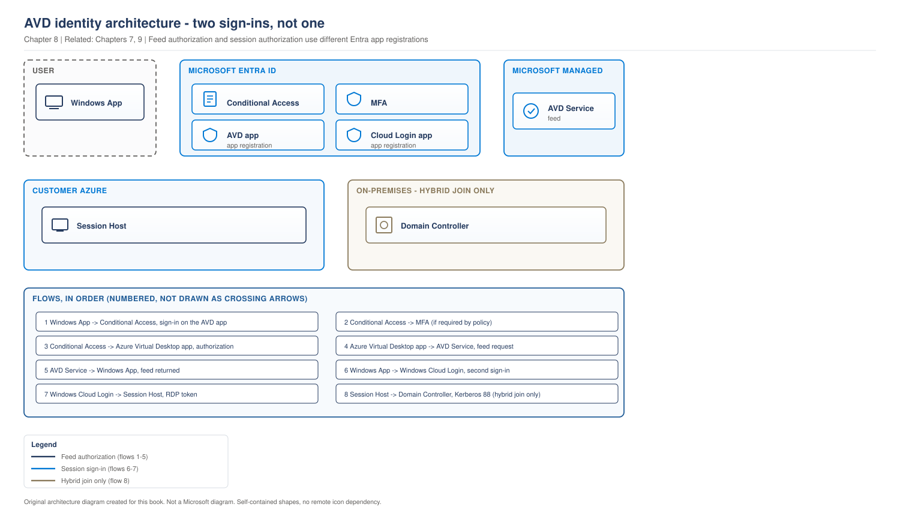
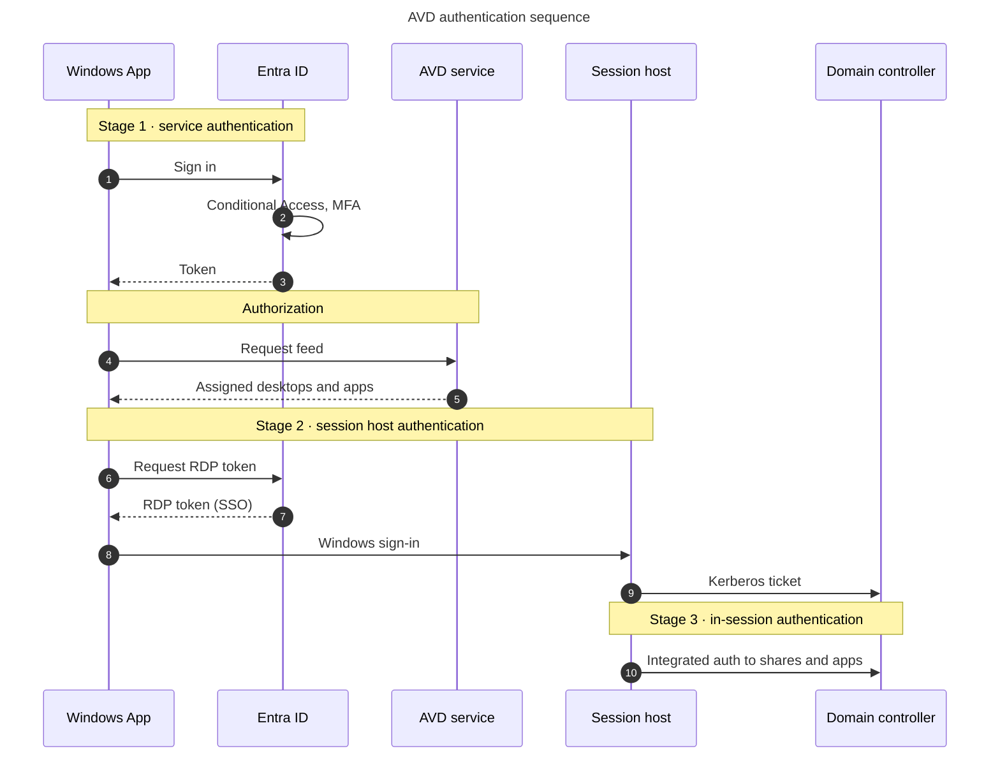

# Chapter 8 - Authentication Flows in Detail

> **Book:** Azure Virtual Desktop - Architect to Hands-on Implementation
> **Part II:** Identity and Authentication
> **Technical baseline:** August 2026

---

## Chapter Information

| Item | Detail |
|---|---|
| **Chapter number** | 8 |
| **Objective** | Separate the three authentications in an AVD connection, configure single sign-on correctly, and troubleshoot authentication failures with evidence rather than guesswork |
| **Prerequisites** | Chapters 1 to 7. Lab 4 complete |
| **Dependencies** | Builds on the connection flow in [Chapter 4](ch04-connection-flow-end-to-end.md) and the join models in [Chapter 7](ch07-identity-architecture-foundations.md) |
| **Estimated lab time** | No dedicated configuration lab; use the read-only checks after Lab 8 |
| **Azure resources required** | None for the chapter |
| **Cost** | $0.00 |

---

## What You Will Learn

- The three separate authentications in one AVD connection, and why mixing them up causes most MFA problems
- How to enable single sign-on with Entra authentication, step by step
- When you need a Kerberos server object and what happens if you skip it
- When you need a KDC proxy
- Three full production troubleshooting scenarios, with the exact commands and queries

---

## Why This Matters

A user connects to AVD. They get an MFA prompt. Then they get a Windows password prompt. Then an application inside the session asks for credentials again.

That is three authentications, not one bad experience. Engineers who treat it as one thing spend days changing Conditional Access policies that were never involved.

Getting this right is also what makes single sign-on work, and single sign-on is usually the difference between users who like AVD and users who complain about it.

---

## 1. Three Authentications, Not One

Microsoft's own documentation splits the problem the same way. The KDC proxy guidance puts it plainly: there are two components of the Azure Virtual Desktop service that need to be authenticated. The feed in the client that gives users a list of available desktops or applications, which happens in Microsoft Entra ID. And the RDP session that results from selecting one of those resources, which uses Kerberos authentication and requires a KDC proxy for remote users.

Add the third, which is anything the user hits inside the session, and you have the full picture.

> **OUR ORIGINAL ARCHITECTURE DIAGRAM.** Created for this book. Not a Microsoft diagram.
> Editable source: [`ch08-identity-architecture.drawio`](../diagrams/architecture/ch08-identity-architecture.drawio)



The same three authentications, as a sequence, because the order is what people get wrong.



### What this diagram shows

Three authentications, drawn as three distinct paths, with the identity layer separated from the service and the session host. The important thing to read is which layer each control acts on.

Authentication and authorization are separated deliberately. Stage 1 proves who the user is. The step into the feed is authorization, deciding which application groups that identity is assigned to. Conflating the two is why people troubleshoot Conditional Access when the real problem is an assignment.

### Step by step flow

1. **Stage 1, service authentication.** The user signs in to Microsoft Entra ID. Conditional Access is evaluated here, including MFA, device state and location. The token is issued against the Azure Virtual Desktop application.
2. **Authorization.** The service checks which application groups the identity is assigned to and returns the feed. See [Chapter 3](ch03-avd-object-model.md).
3. **Stage 2, session host authentication.** The user signs in to Windows on the session host. With single sign-on enabled, an RDP access token is issued through the Windows Cloud Login application and no second prompt appears. Without it, the user is prompted again.
4. **Kerberos.** Windows sign in uses Kerberos or NTLM. Kerberos needs a ticket from a domain controller over TCP 88, which requires line of sight or a KDC proxy.
5. **Stage 3, in-session authentication.** Applications and SMB shares inside the session authenticate separately, typically with integrated Windows authentication.

### Architect's interpretation

The dotted line from Conditional Access to Windows sign in is the point most people get wrong. Conditional Access is evaluated at stage 1. It does not enforce anything at stage 2 or 3. When somebody says MFA is not being enforced on the session host, they have misread the model.

The Kerberos path is the other design driver. It decides whether smart card users can work remotely, which is a network and infrastructure question rather than an identity one.

### Important design decisions

- **Single sign-on or not.** Enabling it removes the stage 2 prompt and requires four separate configuration steps, covered in section 2.
- **Kerberos reachability.** Line of sight, VPN, or a KDC proxy. Each has an infrastructure cost. See section 3.
- **Same identity throughout.** Using different identities for the service and the session host can bypass Conditional Access enforcement.
- **Which Entra app the policy targets.** See [Chapter 9](ch09-conditional-access-mfa-zero-trust.md), where the two applications behave differently.

### Failure points

| Stage | Symptom | First check |
|---|---|---|
| 1, service authentication | Cannot sign in, or empty feed | Entra sign-in logs, licence, Conditional Access |
| Authorization | Feed loads but no icons | Application group assignment |
| 2, session host authentication | Connects, then prompts for a password | SSO configuration and the host pool RDP property |
| 2, Kerberos path | Smart card users fail off network | Line of sight to a KDC, or a KDC proxy |
| 3, in-session | Session works, shares ask for credentials | Kerberos server object on Entra joined hosts |

**Official Microsoft reference:** https://learn.microsoft.com/en-us/azure/virtual-desktop/authentication

---

## 2. Single Sign-On With Entra Authentication

This is the configuration that removes the second prompt. It is also the one people half-configure and then spend a week debugging.

`CURRENCY FLAG - verified August 2026. The SSO prerequisites have changed more than once. Check the Microsoft page before configuring a production tenant.`

### What you are actually enabling

Microsoft's guidance describes the first step: you must first allow Microsoft Entra authentication for Windows in your Microsoft Entra tenant, which enables issuing RDP access tokens allowing users to sign in to your Azure Virtual Desktop session hosts. You set the isRemoteDesktopProtocolEnabled property to true on the service principal's remoteDesktopSecurityConfiguration object for the Windows Cloud Login application, app ID 270efc09-cd0d-444b-a71f-39af4910ec45.

In plain terms. You are telling Entra ID that it is allowed to issue tokens that Windows will accept as a sign-in on a session host.

### The full checklist

Microsoft's own task list is: enable Microsoft Entra authentication for RDP, hide the consent prompt dialog, create a Kerberos server object if Active Directory Domain Services is part of your environment, review your Conditional Access policies, and configure your host pool to enable single sign-on.

### Step 1, enable Entra authentication for RDP

Portal path: *Azure portal > Microsoft Entra ID > Devices > Remote connection configuration > Windows Cloud Login*.

Or with the Microsoft Graph PowerShell SDK:

```powershell
# Requires the Microsoft.Graph PowerShell SDK
Connect-MgGraph -Scopes "Application.Read.All","Application-RemoteDesktopConfig.ReadWrite.All"

# Windows Cloud Login application
$appId = "270efc09-cd0d-444b-a71f-39af4910ec45"
$sp = Get-MgServicePrincipal -Filter "AppId eq '$appId'"

# Check current state before changing anything
Get-MgServicePrincipalRemoteDesktopSecurityConfiguration -ServicePrincipalId $sp.Id

# Enable RDP access token issuing
Update-MgServicePrincipalRemoteDesktopSecurityConfiguration `
  -ServicePrincipalId $sp.Id `
  -IsRemoteDesktopProtocolEnabled
```

**What this does:** allows Entra ID to issue RDP access tokens for session host sign-in.
**Expected result:** the configuration object shows `IsRemoteDesktopProtocolEnabled : True`.
**Common errors:** insufficient Graph permissions, or an older Graph module without the remote desktop configuration cmdlets. Update the module before assuming the tenant is the problem.

`[VERIFY BEFORE IMPLEMENTATION]` Graph SDK cmdlet names and required scopes have changed across module versions. Confirm the current cmdlet and scope on the Microsoft page before running this in a production tenant.

### Step 2, create a Kerberos server object if you have AD DS

This is the step people skip, and the symptoms are misleading.

The object is needed when session hosts need to reach on-premises resources that use Kerberos, such as SMB shares or intranet sites using Windows integrated authentication.

**If you skip it on hybrid joined hosts,** you can get an error saying the session does not exist, or single sign-on is silently skipped and the user gets a standard authentication dialog instead. The connection appears to work. The user just gets prompted, and nobody can explain why.

### Step 3, enable SSO on the host pool

Portal path: *Azure portal > Azure Virtual Desktop > Host pools > `hp-avd-lab-eus2-01` > RDP Properties > Connection information > Microsoft Entra single sign-on*.

Or set the custom RDP property directly:

```powershell
Update-AzWvdHostPool `
  -ResourceGroupName rg-avd-service-lab-eus2-01 `
  -Name hp-avd-lab-eus2-01 `
  -CustomRdpProperty "enablerdsaadauth:i:1"
```

**Warning.** `CustomRdpProperty` replaces the whole string. Read the current value first and append to it, or you will silently remove other RDP settings such as multi monitor or drive redirection.

```powershell
# Always read before you write
(Get-AzWvdHostPool -ResourceGroupName rg-avd-service-lab-eus2-01 -Name hp-avd-lab-eus2-01).CustomRdpProperty
```

This is a good example of something in the "do not change blindly" category from the [operations standard](../OPERATIONS-AND-TROUBLESHOOTING-STANDARD.md). Overwriting RDP properties on a production host pool affects every user at their next connection.

### Step 4, review Conditional Access

Enabling SSO introduces a new Entra application into the sign-in path. Existing policies scoped to AVD may now behave differently. Review before you enable, not after users start calling. [Chapter 9](ch09-conditional-access-mfa-zero-trust.md) covers this properly.

---

## 3. KDC Proxy, and When You Need It

Smart card users working remotely are the classic case. Microsoft explains the problem directly: for the RDP portion of an AVD session, smart cards require a direct connection, or line of sight, with an Active Directory domain controller for Kerberos authentication. Without this direct connection, users can't automatically sign in to the organization's network from remote connections. Users can use the KDC proxy service to proxy this authentication traffic and sign in remotely.

You configure it on the host pool.

Portal path: *Azure portal > Azure Virtual Desktop > Host pools > your host pool > RDP Properties > Advanced*, then enter the KDC proxy value with no spaces.

**Architect's note.** The KDC proxy role typically runs on a Windows Server Gateway role server. That is another component to build, patch and make highly available. Before committing to it, ask whether Windows Hello for Business or FIDO keys would meet the same security requirement without the extra infrastructure. Microsoft supports in-session passwordless authentication with Windows Hello for Business or security devices such as FIDO keys when using Windows App.

---

## 4. Production Troubleshooting

Three scenarios, in the standard format. Each one is real, in the sense that these are the shapes these failures actually take.

---

### Scenario 1: Users get prompted for a password after SSO was enabled

**Problem.** Single sign-on was enabled last week. Around a third of users still get a Windows password prompt after connecting.

**Symptoms.**
- Users connect successfully, then see a credential dialog.
- Some users never see it. The difference does not obviously correlate with department or location.
- Helpdesk has been resetting passwords, which has not helped.
- Someone has already suggested it is a Conditional Access problem. It is not.

**Business impact.** A third of users prompted for credentials at every sign in, and a service desk resetting passwords that were never wrong.

**Initial hypothesis.** SSO configuration is incomplete rather than absent, because it works for some users. On a hybrid joined estate the usual cause is a missing Kerberos server object, or a host pool where the RDP property was not applied.

**Investigation.**

Start with the fastest check that splits the population. Is it host pool specific?

```powershell
# Compare RDP properties across host pools
Get-AzWvdHostPool -ResourceGroupName rg-avd-service-lab-eus2-01 |
  Select-Object Name, CustomRdpProperty
```

Then check whether the tenant level setting is actually on:

```powershell
Connect-MgGraph -Scopes "Application.Read.All"
$sp = Get-MgServicePrincipal -Filter "AppId eq '270efc09-cd0d-444b-a71f-39af4910ec45'"
Get-MgServicePrincipalRemoteDesktopSecurityConfiguration -ServicePrincipalId $sp.Id
```

Then look at the session host side. On an affected host:

*Event Viewer > Applications and Services Logs > Microsoft > Windows > RemoteDesktopServices-RdpCoreCDV > Operational*

and

*Event Viewer > Windows Logs > Security*, filtered for event ID 4624, checking the authentication package used for the affected sign-ins.

Then check the connection data:

```kusto
WVDConnections
| where TimeGenerated > ago(24h)
| where State == "Connected"
| summarize Connections = count() by UserName, SessionHostName
| order by Connections desc
```

`[VERIFY BEFORE IMPLEMENTATION]` Confirm the diagnostic table names in your workspace. AVD table naming has changed over time and your workspace may use different tables depending on when diagnostics were configured.

**Evidence.**
- If `CustomRdpProperty` on the affected host pool does not contain `enablerdsaadauth:i:1`, that is the answer. The tenant setting is fine, the host pool was missed.
- If the property is present on all pools and the tenant setting is enabled, and the affected users are all on hybrid joined hosts, the Kerberos server object is the likely cause.
- If Security event 4624 shows NTLM where you expected Kerberos, that supports the same conclusion.

**Root cause.** In this case, two host pools were configured and a third was created later by a different engineer from a template that predated the SSO work. Users were split across all three by persona, which is why the failure looked random.

**Fix.**

```powershell
# Read the current value first. This property overwrites, it does not merge.
$hp = Get-AzWvdHostPool -ResourceGroupName rg-avd-service-lab-eus2-01 -Name hp-know-prd-eus2-01
$existing = $hp.CustomRdpProperty
$new = $existing + "enablerdsaadauth:i:1;"

Update-AzWvdHostPool `
  -ResourceGroupName rg-avd-service-lab-eus2-01 `
  -Name hp-know-prd-eus2-01 `
  -CustomRdpProperty $new
```

Users pick this up at their next connection. Existing sessions are unaffected.

**Validation.** A test user in the affected group disconnects fully, reconnects, and reaches the desktop with no credential prompt. Then confirm on a second user in the same host pool, on a different client platform. One successful test proves very little.

**Prevention.** Put the RDP property in Terraform so a host pool cannot be created without it. Add a scheduled check that compares `CustomRdpProperty` across all host pools and alerts on drift. This is exactly the class of problem infrastructure as code exists to prevent, and it is covered in [Project 03](../scenarios/project-03-global-enterprise-governance.md), where Terraform and CI/CD governance at scale is worked through in full.

**Architect lesson.** Configuration drift between host pools is the root cause here, and infrastructure as code exists precisely to prevent it.

**Interview lesson.** Explaining that the RDP property overwrites rather than merges shows you have made, or narrowly avoided, that mistake.

---

### Scenario 2: Remote smart card users cannot sign in, office users are fine

**Problem.** A regulated financial services team uses smart cards. In the office everything works. Working from home, users connect and then fail at Windows sign-in.

**Symptoms.**
- Failure only occurs off the corporate network.
- The AVD feed loads normally, so service authentication is fine.
- The failure is at stage 2, session host authentication.
- VPN users are unaffected.

**Business impact.** A regulated team unable to work remotely at all, which is a business continuity issue rather than an inconvenience.

**Initial hypothesis.** Stage 2 needs Kerberos, Kerberos needs line of sight to a KDC, and remote users do not have it. This matches Microsoft's documented behaviour exactly, so it is the first thing to test rather than the last.

**Investigation.**

Confirm the stage. If the feed loads and resources are listed, stage 1 passed. Check Entra sign-in logs to be certain:

*Azure portal > Microsoft Entra ID > Monitoring > Sign-in logs*, filter by user, and confirm a successful interactive sign-in to the AVD application.

Then confirm the authentication method in use. Smart card and Windows Hello for Business can only use Kerberos.

Then test connectivity from a client on the affected network to the domain controller. From an affected user's machine:

```powershell
Test-NetConnection -ComputerName avdlab-dc01.avdlab.local -Port 88
nltest /dsgetdc:avdlab.local
```

**Evidence.** From the office or over VPN, port 88 is reachable and `nltest` returns a domain controller. From a home network, both fail. That is a complete match for the hypothesis.

**Root cause.** Remote clients have no line of sight to a domain controller, so no Kerberos ticket can be obtained for the session host sign-in. Password based users are unaffected because NTLM is available to them. Smart card users have no fallback.

**Fix.** Two supported options.

1. Deploy a KDC proxy and configure it on the host pool: *RDP Properties > Advanced*. This proxies the Kerberos traffic so remote clients can obtain tickets.
2. Require VPN for this user group, which gives line of sight.

Which one you choose is an architecture decision, not a support decision. The KDC proxy is another server to build, patch and make highly available. VPN may already exist. Present both with the cost and the operational load attached.

**Validation.** An affected user, on a home network, with no VPN, signs in with their smart card and reaches the desktop. Test with two users on different ISPs. Then confirm the office and VPN paths still work, because you have changed a shared host pool setting.

**Prevention.** Add smart card and remote access to the design assumptions register. This failure is entirely predictable from the documentation, which means it should have been caught at design time. Record it as a design assumption to be validated during pilot, and include an off network test in every future pilot plan.

**Architect lesson.** This failure is predictable from the documentation, which makes it a design review failure rather than an incident.

**Interview lesson.** Presenting a KDC proxy and a VPN as an architecture choice with cost attached, rather than a fix, is the senior framing.

---

### Scenario 3: Session starts, then the profile share asks for credentials

**Problem.** On a new Entra joined host pool, users reach the desktop but get a credential prompt when an application tries to reach an on-premises file share. FSLogix profiles are mounting correctly.

**Symptoms.**
- Stage 1 and stage 2 both succeed. This is stage 3.
- FSLogix works, which confuses people into thinking storage authentication is fine everywhere.
- Only on-premises resources are affected. Azure Files is fine.
- It started when the new Entra joined pool went live. The old hybrid joined pool is unaffected.

**Business impact.** Users can reach the desktop but not the applications that hold the data they need, which is worse than a clean failure because it looks like a permissions problem.

**Initial hypothesis.** Entra joined session hosts with no Kerberos server object cannot get tickets for on-premises Kerberos resources. FSLogix on Azure Files works because that path uses Entra Kerberos, which is a different mechanism. See [Chapter 7 section 3](ch07-identity-architecture-foundations.md#3-entra-kerberos-changed-the-design).

**Investigation.**

Confirm what the session actually has. On an affected session host, in the user's session:

```powershell
# What Kerberos tickets does the session hold?
klist

# Can the session reach a domain controller at all?
nltest /dsgetdc:avdlab.local
Test-NetConnection -ComputerName avdlab-dc01.avdlab.local -Port 88
```

Then confirm the profile path is working through a different mechanism:

*Event Viewer > Applications and Services Logs > Microsoft > FSLogix > Apps > Operational*, and the FSLogix logs under `C:\ProgramData\FSLogix\Logs`.

Then check whether the Kerberos server object exists in the tenant.

**Evidence.** `klist` shows a cloud TGT but no ticket for the on-premises realm. `Test-NetConnection` to port 88 may succeed if there is a network path, which rules out a pure networking fault and points at the ticket issuance path instead.

**Root cause.** No Kerberos server object, so the Entra joined hosts cannot obtain tickets for on-premises Kerberos resources. FSLogix on Azure Files was unaffected because Entra Kerberos handles that path independently.

**Fix.** Create the Kerberos server object, then have users disconnect fully and reconnect. A reconnect to an existing session will not pick up new ticket behaviour.

**Validation.** In a new session, `klist` shows a ticket for the on-premises realm, and the file share opens without a prompt. Confirm with a second user, and confirm the hybrid joined pool is still unaffected.

**Prevention.** Add the Kerberos server object to the Entra join build standard, so it is a prerequisite rather than a discovery. Add an in-session test of an on-premises resource to the pilot checklist for every new host pool. Most importantly, correct the assumption that caused it: FSLogix working does not prove Kerberos works.

**Architect lesson.** FSLogix working does not prove Kerberos works. Entra Kerberos for Azure Files is a separate path.

**Interview lesson.** Correcting that assumption unprompted demonstrates that you understand the identity paths rather than the symptoms.

---

## 5. The Architect's Four Questions

**What do I check first?** Which of the three stages failed. Feed loads or not, connects or not, prompted inside the session or not. That one question eliminates most causes in under a minute.

**What can I safely change now?** Adding a Kerberos server object. Testing with a single user. Reading configuration with `Get-` commands. Restarting a single session host that is already in drain mode.

**What must not be changed blindly?**
- `CustomRdpProperty` on a production host pool. It overwrites rather than merges, and it affects every user at their next connection.
- Conditional Access policies. Change one at a time, in report only mode first, with a break glass account excluded.
- VNet DNS. See [Lab 4 Step 5](../labs/lab-04-identity-integration.md).
- Disabling SSO to "test something". Every user is affected immediately.

**When do I escalate to Microsoft?** When you have evidence the failure sits inside a Microsoft managed component, or behaviour contradicts the documentation. Before opening the case, collect: the correlation ID from the client error, the Entra sign-in log entry, the relevant `WVDConnections` and `WVDErrors` rows with timestamps in UTC, the session host name and agent version, and the exact configuration state of the host pool and tenant setting. Support will ask for all of it, and some of it ages out.

---

## 6. Common Mistakes

- Treating three authentications as one and rewriting Conditional Access to fix a stage 2 problem.
- Overwriting `CustomRdpProperty` instead of appending to it.
- Enabling SSO without creating the Kerberos server object in an AD DS environment.
- Assuming FSLogix working means Kerberos works. Entra Kerberos for Azure Files is a separate path.
- Testing SSO with one user on one client and calling it done.
- Choosing a KDC proxy without asking whether passwordless would meet the same requirement with less infrastructure.
- Reconnecting to an existing session and concluding a fix did not work. Disconnect fully first.

---

## 7. Interview Preparation

### Q20. Walk me through authentication in an AVD connection.

**Simple answer**
Three separate authentications. To the service in Entra ID for the feed, to Windows on the session host, and then anything inside the session. Conditional Access and MFA apply to the first one.

**Strong senior architect answer**
"Three stages, and keeping them separate is what makes troubleshooting fast. Stage one is Entra ID for the feed, and that is where Conditional Access and MFA are evaluated. Stage two is the sign-in to Windows on the session host, which uses Kerberos or NTLM, and that is where single sign-on removes the second prompt. Stage three is anything inside the session, file shares and applications using integrated authentication. Each one fails differently. Empty feed is stage one. Connects then prompts is stage two. Session works but a share asks for credentials is stage three. The practical point is that Kerberos needs line of sight to a KDC, so smart card users working remotely need either a KDC proxy or a VPN, and that is a design decision to make up front rather than discover in pilot."

**Follow-up you should expect**
"How do you enable single sign-on?" Enable Entra authentication for RDP on the Windows Cloud Login service principal, create a Kerberos server object if AD DS is in the environment, set `enablerdsaadauth:i:1` on the host pool, and review Conditional Access because SSO puts a new application in the sign-in path.

### Q21. Users are getting an extra password prompt. How do you find out why?

**30 second answer**
"First I would establish which stage is failing, because a prompt after connecting is stage two and has nothing to do with Conditional Access. Then I would compare host pools, because the most common cause is one pool missing the SSO RDP property. Then I would check whether the Kerberos server object exists if the estate is hybrid joined."

**2 minute answer**
Add the method. Check whether it affects everyone or a subset, and whether the subset maps to a host pool. Read `CustomRdpProperty` across all host pools with a single command. Check the tenant setting on the Windows Cloud Login service principal. Then look at Security event 4624 on an affected host to see which authentication package was used. Finish with the fix warning: the RDP property overwrites, so read it before you write it, or you will remove other settings and cause a second incident while fixing the first.

### Q22. How would you prevent this class of problem?

**Strong answer**
"Configuration drift between host pools is the root of most of it, so I would define host pools in Terraform with the RDP properties as code, and add a drift check that compares them and alerts. Then I would make the Kerberos server object part of the build standard for Entra join rather than a step someone remembers. And I would change the pilot checklist so it tests all three stages, including an on premises resource from inside the session and a connection from off the corporate network. Most of these failures are predictable from the documentation, which means they are design and process problems rather than technical ones."

---

## 8. Key Takeaways

- Three authentications: service, session host, in-session. Each fails with a different signature.
- Conditional Access and MFA apply at the service stage.
- Single sign-on needs four things: Entra authentication for RDP enabled on Windows Cloud Login, a Kerberos server object where AD DS exists, `enablerdsaadauth:i:1` on the host pool, and a Conditional Access review.
- `CustomRdpProperty` overwrites. Always read before you write.
- Smart card and Windows Hello for Business require Kerberos, which requires line of sight to a KDC or a KDC proxy.
- FSLogix working on Azure Files does not prove Kerberos works for on-premises resources.

---

## 9. Official References

- Azure Virtual Desktop identities and authentication - https://learn.microsoft.com/en-us/azure/virtual-desktop/authentication
- Configure single sign-on using Microsoft Entra ID - https://learn.microsoft.com/en-us/azure/virtual-desktop/configure-single-sign-on
- Set up Kerberos Key Distribution Center proxy - https://learn.microsoft.com/en-us/azure/virtual-desktop/key-distribution-center-proxy
- Troubleshoot connections to Microsoft Entra joined VMs - https://learn.microsoft.com/en-us/azure/virtual-desktop/troubleshoot-azure-ad-connections

---

## Architect's Reality Check

**What engineers commonly get wrong.** They treat three authentications as one. A prompt after connecting is stage two and has nothing to do with Conditional Access, but that is where people spend the first day.

**What I would check first in production.** Which stage failed. Empty feed, prompted after connecting, or prompted inside the session. Each has a different cause and a different fix.

**What I would ask the customer.** Whether smart cards or Windows Hello for Business are in use, and whether anyone works off the corporate network. That combination decides whether you need a KDC proxy, and it is much cheaper to know at design time.

**What I would decide as the architect.** Single sign on enabled properly, all four steps, with the Kerberos server object treated as a build standard rather than a task someone remembers. And RDP properties in code, because that setting overwrites rather than merges.

**What I would say in an interview.** The three stage model, then the failure signature of each. That framing is what makes the rest of the answer sound like experience.

---

## How This Changes With Scale

**Around 100 users.** Single sign on is a nice improvement. Without it people are mildly annoyed.

**Around 1,000 users.** An extra prompt per sign in is measurable lost time and a steady stream of tickets. Configuration drift between host pools starts producing failures that look random because they follow pool membership rather than user or location.

**Around 5,000 users and beyond.** Authentication configuration has to be enforced in code, because manual consistency across many host pools is not achievable. A KDC proxy becomes a service with its own availability requirement rather than a server someone built.

---

## Chapter Close

**What was completed**
You can separate the three authentications, configure single sign-on correctly, and work three real authentication failures end to end with commands and evidence.

**What you should test**
No new lab resources are created. Run the read-only commands from section 4 after Lab 8 so the authentication flow and checks are familiar.

**What comes next**
Chapter 9 covers Conditional Access and MFA for AVD, including the sign-in frequency behaviour that produces the "it prompts me every hour" complaint.

**Interview preparation carried forward**
Q20 is asked constantly. The three stage framing is what makes the answer sound like experience rather than reading.

---

## Chapter Self-Review

| Check | Result |
|---|---|
| Technical accuracy | SSO prerequisites, Windows Cloud Login app ID, Kerberos and KDC proxy behaviour taken from current Microsoft Learn pages |
| Current capability verified | Yes, August 2026. Currency flag on the SSO prerequisites |
| Supported versus unsupported separated | Yes. NTLM and Kerberos support stated, smart card and WHfB limitation stated |
| Commands verified | Graph and Az cmdlets given with a verify flag on Graph cmdlet naming, which has changed across module versions |
| Troubleshooting format | Three scenarios, all nine steps each |
| Portal and Event Viewer paths | Exact paths given |
| KQL | Included with a verify note on table naming |
| Architect's four questions | Section 5, stated explicitly |
| Mermaid diagram | Renders. Matches the three stage model |
| Architecture consistency | Cross references to Chapters 4, 7, 9, 43 and Labs 4 and 12 checked |
| Cost statements | $0.00 for the chapter, stated |
| Security implications | Conditional Access change safety and break glass exclusion called out |
| Interview answers | Read aloud. Natural |
| Real-world examples | Three production scenarios covering hybrid drift, regulated smart card users and Entra join |
| Duplicate content | Entra Kerberos referenced to Chapter 7, not repeated |
| Missing concepts | Added the warning that CustomRdpProperty overwrites, which is a common cause of secondary incidents |
| Simple English | Reviewed |
| AI sounding language | Removed |
| Long dash characters | None |
