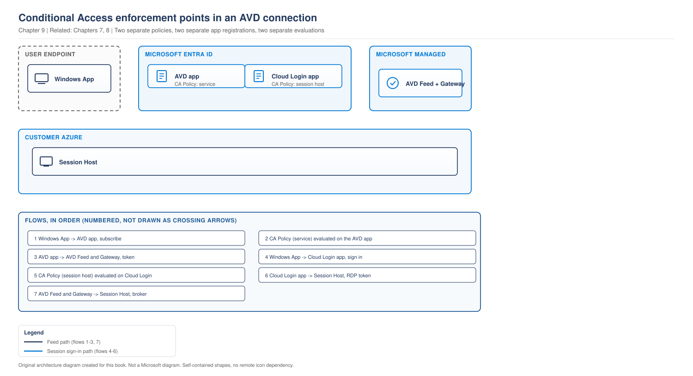

# Chapter 9 - Conditional Access, MFA and Zero Trust Access

> **Book:** Azure Virtual Desktop - Architect to Hands-on Implementation
> **Part II:** Identity and Authentication
> **Technical baseline:** August 2026

---

## Chapter Information

| Item | Detail |
|---|---|
| **Chapter number** | 9 |
| **Objective** | Design Conditional Access for AVD that enforces real security without generating constant prompts, and fix it when it goes wrong |
| **Prerequisites** | Chapters 1 to 8. Lab 4 complete |
| **Dependencies** | Builds directly on the three authentications in [Chapter 8](ch08-authentication-flows-in-detail.md) |
| **Estimated lab time** | No dedicated Conditional Access lab in the current sequence |
| **Azure resources required** | None for the chapter. Conditional Access requires Microsoft Entra ID P1 or P2 licensing |
| **Cost** | $0.00 for the chapter |

---

## What You Will Learn

- Which Entra applications to target, and what each one controls
- Why sign-in frequency behaves differently depending on the app you apply it to
- The one setting that causes the "it prompts me constantly" complaint
- Why legacy per-user MFA and Conditional Access must not coexist for AVD users
- Three production scenarios with the exact investigation steps

---

## Why This Matters

Conditional Access for AVD looks like a five minute job. Create a policy, target the AVD app, require MFA, done.

Then users start complaining. Prompted twice during one connection. Prompted again an hour later. Diagnostics stop arriving in the workspace and nobody knows why. Someone widens the policy to make the noise stop, and the security control you were asked to implement is now half off.

Nearly all of this comes from one thing. There is more than one Entra application involved in an AVD connection, and they do not behave the same way.

---

## 1. The Applications You Are Actually Targeting

This is the part that decides whether your policy works.

Microsoft documents the split clearly. The service side: to access Azure Virtual Desktop resources you must first authenticate to the service with a Microsoft Entra ID account. Authentication happens whenever you subscribe to retrieve your resources, connect to the gateway when launching a connection, or when sending diagnostic information to the service. The Microsoft Entra ID resource used for this authentication is Azure Virtual Desktop, app ID 9cdead84-a844-4324-93f2-b2e6bb768d07.

The session host side: Microsoft Remote Desktop, app ID a4a365df-50f1-4397-bc59-1a1564b8bb9c, and Windows Cloud Login, app ID 270efc09-cd0d-444b-a71f-39af4910ec45, apply when the user authenticates to the session host when single sign-on is enabled.

Map that onto the three stages from [Chapter 8](ch08-authentication-flows-in-detail.md#1-three-authentications-not-one) and it becomes obvious:

| Stage | Entra application | App ID |
|---|---|---|
| 1. Service authentication, feed and gateway | Azure Virtual Desktop | `9cdead84-a844-4324-93f2-b2e6bb768d07` |
| 2. Session host authentication with SSO | Windows Cloud Login | `270efc09-cd0d-444b-a71f-39af4910ec45` |
| 2. Session host authentication with SSO | Microsoft Remote Desktop | `a4a365df-50f1-4397-bc59-1a1564b8bb9c` |

**A naming trap.** The Azure Virtual Desktop app was previously called Windows Virtual Desktop. If you registered the Microsoft.DesktopVirtualization resource provider before the display name changed, the application will still be named Windows Virtual Desktop, with the same app ID. In an older tenant, search by app ID rather than by name.

### The app to stage mapping, visually

> **OUR ORIGINAL ARCHITECTURE DIAGRAM.** Based on Microsoft's documented Conditional Access behaviour for AVD.

> **OUR ORIGINAL ARCHITECTURE DIAGRAM.** Created for this book. Not a Microsoft diagram.
> Editable source: [`ch09-conditional-access-app-targeting.drawio`](../diagrams/architecture/ch09-conditional-access-app-targeting.drawio)



**What the diagram shows.** One user action touches two different Entra applications. A policy that targets only one of them leaves the other stage either unprotected or separately prompted. The dotted line is the failure mode nobody notices, because nothing errors.

**Official reference:** https://learn.microsoft.com/en-us/azure/virtual-desktop/set-up-mfa

### Microsoft's design recommendation

Match Conditional Access policies between these apps and the Azure Virtual Desktop app, except for the sign-in frequency.

That single sentence is the design rule for this whole chapter. Same conditions, same grant controls, different sign-in frequency. Section 2 explains why the exception exists.

**What happens if you only target one app.** Microsoft's troubleshooting guidance is direct: if only the Azure Virtual Desktop app has a Conditional Access policy, the user is prompted for multifactor authentication at the Azure Virtual Desktop service layer and again at the session host. That is the double prompt users report, and it is a configuration gap rather than a product fault.

`CURRENCY FLAG - verified August 2026. Microsoft has been consolidating session host authentication onto Windows Cloud Login. Check the current app list on the Microsoft page before building policies, because which apps you need to target has changed over time.`

---

## 2. Sign-in Frequency, and the Setting That Causes Constant Prompts

Sign-in frequency is where most AVD Conditional Access designs go wrong.

First, the general behaviour: users are prompted to authenticate only when a new access token is requested from Microsoft Entra ID when accessing a resource. So the policy does not run a timer that interrupts a working session. It applies when a token is next needed.

Now the important part. The same setting does different things depending on the app.

| App | What sign-in frequency enforces |
|---|---|
| Azure Virtual Desktop | Reauthentication when a user subscribes, manually refreshes their resource list, and authenticates to the gateway during a connection. Once the reauthentication period is over, background feed refresh and diagnostics upload silently fail until the user completes their next interactive sign in. |
| Microsoft Remote Desktop and Windows Cloud Login | Reauthentication when a user signs in to a session host when single sign-on is enabled. |

Read the AVD app row again. **Background feed refresh and diagnostics upload silently fail.** Not an error the user sees. Not an alert. Your monitoring data quietly stops arriving for users whose reauthentication window has expired, and you will spend a long time looking at the Log Analytics workspace before you think to look at a Conditional Access policy.

### The one setting not to use on the wrong app

Microsoft is explicit: the Every time sign-in frequency option is supported only on the Windows Cloud Login app. Don't apply it to the Azure Virtual Desktop app. Doing so causes constant prompts on feed refresh and diagnostics upload.

This is the single highest value fact in the chapter. If a customer tells you users are prompted constantly, check this first.

### Mismatched frequencies cause reprompts

The Azure Virtual Desktop app and Windows Cloud Login app each have their own Conditional Access policies and sign-in frequency. If the frequencies differ, one app's session expires before the other and triggers a reauthentication prompt during the Windows App user experience.

So the two apps need frequencies that make sense together. Not necessarily identical, but chosen deliberately, with the interaction understood.

**Portal path to check or set it:** *Microsoft Entra admin center > Protection > Conditional Access > Policies > your policy > Access controls > Session > Sign-in frequency*.

---

## 3. Legacy Per-User MFA Must Be Off

This one produces a confusing error and an easy fix.

Microsoft's prerequisite is plain: per-user multifactor authentication is disabled for Azure Virtual Desktop users. Use Conditional Access policies exclusively.

And the symptom when it is not: when legacy per-user multifactor authentication is enabled on an Entra joined session host alongside Conditional Access, users see "The sign-in method you're trying to use isn't allowed" or repeated prompts.

**Portal path to fix:** *Microsoft Entra admin center > Identity > Users > All users > Per-user MFA*, then set the multifactor authentication state to Disabled for each AVD user, and enforce MFA through Conditional Access instead.

**Architect's note.** In a large tenant, per-user MFA is usually a leftover from before Conditional Access existed. It is often enabled for a subset of users nobody remembers enabling it for, which is exactly why the failure looks random. Audit it before you design, not after go live.

---

## 4. A Working Baseline Design

A starting point for a typical enterprise, to be adapted rather than copied blindly.

**Policy 1, service access.**
- Target: Azure Virtual Desktop app
- Users: AVD user groups, break glass accounts excluded
- Grant: require multifactor authentication
- Session: periodic reauthentication, set to a period the business agrees, commonly measured in hours for regulated work and longer for general use
- Never set Every time on this app

**Policy 2, session host access.**
- Target: Windows Cloud Login, and Microsoft Remote Desktop where still required
- Users: same groups, same exclusions
- Grant: same controls as Policy 1
- Session: sign-in frequency chosen to line up with Policy 1 rather than fight it

**Policy 3, device controls where applicable.**
- Target: both apps
- Condition: device platform or device state
- Grant: require compliant device for managed endpoints, or block legacy authentication

**Always excluded.** At least two break glass accounts, excluded from every policy, with long complex passwords, monitored sign-in alerting, and credentials held offline. If you lock yourself out of a tenant with a Conditional Access policy, these accounts are the only way back in.

**Always deployed in report only mode first.** Every policy. No exceptions in production.

---

## 5. Production Scenarios

### Scenario 1: Users are prompted for MFA constantly

**Problem.** A 900 user rollout goes live. Within two days the service desk has over 200 tickets saying users are asked to authenticate repeatedly, sometimes several times an hour.

**Symptoms.**
- Prompts happen during normal use, not only at connection time.
- Affects all users on the AVD app, regardless of client or location.
- Sessions themselves stay connected. It is the client asking, not the desktop.
- Someone has already proposed disabling MFA to stop the noise.

**Business impact.** 900 users interrupted repeatedly through the working day, over 200 tickets in 48 hours, and pressure on the security team to weaken a control that was correct in intent.

**Initial hypothesis.** Sign-in frequency set to Every time on the Azure Virtual Desktop app. This is documented as causing constant prompts on feed refresh and diagnostics upload, and it matches the symptom exactly.

**Investigation.**

Portal path: *Microsoft Entra admin center > Protection > Conditional Access > Policies*. Open every policy that targets the AVD app or Windows Cloud Login and record the sign-in frequency for each.

Then check the sign-in logs to see which application is generating the prompts:

*Microsoft Entra admin center > Identity > Monitoring & health > Sign-in logs*, filtered on an affected user, with the Application column visible.

**Evidence.** Sign-in log entries repeating against the Azure Virtual Desktop application at short intervals, correlated with feed refresh rather than with user actions. A policy targeting the AVD app with sign-in frequency set to Every time.

**Root cause.** Every time was applied to the Azure Virtual Desktop app. It is only supported on Windows Cloud Login. On the AVD app it forces reauthentication on background feed refresh and diagnostics upload, which happen far more often than users connect.

**Fix.** Change the AVD app policy to periodic reauthentication with an agreed period. If a strict per-connection challenge is genuinely required, apply Every time to the Windows Cloud Login policy instead, which enforces it at session host sign-in where the business actually wants it.

Change one policy at a time. Do not edit both apps in the same change window, or you will not know which change fixed it.

**Validation.** A test user connects, works for an hour, and is not reprompted. Then confirm the sign-in logs show feed refresh succeeding without an interactive prompt. Then confirm with a user in a different region and on a different client.

**Prevention.** Document the sign-in frequency for each app in the design, with the reason for each value. Add both policies to a quarterly access review. Treat any Conditional Access change affecting AVD as a change requiring the same review as a host pool change, because it affects every user at once.

**Architect's lesson.** The business asked for "MFA on every connection". That requirement is legitimate, but it has to be implemented on the app that governs connections to the session host, not the app that governs background service traffic. Translating a security requirement into the right technical control is the job.

**Interview lesson.** Explaining that a control placed on the wrong app can end up weakening security shows you think about outcomes rather than settings.

---

### Scenario 2: "The sign-in method you're trying to use isn't allowed"

**Problem.** A new Entra joined host pool goes live for a finance team of 250. About 40 users cannot sign in and see an error saying the sign-in method is not allowed. The rest are fine.

**Symptoms.**
- Fails at the session host stage, not the feed.
- Affects a subset with no obvious pattern by department, location or device.
- The Conditional Access policy is correctly configured and other users on the same policy work.
- Retrying and password resets change nothing.

**Business impact.** 40 finance users unable to sign in at go live, during a period when finance work is time critical.

**Initial hypothesis.** Legacy per-user MFA is still enabled for those specific users, alongside Conditional Access. Microsoft documents this exact error for that combination on Entra joined session hosts.

**Investigation.**

Portal path: *Microsoft Entra admin center > Identity > Users > All users*, then select **Per-user MFA** from the toolbar. Sort by multifactor authentication state and compare the Enabled or Enforced list against the affected users.

Then confirm the join type of the host pool, because the documented behaviour is specific to Entra joined session hosts.

Then check the sign-in logs for the affected users, looking at the failure reason and the application involved.

**Evidence.** The affected users appear with per-user MFA state set to Enabled or Enforced. Working users are set to Disabled. That correlation is the answer.

**Root cause.** Legacy per-user MFA was enabled years ago for a group of finance staff during an earlier project. Nobody remembered, because it is configured in a different place from Conditional Access and does not appear in policy review.

**Fix.** Set the multifactor authentication state to Disabled for the affected users in the per-user MFA screen. MFA continues to be enforced through Conditional Access. This is not a reduction in security, it is removing a duplicate and conflicting control.

Confirm with the security team before making the change, and record it. "We disabled MFA for 40 finance users" is a sentence that will be read badly out of context. Write down that Conditional Access still enforces it.

**Validation.** An affected user signs in successfully and is still challenged for MFA by Conditional Access. Both halves have to be true. If they sign in without any MFA challenge, you have removed a control rather than fixed a conflict.

**Prevention.** Audit per-user MFA state across the tenant and disable it wherever Conditional Access is in use. Add a check to the AVD onboarding process that confirms a user's per-user MFA state before they are added to an AVD group.

**Architect's lesson.** Old identity configuration outlives the people who created it. Before designing access for a new service, audit what is already enforced on the users you are about to onboard. Most "random" identity failures are historical settings nobody knew existed.

**Interview lesson.** Saying you audit existing identity settings before onboarding a service to them signals real migration experience.

---

### Scenario 3: Diagnostics stopped arriving in Log Analytics

**Problem.** AVD Insights shows a steady drop in connection data over three weeks. No configuration changed on the workspace, the diagnostic settings or the host pools.

**Symptoms.**
- Data volume declining rather than stopping outright.
- Some users still report normally. Others have gone quiet.
- The users who report normally tend to be the ones who connect at the start of every day.
- No errors anywhere. Nothing failed loudly.

**Business impact.** No user impact. Three weeks of incomplete monitoring data, which weakens capacity planning and removes the evidence trail an auditor would ask for.

**Initial hypothesis.** Sign-in frequency on the Azure Virtual Desktop app. Microsoft documents that once the reauthentication period is over, background feed refresh and diagnostics upload silently fail until the user next signs in interactively. That fits a slow decline affecting infrequent users first.

**Investigation.**

Check the sign-in frequency on every policy targeting the AVD app, as in Scenario 1.

Then compare who is still reporting against who is not:

```kusto
WVDConnections
| where TimeGenerated > ago(30d)
| summarize LastSeen = max(TimeGenerated), Connections = count() by UserName
| where LastSeen < ago(7d)
| order by LastSeen asc
```

`[VERIFY BEFORE IMPLEMENTATION]` Confirm diagnostic table names in your own workspace before relying on this query. AVD table naming has changed over time.

Then correlate those users against the Entra sign-in logs to see when they last completed an interactive sign in.

**Evidence.** Users missing from recent diagnostic data are the ones whose last interactive sign-in is older than the configured reauthentication period. Users who sign in daily are unaffected. That correlation confirms it.

**Root cause.** A short sign-in frequency on the AVD app. Diagnostics upload needs a valid token, and once the period expires the upload fails silently until the user signs in interactively again.

**Fix.** Lengthen the sign-in frequency on the AVD app policy to a period agreed with the security team, and put the strict control on the Windows Cloud Login policy instead, where it enforces at session host sign-in.

**Validation.** Diagnostic volume recovers over the following days as users complete interactive sign-ins. Re-run the KQL query after a week and confirm the previously silent users are reporting again.

**Prevention.** Add an alert on diagnostic data volume, so a decline is detected rather than noticed. Add "confirm diagnostics still arriving" to the post change checklist for any Conditional Access change affecting AVD. Silent failures need active monitoring, because by definition nobody will report them.

**Architect's lesson.** Security controls have observability side effects. A change that looks purely like an identity decision degraded the monitoring platform for three weeks. When reviewing a Conditional Access change, ask what else depends on that token.

**Interview lesson.** Very few candidates mention that an identity change can silently degrade monitoring. It lands well.

---

## 6. The Architect's Four Questions

**What do I check first?** The sign-in frequency setting on every policy targeting the AVD app. It explains constant prompts, double prompts and missing diagnostics, which is three of the most common complaints.

**What can I safely change now?** Creating a new policy in report only mode. Reading policy configuration. Checking sign-in logs. Adding a user to a pilot group.

**What must not be changed blindly?**
- Any Conditional Access policy in enforced mode. Report only first, always.
- Removing an exclusion group. You may lock yourself or your administrators out.
- Editing two policies in one change window. You will not know which one mattered.
- Disabling per-user MFA without confirming Conditional Access is actually enforcing MFA for those users.

**When do I escalate to Microsoft?** When the sign-in logs show a policy applying differently from its configuration, or when a documented app behaviour does not match what you observe. Collect first: the policy configuration export, the correlation ID from the failed sign-in, the sign-in log entry showing which policies were evaluated, the app ID involved, and the client and version. The sign-in log detail view has a Conditional Access tab showing exactly which policies were applied. Have that ready.

---

## 7. Common Mistakes

- Targeting only the Azure Virtual Desktop app, then wondering about the second prompt at the session host.
- Setting Every time on the Azure Virtual Desktop app. It is only supported on Windows Cloud Login.
- Setting different sign-in frequencies on the two apps without understanding the interaction.
- Leaving legacy per-user MFA enabled alongside Conditional Access.
- Searching for the app by name in an older tenant where it is still called Windows Virtual Desktop.
- Deploying a policy straight to enforced mode.
- Forgetting break glass account exclusions.
- Loosening a policy to stop user complaints, rather than fixing the setting causing them.

---

## 8. Interview Preparation

### Q23. How do you enforce MFA for AVD?

**Simple answer**
Conditional Access policies, not per-user MFA. Target the Azure Virtual Desktop app for service access and Windows Cloud Login for session host sign-in when SSO is enabled, and match the policies except for sign-in frequency.

**Strong senior architect answer**
"Conditional Access only. Per-user MFA has to be off, because the two together produce sign-in failures on Entra joined hosts. Then the key point is that there is more than one app involved. The Azure Virtual Desktop app covers subscribing to the feed and authenticating to the gateway. Windows Cloud Login covers signing in to the session host when SSO is enabled. Microsoft's recommendation is to match the policies across those apps except for sign-in frequency, because frequency behaves differently on each. If you only target the AVD app, users get challenged at the service and again at the session host, and that is the double prompt everyone complains about."

**Follow-up you should expect**
"Users say they are prompted constantly. What is your first check?" Sign-in frequency set to Every time on the AVD app. It is only supported on Windows Cloud Login, and on the AVD app it forces reauthentication on background feed refresh and diagnostics upload.

### Q24. Explain sign-in frequency for AVD.

**30 second answer**
"It controls when a new token has to be acquired, so users are challenged when a token is next needed rather than on a timer during a session. The important detail is that it behaves differently per app. On the AVD app it applies to subscribing, refreshing the feed and connecting to the gateway. On Windows Cloud Login it applies to signing in to the session host."

**2 minute answer**
Add the two traps. First, Every time is only supported on Windows Cloud Login. Applied to the AVD app it causes constant prompts, because feed refresh and diagnostics upload happen in the background far more often than users connect. Second, if the two apps have different frequencies, one session expires before the other and the user gets reprompted mid experience. So the frequencies need to be chosen together. Then the observability point, which most people miss. When the AVD app reauthentication period expires, background feed refresh and diagnostics upload fail silently until the user signs in interactively again. That means a Conditional Access change can quietly degrade your monitoring data without anyone raising a ticket.

**Deep dive answer**
There is a design conversation worth having here. The business requirement is usually stated as "MFA on every connection", and translating that correctly matters. Putting it on the session host app enforces it where connections actually happen. Putting it on the service app enforces it against background traffic and produces constant prompts, which leads to the policy being weakened to stop the noise. So a badly placed control ends up reducing security. Finish with the operational safeguards: report only mode first, one policy per change window, break glass exclusions, and an alert on diagnostic data volume so silent failures are detected.

### Q25. How would you design Conditional Access for AVD in a regulated environment?

**Strong answer**
"I would start from the requirement rather than the technology. Regulated usually means strong authentication at connection, device assurance where the device is managed, and evidence for audit. So: matched policies across the AVD app and Windows Cloud Login, MFA required on both, device compliance required for managed endpoints, and for unmanaged access either block it or allow browser only with session controls, depending on what the risk owner accepts. Sign-in frequency strict on the session host app, sensible on the service app so I do not break diagnostics. Break glass accounts excluded and alerted on. Everything deployed report only first, then enforced in waves by group. And for the audit requirement, the sign-in logs and the Conditional Access tab in the log detail are the evidence, so I would make sure those are exported and retained for the required period rather than relying on the default retention."

**Why this works**
It starts from requirements, it separates the two apps correctly, it protects observability, and it addresses the audit evidence question that regulated customers always ask and most candidates never mention.

---

## 9. Key Takeaways

- More than one Entra app is involved. Azure Virtual Desktop for the service, Windows Cloud Login and Microsoft Remote Desktop for session host sign-in with SSO.
- Match the policies across apps, except sign-in frequency.
- Every time is supported only on Windows Cloud Login. On the AVD app it causes constant prompts.
- Different frequencies across the apps cause mid experience reprompts.
- When the AVD app period expires, feed refresh and diagnostics upload fail silently.
- Legacy per-user MFA must be disabled. Together with Conditional Access it breaks sign-in on Entra joined hosts.
- Report only mode first, break glass exclusions always, one policy change at a time.

---

## 10. Official References

- Enforce Microsoft Entra multifactor authentication for AVD using Conditional Access - https://learn.microsoft.com/en-us/azure/virtual-desktop/set-up-mfa
- Troubleshoot single sign-on and Conditional Access for AVD - https://learn.microsoft.com/en-us/troubleshoot/azure/virtual-desktop/troubleshoot-sso-conditional-access
- Azure Virtual Desktop identities and authentication - https://learn.microsoft.com/en-us/azure/virtual-desktop/authentication
- Configure single sign-on using Microsoft Entra ID - https://learn.microsoft.com/en-us/azure/virtual-desktop/configure-single-sign-on

---

## Architect's Reality Check

**What engineers commonly get wrong.** They target one application. There are two stages and two sets of apps, and targeting only the AVD app produces the double prompt everyone complains about.

**What I would check first in production.** Sign in frequency on every policy targeting the AVD app. It explains constant prompts, double prompts and missing diagnostics, which is most of the complaints in this area.

**What I would ask the customer.** Whether legacy per user MFA is still enabled anywhere. It usually is, nobody remembers enabling it, and it breaks sign in on Entra joined hosts.

**What I would decide as the architect.** Matched policies across the apps with sign in frequency chosen deliberately for each, break glass exclusions, report only mode first, and one policy change per window.

**What I would say in an interview.** Explain that the same setting behaves differently per app, and that the AVD app controls background traffic. Then mention the silent diagnostics failure, because almost nobody does.

---

## How This Changes With Scale

**Around 100 users.** One policy is usually enough. Mistakes are visible immediately and easy to reverse.

**Around 1,000 users.** A prompt frequency mistake becomes hundreds of tickets in two days, and the pressure is to weaken the policy rather than fix the setting. Report only mode stops being optional.

**Around 5,000 users and beyond.** Conditional Access changes are estate wide changes with no partial rollout, so they need change control equal to a host pool change. Audit evidence and log retention become deliverables, because a regulator will ask for them.

---

## Chapter Close

**What was completed**
You can target the right applications, choose sign-in frequency deliberately, avoid the per-user MFA conflict, and investigate the three complaints this area generates most.

**What you should test**
Open your tenant and list every Conditional Access policy targeting the AVD app or Windows Cloud Login, with its sign-in frequency. If you cannot produce that list quickly, that is the first gap to close.

**What comes next**
Chapter 10 covers RBAC and the administrative model, including the role assignment that Entra joined session hosts require and the delegation model for a helpdesk team.

**Interview preparation carried forward**
Q24 separates candidates quickly. Most know sign-in frequency exists. Few know it behaves differently per app, and almost nobody mentions the silent diagnostics failure.
