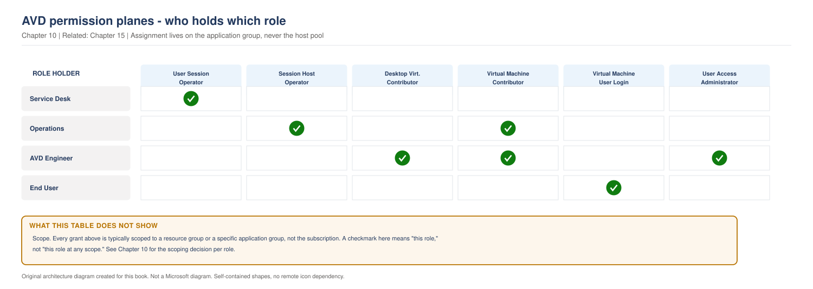

# Chapter 10 - RBAC, Delegation and the Administrative Model

> **Book:** Azure Virtual Desktop - Architect to Hands-on Implementation
> **Part II:** Identity and Authentication
> **Technical baseline:** August 2026

---

## Chapter Information

| Item | Detail |
|---|---|
| **Chapter number** | 10 |
| **Objective** | Design a least privilege administrative model for AVD that a helpdesk can actually work with, and understand why the built-in roles do not do what people expect |
| **Prerequisites** | Chapters 1 to 9. Labs 1 to 4 complete |
| **Dependencies** | Uses the object model from [Chapter 3](ch03-avd-object-model.md) and the join models from [Chapter 7](ch07-identity-architecture-foundations.md) |
| **Estimated lab time** | Role assignments are introduced in Labs 5 and 7; there is no separate RBAC lab |
| **Azure resources required** | None for the chapter |
| **Cost** | $0.00 |

---

## What You Will Learn

- The built-in AVD roles and what each one actually permits
- The two permission planes, and why one role is never enough
- Why Desktop Virtualization Contributor cannot assign users or manage VMs
- A delegation model for helpdesk, operations and engineering
- The extra role Entra joined session hosts require
- Three production scenarios with exact commands

---

## Why This Matters

Someone gets Desktop Virtualization Contributor and assumes they can run AVD. Then they cannot publish an application group to a user. Then they cannot restart a session host. So somebody grants them Contributor at subscription scope to unblock them, and your least privilege model is gone in an afternoon.

The pattern repeats in almost every environment. It comes from one misunderstanding, which this chapter fixes.

---

## 1. The Two Permission Planes

AVD splits permissions into two separate planes, deliberately.

**Plane 1, AVD objects.** Host pools, application groups, workspaces, scaling plans. Managed by the Desktop Virtualization roles.

**Plane 2, compute.** The session host virtual machines themselves. Managed by the standard Azure compute roles such as Virtual Machine Contributor.

The AVD roles do not reach into compute. Microsoft states it plainly: the Desktop Virtualization Contributor role allows managing all your Azure Virtual Desktop resources, apart from user or group assignment. If you want to assign user accounts or user groups to resources, you also need the User Access Administrator role. The Desktop Virtualization Contributor role doesn't grant users access to compute resources.

So the most powerful AVD role, on its own:

- cannot assign users to an application group
- cannot restart, resize or delete a session host VM

That is not a limitation to work around. It is a separation you should design with. The person who publishes desktops does not automatically get the ability to delete virtual machines.

> **OUR ORIGINAL ARCHITECTURE DIAGRAM.** Created for this book. Not a Microsoft diagram.
> Editable source: [`ch10-rbac-permission-planes.drawio`](../diagrams/architecture/ch10-rbac-permission-planes.drawio)



### What the diagram shows

Three separate things have to be granted before one person can build and publish a working desktop. AVD object management, compute management, and the right to assign users. Most "permissions are broken" tickets are a missing piece from one of these three.

### Architect's view

Treat the split as a feature. A helpdesk needs to log users off and put a host into drain mode. It does not need to delete virtual machines or publish new applications. The roles exist at that granularity precisely so you can draw those lines.

**Official reference:** https://learn.microsoft.com/en-us/azure/virtual-desktop/rbac

---

## 2. The Built-in Roles

`CURRENCY FLAG - verified August 2026. Microsoft adds AVD roles over time. Check the current list before designing a delegation model, and do not assume this table is complete for your tenant.`

| Role | What it allows | Common use |
|---|---|---|
| Desktop Virtualization Contributor | Manage all AVD resources, apart from user or group assignment. Does not grant access to compute resources | AVD engineering team, paired with compute and assignment rights |
| Desktop Virtualization Reader | View all AVD resources, no changes | Auditors, monitoring, read only access reviews |
| Desktop Virtualization User | Use an application on a session host from an application group as a non-administrative user | End users. Assigned automatically when you add a user or group to an application group |
| Desktop Virtualization Host Pool Contributor | Manage all aspects of a host pool | Team owning one host pool |
| Desktop Virtualization Host Pool Reader | View all aspects of a host pool, no changes | Monitoring and diagnostics |
| Desktop Virtualization Application Group Contributor | Manage all aspects of an application group, apart from user or group assignment. User Access Administrator also required to assign users | Application publishing team |
| Desktop Virtualization Application Group Reader | View all aspects of an application group, no changes | Support reference |
| Desktop Virtualization Workspace Contributor | Manage all aspects of workspaces. Also needs Application Group Reader to see applications in related application groups | Workspace owner |
| Desktop Virtualization Workspace Reader | View all aspects of a workspace, no changes | Support reference |
| Desktop Virtualization User Session Operator | Send messages, disconnect and sign out user sessions | Helpdesk. The most useful helpdesk role in AVD |
| Desktop Virtualization Session Host Operator | Manage session hosts, including removing session hosts and changing drain mode, without adding new hosts | Operations team doing maintenance |

**The role that surprises people.** Desktop Virtualization User is assigned automatically when you add a user or group to an application group. You do not usually assign it by hand. If someone has been granted it directly at a strange scope, that is worth investigating.

---

## 3. A Delegation Model That Works

Four tiers. Adapt the names, keep the shape.

### Tier 1, service desk

**Job:** answer "I cannot connect", log a stuck user off, message users before a maintenance window.

**Roles:**
- Desktop Virtualization User Session Operator, scoped to host pools
- Desktop Virtualization Reader, for visibility

**Not granted:** anything that changes configuration, anything touching virtual machines.

### Tier 2, operations

**Job:** run maintenance, drain hosts, replace a failed session host, respond to incidents.

**Roles:**
- Everything in Tier 1
- Desktop Virtualization Session Host Operator
- Virtual Machine Contributor, scoped to the session host resource group only

**Not granted:** User Access Administrator. Operations does not decide who gets access.

### Tier 3, AVD engineering

**Job:** build host pools, publish applications, change configuration.

**Roles:**
- Desktop Virtualization Contributor
- Virtual Machine Contributor on the session host resource group
- User Access Administrator scoped to application groups, ideally through Privileged Identity Management rather than standing access

### Tier 4, platform owner

**Job:** subscription level governance, policy, cost, landing zone.

**Roles:** Owner or Contributor at subscription scope, through Privileged Identity Management with approval, never standing.

### Scope matters more than the role

A role at subscription scope is a very different thing from the same role on one resource group. Assign at the narrowest scope that lets someone do the job.

The book's resource group split from [Lab 2](../labs/lab-02-terraform-foundation-and-governance.md) exists partly for this reason. Session hosts live in their own resource group, so you can grant Virtual Machine Contributor there without granting it over the network, the storage or the AVD service objects.

---

## 4. Assigning Roles

### Portal

*Azure portal > Resource groups > `rg-avd-service-lab-eus2-01` > Access control (IAM) > Add > Add role assignment*.

### Azure CLI

```bash
# Get the host pool resource ID
HP_ID=$(az desktopvirtualization hostpool show \
  --name hp-avd-lab-eus2-01 \
  --resource-group rg-avd-service-lab-eus2-01 \
  --query id -o tsv)

# Service desk: session management only, scoped to one host pool
az role assignment create \
  --assignee-object-id <servicedesk-group-object-id> \
  --assignee-principal-type Group \
  --role "Desktop Virtualization User Session Operator" \
  --scope $HP_ID
```

**What this does:** grants a group the ability to message, disconnect and sign out sessions on that host pool only.
**Expected output:** JSON describing the role assignment.
**Common errors:** using `--assignee` with a group display name, which is ambiguous. Use the object ID. Also, role assignment can take a minute or two to take effect, so do not immediately conclude it failed.

### Terraform

Role assignments belong in code, so a new host pool cannot go live without them.

```hcl
resource "azurerm_role_assignment" "servicedesk_session_operator" {
  scope                = azurerm_virtual_desktop_host_pool.avd.id
  role_definition_name = "Desktop Virtualization User Session Operator"
  principal_id         = var.servicedesk_group_object_id
}

resource "azurerm_role_assignment" "avd_users_vm_login" {
  # Required for Entra joined session hosts. Without it, users
  # authenticate successfully and are then rejected at Windows sign in.
  scope                = data.azurerm_resource_group.hosts.id
  role_definition_name = "Virtual Machine User Login"
  principal_id         = var.avd_users_group_object_id
}
```

### Checking what is assigned

```powershell
Get-AzRoleAssignment -ResourceGroupName rg-avd-service-lab-eus2-01 |
  Select-Object DisplayName, ObjectType, RoleDefinitionName, Scope |
  Sort-Object RoleDefinitionName
```

Run this before any access review. It is also the first command to run when someone reports a permissions problem.

---

## 5. The Entra Join Exception

Covered in [Chapter 5](ch05-operating-systems-multisession-licensing.md#5-entra-joined-session-hosts-change-the-prerequisites) and worth repeating in one line here because it belongs to RBAC.

On Entra joined session hosts, users need an Azure RBAC role on the session hosts in addition to their application group assignment. Virtual Machine User Login for ordinary users, Virtual Machine Administrator Login for administrators.

Miss it and the user connects, then gets rejected at Windows sign in. It looks like an authentication fault and it is an authorisation gap.

---

## 6. Production Scenarios

### Scenario 1: The helpdesk that got subscription Contributor

**Problem.** A service desk cannot sign out a stuck user. To unblock them, someone grants the helpdesk group Contributor at subscription scope. Six months later a security review flags it.

**Symptoms.** No incident. The finding comes from an access review. Twelve helpdesk staff can delete production resources.

**Business impact.** No incident occurred. Twelve service desk staff held rights to delete production resources for six months, which is a serious audit finding.

**Initial hypothesis.** The original request was legitimate and the response was disproportionate, because nobody knew the correct role existed.

**Investigation.**

```powershell
Get-AzRoleAssignment -Scope "/subscriptions/<subscription-id>" |
  Where-Object { $_.RoleDefinitionName -in @("Owner","Contributor","User Access Administrator") } |
  Select-Object DisplayName, ObjectType, RoleDefinitionName, Scope
```

Then check what the helpdesk actually needs to do, by reading their runbook rather than asking what permissions they want.

**Evidence.** The helpdesk group holds Contributor at subscription scope. Their runbook contains three tasks: message users, disconnect sessions, sign out sessions. All three are covered by Desktop Virtualization User Session Operator.

**Root cause.** A missing role assignment was solved with a broad one because the specific role was not known.

**Fix.** Assign Desktop Virtualization User Session Operator at host pool scope, confirm the helpdesk can perform all three tasks, then remove the subscription Contributor assignment.

Order matters. Grant the correct access and validate it before removing the broad access, or you will create an outage in the service desk while fixing a security finding.

**Validation.** A helpdesk member signs out a test user session successfully, and separately confirms they can no longer see or modify resources outside the host pool scope. Both halves must be tested.

**Prevention.** Put role assignments in Terraform, so a new host pool arrives with the right access already attached. Add an alert on new role assignments at subscription scope. Publish a short table mapping helpdesk tasks to roles, so the next request is answered correctly.

**Architect's lesson.** Over-permissioning is almost always a knowledge gap rather than carelessness. Publishing the task to role mapping prevents more than a policy does.

**Interview lesson.** Describing the order of operations, grant the narrow role and validate before removing the broad one, shows you have done this without causing an outage.

### Scenario 2: The engineer who cannot publish an app

**Problem.** A new AVD engineer holds Desktop Virtualization Contributor. They create an application group successfully, then cannot assign users to it.

**Symptoms.** Everything else works. The assignment step fails with an authorisation error. The engineer believes the role is broken.

**Business impact.** A new engineer blocked on their first task, and an application publishing request delayed.

**Initial hypothesis.** Documented behaviour. Desktop Virtualization Contributor manages AVD resources but not user or group assignment, which needs User Access Administrator.

**Investigation.**

```powershell
Get-AzRoleAssignment -SignInName engineer@contoso.com |
  Select-Object RoleDefinitionName, Scope
```

**Evidence.** Desktop Virtualization Contributor is present. User Access Administrator is not.

**Root cause.** Not a fault. The permission model separates managing resources from granting access to them.

**Fix.** Grant User Access Administrator scoped to the application group or its resource group, not the subscription. Ideally make it eligible through Privileged Identity Management rather than permanent, since publishing is an occasional task.

```bash
AG_ID=$(az desktopvirtualization applicationgroup show \
  --name ag-desktop-lab-eus2-01 \
  --resource-group rg-avd-service-lab-eus2-01 \
  --query id -o tsv)

az role assignment create \
  --assignee-object-id <engineer-object-id> \
  --assignee-principal-type User \
  --role "User Access Administrator" \
  --scope $AG_ID
```

**Validation.** The engineer assigns a test group to the application group, and a test user in that group receives the icon after re-subscribing.

**Prevention.** Document the role combination needed for each job function during onboarding, so engineers are not diagnosing their own permissions on day one.

**Architect's lesson.** The separation between managing a resource and granting access to it is deliberate. Design with it rather than around it.

**Interview lesson.** Knowing this is documented behaviour rather than a bug separates people who have delegated AVD from people who have read about it.

### Scenario 3: Session hosts deleted during a maintenance window

**Problem.** During routine maintenance, an operations engineer removes what they believe are three drained session hosts. They delete the virtual machines for a different host pool.

**Symptoms.** 80 users lose access mid afternoon. The host pool shows three missing hosts.

**Business impact.** 80 users lose access mid afternoon. Recoverable within an hour because the hosts are disposable, and still a visible outage.

**Initial hypothesis.** Not a technical failure. A scope and process failure.

**Investigation.** *Azure portal > the resource group > Activity log*, filtered on Delete operations for the affected window, showing who performed the action and against which resources.

```bash
az monitor activity-log list \
  --resource-group rg-avd-hosts-lab-eus2-01 \
  --offset 1d \
  --query "[?contains(operationName.value,'delete')].{time:eventTimestamp,who:caller,what:resourceId}" \
  -o table
```

**Evidence.** The activity log shows the deletions, the account that performed them, and that the account held Virtual Machine Contributor across the whole subscription rather than a single resource group.

**Root cause.** Broad scope plus similar host names. The permission model allowed a mistake that a narrower scope would have prevented.

**Fix.** Rebuild the deleted hosts from the current image and re-register them. Non-persistent session hosts are designed to be rebuilt, which is why this is a recoverable incident rather than a disaster.

**Validation.** Host count restored, hosts available, users connecting. Then confirm profile containers were unaffected, because profiles live on storage rather than on the host. See [Chapter 20](ch20-profile-storage-architecture.md).

**Prevention.** Scope Virtual Machine Contributor to the session host resource group only. Adopt naming that makes host pools visually distinct. Add a resource lock on production host resource groups so deletion requires a deliberate extra step. Require drain and confirmation steps in the maintenance runbook.

**Architect's lesson.** Least privilege is not only a security control. It is an availability control, because it limits the blast radius of an honest mistake.

**Interview lesson.** Framing least privilege as an availability control is an unusual and memorable answer.

---

## 7. The Architect's Four Questions

**What do I check first?** What roles the person actually holds and at what scope. One `Get-AzRoleAssignment` answers most permission tickets in seconds.

**What can I safely change now?** Adding a narrowly scoped role assignment. Reading assignments. Creating a group. Making an assignment eligible in Privileged Identity Management.

**What must not be changed blindly?**
- Removing a role assignment before confirming the replacement works, which turns a security fix into an outage.
- Granting anything at subscription scope.
- Removing User Access Administrator from the account that manages assignments, which can leave nobody able to grant access.
- Deleting an application group, which removes access for everyone assigned to it.

**When do I escalate to Microsoft?** Rarely. RBAC problems are almost always configuration. Escalate when a documented role does not grant a documented permission, and you can reproduce it with a clean test account. Collect the role assignment output, the exact operation attempted, the resource ID, the error code and the correlation ID from the portal.

---

## 8. Common Mistakes

- Expecting Desktop Virtualization Contributor to do everything. It does not assign users and does not manage virtual machines.
- Solving a missing permission with subscription Contributor.
- Assigning roles to individual users instead of groups.
- Granting Virtual Machine Contributor at subscription scope rather than the session host resource group.
- Forgetting Virtual Machine User Login on Entra joined session hosts.
- Standing privileged access instead of eligible access through Privileged Identity Management.
- Removing broad access before validating the narrow replacement.
- Keeping role assignments out of Terraform, so every new host pool needs manual permission work.

---

## 9. Interview Preparation

### Q26. What does Desktop Virtualization Contributor allow?

**Simple answer**
It manages AVD resources like host pools, application groups and workspaces. It does not assign users to those resources, and it does not grant access to the session host virtual machines.

**Strong senior architect answer**
"It is the broad AVD object role, and the important part is what it deliberately excludes. It cannot assign users or groups to an application group, which needs User Access Administrator, and it does not reach compute, so it cannot restart or delete a session host VM. Those are two separate permission planes and that separation is useful. Publishing a desktop and deleting a virtual machine are different jobs with different risk, so I would not want one role to cover both. In practice an AVD engineer needs three things: Desktop Virtualization Contributor for the objects, Virtual Machine Contributor scoped to the session host resource group, and User Access Administrator scoped to the application groups, ideally eligible through PIM rather than standing."

**Follow-up you should expect**
"So what do you give a helpdesk?" Desktop Virtualization User Session Operator, scoped to host pools. It covers messaging, disconnecting and signing out sessions, which is what a service desk actually does, and nothing else.

### Q27. Design a delegation model for a 3,000 user AVD estate.

**30 second answer**
"Four tiers. Service desk gets User Session Operator and Reader. Operations adds Session Host Operator and Virtual Machine Contributor scoped to the session host resource group. Engineering adds Desktop Virtualization Contributor and User Access Administrator on application groups, through PIM. Platform owner has subscription level access, also through PIM with approval. Everything assigned to groups, never to individuals, at the narrowest scope that works."

**2 minute answer**
Add the reasoning. Scope is the real control, so I separate resource groups by lifecycle to make scoping possible in the first place. Session hosts live in their own resource group, which means operations can rebuild a host without holding rights over the network, the storage or the AVD service objects. Then privileged access through PIM rather than standing, because engineering tasks are occasional and standing access is what turns a compromised account into a bad day. Then role assignments in Terraform, so a new host pool arrives with the right access and nobody has to remember. Finish with access reviews, because a delegation model that is never reviewed drifts within a year.

**Deep dive answer**
There is an availability angle worth adding here too. Least privilege limits blast radius for honest mistakes as well as attacks, and in a desktop platform an accidental deletion is more likely than an attack. So narrow scope plus resource locks plus a drain and confirm step in the runbook. Then the practical constraint that a model nobody can work within gets bypassed, so the helpdesk role has to genuinely cover their runbook or someone will grant them Contributor to unblock them. Design the model around the tasks people actually perform, and publish the task to role mapping so the next request is answered correctly.

### Q28. A user connects to an Entra joined host and is rejected at sign in. What is it?

**Strong answer**
"Almost certainly the missing Azure RBAC role on the session hosts. Entra joined hosts need Virtual Machine User Login in addition to the application group assignment, and administrators are usually unaffected because they hold a broader role already, which is why it looks like it only affects some people. I would check role assignments on the session host resource group first. It presents as an authentication failure and it is actually authorisation, so people lose a lot of time in Conditional Access before they get to it."

---

## 10. Key Takeaways

- Two permission planes. AVD objects and compute are managed by different roles, deliberately.
- Desktop Virtualization Contributor does not assign users and does not manage virtual machines.
- User Access Administrator is required to assign users or groups to application groups.
- Desktop Virtualization User Session Operator is the correct helpdesk role.
- Desktop Virtualization Session Host Operator covers drain mode and session host removal without allowing new hosts to be added.
- Entra joined session hosts also need Virtual Machine User Login for users.
- Scope matters more than the role. Assign to groups, at the narrowest scope, and put it in Terraform.

---

## 11. Official References

- Built-in Azure RBAC roles for Azure Virtual Desktop - https://learn.microsoft.com/en-us/azure/virtual-desktop/rbac
- Azure built-in roles for Compute - https://learn.microsoft.com/en-us/azure/role-based-access-control/built-in-roles/compute
- Understand scope for Azure RBAC - https://learn.microsoft.com/en-us/azure/role-based-access-control/scope-overview
- Microsoft Entra Privileged Identity Management - https://learn.microsoft.com/en-us/entra/id-governance/privileged-identity-management/

---

## Architect's Reality Check

**What engineers commonly get wrong.** They expect one AVD role to do everything, hit the assignment limit, and solve it with subscription Contributor. The permission model is two planes plus assignment, and it is deliberate.

**What I would check first in production.** What roles the person actually holds and at what scope. One command answers most permission tickets.

**What I would ask the customer.** What the service desk actually does. Read their runbook rather than asking what access they want, then map tasks to roles.

**What I would decide as the architect.** Role assignments in Terraform so a new host pool arrives with the right access. Narrow scope by resource group. Privileged access eligible through PIM rather than standing.

**What I would say in an interview.** Name what Desktop Virtualization Contributor cannot do, and explain why that separation is useful rather than annoying. Then give the helpdesk role, because it shows you have delegated in practice.

---

## How This Changes With Scale

**Around 100 users.** Two or three admins. A delegation model is documentation rather than a control.

**Around 1,000 users.** A service desk exists and needs scoped access. This is where over permissioning starts, usually to unblock a ticket.

**Around 5,000 users and beyond.** Multiple teams, several regions and a real separation of duties requirement. Access reviews become mandatory, and least privilege turns into an availability control as much as a security one, because it limits the blast radius of an honest mistake.

---

## Chapter Close

**What was completed**
Part II is finished. You can design an identity model, explain the three authentications, configure Conditional Access without generating constant prompts, and build a delegation model that a helpdesk can work within.

**What you should test**
Run `Get-AzRoleAssignment` against your lab resource groups and write down who holds what. Then map your own organisation's helpdesk tasks to AVD roles. If any task has no matching role, that is where over-permissioning will start.

**What comes next**
Chapter 11 opens Part III with network fundamentals and required connectivity. Much of it builds on [Chapter 4](ch04-connection-flow-end-to-end.md) and on the network you built in [Lab 3](../labs/lab-03-vnet-subnets-nsg-dns.md).

**Interview preparation carried forward**
Q26 is a fast filter. Candidates who say Desktop Virtualization Contributor does everything have not built an environment. Q27 is where senior candidates separate themselves, because it is a design question rather than a recall question.
