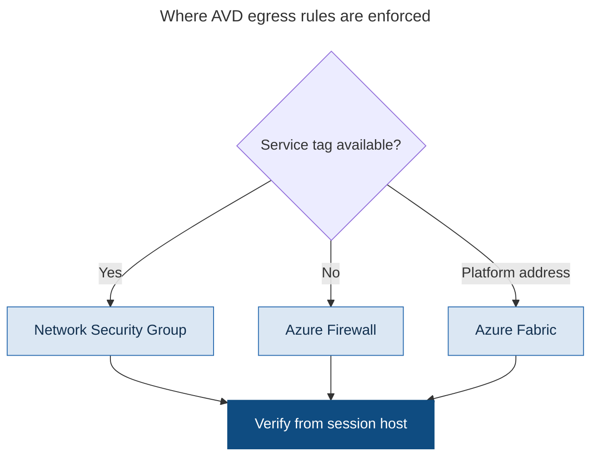

# Chapter 11 - Network Fundamentals and Required Connectivity

> **Book:** Azure Virtual Desktop - Architect to Hands-on Implementation
> **Part III:** Network Architecture
> **Technical baseline:** August 2026

---

## Chapter Information

| Item | Detail |
|---|---|
| **Chapter number** | 11 |
| **Objective** | Build an egress and DNS design that AVD actually supports, and know how to prove it works before users find out it does not |
| **Prerequisites** | Chapters 1 to 10. Labs 1 to 4 complete |
| **Dependencies** | Extends the connection flow from [Chapter 4](ch04-connection-flow-end-to-end.md) and the network built in [Lab 3](../labs/lab-03-vnet-subnets-nsg-dns.md) |
| **Estimated lab time** | Lab 3 builds the base network; Lab 5 adds a storage private endpoint |
| **Azure resources required** | None new for the chapter |
| **Cost** | $0.00 for the chapter. Private Link adds cost per endpoint, discussed in section 5 |

---

## What You Will Learn

- Required versus optional FQDNs, and why the difference matters at design time
- The two platform addresses that behave differently from everything else
- When to use service tags, when you have no choice but FQDN filtering
- What DNS actually needs to look like
- What Private Link for AVD does, what it does not do, and its hard constraints
- Three production scenarios with exact investigation steps

---

## Why This Matters

AVD is an outbound-only service, so the network is the dependency that decides whether anything works. [Chapter 4](ch04-connection-flow-end-to-end.md) explained the connection flow. This chapter is about the plumbing underneath it.

The reason it deserves a full chapter is that network teams and AVD teams are usually different teams. The network team wants a list of IP addresses. AVD does not publish one. That single mismatch produces more failed deployments than any technical problem in this book.

---

## 1. Required and Optional Are Different Things

Microsoft splits the FQDN list into required and optional, and the split matters.

**Required.** Microsoft doesn't support Azure Virtual Desktop deployments where the FQDNs and endpoints listed in this article are blocked. There is no negotiation here. If a security team blocks one of these, the deployment is unsupported, and that is a sentence worth putting in writing early.

The required list is in [Chapter 4, section 3](ch04-connection-flow-end-to-end.md#3-what-session-hosts-actually-need-outbound). It is not repeated here.

**Optional.** A second table of endpoints session hosts might also need, depending on what else you run. Examples include `login.windows.net` for sign in to Microsoft Online Services and Microsoft 365, `*.events.data.microsoft.com` for telemetry, `www.msftconnecttest.com` to detect internet connectivity, `*.prod.do.dsp.mp.microsoft.com` for Windows Update, `*.sfx.ms` for OneDrive client updates, `*.digicert.com` for certificate revocation checks, `*.azure-dns.com` and `*.azure-dns.net` for Azure DNS resolution, and `*eh.servicebus.windows.net` for diagnostic settings sent to Event Hubs.

**The architect's point.** Optional does not mean unimportant. It means it depends on your design. If you use Event Hubs for diagnostics, that endpoint is required for you. If you deploy OneDrive, so is the OneDrive one. Work through the optional list against your actual design rather than skipping it, because these are the endpoints that produce strange partial failures months later.

**What the list does not cover.** This article doesn't include FQDNs and endpoints for other services such as Microsoft Entra ID, Office 365, custom DNS providers or time services. Microsoft Entra FQDNs and endpoints can be found under ID 56, 59 and 125 in Office 365 URLs and IP address ranges. Budget real time for this. Entra and Microsoft 365 endpoints are a bigger list than the AVD one.

`CURRENCY FLAG - verified August 2026. The FQDN list changes. Build rules from the live Microsoft page every time, including when you re-read this chapter.`

---

## 2. The Two Addresses That Behave Differently

Two entries in the required list are not normal internet endpoints, and treating them as such causes confusion.

169.254.169.254, the Instance Metadata Service, is a link-local address that provides VM metadata and identity information. Traffic is accessible only from within the VM and never leaves the host. 168.63.129.16, WireServer, is used by the Azure VM agent for health signals and core platform communication, including DNS when using Azure-provided DNS, and DHCP. These addresses are available in all Azure regions and clouds. Azure platform routing protects this traffic at the fabric layer, so standard network security group rules and user-defined routes do not affect connectivity by default.

Two practical consequences.

**You do not need to route them.** They work by default. An engineer who adds NSG rules for these addresses has usually misdiagnosed something else.

**You can still break them.** The protection is at the fabric layer by default, which is not the same as being unbreakable. Host based firewalls, proxy configuration applied at the operating system level, and certain forced tunnelling setups can block them. When a session host reports health problems and everything else looks correct, check whether something inside Windows is interfering with these two addresses.

---

## 3. Service Tags, Wildcards and Why the IP List Does Not Exist

The most common conversation with a network team goes like this. They ask for the AVD IP ranges. You explain there are none. They ask again.

The supported approach: service tags represent groups of IP address prefixes from a given Azure service. Microsoft manages the address prefixes encompassed by the service tag and automatically updates the service tag as addresses change, minimizing the complexity of frequent updates to network security rules. Service tags can be used in rules for Network Security Groups and Azure Firewall to restrict outbound network access.

**The wildcard requirement.** You must use the wildcard character for FQDNs involving service traffic. For agent traffic, if you prefer not to use a wildcard, you can find specific FQDNs to allow, provided your session hosts are registered to a host pool first.

That last part is a useful compromise for strict environments. Service traffic needs the wildcard. Agent traffic can be narrowed to specific FQDNs, but only after the hosts have registered, which means you need the wildcard open during initial deployment and can tighten afterwards. Plan the change window for that, because tightening it while hosts are registering will fail.

### Where each rule can actually be enforced



> This is a decision flow diagram, so it uses the reduced explanation set defined in the [diagram standard](../DIAGRAM-STANDARD.md): what it shows, step by step, architect's interpretation, and the official reference. Failure points do not apply to a decision tree.

**What the diagram shows.** Three different enforcement points, decided by whether the endpoint has a service tag. NSGs handle the service tag entries. Everything else needs FQDN filtering somewhere. The platform addresses need nothing at all.

**Step by step.** Take each endpoint from the required and optional tables. If it has a service tag, an NSG rule is enough. If it does not, the rule has to live in Azure Firewall or an equivalent that understands FQDNs. The two platform addresses are handled by Azure itself. Whatever you build, prove it from the session host rather than from the firewall configuration, because a rule that looks right and a path that works are different claims.

**Architect's view.** This diagram is the answer to the IP allow list request. Working through it with a network team turns an argument into a short table, and the outcome is either Azure Firewall with the AVD FQDN tag or a documented exception to their standard.

**Official reference:** https://learn.microsoft.com/en-us/azure/virtual-desktop/required-fqdn-endpoint

---

### Where NSGs stop being enough

NSGs filter on IP addresses, ports and service tags. They cannot filter on FQDNs.

Several required endpoints have no service tag at all. `www.microsoft.com`, `oneocsp.microsoft.com`, `azkms.core.windows.net` and the platform addresses are examples. In an NSG you either allow the traffic broadly or you move FQDN filtering to Azure Firewall, which supports FQDN tags including one for AVD, or to a third party next generation firewall with a dynamic Azure address list.

This is exactly the boundary [Lab 3](../labs/lab-03-vnet-subnets-nsg-dns.md) hits. The lab NSG allows service tags explicitly and permits the remaining outbound traffic. That is fine for a lab. It is not an egress control design. [Chapter 13](ch13-hybrid-connectivity-egress-control.md) builds the real one.

### Proxies

Microsoft publishes separate proxy guidelines for AVD. Read them before agreeing to a proxy, because the common failure is not the proxy itself. It is TLS inspection breaking certificate validation on AVD service traffic, which produces intermittent registration failures that look like a platform fault. See Scenario 2 in [Chapter 4](ch04-connection-flow-end-to-end.md#10-production-scenarios).

---

## 4. DNS

DNS for AVD is refreshingly ordinary, and people over-engineer it because they assume it is special.

Microsoft's guidance: Azure Virtual Desktop session hosts have the same name resolution requirements as any other infrastructure as a service workload. As a result, connectivity to custom DNS servers or access via a virtual network link to Azure private DNS zones is required. Extra Azure private DNS zones are required to host the private endpoint namespaces of certain platform as a service services, such as storage accounts and key management services.

So three things:

1. **Session hosts need working name resolution.** If they are domain joined, that means your domain controllers, as built in [Lab 4](../labs/lab-04-identity-integration.md). If they are Entra joined, Azure-provided DNS or your own resolvers.
2. **Private DNS zones where you use private endpoints.** Lab 5 applies this pattern to FSLogix profile storage.
3. **Nothing AVD-specific is required.** There is no special AVD DNS zone unless you deploy Private Link.

Also worth knowing for user onboarding: you can optionally configure email-based feed discovery to simplify user onboarding, and modern Azure Virtual Desktop clients can also subscribe directly using workspace discovery via the service without DNS-based email discovery. Email discovery used to be a standard step. It is now optional, and most deployments can skip the DNS records entirely.

### Entra joined hosts still go out to the internet

Microsoft Entra ID-joined VMs create outbound connections to Microsoft Entra ID public endpoints. No private connectivity configurations are required.

It is worth raising this early with a security team that assumes Entra join means everything stays private. It does not. Entra authentication is a public endpoint conversation, and that is by design.

---

## 5. Private Link for AVD

Private Link keeps AVD service traffic off the public internet by routing it through private endpoints in your virtual network. Attractive in regulated environments, and it has real constraints that must be understood before you commit.

### The three connection types

Initial feed discovery lets the client discover all workspaces assigned to a user. To enable this you must create a single private endpoint to the global sub-resource of any workspace. Feed download is where the client downloads all connection details for a specific user for the workspaces hosting their application groups, and you create a private endpoint for the feed sub-resource for each workspace you want to use with Private Link. Connections to host pools have two sides, clients and session hosts.

### The constraints that shape the design

**One global endpoint for the entire deployment.** You can only create one private endpoint in your entire Azure Virtual Desktop deployment for the global sub-resource. This endpoint creates DNS entries and private IP routes for the global FQDN needed for initial feed discovery. This connection becomes a single, shared route for all clients to use.

**Use a dedicated workspace for it.** The workspace used for the global sub-resource governs the shared FQDN for initial feed discovery across all workspaces. You should create a separate workspace that is only used for this purpose and doesn't have any application groups registered to it. Deleting this workspace will cause all feed discovery processes to stop working.

Read that last sentence again. Deleting one workspace stops feed discovery for the entire deployment. Put a resource lock on it and document why it exists, or someone will tidy up an empty workspace during a cleanup exercise.

**You cannot restrict access to that workspace.** You can't control access to the workspace used for the initial feed discovery. If you configure this workspace to only allow private access, the setting is ignored. That is worth raising with a security team up front rather than being discovered during an assessment.

**Agent restart required after changes.** After you've changed a private endpoint to a host pool, you must restart the Remote Desktop Agent Loader service on each session host in the host pool. You also need to restart this service whenever you change a host pool's network configuration. Instead of restarting the service, you can restart each session host.

This is an operational step people forget, and the symptom is hosts that stop working after a network change that looked successful.

```bash
# Restart the agent loader after a host pool network configuration change
az vm run-command invoke \
  --resource-group rg-avd-hosts-lab-eus2-01 \
  --name <vm-name> \
  --command-id RunPowerShellScript \
  --scripts "Restart-Service RDAgentBootLoader; Start-Sleep -Seconds 10; Get-Service RDAgentBootLoader | Select-Object Name, Status"
```

**The DNS zone change.** Early in the preview, the private endpoint for initial feed discovery shared the private DNS zone name privatelink.wvd.microsoft.com with other private endpoints for workspaces and host pools. In this configuration, users are unable to establish private endpoints exclusively for host pools and workspaces. Starting September 1, 2023, sharing the private DNS zone in this configuration is no longer supported. If you inherit an environment built during the preview, this needs migrating.

`CURRENCY FLAG - verified August 2026. Private Link for AVD has changed since preview. [VERIFY BEFORE IMPLEMENTATION] confirm current sub-resource behaviour, DNS zone names and supported topologies before designing with it.`

### Architect's view

Private Link is a genuine control, not a checkbox. It adds private endpoints, private DNS zones, an operational restart step, and a single point of dependency for feed discovery that you must protect.

Use it when a regulator or a security standard requires service traffic to stay off the public internet. Do not use it because it sounds more secure. The default model already gives you outbound-only session hosts with no public IPs, which covers most requirements.

---

## 6. Production Scenarios

### Scenario 1: The network team wants an IP allow list

**Problem.** A regulated customer's firewall standard forbids FQDN-based rules. The network team asks for AVD IP ranges. The project stalls for three weeks.

**Symptoms.** Not a technical failure. A design deadlock before deployment.

**Business impact.** Three weeks of project delay with no technical work possible, and a growing credibility problem for the programme.

**Initial hypothesis.** The standard was written for a different class of service. AVD does not publish static IP ranges, so the standard cannot be met as written.

**Investigation.** Confirm which endpoints have service tags and which do not, using the required and optional FQDN tables. Then confirm what the customer's firewall actually supports. Azure Firewall supports service tags and FQDN tags. Many next generation firewalls support a dynamic Azure address feed.

**Evidence.** A short table listing each required endpoint, its service tag if it has one, and whether it can be expressed as an IP-based rule. Several entries have no service tag, which proves the standard cannot be met.

**Root cause.** A policy assumption that every service publishes stable IP ranges.

**Fix.** Propose Azure Firewall with the AVD FQDN tag and service tags for the rest, and document the exception to the standard with the Microsoft support statement attached. The line that unblocks this is that Microsoft does not support deployments where the required endpoints are blocked, which converts the discussion from preference to supportability.

**Validation.** Deploy the rules, then run the AVD Agent URL Tool from a session host and confirm every endpoint passes. Do not accept a firewall rule review as proof. Test from the host.

**Prevention.** Raise egress requirements in the first design workshop, before the network standard becomes a blocker. Give the network team the service tag names and the Microsoft page in writing at the start.

**Architect's lesson.** Some blockers are policy, not technology. The fix is evidence and a documented exception, produced early.

**Interview lesson.** Showing that you resolve a standards conflict with evidence and a documented exception demonstrates seniority more than any technical detail.

### Scenario 2: Hosts stop working after a Private Link change

**Problem.** A host pool is moved to Private Link during a change window. The change completes successfully. On Monday the hosts show unavailable.

**Symptoms.** Private endpoint deployed correctly. DNS resolves to a private address. Hosts still report unavailable. Nothing in the change log looks wrong.

**Business impact.** A full host pool unavailable on a Monday morning after a change that was signed off as successful.

**Initial hypothesis.** The agent loader service was not restarted after the host pool network configuration changed. Microsoft documents this as a required step.

**Investigation.**

```bash
az vm run-command invoke -g rg-avd-hosts-lab-eus2-01 -n <vm> \
  --command-id RunPowerShellScript \
  --scripts "Get-Service RDAgentBootLoader, RDAgent | Select-Object Name, Status; Resolve-DnsName <workspace>.privatelink.wvd.microsoft.com"
```

Then check *Event Viewer > Windows Logs > Application > WVD-Agent* for connection errors after the change window.

**Evidence.** DNS resolves privately, which proves the endpoint works, and the agent is still trying to reach the old path. Restarting the service on one host brings it back.

**Root cause.** A documented post-change step was missed because the change plan was written from the private endpoint documentation rather than the AVD Private Link page.

**Fix.** Restart RDAgentBootLoader on every host in the pool, or restart the hosts.

**Validation.** All hosts return to available and a real connection succeeds. Confirm on more than one host, because a single restart proves the cause rather than the fix.

**Prevention.** Add the agent restart to the standard runbook for any host pool network configuration change. Automate it, since it is a single command across the pool.

**Architect's lesson.** Network changes that look complete at the Azure layer can still leave the service layer stale. Where documentation names a post-change step, it belongs in the runbook rather than in someone's memory.

**Interview lesson.** Naming a documented post change step that most people miss shows you read the product documentation rather than blog posts.

### Scenario 3: The empty workspace someone deleted

**Problem.** During a cleanup, an engineer deletes an empty workspace with no application groups. Feed discovery stops working for the entire deployment.

**Symptoms.** Users cannot subscribe. Existing sessions continue. Nothing else was changed.

**Business impact.** No user can subscribe anywhere in the deployment. Existing sessions continue, so the impact grows through the day as people disconnect.

**Initial hypothesis.** The deleted workspace was the one hosting the global sub-resource private endpoint for initial feed discovery.

**Investigation.** *Azure portal > the resource group > Activity log*, filtered on Delete operations, to identify what was removed and when. Then check whether a private endpoint existed for the global sub-resource.

```bash
az monitor activity-log list --resource-group rg-avd-service-lab-eus2-01 \
  --offset 1d \
  --query "[?contains(operationName.value,'delete')].{time:eventTimestamp,who:caller,what:resourceId}" -o table
```

**Evidence.** The deleted resource is a workspace, and the private endpoint for the global sub-resource pointed at it. Microsoft documents that deleting this workspace stops all feed discovery.

**Root cause.** A workspace that looked disposable because it was empty. It was empty by design.

**Fix.** Recreate the workspace and the global sub-resource private endpoint, then confirm DNS entries for the global FQDN resolve correctly.

**Validation.** A test user subscribes successfully from a client that has never connected before, which forces initial feed discovery rather than using cached data.

**Prevention.** Put a resource lock on the discovery workspace. Name it so its purpose is obvious, for example `ws-avd-globaldiscovery-donotdelete`. Document it in the operations handover. Empty resources get deleted unless there is a visible reason not to.

**Architect's lesson.** Any component whose failure affects the whole deployment needs a lock, a name that explains itself, and a line in the handover document.

**Interview lesson.** This story demonstrates operational judgement, which is what a design review actually tests.

---

## 7. The Architect's Four Questions

**What do I check first?** Whether session hosts can reach the required endpoints. Event ID 3701 and the AVD Agent URL Tool answer this faster than reading firewall rules.

**What can I safely change now?** Adding an allow rule for a required endpoint. Running the URL tool. Restarting RDAgentBootLoader on a drained host. Reading NSG and firewall rules.

**What must not be changed blindly?**
- Tightening egress rules for the session host subnet. Do it in a change window with the URL tool run afterwards.
- VNet DNS servers. See [Lab 4](../labs/lab-04-identity-integration.md).
- Deleting any workspace, especially an empty one.
- Enabling TLS inspection on AVD service traffic.
- Moving a host pool to Private Link without planning the agent restart.

**When do I escalate to Microsoft?** When the URL tool passes for every required endpoint, DNS resolves correctly, event 3701 is clean and hosts still fail to register. Collect the URL tool output, event 3701 output, DNS resolution results from the host, the host pool network configuration, agent version and UTC timestamps.

---

## 8. Common Mistakes

- Treating the optional FQDN list as ignorable. Optional means it depends on your design.
- Promising a network team an IP allow list. AVD does not publish one.
- Adding NSG rules for 169.254.169.254 and 168.63.129.16. They are handled at the fabric layer.
- Assuming Entra joined hosts avoid public endpoints. They do not.
- Applying TLS inspection to AVD service traffic.
- Deploying Private Link because it sounds secure, without a requirement for it.
- Forgetting the agent loader restart after a host pool network change.
- Leaving the global discovery workspace unlocked and unlabelled.
- Trying to narrow agent FQDNs before hosts have registered.

---

## 9. Interview Preparation

### Q29. What outbound access do AVD session hosts need?

**Simple answer**
A specific set of FQDNs over 443, plus KMS on 1688 and certificate checks on 80. All outbound. No inbound ports are needed. Microsoft does not support deployments where the required endpoints are blocked.

**Strong senior architect answer**
"There is a required list and an optional list, and both matter. The required list is non-negotiable, because Microsoft does not support a deployment where those are blocked, and that is the sentence that usually settles the conversation with a security team. The optional list depends on your design, so if you use Event Hubs for diagnostics or deploy OneDrive, those endpoints become required for you. The important architectural point is that AVD publishes no static IP ranges, so the supported approach is service tags in NSGs and Azure Firewall, and the AVD FQDN tag in Azure Firewall. Some required endpoints have no service tag at all, which is where NSGs stop being sufficient and you need FQDN filtering. And you must use wildcards for service traffic, although agent traffic can be narrowed to specific FQDNs once the hosts have registered."

**Follow-up you should expect**
"How do you prove it works?" The AVD Agent URL Tool from the session host, and event ID 3701 in the WVD-Agent log when something is blocked. Not a firewall rule review.

### Q30. Would you use Private Link for AVD?

**30 second answer**
"Only where a regulator or a security standard requires service traffic to stay off the public internet. The default model already gives outbound-only session hosts with no public IPs and no inbound rules, which meets most requirements. Private Link adds real constraints, so I would not deploy it just because it sounds more secure."

**2 minute answer**
Explain the constraints, because that is where the answer gets credible. One private endpoint for the global sub-resource across the entire deployment, hosted on a dedicated workspace that must not be deleted, and whose access cannot be restricted even if you configure it to be private. A private endpoint for the feed sub-resource per workspace. And an operational step where the agent loader service has to be restarted on every session host after a host pool network configuration change. Then the design consequence: you now have a single component whose deletion stops feed discovery for everyone, so it needs a resource lock, a self-explanatory name and a line in the handover.

**Deep dive answer**
There is an assessment conversation worth having here. A security team asking for Private Link is usually trying to satisfy a control about data not traversing the public internet. Walk them through what the default model already provides, then be honest that the discovery workspace cannot be made private, because that will come up in an assessment and it is far better raised by you at design time than found by an auditor. Then cost and operations: endpoints per workspace, DNS zones, and a restart step that has to be in the runbook. If the control genuinely requires it, deploy it properly. If it does not, you have documented why the default model meets the intent.

### Q31. A session host will not register. Walk me through it.

**Strong answer**
"Event ID 3701 in the WVD-Agent log first, because it names the exact FQDNs the agent cannot reach, and those are region specific. Then the AVD Agent URL Tool to validate every endpoint from that host. If both are clean, I would check DNS resolution from the host and whether anything recently changed on the proxy or firewall, particularly TLS inspection, because intercepting AVD service traffic breaks certificate validation and looks intermittent. If it is a Private Link environment, I would check whether the agent loader service was restarted after the last network change. Only when all of that is clean would I open a case, and I would have the URL tool output, event 3701, DNS results and the agent version ready, because support asks for exactly that."

---

## 10. Key Takeaways

- Required endpoints are a support boundary. Blocking them makes the deployment unsupported.
- Optional endpoints become required depending on your design. Work through the list.
- Entra ID and Microsoft 365 endpoints are documented separately and are a larger list than AVD's.
- 169.254.169.254 and 168.63.129.16 are protected at the fabric layer, so NSGs and route tables do not affect them by default.
- AVD publishes no static IP ranges. Use service tags and the Azure Firewall FQDN tag.
- Wildcards are required for service traffic. Agent traffic can be narrowed after hosts register.
- DNS for AVD is ordinary IaaS DNS, plus private DNS zones where you use private endpoints.
- Private Link has one global discovery endpoint for the whole deployment, on a workspace that must not be deleted and cannot be made private.
- Restart RDAgentBootLoader after any host pool network configuration change.

---

## 11. Official References

- Required FQDNs and endpoints for Azure Virtual Desktop - https://learn.microsoft.com/en-us/azure/virtual-desktop/required-fqdn-endpoint
- Proxy service guidelines for Azure Virtual Desktop - https://learn.microsoft.com/en-us/azure/virtual-desktop/proxy-server-support
- Azure Private Link with Azure Virtual Desktop - https://learn.microsoft.com/en-us/azure/virtual-desktop/private-link-overview
- Set up Private Link with Azure Virtual Desktop - https://learn.microsoft.com/en-us/azure/virtual-desktop/private-link-setup
- Network topology and connectivity design guidance - https://learn.microsoft.com/en-us/azure/cloud-adoption-framework/scenarios/azure-virtual-desktop/eslz-network-topology-and-connectivity
- Azure private endpoint DNS configuration - https://learn.microsoft.com/en-us/azure/private-link/private-endpoint-dns

---

## Architect's Reality Check

**What engineers commonly get wrong.** They promise the network team an IP allow list. AVD does not publish one, and the conversation goes nowhere until that is stated plainly with the Microsoft support position attached.

**What I would check first in production.** Event 3701 on an affected host, then the Agent URL Tool. Both tell you exactly which endpoint is blocked, which beats reading firewall rules.

**What I would ask the customer.** Whether TLS inspection is applied to Azure traffic, and whether the optional endpoints their design uses are allowed. Optional does not mean unnecessary.

**What I would decide as the architect.** Service tags where they exist, Azure Firewall with the AVD FQDN tag for the rest, and a documented exception if the customer's firewall standard cannot express it.

**What I would say in an interview.** That blocking required endpoints makes the deployment unsupported. That single fact converts an argument about preference into a supportability decision.

---

## How This Changes With Scale

**Around 100 users.** NSGs with service tags and broad outbound access are usually acceptable. Egress control is a nice to have.

**Around 1,000 users.** A firewall with FQDN filtering becomes justified, and the optional endpoint list has to be worked through properly because more services are in use.

**Around 5,000 users and beyond.** Multi region means region specific endpoints and per region rule maintenance. Private Link becomes a genuine discussion, and its single global discovery dependency becomes something that needs a lock and an owner.

---

## Chapter Close

**What was completed**
You can build an egress design AVD supports, explain why an IP allow list is impossible, design DNS correctly, and decide whether Private Link is justified.

**What you should test**
Run the AVD Agent URL Tool against a lab session host once Lab 8 exists. Before then, review your Lab 3 NSG rules against the required and optional endpoint tables and note which endpoints your NSG cannot express.

**What comes next**
Chapter 12 covers enterprise topologies. Hub and spoke, Virtual WAN, landing zone alignment, and the IP address planning that has to be right the first time.

**Interview preparation carried forward**
Q29 is asked in almost every AVD interview. The detail that separates candidates is knowing that no static IP list exists and being able to say what to use instead.
