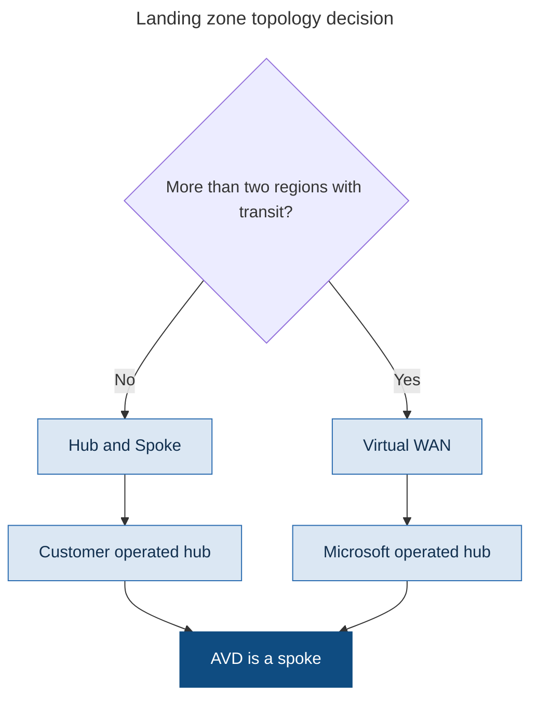

# Chapter 12 - Enterprise Topologies and IP Address Planning

> **Book:** Azure Virtual Desktop - Architect to Hands-on Implementation
> **Part III:** Network Architecture
> **Technical baseline:** August 2026

---

## Chapter Information

| Item | Detail |
|---|---|
| **Chapter number** | 12 |
| **Objective** | Choose between hub and spoke and Virtual WAN for an AVD estate, and plan address space that still works at Lab 20 and at 5,000 users |
| **Prerequisites** | Chapters 1 to 11. Labs 1 to 4 complete |
| **Dependencies** | Builds on the connectivity requirements in [Chapter 11](ch11-network-fundamentals-required-connectivity.md) and the lab network in [Lab 3](../labs/lab-03-vnet-subnets-nsg-dns.md) |
| **Estimated lab time** | None new. The lab uses a single spoke pattern, explained in section 6 |
| **Azure resources required** | None new for the chapter |
| **Cost** | $0.00 for the chapter. Topology choice has significant cost impact, covered in section 4 |

---

## What You Will Learn

- Where AVD sits in a landing zone, and why that is a platform decision rather than an AVD one
- Hub and spoke versus Virtual WAN, with the crossover point that actually matters
- How to size address space so you never have to renumber
- Why subnet sizing for session hosts is not the same as sizing for user count
- Three production scenarios, including the one where the network was right and the design still failed

---

## Why This Matters

Topology is the hardest thing in this book to change once workloads are running. You can rebuild a session host in twenty minutes. You cannot renumber a virtual network that is peered to six others and connected to on-premises without a project.

AVD makes this worse than most workloads for two reasons. Session host counts grow, sometimes suddenly after an acquisition. And rolling image updates temporarily double the host count, so the subnet has to hold more addresses than the steady state suggests.

---

## 1. AVD Lives in an Application Landing Zone

The first thing to get straight is ownership. Microsoft's guidance places AVD as a workload, not as a platform: you deploy AVD resources into an application landing zone.

That means the hub, the firewall, the ExpressRoute circuit and the DNS design usually belong to a platform team. The AVD architect consumes them and states requirements. This is a better position than it sounds, because it means you are not responsible for the hub, but you are responsible for stating clearly what AVD needs from it.

Microsoft frames the AVD network design foundations as hybrid integration for connectivity between on-premises, multicloud and edge environments and global users, performance and reliability at scale for a consistent low-latency experience, zero trust based network security to help secure network perimeters and traffic flows, and extensibility for easily expanding a network footprint without design rework.

That last one, extensibility without design rework, is the one people fail. Sections 3 and 5 are about getting it right.

---

## 2. Hub and Spoke, or Virtual WAN

Both are valid landing zone topologies. Neither is universally correct.

**Hub and spoke.** You build and operate the hub virtual network yourself. Microsoft describes it as a network architecture in which a hub virtual network acts as a central point of connectivity to several spoke virtual networks. The hub can also be the connectivity point to on-premises datacenters. The spoke virtual networks peer with the hub and help to isolate workloads.

**Virtual WAN.** Microsoft operates the hub. It is a networking service that brings networking, security and routing functions together in a single operational interface. Microsoft's guidance is to use Virtual WAN when you require transit connectivity between many endpoints.

### The scale trigger

Microsoft's own recommendation for when to move: when your organization requires hub-and-spoke network architectures across more than two Azure regions and global transit connectivity between landing zone virtual networks across Azure regions, and you want to minimize network management overhead, we recommend a managed global transit network architecture that's based on Virtual WAN.

So the trigger is more than two regions plus a need for global transit, not spoke count on its own.



> This is a decision flow diagram, so it uses the reduced explanation set defined in the [diagram standard](../DIAGRAM-STANDARD.md): what it shows, step by step, architect's interpretation, and the official reference. Failure points do not apply to a decision tree.

### What the diagram shows

The decision is about region count and transit needs, and it is a platform decision. AVD is a spoke in both cases. Your session host subnets, NSGs and egress requirements are identical.

### Step by step

1. Count the Azure regions in scope, now and in the next two years.
2. Ask whether landing zones in different regions need to talk to each other, and whether branch sites connect directly to Azure.
3. One or two regions with straightforward connectivity points at hub and spoke.
4. More than two regions with global transit, or a large branch estate, points at Virtual WAN.
5. Whichever is chosen, AVD consumes it as a spoke.

### Architect's view

The honest position in an interview or a design review is that this is rarely the AVD architect's call. If a hub already exists, use it. If the platform team is building one, state your requirements clearly and early: address space, egress control capable of FQDN filtering, DNS resolution to your domain controllers or resolvers, and a route that does not break the outbound path in [Chapter 11](ch11-network-fundamentals-required-connectivity.md).

The two operational differences worth knowing, because they will come up:

**Hub and spoke has no transitive routing by default.** Spoke to spoke traffic needs user defined routes and firewall rules. If your profile storage sits in a different spoke from your session hosts, that is a routing conversation.

**Shared services cannot live inside the Virtual WAN hub.** Microsoft is explicit: deploy required shared services, like DNS servers, in a dedicated spoke virtual network. Customer-deployed shared resources can't be deployed inside the Virtual WAN hub itself. So domain controllers go in a spoke, not in the hub, and that changes where your identity subnet lives.

**Official reference:** https://learn.microsoft.com/en-us/azure/cloud-adoption-framework/scenarios/azure-virtual-desktop/eslz-network-topology-and-connectivity

---

## 3. Address Space Planning

Address space is free. Renumbering is a project. Be generous.

### The rule that decides everything

Your AVD address space must not overlap anything it might ever need to reach. On-premises networks, other Azure regions, partner networks, and any company you might acquire. Overlap can only be fixed by renumbering one side.

Take the allocation from corporate IPAM. Do not invent one because it was quicker.

### Sizing session host subnets

Do not size from user count. Size from host count, at peak, during a rolling update.

The method:

1. **Maximum users for the host pool.** Not today's number. The number the business plans for.
2. **Divide by users per host.** From measurement, not a blog post. See [Project 07](../scenarios/project-07-call-centre-high-density.md), where density economics is worked through in full.
3. **Double it.** During a rolling image update, old and new hosts coexist. This is the step people miss.
4. **Add the Azure reservation.** Five addresses per subnet, always.
5. **Round up to the next power of two.**

Worked example for Northwind's task workers:

| Step | Value |
|---|---|
| Planned maximum users | 1,600 |
| Users per host, measured | 10 |
| Steady state hosts | 160 |
| Doubled for rolling updates | 320 |
| Azure reserved addresses | 5 |
| Total required | 325 |
| Subnet | `/23` gives 507 usable. Sufficient with headroom |

A `/24` would have given 251 usable, which looks fine at steady state and fails during the first rolling update. That failure happens at the worst possible moment, mid deployment, with half the pool replaced.

### Hub sizing

If you own the hub, size it once and stop thinking about it. A `/22` for the hub is a common enterprise allocation because it holds the gateway subnet, firewall subnet, Bastion subnet and shared services with room left over. Expanding a hub address space later means re-peering every spoke.

The gateway subnet has a specific requirement. Microsoft's hub and spoke reference architecture states: create a gateway subnet with an IP address range of at least /26 or larger named GatewaySubnet. The /26 address range provides sufficient scalability to avoid gateway size limitations and accommodate extra ExpressRoute circuits in the future.

### Reserved subnet names

Some subnets must use exact names or Azure rejects them. `GatewaySubnet`, `AzureFirewallSubnet`, `AzureBastionSubnet`. This catches people during their first hub build.

---

## 4. Cost, Honestly

Topology has a real bill attached, and it is usually paid by the platform team rather than the AVD budget. Know the shape of it anyway, because you will be asked why the network costs more than the desktops in a small deployment.

| Component | Cost driver |
|---|---|
| VNet peering | Charged per GB in both directions. Profile traffic crossing a peering adds up |
| Virtual WAN hub | Hourly charge plus per GB processed |
| Azure Firewall | Hourly deployment charge plus per GB processed. Significant fixed cost |
| ExpressRoute | Circuit charge plus gateway charge |
| NAT Gateway | Hourly plus data processed |
| VPN Gateway | Hourly by SKU |
| Private endpoints | Per endpoint per hour plus data |

**The AVD specific point.** If FSLogix profile storage sits in a different virtual network from the session hosts, every profile read and write crosses a peering and is billed. At 3,000 users that is not a rounding error. Keep profile storage in the same virtual network as the session hosts, or accept and model the cost.

This is one of the few places where a network design decision shows up directly in the AVD bill, so it is worth raising in design review.

---

## 5. What the Lab Uses and Why

[Lab 3](../labs/lab-03-vnet-subnets-nsg-dns.md) builds a single virtual network with four subnets and no hub. That is deliberate.

**Why no hub in the lab.** A hub with Azure Firewall would add roughly one to two hundred dollars a month, and it would teach you Azure Firewall rather than AVD. The lab teaches AVD. [Chapter 13](ch13-hybrid-connectivity-egress-control.md) covers the firewall design properly, and you can add it to the lab if you want to pay for it.

**What the lab does teach.** Subnet separation by function, NSGs per subnet, address space sized for growth, and the identity subnet pattern you would use in a real spoke. Everything transfers. In production the same subnets sit inside a spoke that peers to a hub, and the NSG rules are the same.

**What differs in production.** A route table sending outbound traffic to the firewall, peering to the hub, and DNS pointing at central resolvers rather than a single lab domain controller.

---

## 6. Production Scenarios

### Scenario 1: The acquisition with overlapping address space

**Problem.** A manufacturer acquires a competitor. Both run 10.0.0.0/16 on-premises. The AVD estate needs to serve users from both businesses and reach file servers in both datacentres.

**Symptoms.** Not a failure yet. A design deadlock discovered during planning, three weeks before the integration deadline.

**Business impact.** Integration deadline at risk for 900 acquired users, with contractual milestones attached.

**Initial hypothesis.** The overlap cannot be routed around. Something has to change, and the question is which side and how fast.

**Investigation.** Map every network the AVD spoke needs to reach. Identify exactly which ranges overlap and which applications sit inside them. Confirm whether the acquired business has any renumbering already planned.

**Evidence.** A table of source ranges, destination ranges and the overlapping subset. In this case the overlap was limited to two /24 ranges containing the acquired file servers.

**Root cause.** Two independently designed networks, both using the most common private range.

**Fix.** Three options were presented with time and risk attached:

1. Renumber the acquired ranges. Correct, slow, and outside the deadline.
2. NAT the overlapping ranges at the connection point. Works, adds operational complexity, and hides real addresses from logs.
3. Publish the affected applications rather than routing to them, using a separate host pool that sits inside the acquired network.

Option 3 was chosen for the deadline, with option 1 scheduled afterwards.

**Validation.** Users from the acquired business reach their applications from the new host pool, and users from the parent business are unaffected. Both tested before the integration date.

**Prevention.** Take AVD address space from corporate IPAM with acquisition headroom reserved. Ask about pending acquisitions during design. It sounds like an odd question and it has saved more than one project.

**Architect lesson.** When the network cannot be fixed in time, change where the workload sits rather than forcing the network.

**Interview lesson.** Offering three options with time and risk attached, rather than one answer, is how senior architects present decisions.

**Architect's lesson.** When the network cannot be fixed in time, change where the workload sits rather than forcing the network. Publishing applications from inside the constrained network is a valid architectural answer, not a workaround.

### Scenario 2: The rolling update that ran out of addresses

**Problem.** A 900 user host pool is updated to a new image. The rolling update fails halfway through. New hosts cannot be created.

**Symptoms.** Deployment errors indicating no available addresses. Half the pool is on the old image, half on the new. Users are still working, so it is not an outage yet.

**Business impact.** Half the pool on one image version and half on another, with no way to complete the update. Users are working, so this is a controlled problem rather than an outage.

**Initial hypothesis.** Subnet exhaustion. During a rolling update the host count temporarily doubles, and the subnet was sized for steady state.

**Investigation.**

```bash
az network vnet subnet show \
  --resource-group rg-avd-network-lab-eus2-01 \
  --vnet-name vnet-avd-lab-eus2-01 \
  --name snet-hosts-lab-eus2-01 \
  --query "{prefix:addressPrefix, ipConfigs:length(ipConfigurations)}" -o json
```

Then count the current host NICs against the usable address count for the prefix.

**Evidence.** The subnet is a /24 with 251 usable addresses. 118 old hosts plus 118 new hosts plus platform overhead exceeds it.

**Root cause.** The subnet was sized from steady state host count without allowing for the update overlap.

**Fix.** Two paths, and the choice depends on how much of the pool is already updated.

Short term: complete the update in smaller batches, removing old hosts before adding more new ones. Slower, and it works without changing the network.

Proper fix: add an additional address prefix to the virtual network and create a larger subnet, then move the host pool to it over the next update cycle. Session hosts are disposable, so this is a rebuild rather than a migration.

**Validation.** A full rolling update completes end to end with the pool at maximum size, without exhausting addresses. Test it deliberately rather than waiting for the next real update.

**Prevention.** Size session host subnets at double the steady state host count, plus the five Azure reserved addresses, then round up. Add a subnet utilisation alert at 70 percent.

**Architect lesson.** Size for the peak the process creates, not the peak the users create.

**Interview lesson.** Sizing a subnet from rolling update overlap is a specific detail most candidates miss.

**Architect's lesson.** Steady state sizing is the wrong model for anything that gets replaced in place. Size for the peak the process creates, not the peak the users create.

### Scenario 3: Profile performance fine, network bill unexplained

**Problem.** A 2,000 user deployment is performing well. Finance queries a large and growing network charge that nobody can attribute.

**Symptoms.** No performance complaints. No errors. Just cost, rising in line with user adoption.

**Business impact.** A growing unattributed network charge that scales with adoption, which undermines the cost model the project was approved on.

**Initial hypothesis.** Profile traffic crossing a virtual network peering. FSLogix reads and writes the whole profile container at sign in and sign out, and peering is billed per GB in both directions.

**Investigation.** *Azure portal > Cost Management > Cost analysis*, grouped by meter, filtered to networking. Then confirm where the storage account sits relative to the session hosts.

**Evidence.** Peering data charges track user sign in volume. The storage account is in a shared services virtual network, peered to the AVD spoke.

**Root cause.** Profile storage was placed in a central shared services network for governance reasons, without modelling the traffic cost of profile mounts at scale.

**Fix.** Move profile storage into the AVD spoke, or place it behind a private endpoint inside the session host virtual network. Then re-measure.

Moving storage is not trivial. Plan it as a migration with a maintenance window, and be clear that profile containers must be copied rather than recreated if you want to preserve user data. See [Chapter 22](ch22-profile-operations-failure-recovery.md).

**Validation.** Peering charges fall while sign in volume stays constant. Profile mount times unchanged or improved.

**Prevention.** Add a data path review to design sign off. For every high volume flow, ask whether it crosses a peering, and if it does, model the cost before committing.

**Architect lesson.** A design can be technically correct and financially wrong.

**Interview lesson.** Linking a governance placement decision to a per gigabyte charge shows you follow decisions through to the bill.

**Architect's lesson.** A design can be technically correct and financially wrong. Governance driven placement decisions need a traffic cost check, particularly for anything that moves data at every sign in.

---

## 7. The Architect's Four Questions

**What do I check first?** Whether the address space overlaps anything, and whether the session host subnet is sized for the update peak rather than the steady state. Those two account for most topology problems in AVD.

**What can I safely change now?** Adding a new subnet to an existing address space. Adding an address prefix to a virtual network. NSG rules. Reading peering and route configuration.

**What must not be changed blindly?**
- Virtual network address space on an existing network. Changing it can force resource recreation and break peering.
- Route tables on the session host subnet. A wrong route breaks the outbound path every host depends on.
- Peering configuration, particularly gateway transit settings.
- Moving profile storage without planning for data migration.

**When do I escalate to Microsoft?** Topology issues are almost never a Microsoft fault. Escalate for platform limits you cannot design around, such as peering or Virtual WAN connection limits in a large estate, or unexplained routing behaviour you can reproduce. Collect the topology diagram, effective routes from an affected NIC, the peering configuration and the specific limit you are hitting.

Effective routes are the single most useful piece of evidence in a routing dispute:

```bash
az network nic show-effective-route-table \
  --resource-group rg-avd-hosts-lab-eus2-01 \
  --name <nic-name> -o table
```

---

## 8. Common Mistakes

- Inventing address space instead of taking it from IPAM.
- Sizing session host subnets from user count rather than peak host count during a rolling update.
- Forgetting the five Azure reserved addresses per subnet.
- Assuming spoke to spoke traffic routes by default in hub and spoke. It does not.
- Trying to deploy domain controllers inside a Virtual WAN hub. Shared services go in a spoke.
- Choosing Virtual WAN for two regions because it sounds more modern.
- Placing profile storage across a peering without modelling the data cost.
- Using the wrong name for a reserved subnet.
- Treating topology as an AVD decision when it is a platform decision.

---

## 9. Interview Preparation

### Q32. Hub and spoke or Virtual WAN for AVD?

**Simple answer**
It is a platform decision rather than an AVD one. AVD is a spoke either way. Hub and spoke suits one or two regions with straightforward connectivity. Virtual WAN suits more than two regions where you need global transit and want Microsoft to manage the routing fabric.

**Strong senior architect answer**
"AVD sits in an application landing zone, so in most organisations the hub already exists and I consume it. My job is to state requirements clearly: address space with acquisition headroom, egress control that can filter on FQDNs because several required AVD endpoints have no service tag, DNS resolution to the right resolvers, and routing that does not break the outbound path the session hosts depend on. On the choice itself, Microsoft's trigger for Virtual WAN is more than two regions with global transit needs, not spoke count alone. The two practical differences I care about are that hub and spoke has no transitive routing by default, so spoke to spoke needs UDRs and firewall rules, and that shared services like domain controllers cannot sit inside a Virtual WAN hub, they have to go in a spoke. That changes where my identity subnet lives."

**Follow-up you should expect**
"What if profile storage is in a different spoke?" Peering is billed per GB in both directions, and FSLogix moves the whole container at sign in and sign out. At scale that is a real cost line. Keep profile storage with the session hosts or model the charge deliberately.

### Q33. How do you size a session host subnet?

**30 second answer**
"From peak host count, not user count. Take the planned maximum users, divide by measured users per host, then double it because a rolling image update runs old and new hosts side by side. Add the five addresses Azure reserves in every subnet and round up. Undersizing here fails during an update, which is the worst time to find out."

**2 minute answer**
Work the example. 1,600 planned users at 10 per host is 160 hosts, doubled to 320 for the update overlap, plus five reserved, so 325 addresses. A /24 gives 251 usable and would fail. A /23 gives 507 and holds. Then the wider point: address space is free and renumbering is a project, so the constraint is the IPAM allocation, not the subnet size. Take the allocation from corporate IPAM so it cannot overlap on-premises or a future acquisition, because overlap is only fixable by renumbering one side.

**Deep dive answer**
Add the operational layer. A subnet utilisation alert at 70 percent gives you warning before an update fails. Then the recovery path if it happens anyway, which is to complete the update in smaller batches by removing old hosts before adding new ones, then plan a properly sized subnet and rebuild into it, since session hosts are disposable. Finish with the design principle: anything replaced in place needs sizing for the peak the process creates, not the peak the users create. That applies to more than subnets.

### Q34. Where does AVD sit in a landing zone?

**Strong answer**
"In an application landing zone, as a workload. The hub, firewall, ExpressRoute and central DNS belong to the platform team. That split is useful because it means I am not operating the hub, but I am accountable for stating what AVD needs from it, and for stating it early enough to be built. The requirements I bring are address space with headroom, FQDN capable egress filtering, name resolution to my domain controllers or resolvers, and routing that preserves the outbound path. If any of those are missing, AVD fails in ways that look like an AVD fault and are not."

---

## 10. Key Takeaways

- AVD is deployed into an application landing zone. Topology is usually a platform decision.
- Microsoft's Virtual WAN trigger is more than two regions with global transit, not spoke count.
- Hub and spoke has no transitive routing by default. Spoke to spoke needs UDRs and firewall rules.
- Shared services, including domain controllers, cannot be deployed inside a Virtual WAN hub.
- Size session host subnets from peak host count during a rolling update, which is roughly double the steady state.
- Azure reserves five addresses in every subnet.
- GatewaySubnet should be /26 or larger. Reserved subnet names must be exact.
- Profile storage across a peering is billed per GB in both directions and adds up at scale.
- Address space overlap can only be fixed by renumbering. Take allocations from IPAM.

---

## 11. Official References

- Network topology and connectivity for Azure Virtual Desktop - https://learn.microsoft.com/en-us/azure/cloud-adoption-framework/scenarios/azure-virtual-desktop/eslz-network-topology-and-connectivity
- Traditional Azure networking topology - https://learn.microsoft.com/en-us/azure/cloud-adoption-framework/ready/azure-best-practices/traditional-azure-networking-topology
- Virtual WAN network topology in an Azure landing zone - https://learn.microsoft.com/en-us/azure/cloud-adoption-framework/ready/azure-best-practices/virtual-wan-network-topology
- Hub and spoke network topology in Azure - https://learn.microsoft.com/en-us/azure/architecture/networking/architecture/hub-spoke
- Azure Virtual Desktop landing zone accelerator - https://learn.microsoft.com/en-us/azure/cloud-adoption-framework/scenarios/azure-virtual-desktop/enterprise-scale-landing-zone

---

## Architect's Reality Check

**What engineers commonly get wrong.** They size the session host subnet from user count. It has to be sized from peak host count during a rolling update, which is roughly double the steady state.

**What I would check first in production.** Address space overlap and subnet utilisation. Those two account for most topology problems in AVD.

**What I would ask the customer.** Whether any acquisition is in progress. It sounds like an odd question and it has saved projects, because overlapping address space can only be fixed by renumbering.

**What I would decide as the architect.** Take the allocation from corporate IPAM, size generously, and keep profile storage in the same virtual network as the session hosts so profile traffic never crosses a peering.

**What I would say in an interview.** That topology is usually a platform decision and my job is to state AVD's requirements early. Then the subnet sizing arithmetic, because that is the part that is genuinely mine.

---

## Chapter Close

**What was completed**
You can state AVD's requirements to a platform team, explain the topology decision without pretending it is yours to make, and size address space that survives growth and rolling updates.

**What you should test**
Take your Lab 3 subnet plan and work the sizing method against a 1,600 user host pool. Then check whether your current employer's AVD or VDI subnets would survive a rolling update at full size.

**What comes next**
Chapter 13 covers hybrid connectivity and egress control. ExpressRoute, VPN, Azure Firewall with the AVD FQDN tag, and the full egress architecture diagram deferred from [Chapter 11](ch11-network-fundamentals-required-connectivity.md).

**Interview preparation carried forward**
Q33 is a good one to have ready. Most candidates size from user count. Sizing from peak host count during an update, and knowing why, is a small detail that signals real deployment experience.
