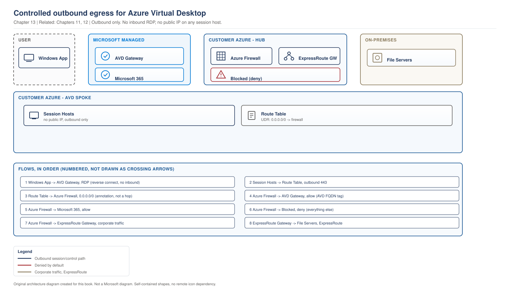

# Chapter 13 - Hybrid Connectivity and Egress Control

> **Book:** Azure Virtual Desktop - Architect to Hands-on Implementation
> **Part III:** Network Architecture
> **Technical baseline:** August 2026

---

## Chapter Information

| Item | Detail |
|---|---|
| **Chapter number** | 13 |
| **Objective** | Build a controlled egress design for AVD using Azure Firewall, understand forced tunnelling, and know why most egress failures are inside the VM rather than in the network |
| **Prerequisites** | Chapters 1 to 12. Labs 1 to 4 complete |
| **Dependencies** | Implements the requirements from [Chapter 11](ch11-network-fundamentals-required-connectivity.md) inside the topology from [Chapter 12](ch12-enterprise-topologies-ip-planning.md) |
| **Estimated lab time** | Optional. Azure Firewall is not deployed in the lab. See the cost note in section 6 |
| **Azure resources required** | None required. Azure Firewall is optional and expensive |
| **Cost** | $0.00 for the chapter. Azure Firewall carries a significant hourly charge plus data processing |

---

## What You Will Learn

- ExpressRoute, VPN and internet only, and when each is right for AVD
- How to build Azure Firewall rules for AVD using the FQDN tag and service tags
- What forced tunnelling does and what it costs you
- The failure mode that breaks AVD from inside the virtual machine, which is where most of these problems actually live
- Three production scenarios with exact investigation steps

---

## Why This Matters

[Chapter 11](ch11-network-fundamentals-required-connectivity.md) told you what AVD needs to reach. This chapter is about controlling that traffic without breaking it.

The reason it needs its own chapter is that egress control is where AVD deployments most often fail after go live. The environment works, someone tightens the network, and hosts start dropping out. And the most confusing version of this is not a network rule at all. It is something inside Windows, which is why the last section of this chapter matters more than the firewall rules.

---

## 1. Hybrid Connectivity Options

Three ways to connect the AVD spoke to on-premises. The choice is driven by what session hosts need to reach, not by preference.

| Option | Use when | Watch out for |
|---|---|---|
| **ExpressRoute** | Session hosts need reliable, low latency access to on-premises resources. Domain controllers, file servers, applications | Cost, lead time of weeks to months, and a gateway in every hub you use it from |
| **Site to site VPN** | Smaller estates, or as a backup path for ExpressRoute | Bandwidth and latency vary with the internet path. Fine for identity traffic, less good for large file access |
| **Internet only** | Entra joined session hosts with no on-premises dependency | You still need controlled egress. Internet only does not mean uncontrolled |

**The question that decides it.** What do session hosts need to reach on-premises, and how much data moves? If the answer is nothing, you may not need hybrid connectivity at all. That is one of the strongest arguments for the Entra join model in [Chapter 7](ch07-identity-architecture-foundations.md).

**A design point people miss.** If your domain controllers are on-premises and reachable only over the WAN link, then every user logon depends on that link. A single circuit failure becomes a total desktop outage. Put domain controllers in Azure, in every region you run session hosts, as covered in [Chapter 7 section 4](ch07-identity-architecture-foundations.md#4-if-you-still-need-domain-controllers).

---

## 2. Azure Firewall for AVD

Azure Firewall is the standard answer to FQDN filtering for AVD, because [Chapter 11](ch11-network-fundamentals-required-connectivity.md#3-service-tags-wildcards-and-why-the-ip-list-does-not-exist) established that several required endpoints have no service tag and cannot be expressed in an NSG.

### The FQDN tag

Microsoft's guidance is explicit about the tooling available: Azure Firewall also supports FQDN tags, which represent a group of fully qualified domain names associated with well known Azure and other Microsoft services. Azure Virtual Desktop doesn't have a list of IP address ranges that you can unblock instead of FQDNs to allow network traffic. If you're using a Next Generation Firewall you need to use a dynamic list made for Azure IP addresses to make sure you can connect. Azure Virtual Desktop has both a service tag and FQDN tag entry available.

So you get both. Use the FQDN tag in application rules, and the service tag in network rules.

Microsoft describes what FQDN tags do: FQDN tags make it easy for you to allow well-known Azure service network traffic through your firewall. You create an application rule and include the tag, and network traffic from that service can flow through your firewall.

### Rule structure

Three layers, and all three are needed. Missing the network rules is the single most common cause of a firewall build that half works.

**1. Application rules, for HTTP and HTTPS traffic.** Use the Azure Virtual Desktop FQDN tag. Add application rules for the optional endpoints your design actually uses, from the optional list in [Chapter 11](ch11-network-fundamentals-required-connectivity.md#1-required-and-optional-are-different-things).

**2. Network rules, for everything that is not HTTP or HTTPS.** This includes KMS activation on TCP 1688, DNS if you resolve externally, NTP for time, and UDP 3478 for RDP Shortpath STUN and TURN. Application rules will not carry these. Shortpath in particular is UDP and will silently fail if you only build application rules, which produces the "sessions feel laggy" complaint from [Chapter 4](ch04-connection-flow-end-to-end.md#10-production-scenarios).

**3. A default deny.** The point of the exercise. Everything not explicitly allowed is blocked, and the firewall logs tell you what you missed.

### Routing

Rules alone do nothing. Traffic has to reach the firewall.

Create a route table on the session host subnet with a default route of `0.0.0.0/0` sending traffic to the firewall's private IP as the next hop, then associate it with the subnet.

```bash
# Route table sending session host egress through the firewall
az network route-table create \
  --resource-group rg-avd-network-lab-eus2-01 \
  --name rt-hosts-lab-eus2-01

az network route-table route create \
  --resource-group rg-avd-network-lab-eus2-01 \
  --route-table-name rt-hosts-lab-eus2-01 \
  --name default-to-firewall \
  --address-prefix 0.0.0.0/0 \
  --next-hop-type VirtualAppliance \
  --next-hop-ip-address <firewall-private-ip>

az network vnet subnet update \
  --resource-group rg-avd-network-lab-eus2-01 \
  --vnet-name vnet-avd-lab-eus2-01 \
  --name snet-hosts-lab-eus2-01 \
  --route-table rt-hosts-lab-eus2-01
```

**What this does:** forces all outbound traffic from session hosts through the firewall for inspection.

**Warning.** Associating this route table is the moment things break if a rule is missing. Do it in a change window, with one host pool first, and with the AVD Agent URL Tool ready to run afterwards. This is a "do not change blindly" action.

**Validation immediately after:**

```bash
az network nic show-effective-route-table \
  --resource-group rg-avd-hosts-lab-eus2-01 \
  --name <nic-name> -o table
```

### The egress architecture

> **RECOMMENDED ARCHITECTURE.** Our design, technically consistent with Microsoft's documented egress requirements. Not a Microsoft reference architecture.

> **OUR ORIGINAL ARCHITECTURE DIAGRAM.** Created for this book. Not a Microsoft diagram.
> Editable source: [`ch13-avd-egress-architecture.drawio`](../diagrams/architecture/ch13-avd-egress-architecture.drawio)



**What the diagram shows.** All session host egress is forced through the firewall in the hub. Application rules handle web traffic using the AVD FQDN tag. Network rules handle the non-HTTP traffic that application rules cannot carry. Everything else is denied and logged. On-premises access goes through the gateway. Nothing comes inbound to a session host.

**Step by step.**
1. A session host tries to reach an AVD service endpoint. The route table sends it to the firewall.
2. The firewall matches an application rule via the AVD FQDN tag and allows it.
3. The host tries KMS activation on 1688. That is not HTTP, so a network rule handles it.
4. The host attempts RDP Shortpath on UDP 3478. Another network rule.
5. Anything not matched hits the default deny and appears in the firewall logs, which is how you find the endpoint you forgot.
6. Traffic to on-premises resources goes via the gateway rather than the internet path.

**Important design decisions.**

- **Where the firewall lives.** In the hub, shared across spokes, so egress policy is defined once. See [Chapter 12](ch12-enterprise-topologies-ip-planning.md).
- **Application rules and network rules together.** The FQDN tag covers HTTP and HTTPS only. Non-HTTP traffic needs network rules or it hits the default deny.
- **Profile storage stays inside the spoke**, reached through a private endpoint, so profile traffic never crosses the firewall or a peering.
- **Domain controllers stay inside the spoke.** Session host to domain controller traffic does not need inspecting and routing it through the firewall adds latency to every logon.
- **Route table applied per host pool**, not estate wide, so a missing rule affects one pool rather than everything.

**Failure points.**

| Point | Symptom | First check |
|---|---|---|
| Route table association | Every host unavailable within minutes | Firewall deny logs, effective routes |
| Missing network rules | Hosts unavailable, or activation and Shortpath fail quietly | `AZFWNetworkRule` deny entries |
| Missing UDP 3478 rule | Sessions work but feel laggy | Client transport, should be UDP |
| Gateway path | On-premises resources unreachable, AVD fine | Gateway and route configuration |
| In-VM configuration | Hosts unhealthy, firewall logs clean | Section 4 of this chapter |

**Architect's view.** The value of this design is not the blocking. It is the logging. A default deny with good logs turns "something is broken and we do not know why" into a query. Budget for the firewall logs going to Log Analytics, and be aware that ingestion is a real cost line, covered in [Project 03](../scenarios/project-03-global-enterprise-governance.md).

**Official reference:** https://learn.microsoft.com/en-us/azure/firewall/protect-azure-virtual-desktop

---

## 3. Forced Tunnelling

Forced tunnelling sends internet bound traffic from Azure out through an on-premises firewall instead of straight to the internet.

Microsoft's description is short: you can configure forced tunneling to route Internet-bound traffic to another firewall or network virtual appliance for further processing.

**Why organisations do it.** A security standard that requires all internet egress to be inspected by the corporate firewall. Common in financial services and government.

**What it costs you.**

- **Latency.** Every AVD service call now travels to on-premises and back out.
- **A bottleneck.** The on-premises firewall becomes the capacity limit for your entire desktop estate.
- **A new single point of failure.** If the WAN link drops, session hosts lose the AVD service, not just on-premises resources.

**The architect's position.** Forced tunnelling for AVD is a requirement to satisfy, not a design to recommend. If it is mandated, implement it and be explicit in the design document about the latency, capacity and availability consequences. If it is assumed rather than mandated, challenge it, because AVD's service traffic is Microsoft to Microsoft and inspecting it on-premises adds risk without adding much visibility.

If you do implement it, size the on-premises path for the full estate at peak, not for average, and test a link failure before go live rather than discovering the behaviour during one.

---

## 4. The Failure Mode Inside the Virtual Machine

This section is the most useful in the chapter, because it explains failures that look like network problems and are not.

`CURRENCY FLAG - verified August 2026. Microsoft published dedicated guidance on Azure fabric communication IPs for AVD in 2026. If you have not read it, read it before your next egress project.`

[Chapter 11](ch11-network-fundamentals-required-connectivity.md#2-the-two-addresses-that-behave-differently) introduced the two platform addresses. Microsoft's guidance on them is worth quoting properly, because it names the exact causes: Azure networking includes protections to ensure connectivity to these addresses at the fabric layer. Default routes such as 0.0.0.0/0 and most network security group rules don't block this traffic. However, these protections don't apply to configuration inside the VM or to explicit network rules that target these addresses or their service tags. Most connectivity issues are due to configuration inside the VM rather than by Azure network-layer configuration.

Read that last sentence again. **Most connectivity issues are inside the VM.**

The specific causes Microsoft lists:

| Cause | What it does |
|---|---|
| **VPN clients and secure web gateway agents in full tunnel or forced tunnel mode** | These capture all traffic from the VM. When they capture traffic to these addresses, connectivity fails because the addresses aren't reachable over VPN tunnels or third-party security infrastructure. When these agents run in forced-tunnel mode, they redirect all traffic through a virtual adapter, which can include traffic to Azure platform addresses, and that breaks connectivity |
| **Proxy settings inside Windows** | Proxy settings applied via PAC files, Group Policy, WinHTTP, WinINET or application-specific settings can cause the VM to proxy Azure platform traffic |
| **Host based firewalls and endpoint protection** | May block outbound TCP traffic |
| **Security tooling with network inspection** | Antivirus, Endpoint Detection and Response or Data Loss Prevention tools may include network inspection features |
| **Explicit deny rules targeting the service tags** | Explicit deny rules targeting these service tags can interfere with connectivity |

### Why this matters so much for AVD

Session hosts are Windows machines that your security team manages like any other Windows machine. So they get the corporate VPN client, the corporate proxy configuration, the EDR agent and the DLP agent. Every one of those is on the list above.

The result is a host that Azure believes is perfectly connected, reporting itself as unhealthy for reasons no network diagnostic will find.

### The diagnostic order that saves time

When a session host cannot reach what it needs:

1. **Check inside the VM first**, not the firewall. Proxy configuration, VPN or SWG agent, host firewall, EDR network inspection.
2. Then event ID 3701 in *Event Viewer > Windows Logs > Application > WVD-Agent*.
3. Then the AVD Agent URL Tool.
4. Then effective routes on the NIC.
5. Then firewall logs.

```powershell
# Quick check of in-VM configuration that breaks platform connectivity
netsh winhttp show proxy
Get-ItemProperty "HKCU:\Software\Microsoft\Windows\CurrentVersion\Internet Settings" |
  Select-Object ProxyEnable, ProxyServer, AutoConfigURL
Get-NetAdapter | Select-Object Name, InterfaceDescription, Status
Get-NetFirewallProfile | Select-Object Name, Enabled, DefaultOutboundAction
Test-NetConnection 168.63.129.16 -Port 80
```

**What this does:** shows the WinHTTP proxy, the WinINET proxy including any PAC file, whether a virtual adapter from a VPN or SWG agent is present, whether the host firewall blocks outbound by default, and whether the platform address is reachable.

**Expected output on a healthy host:** no WinHTTP proxy or a proxy with the correct bypass list, no unexpected virtual adapters, `DefaultOutboundAction` of Allow, and a successful connection to 168.63.129.16.

**Architect's lesson.** Put session hosts in a separate policy scope from user laptops. A VPN client belongs on a laptop. It does not belong on a virtual machine that is already inside the network it would connect to.

---

## 5. Never DNAT 3389 to a Session Host

Worth stating on its own because it appears in real environments.

If someone builds a firewall DNAT rule translating port 3389 on a public IP to a session host's private IP, they have reintroduced exactly the exposure AVD was designed to remove. AVD needs no inbound path. See [Chapter 4](ch04-connection-flow-end-to-end.md#2-reverse-connect-properly-explained).

It usually appears because an engineer is trying to test connectivity or troubleshoot a host they cannot reach. Use `az vm run-command` instead, as [Lab 4](../labs/lab-04-identity-integration.md) does throughout. It goes through Azure RBAC and the activity log rather than an open port.

---

## 6. Why the Lab Does Not Deploy Azure Firewall

An honest cost decision.

Azure Firewall carries a significant hourly charge plus data processing, and it runs whether or not you are using it. For a book lab, that is the largest single line you could add, and it would teach you Azure Firewall rather than AVD.

**What to do instead.** Read this chapter, build the rules on paper against the required and optional endpoint lists, and if you want to practise, deploy the firewall for a single day and delete it the same day. The Terraform for a minimal AVD firewall policy is a reasonable exercise, and the routing commands in section 2 work against the lab network as built in [Lab 3](../labs/lab-03-vnet-subnets-nsg-dns.md).

**If you do deploy it, delete it the same day.** Like Azure Bastion, it bills hourly and cannot be stopped.

---

## 7. Production Scenarios

### Scenario 1: Hosts go unavailable the moment the route table is applied

**Problem.** A firewall build is completed and tested on paper. The route table is associated with the session host subnet during a change window. Within minutes every session host shows unavailable.

**Symptoms.** Immediate, total, and clearly caused by the change. The client cannot connect. Firewall rules look correct.

**Business impact.** Total loss of the desktop service within minutes of a planned change, during the change window when the team expected to be finishing.

**Initial hypothesis.** Missing network rules. Application rules cover HTTP and HTTPS. Everything else, including KMS on 1688 and the platform traffic, needs network rules.

**Investigation.**

Check the firewall logs first, because a default deny logs exactly what was blocked.

```kusto
AZFWNetworkRule
| where TimeGenerated > ago(1h)
| where Action == "Deny"
| summarize Hits = count() by DestinationPort, Protocol, DestinationIp
| order by Hits desc
```

```kusto
AZFWApplicationRule
| where TimeGenerated > ago(1h)
| where Action == "Deny"
| summarize Hits = count() by Fqdn
| order by Hits desc
```

`[VERIFY BEFORE IMPLEMENTATION]` Confirm the firewall log table names in your workspace, since these depend on whether resource specific or Azure diagnostics mode is configured.

Then confirm the routing actually applied:

```bash
az network nic show-effective-route-table \
  --resource-group rg-avd-hosts-lab-eus2-01 --name <nic-name> -o table
```

**Evidence.** Deny entries in the network rule log for the endpoints that are not HTTP or HTTPS.

**Root cause.** The firewall policy was built entirely from application rules using the AVD FQDN tag. Non-HTTP traffic had nowhere to match and hit the default deny.

**Fix.** Add network rules for the non-HTTP endpoints, then re-test. Do not remove the route table as the first response, because that hides the fault rather than fixing it. Only roll back if the change window is running out.

**Validation.** Hosts return to available. Run the AVD Agent URL Tool from a host and confirm every endpoint passes. Then confirm RDP Shortpath is in use from a client, because UDP 3478 is the rule most likely to still be missing after everything else works.

**Prevention.** Build the firewall policy from a checklist that separates HTTP endpoints from non-HTTP endpoints. Apply the route table to one host pool first, never the whole estate. Keep the URL tool in the change plan as the validation step.

**Architect's lesson.** A firewall policy that only has application rules will look almost right and fail in a way that is hard to attribute. The FQDN tag is a starting point, not the whole policy.

**Interview lesson.** Knowing that non HTTP traffic needs network rules is a specific detail that proves you have built this rather than described it.

### Scenario 2: The EDR agent that broke half the estate

**Problem.** A security team rolls out a new endpoint agent across all Windows machines, including session hosts. Over the following days, session hosts begin reporting unhealthy at random.

**Symptoms.** Intermittent and spreading. Restarting a host fixes it temporarily. No network changes were made. Firewall logs show nothing being denied.

**Business impact.** Hosts failing progressively over days with no obvious pattern, so capacity shrinks while the cause looks unrelated to the agent rollout.

**Initial hypothesis.** In-VM network inspection. Microsoft's guidance names EDR and DLP network inspection features as a cause of platform connectivity failure, and nothing at the Azure network layer changed.

**Investigation.**

Firewall logs are clean, which is itself evidence. If traffic were being blocked at the firewall it would appear there.

On an affected host:

```bash
az vm run-command invoke -g rg-avd-hosts-lab-eus2-01 -n <vm> \
  --command-id RunPowerShellScript \
  --scripts "netsh winhttp show proxy; Get-NetAdapter | Select-Object Name, InterfaceDescription, Status; Test-NetConnection 168.63.129.16 -Port 80; Test-NetConnection 169.254.169.254 -Port 80"
```

Then compare an affected host against a healthy one, and check when the agent was installed against when the host first reported unhealthy.

**Evidence.** The platform address tests fail on affected hosts and succeed on hosts where the agent has not yet applied its inspection policy. A virtual adapter from the agent is present.

**Root cause.** The agent's network inspection captured traffic to Azure platform addresses, which Microsoft documents as unreachable through that kind of infrastructure.

**Fix.** Exclude the Azure platform addresses from the agent's inspection scope, following the vendor's exclusion mechanism. Then confirm on one host before rolling the exclusion out.

**Validation.** Platform address tests succeed on a previously affected host without restarting it. Host returns to available and stays available across a full working day.

**Prevention.** Put session hosts in a separate policy scope from laptops. Add "does this agent inspect or tunnel network traffic" to the review checklist for any new endpoint software destined for session hosts. Test on one host pool before estate-wide deployment.

**Architect's lesson.** Session hosts are not laptops, and treating them identically in endpoint policy is what causes this. The AVD architect needs to be in the review path for endpoint agent rollouts, which is an organisational fix rather than a technical one.

**Interview lesson.** Recommending an organisational fix, getting the architect into the endpoint review path, shows you understand where the real failure was.

### Scenario 3: Forced tunnelling makes logons unbearable

**Problem.** A regulated customer mandates forced tunnelling. After go live, logon times are two to three times longer than in pilot, and users complain constantly.

**Symptoms.** Sessions work. Everything is slow, particularly at sign in and when applications start. Worst at the start of shifts.

**Business impact.** 2,000 users experiencing sign in times two to three times longer than pilot, every day, with the worst impact at shift start.

**Initial hypothesis.** Every AVD service call now goes to on-premises and back. Latency is added to every step of the connection flow, and logon involves many steps.

**Investigation.** Measure latency from a session host to the AVD service endpoints and compare against a host without forced tunnelling, if one exists. Then look at the on-premises firewall utilisation during peak.

Decompose logon time rather than treating it as one number. See [Project 15](../scenarios/project-15-production-troubleshooting.md), the 10-layer isolation method.

**Evidence.** Round trip time to service endpoints is significantly higher than in pilot, and on-premises firewall utilisation peaks at the start of shifts.

**Root cause.** Forced tunnelling was not in the pilot design, so the pilot measured a path that production does not use. The on-premises firewall was also sized for office users, not for an additional 2,000 desktops.

**Fix.** Two parts, and only one is technical.

Technical: work with the security team to identify traffic that can be excluded from the tunnel. Microsoft to Microsoft AVD service traffic is a reasonable candidate, because inspecting it on-premises adds latency without adding meaningful visibility.

Organisational: present the measured cost of the control in latency and capacity terms, so the risk owner can decide with real numbers rather than a principle.

**Validation.** Logon time measured before and after, at peak, on the same personas. If the control stays in place, the numbers become the agreed expectation rather than a complaint.

**Prevention.** Pilot on the production network path. A pilot that bypasses a mandated control measures a system nobody will ever use.

**Architect's lesson.** Security controls have measurable performance costs. Your job is to measure them and present them, not to argue against the control. A risk owner who sees the number can make a real decision.

**Interview lesson.** Measuring the cost of a control rather than arguing against it is exactly the posture a regulated customer wants.

---

## 8. The Architect's Four Questions

**What do I check first?** Whether the problem is inside the VM or in the network. Microsoft's own guidance says most platform connectivity issues are configuration inside the VM. Checking the proxy, the virtual adapters and the host firewall takes two minutes and eliminates the most likely cause.

**What can I safely change now?** Reading firewall logs. Running the URL tool. Checking effective routes. Adding an allow rule for a required endpoint. Testing on one drained host.

**What must not be changed blindly?**
- Associating a route table with the session host subnet. This breaks everything at once if a rule is missing.
- Enabling forced tunnelling.
- Adding an explicit deny rule targeting a platform service tag.
- Rolling out an endpoint agent with network inspection to session hosts.
- Building a DNAT rule to a session host. Never do this.

**When do I escalate to Microsoft?** When in-VM configuration is clean, the URL tool passes, effective routes are correct, firewall logs show no denies, and hosts still fail. Collect: firewall log queries showing no denies, URL tool output, effective route table, `netsh winhttp show proxy` output, the adapter list, agent version and UTC timestamps. The in-VM evidence matters most, because it is the first thing support will ask about.

---

## 9. Common Mistakes

- Building a firewall policy from application rules only. Non-HTTP traffic needs network rules.
- Forgetting UDP 3478, which silently disables RDP Shortpath.
- Applying the route table to the whole estate at once rather than one host pool.
- Treating session hosts like laptops in endpoint policy, so they inherit VPN clients and inspecting agents.
- Adding explicit deny rules for platform service tags.
- Assuming forced tunnelling is free. It costs latency, capacity and availability.
- Piloting on a network path that production will not use.
- DNAT to a session host for troubleshooting. Use `az vm run-command`.
- Deploying Azure Firewall in a lab and leaving it running.

---

## 10. Interview Preparation

### Q35. How do you control outbound traffic for AVD?

**Simple answer**
Azure Firewall with the AVD FQDN tag for HTTP and HTTPS, network rules for everything that is not HTTP such as KMS on 1688 and UDP 3478 for Shortpath, a default deny for the rest, and a route table on the session host subnet sending traffic to the firewall.

**Strong senior architect answer**
"Azure Firewall, because several required AVD endpoints have no service tag and cannot be expressed in an NSG. AVD has both a service tag and an FQDN tag, so I use the FQDN tag in application rules and the service tag in network rules. The part people get wrong is that a policy built only from application rules looks almost right and fails, because KMS activation and the UDP traffic for RDP Shortpath are not HTTP and have nowhere to match. Then routing, because rules do nothing until the route table is associated, and that association is the moment everything breaks if a rule is missing. So I apply it to one host pool in a change window with the Agent URL Tool ready as the validation step."

**Follow-up you should expect**
"What if they mandate forced tunnelling?" Implement it, and document the latency, the capacity limit the on-premises firewall becomes, and the fact that a WAN failure now takes out the AVD service and not just on-premises access. Then pilot on that path, because a pilot on a different path measures nothing useful.

### Q36. Session hosts are unhealthy but the firewall shows no denies. What now?

**30 second answer**
"That absence of denies is evidence. If the firewall were blocking it, I would see it. So I look inside the VM, because Microsoft's own guidance says most platform connectivity issues come from configuration inside the virtual machine rather than the Azure network layer. Proxy settings, a VPN or secure web gateway agent in full tunnel mode, host firewall, or an EDR or DLP agent doing network inspection."

**2 minute answer**
Give the specific checks. `netsh winhttp show proxy` and the WinINET settings including any PAC file, the adapter list for a virtual adapter belonging to a VPN or SWG agent, the host firewall default outbound action, and a connection test to 168.63.129.16 and 169.254.169.254. This happens on AVD specifically because session hosts are Windows machines, so they inherit the corporate endpoint policy built for laptops, which includes exactly the software that breaks this. The fix is usually an exclusion, and the prevention is putting session hosts in their own policy scope and getting the AVD architect into the review path for endpoint agent rollouts.

**Deep dive answer**
Add the design principle. A VPN client on a session host is solving a problem that does not exist, because the machine is already inside the network the VPN would connect to. So the question to ask during endpoint policy design is what each agent is for on this machine class, and whether it makes sense there. Then the diagnostic ordering point: check inside the VM before the network, because it is faster and it is statistically more likely, which inverts most engineers' instinct.

### Q37. ExpressRoute or VPN for an AVD deployment?

**Strong answer**
"It depends on what session hosts actually need to reach on-premises and how much data moves. If the answer is nothing, which is realistic with Entra joined hosts, I would question whether hybrid connectivity is needed for AVD at all. If they need on-premises file servers and applications, ExpressRoute for reliability and latency, with VPN as a backup path. And whichever it is, I would not leave domain controllers only on-premises, because then every logon depends on that link and a single circuit failure becomes a full desktop outage. Put DCs in Azure in every region where session hosts run."

---

## 11. Key Takeaways

- AVD has both a service tag and an FQDN tag. Use the FQDN tag in application rules and the service tag in network rules.
- A firewall policy needs application rules, network rules and a default deny. Application rules alone will fail.
- UDP 3478 must be in the network rules or RDP Shortpath silently stops working.
- Rules do nothing until the route table is associated. That association is the risky step.
- Forced tunnelling costs latency, creates a capacity bottleneck and adds a failure mode. Implement it if mandated, and document the cost.
- Most platform connectivity failures come from configuration inside the VM, not from Azure networking.
- VPN clients, proxy settings, host firewalls, EDR and DLP inspection are the named causes. Check them first.
- Never build a DNAT rule to a session host. Use `az vm run-command`.

---

## 12. Official References

- Use Azure Firewall to protect Azure Virtual Desktop deployments - https://learn.microsoft.com/en-us/azure/firewall/protect-azure-virtual-desktop
- Azure fabric communication IPs for Azure Virtual Desktop - https://learn.microsoft.com/en-us/azure/virtual-desktop/azurecommunicationips
- Required FQDNs and endpoints - https://learn.microsoft.com/en-us/azure/virtual-desktop/required-fqdn-endpoint
- Azure Firewall forced tunneling - https://learn.microsoft.com/en-us/azure/firewall/forced-tunneling
- Azure Firewall Standard features - https://learn.microsoft.com/en-us/azure/firewall/features
- Proxy service guidelines for Azure Virtual Desktop - https://learn.microsoft.com/en-us/azure/virtual-desktop/proxy-server-support

---

## Architect's Reality Check

**What engineers commonly get wrong.** They build a firewall policy from application rules only. KMS and the UDP traffic for Shortpath are not HTTP, so they hit the default deny and the policy looks almost right.

**What I would check first in production.** Whether the problem is inside the virtual machine. Microsoft's own guidance says most platform connectivity issues are in VM configuration, and checking the proxy and adapters takes two minutes.

**What I would ask the customer.** What endpoint agents are deployed to session hosts. VPN clients, secure web gateways, EDR and DLP with network inspection all break platform connectivity, and they arrive through laptop policy.

**What I would decide as the architect.** Session hosts in their own endpoint policy scope, the route table applied one host pool at a time, and the Agent URL Tool as the validation step in every egress change.

**What I would say in an interview.** That clean firewall logs are evidence, not an absence of evidence. If traffic were blocked at the firewall you would see it, so the next place to look is inside the VM.

---

## How This Changes With Scale

**Around 100 users.** Azure Firewall is hard to justify on cost. NSGs with service tags and controlled outbound access usually suffice.

**Around 1,000 users.** A firewall is justified and the logs become the main diagnostic tool. Forced tunnelling, if mandated, now needs capacity planning on the on premises path.

**Around 5,000 users and beyond.** Egress is a shared platform service with its own SLA, and an AVD change can affect other workloads. Firewall log ingestion becomes a real cost line, and endpoint agent rollouts need the AVD architect in the review path.

---

## Chapter Close

**What was completed**
You can design controlled egress for AVD, build the right rule types, understand what forced tunnelling costs, and diagnose the in-VM failures that look like network faults.

**What you should test**
Without deploying a firewall, write the rule set for your lab environment. List every required and optional endpoint, mark each as application rule or network rule, and check whether anything is missing. That exercise is most of the value.

**What comes next**
Chapter 14 closes Part III with protocol optimisation and network performance. RDP Shortpath in depth, RDP Multipath, bandwidth per persona, and Teams media optimisation.

**Interview preparation carried forward**
Q36 is the strongest question in this chapter. Knowing that most platform connectivity issues are inside the VM, and being able to name the specific causes, is unusual and it lands well.

---

## Chapter Self-Review

**Pass 1, technical verification.** The AVD service tag and FQDN tag availability, the absence of a published IP range list, the NGFW dynamic list requirement, FQDN tag behaviour, forced tunnelling behaviour, and every in-VM failure cause were verified during this chapter's verification pass against the current required FQDN page, the Azure Firewall features page, the forced tunnelling page and the Azure fabric communication IPs page. The fabric communication IPs guidance is recent and carries a currency flag. CLI commands use documented syntax. Firewall log table names carry a verification note because they depend on the diagnostic mode configured.

**Pass 2, readability.** The in-VM failure section was moved ahead of the scenarios because it is the most useful content and readers should reach it early. The firewall rule structure is presented as three layers rather than as a rule list, because the layering is the thing people get wrong. Long sentences split. No long dash characters.

| Check | Result |
|---|---|
| Technical accuracy | Verified against current Microsoft pages |
| Current capability verified | Yes, August 2026, with a currency flag on the fabric IPs guidance |
| Supported versus unsupported separated | Yes. The DNAT anti-pattern stated explicitly |
| Commands, portal paths, CLI, KQL | Exact, with expected output and a verification note on log table names |
| Production scenarios | Three, in the nine step format, with architect lessons |
| Architect's four questions | Section 8 |
| Mermaid diagram | Inline egress architecture, with the four part explanation |
| Architecture consistency | Uses the Lab 3 network and Chapter 12 topology. Naming convention unchanged |
| Cost statements | Azure Firewall cost called out honestly, including why the lab does not deploy it |
| Security implications | Forced tunnelling trade-offs, DNAT anti-pattern, endpoint agent policy scope |
| Interview answers | Read aloud |
| Duplicate content | Required endpoint list referenced to Chapter 11, not repeated |
| Simple English | Reviewed |
| Long dash characters | None |
