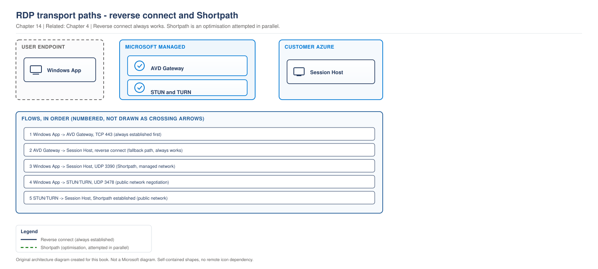
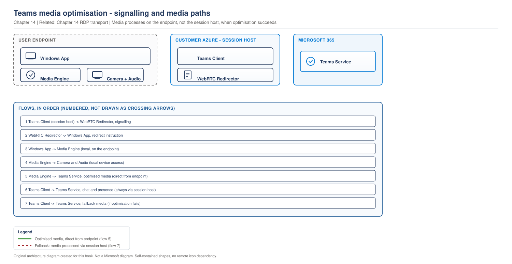

# Chapter 14 - Protocol Optimisation and Network Performance

> **Book:** Azure Virtual Desktop - Architect to Hands-on Implementation
> **Part III:** Network Architecture
> **Technical baseline:** August 2026

---

## Chapter Information

| Item | Detail |
|---|---|
| **Chapter number** | 14 |
| **Objective** | Get the best protocol path for each user population, estimate bandwidth defensibly, and diagnose a slow session properly |
| **Prerequisites** | Chapters 1 to 13 |
| **Dependencies** | Extends the transport negotiation in [Chapter 4](ch04-connection-flow-end-to-end.md) and the egress rules in [Chapter 13](ch13-hybrid-connectivity-egress-control.md) |
| **Estimated lab time** | No dedicated performance lab; use the validation checks after Lab 10 |
| **Azure resources required** | None |
| **Cost** | $0.00 for the chapter. Bandwidth and egress cost discussed in section 4 |

---

## What You Will Learn

- How the transport is actually chosen, and what happens when UDP is unavailable
- QoS for RDP Shortpath, and the limitation that makes it only work one way
- How to estimate bandwidth without inventing numbers
- Teams media optimisation, including the deprecation you need to plan for now
- Three production scenarios covering slow sessions, Teams quality and bandwidth cost

---

## Why This Matters

"AVD feels slow" is the hardest ticket in this book, because it has at least four unrelated causes: the transport, the network path, the session host, and the profile. People usually guess.

This chapter gives you the protocol half. [Project 07](../scenarios/project-07-call-centre-high-density.md) covers the host-density half, and [Project 15](../scenarios/project-15-production-troubleshooting.md) puts them together into a decomposition method (the 10-layer isolation method).

---

## 1. How the Transport Is Chosen

[Chapter 4](ch04-connection-flow-end-to-end.md#4-rdp-shortpath) covered the mechanics. This is the decision path and what it means for design.

> **OUR ORIGINAL ARCHITECTURE DIAGRAM.** Based on Microsoft's documented transport and media optimisation behaviour.

> **OUR ORIGINAL ARCHITECTURE DIAGRAM.** Created for this book. Not a Microsoft diagram.
> Editable source: [`ch14-rdp-transport-selection.drawio`](../diagrams/architecture/ch14-rdp-transport-selection.drawio)



### What this diagram shows

Three layers: the client, the Microsoft managed service, and your virtual network. The heavy arrows are the connection that always happens. The thinner arrows are the optimisation attempts that run alongside it.

The important reading is that UDP is an upgrade, not a requirement. A session with no UDP path still works. It just degrades badly under packet loss, which is exactly what home and mobile networks produce.

### Step by step flow

1. Every connection begins as TCP reverse connect through the gateway. This is not optional and not skipped.
2. Client and session host exchange capabilities. The host sends its IPv4 and IPv6 addresses to the client.
3. Three UDP attempts run in parallel. Managed network on UDP 3390 direct to the host, public network through ICE and STUN, and TURN relay when a direct path cannot be established. Microsoft notes that Azure Virtual Desktop uses STUN servers provided by Azure Communication Services and Microsoft Teams, and that each RDP session uses a dynamically assigned UDP port from an ephemeral port range, 49152 to 65535 by default.
4. If none succeed, the session stays on TCP. Microsoft is explicit: if a firewall on your network blocks UDP traffic, RDP Shortpath will fail and the connection will fall back to TCP-based reverse connect transport.

### Architect's interpretation

The reason this matters is that failure here is invisible. Nothing errors. Users just describe the session as laggy, and the helpdesk cannot reproduce it from the office where the UDP path works.

Microsoft's own recommendation for public networks is pragmatic: by the nature of the feature, outbound connectivity from the session hosts to the client is required. Unfortunately, you can't predict where your users are located in most cases. Therefore, we recommend allowing outbound UDP connectivity from your session hosts to the internet. To reduce the number of ports required, you can limit the port range used by clients for the UDP flow.

That last sentence is the compromise to offer a security team that objects to broad outbound UDP. Narrow the client port range rather than blocking the protocol.

### Important design decisions

- **Allow outbound UDP 3478 from session hosts.** This is the single highest impact network setting for perceived performance. See [Chapter 13](ch13-hybrid-connectivity-egress-control.md).
- **Enable the UDP listener on managed networks** where you have ExpressRoute or VPN and a controlled client estate. Port 3390 by default.
- **Do not rely on TURN as the design.** It works and it is a relay, so it adds a hop. Direct UDP is the goal.
- **Test from a real user network.** An office test proves nothing about home users.

### Failure points

| Point | Symptom | First check |
|---|---|---|
| Outbound UDP 3478 blocked | Sessions work, feel laggy, worst for remote users | Client connection information, transport should be UDP |
| UDP 3390 blocked or listener disabled | Managed network users get no direct path | NSG, Windows Firewall on the host, listener configuration |
| Client ephemeral range blocked | Public network Shortpath fails | Client side firewall, range 49152 to 65535 |
| Both fail | Session on TCP, poor under packet loss | Expected fallback, not a fault. Fix the UDP path |

**Official Microsoft reference:** https://learn.microsoft.com/en-us/azure/virtual-desktop/rdp-shortpath

`CURRENCY FLAG - verified August 2026. TURN relay coverage expanded during 2025, and RDP Shortpath over Private Link reached general availability in February 2026 with explicit opt in. [VERIFY BEFORE IMPLEMENTATION] confirm current regional coverage and Private Link support before designing around either.`

---

## 2. QoS, and the Limitation That Matters

You can prioritise RDP traffic with QoS, but only on one transport.

Microsoft's guidance is direct: make sure that RDP Shortpath for managed networks is enabled. Throttle rate-limiting are not supported for reverse connect transport.

So QoS and rate limiting apply to the managed network UDP path, not to TCP reverse connect. If your users are on TCP, there is nothing to prioritise, because the traffic is inside a websocket to the gateway and your network cannot distinguish it.

The policy Microsoft documents matches on the source port:

```powershell
New-NetQosPolicy -Name "RDP Shortpath for managed networks" `
  -AppPathNameMatchCondition "svchost.exe" `
  -IPProtocolMatchCondition UDP `
  -IPSrcPortStartMatchCondition 3390 `
  -IPSrcPortEndMatchCondition 3390 `
  -ThrottleRateActionBitsPerSecond 10mb `
  -NetworkProfile All
```

**What this does:** creates a QoS policy matching UDP traffic sourced from port 3390 and applies a rate limit.
**Prerequisites:** RDP Shortpath for managed networks enabled with the UDP listener on 3390.
**Expected result:** the policy appears in `Get-NetQosPolicy`. It takes effect after Group Policy refresh if deployed through GPO.
**Common error:** applying this where users are actually on public network Shortpath or TCP. The policy matches nothing and the engineer concludes QoS is broken.

**Architect's note.** QoS on the DSCP side needs your network to honour the markings. In Azure that is limited. This is mostly useful on the on-premises side of an ExpressRoute path, where you control the network equipment.

---

## 3. Estimating Bandwidth

Do not invent a number. Microsoft publishes a bandwidth requirements page with estimation tables, and the honest answer to "how much bandwidth per user" is that it depends on what the user does.

The reason is the protocol design: RDP multiplexes multiple Dynamic Virtual Channels into a single data channel sent over different network transports. There are separate DVCs for remote graphics, input, device redirection, printing and more. The amount of the data sent over RDP depends on the user activity. For example, a user may work with basic textual content for most of the session and consume minimal bandwidth, but then generate a printout of a 200-page document to the local printer.

And: depending on the use case, availability of computing resources and network bandwidth, RDP dynamically adjusts various parameters to deliver the best user experience.

### The method

1. Start from Microsoft's estimation table for the activities your personas actually perform.
2. Multiply by concurrent users per site, not total users.
3. Add headroom for the peaks that are not in the table, such as printing and file transfer.
4. Measure during pilot and correct the model.
5. Re-measure after an application change.

### What drives it in practice

| Driver | Effect |
|---|---|
| Screen resolution and monitor count | The largest single factor for graphics traffic |
| Video and animation content | Far above text work |
| Printing | Spiky. One large print job dwarfs a day of typing |
| Drive redirection and file transfer | Directly proportional to what users move |
| Teams without media optimisation | Very high. See section 4 |

**The design consequence.** Bandwidth per user is a site question. A call centre of 600 agents on two monitors in one building has a very different requirement from 600 home workers. Size the site link, not the average.

**Official Microsoft reference:** https://learn.microsoft.com/en-us/azure/virtual-desktop/rdp-bandwidth

---

## 4. Teams Media Optimisation

This is the highest impact optimisation in AVD, and it has a deprecation you need to plan for.

### What optimisation does

Without it, Teams audio and video are processed on the session host and streamed to the user through RDP. That consumes session host CPU and pushes media through the protocol.

With it, media is redirected to the endpoint. The Teams client on the session host handles signalling, and the media path runs from the endpoint directly to the Teams service or to the other participant. The session host stops doing the encoding.

> **OUR ORIGINAL ARCHITECTURE DIAGRAM.** Based on Microsoft's documented transport and media optimisation behaviour.

> **OUR ORIGINAL ARCHITECTURE DIAGRAM.** Created for this book. Not a Microsoft diagram.
> Editable source: [`ch14-teams-media-optimisation.drawio`](../diagrams/architecture/ch14-teams-media-optimisation.drawio)



### What this diagram shows

Three layers: the endpoint, the session host, and the Microsoft 365 service. The heavy arrow is the optimised media path, which bypasses the session host entirely. The dotted arrow is what happens when optimisation is not working, and it is the state you are trying to avoid.

### Step by step flow

1. The Teams client on the session host handles signalling and the interface.
2. The registry value tells Teams it is running in an AVD environment. Microsoft's configuration is `IsWVDEnvironment` as a DWORD with value 1 under `HKEY_LOCAL_MACHINE\SOFTWARE\Microsoft\Teams`.
3. The WebRTC Redirector Service, installed on each session host, redirects the media stream to the client.
4. The endpoint does the encoding, decoding and encryption, using the local camera, microphone and speakers.
5. Media travels from the endpoint to the Teams service directly. The session host is not in the media path.
6. If optimisation fails, everything falls back to server side rendering on the virtual machine.

### Architect's interpretation

Two things follow, and both are frequently missed.

**Redirection changes your sizing.** A host pool sized with optimisation working will not cope if optimisation silently stops. Microsoft is blunt about the fallback: if Teams fails to optimize, it will fall back to server-side rendering, that is, all multimedia is processed on the virtual machine, degrading the user experience.

**Device redirection is not needed when optimisation works.** Microsoft states: enabling device redirections isn't required when using Teams with media optimization. If you're using Teams without media optimization, set the following RDP properties to enable microphone and camera redirection: audiocapturemode:i:1 enables audio capture from the local device and redirects audio applications in the remote session. Enabling camera and microphone redirection anyway is a common mistake that adds protocol traffic for no benefit.

### Important design decisions

- **Optimisation is a build standard, not an option.** Put the registry value and the redirector service in the image.
- **Monitor that it is actually working.** Silent fallback to server side rendering looks like a capacity problem.
- **Do not enable camera and microphone redirection when optimisation is in use.**
- **Plan for the deprecation below.**

### Failure points

| Point | Symptom | First check |
|---|---|---|
| Registry value missing | Optimisation never engages | `IsWVDEnvironment` under HKLM Teams |
| Redirector service missing or outdated | Optimisation drops after a client or Teams update | Service present and version current on the host |
| Client platform unsupported | Some users optimised, some not | Client platform and version |
| Silent fallback | High host CPU during calls, poor quality | Teams call health, host CPU during meetings |

`CURRENCY FLAG - verified August 2026. This is a real deadline, not a theoretical one.` Microsoft has announced the retirement of the current WebRTC based optimisation: the WebRTC-based optimization for Windows-based endpoints connecting to Citrix and Azure Virtual Desktop and Windows 365 environments will be deprecated, and the new optimization becomes the default mode. End of Support October 1st, 2026: WebRTC-based optimization will continue to work, but it is no longer officially supported by Microsoft and Citrix when connecting from Windows endpoints. Two months before this milestone, users will see dismissible dialogues upon application launch time alerting about the upcoming change. End of Availability April 1st, 2027: WebRTC stops working; the new optimization is enforced.

**What to do about it now.** Two dates matter. October 2026 is when support ends and users start seeing dialogues, which generates helpdesk volume whether or not anything is broken. April 2027 is when it stops working and unoptimised calls fall back to server side rendering, which is a capacity event as well as an experience one.

Treat this like the client migration in [Chapter 6](ch06-clients-and-the-endpoint-story.md). Inventory, pilot by persona, migrate in waves, and do it before the dialogues appear rather than after.

**Official Microsoft reference:** https://learn.microsoft.com/en-us/azure/virtual-desktop/teams-on-avd

---

## 5. Latency

Microsoft's Well-Architected guidance for AVD states the requirement plainly: Azure Virtual Desktop requires real-time, low-latency network connectivity to deliver a seamless user experience. High latency or jitter can result in lag, screen tearing, or slow input response. You should validate that latency and bandwidth meet requirements in development, testing, and proof-of-concept environments. Always consider the actual user experience, including network conditions, end-user devices, and session host configuration.

Two design points follow.

**Region selection is a latency decision.** Put session hosts near users, not near the IT team or the existing subscription. For a multi-region estate this is the primary driver of region choice, ahead of cost.

**Latency is not the only thing.** Microsoft notes that latency is only one aspect of remote connectivity. Network throughput and user workload also affect the end-user experience. A low latency link to an overloaded host still feels slow.

---

## 6. Production Scenarios

### Scenario 1: Home workers report lag, office workers do not

**Problem.** A 1,200 user deployment. Office users are happy. Home users describe typing lag and slow scrolling. The helpdesk cannot reproduce it.

**Symptoms.** No errors. No disconnections. Only remote users. Worse on video calls and when scrolling documents.

**Initial hypothesis.** Public network RDP Shortpath is not establishing, so remote sessions are on TCP reverse connect, which handles packet loss badly. Office users are on the managed network path or on a clean link, so they do not see it.

**Investigation.**

Ask an affected user to open the client connection information and report the transport. That single data point separates a protocol problem from a host problem.

Then check the egress rules for outbound UDP:

```bash
az network nsg rule list \
  --resource-group rg-avd-network-lab-eus2-01 \
  --nsg-name nsg-hosts-lab-eus2-01 \
  --query "[?protocol=='Udp']" -o table
```

Then check whether the client side allows the ephemeral range 49152 to 65535.

**Evidence.** Client reports TCP. No outbound UDP 3478 rule exists on the session host subnet.

**Root cause.** Outbound UDP was never allowed. Shortpath has never worked for public network users, and because sessions still function nobody raised it as a fault.

**Fix.** Add the outbound UDP 3478 rule. See [Lab 3](../labs/lab-03-vnet-subnets-nsg-dns.md). If the security team objects to broad outbound UDP, offer the documented compromise of narrowing the client port range rather than blocking the protocol.

**Validation.** An affected user reconnects and the client now reports UDP. Test with two users on different home ISPs, not from the office.

**Prevention.** Add transport type to the monitoring dashboard so a drop in UDP usage is visible. Document the UDP 3478 rule with a comment explaining what breaks without it.

**Architect's lesson.** Perceived performance problems with no errors are usually transport. Check the transport before you touch host sizing.

**Interview lesson.** Leading with the transport check rather than host sizing marks the answer as experienced.

### Scenario 2: Teams calls degrade after an update

**Problem.** Teams call quality drops across a call centre. Session host CPU rises sharply during meetings. Nothing was changed in AVD.

**Symptoms.** Poor audio and video. High CPU on hosts during call hours. Chat and presence are fine.

**Business impact.** Call quality problems for a call centre, which affects customer conversations directly, plus host CPU rising into a capacity problem.

**Initial hypothesis.** Media optimisation has stopped engaging and calls have fallen back to server side rendering. That matches high host CPU exactly, because the virtual machine is now doing work the endpoint used to do.

**Investigation.**

On an affected host:

```bash
az vm run-command invoke -g rg-avd-hosts-lab-eus2-01 -n <vm> \
  --command-id RunPowerShellScript \
  --scripts "Get-ItemProperty 'HKLM:\SOFTWARE\Microsoft\Teams' -Name IsWVDEnvironment -ErrorAction SilentlyContinue; Get-Service | Where-Object { \$_.DisplayName -like '*WebRTC*' } | Select-Object Name, DisplayName, Status"
```

Then compare host CPU during call hours against the previous month, and check client versions across affected users.

**Evidence.** The registry value is present. The redirector service is present but at an older version than the current Teams client expects, or missing on hosts built from an older image.

**Root cause.** Hosts built from an image that predates the current redirector version. Optimisation stopped engaging after a Teams client update, and the fallback is silent.

**Fix.** Update the WebRTC Redirector Service on affected hosts and update the golden image so new hosts are correct. See [Chapter 23](ch23-golden-image-engineering.md).

**Validation.** A test call on a fixed host shows optimisation engaged and host CPU stays low during the call. Compare against an unfixed host in the same window.

**Prevention.** Add redirector service presence and version to the post build validation for every session host. Alert on host CPU during known call hours, because that is the signal that optimisation has stopped working.

**Architect's lesson.** Silent fallback is the dangerous pattern. A feature that degrades instead of failing needs active monitoring, because nobody will report it as broken.

**Interview lesson.** Explaining that you monitor host CPU during call hours as the signal for a Teams problem is a detail interviewers remember.

### Scenario 3: The egress bill nobody expected

**Problem.** A 2,000 user deployment sees a growing Azure egress charge. Performance is fine.

**Symptoms.** Cost only. Rising with user adoption. No complaints from users.

**Business impact.** A growing cost line with no performance symptom, which means nobody investigates it until finance asks.

**Initial hypothesis.** RDP traffic to users leaves Azure and is billed as egress. Multi monitor, high resolution and video heavy work all increase it, and so does Shortpath, since direct UDP still leaves Azure.

**Investigation.** *Azure portal > Cost Management > Cost analysis*, grouped by meter, filtered to bandwidth. Correlate against concurrent user counts and personas.

Then check the RDP properties in use, particularly resolution and monitor settings:

```powershell
(Get-AzWvdHostPool -ResourceGroupName rg-avd-service-lab-eus2-01 -Name hp-avd-lab-eus2-01).CustomRdpProperty
```

**Evidence.** Egress tracks concurrent sessions. The design allows unlimited monitors at full resolution for every persona, including task workers who do not need it.

**Root cause.** A generous default applied to every persona rather than to the personas that need it.

**Fix.** Set RDP properties per persona. Task workers do not need four monitors at maximum resolution. Remember that `CustomRdpProperty` overwrites rather than merges, so read the current value first. See [Chapter 8](ch08-authentication-flows-in-detail.md#2-single-sign-on-with-entra-authentication).

**Validation.** Egress per concurrent user falls, with no increase in complaints from the affected personas. If complaints rise, the setting was too aggressive and should be relaxed for that group.

**Prevention.** Set RDP properties per persona at design time and model egress in the cost model. See [Project 03](../scenarios/project-03-global-enterprise-governance.md), where cost governance at scale is worked through in full.

**Architect's lesson.** Protocol settings have a bill attached. Defaults that are generous for engineers are expensive when applied to 1,400 task workers.

**Interview lesson.** Connecting an RDP property to an egress charge shows you think about cost as an architecture output.

---

## 7. The Architect's Four Questions

**What do I check first?** The transport in use, from the client connection information. It takes seconds and it separates protocol problems from host problems, which are the two things people confuse.

**What can I safely change now?** Adding an outbound UDP rule. Reading RDP properties. Checking the redirector service on one host. Testing from a client.

**What must not be changed blindly?**
- `CustomRdpProperty` on a production host pool. It overwrites, and it affects every user at their next connection.
- Removing outbound UDP. It degrades every remote session silently.
- Applying QoS policies without confirming which transport users are actually on.
- Changing resolution and monitor limits without telling the affected personas.

**When do I escalate to Microsoft?** When UDP is confirmed allowed end to end, the client still reports TCP, and you can reproduce it on a clean network. Collect: the client connection information showing the transport, client version and platform, the session host NSG and firewall rules, effective routes, region, and UTC timestamps. For Teams, add the redirector service version, the Teams client version and a call ID.

---

## 8. Common Mistakes

- Treating a slow session as a sizing problem before checking the transport.
- Blocking outbound UDP, then investigating host performance for a week.
- Applying QoS where users are on TCP reverse connect, which cannot be prioritised or rate limited.
- Enabling camera and microphone redirection while Teams media optimisation is in use.
- Sizing host pools assuming optimisation always works, with no monitoring for the fallback.
- Quoting a bandwidth per user figure without measuring.
- Applying generous RDP properties to every persona and paying for it in egress.
- Testing remote user experience from the office.
- Ignoring the WebRTC optimisation retirement dates.

---

## 9. Interview Preparation

### Q38. Users say AVD is slow. How do you approach it?

**Simple answer**
Find out which layer is slow before changing anything. Check the transport in the client first, then host resource use, then profile and logon time. They have different fixes.

**Strong senior architect answer**
"I would separate perceived lag from actual slowness. First the transport, because the client shows whether the session is on UDP or TCP, and if it is on TCP for a remote user then Shortpath is not establishing and that is usually outbound UDP being blocked. That is a five second check and it explains a lot of 'AVD feels slow' tickets. If the transport is fine, I would look at host CPU and memory during the complaint window, because density problems present the same way to a user. Then logon time separately, because slow logon is a profile and identity problem, not a protocol one. The mistake I would avoid is resizing hosts first. That is expensive, slow, and often fixes nothing."

**Follow-up you should expect**
"How would you know Shortpath stopped working?" You would not, unless you monitor it. There is no error. Add transport type to the dashboard so a drop in UDP usage is visible.

### Q39. Explain Teams media optimisation and why it matters.

**30 second answer**
"Without it, the session host encodes and decodes all the audio and video, which burns CPU and pushes media through RDP. With it, media is redirected to the endpoint and the host only handles signalling. It needs a registry value and the WebRTC Redirector Service on each session host. It is the difference between a call centre host pool that copes and one that does not."

**2 minute answer**
Add the two things people miss. First, device redirection is not needed when optimisation works, and enabling camera and microphone redirection anyway just adds protocol traffic. Second, the fallback is silent. If optimisation stops engaging, calls fall back to server side rendering on the virtual machine, which looks exactly like a capacity problem and gets fixed by adding hosts. So I monitor host CPU during call hours as the signal. Then the deprecation: the WebRTC based optimisation loses support in October 2026 and stops working in April 2027, with the new optimisation becoming the default, so that is a planned migration rather than something to discover.

**Deep dive answer**
There is a sizing consequence too. Host pool density for a call centre is calculated assuming media is redirected. If optimisation breaks after a client update, the host is suddenly doing work it was never sized for, and it happens to every host at once. So this is a capacity risk as well as an experience one, which is why the redirector version belongs in post build validation and in the golden image standard rather than being an install step someone remembers.

### Q40. How much bandwidth does an AVD user need?

**Strong answer**
"It depends on what the user does, so I would not quote a figure without measuring. RDP multiplexes separate virtual channels for graphics, input, redirection and printing, and it adapts dynamically to available bandwidth, so consumption follows activity. A user reading text uses very little, then prints a 200 page document and spikes. My method is to start from Microsoft's estimation tables for the activities each persona actually performs, multiply by concurrent users per site rather than total users, add headroom for the spiky things, then measure during pilot and correct the model. And I would size the site link rather than the average, because 600 agents on two monitors in one building is a completely different requirement from 600 home workers."

---

## 10. Key Takeaways

- Every connection starts on TCP reverse connect. UDP is an upgrade attempted in parallel.
- If no UDP path succeeds, the session falls back to TCP and still works, but handles packet loss badly.
- Microsoft recommends allowing outbound UDP from session hosts to the internet, and narrowing the client port range if you need to reduce scope.
- QoS and rate limiting apply to managed network Shortpath only. They are not supported for reverse connect transport.
- Bandwidth depends on activity. Estimate from Microsoft's tables, then measure.
- Teams media optimisation needs the registry value and the WebRTC Redirector Service on every session host.
- Device redirection is not required when optimisation is working.
- The fallback to server side rendering is silent and looks like a capacity problem.
- WebRTC based optimisation loses support on 1 October 2026 and stops working on 1 April 2027.

---

## 11. Official References

- RDP Shortpath - https://learn.microsoft.com/en-us/azure/virtual-desktop/rdp-shortpath
- Configure RDP Shortpath - https://learn.microsoft.com/en-us/azure/virtual-desktop/configure-rdp-shortpath
- RDP bandwidth requirements - https://learn.microsoft.com/en-us/azure/virtual-desktop/rdp-bandwidth
- Use Microsoft Teams on Azure Virtual Desktop - https://learn.microsoft.com/en-us/azure/virtual-desktop/teams-on-avd
- Teams for Virtualized Desktop Infrastructure - https://learn.microsoft.com/en-us/microsoftteams/teams-client-vdi-requirements-deploy
- Networking and connectivity considerations for AVD workloads - https://learn.microsoft.com/en-us/azure/well-architected/azure-virtual-desktop/networking

---

## Architect's Reality Check

**What engineers commonly get wrong.** They resize session hosts to fix perceived lag. Check the transport first, because a remote user on TCP is a network rule problem, not a compute problem.

**What I would check first in production.** The transport in the client connection information. It takes seconds and separates protocol from host issues.

**What I would ask the customer.** Whether outbound UDP is allowed, and whether Teams optimisation is confirmed working rather than assumed. Both fail silently.

**What I would decide as the architect.** Outbound UDP 3478 allowed with a documented reason, Teams optimisation as a build standard with the redirector version in post build validation, and RDP properties set per persona rather than generously for everyone.

**What I would say in an interview.** That silent degradation is the hardest class of problem, because it produces complaints without tickets, and I would explain how I detect it: transport type on a dashboard, checked as routinely as any other health signal.

---

## How This Changes With Scale

**Around 100 users.** Bandwidth and transport rarely need attention. Problems are individual and easy to reproduce.

**Around 1,000 users.** Site bandwidth becomes a sizing exercise, and a call centre on two monitors is a completely different requirement from home workers. Teams optimisation failing silently now shows up as a capacity problem.

**Around 5,000 users and beyond.** Egress cost becomes a visible line in the bill and RDP property defaults are worth tuning per persona. Protocol monitoring stops being optional, because at this size nobody will report a gradual quality change.

---

## Chapter Close

**What was completed**
Part III is finished. You can design AVD networking end to end: required connectivity, topology, egress control, and protocol optimisation.

**What you should test**
Connect to any AVD environment you have access to and find the transport in the client connection information. If you cannot find it in under a minute, learn where it is now, because it is the first check in most performance tickets.

**What comes next**
Chapter 15 opens Part IV with host pool design decisions. Pooled versus personal, load balancing, session limits, and how to derive them rather than guess them.

**Interview preparation carried forward**
Q38 is one of the most common practical questions in AVD interviews. Leading with the transport check, rather than with resizing, is what marks the answer as experienced.
