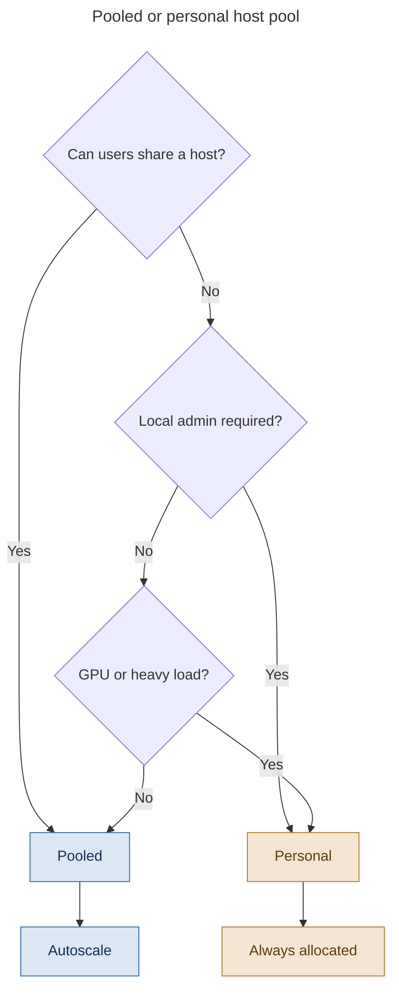
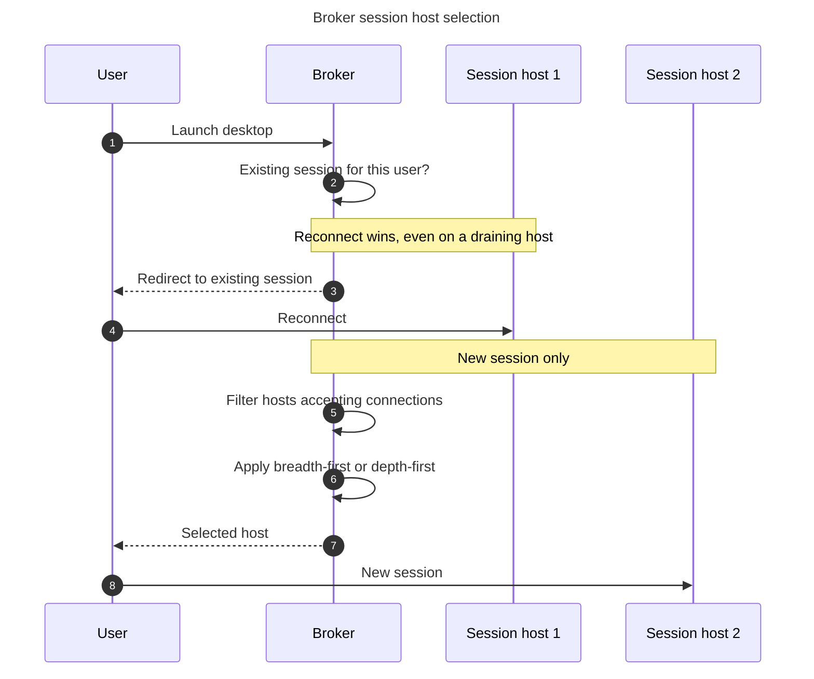

# Chapter 15 - Host Pool Design Decisions

> **Book:** Azure Virtual Desktop - Architect to Hands-on Implementation
> **Part IV:** Host Pool and Session Host Architecture
> **Technical baseline:** August 2026

---

## Chapter Information

| Item | Detail |
|---|---|
| **Chapter number** | 15 |
| **Objective** | Decide how many host pools an estate needs, choose pooled or personal, and set load balancing and session limits from reasoning rather than defaults |
| **Prerequisites** | Chapters 1 to 14. Labs 1 to 4 complete |
| **Dependencies** | Uses the object model from [Chapter 3](ch03-avd-object-model.md), the OS choice from [Chapter 5](ch05-operating-systems-multisession-licensing.md) and the subnet sizing from [Chapter 12](ch12-enterprise-topologies-ip-planning.md) |
| **Estimated lab time** | Host pool creation is in Lab 7 |
| **Azure resources required** | None for the chapter |
| **Cost** | $0.00 for the chapter. Host pool design is the biggest single driver of AVD compute cost |

---

## What You Will Learn

- Pooled or personal, decided from requirements rather than habit
- How the broker actually chooses a session host, including the reconnect behaviour people find surprising
- Breadth-first and depth-first, and the setting that silently overrides your choice
- Why depth-first without a correct session limit is worse than doing nothing
- How many host pools an estate really needs
- Three production scenarios with exact commands

---

## Why This Matters

Host pool design decides your compute bill, your user experience and your operational load. It is also close to irreversible. As established in [Chapter 3](ch03-avd-object-model.md#3-the-cardinality-rules), the host pool type cannot be changed after creation.

The default answers in the portal are reasonable and almost never optimal. This chapter is about choosing deliberately.

---

## 1. Pooled or Personal



> Decision flow diagram. It uses the reduced explanation set defined in the [diagram standard](../DIAGRAM-STANDARD.md).

**What this diagram shows.** Three questions, in priority order. Sharing is the first question because it is where AVD's economics come from. Everything else is a reason not to share.

**Step by step.** If users can share a machine, pooled. If they cannot, find out why. Local admin rights or software that must persist between sessions means personal. A GPU workload or a user who can saturate a host alone also means personal. If none of those apply, go back to pooled, because "the users would prefer their own machine" is a preference, not a requirement.

**Architect's interpretation.** Personal host pools are not wrong, they are expensive. Each user's virtual machine is allocated whether they are working or not, which removes the autoscaling saving that justifies AVD in the first place. For a persona that genuinely needs personal desktops, compare against Windows 365 before committing, because at 1:1 the simplicity argument gets strong. See [Chapter 1](ch01-what-avd-actually-is.md#6-avd-vs-windows-365-vs-citrix-daas-vs-on-premises-vdi).

**Official Microsoft reference:** https://learn.microsoft.com/en-us/azure/virtual-desktop/terminology

### Personal assignment types

Personal host pools assign a user to a specific virtual machine. Microsoft's deployment guidance shows the two types set at creation, with `PersonalDesktopAssignmentType` as `Automatic` or `Direct`.

- **Automatic.** The first time a user connects, they are assigned the next available host and keep it.
- **Direct.** You assign the user to a specific host yourself.

Automatic suits most cases. Direct is useful when a specific machine has something a specific user needs, such as a particular GPU or a locally licensed application.

`CURRENCY FLAG - verified August 2026.` Microsoft documents additional `LoadBalancerType` values for personal host pools, `Persistent` and `MultiplePersistent`, with the second supporting multi-personal desktop assignment. `[VERIFY BEFORE IMPLEMENTATION]` confirm current availability and behaviour before designing around multi-personal assignment.

---

## 2. How the Broker Chooses a Host

Load balancing only applies to pooled host pools. Microsoft is explicit: load balancing doesn't apply to personal host pools because users always have a 1:1 mapping to a session host within the host pool.



**What this diagram shows.** Two different paths through the broker. Reconnect is checked first, and it behaves differently from a new session.

**Step by step flow.**
1. The user launches a desktop.
2. The broker checks for an existing session belonging to that user.
3. If one exists, the user is sent back to it. This happens regardless of the load balancing algorithm.
4. If there is no existing session, the broker filters to hosts that accept new connections.
5. It then applies breadth-first or depth-first to choose among them.

**Architect's interpretation.** The reconnect path is the behaviour that surprises people. Microsoft documents it clearly: if a user already has a session in the host pool and is reconnecting to that session, the load balancer will successfully redirect them to the session host with their existing session. This behavior applies even if that session host's AllowNewConnections property is set to False.

That is why drain mode does not empty a host. It stops new sessions, but users with disconnected sessions keep coming back. Draining a host for maintenance means waiting for those users to sign out properly, or signing them out yourself. Plan maintenance windows around that.

**Important design decisions.**
- **Drain mode is not eviction.** Build maintenance runbooks that account for reconnects. See [Project 02](../scenarios/project-02-enterprise-850-users.md) and [Project 15](../scenarios/project-15-production-troubleshooting.md), where day-2 operations are worked through in full.
- **Session limit is per host pool, not per host.** It applies to every host in the pool.
- **Algorithm is set per host pool.** Microsoft notes you can only configure one of the load balancing algorithms at a time per pooled host pool.

**Interview lesson.** This is documented behaviour few candidates know, and it explains why maintenance runbooks stall.

**Failure points.**

| Point | Symptom | First check |
|---|---|---|
| All hosts draining | "No resources available" | `AllowNewSession` across the pool |
| Session limit reached everywhere | Same symptom, hosts healthy | Session count against the limit |
| Reconnect to a draining host | Maintenance never completes | Active and disconnected sessions on the host |
| Uneven distribution | Some hosts hot, others idle | Algorithm in use, and whether a scaling plan is overriding it |

**Official Microsoft reference:** https://learn.microsoft.com/en-us/azure/virtual-desktop/configure-host-pool-load-balancing

---

## 3. Breadth-first and Depth-first

Two algorithms, two different goals.

**Breadth-first** spreads sessions. Microsoft describes it as aiming to evenly distribute new user sessions across the session hosts in a host pool, and adds a detail that matters: you don't have to specify a maximum session limit for the number of sessions.

**Depth-first** fills hosts one at a time. It keeps starting new user sessions on one session host until the maximum session limit is reached. Once the session limit is reached, any new user connections are directed to the next session host in the host pool until it reaches its session limit, and so on.

The selection logic, from Microsoft's documentation of the behaviour: breadth-first first queries session hosts that allow new connections, then selects the session host with the least number of sessions. If there is a tie, the method selects the first session host in the query. Depth-first first queries session hosts that allow new connections and haven't gone over their maximum session limit, then selects the session host with highest number of sessions.

### Which to use

Microsoft's Well-Architected guidance gives a nuanced answer rather than a fixed one: breadth-first load balancing distributes user sessions across session hosts. Users are assigned to the session host that has the lowest usage, which can improve the user experience. Depth-first load balancing saturates one session host at a time before assigning user sessions to other session hosts, which ensures efficient use of resources. This approach is particularly cost-effective, because it fully uses the capacity of a single host before allocating users to the next session host. Depth-first load balancing is especially beneficial in scale-down scenarios.

And the pattern it recommends: use a breadth-first approach during your ramp-up period to avoid excessive sign-ins that might overwhelm a session host because of users starting their workday. Then, shift to a depth-first approach during peak, ramp-down, and off-peak hours.

So the honest answer to "breadth-first or depth-first" is "both, at different times of day", and that is what scaling plans do. See [Project 07](../scenarios/project-07-call-centre-high-density.md), where scaling plans are worked through in full.

### The trap with depth-first

Depth-first depends entirely on the maximum session limit being correct. Breadth-first does not require one at all.

If you set depth-first and leave the session limit at a default that does not reflect the host's real capacity, the algorithm keeps packing users onto a host past the point where it performs well. You get worse performance and none of the cost saving, because the hosts you hoped to switch off are still needed once users complain.

This is the practical version of the density point from [Chapter 5](ch05-operating-systems-multisession-licensing.md#3-density-what-actually-determines-it). Depth-first turns a measured number into a hard operational dependency. Measure it before you enable depth-first.

### Setting it

```bash
# Breadth-first, no session limit change
az desktopvirtualization hostpool update \
  --resource-group rg-avd-service-lab-eus2-01 \
  --name hp-avd-lab-eus2-01 \
  --load-balancer-type BreadthFirst
```

```powershell
# Depth-first with an explicit, measured session limit
Update-AzWvdHostPool `
  -ResourceGroupName rg-avd-service-lab-eus2-01 `
  -Name hp-avd-lab-eus2-01 `
  -LoadBalancerType DepthFirst `
  -MaxSessionLimit 10
```

**What this does:** changes how the broker selects hosts for new sessions.
**Expected result:** the host pool properties reflect the new algorithm. Existing sessions are unaffected.
**Common error:** setting depth-first without setting `MaxSessionLimit` in the same change. Always set both together.

Creating a host pool with these properties, following Microsoft's documented parameters:

```powershell
$parameters = @{
    Name                  = 'hp-task-prd-eus2-01'
    ResourceGroupName     = 'rg-avd-service-prd-eus2-01'
    HostPoolType          = 'Pooled'
    LoadBalancerType      = 'BreadthFirst'
    PreferredAppGroupType = 'Desktop'
    MaxSessionLimit       = 10
    Location              = 'eastus2'
}
New-AzWvdHostPool @parameters
```

Preferred application group type is covered in [Chapter 3](ch03-avd-object-model.md#4-preferred-application-group-type). It must be set at creation.

---

## 4. How Many Host Pools

The most common design mistake in AVD is building host pools around the org chart.

**Build a separate host pool when:**

| Reason | Example |
|---|---|
| Different sizing | Task workers and developers cannot share a VM size sensibly |
| Different OS | Windows Server for one application |
| Security or compliance isolation | Regulated data that must not share a host |
| Different image | GPU drivers, or an application set that conflicts |
| Different region | Users in a different geography |
| Different assignment model | Pooled for most, personal for engineers |

**Do not build a separate host pool because:**

- A department asked for one
- Someone wants "their own capacity"
- It feels tidier

Every host pool has a capacity floor. Even at low usage you need enough hosts to serve the users who are online, and autoscaling cannot go below one available host without users failing to connect. Ten small host pools cost more than three right-sized ones, and they multiply your image, monitoring and patching work by ten.

**Interview lesson.** Answering a host pool count question with criteria rather than a number shows design thinking.

### Northwind applied

From the persona list in [Chapter 1](ch01-what-avd-actually-is.md#4-meet-the-capstone-customer-northwind-global-manufacturing), and consistent with the object model in [Chapter 3](ch03-avd-object-model.md#6-designing-the-object-model-for-northwind):

| Host pool | Type | Users | Algorithm | Reason |
|---|---|---|---|---|
| `hp-task-prd-eus2-01` | Pooled | 1,400 | Breadth-first ramp-up, depth-first off-peak | Density is the business case |
| `hp-know-prd-eus2-01` | Pooled | 1,200 | Same | Includes executives. 100 users do not justify their own floor |
| `hp-fin-prd-eus2-01` | Pooled | 250 | Breadth-first | Isolation is a compliance requirement |
| `hp-cad-prd-eus2-01` | Personal | 180 | Not applicable | GPU, large working sets |
| `hp-dev-prd-eus2-01` | Personal | 170 | Not applicable | Local admin |

Five pools, not six, because executives join the knowledge worker pool. Duplicated in West Europe for Amsterdam users, with its own workspace as required by the location rule in [Chapter 3](ch03-avd-object-model.md#the-location-rule).

---

## 5. Production Scenarios

### Scenario 1: Depth-first made everything slower and saved nothing

**Problem.** A cost reduction exercise switches a 900 user pool from breadth-first to depth-first. Within a week, complaints about slow sessions triple. The compute bill is unchanged.

**Symptoms.** Some users fine, some very slow. The slow users are clustered on a few hosts. Other hosts sit almost idle. No errors.

**Business impact.** Complaints triple across 900 users while the expected saving never appears, so the change costs experience and delivers nothing.

**Initial hypothesis.** Depth-first is filling hosts to a session limit that does not reflect real capacity, so early hosts are overloaded while later ones stay empty.

**Investigation.**

```powershell
Get-AzWvdHostPool -ResourceGroupName rg-avd-service-lab-eus2-01 -Name hp-avd-lab-eus2-01 |
  Select-Object Name, LoadBalancerType, MaxSessionLimit
```

```powershell
Get-AzWvdSessionHost -ResourceGroupName rg-avd-service-lab-eus2-01 -HostPoolName hp-avd-lab-eus2-01 |
  Select-Object Name, Status, Session, AllowNewSession |
  Sort-Object Session -Descending
```

Then compare CPU and memory on the busiest hosts against the idle ones during the complaint window.

**Evidence.** `MaxSessionLimit` is at a value nobody measured. The top hosts are at that limit with high CPU. Hosts further down the list have almost no sessions.

**Root cause.** Depth-first was enabled without setting a measured session limit. The algorithm did exactly what it was told.

**Fix.** Set the session limit from measurement, not from the default. Reduce it, apply, and let new sessions redistribute. Existing sessions stay where they are, so improvement is gradual rather than immediate. Say that to the business before they ask.

```powershell
Update-AzWvdHostPool -ResourceGroupName rg-avd-service-lab-eus2-01 `
  -Name hp-avd-lab-eus2-01 -MaxSessionLimit 8
```

**Validation.** CPU on the busiest hosts stays within target across a full working day, and session counts spread as users sign in the next morning. Not the same afternoon.

**Prevention.** Measure density before changing the algorithm. Alert on sustained host CPU rather than only on availability. Treat load balancing changes as a change requiring the same review as a host pool change, because they affect every user.

**Architect's lesson.** Depth-first is a cost optimisation that depends on a measured number. Without the measurement it is just overloading hosts in a fixed order.

**Interview lesson.** Saying depth first without a measured limit is just overloading hosts in a fixed order is a line that lands.

### Scenario 2: Maintenance never finishes

**Problem.** An operations team drains four hosts on Friday afternoon for an image replacement. On Monday the hosts still have users on them.

**Symptoms.** Drain mode is on. Session count is not going down. Users are connecting to the draining hosts.

**Business impact.** A planned maintenance window fails to complete, so the image replacement slips and the change has to be rescheduled.

**Initial hypothesis.** Users with disconnected sessions are reconnecting. Drain mode blocks new sessions, not reconnects.

**Investigation.**

```powershell
Get-AzWvdUserSession -ResourceGroupName rg-avd-service-lab-eus2-01 `
  -HostPoolName hp-avd-lab-eus2-01 |
  Select-Object UserPrincipalName, SessionState, Name
```

Look at how many sessions are Disconnected rather than Active. Those are the ones coming back.

**Evidence.** The draining hosts hold disconnected sessions. Each morning those users reconnect to the same host, exactly as documented.

**Root cause.** The runbook assumed drain mode empties a host. It does not.

**Fix.** Message the affected users, then sign out the disconnected sessions.

```powershell
# Message first
Send-AzWvdUserSessionMessage -ResourceGroupName rg-avd-service-lab-eus2-01 `
  -HostPoolName hp-avd-lab-eus2-01 -SessionHostName <host.fqdn> -UserSessionId <id> `
  -MessageTitle "Maintenance" -MessageBody "Please save your work and sign out."

# Then sign out
Remove-AzWvdUserSession -ResourceGroupName rg-avd-service-lab-eus2-01 `
  -HostPoolName hp-avd-lab-eus2-01 -SessionHostName <host.fqdn> -Id <id>
```

Signing users out loses unsaved work. Message first, wait, then act. This belongs in the "do not change blindly" category.

**Validation.** Session count on the draining hosts reaches zero and stays there. Confirm the next morning, because that is when reconnects would appear.

**Prevention.** Add a disconnected session check to the maintenance runbook. Set a sign-out policy for disconnected sessions so they do not persist indefinitely. Schedule maintenance with a defined drain window and an explicit sign-out step rather than hoping hosts empty on their own.

**Architect's lesson.** Drain mode is not eviction. Any runbook that assumes it is will stall, and the stall is discovered on the day of the change.

### Scenario 3: Ten host pools nobody can operate

**Problem.** A 1,500 user estate has eleven host pools, one per department. Costs are 40 percent above the model and the two person team cannot keep the images current.

**Symptoms.** Several pools run three or four hosts for fewer than 60 users. Image updates take weeks because each pool is done separately. Some pools are two image versions behind.

**Business impact.** Costs 40 percent above model, and image updates taking weeks, which leaves parts of the estate running outdated images.

**Initial hypothesis.** Pools were built around the org chart rather than around sizing and isolation requirements, so the estate carries eleven capacity floors and eleven image pipelines.

**Investigation.**

```bash
az desktopvirtualization hostpool list \
  --query "[].{name:name, type:hostPoolType, lb:loadBalancerType, limit:maxSessionLimit}" -o table
```

Then count session hosts and assigned users per pool, and compare the VM size used by each.

**Evidence.** Seven of the eleven pools use the same VM size, the same image and the same security requirements. Only four have a real reason to exist: GPU, a Windows Server application, a regulated group, and developers needing local admin.

**Root cause.** Every department that asked for a pool got one.

**Fix.** Consolidate the seven into two, sized properly, keeping the four that have genuine requirements. Do it by building the new pools alongside and moving users by persona rather than migrating pools. Session hosts are disposable, so rebuilding is safer than converting.

**Validation.** Cost per user falls, image update time drops from weeks to days, and no persona loses a capability they had. Check the last part explicitly, because consolidation is where capabilities quietly disappear.

**Prevention.** Publish the criteria for a new host pool, so the answer to a departmental request is a test rather than a negotiation. Review host pool count at every design review.

**Architect's lesson.** Every host pool has a capacity floor and an operational cost. The question is never "does this group want their own pool", it is "does this group need different sizing, a different image, or isolation".

---

## 6. The Architect's Four Questions

**What do I check first?** The host pool type, the algorithm and the session limit together. Those three lines explain most performance and distribution complaints.

**What can I safely change now?** Switching a host pool from depth-first to breadth-first, which spreads new sessions and is easy to reverse. Adding a session host. Putting one host into drain mode. Reading configuration.

**What must not be changed blindly?**
- Enabling depth-first without a measured session limit.
- Reducing the session limit during working hours, which can leave users unable to connect if the pool is near capacity.
- Signing out user sessions without messaging first. Unsaved work is lost.
- Removing session hosts from a pool.
- Host pool type. It cannot be changed at all after creation.

**When do I escalate to Microsoft?** When hosts are healthy, accepting connections, under their session limit, and the broker still fails to place users. Collect: host pool configuration including type, algorithm and limit, the output of `Get-AzWvdSessionHost` showing status and session counts, the client error and correlation ID, region and UTC timestamps.

---

## 7. Common Mistakes

- Building host pools around the org chart.
- Enabling depth-first without measuring the session limit first.
- Assuming drain mode empties a host.
- Setting the load balancing algorithm and forgetting that a scaling plan may control it during parts of the day.
- Choosing personal host pools because users prefer them, without comparing against Windows 365.
- Setting the host pool type casually. It cannot be changed later.
- Forgetting to set preferred application group type at creation.
- Treating the session limit as a fixed number rather than re-measuring after application changes.

---

## 8. Interview Preparation

### Q41. Pooled or personal, and how do you decide?

**Simple answer**
Pooled unless there is a reason not to. Local admin rights, software that must persist, or a GPU workload that cannot share are the usual reasons for personal. Pooled gives multi-session density and the ability to switch capacity off, which is where AVD's cost advantage comes from.

**Strong senior architect answer**
"I start from whether users can share a machine, because that is where the economics live. If they can, pooled. If not, I want to know why, because 'users would prefer their own desktop' is a preference and 'this application needs local admin' is a requirement. Personal host pools mean the VM is allocated whether the user is working or not, so you lose the autoscaling saving. For a persona that genuinely needs 1:1, I would compare against Windows 365 before committing, because at that point the operational simplicity argument gets quite strong. And I would decide carefully, because host pool type cannot be changed after creation."

**Follow-up you should expect**
"How many host pools would you build for 3,000 users across six personas?" Fewer than six. Separate on sizing, image, OS, isolation and region. Combine where those are the same. Every pool carries a capacity floor and its own image pipeline.

### Q42. Breadth-first or depth-first?

**30 second answer**
"Both, at different times. Breadth-first during ramp-up so a wave of morning sign-ins does not overwhelm one host, then depth-first for peak and off-peak so sessions consolidate and idle hosts can be shut down. Scaling plans do this for you. And depth-first only works if the maximum session limit is a measured number."

**2 minute answer**
Explain the mechanics. Breadth-first picks the host with the fewest sessions and does not require a session limit at all. Depth-first picks the host with the most sessions that is still under the limit, which is what lets you consolidate and deallocate the rest. Then the trap: with depth-first and a default session limit, you pack hosts past their real capacity, so you get worse performance and no saving, because you end up needing the hosts you hoped to switch off. Finish with the reconnect behaviour, since it applies to both. A user with an existing session goes back to it regardless of the algorithm, and regardless of whether that host is in drain mode.

**Deep dive answer**
There is an operational consequence of the reconnect rule worth naming. Drain mode stops new sessions but not reconnects, so a maintenance runbook that drains hosts and waits will stall on disconnected sessions. That means the runbook needs a message step, a wait, and an explicit sign-out step, and a sign-out policy for disconnected sessions so they do not persist for days. Then note that a scaling plan can control the algorithm during parts of the day, so the value on the host pool is not necessarily what is in effect at any given moment. That surprises people during troubleshooting.

### Q43. A pool is unevenly loaded. What do you check?

**Strong answer**
"First the algorithm and the session limit together, because depth-first with a wrong limit produces exactly that picture, a few hot hosts and several idle ones. Then whether a scaling plan is overriding the algorithm during that part of the day. Then whether some hosts are in drain mode, because those still accept reconnects but no new sessions, which skews distribution. And I would look at when the imbalance appears. If it builds through the morning it is the algorithm. If it appears after a maintenance window, someone left hosts draining."

---

## 9. Key Takeaways

- Host pool type cannot be changed after creation. Decide deliberately.
- Load balancing applies to pooled host pools only. Personal pools are a 1:1 mapping.
- Breadth-first picks the host with the fewest sessions and needs no session limit.
- Depth-first picks the fullest host under the limit, and depends completely on that limit being measured.
- Reconnects go to the existing session regardless of algorithm, and even when the host is in drain mode.
- Drain mode is not eviction. Maintenance runbooks need a message and sign-out step.
- A scaling plan can control the algorithm during parts of the day.
- Build host pools around sizing, image, OS, isolation and region. Not around departments.

---

## 10. Official References

- Configure host pool load balancing - https://learn.microsoft.com/en-us/azure/virtual-desktop/configure-host-pool-load-balancing
- Deploy Azure Virtual Desktop - https://learn.microsoft.com/en-us/azure/virtual-desktop/deploy-azure-virtual-desktop
- Azure Virtual Desktop terminology - https://learn.microsoft.com/en-us/azure/virtual-desktop/terminology
- Application delivery considerations for AVD workloads - https://learn.microsoft.com/en-us/azure/well-architected/azure-virtual-desktop/application-delivery
- Enable multi-personal desktop assignment - https://learn.microsoft.com/en-us/azure/virtual-desktop/multi-personal-desktop-assignment

---

## Hands-on Lab

Host pool creation is in **Lab 7**. The required lab uses standard host-pool management.

---

## Architect's Reality Check

**What engineers commonly get wrong.** They enable depth first without measuring the session limit. The algorithm then packs hosts past their real capacity, giving worse performance and no saving.

**What I would check first in production.** Host pool type, algorithm and session limit together. Those three lines explain most performance and distribution complaints.

**What I would ask the customer.** Which groups genuinely need different sizing, image, OS or isolation. Everything else can share a pool, whatever the org chart says.

**What I would decide as the architect.** Pooled unless there is a stated reason not to, breadth first during ramp up and depth first later through a scaling plan, and a session limit that came from measurement.

**What I would say in an interview.** That reconnects go to the existing session regardless of algorithm and even in drain mode. That one fact explains why maintenance runbooks stall, and few candidates know it.

---

## Chapter Close

**What was completed**
You can choose pooled or personal from requirements, explain how the broker selects a host, set load balancing deliberately, and size a host pool estate rather than letting it grow by request.

**What you should test**
Take your own organisation's user population and produce a host pool list with a one line justification for each. Then remove every pool whose justification is a department name.

**What comes next**
Chapter 16 covers the two host pool management approaches in depth: session host configuration with automated host pools, and standard management. That is where the recent platform change sits.

**Interview preparation carried forward**
Q42 is the one to practise. Most candidates pick one algorithm and defend it. The better answer is that the choice changes through the day, and that depth-first is only as good as the session limit behind it.

---

## Chapter Self-Review

**Pass 1, technical verification.** The two load balancing algorithms and their selection logic, the statement that breadth-first does not require a maximum session limit, the reconnect behaviour including its precedence over `AllowNewConnections`, the fact that load balancing does not apply to personal host pools, the one algorithm per pool constraint, and Microsoft's ramp-up and peak recommendation were verified against the current load balancing configuration page, the classic load balancing behaviour documentation and the Well-Architected application delivery page. Host pool creation parameters follow the documented `New-AzWvdHostPool` structure. The additional personal `LoadBalancerType` values carry a currency flag and a verification marker because multi-personal assignment is recent.

**Pass 2, readability.** The load balancing section leads with what each algorithm does before naming when to use it. The depth-first trap is given its own subsection because it is the most consequential mistake in this area. Long sentences split. No long dash characters.

**Pass 3, diagram review.** Two diagrams. The pooled versus personal decision uses short outcome labels and colours the cost consequence, so the trade-off is visible without reading. The broker selection diagram is drawn as a sequence rather than a flowchart, because the reconnect path only makes sense as an ordered comparison against the new session path. Both were checked against the ten to fifteen second test. Neither contains configuration values or sentences inside nodes.

**Consistency check against earlier chapters.** The Northwind host pool table in section 4 was checked against the object model table in [Chapter 3 section 6](ch03-avd-object-model.md#6-designing-the-object-model-for-northwind) and the OS table in [Chapter 5 section 7](ch05-operating-systems-multisession-licensing.md#7-northwind-applied). All three agree: five pools in the primary region, executives in the knowledge worker pool, personal pools for CAD and developers. No earlier chapter required correction.

| Check | Result |
|---|---|
| Technical accuracy | Verified against current Microsoft pages |
| Current capability verified | Yes, August 2026, with a currency flag on multi-personal assignment |
| Supported versus unsupported separated | Yes. The reconnect precedence over drain mode stated explicitly |
| Commands, portal paths, CLI, PowerShell | Exact, with expected results and common errors |
| Production scenarios | Three, in the nine step format, with architect lessons |
| Architect's four questions | Section 6 |
| Diagrams | Two, to the locked standard, both reviewed visually |
| Architecture consistency | Northwind design consistent with Chapters 1, 3 and 5 |
| Cost statements | Capacity floor and consolidation cost effects covered |
| Security implications | Isolation as a valid reason for a separate pool |
| Interview answers | Read aloud |
| Duplicate content | Density referenced to Chapter 5, scaling to [Project 07](../scenarios/project-07-call-centre-high-density.md) |
| Simple English | Reviewed |
| Long dash characters | None |
