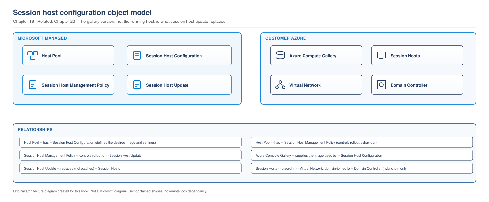

# Chapter 16 - Automated Host Pools and Session Host Configuration

> **Book:** Azure Virtual Desktop - Architect to Hands-on Implementation
> **Part IV:** Host Pool and Session Host Architecture
> **Technical baseline:** August 2026

---

## Chapter Information

| Item | Detail |
|---|---|
| **Chapter number** | 16 |
| **Objective** | Choose between session host configuration and standard management, and understand what each one takes away as well as what it gives you |
| **Prerequisites** | Chapters 1 to 15. Labs 1 to 4 complete |
| **Dependencies** | Builds on the host pool decisions in [Chapter 15](ch15-host-pool-design-decisions.md). Feeds [Chapter 23](ch23-golden-image-engineering.md) and [Project 03](../scenarios/project-03-global-enterprise-governance.md) |
| **Estimated lab time** | Lab 7 builds a standard-management host pool; session host configuration remains a documented alternative |
| **Azure resources required** | None for the chapter |
| **Cost** | $0.00 for the chapter |

---

## What You Will Learn

- The two host pool management approaches and the decision between them
- The three objects that make up session host configuration
- What a session host update actually does to your virtual machines
- What you give up, including the parts that matter to a Terraform-first environment
- Three production scenarios with exact investigation steps

---

## Why This Matters

This is the largest change to AVD operations since the move to Azure Resource Manager. It moves session host lifecycle from something you build to something the service does.

It is also a decision you cannot reverse. The management approach is chosen when the host pool is created, and an existing host pool cannot be converted.

For this book there is a second reason it matters. This is a Terraform-first course, and session host configuration deliberately takes session host lifecycle away from external tooling. That tension is real and this chapter deals with it directly rather than pretending it does not exist.

---

## 1. The Two Approaches

Microsoft's deployment guidance states both plainly: session host configuration is available for pooled host pools with session hosts on Azure. Azure Virtual Desktop manages the lifecycle of session hosts in a pooled host pool for you by using a combination of native features to provide an integrated and dynamic experience. Standard management is available for pooled and personal host pools with session hosts on Azure or Azure Local. You manage creating, updating, and scaling session hosts in a host pool.

> **OUR ORIGINAL ARCHITECTURE DIAGRAM.** Created for this book. Not a Microsoft diagram.
> Editable source: [`ch16-session-host-configuration-objects.drawio`](../diagrams/architecture/ch16-session-host-configuration-objects.drawio)



> Decision flow diagram. It uses the reduced explanation set defined in the [diagram standard](../DIAGRAM-STANDARD.md).

**What this diagram shows.** Three questions in order. Two of them are hard constraints and only the third is a genuine choice.

**Step by step.** Personal host pools have only one option. Pooled host pools on Azure Local also have only one option. For pooled host pools on Azure, the real question is whether you want the service to own session host lifecycle or whether your own pipeline should keep it.

**Architect's interpretation.** The colouring is deliberate but not a judgement. Session host configuration is the direction the platform is going and it removes a lot of work. Standard management is not legacy, and for personal host pools it is the only option.

`CURRENCY FLAG - checked 6 September 2026.` Microsoft's current host pool management guidance documents standard management and session host configuration as the two available approaches. Session host configuration is limited to pooled host pools, and the approach cannot be changed after the host pool is created.

**Official Microsoft reference:** https://learn.microsoft.com/en-us/azure/virtual-desktop/host-pool-management-approaches

---

## 2. The Three Objects

Session host configuration is not one setting. It is three related objects, and knowing which does what makes the operational model obvious.

> **OUR ORIGINAL ARCHITECTURE DIAGRAM.** Created for this book. Not a Microsoft diagram. Already shown in Section 1; repeated here as it is directly discussed in this section.
> Editable source: [`ch16-session-host-configuration-objects.drawio`](../diagrams/architecture/ch16-session-host-configuration-objects.drawio)


**What this diagram shows.** The three service objects that sit on the host pool, and the customer resources they act on. The heavy arrow is the one that changes your environment.

**What each component does.**

- **Session host configuration** is the declared state of a session host. Microsoft describes it as a sub-resource of the session host configuration management approach that specifies the configuration of session hosts in the host pool. The session host configuration persists throughout the lifecycle of the host pool and is aligned with the session hosts in the host pool. Image, VM size, disk, network, domain join.
- **Session host management policy** is how changes roll out. Microsoft defines it as a sub-resource of a host pool that specifies how session hosts in the host pool should be updated and created. The session host management policy persists throughout the lifetime of the host pool and it's used when updating the session hosts in the host pool or adding new session hosts. There is a single session host management policy per host pool, and you can't delete it independently of the host pool.
- **Session host update** is the action. It applies the configuration to existing hosts.

**Normal flow.** You change the configuration, for example to a new image version. You schedule an update. The policy decides the batch size and the logoff behaviour. The service replaces virtual machines in batches until every host matches the configuration.

**Important architect decisions.**

- **The configuration is the source of truth.** Anything not in it does not survive an update.
- **Empty pools are free to change.** If there are no session hosts in the host pool, any property of the session host configuration can be changed without needing to schedule a session host update. Get the configuration right before you add hosts.
- **The image belongs in Azure Compute Gallery.** See [Chapter 23](ch23-golden-image-engineering.md).

**What happens when something fails.** Section 4 covers the update failure modes, which are specific and well documented.

**Microsoft managed versus customer managed.** The three service objects are Microsoft's. The virtual machines, image, network and directory remain yours and are billed to you. The change is who orchestrates the lifecycle, not who owns the resources.

**Official Microsoft reference:** https://learn.microsoft.com/en-us/azure/virtual-desktop/host-pool-management-approaches

---

## 3. What a Session Host Update Actually Does

This section matters more than the feature description, because the behaviour surprises people.

**It replaces virtual machines. It does not patch them.** Microsoft's own summary in the release notes: session host update allows you to modify your session host configuration and roll out the changes to existing hosts in batches, minimizing downtime. This deletes the existing virtual machines and creates new ones that are added to your host pool.

**The rollout is cautious by design.** You can specify the number of session hosts in a host pool to update concurrently, known as a batch. This value is the maximum number of session hosts that are unavailable at a time during the update and all remaining session hosts are available to use. When an update starts, only one session host is targeted, known as the initial, to test that the end-to-end update process is successful before moving on to updating the rest of the session hosts in the pool in batches.

So a pool of ten hosts with a batch size of three updates one host first, proves the process works, then continues in threes. That single initial host is a good design and it is also why an update can fail immediately with only one host affected, which is exactly what you want.

**Resource naming and identity.** The new Azure resources for the VM, OS disk, and network interface are in the format SessionHostName-DateTime, for example, an existing VM called VM1-0 is replaced with a new VM called VM1-0-2023-04-15T17-16-07. The hostname of the operating system isn't changed. These new session hosts are joined to your directory using Azure VM extensions. Session hosts joined to an Active Directory domain inherit the existing AD computer objects. This process establishes the trust relationship and breaks the existing trust relationship with the previous VMs.

Two things follow. Azure resource names change and accumulate a timestamp, so any script or tag policy that assumes a fixed VM name needs checking. The Windows computer name does not change, and the AD computer object is inherited, which is why GPO scoping and monitoring based on hostname keep working.

**What does not survive.** This is the important one: any customizations, such as files, registry keys, or certificates that were added manually to session hosts, aren't present after the update is complete. You can't update session hosts in the pool individually, so you should either add these customizations into the image itself, ensure the customizations are applied by configuration management tools such as Intune or Group Policy, or add these customizations to the custom configuration PowerShell script in the session host configuration.

That sentence is the whole operating model in one line. **Manual changes to a session host are temporary.** Everything must come from the image, from policy, or from the configuration script. For an organisation used to fixing a host by hand, this is a culture change more than a technical one, and it is a good one.

### Documented limits

| Cannot be changed by an update | Consequence |
|---|---|
| Region, subscription, resource group, domain join type | If the configuration differs from the session hosts in these fields, the update fails to start. You should remove the session hosts that are inconsistent with the configuration |
| Directory | You must use the same directory as the existing VMs |
| OS disk size | Cannot be changed during an update |
| Cross-subscription gallery image | Session host configurations don't currently support accessing an Azure Compute Gallery shared image located in a different subscription than the host pool |

Properties that do persist: other Azure properties of the session hosts, such as the availability configuration, network configuration, and location, are persisted across updates.

**Official Microsoft reference:** https://learn.microsoft.com/en-us/azure/virtual-desktop/session-host-update

---

## 4. What You Give Up

Every architecture decision has a cost, and this one has a specific and significant cost for infrastructure-as-code environments.

Microsoft is explicit: when using a host pool with a session host configuration, you can't create, update or scale session hosts outside of the Azure Virtual Desktop service using tools designed for host pools with standard management.

Read that as an architect. Session host lifecycle stops being something your pipeline owns. Terraform can still create the host pool, the configuration, the network, the storage, the application groups, the workspace, the scaling plan and the role assignments. It does not create session hosts one by one any more, because the service does.

Adding capacity changes too. For a host pool using a session host configuration, you use the Azure portal to specify the number of session hosts you want to add, then Azure Virtual Desktop automatically creates them based on the session host configuration.

### Is this a problem for a Terraform-first environment?

Honestly, less than it first appears, and it is worth being precise about why.

Terraform's value in AVD was never that it looped over virtual machines. It was that the environment is declared, reviewed, versioned and reproducible. Session host configuration is also declarative. The declaration simply moves from your state file to a service object, and Terraform still declares that object.

What you genuinely lose:

- **Fine-grained per-host control.** You cannot deploy nine hosts one way and one host another. That is intentional, because homogeneity is the point.
- **Custom deployment steps between VM creation and registration.** These have to move into the image or the configuration script.
- **Drift detection for session hosts through Terraform.** The service now owns that.

What you keep:

- Everything else in the environment, declared in Terraform.
- Reproducibility, review and version history for the configuration itself.

**The architect's position.** If your organisation has invested heavily in a session host pipeline that does genuine work, standard management remains a supported, first class choice. If your pipeline exists mainly to loop over VM creation and registration, session host configuration does that better than your code does, and maintaining the code is no longer a good use of anyone's time.

`[VERIFY BEFORE IMPLEMENTATION]` Terraform AzureRM provider coverage for session host configuration and the session host management policy has been developing. Check the provider documentation for the resources and the version that supports them before designing a deployment around it. If coverage is incomplete, a hybrid approach is reasonable: Terraform for everything else, and the service or a small script for the configuration object. Say so in the design document rather than leaving it implicit.

---

## 5. Choosing, in Practice

| Choose session host configuration when | Choose standard management when |
|---|---|
| Pooled host pools on Azure | Personal host pools |
| You want homogeneous hosts and rolling image updates without building them | Session hosts on Azure Local |
| You want dynamic autoscaling that creates and deletes hosts | Your pipeline performs genuine work beyond create and register |
| You want configuration drift to stop being an operational problem | You require per-host control |
| Your team is small and image-based operations suit you | You are mid-project with a working pipeline and no reason to change |

**A migration note.** An existing host pool cannot be converted. Moving to session host configuration means creating a new host pool and moving users across by persona, exactly as described for the Entra join migration in [Chapter 7](ch07-identity-architecture-foundations.md). Session hosts are disposable, so this is a rebuild rather than a migration, and it is less work than it sounds.

### Northwind applied

Consistent with the host pool design in [Chapter 15 section 4](ch15-host-pool-design-decisions.md#4-how-many-host-pools):

| Host pool | Type | Approach | Reason |
|---|---|---|---|
| `hp-task-prd-eus2-01` | Pooled | Session host configuration | Large, homogeneous, frequent image updates |
| `hp-know-prd-eus2-01` | Pooled | Session host configuration | Same |
| `hp-fin-prd-eus2-01` | Pooled | Session host configuration | Same, with its own image |
| `hp-cad-prd-eus2-01` | Personal | Standard management | Personal pools have no other option |
| `hp-dev-prd-eus2-01` | Personal | Standard management | Same |

Three pools move to the service managed model. Two cannot. That split is typical, and it means the operations team runs two models at once, which belongs in the runbook and the handover documentation.

---

## 6. Production Scenarios

### Scenario 1: The update that removed everyone's certificates

**Problem.** A pool of 40 hosts is updated to a new image. Afterwards, an internal application fails for every user with a certificate error.

**Symptoms.** The update completed successfully. Hosts are healthy. Only this one application fails, and it worked before the update.

**Business impact.** An internal application unusable for every user on a 40 host pool immediately after a successful change.

**Initial hypothesis.** A manual customisation that did not survive. Microsoft documents that files, registry keys and certificates added by hand to session hosts are not present after an update.

**Investigation.**

On a host, compare the certificate store against what the application needs.

```bash
az vm run-command invoke -g rg-avd-hosts-lab-eus2-01 -n <vm> \
  --command-id RunPowerShellScript \
  --scripts "Get-ChildItem Cert:\LocalMachine\Root | Select-Object Subject, Thumbprint, NotAfter | Format-Table -AutoSize"
```

Then check the image build documentation and the session host configuration for a custom configuration script.

**Evidence.** The certificate is absent on the updated hosts and present in the change record from eighteen months ago, applied by hand during the original deployment.

**Root cause.** A manual change was made once, worked for a year and a half, and was never captured anywhere. The update did exactly what it is designed to do.

**Fix.** Put the certificate in the image, or deploy it through Intune or Group Policy, or add it to the custom configuration script in the session host configuration. Image is usually the right answer for something every host needs.

Do not fix it by hand on the 40 hosts. It will disappear at the next update and nobody will remember why.

**Validation.** Update one host from the corrected image and confirm the certificate is present and the application works. Then complete the rollout.

**Prevention.** Audit every session host for manual changes before adopting session host configuration. Treat "how does this get onto a new host" as a required question for any change to a session host, and refuse changes that have no answer.

**Architect's lesson.** Service managed lifecycle exposes every undocumented manual change at once. That is uncomfortable and it is the correct outcome, because those changes were already a hidden dependency.

**Interview lesson.** Saying that this outcome is uncomfortable and correct shows you understand why the model exists.

### Scenario 2: The update that will not start

**Problem.** A scheduled update fails immediately. No hosts are replaced. The error refers to inconsistent session hosts.

**Symptoms.** The update never reaches the initial host. Existing hosts are healthy and users are unaffected.

**Business impact.** No user impact. The image update cannot proceed, so a security or application change is blocked until the inconsistency is cleared.

**Initial hypothesis.** The configuration differs from the existing hosts in a field that an update cannot change. Region, subscription, resource group and domain join type are the documented ones.

**Investigation.**

```powershell
Get-AzWvdSessionHost -ResourceGroupName rg-avd-service-lab-eus2-01 `
  -HostPoolName hp-avd-lab-eus2-01 | Select-Object Name, ResourceId
```

Compare the resource group and subscription in those resource IDs against the session host configuration. Then check the domain join type in the configuration against the join type of the existing hosts.

**Evidence.** Four hosts sit in a different resource group, added manually during an earlier capacity incident.

**Root cause.** Hosts added outside the configuration created an inconsistency that blocks the update.

**Fix.** Microsoft's guidance is direct: remove the session hosts that are inconsistent with the configuration, then run the update. Removing and rebuilding hosts is normal work here, not a last resort.

**Validation.** The update starts, the initial host completes successfully, and the remaining batches follow.

**Prevention.** Once a pool uses session host configuration, add capacity through the service rather than by hand. This is also why the standard management tooling restriction exists, and the restriction is easier to accept once you have seen what happens when it is ignored.

**Architect's lesson.** A declarative model breaks when something is created outside it. The constraint is not bureaucracy, it is what makes the automation safe.

**Interview lesson.** Framing a restriction as what makes the automation safe is a mature answer.

### Scenario 3: Two management models, one operations team

**Problem.** An estate has three pooled host pools using session host configuration and two personal pools using standard management. The operations team keeps applying the wrong runbook.

**Symptoms.** Attempts to add hosts to a service managed pool with the old script fail. Attempts to update a personal pool by changing a configuration find no configuration to change. Confusion rather than outage.

**Business impact.** Wasted operations effort and failed change attempts rather than outage, plus a growing risk that someone applies the wrong procedure to a production pool.

**Initial hypothesis.** Not a technical fault. The runbook does not distinguish the two models, and the team cannot tell which pool is which from the name.

**Investigation.**

```bash
az desktopvirtualization hostpool list \
  --query "[].{name:name, type:hostPoolType, managed:managementType}" -o table
```

`[VERIFY BEFORE IMPLEMENTATION]` Confirm the property name that exposes the management approach in your CLI version. If it is not exposed, check the host pool in the portal under Session hosts, where the management option is visible.

**Evidence.** Two distinct management approaches, one set of runbooks, and no naming convention that signals which is which.

**Root cause.** The estate design was correct. The operational documentation had not caught up with it.

**Fix.** Split the runbooks by management approach and state the approach at the top of each. Add the approach to the host pool documentation and to the handover pack.

**Validation.** An operations engineer who has not been briefed can identify the correct procedure for a given pool from the documentation alone. Test that rather than assuming it.

**Prevention.** Where an estate deliberately runs two models, make the difference visible. Do not rely on people remembering which pool is which.

**Architect's lesson.** Introducing a second operating model is a real cost, and it is paid by the operations team rather than by the architect. Decide it deliberately and document it properly, or the design is only correct on paper.

**Interview lesson.** Naming who pays for a design decision, in this case the operations team, is a senior perspective.

---

## 7. The Architect's Four Questions

**What do I check first?** Which management approach the host pool uses. Almost every procedure in this area differs between the two, and applying the wrong one wastes time.

**What can I safely change now?** Any property of the session host configuration when the pool has no session hosts. The session host management policy, which affects future updates rather than current hosts. Reading configuration.

**What must not be changed blindly?**
- Scheduling a session host update during working hours. It deletes and recreates virtual machines.
- Adding session hosts to a service managed pool using standard management tooling.
- Changing the image in the configuration without checking that manual customisations have been captured elsewhere.
- The management approach itself. It cannot be changed after host pool creation.

**When do I escalate to Microsoft?** When an update fails with the configuration provably consistent with the existing hosts, or when the initial host fails repeatedly with a healthy image. Collect: the host pool name and region, the session host configuration, the session host management policy, the update error and correlation ID, the image reference, and UTC timestamps. The troubleshooting page for session host configuration and session host update lists the documented failure causes and is worth checking before opening a case.

---

## 8. Common Mistakes

- Assuming an update patches hosts. It deletes and recreates them.
- Leaving manual customisations on session hosts and discovering them after an update.
- Adding hosts to a service managed pool by hand, then finding updates will not start.
- Expecting to convert an existing host pool. You cannot.
- Choosing session host configuration for a personal host pool. It is not available.
- Building a session host pipeline in Terraform for a pool that uses session host configuration.
- Storing the gallery image in a different subscription from the host pool.
- Running two management models without splitting the runbooks.
- Reading a Microsoft page that still says preview and assuming the feature is not generally available. Check the most recently updated page.

---

## 9. Interview Preparation

### Q44. What is session host configuration and when would you use it?

**Simple answer**
It is a management approach for pooled host pools where AVD owns the session host lifecycle. You define one configuration for what a session host should look like, and the service creates, updates and replaces hosts to match it. Standard management is where you do that yourself.

**Strong senior architect answer**
"It moves session host lifecycle from my pipeline to the service. Three objects: the session host configuration, which is the declared state of a host, the session host management policy, which controls how updates roll out, and session host update, which applies changes. The key behaviour to understand is that an update deletes virtual machines and creates new ones rather than patching them, so anything applied manually to a host does not survive. That sounds harsh and it is actually the point, because it forces every change to come from the image, from policy, or from the configuration script. I would use it for pooled pools on Azure where I want homogeneous hosts and rolling image updates. I cannot use it for personal pools, and I have to choose at host pool creation because an existing pool cannot be converted."

**Follow-up you should expect**
"What does that mean for your Terraform?" Terraform still declares the host pool, the configuration, the network, storage, application groups and role assignments. It stops creating session hosts individually, because the service will not accept hosts created outside it. Whether that is a loss depends on whether the pipeline did real work or just looped over VM creation.

### Q45. How does a rolling update work, and what would you check before running one?

**30 second answer**
"It replaces hosts in batches. The first update targets a single host to prove the process works end to end, then it continues in the batch size you set. Before running one I would confirm that nothing on the current hosts was applied by hand, because manual files, registry keys and certificates do not survive."

**2 minute answer**
Add the mechanics and the limits. The batch size is the maximum number of hosts unavailable at once, so it is a user impact decision as much as a speed one. New Azure resources get a timestamped name, but the Windows computer name is unchanged and the AD computer object is inherited, which is why GPO scoping and hostname-based monitoring keep working. Then the limits that stop an update starting: region, subscription, resource group and domain join type cannot change, and if the existing hosts differ from the configuration in those fields the update will not start at all. OS disk size cannot change during an update either. Before running one, I check for manual customisations, confirm the image is in a gallery in the same subscription, and schedule it outside working hours.

**Deep dive answer**
There is an operational consequence worth naming. This model treats session hosts as replaceable resources. It also exposes undocumented manual changes. Before adopting it, audit the hosts for drift and move required settings into the image or policy. A mixed estate also needs separate operating procedures for standard and automated host-pool management.

### Q46. Your customer has a mature Terraform pipeline. Do you move them to session host configuration?

**Strong answer**
"It depends on what the pipeline actually does. If it loops over VM creation, joins the domain and registers the host, then the service does that better and maintaining the code is no longer a good use of the team's time. If it does real work, such as complex conditional configuration or integration with systems the service cannot reach, standard management is a supported first class choice and there is no reason to move. Either way Terraform still owns everything except session host lifecycle, so this is not a choice between infrastructure as code and clicking in a portal. I would also check the provider coverage for the configuration objects before committing, and if it is incomplete I would say so in the design document rather than discovering it during build."

**Why this works**
It refuses the false choice between Terraform and the service, it names the real question, and it flags provider coverage as a risk to verify rather than assuming it.

---

## 10. Key Takeaways

- Two management approaches. Session host configuration for pooled host pools on Azure, standard management for everything else.
- Chosen at host pool creation. An existing pool cannot be converted.
- Three objects: session host configuration, session host management policy, session host update.
- An update deletes and recreates virtual machines. It does not patch them.
- The first update targets a single host before continuing in batches.
- Manual files, registry keys and certificates do not survive an update.
- Azure resource names change with a timestamp. The Windows computer name and the AD computer object are kept.
- Region, subscription, resource group, domain join type, directory and OS disk size cannot change during an update.
- Session hosts cannot be created or scaled outside the service for a pool using session host configuration.

---

## 11. Official References

- Host pool management approaches - https://learn.microsoft.com/en-us/azure/virtual-desktop/host-pool-management-approaches
- Session host update - https://learn.microsoft.com/en-us/azure/virtual-desktop/session-host-update
- Configure a session host update - https://learn.microsoft.com/en-us/azure/virtual-desktop/session-host-update-configure
- Troubleshoot session host configuration and session host update - https://learn.microsoft.com/en-us/azure/virtual-desktop/troubleshoot-session-host-configuration-update
- Add session hosts to a host pool - https://learn.microsoft.com/en-us/azure/virtual-desktop/add-session-hosts-host-pool
- Deploy Azure Virtual Desktop - https://learn.microsoft.com/en-us/azure/virtual-desktop/deploy-azure-virtual-desktop
- What's new in Azure Virtual Desktop - https://learn.microsoft.com/en-us/azure/virtual-desktop/whats-new

---

## Architect's Reality Check

**What engineers commonly get wrong.** They assume an update patches hosts. It deletes and recreates them, so anything applied by hand disappears.

**What I would check first in production.** Which management approach the host pool uses. Nearly every procedure in this area differs between the two.

**What I would ask the customer.** What their session host pipeline actually does. If it loops over VM creation and registration, the service does that better. If it does real work, standard management stays.

**What I would decide as the architect.** Session host configuration for pooled pools on Azure, after auditing hosts for manual changes and capturing them into the image or policy first.

**What I would say in an interview.** That infrastructure as code and service managed lifecycle are not opposites. Terraform still declares everything except session host lifecycle, and knowing that difference is the answer.

---

## How This Changes With Scale

**Around 100 users.** Either approach works. Building hosts by hand is tedious rather than unmanageable.

**Around 1,000 users.** Image updates dominate operational effort, and rolling updates without building them yourself is a real saving.

**Around 5,000 users and beyond.** Homogeneity becomes a requirement rather than a preference, because drift across hundreds of hosts is untraceable. A mixed estate running both management approaches needs split runbooks, and that cost lands on the operations team.

---

## Chapter Close

**What was completed**
You can choose a management approach, explain the three objects and what an update does, and articulate the trade-off for an infrastructure-as-code environment without pretending it does not exist.

**What you should test**
List every host pool you are responsible for and record its management approach. If you cannot tell from the documentation, that is the first gap to close.

**What comes next**
Chapter 17 covers session-host sizing and compute selection, including VM families, GPU, availability zones, and the scope and limits of ephemeral OS disks.

**Interview preparation carried forward**
Q46 is the strongest question here. Most candidates treat infrastructure as code and service managed lifecycle as opposites. They are not, and being able to explain why marks you as someone who has thought about it rather than picked a side.

---

## Chapter Self-Review

**Pass 1, technical verification.** The two management approaches and their availability, the three objects and their persistence, the restriction on creating or scaling hosts outside the service, the empty pool exception, the delete and recreate behaviour, the initial host and batch rollout, the timestamped resource naming with unchanged Windows hostname and inherited AD computer object, the loss of manual customisations, and the fields that cannot change during an update were all verified against the current host pool management approaches, session host update, troubleshooting and add session hosts pages. The documentation discrepancy between pages still labelled preview and the June 2026 general availability rollout is flagged rather than resolved silently. CLI property names for the management approach carry a verification marker because exposure varies by version. Terraform provider coverage carries a verification marker rather than a claim.

**Pass 2, readability.** The chapter leads with the decision, then the objects, then what an update does, because that is the order a reader needs. The infrastructure as code trade-off is given its own section rather than buried, since this is a Terraform-first book and avoiding it would be dishonest. Long sentences split. No long dash characters.

**Pass 3, diagram review.** Two diagrams. The decision tree uses three short questions and two outcomes. The object model diagram shows Microsoft managed and customer managed zones with component names only, and the replace action as the single heavy arrow. Both were checked against the twelve question review in the [diagram standard](../DIAGRAM-STANDARD.md). No node contains more than a component name.

**Consistency check against earlier chapters.** The Northwind table in section 5 matches the host pool design in [Chapter 15 section 4](ch15-host-pool-design-decisions.md#4-how-many-host-pools): the same five pools, three pooled and two personal. [Chapter 3 section 5](ch03-avd-object-model.md#5-two-host-pool-management-approaches) introduced both approaches with a verification marker, and this chapter is consistent with it while adding the general availability position and the documentation discrepancy. No earlier chapter required correction.

| Check | Result |
|---|---|
| Technical accuracy | Verified against current Microsoft pages |
| Current capability verified | Yes, August 2026, with a currency flag and a documented page discrepancy |
| Supported versus unsupported separated | Yes. Update limits and tooling restrictions stated explicitly |
| Commands, portal paths, CLI, PowerShell | Exact, with verification markers where property exposure varies |
| Production scenarios | Three, in the nine step format, with architect lessons |
| Architect's four questions | Section 7 |
| Diagrams | Two, to the locked standard, reviewed visually |
| Architecture consistency | Northwind design consistent with Chapters 3 and 15 |
| Cost statements | $0.00 for the chapter |
| Security implications | Manual change drift exposed as a hidden dependency |
| Interview answers | Read aloud |
| Duplicate content | Host pool design referenced to Chapter 15, images to Chapter 23 |
| Simple English | Reviewed |
| Long dash characters | None |
