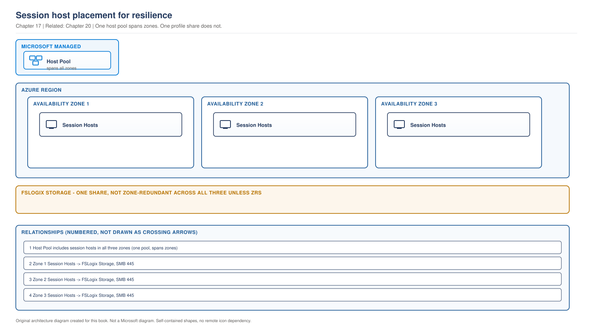

# Chapter 17 - Session Host Sizing and Compute Selection

> **Book:** Azure Virtual Desktop - Architect to Hands-on Implementation
> **Part IV:** Host Pool and Session Host Architecture
> **Technical baseline:** August 2026

---

## Chapter Information

| Item | Detail |
|---|---|
| **Chapter number** | 17 |
| **Objective** | Choose a defensible VM size, place hosts for resilience, and use an OS disk supported by AVD |
| **Prerequisites** | Chapters 1 to 16. Labs 1 to 4 complete |
| **Dependencies** | Uses the density principle from [Chapter 5](ch05-operating-systems-multisession-licensing.md#3-density-what-actually-determines-it), the host pool decisions in [Chapter 15](ch15-host-pool-design-decisions.md) and the disposable host model in [Chapter 16](ch16-automated-host-pools-session-host-configuration.md) |
| **Estimated lab time** | Session hosts are deployed in Lab 8, the first compute-cost lab |
| **Azure resources required** | None for the chapter |
| **Cost** | $0.00 for the chapter. This chapter decides most of your compute bill |

---

## What You Will Learn

- Microsoft's sizing starting points, and why VM size has an upper bound as well as a lower one
- A sizing method you can defend in a design review
- Availability zones and how they interact with host pool design
- When ephemeral OS disks fit an AVD design, and their limits
- GPU workloads and capacity planning
- Three production scenarios with exact investigation steps

---

## Why This Matters

Compute is the largest line in an AVD bill. Get the size wrong upwards and you pay for capacity nobody uses. Get it wrong downwards and users feel it every day.

The temptation is to copy a VM size from a blog. This chapter gives you a method instead, because in a design review "we chose D8s because an article said so" is not an answer, and in an interview it is a poor one.

---

## 1. Microsoft's Starting Points

Microsoft publishes sizing guidance and is clear that it is a starting point rather than a specification.

**Single-session.** VM sizing for single-session session hosts usually aligns with physical device guidelines. Microsoft recommends at least two physical CPU cores per VM, typically four vCPUs with hyper-threading. For more specific VM sizing recommendations for single-session scenarios, ask the software vendors specific to your workload.

That last part is genuinely useful advice. For a CAD or engineering workload, the application vendor knows more about its requirements than any general guidance does.

**Multi-session.** The published tables give a maximum suggested number of users per vCPU and a minimum VM configuration per workload type.

### The upper bound people miss

Most engineers know there is a minimum. Fewer know there is a maximum.

For multi-session workloads, limit VM size to between 6 vCPUs and 24 vCPUs. And all VMs should have more than two cores, because the UI components in Windows rely on the use of at least two parallel threads for some of the heavier rendering operations.

**Why the upper bound exists.** A very large multi-session host concentrates too many users on one failure domain. Lose one 64 vCPU host and you lose a lot of users at once. Larger hosts also tend to hit contention on shared resources before they run out of CPU, so the extra vCPUs do not deliver proportional density.

**The design consequence.** More medium hosts beat fewer large hosts. That also suits autoscaling, because you can shed capacity in smaller increments.

### The workload types

Microsoft categorises users as light, medium, heavy and power. Mapping personas to those categories is the first step of sizing, and it is a business conversation as much as a technical one. For Northwind:

| Persona | Workload type | Notes |
|---|---|---|
| Task workers | Light to medium | Small application set, predictable |
| Knowledge workers | Medium | Office, Teams, many browser tabs |
| Finance | Medium | Similar profile, separate pool for isolation |
| Executives | Medium | Sits in the knowledge worker pool |
| Developers | Heavy | Compilers, containers, unpredictable |
| CAD engineers | Power | GPU, large files |

`CURRENCY FLAG - verified August 2026. Microsoft's sizing tables are updated periodically. Read the current table rather than quoting figures from any book, including this one.`

**Official Microsoft reference:** https://learn.microsoft.com/en-us/windows-server/remote/remote-desktop-services/session-host-virtual-machine-sizing-guidelines

---

## 2. A Sizing Method You Can Defend

Six steps. The output is a number plus the reasoning behind it, which is what a design review actually wants.

1. **Map personas to workload types.** Light, medium, heavy, power. Write down the applications that drove each decision.
2. **Take Microsoft's minimum for that workload type** as the floor, not the answer.
3. **Choose a VM size between 6 and 24 vCPUs** that meets the floor. Prefer more medium hosts over fewer large ones.
4. **Calculate memory separately.** Memory usually binds before CPU for browser-heavy users. Size for the memory footprint of the real application set, plus the operating system.
5. **Pilot with real users and real applications.** Measure CPU, memory, disk and logon duration at genuine peak.
6. **Set the session limit from the measurement**, then re-measure after any significant application change.

**The output of step 6 is the number that matters.** Everything before it is a hypothesis.

### Worked example, Northwind task workers

| Input | Value | Source |
|---|---|---|
| Persona | Task workers, 1,400 users | Chapter 1 |
| Workload type | Light to medium | Application assessment |
| Starting VM size | 8 vCPU, 32 GB | Microsoft floor plus memory headroom |
| Assumed users per host | 10 | Assumption, to be tested |
| Pilot result | 8 sustained, 10 at peak with memory pressure | Measurement |
| Session limit set | 8 | Decision |
| Hosts required | 1,400 concurrent worst case, 175 hosts | Calculation |

Every row is labelled as an assumption, a measurement or a decision. That table is what you take to a design review.

**Note the disagreement between the assumption and the measurement.** Ten looked reasonable and eight was correct. That gap is exactly why step 5 exists, and it is a 20 percent difference in host count and therefore in cost.

Subnet sizing follows from the host count, and remember to double it for rolling updates. See [Chapter 12 section 3](ch12-enterprise-topologies-ip-planning.md#3-address-space-planning).

---

## 3. Placement and Resilience

Sizing decides what a host is. Placement decides what happens when part of Azure has a bad day.

Microsoft's Well-Architected guidance is direct: if you spread session hosts across availability zones and locations within availability zones, you can decrease the chance that your Virtual Desktop environment becomes unavailable because of maintenance or outage. And on placement generally: the location of a session host correlates directly with the latency that users experience. If you use FSLogix, the distance between your host pool location and the FSLogix storage location also affects the user experience. Deploy session hosts close to user locations.

> **OUR ORIGINAL ARCHITECTURE DIAGRAM.** Created for this book. Not a Microsoft diagram.
> Editable source: [`ch17-session-host-placement.drawio`](../diagrams/architecture/ch17-session-host-placement.drawio)



**What this diagram shows.** One host pool spanning three availability zones inside a region, with shared profile storage.

**What each component does.** The host pool is a Microsoft managed object and has no location constraint across zones. The session hosts are your virtual machines, placed in specific zones. Profile storage is a single shared dependency for every zone.

**Normal flow.** Users are brokered to any host in any zone. Every host mounts profiles from the same storage.

**Important architect decisions.**
- **Spread hosts across zones,** so a zone problem costs you a fraction of capacity rather than all of it.
- **Size for the loss of a zone.** Three zones means each carries a third, so losing one leaves you at 67 percent. If that is not enough for peak, add capacity.
- **Profile storage resilience is a separate decision.** The diagram shows why. Zone-redundant hosts with a single-zone storage account move the single point of failure rather than removing it. See [Chapter 20](ch20-profile-storage-architecture.md).
- **Zones are not available in every region.** Check before designing.

**What happens when something fails.** Lose a zone and its hosts go with it. Users on those hosts are disconnected and reconnect to hosts in surviving zones, provided there is capacity. Lose profile storage and every zone is affected at once, which is why that decision matters more than host placement.

**Microsoft managed versus customer managed.** The host pool object is Microsoft's. The virtual machines, their zone placement and the storage account are yours.

**Official Microsoft reference:** https://learn.microsoft.com/en-us/azure/well-architected/azure-virtual-desktop/application-delivery

---

## 4. Ephemeral OS disks

Azure Virtual Desktop supports ephemeral OS disks for stateless session hosts, but only in pooled host pools that use session host configuration. This repository's Terraform labs use standard host-pool management, so they keep managed OS disks.

Ephemeral OS disks use local VM storage. They cannot be deallocated, captured, snapshotted, protected by Azure Backup or Azure Site Recovery, or swapped. The selected VM cache or temporary disk must also be large enough for the image. Microsoft recommends Dynamic Autoscaling and a minimum active-host percentage of 100 percent, so the service creates and deletes hosts instead of attempting to start and deallocate them.

Use them only when the workload is stateless, FSLogix or another supported service stores user state, session host configuration is in use, and the recovery model is image-based replacement. Recheck the feature page for current regional and preview restrictions before implementation.

**Official Microsoft reference:** https://learn.microsoft.com/en-us/azure/virtual-desktop/deploy/session-hosts/ephemeral-os-disks

---

## 5. GPU and Capacity Planning

**GPU sizing is a vendor conversation.** Microsoft's own guidance for single-session workloads points you at the software vendor, and that applies doubly to CAD and visualisation. Ask the vendor what they support and test it, rather than choosing a GPU SKU from a size table.

**Drivers are part of the image.** GPU drivers must be installed and kept current, which makes GPU pools a separate image and therefore a separate host pool. That is one of the legitimate reasons for a separate pool from [Chapter 15](ch15-host-pool-design-decisions.md#4-how-many-host-pools).

**Capacity is not guaranteed.** GPU SKUs are constrained in many regions. Quota approval is not the same as capacity being available on the day. Check quota early, as in [Lab 1](../labs/lab-01-azure-prerequisites-and-tooling.md), and plan a fallback region or SKU for a GPU project. This is the one workload where "we will just deploy more hosts" can fail for reasons outside your control.

---

## 6. Production Scenarios

### Scenario 1: The oversized host pool

**Problem.** A 600 user deployment runs 40 hosts at 16 vCPU each. Compute cost is roughly double the model. Users are happy.

**Symptoms.** No complaints. Sustained CPU across the estate sits well under half. Memory is comfortable. Cost is the only problem.

**Business impact.** Compute cost roughly double the approved model, with no user impact, which means nothing triggers a review.

**Initial hypothesis.** The session limit was set conservatively at design time and never revisited after the pilot, so the estate is sized for a density nobody measured.

**Investigation.**

```powershell
Get-AzWvdHostPool -ResourceGroupName rg-avd-service-lab-eus2-01 -Name hp-avd-lab-eus2-01 |
  Select-Object Name, LoadBalancerType, MaxSessionLimit
```

Then look at actual utilisation over a representative period rather than a single day.

```kusto
Perf
| where TimeGenerated > ago(14d)
| where ObjectName == "Processor" and CounterName == "% Processor Time"
| summarize avg(CounterValue), percentile(CounterValue, 95) by Computer, bin(TimeGenerated, 1h)
| summarize AvgCPU = avg(avg_CounterValue), P95 = max(percentile_CounterValue_95) by Computer
```

`[VERIFY BEFORE IMPLEMENTATION]` Confirm the performance counter table and collection configuration in your workspace. See [Project 02](../scenarios/project-02-enterprise-850-users.md), where monitoring architecture is worked through in full.

**Evidence.** The 95th percentile CPU is well below target during peak hours, and memory is not constrained. Sessions per host sit far below what the hardware supports.

**Root cause.** A conservative session limit set before the pilot and never adjusted afterwards.

**Fix.** Raise the session limit in steps, measure after each step, and reduce host count as sessions consolidate. Do this over weeks, not in one change, and watch logon duration as well as CPU, because logon storms bind on disk and profile storage before they bind on CPU.

**Validation.** CPU and memory stay within target at peak with the higher session limit, logon duration is unchanged, and host count falls. All four measured, not assumed.

**Prevention.** Put a density review in the operations calendar. Re-measure after significant application changes. Treat the pilot number as a starting point with an explicit review date rather than a permanent decision.

**Architect's lesson.** Over-sizing produces no complaints, so nothing prompts a review. Cost problems are silent in a way that performance problems are not, which is why they need a scheduled review rather than a trigger.

**Interview lesson.** Explaining that cost problems are silent and need a scheduled review is an answer most candidates never reach.

### Scenario 2: An ephemeral OS disk is proposed for the wrong host pool

**Problem.** A design specifies an ephemeral OS disk for a host pool managed through the standard approach.

**Symptoms.** The design cannot meet the AVD requirement for a pooled host pool with session host configuration, and the operations plan expects hosts to be deallocated.

**Business impact.** The selected disk and scaling model are incompatible, so the deployment design must change before implementation.

**Investigation.** Check the current AVD ephemeral-disk feature page, the host-pool management approach, and the disk type on each session host:

```bash
az vm show -g rg-avd-hosts-lab-eus2-01 -n <vm> \
  --query "storageProfile.osDisk.diffDiskSettings" -o json
```

**Evidence.** The VM output contains `diffDiskSettings`, but the pool does not use session host configuration or the scaling plan expects deallocation.

**Root cause.** The design selected a disk feature without checking the AVD host-pool and lifecycle requirements.

**Fix.** Use a managed OS disk for the standard-managed pool. Consider ephemeral OS disks only if the pool is redesigned around session host configuration, image-based replacement, and the documented autoscaling settings.

**Validation.** Confirm the selected disk matches the host-pool management and scaling model, then verify registration, AVD health checks, profile persistence, and a test connection.

**Prevention.** Review the AVD feature-specific limits before selecting compute, disk, image, identity, and networking options.

### Scenario 3: The GPU project that could not get capacity

**Problem.** A CAD pool for 180 engineers is approved. Deployment fails because the GPU SKU is unavailable in the target region.

**Symptoms.** Quota was approved. Deployment returns a capacity error. Non-GPU pools in the same region deploy fine.

**Business impact.** An approved project for 180 engineers cannot deploy, with budget already committed and a delivery date agreed.

**Initial hypothesis.** Quota and capacity are different things. Quota is permission to allocate, capacity is whether the hardware is free.

**Investigation.**

```bash
az vm list-usage --location eastus2 -o table | grep -i "NV"
az vm list-skus --location eastus2 --size Standard_NV --all -o table
```

Check the SKU restrictions in the output, which indicate whether a SKU is unavailable in specific zones or in the region.

**Evidence.** Quota is sufficient. The SKU shows restrictions in the target region and zones.

**Root cause.** GPU capacity is constrained. Approval of quota did not guarantee capacity.

**Fix.** Three options, presented with trade-offs rather than one recommendation:

1. Deploy in a nearby region with capacity, and accept the latency impact for those users.
2. Use a different GPU SKU that is available, after confirming with the application vendor that it is supported.
3. Reserve capacity through a capacity reservation, if the timeline and budget allow it.

**Validation.** A small test deployment succeeds in the chosen region and SKU, with the CAD application validated by a real engineer on real files before the full rollout.

**Prevention.** Check GPU SKU availability, not just quota, during the design phase. For any GPU project, name a fallback region and SKU in the design document before build starts.

**Architect's lesson.** For most workloads, capacity is effectively unlimited and quota is the only constraint. For GPU it is not, and a design that assumes otherwise can fail after approval, which is the worst time.

**Interview lesson.** Knowing that quota and capacity are different is a small detail that prevents a real project failure.

---

## 7. The Architect's Four Questions

**What do I check first?** The session limit against measured utilisation. Most sizing complaints, in either direction, come from a limit that was set once and never revisited.

**What can I safely change now?** Adding hosts. Raising or lowering the session limit in small steps with measurement in between. Reading utilisation data.

**What must not be changed blindly?**
- VM size on an existing pool. It means replacing hosts, and with session host configuration it means a session host update.
- Session limit in large steps during working hours.
- Introducing a disk type that the current AVD prerequisites do not support.
- Moving hosts between availability zones, which is a redeploy rather than a change.

**When do I escalate to Microsoft?** For capacity errors where quota is confirmed sufficient, and for SKU restrictions you cannot design around. Collect: the region, the SKU, the output of `az vm list-usage` and `az vm list-skus` showing quota and restrictions, the deployment error and correlation ID, and the required capacity with dates. A capacity request with real numbers and dates is treated very differently from one without.

---

## 8. Common Mistakes

- Copying a VM size from an article instead of sizing from a workload type and a measurement.
- Ignoring the upper bound and building very large multi-session hosts.
- Sizing on CPU and forgetting that memory usually binds first for browser-heavy users.
- Treating the pilot session limit as permanent.
- Spreading hosts across zones while leaving profile storage in one zone.
- Using a general Azure VM feature without checking whether AVD supports it for session hosts.
- Assuming quota approval means GPU capacity is available.
- Forgetting that a GPU pool needs its own image and therefore its own host pool.

---

## 9. Interview Preparation

### Q47. How do you size session hosts?

**Simple answer**
Map personas to workload types, take Microsoft's minimum for that type as a floor, choose a VM size between 6 and 24 vCPUs, then pilot with real users and set the session limit from measurement.

**Strong senior architect answer**
"I start from workload type rather than from a VM size, because the applications drive it. Microsoft publishes minimums per workload type and I treat those as a floor. The part people miss is that there is an upper bound as well, between 6 and 24 vCPUs for multi-session, because a very large host concentrates too many users on one failure domain and does not deliver proportional density. So I would rather have more medium hosts than fewer large ones, which also suits autoscaling because I can shed capacity in smaller increments. Then I size memory separately, because for browser-heavy users memory binds before CPU. Then I pilot with real users and real applications and set the session limit from measurement. The output I take to a design review is a table where every row is labelled as an assumption, a measurement or a decision."

**Follow-up you should expect**
"What if the measurement disagrees with your assumption?" The measurement wins, and the gap is worth reporting. On a 1,400 user pool, ten users per host versus eight is a 20 percent difference in host count and cost.

### Q48. Would you use ephemeral OS disks?

**30 second answer**
"Only for a stateless pooled host pool that uses session host configuration. Ephemeral OS disks cannot be deallocated and do not support snapshots, Backup, or Site Recovery. The standard-managed pools in this design use managed OS disks."

**2 minute answer**
Azure Virtual Desktop supports ephemeral OS disks only for pooled host pools with session host configuration. I would use them for a stateless design only after checking VM cache or temporary-disk capacity and accepting that hosts cannot be deallocated, captured, backed up, or protected with Site Recovery. For standard host-pool management, I would use managed OS disks.

**Deep dive answer**
The important distinction is between a VM capability and its AVD operating model. Microsoft recommends Dynamic Autoscaling with every phase set to 100 percent minimum active hosts because ephemeral hosts are created and deleted, not started and deallocated. User state must remain outside the OS disk, and recovery must come from the image and configuration rather than disk recovery.

### Q49. How do you make a host pool resilient inside a region?

**Strong answer**
"Spread session hosts across availability zones, and size so that losing a zone still leaves enough capacity for peak. With three zones each carries roughly a third, so a zone failure leaves me at 67 percent, and if peak needs more than that I add capacity rather than pretending the design is resilient. The part that gets missed is profile storage. Zone-redundant hosts with a single-zone storage account have just moved the single point of failure, because every host in every zone mounts profiles from the same place. So host placement and storage resilience are one conversation. And I would check that zones exist in the target region before designing around them, because they are not available everywhere."

---

## 10. Key Takeaways

- Multi-session VM size should sit between 6 and 24 vCPUs. There is an upper bound as well as a lower one.
- All session hosts should have more than two cores.
- Size memory separately. It usually binds before CPU for browser-heavy users.
- Microsoft's tables are a floor. The session limit comes from measurement.
- Spread hosts across availability zones, and size for the loss of a zone.
- Zone-redundant hosts with single-zone profile storage have moved the failure point, not removed it.
- Ephemeral OS disks require a pooled host pool with session host configuration and a stateless, image-based operating model.
- GPU quota approval does not guarantee capacity. Check SKU availability and plan a fallback.

---

## 11. Official References

- Session host virtual machine sizing guidelines - https://learn.microsoft.com/en-us/windows-server/remote/remote-desktop-services/session-host-virtual-machine-sizing-guidelines
- Application delivery considerations for AVD workloads - https://learn.microsoft.com/en-us/azure/well-architected/azure-virtual-desktop/application-delivery
- Ephemeral OS disks on Azure Virtual Desktop - https://learn.microsoft.com/en-us/azure/virtual-desktop/deploy/session-hosts/ephemeral-os-disks
- Azure Virtual Desktop prerequisites - https://learn.microsoft.com/en-us/azure/virtual-desktop/prerequisites
- Availability zones support in Azure - https://learn.microsoft.com/en-us/azure/reliability/availability-zones-overview

---

## Hands-on Lab

Session hosts are deployed in **Lab 8**. It carries a cost warning before the first deployment step.

---

## Architect's Reality Check

**What engineers commonly get wrong.** They copy a VM size from an article. Sizing starts from workload type and ends with a measurement, and the gap between the two is usually twenty percent of the compute bill.

**What I would check first in production.** The session limit against measured utilisation. Over sized estates generate no complaints, so nothing prompts a review unless you schedule one.

**What I would ask the customer.** What the busiest fifteen minutes of sign ins looks like. That number sizes storage and shapes host count far better than total user count.

**What I would decide as the architect.** More medium hosts rather than fewer large ones, hosts spread across availability zones, and profile storage resilience decided in the same conversation as host placement.

**What I would say in an interview.** That there is an upper bound on multi session VM size as well as a lower one, and why. Most candidates only know the minimum.

---

## How This Changes With Scale

**Around 100 users.** Two or three hosts. Sizing precision saves little and resilience matters more than efficiency.

**Around 1,000 users.** Density is the main cost lever. Two users per host either way changes host count by twenty percent, which justifies a proper pilot measurement.

**Around 5,000 users and beyond.** Capacity planning becomes a scheduled activity with quota, zone and SKU availability tracked per region. GPU capacity in particular has to be confirmed rather than assumed, and a fallback region belongs in the design document.

---

## Chapter Close

**What was completed**
You can size session hosts from workload type and measurement, place them for resilience, and select an OS disk supported by AVD.

**What you should test**
Take one persona from your own environment and work the six step method. Stop at step 5 and write down what you would measure and for how long. That is the part people skip.

**What comes next**
Chapter 18 covers session host lifecycle, including registration, agent health, patching strategy and Arc-enabled session hosts for hosts outside Azure.

**Interview preparation carried forward**
Q47 is asked in nearly every AVD interview. The two details that lift the answer are the upper bound on VM size and the fact that memory usually binds before CPU.
