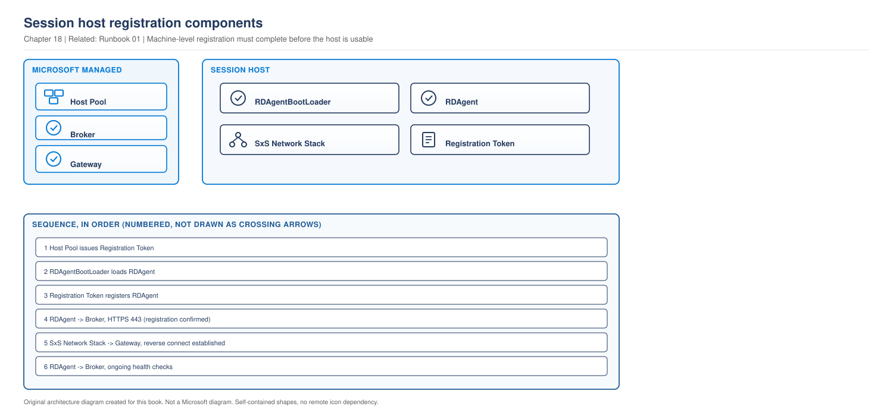

# Chapter 18 - Session Host Lifecycle and Hybrid Session Hosts

> **Book:** Azure Virtual Desktop - Architect to Hands-on Implementation
> **Part IV:** Host Pool and Session Host Architecture
> **Technical baseline:** August 2026

---

## Chapter Information

| Item | Detail |
|---|---|
| **Chapter number** | 18 |
| **Objective** | Understand how a session host joins and stays healthy, build a patching strategy that fits the disposable host model, and know what Arc-enabled hosts do and do not give you |
| **Prerequisites** | Chapters 1 to 17. Labs 1 to 4 complete |
| **Dependencies** | Builds on the management approaches in [Chapter 16](ch16-automated-host-pools-session-host-configuration.md) and the sizing decisions in [Chapter 17](ch17-session-host-sizing-compute-selection.md) |
| **Estimated lab time** | Session hosts are deployed in Lab 8 |
| **Azure resources required** | None for the chapter |
| **Cost** | $0.00 for the chapter |

---

## What You Will Learn

- The agent, the boot loader and the side-by-side stack, and what each one does
- Registration tokens, and why they expire at the worst moment
- Session host statuses, and the difference between fatal and non-fatal
- A patching strategy that matches how your host pool is managed
- Arc-enabled session hosts, including what the current release does not include
- Three production scenarios with exact commands

---

## Why This Matters

A session host that exists in Azure but is not registered is worth nothing. The virtual machine is running, it is being billed, and no user can reach it.

Registration and health are also where the most confusing AVD incidents live, because the failure is inside Windows while the symptom appears in the Azure portal. This chapter is the bridge between the two.

---

## 1. The Three Components on a Session Host

> **OUR ORIGINAL ARCHITECTURE DIAGRAM.** Created for this book. Not a Microsoft diagram.
> Editable source: [`ch18-session-host-registration.drawio`](../diagrams/architecture/ch18-session-host-registration.drawio)



**What this diagram shows.** Four things on the session host, two Microsoft managed services, and the host pool that issues the token.

**What each component does.**

- **RDAgentBootLoader** is a Windows service whose only job is to load the agent. If it is stopped, nothing else happens.
- **RDAgent** registers the host with the broker, reports health, and receives instructions when a user is brokered to it.
- **SxS Network Stack** carries the actual RDP session over reverse connect. The agent and the stack are separate, and they fail separately.
- **Registration token** is issued by the host pool and consumed once, when the agent first registers.

**Normal flow.** The host pool issues a token. The boot loader starts and loads the agent. The agent uses the token to register with the broker over HTTPS 443. From then on it reports health continuously, and the side-by-side stack handles user sessions.

**Important architect decisions.**
- **Do not bake the agent into an image with registration already done.** A cloned registered host causes duplicate entries. See section 3.
- **Token lifetime is a deployment planning input,** not an afterthought.
- **With session host configuration there is no token to manage.** The service handles registration. See [Chapter 16](ch16-automated-host-pools-session-host-configuration.md).

**What happens when something fails.** Boot loader stopped means no agent and no registration. Agent registered but stack broken means the host looks available and connections fail. Token expired means new hosts never appear.

**Microsoft managed versus customer managed.** The broker and gateway are Microsoft's. The three components on the host are yours to install, monitor and repair, unless the pool uses session host configuration, in which case the service manages them.

**Official Microsoft reference:** https://learn.microsoft.com/en-us/azure/virtual-desktop/session-host-status-health-checks

---

## 2. Session Host Status and Health Checks

Microsoft describes the mechanism: the Azure Virtual Desktop Agent regularly runs health checks on the session host. The agent assigns these health checks various statuses that include descriptions of how to fix common issues. Available is considered the ideal default status. Any other statuses represent potential issues that you need to take care of to ensure the service works properly.

The distinction that matters operationally: if an issue is listed as non-fatal, the service can still run with the issue active. However, Microsoft recommends you resolve the issue as soon as possible to prevent future issues. If an issue is listed as fatal, it prevents the service from running. You must resolve all fatal issues to make sure your users can access the session host.

**How to use that in operations.** Alert on fatal issues immediately. Track non-fatal issues as work rather than incidents. A host that is Available but reporting a non-fatal health check is serving users today and is on its way to a problem, which is exactly the kind of thing that turns into a Monday morning outage if nobody reviews it.

Check status quickly:

```powershell
Get-AzWvdSessionHost -ResourceGroupName rg-avd-service-lab-eus2-01 `
  -HostPoolName hp-avd-lab-eus2-01 |
  Select-Object Name, Status, StatusTimestamp, UpdateState, AgentVersion, AllowNewSession
```

**What this does:** lists every host with its status, agent version and whether it accepts sessions.
**Expected output:** `Available` for healthy hosts, with a recent `StatusTimestamp`.
**Common error:** reading `Status` alone. A host stuck at `Available` with an old timestamp is not reporting, which is different from being healthy.

---

## 3. Registration, and How It Goes Wrong

Registration is a one-time event with several documented failure modes. Knowing them by name saves hours.

### Token expiry

Microsoft's guidance for the classic failure: if there's already a registration token, remove it with `Remove-AzWvdRegistrationInfo`. Run the `New-AzWvdRegistrationInfo` cmdlet to generate a new token. Confirm that the `-ExpirationTime` parameter is set to three days.

```powershell
# Check the current token
Get-AzWvdRegistrationInfo -ResourceGroupName rg-avd-service-lab-eus2-01 `
  -HostPoolName hp-avd-lab-eus2-01

# Replace an expired token
Remove-AzWvdRegistrationInfo -ResourceGroupName rg-avd-service-lab-eus2-01 `
  -HostPoolName hp-avd-lab-eus2-01

New-AzWvdRegistrationInfo -ResourceGroupName rg-avd-service-lab-eus2-01 `
  -HostPoolName hp-avd-lab-eus2-01 `
  -ExpirationTime (Get-Date).AddHours(24)
```

**The architect's point.** A short token lifetime is good security and a real operational constraint. If your deployment pipeline runs on a schedule, the token must be valid when it runs, not when someone created it. Generate the token as part of the deployment rather than in advance.

### Duplicate and stale entries

For errors such as NAME_ALREADY_REGISTERED, EXPIRED_MACHINE, or Event 3277: in the Azure portal, open the host pool and remove any duplicate or stale entries for the affected session host. Generate a new registration key for the host pool. On the session host, uninstall the Azure Virtual Desktop Agent and Remote Desktop Agent Loader. Reinstall the latest Agent and BootLoader packages. Re-register the session host using the new registration key.

**Where duplicates come from.** Usually an image captured from a machine that was already registered, or a host rebuilt with the same name without removing the old entry first. Both are avoidable with process.

### The boot loader

If RDAgentBootLoader is stopped or not running, or there's no status for Remote Desktop Agent Loader, the boot loader was unable to install the agent properly and the agent service isn't running. Start the service, wait ten seconds, then refresh. If the service stops after you started and refreshed it, you may have a registration failure.

That last sentence is the useful diagnostic. A boot loader that starts and immediately stops is a token problem, not a service problem.

### Checking registration from inside Windows

Registry values under `HKLM:\SOFTWARE\Microsoft\RDInfraAgent` show `IsRegistered` and `RegistrationToken`. The output should show `IsRegistered : 1`.

```bash
az vm run-command invoke -g rg-avd-hosts-lab-eus2-01 -n <vm> \
  --command-id RunPowerShellScript \
  --scripts "Get-ItemProperty -Path 'HKLM:\SOFTWARE\Microsoft\RDInfraAgent' -Name IsRegistered | Select-Object IsRegistered; Get-Service RDAgentBootLoader, RDAgent | Select-Object Name, Status"
```

**Expected output:** `IsRegistered : 1` and both services running.

### The stack listener

The agent and the side-by-side stack fail independently, and this is the failure that confuses people most. A host can register successfully and still refuse connections, because the stack that carries the session is broken.

If the status for session hosts always says Unavailable or Upgrading, the agent or stack didn't install successfully. To resolve, reinstall the side-by-side stack: stop RDAgentBootLoader, uninstall the latest version of the Remote Desktop Services SxS Network Stack, then install the MSI from Program Files, Microsoft RDInfra, and restart the VM.

**The honest architect answer.** In a pooled environment, do not repair a broken host. Drain it, remove it, and deploy a new one from the image. Repair is worth the time only for a personal host pool where the machine holds a specific user's state, and even then check whether a rebuild plus profile restore is faster.

**Official Microsoft reference:** https://learn.microsoft.com/en-us/troubleshoot/azure/virtual-desktop/troubleshoot-agent

---

## 4. Patching Strategy

The right patching strategy depends entirely on the host pool type and management approach. There is no single answer, and giving one is a common interview mistake.

| Host pool | Approach | Patching strategy |
|---|---|---|
| Pooled with session host configuration | Service managed | Update the image, schedule a session host update. Hosts are replaced, not patched |
| Pooled with standard management | Customer managed | Update the image, build new hosts, drain and remove the old ones |
| Personal | Customer managed | Patch in place. The machine holds user state and cannot simply be replaced |

**For pooled pools, image replacement is the strategy.** It gives you a known state on every host, it removes patch drift entirely, and it is the model the platform is built around. See [Chapter 16](ch16-automated-host-pools-session-host-configuration.md#3-what-a-session-host-update-actually-does) and [Chapter 23](ch23-golden-image-engineering.md).

**For personal pools, in-place patching is unavoidable.** The user's applications, settings and data live on that machine. Intune can manage quality updates, with the multi-session limitations covered in the [Intune support matrix](../appendices/intune-avd-support-matrix.md). Update ring policies are not supported on multi-session, which matters for pooled pools but not for single-session personal hosts.

**The gap nobody plans for.** Between image releases, pooled hosts drift out of date. If your image cycle is monthly and a critical patch lands mid-cycle, you need an answer. The options are an out-of-cycle image build, or applying the patch to running hosts knowing it will be lost at the next update. Decide which before you need it, and write it in the runbook.

### Drain, remove, rebuild

The core operational pattern for pooled hosts. It replaces most repair work.

```powershell
# 1. Stop new sessions on the host
Update-AzWvdSessionHost -ResourceGroupName rg-avd-service-lab-eus2-01 `
  -HostPoolName hp-avd-lab-eus2-01 -Name <host.fqdn> -AllowNewSession:$false

# 2. See who is still on it. Remember reconnects still land here.
Get-AzWvdUserSession -ResourceGroupName rg-avd-service-lab-eus2-01 `
  -HostPoolName hp-avd-lab-eus2-01 -SessionHostName <host.fqdn> |
  Select-Object UserPrincipalName, SessionState

# 3. Message users, wait, then sign out remaining sessions
# 4. Remove the session host from the host pool
Remove-AzWvdSessionHost -ResourceGroupName rg-avd-service-lab-eus2-01 `
  -HostPoolName hp-avd-lab-eus2-01 -Name <host.fqdn>

# 5. Delete the VM and its resources, then deploy a replacement from the image
```

**Warning.** Step 4 removes the host from the pool. Step 5 destroys the virtual machine. Neither is reversible. Confirm you are working on the right host, because host names differ by one character in most estates.

Remember from [Chapter 15](ch15-host-pool-design-decisions.md#2-how-the-broker-chooses-a-host) that drain mode does not evict disconnected sessions. They reconnect. Step 3 is not optional.

---

## 5. Arc-Enabled Session Hosts

`CURRENCY FLAG - verified August 2026. Announced May 2026 and still developing. [VERIFY BEFORE IMPLEMENTATION] confirm current capabilities before designing around it.`

Microsoft's announcement: you can now deploy Azure Virtual Desktop session hosts on any hypervisor or bare-metal Windows Server using the Azure Arc extension. This update expands hybrid deployment options, allowing admins to add Arc-Enabled Servers to AVD host pools and manage them alongside Azure-based resources. VM provisioning and power management are not included in this release.

**Read the last sentence carefully.** VM provisioning and power management are not included. That means you build and power the machines yourself by whatever means you already use, and AVD brokers sessions to them. Autoscaling, which depends on creating and powering hosts, does not apply.

**How registration works.** The onboarding process is the same shape as an Azure VM with one detection step added. Microsoft describes it: the extension detects whether it's running on an Azure VM using the Azure Instance Metadata Service at 169.254.169.254, or on an Azure Arc-enabled server using the Hybrid Instance Metadata Service. The extension also validates the proxy configuration, loads settings, validates the registration token, and checks tenant alignment. The extension downloads the Remote Desktop Agent and RDAgentBootLoader MSIs from the Azure Virtual Desktop broker, validates their Authenticode signatures, and installs them by using msiexec.

Same agent, same boot loader, same registration token. The troubleshooting knowledge from section 3 transfers directly.

**When this is genuinely useful.**

- Existing on-premises hypervisor capacity that is not fully depreciated.
- A regulatory requirement that specific workloads stay on-premises.
- Latency-sensitive workloads that must sit next to on-premises data.

**When it is not.** As a way to avoid moving to Azure. You keep the hardware, the hypervisor, the capacity planning and the refresh cycle, and you add a dependency on an Azure service. That can be the right answer for a stated requirement and it is a poor default.

---

## 6. Production Scenarios

### Scenario 1: New hosts deploy but never appear in the host pool

**Problem.** A capacity expansion deploys twelve virtual machines successfully. None appear in the host pool.

**Symptoms.** VMs running in Azure and billing. Host pool session host count unchanged. No deployment errors.

**Business impact.** Twelve virtual machines billing without serving a single user, and planned capacity unavailable for peak.

**Initial hypothesis.** Registration failed. The most common causes are an expired token or the boot loader not running.

**Investigation.**

```powershell
Get-AzWvdRegistrationInfo -ResourceGroupName rg-avd-service-lab-eus2-01 `
  -HostPoolName hp-avd-lab-eus2-01
```

Then on one of the new hosts:

```bash
az vm run-command invoke -g rg-avd-hosts-lab-eus2-01 -n <vm> \
  --command-id RunPowerShellScript \
  --scripts "Get-Service RDAgentBootLoader, RDAgent | Select-Object Name, Status; Get-ItemProperty -Path 'HKLM:\SOFTWARE\Microsoft\RDInfraAgent' -Name IsRegistered -ErrorAction SilentlyContinue"
```

Then *Event Viewer > Windows Logs > Application*, filtering for `RDAgentBootLoader`, `WVD-Agent` and `WVD-Agent-Updater`.

**Evidence.** The token expiration is in the past. On the host, the boot loader starts and stops again, and the event log shows a registration token error.

**Root cause.** The token was generated when the deployment pipeline was written and had expired by the time the pipeline ran for this expansion.

**Fix.** Remove the expired token, generate a new one, and re-register the hosts. For twelve hosts that have never served a user, redeploying from the pipeline with a fresh token is usually faster than repairing each one.

**Validation.** Hosts appear in the host pool with status Available and a recent status timestamp. Then connect a test user, because appearing in the list is not the same as accepting a session.

**Prevention.** Generate the registration token as a step in the deployment, not in advance. Alert when a host pool's token is close to expiry if you still use standard management. Or remove the problem entirely by moving pooled pools to session host configuration, where there is no token to manage.

**Architect's lesson.** Short-lived credentials are good security and they change how pipelines must be built. A token created by a human and used by automation weeks later is a design fault, not bad luck.

**Interview lesson.** Calling a token generated by a human and used weeks later a design fault rather than bad luck is a strong framing.

### Scenario 2: The host is Available and nobody can connect to it

**Problem.** One host in a pool of thirty shows Available. Users brokered to it fail to connect. Users on other hosts are fine.

**Symptoms.** Portal shows the host as healthy. The agent is reporting. Connections to that host fail at the transport stage, after brokering.

**Business impact.** Users randomly sent to a host that cannot serve them, so the failure looks intermittent and affects trust in the platform more than the numbers suggest.

**Initial hypothesis.** The side-by-side stack, not the agent. The two are separate components and fail separately, so a host can report healthy while being unable to carry a session.

**Investigation.**

```bash
az vm run-command invoke -g rg-avd-hosts-lab-eus2-01 -n <vm> \
  --command-id RunPowerShellScript \
  --scripts "Get-ItemProperty 'HKLM:\SYSTEM\CurrentControlSet\Control\Terminal Server\WinStations' -Name ReverseConnectListener -ErrorAction SilentlyContinue; Get-Service TermService | Select-Object Name, Status"
```

Then check the *RemoteDesktopServices-RdpCoreCDV* operational log on that host and compare against a working host.

**Evidence.** The reverse connect listener is missing or points at a stack version that is not installed. The agent registers fine, which is why the status looks healthy.

**Root cause.** A failed or partial side-by-side stack update.

**Fix.** In a pooled pool, drain, remove and rebuild. Do not repair. Reinstalling the stack is documented and it takes longer than replacing a disposable host, and it leaves you with a host whose history you do not fully know.

If this is a personal host pool, repair is justified because the machine holds user state. Follow the documented stack reinstall.

**Validation.** A test user connects to the replacement host specifically, not just to the pool. Force it by draining the other hosts in a maintenance window, or test before returning the host to service.

**Prevention.** Alert on connection failures by session host, not only on host status, because status alone would never have shown this. Add a synthetic connection test to the monitoring design in [Project 02](../scenarios/project-02-enterprise-850-users.md).

**Architect's lesson.** Available means the agent is reporting. It does not mean the host can carry a session. Monitoring that only watches status will miss this class of failure entirely.

**Interview lesson.** This distinction explains a whole class of monitoring blind spots and is worth stating explicitly.

### Scenario 3: A critical patch lands mid-cycle

**Problem.** A monthly image cycle. Two weeks after the last image release, a critical vulnerability requires patching within 72 hours across 400 pooled hosts.

**Symptoms.** Not a failure. A decision under time pressure, with no documented answer.

**Business impact.** A 72 hour remediation deadline across 400 hosts, with a security exposure until it is met.

**Initial hypothesis.** Two viable paths, and the choice depends on how long an image build and rollout takes in this environment.

**Investigation.** Establish three numbers before deciding: how long an image build and validation takes, how long a full rolling update takes at the current batch size, and how many hosts must be patched to satisfy the requirement.

**Evidence.** Image build and validation takes eight hours. A full rolling update at the current batch size takes eighteen hours. Together that fits inside 72 hours with margin.

**Root cause.** Not a fault. A gap in the runbook, which had no out-of-cycle path.

**Fix.** Out-of-cycle image build, then a rolling update. This keeps every host in a known state and avoids drift.

The alternative, applying the patch to running hosts, works and creates a problem: the patch disappears at the next session host update, and if the image is not also updated the vulnerability returns silently. If time pressure forces that route, raise a mandatory follow-up to fix the image, and treat it as an incident action rather than a completed task.

**Validation.** Confirm the patch is present on hosts after the update, and confirm the image itself contains it so that new hosts are not built vulnerable. Both checks, because passing the first and failing the second is the trap.

**Prevention.** Write the out-of-cycle path into the patching runbook, with the two numbers, image build time and rollout time, measured in advance rather than estimated during an incident.

**Architect's lesson.** Image-based patching is cleaner than in-place patching and it has a slower response time. That trade-off is fine as long as the out-of-cycle path exists before you need it.

**Interview lesson.** Having two measured numbers ready, image build time and rollout time, shows you plan for incidents rather than react to them.

---

## 7. The Architect's Four Questions

**What do I check first?** Session host status with the status timestamp. Available with a stale timestamp means the host is not reporting, which is a different problem from a host reporting a fault.

**What can I safely change now?** Putting one host into drain mode. Reading agent status and registry values. Generating a new registration token. Restarting the boot loader on a drained host.

**What must not be changed blindly?**
- Removing a session host from a host pool. Not reversible.
- Deleting the virtual machine. Confirm the host name character by character.
- Regenerating a registration token while a deployment is running, which invalidates the one in use.
- Reinstalling the side-by-side stack on a host with active users.
- Capturing an image from a registered session host. It causes duplicate registration entries.

**When do I escalate to Microsoft?** When the agent is installed, the token is valid, outbound connectivity is proven with the URL tool and event 3701 is clean, and the host still will not register or stays Unavailable after a rebuild. Collect: the host pool name and region, the agent version, the `IsRegistered` registry value, the WVD-Agent and RDAgentBootLoader event log entries, the URL tool output, and UTC timestamps. A rebuild that also fails is strong evidence and worth stating in the case.

---

## 8. Common Mistakes

- Capturing an image from a session host that is already registered.
- Generating a registration token in advance of an automated deployment.
- Treating Available as proof that a host can carry a session.
- Repairing a broken pooled host instead of rebuilding it.
- Assuming drain mode evicts disconnected sessions.
- Using one patching strategy for both pooled and personal host pools.
- Having no out-of-cycle patching path for image-based pools.
- Expecting autoscaling to work with Arc-enabled hosts, where provisioning and power management are not included.
- Choosing Arc-enabled hosts to avoid moving to Azure rather than to meet a stated requirement.

---

## 9. Interview Preparation

### Q50. A session host is not registering. Walk me through it.

**Simple answer**
Check the registration token first, then whether RDAgentBootLoader is running, then the WVD-Agent event log, then outbound connectivity with event 3701 and the URL tool.

**Strong senior architect answer**
"I would start with the token, because an expired token is the most common cause and it is a five second check. Then the boot loader service on the host. If it starts and immediately stops, that is a registration failure rather than a service failure, which narrows it quickly. Then the registry value `IsRegistered` under RDInfraAgent, and the WVD-Agent and RDAgentBootLoader event logs. Then outbound connectivity, event 3701 and the Agent URL Tool, because the agent needs specific FQDNs and a firewall change is a common cause. If I see NAME_ALREADY_REGISTERED, that is a duplicate or stale entry, usually from an image captured off a registered machine. And in a pooled pool, once I know the cause, I would usually rebuild rather than repair, because the host is disposable and rebuilding gives me a known state."

**Follow-up you should expect**
"How would you stop it happening?" Generate the token as part of the deployment rather than in advance, never capture an image from a registered host, and for pooled pools consider session host configuration, where there is no token to manage at all.

### Q51. How do you patch AVD session hosts?

**30 second answer**
"It depends on the host pool. For pooled pools, I patch the image and replace the hosts, because that removes drift and gives every host a known state. For personal pools I patch in place, because the machine holds the user's state and cannot be replaced. Giving one answer for both is the mistake."

**2 minute answer**
Add the mechanics. For pooled pools with session host configuration, update the image and schedule a session host update, and the service replaces hosts in batches. For pooled pools with standard management, the pattern is the same but you build the new hosts. For personal pools, Intune or your existing patch tooling, remembering that update ring policies are not supported on multi-session, which affects pooled hosts rather than single-session personal ones. Then the gap most people have not thought about: between image releases, hosts drift out of date, so a critical patch mid-cycle needs an out-of-cycle path. Either an out-of-cycle image build and rollout, or patching running hosts and accepting it will be lost at the next update, which then requires a mandatory follow-up to fix the image.

**Deep dive answer**
There is a response time trade-off worth naming. Image-based patching is cleaner and slower. To make the decision under pressure you need two measured numbers in the runbook: how long an image build and validation takes, and how long a full rolling update takes at your batch size. Without them you are guessing during an incident. Then the verification point: after any out-of-cycle patch, check both that running hosts have it and that the image has it, because passing the first and failing the second means new hosts are built vulnerable and nobody notices.

### Q52. When would you use Arc-enabled session hosts?

**Strong answer**
"When there is a stated requirement to keep the workload off Azure. Existing hypervisor capacity that is not depreciated, a regulatory constraint, or latency to on-premises data. The important limitation in the current release is that VM provisioning and power management are not included, so you build and power the machines yourself and AVD brokers sessions to them. That means no autoscaling, which removes one of the main reasons people choose AVD in the first place. What you do get is one control plane and one set of host pools across both estates, which is a real operational benefit for a mixed environment. What I would not do is use it as a way to avoid moving to Azure, because you keep the hardware, the capacity planning and the refresh cycle, and you add a dependency on an Azure service."

---

## 10. Key Takeaways

- Three components on a session host: RDAgentBootLoader, RDAgent and the side-by-side stack. They fail independently.
- Available means the agent is reporting, not that the host can carry a session.
- Fatal health check issues stop the service. Non-fatal issues do not, and should be tracked as work.
- Registration tokens expire. Generate them as part of the deployment, not in advance.
- A boot loader that starts then stops is a registration failure, not a service failure.
- Never capture an image from a registered session host.
- In pooled pools, drain, remove and rebuild rather than repair.
- Patching strategy differs by host pool type. Image replacement for pooled, in-place for personal.
- Have an out-of-cycle patching path before you need it.
- Arc-enabled session hosts do not include VM provisioning or power management in the current release.

---

## 11. Official References

- Session host statuses and health checks - https://learn.microsoft.com/en-us/azure/virtual-desktop/session-host-status-health-checks
- Troubleshoot common Azure Virtual Desktop Agent issues - https://learn.microsoft.com/en-us/troubleshoot/azure/virtual-desktop/troubleshoot-agent
- Troubleshoot session host virtual machine configuration - https://learn.microsoft.com/en-us/troubleshoot/azure/virtual-desktop/troubleshoot-vm-configuration
- Azure Virtual Desktop Hybrid troubleshooting - https://learn.microsoft.com/en-us/azure/virtual-desktop/troubleshoot-azure-virtual-desktop-hybrid
- What's new in Azure Virtual Desktop - https://learn.microsoft.com/en-us/azure/virtual-desktop/whats-new

---

## Hands-on Lab

Session host deployment and registration validation are in **Lab 8**, the first compute-cost lab in this book.

---

## Architect's Reality Check

**What engineers commonly get wrong.** They read Available as proof that a host works. It means the agent is reporting. The side by side stack can be broken while status looks perfect.

**What I would check first in production.** Session host status together with the status timestamp. Available with a stale timestamp means the host is not reporting, which is a different problem from a reported fault.

**What I would ask the customer.** How images are built and whether any host has been fixed by hand. Both answers predict the failures you will see later.

**What I would decide as the architect.** Drain, remove and rebuild rather than repair for pooled hosts. Registration tokens generated as part of the deployment, never in advance. No image ever captured from a registered host.

**What I would say in an interview.** That a boot loader which starts then immediately stops is a token problem rather than a service problem. That detail is only known by people who have fixed it.

---

## How This Changes With Scale

**Around 100 users.** Repairing a broken host by hand is viable. Registration problems are individual and quickly noticed.

**Around 1,000 users.** Rebuild replaces repair as the default, because the time cost of investigating one host outweighs redeploying it. Agent health needs alerting rather than observation.

**Around 5,000 users and beyond.** Patching becomes a scheduled programme with a measured rollout time, and an out of cycle path has to exist before it is needed. Host lifecycle automation is mandatory, and manual host management stops being possible at all.

---

## Chapter Close

**What was completed**
Part IV is finished. You can design a host pool estate, choose a management approach, size and place session hosts, and keep them registered and healthy.

**What you should test**
Run the status command from section 2 against your lab host pool once Lab 8 exists. Then, from memory, write the drain, remove, rebuild sequence and check it against section 4.

**What comes next**
Chapter 19 opens Part V with profiles, which is the highest yield area in this book for both production incidents and interviews.

**Interview preparation carried forward**
Q50 is asked constantly, because registration failures are the first thing most engineers meet in AVD. The detail that lifts the answer is knowing that a boot loader which starts and stops means a token problem.
