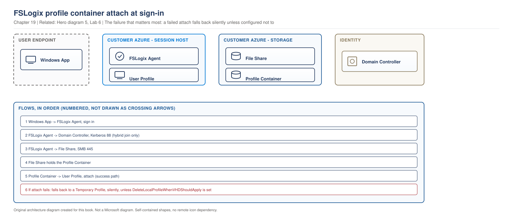

# Chapter 19 - Why Profiles Are the Number One Cause of AVD Failure

> **Book:** Azure Virtual Desktop - Architect to Hands-on Implementation
> **Part V:** FSLogix, Profiles and Storage
> **Technical baseline:** August 2026

---

## Chapter Information

| Item | Detail |
|---|---|
| **Chapter number** | 19 |
| **Objective** | Understand what a Windows profile is, why it breaks in a pooled environment, and what FSLogix actually does about it |
| **Prerequisites** | Chapters 1 to 18. Labs 1 to 4 complete |
| **Dependencies** | Uses the pooled host model from [Chapter 15](ch15-host-pool-design-decisions.md) and the disposable host model from [Chapter 16](ch16-automated-host-pools-session-host-configuration.md) |
| **Estimated lab time** | Storage is built in Lab 5 and FSLogix is configured in Lab 6 |
| **Azure resources required** | None for the chapter |
| **Cost** | $0.00 for the chapter |

---

## What You Will Learn

- What a Windows user profile actually is, and why it was never designed for pooled desktops
- What FSLogix does, in plain terms, and what happens at sign-in and sign-out
- The two container types, and why most environments only need one
- What changes at 100, 1,000 and 5,000 users
- The Kerberos encryption change that can break existing FSLogix file shares
- Three production scenarios in the full format

---

## Why This Matters

If you fix one thing well in an AVD environment, make it profiles.

Profiles cause more incidents than networking, identity and images combined. They are the reason logons take ninety seconds. They are why a user's Outlook is empty on Monday. They are the thing that fails at 9am when 400 people sign in at once.

They are also the highest yield interview topic in this book. An interviewer can tell within two minutes whether a candidate has actually run FSLogix in production, because the people who have talk about locks, bloat and storage performance, and the people who have not talk about registry keys.

---

## 1. What a Windows Profile Is

Start with the thing itself, because a lot of FSLogix confusion comes from not being clear about what is being moved.

A Windows user profile is the folder at `C:\Users\<username>` plus a registry hive. It holds the desktop, documents, application settings, browser data, certificates, Outlook cache, Teams cache and everything else that makes a Windows session feel like yours.

It was designed for one person on one machine, where the profile is written to the local disk and stays there.

### Why that breaks in AVD

In a pooled host pool, a user lands on a different session host every time they sign in. [Chapter 15](ch15-host-pool-design-decisions.md) explained why: the broker picks a host based on load, not on history.

So the profile has to travel. Without something to move it, every sign-in gives the user a brand new profile on a machine they have never used.

### What was tried before

**Roaming profiles.** Windows copies the profile from a file share at sign-in and copies it back at sign-out. It works for small profiles and falls apart quickly. A 20 GB profile means a very long sign-in, sign-out can fail and corrupt the copy on the share, and files that are locked or open do not copy cleanly. Outlook cache files are exactly the kind of large, always-open file that breaks this model.

**Folder redirection.** Point Documents and Desktop at a network share so they never live in the profile. This helps and it does not carry application settings, and it makes every document open a network round trip.

**User Profile Disks.** Closer to the modern answer. A virtual disk per user, attached at sign-in. Tied to a specific RDS collection and less flexible than what replaced it.

The lesson from all three: **copying a profile does not scale. Attaching one does.**

---

## 2. What FSLogix Does

FSLogix takes the profile, puts it inside a virtual hard disk file on a file share, and attaches that disk to the session host at sign-in. Windows then sees a normal local profile.

Microsoft's description: FSLogix profile containers are a complete roaming user profile solution for Windows desktop scenarios, such as Azure Virtual Desktop. Users can sign in to different devices and want their customization and personalization data to roam to whichever device or session they connect to. A profile container redirects the entire Windows user profile into a virtual hard disk stored on a storage provider. The most common storage provider is an SMB file share.

Nothing is copied. The disk is mounted. That single difference is why sign-in goes from ninety seconds to fifteen.

> **OUR ORIGINAL ARCHITECTURE DIAGRAM.** Based on Microsoft's documented FSLogix profile container behaviour.

> **OUR ORIGINAL ARCHITECTURE DIAGRAM.** Created for this book. Not a Microsoft diagram.
> Editable source: [`ch19-fslogix-profile-flow.drawio`](../diagrams/architecture/ch19-fslogix-profile-flow.drawio)



**What this diagram shows.** The path a profile takes at sign-in, and the identity dependency that makes it possible.

**What each component does.** The FSLogix agent runs on the session host and intercepts profile loading. Azure Files holds the container. The container is a virtual disk holding one user's profile. The domain controller issues the Kerberos ticket that lets the session host authenticate to the file share.

**Normal flow.** The user signs in. The agent looks up the container path for that user. It authenticates to the file share, mounts the container, and redirects the local profile path into it. Windows loads the profile as if it were local. At sign-out the container is flushed and detached.

**Important architect decisions.**
- **Storage performance is user experience.** Everything in this diagram waits on the SMB path.
- **Kerberos is a hard dependency.** No ticket, no share, no profile. See [Chapter 7](ch07-identity-architecture-foundations.md#3-entra-kerberos-changed-the-design) for the Entra Kerberos option that removes the domain controller from this path.
- **One container, one user, one session by default.** Concurrency is a separate decision, covered in section 4.

**What happens when something fails.** If the share is unreachable, the container cannot mount and the user gets a temporary profile, which looks like a brand new desktop with nothing on it. If the container is locked by another session, the same thing happens. If storage is slow, the profile mounts but everything is slow afterwards.

**Microsoft managed versus customer managed.** All of this is customer managed. Microsoft runs the broker and gateway. Nothing in this diagram is theirs.

**Official Microsoft reference:** https://learn.microsoft.com/en-us/fslogix/how-to-configure-profile-containers

---

## 3. The Two Container Types

Microsoft is clear that there are two, and equally clear that Cloud Cache is not a third: FSLogix has two primary container types, which can be implemented as part of your profile management solution. Cloud Cache isn't a type of container, but it is an optional configuration for profile and ODFC container types.

**Profile container.** A profile container is the most common container used in an FSLogix solution. A profile container is all the data related to a user's profile, which is directly stored in the VHD(x). A Windows user profile is typically stored in C:\Users\%username%. Nearly all the files and folders found under this location would be included in an FSLogix profile container.

**ODFC container.** The Office Data File Container. FSLogix ODFC containers are a subset to the profile container and are used to redirect specific Microsoft 365 app data into a VHD stored on a storage provider.

### Which to use, and the answer that surprises people

Microsoft's guidance is direct and it is the opposite of what a lot of community content says:

If you've already configured a profile container, you don't need to configure an ODFC container. Profile containers are inclusive of all the benefits and uses found in ODFC containers. Using the ODFC container in a single container configuration is recommended with third party roaming profile solutions. Using the ODFC container in a dual container configuration isn't necessary or recommended.

So:

| Situation | What to use |
|---|---|
| Standard AVD deployment | Profile container only |
| Existing third-party profile solution you are keeping | ODFC container alone, to add Microsoft 365 support |
| Both containers together | Not necessary and not recommended |

**Why people get this wrong.** Splitting Office data into its own container was common advice in the past, and there are still articles recommending it. Microsoft's current position is that the profile container already covers it, and a dual container setup adds a second disk, a second mount, a second thing to lock and a second thing to size.

**When a split still gets discussed.** People suggest it to keep the profile container small. That is treating a symptom. Profile bloat is managed with exclusions, which is covered in [Chapter 21](ch21-fslogix-production-implementation.md), not by adding another container.

`CURRENCY FLAG - verified August 2026. Check the current FSLogix guidance before designing a dual container configuration, because this recommendation has changed over time and older material is still widely circulated.`

**Official Microsoft reference:** https://learn.microsoft.com/en-us/fslogix/concepts-container-types

---

## 4. Concurrency: One User, More Than One Session

By default a container is mounted by one session. If a user needs two sessions at once, that has to be configured.

Microsoft explains the mechanism: concurrent connections are used when a user needs to have more than one session on a single computer using the same profile or ODFC container. Concurrent connections require other registry entries to allow these types of connections. When working with concurrent or multiple connection types, the configuration is different between profile and ODFC containers. Profile containers use a configuration called ProfileType and the ODFC container uses a configuration called VHDAccessMode. Each configuration operates differently.

And a limitation that has to be designed around rather than worked around: OneDrive doesn't support concurrent or multiple connections using the same container, under any circumstance.

**The architect's read.** Concurrency is not a feature to enable by default. It exists for specific cases, such as a user needing a desktop and a published application at the same time. If you find yourself needing it widely, look at why. Usually it means a user is assigned to both a desktop and a RemoteApp group on the same host pool, which is the problem covered in [Chapter 3](ch03-avd-object-model.md#4-preferred-application-group-type) and the answer is to fix the assignment, not to enable concurrency.

---

## 5. The Kerberos Encryption Change

This one is current, real, and capable of breaking a working environment.

`CURRENCY FLAG - verified August 2026. This affects existing deployments, not just new ones.`

Microsoft's warning appears across the FSLogix documentation: an upcoming change to Windows, included in the April 2026 Windows Server update, the default Kerberos encryption type is changing from RC4 to AES-SHA1. File shares hosting FSLogix containers that aren't upgraded to AES-SHA1 might have access issues after this change is applied. To avoid disruption, complete the upgrade to AES-SHA1 before installing the update. Customers who have already upgraded to AES-SHA1 aren't affected.

**Why it matters so much here.** FSLogix authenticates to the file share with Kerberos. If the encryption type on the share is not supported after the update, the container cannot mount. Every user on that share gets a temporary profile at the same time. That is a total outage of the desktop service from the user's point of view, even though every session host is healthy.

**What to do.** Check the encryption type on the file shares hosting containers, upgrade to AES before applying the update, and do it in that order. `[VERIFY BEFORE IMPLEMENTATION]` read the current FSLogix guidance and the linked blog for the exact steps for your storage type, because the procedure differs between Azure Files with AD DS authentication, Azure Files with Entra Kerberos, and a Windows file server.

**The architect's point.** This is a good example of a dependency that lives outside AVD and takes AVD down. Nothing in the AVD configuration changes. A Windows update changes a default, and profiles stop mounting. Keeping a list of external dependencies for your desktop service, and who owns each one, is a real deliverable and this is why.

---

## 6. What Changes With Scale

The same design behaves very differently at different sizes. This is often the interesting part of an interview answer.

### Around 100 users

Almost anything works. A single Azure Files share on Standard tier handles the load. Sign-in storms are small enough that IOPS never binds. Profile bloat is a nuisance rather than a cost.

**What to get right anyway:** exclusions and a storage plan, because retrofitting them later is much harder than starting with them.

### Around 1,000 users

The first real constraints appear.

- **Sign-in storms bind on IOPS.** Four hundred people signing in between 08:45 and 09:15 is a burst of container mounts, and the share is the bottleneck long before the session hosts are.
- **Storage tier becomes a design decision.** Standard may no longer be enough. See [Chapter 20](ch20-profile-storage-architecture.md).
- **Profile size starts to cost real money.** A thousand profiles at 30 GB is 30 TB.
- **Locked and orphaned containers appear regularly** because at this size, hosts crash and sessions end badly often enough to be a weekly event rather than a rare one.

### Around 5,000 users and beyond

- **One share is no longer sensible.** You split users across multiple shares or storage accounts, which introduces a mapping problem: which user goes where, and how does that survive an acquisition.
- **Storage limits become an architecture input,** not a footnote.
- **Regional placement matters.** Profile storage far from session hosts adds latency to every profile operation, and if it crosses a virtual network peering it adds cost on every sign-in. See [Chapter 12](ch12-enterprise-topologies-ip-planning.md#4-cost-honestly).
- **Cleanup has to be automated.** Manual profile management stops being possible.
- **A profile problem is now a major incident,** because it affects thousands of people at once and there is no partial failure mode.

**The pattern.** Profiles scale badly in a specific way. Nothing degrades gradually. It works, and then at some load it stops working for everyone at once, usually at 9am.

---

## 7. Architect's Reality Check

**What people commonly get wrong.** They treat FSLogix as a checkbox on the session host and never think about the storage behind it. The registry settings are the easy part. The design work is sizing storage for a sign-in storm, planning exclusions, and deciding what happens when a container is locked.

**What I would check first in production.** Logon duration, broken into phases. If profile mount is the slow phase, the problem is storage or the container. If mount is fast and the desktop is still slow, it is not profiles at all and I have just saved myself a day. See [Project 15](../scenarios/project-15-production-troubleshooting.md), the 10-layer isolation method.

**What I would ask the customer.** How large are profiles today, what is in them, and what is the biggest simultaneous sign-in you have ever seen. The last question gets a better answer than "how many users do you have", because sizing storage is about the burst, not the total.

**What decision I would make as an architect.** Profile container only, no dual container, exclusions from day one, storage sized for the sign-in storm rather than the steady state, and profile storage in the same virtual network as the session hosts. Then I would write down the plan for locked containers before go-live, because it will happen in the first month.

**What I would say in an interview.** That profiles are where AVD deployments actually fail, that the failure mode is sudden rather than gradual, and that I size storage for the 9am burst rather than for capacity. Then I would give the temporary profile example, because everyone who has run FSLogix recognises it immediately.

---

## 8. Production Scenarios

### Scenario 1: Everyone gets an empty desktop on Monday morning

**Problem.** At 08:50 on Monday, users across a 1,200 user deployment sign in to a desktop with no files, no settings and no Outlook data.

**Symptoms.** Sessions connect normally. The desktop loads. Everything personal is missing. Users who sign out and back in get the same result. Session hosts show Available and CPU is low.

**Business impact.** Around 900 users unable to work normally. Finance cannot access Outlook cached data during month end. Service desk takes 300 calls in forty minutes. This is a full service outage in the eyes of the business even though every AVD component is technically healthy.

**Initial assumption.** Temporary profiles caused by containers failing to mount. That points at the file share rather than the session hosts, because the hosts are healthy and the failure is universal.

**Investigation.**

Confirm the profile type on an affected host:

```bash
az vm run-command invoke -g rg-avd-hosts-lab-eus2-01 -n <vm> \
  --command-id RunPowerShellScript \
  --scripts "Get-ChildItem 'C:\Users' | Select-Object Name, CreationTime | Sort-Object CreationTime -Descending | Select-Object -First 5"
```

A cluster of profile folders created in the last hour is the signature of temporary profiles.

Then read the FSLogix logs, which are the authoritative source:

*Event Viewer > Applications and Services Logs > Microsoft > FSLogix > Apps > Operational*, and the text logs under `C:\ProgramData\FSLogix\Logs\Profile`.

Then test the share path directly from the session host:

```bash
az vm run-command invoke -g rg-avd-hosts-lab-eus2-01 -n <vm> \
  --command-id RunPowerShellScript \
  --scripts "Test-NetConnection <storageaccount>.file.core.windows.net -Port 445; net use"
```

**Evidence.** The FSLogix log shows the container failing to attach with an access error. Port 445 is reachable, which rules out a network block. The failure is authentication, not connectivity.

**Root cause.** The file share had not been upgraded to AES-SHA1 before the April 2026 Windows Server update was applied to the session hosts. Kerberos authentication to the share stopped working, so no container could mount.

**Resolution.** Complete the AES-SHA1 upgrade on the file share, following the current Microsoft guidance for the storage type in use. Once authentication works, containers mount on the next sign-in.

Do not delete or recreate profile containers to try to fix this. The containers are fine. The authentication path is broken, and deleting containers destroys user data for no reason.

**Validation.** A test user signs in and their real profile loads, confirmed by the FSLogix log showing a successful attach rather than by asking the user. Then confirm on a second host, because one host proves the share works, not that every host does.

**Prevention.** Keep a list of external dependencies for the desktop service and who owns each one. Kerberos encryption on the profile share belongs on it. Add a pre-flight check to the patching runbook for updates that change authentication defaults. Alert on temporary profile creation, because it is the earliest possible signal.

**Architect lesson.** The most damaging AVD outages come from dependencies outside AVD. Every session host was healthy and the service was unusable. An architect owns the dependency list, not just the components.

**Interview lesson.** This story demonstrates that you understand the identity path underneath FSLogix rather than just the registry configuration. Mentioning that you would not delete containers shows judgement under pressure, which is what the question is really testing.

### Scenario 2: Sign-in takes four minutes at 9am and thirty seconds at 11am

**Problem.** A 1,400 user call centre reports very slow sign-in at shift start. The same users sign in quickly later in the day.

**Symptoms.** Sign-in duration varies with time of day. No errors. No temporary profiles. Session host CPU is moderate. Users describe it as the desktop taking minutes to appear.

**Business impact.** Roughly 400 agents lose between two and four minutes at each shift start. Across three shifts that is several hours of paid time per day, and it delays queue coverage at the busiest moment.

**Initial assumption.** Storage IOPS during the sign-in storm. The time-of-day pattern and the absence of errors both point at contention rather than fault.

**Investigation.**

Break logon time into phases rather than treating it as one number. AVD Insights reports logon duration, and the FSLogix logs give the container attach time specifically.

```kusto
WVDConnections
| where TimeGenerated > ago(7d)
| where State == "Connected"
| extend Hour = datetime_part("hour", TimeGenerated)
| summarize Sessions = count() by Hour
| order by Hour asc
```

`[VERIFY BEFORE IMPLEMENTATION]` Confirm the diagnostic table names in your workspace.

Then look at storage metrics for the same window: *Azure portal > Storage account > Monitoring > Metrics*, with transactions, success server latency and, on premium file shares, throttling.

**Evidence.** Sessions cluster heavily between 08:45 and 09:10. Storage latency rises in the same window and returns to normal afterwards. Container attach time in the FSLogix logs tracks the latency curve.

**Root cause.** The file share was sized for total capacity rather than for burst IOPS. At shift start, hundreds of containers mount within minutes and the share becomes the bottleneck.

**Resolution.** Move to a storage tier with the required IOPS, or split users across multiple shares to spread the load. Sizing is covered in [Chapter 20](ch20-profile-storage-architecture.md). Reducing profile size through exclusions also helps, because a smaller container mounts faster, and that is covered in [Chapter 21](ch21-fslogix-production-implementation.md).

**Validation.** Measure sign-in duration at shift start for a full week after the change, not on the day. Compare against the same window before the change. Storage latency should stay flat through the burst.

**Prevention.** Size profile storage from the sign-in storm rather than from user count. Alert on storage latency and on logon duration, and treat a rising trend as capacity work rather than waiting for complaints.

**Architect lesson.** Profile storage is sized by burst, not by capacity. The number that matters is how many users sign in during the busiest fifteen minutes, and that number is rarely in the requirements document unless you ask for it.

**Interview lesson.** Answering a slow logon question with "I would decompose logon time and look at container attach separately" immediately separates you from candidates who suggest resizing session hosts. The time-of-day pattern is the detail that makes the story credible.

### Scenario 3: One user cannot sign in, and the container is locked

**Problem.** A single user cannot get a working desktop. They get a temporary profile every time. Everyone else is fine.

**Symptoms.** Consistent for one user across different session hosts. Started after their session ended abnormally when a host was rebuilt during maintenance.

**Business impact.** One user unable to work. Low impact individually, and it happens often enough at scale to matter. In a 5,000 user estate this is a daily ticket, which makes the handling procedure worth getting right.

**Initial assumption.** The container is still locked by a session that no longer exists. FSLogix mounts a container exclusively by default, and an abnormal session end can leave the lock behind.

**Investigation.**

Check the FSLogix log on the host where the user is currently landing, under `C:\ProgramData\FSLogix\Logs\Profile`, for an attach failure indicating the container is in use.

Then look at the container file on the share and check for an open handle. On Azure Files, open handles can be listed and closed:

```bash
az storage file handle list \
  --account-name <storageaccount> \
  --share-name profiles \
  --path "<sid>_<username>" \
  --recursive \
  --auth-mode login -o table
```

`[VERIFY BEFORE IMPLEMENTATION]` Confirm the current parameters and required permissions for handle management on your Azure Files configuration.

**Evidence.** An open handle exists on the container file from a session host that no longer exists, or from a session that ended abnormally.

**Root cause.** The container lock was not released when the session ended, so no new session can mount it.

**Resolution.** Close the stale handle, then have the user sign in again.

```bash
az storage file handle close \
  --account-name <storageaccount> \
  --share-name profiles \
  --path "<sid>_<username>" \
  --handle-id <handle-id> \
  --auth-mode login
```

**Warning.** Only close a handle you have confirmed is stale. Closing a handle belonging to a live session will interrupt that user and can leave the container inconsistent. Confirm the source of the handle before acting.

**Validation.** The user signs in and the FSLogix log shows a successful attach. Confirm the profile contains their data rather than accepting that the desktop loaded.

**Prevention.** Set a sign-out policy for disconnected sessions so sessions end cleanly rather than being killed with the host. Follow the drain, remove, rebuild sequence in [Chapter 18](ch18-session-host-lifecycle-hybrid.md#4-patching-strategy), which includes messaging and signing users out before removing a host. Document the handle check as a service desk procedure, since at scale this is routine work rather than an incident.

**Architect lesson.** Abnormal session ends are inevitable in a disposable host model, so the design has to include a routine way to clear locks. Treating it as an incident each time wastes engineering effort on something that will happen every day.

**Interview lesson.** Locked containers are a topic only people who have run FSLogix in production talk about. Mentioning the maintenance link, that killing hosts with active sessions creates tomorrow's locked profiles, shows you connect operations to root cause.

---

## 9. The Architect's Four Questions

**What do I check first?** Whether the user has a temporary profile. That single fact splits the problem in two. A temporary profile means the container did not mount, which is storage, permissions or a lock. A real profile that is slow means storage performance or profile size.

**What can I safely change now?** Reading FSLogix logs. Checking share connectivity. Listing open handles. Testing with a single user account.

**What must not be changed blindly?**
- Deleting a profile container. That is user data and it is usually not the fix.
- Closing a file handle without confirming it is stale.
- Changing the container path, which orphans every existing profile.
- Enabling concurrency across an estate to work around an assignment problem.
- Applying a Windows update that changes authentication defaults before checking the share.

**When do I escalate to Microsoft?** When containers fail to attach with connectivity and permissions proven correct, and the FSLogix logs show an error you cannot map to a documented cause. Collect: the FSLogix log files from the affected host, the exact error and timestamp in UTC, the storage account type and authentication method, the container path, whether it affects one user or all users, and the FSLogix agent version. The one user versus all users distinction is the first thing support will ask, because it separates a container problem from a platform problem.

---

## 10. Common Mistakes

- Treating FSLogix as a session host setting and ignoring the storage design behind it.
- Configuring both a profile container and an ODFC container when Microsoft recommends against it.
- Sizing profile storage by capacity instead of by sign-in burst.
- Deleting a container to fix a mount failure.
- Enabling concurrency instead of fixing an application group assignment.
- Assuming a healthy session host means a healthy desktop.
- Applying Windows updates that change Kerberos defaults without checking the file share first.
- Killing session hosts with active users, then dealing with locked containers the next morning.
- Leaving exclusions until profiles are already too large.

---

## 11. Interview Preparation

### Q53. Why does AVD need FSLogix?

**Simple answer**
In a pooled host pool a user lands on a different session host every time, so their profile has to travel with them. FSLogix puts the profile in a virtual disk on a file share and attaches it at sign-in instead of copying it.

**Strong senior architect answer**
"A Windows profile was designed for one person on one machine. Pooled AVD breaks that assumption, because the broker sends the user to whichever host is least loaded. Roaming profiles tried to solve it by copying the profile in and out, and that falls apart as soon as profiles are large or files are locked, which Outlook guarantees. FSLogix attaches a virtual disk instead of copying, so sign-in time stops scaling with profile size. The design consequence people miss is that this makes profile storage the single most important dependency in the environment. Every user's sign-in goes through it, and when it fails, it fails for everyone at once with no partial failure mode."

**Follow-up you should expect**
"Would you use profile container, ODFC, or both?" Profile container alone for a standard deployment. ODFC alone if there is an existing third-party profile solution being kept. Microsoft explicitly does not recommend running both, and a dual container setup adds a second disk to mount, lock and size.

### Q54. Users report slow sign-in. Walk me through it.

**30 second answer**
"I would decompose logon time rather than treat it as one number. If the slow phase is container attach, it is profiles, and I would look at storage latency and profile size. If attach is fast and the desktop is still slow, it is not profiles and I would look at the host and the applications. Guessing between those two is where people lose days."

**2 minute answer**
Add the pattern recognition. If it is slow at shift start and fine later, that is a sign-in storm hitting storage IOPS, and the fix is a storage tier or splitting users across shares, not bigger session hosts. If it is slow for everyone all the time, look at profile size and exclusions. If it is slow for one user, look at their container size and whether it is bloated with browser or Teams cache. Then the measurement point: profile storage should be sized from the busiest fifteen minutes of sign-ins, not from user count, and that number is usually not in the requirements unless you ask for it.

**Deep dive answer**
Profiles do not degrade gradually at scale, and that behaviour is worth naming explicitly. The share handles the load until it does not, and then it fails for everyone at 9am. So the monitoring has to be on storage latency and logon duration trend rather than on errors, because there are no errors until the failure. Then the design response at scale: split users across shares above a few thousand, keep profile storage in the same virtual network as session hosts to avoid peering cost and latency, and automate cleanup because manual profile management stops being possible.

### Q55. What would you check first when a user has an empty desktop?

**Strong answer**
"Whether it is a temporary profile, which I can see from a freshly created folder under C:\Users and from the FSLogix log on that host. That tells me the container did not mount, and then there are three realistic causes: the share is unreachable, permissions or authentication are wrong, or the container is locked by a stale session. Connectivity I can test with a port check on 445. Authentication shows in the FSLogix log. A lock I can confirm by listing open handles on the container file. The thing I would not do is delete the container, because that is the user's data and it is almost never the fix."

---

## 12. Key Takeaways

- A Windows profile was designed for one user on one machine. Pooled AVD breaks that assumption.
- Copying a profile does not scale. Attaching a virtual disk does.
- FSLogix mounts the profile from a file share at sign-in and detaches it at sign-out.
- Two container types. Profile container for almost every deployment, ODFC only alongside a third-party profile solution.
- Microsoft does not recommend running both containers together.
- Cloud Cache is not a container type. It is an optional configuration.
- Concurrency is configured through ProfileType for profile containers and VHDAccessMode for ODFC, and OneDrive does not support it at all.
- The April 2026 Kerberos encryption change can stop containers mounting on shares that have not been upgraded to AES-SHA1.
- Profile storage is sized by sign-in burst, not by capacity.
- Profile failures are sudden and total. There is no partial failure mode.

---

## 13. Official References

- What is FSLogix - https://learn.microsoft.com/en-us/fslogix/overview-what-is-fslogix
- Types of containers - https://learn.microsoft.com/en-us/fslogix/concepts-container-types
- Configure profile containers - https://learn.microsoft.com/en-us/fslogix/how-to-configure-profile-containers
- Configure ODFC containers - https://learn.microsoft.com/en-us/fslogix/how-to-configure-odfc-containers
- Concurrent or multiple connections to a single container - https://learn.microsoft.com/en-us/fslogix/concepts-multi-concurrent-connections
- FSLogix container storage options - https://learn.microsoft.com/en-us/fslogix/concepts-container-storage-options

---

## Chapter Close

**What was completed**
You understand what a profile is, why it breaks in pooled AVD, what FSLogix does about it, and how the problem changes as the environment grows.

**What you should test**
On any AVD environment you can reach, find the FSLogix log directory and read one successful sign-in from start to finish. Knowing what a good attach looks like is what lets you recognise a bad one.

**What comes next**
Chapter 20 covers profile storage architecture. Azure Files against Azure NetApp Files, the two-layer permission model, and sizing from the sign-in storm.

**Interview preparation carried forward**
Q54 is one of the highest value questions in this book. Decomposing logon time, rather than guessing at a cause, is the thing that marks an experienced answer.

---

## Chapter Self-Review

**Pass 1, technical verification.** The profile container definition and behaviour, the two container types with Cloud Cache excluded as a type, the recommendation against dual container configurations, the guidance that ODFC alone suits third-party profile solutions, the concurrency configuration split between ProfileType and VHDAccessMode, the OneDrive concurrency limitation, and the April 2026 Kerberos RC4 to AES-SHA1 change were all verified against the current FSLogix overview, container types, profile container configuration, ODFC configuration and concurrent connections pages. The Azure CLI file handle commands carry a verification marker because parameters and required permissions vary by authentication configuration. KQL carries a verification marker for table naming.

**Pass 2, readability.** The chapter opens with what a profile is, because a reader cannot evaluate FSLogix without it. Historical approaches are covered briefly and only to establish why attaching beats copying. The scale section is written as three sizes rather than as prose, because the change between them is the teaching point. Long sentences split. No long dash characters.

**Pass 3, diagram review.** One diagram, showing the sign-in path and the identity dependency, because that dependency is what makes the Kerberos scenario understandable. Every node is a component name. Container types are a table, not a diagram, since the content is a comparison. Checked against the twelve question review in the [diagram standard](../DIAGRAM-STANDARD.md).

**Scenario format.** All three scenarios use the extended format introduced with this chapter in the [operations standard](../OPERATIONS-AND-TROUBLESHOOTING-STANDARD.md), including business impact, architect lesson and interview lesson.

**Consistency check against earlier chapters.** The concurrency discussion references the preferred application group type problem from [Chapter 3](ch03-avd-object-model.md#4-preferred-application-group-type) rather than restating it. The locked container prevention references the drain, remove, rebuild sequence in [Chapter 18](ch18-session-host-lifecycle-hybrid.md#4-patching-strategy). The Entra Kerberos alternative references [Chapter 7](ch07-identity-architecture-foundations.md#3-entra-kerberos-changed-the-design) and is consistent with it. The peering cost point is consistent with [Chapter 12](ch12-enterprise-topologies-ip-planning.md#4-cost-honestly). No earlier chapter required correction.

| Check | Result |
|---|---|
| Technical accuracy | Verified against current Microsoft FSLogix pages |
| Current capability verified | Yes, August 2026, with two currency flags |
| Supported versus unsupported separated | Yes. Dual container recommendation and OneDrive concurrency limit stated explicitly |
| Commands, portal paths, CLI, KQL, log locations | Exact, with verification markers where configuration varies |
| Production scenarios | Three, in the extended format |
| Architect's Reality Check | Section 7 |
| Architect's four questions | Section 9 |
| Scale behaviour at 100, 1,000 and 5,000 users | Section 6 |
| Diagrams | One, deliberately, to the locked standard |
| Architecture consistency | Consistent with Chapters 3, 7, 12, 15, 16 and 18 |
| Cost statements | Profile size cost at scale and peering cost referenced |
| Security implications | Kerberos dependency and the risk of closing live handles |
| Interview answers | Read aloud |
| Duplicate content | Storage sizing deferred to Chapter 20, exclusions to Chapter 21 |
| Simple English | Reviewed |
| Long dash characters | None |
