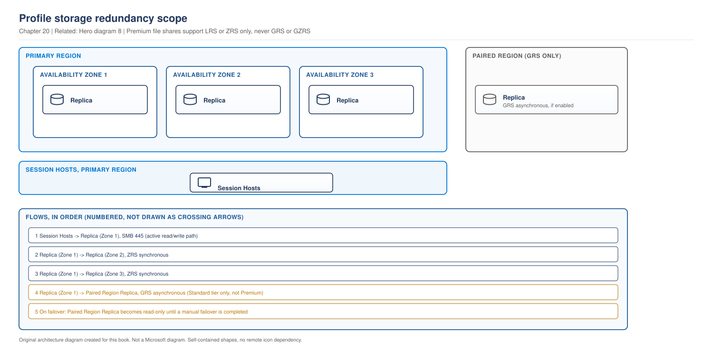
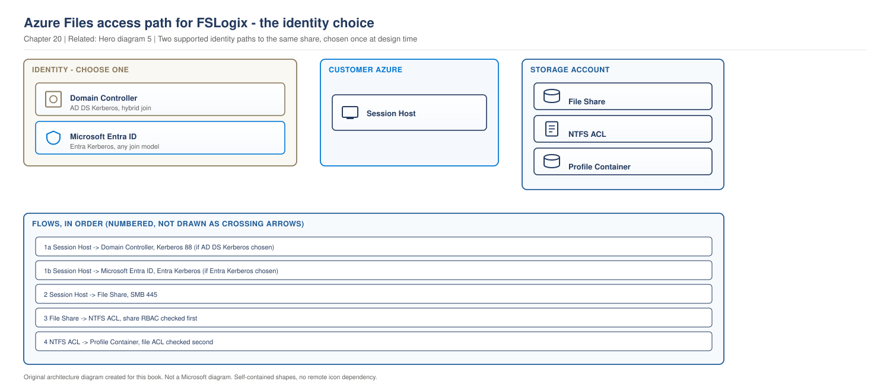

# Chapter 20 - Profile Storage Architecture

> **Book:** Azure Virtual Desktop - Architect to Hands-on Implementation
> **Part V:** FSLogix, Profiles and Storage
> **Technical baseline:** August 2026

---

## Chapter Information

| Item | Detail |
|---|---|
| **Chapter number** | 20 |
| **Objective** | Choose a storage platform for FSLogix profiles, size it from the sign-in storm, and get the permission model right the first time |
| **Prerequisites** | Chapters 1 to 19. Labs 1 to 4 complete |
| **Dependencies** | Builds on the profile theory in [Chapter 19](ch19-why-profiles-cause-avd-failure.md), the identity models in [Chapter 7](ch07-identity-architecture-foundations.md) and the placement rules in [Chapter 17](ch17-session-host-sizing-compute-selection.md) |
| **Estimated lab time** | Storage is built in Lab 5 |
| **Azure resources required** | None for the chapter |
| **Cost** | $0.00 for the chapter. Lab 5 creates a storage account with real cost, stated there |

---

## What You Will Learn

- Azure Files against Azure NetApp Files, decided from requirements rather than benchmarks
- How to size storage from IOPS at sign-in rather than from capacity
- The two-layer permission model, and why getting one layer right is not enough
- The identity constraints that rule options in or out before performance matters
- The concurrency limit on Azure NetApp Files volumes that shapes large designs
- Why choosing premium SSD for IOPS removes geo-redundancy as an option
- Three production scenarios in the full format

---

## Why This Matters

[Chapter 19](ch19-why-profiles-cause-avd-failure.md) established that profiles are where AVD fails. This chapter is where you decide how badly.

Storage is the single dependency every user hits at every sign-in. It is also the decision most often made on price, and price is the wrong first question. Identity constraints rule options out before performance is even relevant, and most teams discover that in the wrong order.

---

## 1. Start With Identity, Not Performance

Before comparing tiers, check what your identity model allows. This eliminates options faster than any benchmark.

**Azure NetApp Files requires Kerberos backed by a directory.** Microsoft states it plainly: FSLogix profile containers on Azure NetApp Files require Kerberos authentication and therefore can only be accessed by users authenticating from Active Directory Domain Services or Microsoft Entra Domain Services. And more directly: Azure NetApp Files does not currently support FSLogix profile access using Entra-only identities, as Kerberos authentication without AD DS is not supported.

What it does support: Azure NetApp Files can store FSLogix profiles with Microsoft Entra ID joined or Microsoft Entra hybrid joined session hosts when user identities are backed by AD DS, such as in hybrid identity scenarios where AD DS is the authoritative source and identities are synchronized to Entra ID.

**So the first question is not which is faster. It is whether you have AD DS at all.**

| Identity model | Azure Files | Azure NetApp Files |
|---|---|---|
| AD DS or hybrid identity | Supported | Supported |
| Entra-only, cloud identities | Supported with Entra Kerberos | **Not supported** |

If you built the cloud-native design from [Chapter 7](ch07-identity-architecture-foundations.md#3-entra-kerberos-changed-the-design) with no domain controller, Azure NetApp Files is out. That is a design constraint, not a preference, and it is better found now than during a proof of concept.

`CURRENCY FLAG - verified August 2026. Identity support for profile storage has changed more than once. [VERIFY BEFORE IMPLEMENTATION] confirm the current position for your cloud and identity model.`

---

## 2. The Platform Comparison

Microsoft publishes a full comparison table. The figures below are from it.

| | Azure Files | Azure NetApp Files |
|---|---|---|
| Use case | General purpose | General purpose to enterprise scale |
| Regional availability | All regions | Select regions |
| Performance ceiling | Up to max 100K IOPS per share with 10 GBps per share at about 3 ms latency | Up to max 460K IOPS per volume with 4.5 GBps per volume at about 1 ms latency |
| Capacity | 100 TiB per share, up to 5 PiB per general purpose account | 100 TiB per volume, up to 12.5 PiB per NetApp account |
| Minimum footprint | Minimum share size 1 GiB | Minimum capacity pool 2 TiB, minimum volume size 100 GiB |
| Redundancy | Locally redundant, zone-redundant, geo-redundant, geo-zone-redundant | Locally redundant, zone-redundant with cross-zone replication, geo-redundant with cross-region replication |
| Backup | Azure backup snapshot integration | Azure NetApp Files snapshots and backup |

Two entries decide most designs.

**The minimum footprint.** Azure NetApp Files starts at a 2 TiB capacity pool. For 200 users that is a large fixed cost for a small workload, and it is why small deployments rarely use it regardless of performance.

**Regional availability.** Azure Files is everywhere. Azure NetApp Files is not. In a multi-region design that alone can decide the answer, because running two different storage platforms in two regions doubles the operational surface.

**The latency difference is real.** Roughly 1 ms against roughly 3 ms sounds trivial. A profile mount is thousands of operations, so it is not trivial at sign-in, and it compounds during a storm.

### How Azure NetApp Files performance actually works

This surprises people used to Azure Files. Microsoft explains: Azure NetApp Files volumes are organized in capacity pools. Volume performance is defined by the service level of the hosting capacity pool. Three performance levels are offered, ultra, premium and standard. Azure NetApp Files performance is a function of tier times capacity. More provisioned capacity leads to a higher performance budget, which likely results in a lower tier requirement, providing a more optimal total cost of ownership.

So you can buy performance by provisioning more capacity at a lower tier, rather than by moving up a tier. That is a genuine cost lever and it is easy to miss.

### The concurrency limit that shapes large designs

To ensure optimal performance and scalability, limit the number of concurrent profiles actively accessing FSLogix profile containers on a single Azure NetApp Files regular volume to 3,000. Exceeding this limit can significantly increase latency. If your scenario requires more than 3,000 concurrent users, consider distributing users across volumes with each volume in a different availability zone.

For a 5,000 user estate, that is an architecture instruction. You need multiple volumes and a mapping of users to volumes, and that mapping has to survive joiners, leavers and acquisitions.

**Official Microsoft reference:** https://learn.microsoft.com/en-us/azure/virtual-desktop/store-fslogix-profile

---

## 3. Sizing From the Sign-in Storm

Capacity is the easy number. IOPS at sign-in is the one that decides user experience.

Microsoft gives a usable starting point: the example in this table is of a single user, but can be used to estimate requirements for the total number of users in your environment. For example, you'd need around 1,000 IOPS for 100 users, and around 5,000 IOPS when signing in and signing out.

Read that carefully. **Steady state is roughly 10 IOPS per user. Sign-in and sign-out is roughly 50 IOPS per user.** A factor of five, and it lands in a fifteen minute window.

### The method

1. **Count concurrent users**, not total users.
2. **Estimate the busiest fifteen minutes.** How many sign in at once at shift start.
3. **Apply the sign-in figure** to that burst population, not to the whole estate.
4. **Apply the steady state figure** to everyone else who is already working.
5. **Add both** to get the peak requirement.
6. **Size capacity separately**, from average profile size times user count plus growth headroom.
7. **Validate with a pilot** and correct the model.

### Worked example, Northwind task workers

| Input | Value | Type |
|---|---|---|
| Concurrent users at peak | 1,200 | Measurement |
| Signing in during the busiest 15 minutes | 500 | Assumption to be tested |
| IOPS for the sign-in burst | 500 × 50 = 25,000 | Calculation |
| IOPS for users already working | 700 × 10 = 7,000 | Calculation |
| Peak IOPS requirement | 32,000 | Calculation |
| Average profile size | 20 GB | Measurement |
| Capacity for 1,400 users | 28 TB plus headroom | Calculation |

The peak IOPS number is what selects the platform and tier. The capacity number is almost an afterthought, which is the opposite of how most people approach it.

**Note what happens if you size from capacity.** 28 TB of Standard storage is cheap and will not survive 09:00. That is the mistake, and it is invisible until the day it is not.

---

## 4. Redundancy: The Decision Most Designs Skip

Choosing a tier and sizing it is only half of the storage decision. The other half is what the storage survives, and this is where the tier you picked can quietly remove the option you assumed you had.

> **OUR ORIGINAL ARCHITECTURE DIAGRAM.** Created for this book. Not a Microsoft diagram.
> Editable source: [`ch20-profile-storage-redundancy.drawio`](../diagrams/architecture/ch20-profile-storage-redundancy.drawio)



**What this diagram shows.** The scope of each redundancy option. LRS keeps three replicas inside one datacenter, ZRS spreads them across three availability zones in the region, and GRS or GZRS adds an asynchronous copy in the paired region.

**What each component does.** Session hosts read and write to the primary replica set over SMB. ZRS keeps the zone replicas synchronous, so a zone failure is transparent. The paired region copy is asynchronous and is drawn dashed because it is not usable until you fail over.

**Normal traffic flow.** Everything users do goes over the heavy path to the primary region. The geo replica carries no user traffic at all.

**Architect's view.** For AVD profiles, ZRS is the default worth arguing for. A zone failure with LRS takes the whole share down and every profile with it. ZRS makes that survivable and costs less than most people expect relative to the impact.

**Failure points.**

| Event | LRS | ZRS | GRS or GZRS |
|---|---|---|---|
| Drive or rack failure | Survives | Survives | Survives |
| Datacenter or zone failure | Profiles unavailable | Survives | Survives with GZRS |
| Regional outage | Profiles unavailable | Profiles unavailable | Recoverable after failover |

**Official Microsoft reference:** https://learn.microsoft.com/en-us/azure/storage/files/files-redundancy

### The constraint that decides it for you

This is the detail that catches most designs, because it links two decisions people make separately.

Microsoft is explicit: Azure Files only supports geo-redundancy (GRS or GZRS) for HDD file shares. SSD file shares must use LRS or ZRS. Additionally, unlike other Azure storage services, Azure Files doesn't support read access to data in the secondary region without initiating a failover. RA-GRS and RA-GZRS aren't supported.

Read that alongside [section 3](#3-sizing-from-the-sign-in-storm). If your sign-in burst calculation pushes you to premium SSD file shares for the IOPS, you have just ruled out geo-redundancy. Those are not two independent choices. Performance and geo-redundancy pull against each other on Azure Files.

That leaves three honest positions for a cross-region requirement:

1. **Standard HDD shares with GRS or GZRS.** Geo-redundancy is available. You accept lower performance, so the sign-in burst has to fit inside what standard delivers.
2. **Premium SSD with ZRS, and cross-region handled another way.** Cloud Cache with a provider in each region, covered in [Chapter 22](ch22-profile-operations-failure-recovery.md#1-what-cloud-cache-actually-does), or an accepted position that profiles are rebuilt rather than recovered in a regional event.
3. **Azure NetApp Files with cross-region replication**, if the identity model allows it. See [section 1](#1-start-with-identity-not-performance).

There is no option that gives you premium SSD performance and native geo-redundancy on the same Azure Files share. State that clearly in the design document rather than letting someone assume it later.

`CURRENCY FLAG - verified August 2026. Geo-redundant standard SMB shares with the large file shares feature now support up to 100 TiB, where geo-redundant shares were previously capped much lower. That changes whether option 1 is viable for a large estate, so check the current capacity and IOPS limits rather than assuming the old constraint.`

### The failover detail people miss

Even with GRS, there is no read access to the secondary copy until you initiate a failover. That is different from other Azure storage services, and it shapes your DR runbook.

You cannot quietly point a second region's host pool at the geo replica and test it. A DR test means an actual failover, which means planning, an agreed maintenance window and a failback plan. [Project 14](../scenarios/project-14-disaster-recovery.md) covers testing properly, and the point to take now is that this constraint belongs in the DR design from the start.

### What I would choose

| Situation | Redundancy |
|---|---|
| Single region, premium SSD for IOPS | ZRS |
| Single region, cost sensitive, small estate | ZRS. LRS only where profiles are genuinely reconstructable |
| Cross-region requirement, moderate IOPS | Standard HDD with GZRS |
| Cross-region requirement, high IOPS | Premium with ZRS, plus Cloud Cache or an accepted rebuild position |
| Anything regulated | ZRS at minimum, with the recovery position written down and tested |

LRS deserves one sentence of defence. It is a legitimate choice where a profile holds nothing that cannot be reconstructed, for example a task worker estate with documents in OneDrive and settings that take ten minutes to redo. That is a decision to make deliberately, not a default to accept because it was cheapest in the dropdown.

---

## 5. The Two-Layer Permission Model

This is where Azure Files deployments fail, and the reason is that two separate permission systems both have to be right.

> **OUR ORIGINAL ARCHITECTURE DIAGRAM.** Created for this book. Not a Microsoft diagram.
> Editable source: [`ch20-azure-files-permission-layers.drawio`](../diagrams/architecture/ch20-azure-files-permission-layers.drawio)



**What this diagram shows.** Two permission checks in series, plus the identity path that makes either possible.

**What each component does.** The share RBAC role controls whether an identity may reach the file share at all. NTFS permissions control what that identity may do to files and folders inside it. The domain controller or Entra ID issues the Kerberos ticket used for authentication.

**Normal flow.** The session host authenticates with Kerberos. Azure Files checks the share level RBAC role assignment. If that passes, Windows checks NTFS permissions on the folder and file. Only when both pass does the container mount.

**Architect's view.** Both layers must allow the operation. Getting one right and the other wrong produces the same symptom as getting both wrong, which is a temporary profile and no useful error for the user. Most teams configure the RBAC role, see access fail, and assume the role is wrong. It usually is not.

**Failure points.**

| Layer | Symptom | Where to look |
|---|---|---|
| Kerberos | All users fail at once | FSLogix log shows an authentication error |
| Share RBAC | All users fail at once | Storage account IAM assignments |
| NTFS | One user or one folder fails | Folder ACLs on the share |
| Both correct, share unreachable | All users fail at once | Network path and private endpoint DNS |

**Design rule.** Users need permission to their own profile folder and nothing else. Administrators need enough to support, which is not full control over every user's data. Write the permission model down before building it, because retrofitting permissions across thousands of folders is unpleasant.

**Official Microsoft reference:** https://learn.microsoft.com/en-us/fslogix/concepts-container-storage-options

---

## 6. Architect Decision: Azure Files or Azure NetApp Files

**Requirement.** Store FSLogix profile containers for a defined user population, with acceptable sign-in performance and a resilience level the business accepts.

**Option A, Azure Files.**

**Option B, Azure NetApp Files.**

| Dimension | Azure Files | Azure NetApp Files |
|---|---|---|
| Pros | Available in all regions, small minimum footprint, familiar operating model, supports Entra-only identities with Entra Kerberos | Higher IOPS ceiling, lower latency, performance can be bought through capacity, strong snapshot and backup story |
| Cons | Lower ceiling, higher latency, per-share limits reached sooner | Select regions only, 2 TiB minimum pool, requires AD DS or Entra Domain Services, 3,000 concurrent profiles per regular volume |
| Operational impact | Storage account and share. Most teams already know it | A capacity pool and volume model that is new to many teams and needs its own runbook |
| Security impact | Two-layer permission model, private endpoints available | Runs natively in the virtual network, which suits designs that avoid public endpoints |
| Cost impact | Pay for what you provision, low entry point | Higher entry cost, and the tier times capacity model can make large estates competitive |
| Scalability impact | Split across shares and accounts as you grow | Split across volumes, with the 3,000 concurrent profile guidance as the trigger |
| Failure impact | A share problem affects everyone on it | A volume problem affects everyone on it. Cross-zone replication is available |

**Recommendation.** Azure Files for most deployments up to a few thousand users, particularly where identity is Entra-only or the design spans regions where Azure NetApp Files is unavailable. Azure NetApp Files where sign-in performance at scale is the binding constraint, AD DS exists, and the region supports it.

**When not to use the recommendation.** Do not choose Azure Files by default for a large call centre with a hard shift start. That workload is the one where the latency difference is felt by every agent every day. Equally, do not choose Azure NetApp Files for 300 users because it benchmarks better. The minimum capacity pool will dominate the bill for no user benefit.

**Real-world example.** A 4,000 user manufacturer with hybrid identity, one primary region and a 900 user shift start chose Azure NetApp Files for the two pooled host pools with shift patterns, and Azure Files for the personal pools used by engineers and developers. Two platforms is more operational surface, and it was justified because the workloads have genuinely different profiles. The decision was written down with that reasoning, so the next architect does not undo it.

---

## 7. How This Changes With Scale

**Around 100 users.** One Azure Files share. Standard tier is usually enough because sign-in bursts are small. Azure NetApp Files is hard to justify against its minimum pool size. Get exclusions and the permission model right now, because both are painful to retrofit.

**Around 1,000 users.** The sign-in storm becomes the sizing driver. Premium Azure Files or Azure NetApp Files enters the conversation. Profile size starts to matter financially at roughly 20 TB. Backup and recovery need a real answer rather than a snapshot nobody has tested.

**Around 5,000 users and beyond.** One share or volume is no longer sensible. On Azure NetApp Files the 3,000 concurrent profile guidance forces multiple volumes across availability zones. On Azure Files you split across shares or accounts to stay inside per-share limits. Either way you now own a user to storage mapping, and that mapping is a system in itself. It needs to be automated, documented and able to survive an acquisition. Regional placement matters more, because profile storage far from session hosts adds latency to every operation and cost on every peering crossing.

**The pattern.** Storage design does not scale by multiplying. It changes shape at each step, from one share, to a sized share, to a set of shares with a mapping problem.

---

## 8. Architect's Reality Check

**What engineers commonly get wrong.** They size storage from capacity. Capacity is the cheap number. IOPS during the sign-in burst is what users feel, and it is roughly five times the steady state figure.

**What I would check first in production.** Storage latency during the sign-in window, next to logon duration for the same window. If they move together, the storage tier is the problem and no amount of session host tuning will help.

**What I would ask the customer.** How many people sign in during the busiest fifteen minutes, and what the average profile size is today. Neither is usually in the requirements document, and both are needed before you can size anything.

**What I would decide as the architect.** Identity constraints first, which often decides the platform on its own. Then size from the burst. Then redundancy, and ZRS unless there is a reason not to, remembering that choosing premium SSD for the IOPS rules out geo-redundancy on that share. Then keep profile storage in the same virtual network as the session hosts, so no profile traffic crosses a peering. Then write the permission model down before anyone builds it.

**What I would say in an interview.** That I check identity before performance, because Azure NetApp Files needs AD DS and that rules it out for a cloud-native design regardless of benchmarks. Most candidates start with the performance comparison, which is the second question.

---

## 9. Production Scenarios

### Scenario 1: The proof of concept that could not go to production

**Problem.** A 2,000 user cloud-native deployment completes a successful proof of concept on Azure NetApp Files. During production design, it emerges that the environment has no Active Directory.

**Symptoms.** The proof of concept worked because it was built in a lab that had a domain controller. The production environment is Entra-only, with no AD DS and no plan to add one. Profiles fail to authenticate.

**Business impact.** Six weeks of design work invalidated, and a storage decision that has already been budgeted and approved has to be reopened in front of the same stakeholders.

**Initial assumption.** Not a performance or permissions fault. Azure NetApp Files requires Kerberos backed by AD DS or Entra Domain Services, and an Entra-only environment has neither.

**Investigation.** Confirm the join type of the session hosts and the source of user identities.

```bash
az vm show -g rg-avd-hosts-lab-eus2-01 -n <vm> \
  --query "identity, storageProfile.osDisk.osType" -o json
```

Then confirm whether the tenant has any AD DS presence at all, and check the FSLogix log on a session host for the authentication failure.

**Root cause.** The proof of concept environment did not match the production identity model. The storage platform was chosen on benchmark results before the identity constraint was checked.

**Resolution.** Move to Azure Files with Entra Kerberos, which supports cloud-only identities. Re-size from the sign-in burst, because the platform change also changes the performance ceiling and the tier decision.

The alternative, deploying Microsoft Entra Domain Services purely to satisfy the storage requirement, was rejected. It reintroduces a directory the design had deliberately removed, and it adds a service to run for one dependency.

**Validation.** A cloud-only test user signs in on a session host with no route to any domain controller, and the profile container mounts. That specific test is the proof, because it is the exact case that failed.

**Prevention.** Check identity constraints before performance in every storage decision. Build proofs of concept with the production identity model, not a convenient lab one. Add "does this option support our identity model" as the first line of any storage comparison document.

**Architect lesson.** Constraints eliminate options faster than benchmarks select them. Run the elimination first, then compare what is left.

**Interview lesson.** Saying you check identity support before performance, and being able to name the specific limitation, demonstrates that you have designed cloud-native AVD rather than adapted a hybrid design.

### Scenario 2: Sign-in collapses at shift start after a user migration

**Problem.** A call centre migrates a second team onto an existing host pool. Sign-in times at shift start rise from twenty seconds to over three minutes for everyone, including the original users.

**Symptoms.** Only at shift start. Fine for the rest of the day. Session host CPU is moderate. No errors anywhere. The original team, which had no problems for a year, is now equally affected.

**Business impact.** Around 700 agents losing two to three minutes each at shift start, three times a day. Queue coverage is delayed at the exact moment call volume peaks, which is visible to customers rather than just internally.

**Initial assumption.** The share is now past its IOPS ceiling during the burst. The migration did not change the technology, it changed the size of the sign-in storm.

**Investigation.**

Check storage metrics during the affected window: *Azure portal > Storage account > Monitoring > Metrics*, with transactions, success server latency, and for premium shares the throttling metric.

Then confirm the burst size rather than the user count:

```kusto
WVDConnections
| where TimeGenerated > ago(14d)
| where State == "Connected"
| summarize Sessions = count() by bin(TimeGenerated, 5m)
| order by Sessions desc
| take 20
```

`[VERIFY BEFORE IMPLEMENTATION]` Confirm diagnostic table names in your workspace.

Then compare container attach times in the FSLogix logs before and after the migration.

**Root cause.** The share was sized correctly for the original team. The migration roughly doubled the number of simultaneous sign-ins, and the peak requirement scales with the burst rather than with the total user count. The share hit its ceiling and every user queued behind it.

**Resolution.** Move to a tier with the required IOPS, or split the two teams across separate shares so their bursts do not collide. Splitting is often the better answer for a call centre, because shift patterns are predictable and the two bursts can be separated by design.

Reducing profile size through exclusions helps as well, since a smaller container is fewer operations to mount. That work is covered in [Chapter 21](ch21-fslogix-production-implementation.md).

**Validation.** Measure sign-in duration at shift start for a full week, not one day, and confirm storage latency stays flat through the burst. The original team's experience must return to its previous level, not just improve.

**Prevention.** Re-run the storage sizing calculation before any migration that adds users to an existing pool. Treat "we are adding a team" as a capacity change requiring the same review as a new deployment. Alert on storage latency, because it rises before users complain.

**Architect lesson.** Profile storage is sized by burst, and a migration changes the burst even when it does not change the technology. Any change to who signs in when is a storage change.

**Interview lesson.** Explaining that the original team was affected too, because they queue behind the same ceiling, shows you understand shared resource contention rather than treating it as a per-user problem.

### Scenario 3: Permissions look correct and nobody can load a profile

**Problem.** A new Azure Files share is deployed. The RBAC role is assigned correctly to the AVD user group. Every user gets a temporary profile.

**Symptoms.** The role assignment is visibly present in the portal. Network connectivity to the share is confirmed on port 445. The FSLogix log shows access denied on the container.

**Business impact.** A go-live blocked. No users can be migrated until it is resolved, and the project loses its planned cutover weekend.

**Initial assumption.** The second permission layer. Share level RBAC allows access to the share, and NTFS permissions still govern the files inside it. One of the two is missing.

**Investigation.**

Confirm the share level role assignment:

```bash
az role assignment list \
  --scope "/subscriptions/<sub>/resourceGroups/rg-avd-storage-lab-eus2-01/providers/Microsoft.Storage/storageAccounts/<sa>/fileServices/default/fileshares/profiles" \
  -o table
```

Then check NTFS permissions from a machine with line of sight to the domain controller, mounting the share and inspecting the ACL:

```powershell
icacls \\<storageaccount>.file.core.windows.net\profiles
```

**Evidence.** The RBAC role is present. The NTFS ACL on the share root still carries only default permissions and does not grant the AVD user group the rights FSLogix needs to create and access profile folders.

**Root cause.** Only the share level permission was configured. The NTFS layer was never set, so access was denied inside the share even though the identity was allowed to reach it.

**Resolution.** Apply the NTFS permission model, granting users the rights needed to create their own profile folder and full control over it, without rights over other users' folders. Follow the current Microsoft guidance for the exact permission set for your configuration, because it differs between AD DS authentication and Entra Kerberos.

**Warning.** Do not resolve this by granting the AVD user group full control over the share root. It works and it lets every user read every other user's profile container, which is a data protection problem rather than a configuration one.

**Validation.** Two test users sign in and each gets their own profile. Then confirm the second user cannot read the first user's folder. Both halves matter, and the second is the one people skip.

**Prevention.** Write the permission model into the build standard, covering both layers, and put it in Terraform where the provider supports it. Add a permission validation step to the storage build checklist that explicitly tests isolation between two users.

**Architect lesson.** Two permission systems in series produce identical symptoms whichever one is wrong. Always check both, and never fix a permissions problem by widening access until it works.

**Interview lesson.** Describing the two-layer model unprompted, and refusing the full control shortcut, shows judgement as well as knowledge. Interviewers notice when a candidate names the insecure fix and rejects it.

---

## 10. The Architect's Four Questions

**What do I check first?** Whether the failure affects one user or everyone. One user points at NTFS or a locked container. Everyone points at Kerberos, share RBAC, or the network path.

**What can I safely change now?** Reading role assignments and ACLs. Checking storage metrics. Testing with a single user account. Adding capacity on a provisioned share.

**What must not be changed blindly?**
- Granting broad permissions to make access work. It exposes every user's profile data.
- Changing the identity source on a storage account. Only one is allowed, and changing it breaks every host pool using it.
- Moving profile storage without a data migration plan. Containers are user data.
- Reducing a provisioned tier during working hours.

**When do I escalate to Microsoft?** When both permission layers are proven correct, Kerberos authentication succeeds, the network path is confirmed, and containers still fail to mount. Collect: the FSLogix log from the affected host, the share level role assignments, the NTFS ACL output, the authentication method in use, whether it affects one user or all users, storage metrics for the window, and UTC timestamps.

---

## 11. Common Mistakes

- Comparing performance before checking identity support.
- Sizing from capacity instead of from IOPS during the sign-in burst.
- Configuring share level RBAC and forgetting NTFS, or the reverse.
- Fixing a permission problem by granting full control to everyone.
- Choosing Azure NetApp Files for a small estate and paying the minimum capacity pool for no benefit.
- Ignoring the 3,000 concurrent profile guidance on a regular Azure NetApp Files volume.
- Putting profile storage in a different virtual network from the session hosts.
- Building a proof of concept with a different identity model from production.
- Adding a team to an existing pool without re-running the storage sizing.
- Choosing premium SSD for performance and then assuming geo-redundancy is still available.
- Accepting LRS because it was the default in the dropdown.
- Planning a DR test that reads from the geo secondary. It is not readable without a failover.

---

## 12. Interview Preparation

### Q56. Azure Files or Azure NetApp Files for FSLogix?

**Simple answer**
Azure Files for most deployments. Azure NetApp Files where sign-in performance at scale is the binding constraint and Active Directory exists, because it requires Kerberos backed by AD DS or Entra Domain Services.

**Strong senior architect answer**
"I check identity first, because it eliminates options faster than any benchmark. Azure NetApp Files requires Kerberos backed by AD DS or Entra Domain Services, so in a cloud-native Entra-only design it is simply not available, whatever the performance numbers say. Assuming both are viable, then it is about the shape of the workload. Azure Files is in every region, has a small minimum footprint and a familiar operating model. Azure NetApp Files gives a much higher IOPS ceiling and about a third of the latency, and its performance is a function of tier times capacity, so you can sometimes buy performance more cheaply by provisioning more capacity at a lower tier. The case where I would insist on it is a large call centre with a hard shift start, because that is where the latency difference is felt every day by every agent."

**Follow-up you should expect**
"How would you size it?" From IOPS during the sign-in burst, not capacity. Roughly ten IOPS per user at steady state and fifty during sign-in and sign-out, applied to the number of people signing in during the busiest fifteen minutes.

### Q57. Explain the permission model for FSLogix on Azure Files.

**30 second answer**
"Two layers. Share level RBAC decides whether an identity can reach the file share at all, and NTFS permissions decide what it can do inside. Both have to be right, and getting one right produces exactly the same failure as getting neither right."

**2 minute answer**
Add the diagnostic value. Because both layers produce the same symptom, a temporary profile with no useful error, you have to check both rather than assuming the one you configured most recently. Underneath both is Kerberos, so an authentication failure at that level takes out every user at once regardless of permissions. Then the design rule: each user needs rights to their own profile folder and nothing else, so administrators supporting the platform should not have blanket read access to everyone's profile data. And the anti-pattern to name explicitly, which is granting full control at the share root to make access work. It resolves the symptom and creates a data protection problem.

**Deep dive answer**
There is a failure isolation pattern worth naming explicitly. One user failing points at NTFS on their folder, or a locked container. Everyone failing points at Kerberos, share RBAC, or the network path to the share. That split is the fastest way to halve the problem space. Then the operational consequence at scale: permissions across thousands of profile folders cannot be fixed by hand, so the model has to be right at build time and enforced in code, and the build checklist should include a test that one user genuinely cannot read another user's container.

### Q58. What redundancy would you use for FSLogix profile storage?

**Simple answer**
ZRS as the default, because a zone failure with LRS takes every profile down. Geo-redundancy only where there is a cross-region requirement, and it is not available on premium SSD shares.

**Strong senior architect answer**
"ZRS unless there is a reason not to. A zone failure with LRS is a total profile outage, and ZRS makes that survivable for a modest cost against that impact. The constraint people miss is that Azure Files only offers geo-redundancy on HDD shares. Premium SSD shares must be LRS or ZRS. So if my sign-in burst calculation pushed me to premium for the IOPS, I have already ruled out geo-redundancy on that share, and those two decisions are not independent. For a cross-region requirement I then have three honest options: standard HDD with GZRS and accept the performance, premium with ZRS plus Cloud Cache across regions, or Azure NetApp Files with cross-region replication if the identity model allows it. And I would flag that Azure Files has no read access to the secondary without a failover, so a DR test is an actual failover with a maintenance window, not a quiet read test."

**Follow-up you should expect**
"When is LRS acceptable?" When a profile holds nothing that cannot be reconstructed. Documents in OneDrive, settings that take ten minutes to redo. That is a deliberate decision with the recovery position written down, not a default.

### Q59. Users say sign-in is slow only at shift start. What is happening?

**Strong answer**
"That pattern is a sign-in storm hitting the storage ceiling. Profile storage needs around five times the IOPS during sign-in and sign-out that it needs at steady state, and it all lands in a fifteen minute window. I would check storage latency against logon duration for the same window, and if they move together, it is storage. The fix is a higher tier or splitting users across shares so their bursts do not collide, and reducing profile size with exclusions helps because a smaller container is fewer operations. What I would not do is resize session hosts, which is expensive and fixes nothing here."

---

## 13. Key Takeaways

- Check identity support before performance. Azure NetApp Files needs Kerberos backed by AD DS or Entra Domain Services and does not support Entra-only identities.
- Azure Files is available in all regions. Azure NetApp Files is available in select regions.
- Azure Files reaches around 100K IOPS per share at about 3 ms. Azure NetApp Files reaches around 460K IOPS per volume at about 1 ms.
- Azure NetApp Files needs a minimum 2 TiB capacity pool, which dominates cost for small estates.
- Azure NetApp Files performance is tier times capacity, so more capacity at a lower tier can be cheaper.
- Limit concurrent profiles on a regular Azure NetApp Files volume to 3,000, and split across volumes and zones beyond that.
- Size from IOPS during the sign-in burst. Roughly 10 IOPS per user at steady state, roughly 50 during sign-in and sign-out.
- Azure Files uses two permission layers. Share level RBAC and NTFS. Both must be correct.
- Never fix a permission problem by granting full control at the share root.
- Azure Files supports geo-redundancy only for HDD file shares. SSD file shares must use LRS or ZRS.
- There is no read access to the geo secondary without initiating a failover. RA-GRS and RA-GZRS are not supported.
- ZRS is the sensible default for AVD profiles. LRS is a deliberate choice, not a default.

---

## 14. Official References

- Storage options for FSLogix profile containers in Azure Virtual Desktop - https://learn.microsoft.com/en-us/azure/virtual-desktop/store-fslogix-profile
- Container storage options - https://learn.microsoft.com/en-us/fslogix/concepts-container-storage-options
- Store FSLogix profile containers on Azure NetApp Files - https://learn.microsoft.com/en-us/fslogix/how-to-configure-profile-container-netapp
- Enable Microsoft Entra Kerberos authentication for hybrid identities on Azure Files - https://learn.microsoft.com/en-us/azure/storage/files/storage-files-identity-auth-hybrid-identities-enable
- Azure NetApp Files performance considerations - https://learn.microsoft.com/en-us/azure/azure-netapp-files/azure-netapp-files-performance-considerations
- Azure Files scalability and performance targets - https://learn.microsoft.com/en-us/azure/storage/files/storage-files-scale-targets
- Azure Files data redundancy - https://learn.microsoft.com/en-us/azure/storage/files/files-redundancy
- Geo-redundancy for large file shares - https://learn.microsoft.com/en-us/azure/storage/files/geo-redundant-storage-for-large-file-shares
- Disaster recovery and storage account failover - https://learn.microsoft.com/en-us/azure/storage/common/storage-disaster-recovery-guidance

---

## Hands-on Lab

Profile storage is built in **Lab 5**, including both permission layers and the identity configuration.

---

## Chapter Close

**What was completed**
You can choose a storage platform from identity constraints and workload shape, size it from the sign-in burst, and configure both permission layers correctly.

**What you should test**
Work the sizing method for your own environment. Start by finding out how many people sign in during the busiest fifteen minutes. If nobody knows, that is the first measurement to take.

**What comes next**
Chapter 21 covers FSLogix production implementation. Every setting that matters, exclusions, antivirus configuration and the logging you will need when something goes wrong.

**Interview preparation carried forward**
Q56 is one of the most common storage questions in AVD interviews. Leading with the identity constraint rather than the performance comparison is what makes the answer sound like design experience.

---

## Chapter Self-Review

**Pass 1, technical verification.** The redundancy constraints were verified against the current Azure Files data redundancy page: geo-redundancy is supported only for HDD file shares, SSD file shares must use LRS or ZRS, and there is no read access to the secondary region without initiating a failover, with RA-GRS and RA-GZRS unsupported. The increase in geo-redundant standard SMB share capacity with the large file shares feature was verified against the Azure Files geo-redundancy guidance and carries a currency flag. The Azure NetApp Files Kerberos and AD DS requirement, the lack of Entra-only identity support, the hybrid identity support statement, the 3,000 concurrent profile guidance per regular volume, the capacity pool and tier times capacity performance model, the Azure Files and Azure NetApp Files comparison figures for IOPS, latency, capacity, minimum footprint, redundancy and regional availability, and the IOPS per user guidance for steady state and sign-in were all verified against the current Microsoft storage options for FSLogix profile containers page, the FSLogix container storage options page and the Azure NetApp Files FSLogix configuration page. A currency flag covers identity support, which has changed more than once. Azure CLI and PowerShell commands use documented syntax. KQL carries a verification marker for table naming.

**Pass 2, human readability review.** The chapter opens with identity rather than performance, because that is the order the decision is actually made in and leading with a comparison table would teach the wrong habit. Sizing is presented as a method with a worked table, since the arithmetic is the teaching point. Sentences kept short. Scenario narrative rather than bullet lists. No long dash characters. Read back as an engineer learning the topic, and the permission section was reordered so the two layers are established before the failure modes.

**Pass 3, visual and diagram review.** Two diagrams. Redundancy scope, showing three zones in a primary region and a dashed paired region, because the scope of each option is spatial and a table cannot show that the geo copy carries no user traffic. The access path diagram was rebuilt with the storage account as a single boundary containing the share, the ACL and the container, so the two permission checks read as one path rather than as separate boxes. One diagram, on the permission layers, because that is the part of this chapter where a picture beats a table. The platform comparison stays a table since it is a multi-dimension comparison. Every node is a component name, the two permission checks are the heavy path, and identity sits in its own boundary. Checked against the twelve question review in the [diagram standard](../DIAGRAM-STANDARD.md), including whether it reads in ten to fifteen seconds.

**Consistency check against earlier chapters.** The identity constraint is consistent with [Chapter 7](ch07-identity-architecture-foundations.md#3-entra-kerberos-changed-the-design), including the one identity source per storage account rule referenced there. The sign-in burst sizing principle is consistent with [Chapter 19](ch19-why-profiles-cause-avd-failure.md#6-what-changes-with-scale). The recommendation to keep profile storage in the same virtual network as session hosts is consistent with [Chapter 12](ch12-enterprise-topologies-ip-planning.md#4-cost-honestly) and [Chapter 17](ch17-session-host-sizing-compute-selection.md#3-placement-and-resilience). Northwind figures match [Chapter 1](ch01-what-avd-actually-is.md#4-meet-the-capstone-customer-northwind-global-manufacturing). No earlier chapter required correction.

| Check | Result |
|---|---|
| Technical accuracy | Verified against current Microsoft pages |
| Current capability verified | Yes, August 2026, with a currency flag on identity support |
| Supported versus unsupported separated | Yes. Entra-only limitation on Azure NetApp Files stated explicitly |
| Commands, portal paths, CLI, PowerShell, KQL | Exact, with verification markers where configuration varies |
| Production scenarios | Three, in the extended format with business impact, architect lesson and interview lesson |
| Architect decision structure | Section 6, with pros, cons, impacts, recommendation and when not to use it |
| Architect's Reality Check | Section 8 |
| Architect's four questions | Section 10 |
| Scale behaviour at 100, 1,000 and 5,000 users | Section 7 |
| Diagrams | Two. Redundancy scope and the access path, both to the locked standard |
| Architecture consistency | Consistent with Chapters 1, 7, 12, 17 and 19 |
| Cost statements | Minimum capacity pool and provisioned model called out honestly |
| Security implications | Permission isolation and the full control anti-pattern |
| Interview answers | Read aloud |
| Duplicate content | Profile theory referenced to Chapter 19, exclusions deferred to Chapter 21 |
| Simple English | Reviewed |
| Long dash characters | None |
