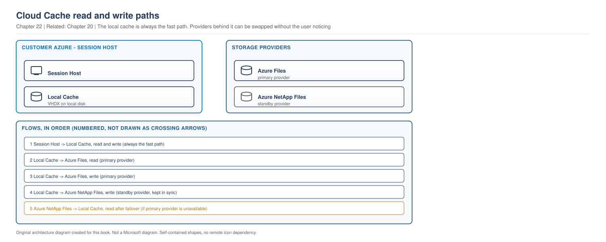

# Chapter 22 - Profile Operations, Failure and Recovery

> **Book:** Azure Virtual Desktop - Architect to Hands-on Implementation
> **Part V:** FSLogix, Profiles and Storage
> **Technical baseline:** August 2026

---

## Chapter Information

| Item | Detail |
|---|---|
| **Chapter number** | 22 |
| **Objective** | Run profiles as a service. Handle locks, corruption, growth and backup, and decide whether Cloud Cache belongs in the design |
| **Prerequisites** | Chapters 1 to 21. Labs 1 to 4 complete |
| **Dependencies** | Builds on [Chapter 19](ch19-why-profiles-cause-avd-failure.md), [Chapter 20](ch20-profile-storage-architecture.md) and [Chapter 21](ch21-fslogix-production-implementation.md) |
| **Estimated lab time** | Profile configuration is in Lab 6; multi-region storage is covered in Labs 13 and 15 |
| **Azure resources required** | None new for the chapter |
| **Cost** | $0.00 for the chapter |

---

## What You Will Learn

- What Cloud Cache actually does, and the cost it puts on your session hosts
- The difference between high availability and disaster recovery for profiles
- How to handle locked, orphaned and corrupt containers as routine work
- Compaction, and why exclusions alone never reduce storage usage
- What backup means for a profile container, and what it does not protect against
- Three production scenarios in the full format

---

## Why This Matters

The first three chapters of Part V got profiles working. This one keeps them working.

At any real scale, profile problems stop being incidents and become a workload. Containers get locked when hosts crash. Profiles grow. Someone deletes the wrong thing. A share has a bad hour. None of that is exotic, and all of it needs a documented procedure rather than an engineer improvising.

This is also the chapter that separates a design from a service. A profile design with no recovery plan is not finished, it is just not broken yet.

---

## 1. What Cloud Cache Actually Does

Cloud Cache is widely misunderstood, usually as "profile replication". It is more specific than that.

Microsoft's description: Cloud Cache is a feature that works with Profile and ODFC containers to provide resiliency and high availability. Cloud Cache uses the locally mounted container to provide periodic updates to the remote storage providers. Cloud Cache is designed to insulate users from short-term or intermittent local storage issues. Based on the configuration, it can also be used as part of a Business Continuity or Disaster Recovery plan when using remote storage providers in different regions. Using Cloud Cache puts a performance and storage requirement on the virtual machine to accommodate the extra I/O operations and storage required by the local cache.

Three things in that paragraph decide whether you should use it.

**It caches locally on the session host.** The session works against a local copy, and writes are pushed to the remote providers periodically. That is what insulates users from a storage blip.

**It is designed for short-term or intermittent issues.** Not for a permanent outage, and not as a substitute for storage redundancy.

**It costs session host performance and storage.** The local cache consumes disk and IO on the host. Include that demand in the session-host sizing covered in [Chapter 17](ch17-session-host-sizing-compute-selection.md).

### How the providers behave

The read and write behaviour is the part people get wrong: CCDLocations supports SMB and Azure Blob types with up to four remote container locations. When setting CCDLocations, the first location is the primary storage provider and is the only provider used for read operations, unless it becomes unhealthy. All storage providers are used when content needs to be written to the VHD(x) files.

So reads come from one provider. Writes go to all of them. That is why provider order matters and why Microsoft advises listing them in order of proximity, then preference.

**A configuration rule that will bite you:** CCDLocations and VHDLocations must not both be present at the same time. Cloud Cache settings are only valid when used with CCDLocations. Moving to Cloud Cache means removing `VHDLocations`, not adding to it.

> **OUR ORIGINAL ARCHITECTURE DIAGRAM.** Created for this book. Not a Microsoft diagram.
> Editable source: [`ch22-cloud-cache-flow.drawio`](../diagrams/architecture/ch22-cloud-cache-flow.drawio)



**What this diagram shows.** The session works against a local cache on the session host. The cache reads from one provider and writes to all of them.

**What each component does.** The local cache holds the working copy of the container. The primary provider serves reads. Secondary providers receive writes and only serve reads if the primary becomes unhealthy.

**Normal flow.** At sign-in the cache is populated from the primary provider. The session reads and writes locally. Writes are pushed to every provider periodically. At sign-out the cache is flushed.

**Architect's view.** The local cache is the feature and the cost. It is why users survive a storage blip, and it is why sign-out can take noticeably longer while data is flushed. If you use Cloud Cache, plan for a larger session host disk and expect a different sign-out profile.

**Failure points.**

| Point | Symptom | Where to look |
|---|---|---|
| Primary provider unhealthy | Slower session, still working | FSLogix log shows provider health |
| Local cache disk full | Sign-in fails or session degrades | Session host disk usage |
| Flush at sign-out | Long sign-out times | FSLogix log timings at logoff |
| Provider divergence | Container corrupt on one provider | Compare containers across providers |

**Official Microsoft reference:** https://learn.microsoft.com/en-us/fslogix/concepts-fslogix-cloud-cache

---

## 2. Architect Decision: Cloud Cache or Storage Redundancy

**Requirement.** Profiles remain available during a storage problem, with a recovery position the business accepts.

**Option A, storage level redundancy.** Zone redundant or geo redundant storage, single `VHDLocations` path.

**Option B, Cloud Cache.** Multiple providers listed in `CCDLocations`.

| Dimension | Storage redundancy | Cloud Cache |
|---|---|---|
| Pros | Transparent to FSLogix, no session host cost, simple to operate | Survives loss of an entire storage platform, can span regions, provider choice is yours |
| Cons | Cannot survive the loss of the storage platform itself | Adds IO and disk load to every session host, more moving parts, longer sign-out |
| Operational impact | Almost none | New failure modes to learn, provider health to monitor |
| Security impact | Single permission model | Two or more storage platforms, each with its own permission and identity configuration |
| Cost impact | Redundancy tier on one platform | Two storage platforms, plus larger session host disks |
| Scalability impact | Scales with the platform | Local cache cost scales with every session host you add |
| Failure impact | Platform outage takes profiles down | Provider outage is absorbed, provider divergence becomes a new risk |

**What Microsoft actually recommends for high availability.** Their guidance favours using different storage platforms rather than two of the same: most commonly high availability is achieved through using unique storage providers within the same region or data center. Azure Files is configured for ZRS and Azure NetApp Files isn't configured with any redundancy. This design limits the exposure of an outage or issue affecting one of these storage platforms, which provides more resiliency than creating two Azure Files shares, two Azure NetApp Files capacity pools or volumes, or two Azure page blob accounts.

That is the point most designs miss. Two Azure Files shares protect you from a share problem. One Azure Files share plus one Azure NetApp Files volume protects you from a platform problem.

**A constraint that often forces the answer.** Azure Files offers geo-redundancy only on HDD file shares, and premium SSD shares must use LRS or ZRS. See [Chapter 20](ch20-profile-storage-architecture.md#4-redundancy-the-decision-most-designs-skip). So a design that needs premium performance and cross-region protection cannot get both from one Azure Files share, and Cloud Cache becomes the realistic route rather than a preference.

**Recommendation.** Storage redundancy for most deployments. Cloud Cache where the business genuinely requires profiles to survive the loss of a storage platform or a region, and accepts the session host cost.

**When not to use the recommendation.** Do not add Cloud Cache to a deployment that has never had a storage incident, purely because it sounds more resilient. You take on session host IO, larger disks, longer sign-out and provider divergence as a new corruption risk. Several environments have moved to Cloud Cache and then back again after seeing containers corrupt on one provider.

**Real-world example.** A financial services customer with a regional DR obligation used Cloud Cache with providers in two regions, listed local first. A manufacturer with no regional obligation used zone redundant Azure Files and a single path, and spent the difference on faster storage instead. Both are correct for their requirement.

`CURRENCY FLAG - verified August 2026. Cloud Cache configuration and provider behaviour have changed across FSLogix versions. [VERIFY BEFORE IMPLEMENTATION] confirm the current CCDLocations format and supported provider types before designing with it.`

---

## 3. Locked and Orphaned Containers

At scale this is routine work, not an incident. Treat it that way and it stops consuming engineering time.

**Why it happens.** A session ends abnormally. The host crashes, is deallocated, or is removed while a user is still signed in. The container lock is not released cleanly, and the next sign-in cannot mount it.

**Why it will keep happening.** The disposable host model in [Chapter 16](ch16-automated-host-pools-session-host-configuration.md) means hosts are deleted regularly. Some of those deletions will catch a session. That is a property of the design, not a fault.

**The retry settings help.** `LockedRetryCount` and `LockedRetryInterval` from [Chapter 21](ch21-fslogix-production-implementation.md#2-the-settings-that-matter) cover a lock that is about to release. They do not help with a lock held by a host that no longer exists.

### The procedure

1. Confirm from the FSLogix log that the failure is a lock, not permissions.
2. Identify the open handle on the container file.
3. Confirm the handle is stale, meaning it belongs to a session or host that no longer exists.
4. Close the handle.
5. Have the user sign in and confirm the profile mounts with their data.

The Azure Files commands for steps 2 and 4 are in [Chapter 19, Scenario 3](ch19-why-profiles-cause-avd-failure.md#8-production-scenarios).

**Warning.** Closing a handle belonging to a live session interrupts that user and can leave the container inconsistent. Confirming the handle is stale is not optional.

**Make it a service desk procedure.** This should not reach an engineer. Write it down, grant the service desk the minimum access needed to run it, and record how often it happens. A rising trend means something else is wrong, usually hosts being removed without draining properly.

---

## 4. Corruption

Corruption is different from a lock. The container mounts and the file system inside it is damaged, or it will not mount at all.

**What causes it.** In order of how often you will actually see it:

1. Antivirus or security tooling scanning the container. See [Chapter 21](ch21-fslogix-production-implementation.md#3-antivirus-and-security-tool-exclusions).
2. Storage problems during a write, including throttling severe enough to time out.
3. Abnormal session ends during a write.
4. With Cloud Cache, divergence between providers.

**How to recognise it.** Mount the container manually and inspect it. A corrupt container typically shows an unrecognised file system rather than NTFS, which is a clear signal rather than an ambiguous one.

**What to do.** Be honest about the options, because there are only three.

| Option | When | Cost |
|---|---|---|
| Repair the file system inside the container | The damage is minor and the data matters | Time, uncertain outcome |
| Restore from a snapshot or backup | You have one and the recovery point is acceptable | Data since the snapshot is lost |
| Delete and let a new container be created | The data is recoverable elsewhere, or nothing else works | All profile data lost |

**The architect's point.** Option three is the fastest and it destroys user data. It is the right answer surprisingly often, and only if you know what is actually in the profile. If OneDrive Known Folder Move is in place and the user's documents are already in the cloud, the profile is settings and cache, and recreating it costs the user an hour. If it is not, that container may be the only copy of their work.

**That decision should be made at design time, not during the incident.** Decide what a profile is allowed to be the only copy of, and make sure the answer is "nothing important".

---

## 5. Growth and Compaction

[Chapter 21](ch21-fslogix-production-implementation.md#4-controlling-profile-size) covered exclusions. This is the part people discover afterwards.

**Exclusions stop growth. They do not reclaim space.**

A VHDX container is dynamically expanding. When data inside it is deleted, the file does not shrink. The space becomes whitespace inside the container. So after adding exclusions, your share usage does not drop, and the finance conversation you were trying to fix continues.

**Compaction reclaims that whitespace.** FSLogix provides disk compaction, and there is a setting to compact containers at sign-out. `[VERIFY BEFORE IMPLEMENTATION]` confirm the current setting name, supported versions and any caveats in the Microsoft configuration settings reference before enabling it estate wide.

**How to introduce it safely.**

1. Add exclusions first, so you are not compacting a container that will immediately regrow.
2. Pilot compaction on a small group and measure the sign-out impact, because compaction takes time and users feel it.
3. Measure the space reclaimed against the sign-out cost before deciding to enable it everywhere.
4. Monitor container size trend afterwards to confirm the bloat source was actually addressed.

**The trade to state clearly.** Compaction at sign-out converts a storage cost into a user experience cost. For a call centre with tight shift changes that may not be acceptable, and a scheduled offline compaction for the largest containers may suit better.

---

## 6. Backup and Recovery

Backing up profiles is not the same as protecting user data, and confusing the two produces a false sense of safety.

**What a container backup gives you.** A point in time copy of a virtual disk. Restoring it returns the whole profile to that moment. Everything the user did since is gone.

**What it does not give you.** File level recovery for a user who deleted one document, unless you restore the whole container to a staging location and extract the file. That is a real procedure and it takes time, and the service desk needs to know it exists before someone asks.

**The design questions to answer before go-live.**

- What recovery point is acceptable for a profile? Daily is common. Hourly is rarely justified for settings and cache.
- What is a profile allowed to be the only copy of? Ideally nothing. OneDrive Known Folder Move moves documents out of the container and into a system that already has versioning and recovery.
- Who can restore a profile, and how quickly?
- Has the restore been tested this year, on a real container, end to end?

**The honest position.** A backup you have never restored is a hypothesis. Test it, write down how long it took, and put that number in the service description. When someone asks how long a profile restore takes, "about an hour, we tested it in March" is a much better answer than an estimate.

Azure Files and Azure NetApp Files both provide snapshot and backup capabilities, referenced in [Chapter 20](ch20-profile-storage-architecture.md#2-the-platform-comparison). Which you use matters less than having tested the restore.

---

## 7. How This Changes With Scale

**Around 100 users.** Locks are rare enough to handle by hand. Snapshots plus a tested restore are sufficient. Cloud Cache is almost never justified.

**Around 1,000 users.** Locked containers become weekly. The service desk needs a documented procedure and the access to run it. Growth becomes a scheduled review rather than a reaction. Restore testing needs a calendar entry, because nobody does it voluntarily.

**Around 5,000 users and beyond.** Profile operations become a named responsibility with its own runbooks. Lock clearing is automated or delegated with tooling. Compaction runs on a schedule against the largest containers. Backup and restore have measured times published as part of the service. A profile incident now affects thousands of people at once, so the recovery path has to be practised rather than documented, and the difference between those two is what you find out on the day.

---

## 8. Architect's Reality Check

**What engineers commonly get wrong.** They treat Cloud Cache as replication and add it for safety. It is a local cache with periodic upstream writes, designed for short-term storage issues, and it puts real IO and disk cost on every session host.

**What I would check first in production.** Whether the failure is a lock, corruption or permissions. The FSLogix log distinguishes all three, and each has a completely different procedure.

**What I would ask the customer.** What a profile is allowed to be the only copy of. If the honest answer is user documents, fix that first with OneDrive Known Folder Move, because it changes the severity of every profile incident afterwards.

**What I would decide as the architect.** Storage redundancy by default, Cloud Cache only for a stated requirement to survive a platform or region loss. Documents out of the profile. A lock clearing procedure owned by the service desk. And a restore tested and timed before go-live.

**What I would say in an interview.** That two Azure Files shares protect against a share problem while one Azure Files share plus one Azure NetApp Files volume protects against a platform problem. That distinction shows you have read the high availability guidance rather than assumed what redundancy means.

---

## 9. Production Scenarios

### Scenario 1: Cloud Cache made things worse

**Problem.** A customer moves from a single share to Cloud Cache with two providers, to improve resiliency. Within a month, users start being blocked at sign-in by container failures.

**Symptoms.** Users see a failure screen rather than getting a temporary profile, because sign-in with a failed container is deliberately blocked. Investigation shows the container on one provider has an unrecognised file system while the other is healthy. It is not always the same provider.

**Business impact.** Around 15 users a week unable to sign in until an engineer intervenes, on a platform that was working reliably a month earlier. The change was made to improve resiliency and has reduced availability, which is a difficult conversation with the business.

**Initial assumption.** Provider divergence. Cloud Cache writes to all providers, so a write problem on one produces a damaged copy on that provider while the other stays healthy.

**Investigation.**

Read the FSLogix logs on affected hosts under `C:\ProgramData\FSLogix\Logs\Profile` and identify which provider failed and when.

Then inspect the container on each provider by mounting a copy in an administrative session and checking the file system.

Then confirm the configuration is valid, specifically that `VHDLocations` was removed when `CCDLocations` was added:

```bash
az vm run-command invoke -g rg-avd-hosts-lab-eus2-01 -n <vm> \
  --command-id RunPowerShellScript \
  --scripts "Get-ItemProperty 'HKLM:\SOFTWARE\FSLogix\Profiles' | Select-Object CCDLocations, VHDLocations, ClearCacheOnLogoff, HealthyProvidersRequiredForRegister"
```

Then check antivirus exclusions cover both provider paths, not just the original share.

**Evidence.** Exclusions were configured for the original share only. The second provider path was never added, so its containers were being scanned.

**Root cause.** A new storage provider is a new path, and the exclusion list was not updated when it was introduced.

**Resolution.** Add the second provider path to every layer of security tooling, then repair or recreate the damaged containers. Confirm the exclusions on hosts rather than in policy.

If divergence continued after that, the honest next step is to reconsider whether Cloud Cache is justified at all. Rolling back to a single path with storage redundancy is a legitimate outcome when the requirement did not need Cloud Cache in the first place.

**Validation.** No new container file system errors for three weeks, and the failure screen count returns to zero. Three weeks rather than three days, because the original problem took a month to become visible.

**Prevention.** Treat every storage path as an exclusion requirement. Add "have exclusions been updated" to the checklist for any storage change. Before adopting Cloud Cache, write down the requirement it satisfies, so there is something to test the outcome against.

**Architect lesson.** Adding resiliency adds components, and every component brings its own failure modes. If the requirement does not need it, the extra components are pure risk.

**Interview lesson.** Being willing to say you would roll a change back, and that resiliency measures can reduce availability, shows judgement rather than enthusiasm for features.

### Scenario 2: The share is full and exclusions did not help

**Problem.** After adding exclusions two months ago, share usage has not dropped. The share is approaching capacity and users will soon be unable to save.

**Symptoms.** Container growth has stopped, which shows the exclusions worked. Total usage is unchanged. Newly created profiles are much smaller than existing ones.

**Business impact.** A share heading for capacity, which stops users saving rather than degrading gracefully. Around 1,500 users at risk, and the storage increase was not budgeted.

**Initial assumption.** Whitespace inside existing containers. VHDX files are dynamically expanding and do not shrink when data inside them is deleted, so exclusions stop growth without reclaiming anything.

**Investigation.**

Compare container file sizes on the share against the used space reported inside a mounted container. A large gap between the two is whitespace.

Check whether compaction is configured at all, and confirm the new profile sizes to prove the exclusions are working:

```bash
az vm run-command invoke -g rg-avd-hosts-lab-eus2-01 -n <vm> \
  --command-id RunPowerShellScript \
  --scripts "Get-ItemProperty 'HKLM:\SOFTWARE\FSLogix\Profiles' | Format-List"
```

`[VERIFY BEFORE IMPLEMENTATION]` Confirm the current compaction setting name and its supported versions in the Microsoft configuration settings reference.

**Evidence.** Containers created after the exclusion change average a fraction of the size of older ones. Older containers show a large gap between file size and used space.

**Root cause.** Exclusions were the correct fix for growth and were never followed by reclamation.

**Resolution.** Enable compaction, piloted first, and measure the sign-out impact before enabling it estate wide. For the largest containers, consider a scheduled offline compaction instead, so users do not pay the cost at sign-out.

Buy short term capacity if the share is close to full. Running out is a user facing outage and compaction takes weeks to work through an estate.

**Validation.** Measure total share usage weekly for a month. Confirm it falls, and confirm sign-out duration for the pilot group stays acceptable.

**Prevention.** Pair exclusions with a reclamation plan from the start. Alert on share usage as a trend and on the gap between provisioned and used capacity.

**Architect lesson.** Stopping a problem growing is not the same as fixing it. Any change that reduces future consumption needs a matching plan for what has already accumulated.

**Interview lesson.** Knowing that exclusions do not shrink existing containers is a detail that only comes from having done the remediation, and it is a good story to have ready.

### Scenario 3: A restore nobody had tested

**Problem.** A user's container is corrupted. The service desk attempts a restore from snapshot for the first time in production.

**Symptoms.** Snapshots exist and are being taken on schedule. Nobody has restored one. The procedure takes most of a day, involves several teams, and the first attempt restores to the wrong location.

**Business impact.** One user without a working profile for a day, and a much larger discovery: the organisation cannot restore profiles within any timeframe it has committed to. That finding matters more than the incident.

**Initial assumption.** Not a technical failure. An untested procedure meeting production for the first time.

**Investigation.** Walk through the restore end to end and record where the time goes. Typically it is access, because nobody has the permissions ready, and finding the right snapshot.

**Evidence.** The restore works. It takes six hours, of which four are waiting for access and locating the correct snapshot rather than copying data.

**Root cause.** Backup was implemented. Recovery was never rehearsed.

**Resolution.** Document the procedure with exact steps, pre-grant the access needed to run it, and record the measured time. Then rehearse it quarterly.

**Validation.** A second restore, performed by a different person following only the document, completes within the documented time. That is the real test, because the first person already knows what to do.

**Prevention.** Add profile restore to the DR test schedule alongside the wider testing in [Project 14](../scenarios/project-14-disaster-recovery.md), which covers backup, recovery and DR testing in full. Publish the measured recovery time in the service description so expectations are set before an incident.

**Architect lesson.** A backup you have never restored is a hypothesis. The number that matters is the tested recovery time, not the backup schedule.

**Interview lesson.** Saying you would test the restore and publish the measured time, rather than describing a backup policy, is the answer that sounds like someone who has been on the wrong end of this.

---

## 10. The Architect's Four Questions

**What do I check first?** Whether it is a lock, corruption or permissions. The FSLogix log distinguishes all three, and picking the wrong one wastes the most time.

**What can I safely change now?** Closing a confirmed stale handle. Reading configuration. Restoring a container to a staging location for inspection. Piloting compaction on a small group.

**What must not be changed blindly?**
- Deleting a container. It is user data and it is rarely the only option.
- Closing a handle without confirming it is stale.
- Enabling compaction estate wide without measuring the sign-out cost.
- Adding Cloud Cache to a working environment without a stated requirement.
- Adding a storage provider without updating antivirus exclusions.

**When do I escalate to Microsoft?** When containers corrupt repeatedly with exclusions verified on the host, storage healthy, and no pattern in host or session behaviour. Collect: FSLogix logs from affected hosts, the FSLogix version, the configuration in use including whether Cloud Cache is enabled, the storage platform and authentication method, the exclusion configuration from every security layer, and evidence of the file system state inside a failed container.

---

## 11. Common Mistakes

- Treating Cloud Cache as replication rather than a local cache with periodic upstream writes.
- Adding Cloud Cache without a requirement, and taking on session host IO and new failure modes.
- Using two shares on the same platform for high availability, when the platform itself is the risk.
- Leaving `VHDLocations` in place when adding `CCDLocations`.
- Forgetting to add a new storage provider path to antivirus exclusions.
- Expecting exclusions to reclaim space.
- Enabling compaction at sign-out without measuring the user impact.
- Deleting a container as the first response to corruption.
- Letting a profile be the only copy of a user's documents.
- Never testing a restore.

---

## 12. Interview Preparation

### Q63. What does Cloud Cache do, and when would you use it?

**Simple answer**
It keeps a local cache of the container on the session host and writes periodically to multiple storage providers. It is designed to insulate users from short-term storage problems, and it can support DR when the providers are in different regions. It costs session host IO and disk.

**Strong senior architect answer**
"It is a local cache, not replication, and that distinction matters. The session works against a copy on the session host, reads come from the first provider in CCDLocations, and writes go to all of them. That is what absorbs a storage blip. The costs are real: extra IO and disk on every session host, longer sign-out while the cache flushes, and provider divergence as a new corruption risk. So I would use it where the business genuinely needs profiles to survive the loss of a storage platform or a region, and I would use storage redundancy otherwise. The detail I would add is that Microsoft's high availability guidance favours different storage platforms rather than two of the same, because two Azure Files shares protect you from a share problem while Azure Files plus Azure NetApp Files protects you from a platform problem."

**Follow-up you should expect**
"What breaks when you enable it?" `VHDLocations` and `CCDLocations` must not both be present. New provider paths need adding to the required antivirus exclusions. Sign-out can take longer, and the local cache must fit on the session-host disk.

### Q64. A container is corrupt. What are your options?

**30 second answer**
"Repair the file system inside it, restore from a snapshot, or delete it and let a new one be created. Which one depends entirely on what is inside the profile. If documents are in OneDrive, deleting costs the user an hour of resetting preferences. If the profile is the only copy of their work, deleting is data loss."

**2 minute answer**
Add the diagnosis and the prevention. First confirm it is corruption rather than a lock or permissions, which the FSLogix log tells you. Mount the container and check whether the file system is recognised, because that is a clear signal. Then choose from the three options based on what the profile actually holds. Then the important part, which is that this decision should have been made at design time: decide what a profile is allowed to be the only copy of, and make the answer nothing important. OneDrive Known Folder Move reduces every future corruption incident from data loss to an inconvenience. And check exclusions, because scanning is the most common cause.

**Deep dive answer**
At scale, corruption is not an incident, it is a rate. So you want to know how many per week, whether it is rising, and whether it clusters on a host pool, a storage provider or a security tooling change. A cluster on one Cloud Cache provider points at exclusions or storage on that path. A rise after a change points at the change. Then there is the recovery position itself: a tested restore with a measured time, published, so the conversation during an incident is about executing a known procedure rather than inventing one.

### Q65. How do you keep profile storage from growing forever?

**Strong answer**
"Two halves, and people only do the first. Exclusions stop future growth, which is the design work. Compaction reclaims what has already accumulated, because a dynamically expanding VHDX does not shrink when data inside it is deleted. So after adding exclusions you will see growth stop and usage stay flat, and if you only did the first half the finance problem continues. I would pilot compaction and measure the sign-out cost before enabling it broadly, because it converts a storage cost into a user experience cost, and for a call centre with tight shift changes that may not be acceptable. Then alert on the size trend rather than on capacity, so you see it coming."

---

## 13. Key Takeaways

- Cloud Cache is a local cache with periodic upstream writes, not replication.
- Reads come from the first provider in `CCDLocations`. Writes go to all providers.
- `CCDLocations` and `VHDLocations` must not both be present.
- Cloud Cache costs session host IO, disk and sign-out time.
- For high availability, different storage platforms protect you better than two of the same.
- Premium SSD Azure Files shares cannot use geo-redundancy, which is often what pushes a design towards Cloud Cache.
- Locked containers are routine at scale. Make it a service desk procedure with a stale handle check.
- Corruption is most often caused by security tooling scanning the container.
- Exclusions stop growth. Compaction reclaims space. You need both.
- Compaction at sign-out trades storage cost for user experience.
- A backup you have never restored is a hypothesis. Test it and publish the measured time.

---

## 14. Official References

- Cloud Cache overview - https://learn.microsoft.com/en-us/fslogix/concepts-fslogix-cloud-cache
- High availability and container resiliency options using Cloud Cache - https://learn.microsoft.com/en-us/fslogix/concepts-container-high-availability
- Configuration examples - https://learn.microsoft.com/en-us/fslogix/concepts-configuration-examples
- FSLogix configuration settings reference - https://learn.microsoft.com/en-us/fslogix/reference-configuration-settings
- Tutorial: configure profile containers with Cloud Cache - https://learn.microsoft.com/en-us/fslogix/tutorial-cloud-cache-containers
- Prerequisites for FSLogix - https://learn.microsoft.com/en-us/fslogix/overview-prerequisites

---

## Chapter Close

**What was completed**
Part V is finished. You can explain why profiles fail, choose and size storage, configure FSLogix properly, and operate profiles as a service with recovery you have actually tested.

**What you should test**
Find out whether anyone in your organisation has ever restored a profile container, and how long it took. If nobody knows, that is the most valuable thing you can fix this month.

**What comes next**
Chapter 23 opens Part VI with golden image engineering, which is where most of the settings from this part actually get delivered.

**Interview preparation carried forward**
Q62 separates candidates quickly. Most describe Cloud Cache as replication. Describing it as a local cache with periodic writes, and naming the session host cost, is the accurate answer.
