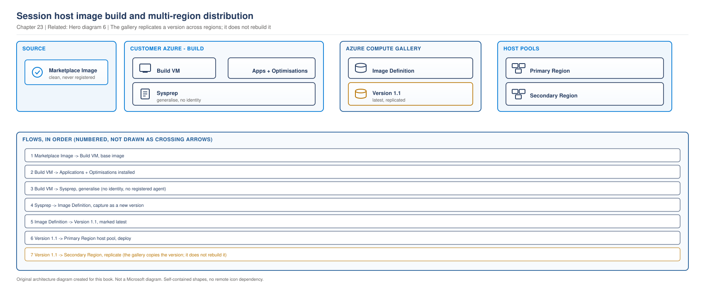

# Chapter 23 - Golden Image Engineering

> **Book:** Azure Virtual Desktop - Architect to Hands-on Implementation
> **Part VI:** Images, Endpoint Management and Application Delivery
> **Technical baseline:** August 2026

---

## Chapter Information

| Item | Detail |
|---|---|
| **Chapter number** | 23 |
| **Objective** | Build, version and distribute session host images so that every host is identical and every change is traceable |
| **Prerequisites** | Chapters 1 to 22. Labs 1 to 4 complete |
| **Dependencies** | Delivers the settings from [Chapter 21](ch21-fslogix-production-implementation.md), feeds the update model in [Chapter 16](ch16-automated-host-pools-session-host-configuration.md) and the sizing in [Chapter 17](ch17-session-host-sizing-compute-selection.md) |
| **Estimated lab time** | Lab 8 selects an image for session-host deployment; a full image pipeline is not included |
| **Azure resources required** | None for the chapter. An Azure Compute Gallery and image versions carry storage cost, covered in section 5 |
| **Cost** | $0.00 for the chapter |

---

## What You Will Learn

- Marketplace image or custom image, decided from requirements
- The three ways to build an image, and when each is right
- Why the AVD agent must never be in your image
- Versioning and replication, and how they change deployment speed and cost
- What belongs in the image and what belongs in policy
- Three production scenarios in the full format

---

## Why This Matters

The image is where your session host estate is actually defined. Every host in a pool comes from it, so an image mistake is not one host with a problem, it is every host with the same problem.

It is also the delivery mechanism for most of Part V. FSLogix agent, Teams optimisation, security baselines and application sets all arrive through the image or alongside it. And with session host configuration from [Chapter 16](ch16-automated-host-pools-session-host-configuration.md), where hosts are replaced rather than patched, the image is the only durable place to put anything.

Get this right and host operations become boring. Get it wrong and you spend your time fixing the same problem on hundreds of machines.

---

## 1. The Image Pipeline

> **RECOMMENDED ARCHITECTURE.** Our design, technically consistent with Microsoft's documented image build and distribution model. Not a Microsoft reference architecture.

> **OUR ORIGINAL ARCHITECTURE DIAGRAM.** Created for this book. Not a Microsoft diagram.
> Editable source: [`ch23-image-build-pipeline.drawio`](../diagrams/architecture/ch23-image-build-pipeline.drawio)



**What this diagram shows.** The path from a marketplace image to a running session host, with the gallery as the versioned distribution point in the middle.

**What each component does.** The build VM is temporary and exists only to be customised. Sysprep generalises it, removing machine specific identity. The image definition holds the versions. Host pools deploy from a version, and replication puts a copy in each region where you deploy.

**Normal flow.** Start from a marketplace image, install applications, apply optimisations, run sysprep, capture into the gallery as a new version, then deploy host pools from it. Replication is asynchronous and happens after the version is published.

**Architect's view.** The gallery is the part that turns image building into image management. Microsoft's own recommendation is clear: we recommend using Azure Compute Gallery images for production environments because of their enhanced capabilities, such as replication and image versioning. Versioning gives you rollback. Replication gives you fast deployment in a second region. A standalone managed image gives you neither.

**Failure points.**

| Point | Symptom | Where to look |
|---|---|---|
| AVD agent present in the source | New hosts never register | See section 3 |
| Sysprep not run or failed | Duplicate SIDs, hosts behave oddly | Sysprep logs on the build VM |
| Replication not complete | Deployment in the second region is slow or fails | Gallery version replication status |
| Wrong version marked latest | Hosts built from an unintended image | Gallery version properties |

**Official Microsoft reference:** https://learn.microsoft.com/en-us/azure/virtual-desktop/set-up-golden-image

---

## 2. Architect Decision: Marketplace Image or Custom Image

**Requirement.** Provide session hosts with the operating system, applications and configuration each persona needs, repeatably.

**Option A, marketplace image.** Deploy hosts directly from the Azure marketplace image, and deliver everything else through policy and application delivery.

**Option B, custom image.** Build your own image containing applications and configuration, publish it to a gallery, and deploy from that.

| Dimension | Marketplace image | Custom image |
|---|---|---|
| Pros | Nothing to build or maintain, always current, no gallery cost | Applications present at first boot, faster sign-in, consistent state, fewer moving parts at deployment |
| Cons | Every application has to arrive another way, slower first use, more dependencies at deployment time | A build pipeline to own, versions to manage, a monthly cadence to sustain |
| Operational impact | Low build effort, higher runtime dependency on Intune or application delivery | Real ongoing effort. Someone must own the pipeline |
| Security impact | Always the latest published patch level at deployment | Image can go stale between builds. Patch level is your responsibility |
| Cost impact | No gallery storage or replication cost | Gallery storage per version per replicated region |
| Scalability impact | Application delivery load grows with host count | Scales well. Image cost is per version, not per host |
| Failure impact | An application delivery failure affects new hosts | An image defect affects every host built from it |

**Recommendation.** Custom image for any estate with more than a handful of applications or more than a few hundred users. Marketplace image where the application set is delivered entirely by Intune or App Attach and the team has no capacity to run a pipeline.

**When not to use the recommendation.** Do not build a custom image if nobody will own it. A stale custom image is worse than a marketplace image, because it is both out of date and trusted. The failure mode is an estate running a nine month old patch level that everyone believes is current.

**Real-world example.** A 300 user professional services firm with six applications, all deliverable through Intune, stayed on the marketplace image and spent the saved effort on their Intune baseline. A 3,200 user manufacturer with SAP, a CAD suite and forty line of business applications built a custom image per persona group, because installing forty applications at deployment time was not viable.

---

## 3. The Rule That Breaks Deployments

This one is worth its own section because it silently ruins images.

**Never capture an image from a machine with the AVD agent installed.**

Microsoft's guidance is explicit: if you do need to use a customized image, make sure you don't already have the Azure Virtual Desktop Agent installed on your VM. Using a customized image with the Azure Virtual Desktop Agent can cause problems with the image, such as blocking registration as the host pool registration token will have expired which will prevent user session connections.

**Why it happens.** Someone builds a test session host, gets it working, and captures it as the image. That machine is registered, so the agent and an expired token come with it. Every host built from that image inherits the problem, and the symptom appears at registration rather than at build, which is where the confusion starts.

If you have already done it, Microsoft's remedy is to uninstall the Agent and all related components from your VM or create a new image from a VM with the Agent uninstalled. Rebuilding from a clean source is usually faster than uninstalling cleanly.

**Two more capture rules from the same guidance.** After sysprep and shutdown, capture from the VM tab in the portal, and when you create a capture, you'll need to delete the VM afterwards, as you'll no longer be able to use it after the capture process is finished. And: don't try to capture the same VM twice, even if there's an issue with the capture.

That last rule surprises people. If a capture fails, you rebuild the source VM. You do not retry against the same machine. Build the pipeline so recreating the source VM is cheap, because you will need to.

**Official Microsoft reference:** https://learn.microsoft.com/en-us/azure/virtual-desktop/set-up-customize-master-image

---

## 4. Three Ways to Build

| Method | What it is | Good for |
|---|---|---|
| Manual build and capture | Build a VM by hand, sysprep, capture | Learning, and one-off images. Not a production process |
| Custom image templates | Microsoft's AVD feature built on Azure Image Builder | Teams who want automation without owning a pipeline |
| Your own pipeline | Azure DevOps or GitHub Actions driving Image Builder or Packer | Teams with existing CI and specific requirements |

### Custom image templates

This is the option most AVD teams should look at first, because it removes most of the pipeline work.

Microsoft describes it: a custom image template is a JSON file that contains your choices of source image, distribution targets, build properties, and customizations. Azure Image Builder uses this template to create a custom image, which you can use as the source image for your session hosts when creating or updating a host pool. When creating the image, Azure Image Builder also takes care of generalizing the image with sysprep.

Sysprep being handled for you is significant. Generalisation is where manual builds most often go wrong.

The source can be Azure Marketplace, an existing Azure Compute Gallery shared image, or an existing managed image.

Built-in customisations include things you would otherwise script yourself: configure Teams optimizations, including WebRTC redirector service and Visual C++ Redistributable. Configure session timeouts. Disable automatic updates for MSIX applications. Add or remove Microsoft Office applications. Apply Windows Updates.

Two prerequisites to plan for. It uses a user-assigned managed identity to create several resources in your subscription, such as a resource group, a VM used to build the image, Key Vault, and a storage account, and the VM needs internet access to download the built-in scripts or your own scripts.

That internet requirement matters in a locked-down environment. If your build subnet has controlled egress as designed in [Chapter 13](ch13-hybrid-connectivity-egress-control.md), the build VM needs a path to reach the script sources or the build fails.

`CURRENCY FLAG - verified August 2026. Custom image templates and their built-in customisations have expanded over time. [VERIFY BEFORE IMPLEMENTATION] check the current customisation list and prerequisites before designing a build around them.`

---

## 5. Versioning and Replication

The gallery is where image management actually happens.

**Versioning gives you rollback.** Keep the previous known-good version. When a new image causes a problem, you deploy hosts from the old version while you investigate. Without versions your only option is to rebuild the image under pressure, which is when mistakes happen.

**Replication puts a copy in each region.** Deploying a host pool in a second region from a version replicated there is far faster than pulling across regions, and it avoids cross-region data transfer.

**Excluding a version from latest.** A version can be marked so it is not used when a deployment specifies "latest". This is how you stage a new image: publish it, exclude it from latest, test with a small pool, then promote it.

### Cost

This is a real line and it is easy to forget.

Gallery cost is driven by version count times replica count times image size. An image of a few tens of gigabytes, kept for six versions, replicated to three regions, is a meaningful monthly figure. It is not large compared with session host compute, and it is large enough that keeping twenty versions forever gets noticed.

**A sensible retention position.** Keep the current version, the previous version, and any version a host pool is actually pinned to. Delete the rest on a schedule. Write the retention rule down, because nobody deletes images voluntarily.

### Terraform

The gallery and image definition belong in Terraform. The image versions themselves are usually produced by the build process rather than declared, which is a normal split.

```hcl
resource "azurerm_shared_image_gallery" "avd" {
  name                = "galavdlabeus201"
  resource_group_name = azurerm_resource_group.images.name
  location            = var.location
  description         = "Session host images for AVD"
  tags                = local.common_tags
}

resource "azurerm_shared_image" "win11_multisession" {
  name                = "img-avd-win11-multisession"
  gallery_name        = azurerm_shared_image_gallery.avd.name
  resource_group_name = azurerm_resource_group.images.name
  location            = var.location
  os_type             = "Windows"
  hyper_v_generation  = "V2"
  specialized         = false

  identifier {
    publisher = "Contoso"
    offer     = "AVD"
    sku       = "Win11-Multisession"
  }

  tags = local.common_tags
}
```

**What this does.** Creates the gallery and the image definition that versions are published into.
**Prerequisites.** A resource group for images. Following the naming convention from [Lab 2](../labs/lab-02-terraform-foundation-and-governance.md).
**Expected result.** Gallery and image definition exist. No versions yet.
**Common failure.** Gallery names have a restricted character set, similar to storage accounts. `specialized = false` matters, because a generalised image is what you want for session hosts.

**Bicep comparison.** Both handle this well and there is little to choose between them here. Terraform stays primary in this book because the wider environment is already declared in it, and splitting the gallery into a different tool for no benefit adds a second state to reason about. Where a customer is already Bicep-first for platform resources, putting the gallery in Bicep alongside them is the better answer. The decision is about which tool owns the surrounding resources, not about image capability.

---

## 6. What Goes in the Image and What Does Not

This is the design question that decides how often you rebuild.

| In the image | Delivered another way |
|---|---|
| Operating system and updates at build time | Ongoing patches, through image replacement |
| FSLogix agent | FSLogix configuration, through policy ([Chapter 21](ch21-fslogix-production-implementation.md#1-where-fslogix-configuration-lives)) |
| Teams client and WebRTC redirector | Teams policy settings |
| Language packs | User preferences |
| Applications used by everyone in the pool | Persona-specific applications, through App Attach or Intune |
| VDI optimisations | Security baselines, through Intune or Group Policy |
| Certificates every host needs | Anything that changes more often than the image cadence |

**The rule.** If it changes more often than your image cadence, it should not be in the image. A monthly image cycle means anything changing weekly belongs in policy or application delivery.

**The exception that matters.** With session host configuration, anything applied by hand to a host is lost at the next update, as covered in [Chapter 16](ch16-automated-host-pools-session-host-configuration.md#3-what-a-session-host-update-actually-does). So the real choice is image or policy. There is no third option of "just set it on the host", even temporarily.

### Optimisation

VDI optimisation removes services and scheduled tasks that make no sense on a session host, and the effect on logon time is real. Microsoft's custom image templates include optimisation among the built-in customisations.

`[VERIFY BEFORE IMPLEMENTATION]` Optimisation tooling and the specific recommended settings change with Windows versions. Take the current guidance rather than an older script, and test rather than applying an optimisation list wholesale. An aggressive optimisation that disables something an application needs produces a failure that is very hard to trace back to the image.

---

## 7. How This Changes With Scale

**Around 100 users.** One image, built manually or with a custom image template, rebuilt when something needs changing. A gallery is still worth using for versioning, even though replication is not needed.

**Around 1,000 users.** Image cadence becomes a schedule rather than an event. Monthly for patches is common. Staging matters, so exclude from latest and test with a small pool before promoting. Rollback becomes a real requirement, which means keeping the previous version deliberately.

**Around 5,000 users and beyond.** Multiple images for multiple personas, each with its own lifecycle, and replication across regions. The pipeline becomes automated because a manual monthly build across several images is not sustainable. Gallery retention needs a rule, or version count grows without limit. Image build time and rollout time become numbers you publish, because they determine your response to an out-of-cycle security patch, as covered in [Chapter 18](ch18-session-host-lifecycle-hybrid.md#4-patching-strategy).

---

## 8. Architect's Reality Check

**What engineers commonly get wrong.** They capture an image from a working session host. The AVD agent and an expired registration token come with it, and every host built from that image fails to register.

**What I would check first in production.** Which image version each host pool is deployed from, and when that version was built. A stale image is the most common quiet problem in an AVD estate.

**What I would ask the customer.** Who owns the image, and when was it last rebuilt. If nobody can answer the first question, the image will go stale regardless of how good the pipeline is.

**What I would decide as the architect.** Custom image templates before building a bespoke pipeline. Gallery with versioning from day one. A written retention rule. And a clear line on what goes in the image, so the answer to every request is a rule rather than a debate.

**What I would say in an interview.** That the image is where the estate is defined, so an image defect is not one host with a problem, it is every host. Then the agent capture rule, because it is specific, documented, and shows you have built images rather than read about them.

---

## 9. Production Scenarios

### Scenario 1: Every new host fails to register

**Problem.** A new host pool is deployed from a freshly built custom image. None of the twelve session hosts register.

**Symptoms.** VMs deploy successfully and are billing. The host pool shows no session hosts. Event logs on the hosts show registration errors rather than connectivity errors.

**Business impact.** A planned capacity expansion delivers nothing, twelve VMs billing without serving users, and the deployment window is lost.

**Initial assumption.** The image contains the AVD agent. This is documented behaviour, and it is the most common cause when the image is new and the network is unchanged.

**Investigation.**

Check whether the agent is present on a host built from the image, before assuming anything about tokens or networking.

```bash
az vm run-command invoke -g rg-avd-hosts-lab-eus2-01 -n <vm> \
  --command-id RunPowerShellScript \
  --scripts "Get-Service RDAgentBootLoader, RDAgent -ErrorAction SilentlyContinue | Select-Object Name, Status; Get-ItemProperty 'HKLM:\SOFTWARE\Microsoft\RDInfraAgent' -Name IsRegistered -ErrorAction SilentlyContinue"
```

Then check the event log for the registration error, and confirm the token is valid using the commands in [Chapter 18](ch18-session-host-lifecycle-hybrid.md#3-registration-and-how-it-goes-wrong).

**Evidence.** The agent is present on a host that has just been built, which can only have come from the image. The registration error refers to an expired token, matching the documented symptom.

**Root cause.** The image was captured from a working test session host that was already registered.

**Resolution.** Rebuild the image from a clean marketplace source with no agent installed, then redeploy the hosts. Uninstalling the agent from the existing image is possible and rebuilding from clean is faster and leaves less doubt.

**Validation.** A host built from the new image registers and shows Available. Then connect a test user, because registering is not the same as serving a session.

**Prevention.** Never build the image on a machine that has been added to a host pool. Use a dedicated build VM that never joins a pool. If you use custom image templates, this is handled for you, which is one of the strongest reasons to use them.

**Architect lesson.** The convenient path, capturing a machine you already got working, is the one that breaks. Build images from a clean source every time.

**Interview lesson.** Naming this specific rule shows you have built AVD images rather than read about them. It is documented, specific, and almost nobody mentions it unprompted.

### Scenario 2: A new image breaks an application for 800 users

**Problem.** A monthly image update rolls out. An application used by a whole department stops working on updated hosts.

**Symptoms.** Hosts on the previous image are fine. Hosts on the new image fail the same way. The rollout is partway through, so half the pool works and half does not.

**Business impact.** 800 users unable to use a core application, with the failure spreading as the rolling update continues. Support cannot identify a pattern initially because the affected users move between hosts.

**Initial assumption.** Something in the new image changed the application's dependencies. The clean split by image version is strong evidence, and it also means rollback is available.

**Investigation.**

Identify which image version each host is running, so the correlation is proven rather than assumed.

```bash
az vm list -g rg-avd-hosts-lab-eus2-01 \
  --query "[].{name:name, image:storageProfile.imageReference.exactVersion}" -o table
```

Then compare the build records for the two versions. Then reproduce on a single host from the new image with the application vendor's diagnostics.

**Evidence.** Every failing host is on the new version. The build log shows an optimisation step disabled a service the application depends on.

**Root cause.** An optimisation applied wholesale without testing the full application set.

**Resolution.** Stop the rolling update immediately. Deploy replacement hosts from the previous version, which is available because versions are retained. Then fix the image, test, and restart the rollout.

Stopping the rollout first matters. Continuing while investigating turns a partial outage into a complete one.

**Validation.** Users on rolled-back hosts can use the application. Then, on the corrected image, the application is tested by a real user from that department before the rollout restarts.

**Prevention.** Stage image changes. Publish the version excluded from latest, deploy a small validation pool, and have real users from each persona test their applications before promotion. Keep the previous version, always.

**Architect lesson.** Versioning is not administrative tidiness. It is the rollback path, and its value only appears on the day you need it.

**Interview lesson.** Saying you would stop the rollout before investigating shows incident judgement. Many candidates go straight to diagnosis while the blast radius grows.

### Scenario 3: The image nobody rebuilt

**Problem.** A security review finds session hosts running a patch level nine months old. The estate was believed to be current.

**Symptoms.** No user impact. Hosts healthy. The gallery has one image version, built nine months ago.

**Business impact.** A compliance finding across the whole session host estate, and a remediation programme that has to be planned and executed under a deadline.

**Initial assumption.** Not a technical failure. The image had no owner, so nobody rebuilt it.

**Investigation.** Check the image version creation date and compare it against the host pool deployment source. Then ask who is responsible for rebuilding it and look for a documented cadence.

**Evidence.** One version, created nine months ago. No pipeline, no schedule, no named owner. The person who built it originally has changed roles.

**Root cause.** An image was built as a project task rather than established as an ongoing process.

**Resolution.** Build a current image, validate it, and roll it out. Then set up custom image templates or a pipeline with a monthly schedule and a named owner.

**Validation.** Hosts report a current patch level, and a second image build completes on schedule the following month. The second build is the real proof, because it shows the process exists rather than a one-off effort.

**Prevention.** Treat image cadence as a service commitment with an owner and a schedule. Alert on image version age. Include image build date in the operational dashboard from [Project 02](../scenarios/project-02-enterprise-850-users.md).

**Architect lesson.** A custom image is a commitment to keep rebuilding it. If nobody owns that, a marketplace image with policy-delivered applications is the safer design, even though it looks less sophisticated.

**Interview lesson.** Saying you would sometimes recommend a marketplace image because the customer cannot sustain a pipeline shows you design for the organisation you have, not the one on the architecture diagram.

---

## 10. The Architect's Four Questions

**What do I check first?** Which image version a host pool is deployed from, and when that version was built. Both problems in this area, stale images and bad images, show up in that one answer.

**What can I safely change now?** Building a new image version. Marking a version excluded from latest. Deploying a validation pool from a new version. Reading gallery configuration.

**What must not be changed blindly?**
- Promoting an image version to latest without staging.
- Deleting a gallery image version. A host pool may be pinned to it.
- Capturing an image from a machine that has been in a host pool.
- Applying an optimisation list wholesale without testing applications.
- Starting a rolling update without a tested rollback version available.

**When do I escalate to Microsoft?** When an image built from a supported source, with no agent present and sysprep completed successfully, produces hosts that will not register or behave inconsistently. Collect: the image definition and version identifiers, the source image publisher, offer, SKU and version, sysprep logs from the build, the build method used, agent version on a deployed host, and the registration error with UTC timestamps.

---

## 11. Common Mistakes

- Capturing an image from a registered session host.
- Retrying a capture against the same VM after a failure.
- Keeping the build VM after capture instead of deleting it.
- Using a standalone managed image in production instead of a gallery.
- Building a custom image with no named owner or cadence.
- Putting configuration in the image that changes more often than the image does.
- Promoting a version to latest without a validation pool.
- Deleting old versions with no retention rule, or keeping every version forever.
- Applying an optimisation list without testing the application set.
- Forgetting that the build VM needs internet access for script sources.

---

## 12. Interview Preparation

### Q66. How would you manage session host images?

**Simple answer**
Build from a clean marketplace source, publish into an Azure Compute Gallery with versioning, replicate to the regions you deploy in, stage new versions with a validation pool, and keep the previous version for rollback.

**Strong senior architect answer**
"The gallery is what turns image building into image management, so I would use it even for a small estate. Versioning is the rollback path and replication is what makes a second region fast to deploy into. My build starts from a clean marketplace image, never from a machine that has been in a host pool, because a captured session host brings the AVD agent and an expired registration token with it and every host from that image fails to register. For the build itself I would look at custom image templates before writing a pipeline, because Azure Image Builder handles the sysprep generalisation, which is where manual builds usually go wrong. Then the operating model matters more than the tooling: a named owner, a monthly cadence, staging with a validation pool, and a retention rule. A custom image is a commitment to keep rebuilding it."

**Follow-up you should expect**
"What goes in the image?" Anything that changes less often than your image cadence, plus the agents that must be present at first boot such as FSLogix and the Teams redirector. Configuration goes in policy, because a monthly image cycle is too slow for settings that change weekly.

### Q67. What is the risk of a custom image?

**30 second answer**
"That it goes stale. A custom image is a commitment to keep rebuilding it, and if nobody owns that, you end up with an estate on an old patch level that everyone believes is current. That is worse than a marketplace image, because it is both out of date and trusted."

**2 minute answer**
Add the second risk, which is blast radius. Every host in the pool comes from the image, so a defect is not one host, it is all of them, and a rolling update spreads it. That is why staging matters: publish the version excluded from latest, deploy a small validation pool, have real users from each persona test their applications, then promote. And keep the previous version, because rollback is the only fast response when a new image breaks something. Then the honest recommendation: if the customer cannot sustain a pipeline, a marketplace image with applications delivered through Intune or App Attach is the safer design even though it looks less sophisticated.

**Deep dive answer**
There is a response time question worth adding. Image based patching is cleaner than in place patching and slower, so you need two measured numbers in the runbook: how long an image build and validation takes, and how long a full rolling update takes at your batch size. Without those you cannot answer a 72 hour security deadline with anything but a guess. Then the interaction with session host configuration: hosts are replaced rather than patched, so the image is the only durable place for anything, which raises the cost of a stale image and removes the informal habit of fixing a host by hand.

### Q68. Where do you draw the line between image and policy?

**Strong answer**
"Cadence. If it changes more often than the image is rebuilt, it does not belong in the image. So the FSLogix agent goes in the image and the FSLogix configuration goes in policy, because I want to correct a setting in minutes rather than through a rebuild and a full rollout. Same with Teams: the client and the WebRTC redirector go in the image, the policy settings do not. The thing that makes this stricter than it used to be is session host configuration, where anything applied by hand to a host disappears at the next update. So there is no third option of setting it on the host temporarily. It is image or policy, and choosing correctly is what keeps the image cadence sustainable."

---

## 13. Key Takeaways

- Never capture an image from a machine with the AVD agent installed. Hosts built from it will not register.
- Do not retry a capture against the same VM. Rebuild the source.
- Delete the build VM after capture. It cannot be used again.
- Use Azure Compute Gallery in production for versioning and replication, not a standalone managed image.
- Versioning is your rollback path. Keep the previous known-good version.
- Exclude a new version from latest, validate with a small pool, then promote.
- Custom image templates handle sysprep generalisation for you, which removes the most common manual build failure.
- The build VM needs internet access to reach script sources.
- If it changes more often than the image cadence, it belongs in policy, not the image.
- A custom image is a commitment to keep rebuilding it. Without an owner, a marketplace image is safer.

---

## 14. Official References

- Create an Azure Virtual Desktop golden image - https://learn.microsoft.com/en-us/azure/virtual-desktop/set-up-golden-image
- Prepare and customize a VHD image for Azure Virtual Desktop - https://learn.microsoft.com/en-us/azure/virtual-desktop/set-up-customize-master-image
- Custom image templates in Azure Virtual Desktop - https://learn.microsoft.com/en-us/azure/virtual-desktop/custom-image-templates
- Azure Compute Gallery overview - https://learn.microsoft.com/en-us/azure/virtual-machines/azure-compute-gallery
- Store and share images in an Azure Compute Gallery - https://learn.microsoft.com/en-us/azure/virtual-machines/shared-image-galleries
- Add session hosts to a host pool - https://learn.microsoft.com/en-us/azure/virtual-desktop/add-session-hosts-host-pool

---

## Hands-on Lab

Image selection and session-host deployment are in **Lab 8**. A complete image build pipeline remains outside the current labs.

---

## Chapter Close

**What was completed**
You can decide between a marketplace and a custom image, choose a build method, manage versions and replication, and split configuration correctly between image and policy.

**What you should test**
Find out when the image behind any AVD estate you have access to was last built. If the answer is more than three months ago, or nobody knows, you have found the most common quiet problem in this area.

**What comes next**
Chapter 24 covers Intune and AVD endpoint management, which is where most of the configuration that does not belong in the image is actually delivered.

**Interview preparation carried forward**
Q65 rewards the agent capture rule and the operating model points. Most candidates describe the tooling and stop there.

---

## Chapter Self-Review

**Pass 1, technical verification.** The recommendation to use Azure Compute Gallery in production for replication and versioning, the instruction to delete the VM after capture, and the rule against capturing the same VM twice were verified against the current Microsoft golden image page. The prohibition on capturing an image with the AVD agent installed, including the expired registration token consequence and the remedy, was verified against the prepare and customize image page. The custom image template definition, the source image options, Azure Image Builder handling sysprep generalisation, the built-in customisations, the user-assigned managed identity requirement and the build VM internet requirement were verified against the custom image templates page. The Terraform example uses documented `azurerm_shared_image_gallery` and `azurerm_shared_image` arguments. Optimisation tooling carries a verification marker because recommended settings change with Windows versions, and custom image templates carry a currency flag because the customisation list has expanded.

**Pass 2, human readability review.** The chapter leads with the pipeline diagram because the shape of the process is what makes the rest make sense. The agent capture rule was given its own section rather than a bullet, because it is the single most damaging mistake in this area. The image versus policy split is a table since it is a two column decision. Sentences kept short, scenarios written as narrative, no long dash characters. Read back as an engineer building an image for the first time, and the build methods section was moved after the marketplace versus custom decision, because choosing a build method only matters once you have decided to build.

**Pass 3, visual and topic accuracy review.** One diagram. Topic test applied: with the title removed, it reads as an image build and distribution pipeline, which is the chapter subject. It is not a generic AVD architecture diagram. Source, build, gallery and host pools are separate boundaries, the build and publish chain is the dominant path, and replication is dashed because it is asynchronous and optional. Every node is a component name. Carries the `RECOMMENDED ARCHITECTURE` label, because the pipeline shape is our design rather than a Microsoft reference architecture. Checked against the fourteen question review in the [diagram standard](../DIAGRAM-STANDARD.md).

**Consistency check against earlier chapters.** The image versus policy split is consistent with [Chapter 21](ch21-fslogix-production-implementation.md#1-where-fslogix-configuration-lives), which recommends FSLogix configuration in policy and the agent in the image. The statement that manual host changes do not survive is consistent with [Chapter 16](ch16-automated-host-pools-session-host-configuration.md#3-what-a-session-host-update-actually-does). The registration troubleshooting is referenced to [Chapter 18](ch18-session-host-lifecycle-hybrid.md#3-registration-and-how-it-goes-wrong) rather than repeated, and the agent capture rule stated there is expanded here rather than contradicted. The build VM internet requirement is consistent with the egress design in [Chapter 13](ch13-hybrid-connectivity-egress-control.md). Teams redirector placement in the image is consistent with [Chapter 14](ch14-protocol-optimisation-network-performance.md#4-teams-media-optimisation). Naming follows the Lab 2 convention. No earlier chapter required correction.

| Check | Result |
|---|---|
| Technical accuracy | Verified against current Microsoft pages |
| Current capability verified | Yes, August 2026, with a currency flag on custom image templates |
| Supported versus unsupported separated | Yes. The agent capture prohibition and capture rules stated explicitly |
| Commands, CLI, PowerShell, Terraform | Exact, with prerequisites, expected results and common failures |
| Production scenarios | Three, in the extended format |
| Architect decision structure | Section 2, with impacts, recommendation and when not to use it |
| Architect's Reality Check | Section 8 |
| Architect's four questions | Section 10 |
| Scale behaviour at 100, 1,000 and 5,000 users | Section 7 |
| Diagrams | One, topic tested, with a classification label |
| Terraform and Bicep | Terraform primary, Bicep comparison with the reasoning |
| Architecture consistency | Consistent with Chapters 13, 14, 16, 18 and 21 |
| Cost statements | Gallery version and replication cost, with a retention position |
| Security implications | Stale image risk and the compliance consequence |
| Interview answers | Read aloud |
| Duplicate content | Registration troubleshooting referenced to Chapter 18 |
| Simple English | Reviewed |
| Long dash characters | None |
