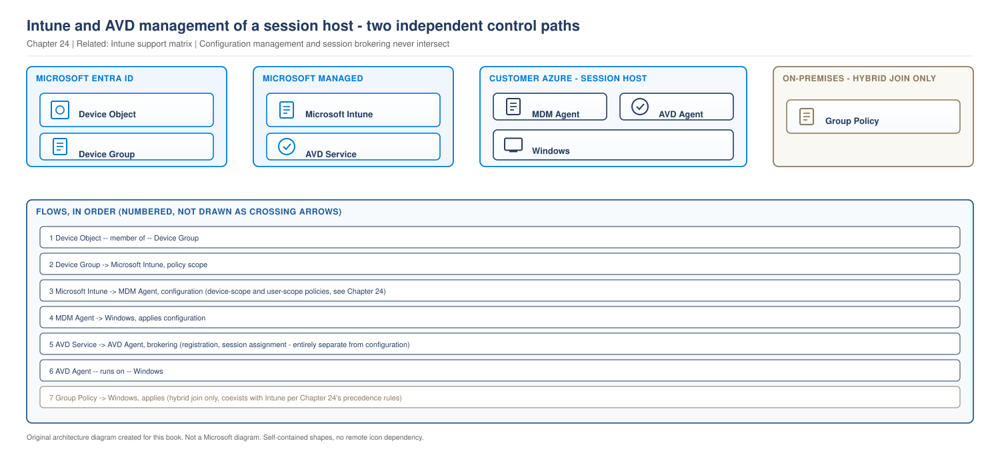
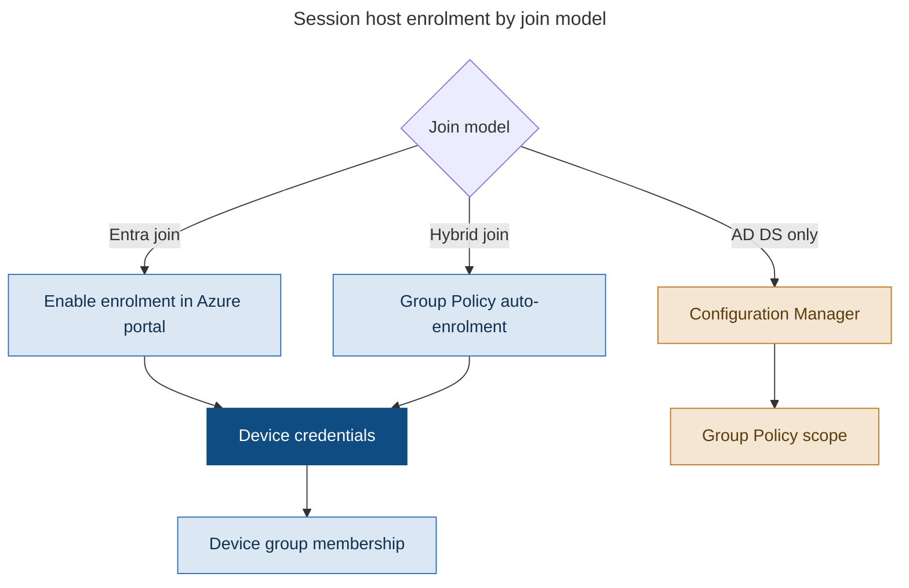

# Chapter 24 - Intune and AVD: Endpoint Management Architecture

> **Book:** Azure Virtual Desktop - Architect to Hands-on Implementation
> **Part VI:** Images, Endpoint Management and Application Delivery
> **Technical baseline:** August 2026

---

## Chapter Information

| Item | Detail |
|---|---|
| **Chapter number** | 24 |
| **Objective** | Manage session hosts with Intune correctly, and know where a session host stops behaving like a laptop |
| **Prerequisites** | Chapters 1 to 23. Labs 1 to 4 complete |
| **Dependencies** | Uses the join models from [Chapter 7](ch07-identity-architecture-foundations.md), the multi-session edition point from [Chapter 5](ch05-operating-systems-multisession-licensing.md) and the image split from [Chapter 23](ch23-golden-image-engineering.md) |
| **Estimated lab time** | Intune is covered as a design topic; Lab 16 covers regional user assignment |
| **Azure resources required** | None. Intune licensing required |
| **Cost** | $0.00 for the chapter |
| **Reference table** | [Intune and AVD support matrix](../appendices/intune-avd-support-matrix.md) |

---

## What You Will Learn

- How Intune management sits alongside AVD management, and where the boundary is
- Enrolment for each join model, and the credential rule that breaks it
- Why compliance policies must target devices, never users
- The application context rule that silently stops deployments working
- Group Policy, Configuration Manager and Intune together without conflict
- Three production scenarios in the full format

---

## Why This Matters

Session hosts are Windows machines, so someone will manage them with the same tooling as laptops. That instinct is right in principle and wrong in several specific ways, and the specific ways are where the incidents come from.

Multi-session is a separate OS edition, as established in [Chapter 5](ch05-operating-systems-multisession-licensing.md#1-single-session-and-multi-session). Intune knows that. A policy built for a laptop can report Not applicable, an app can deploy and never install, and a compliance policy can look assigned and evaluate nothing.

None of that produces an error message that explains itself. This chapter is about knowing the rules before they cost you a week.

---

## 1. Two Management Planes on One Machine

> **OUR ORIGINAL ARCHITECTURE DIAGRAM.** Based on Microsoft's documented Intune and AVD management model. Not a Microsoft image.

> **OUR ORIGINAL ARCHITECTURE DIAGRAM.** Created for this book. Not a Microsoft diagram.
> Editable source: [`ch24-intune-management-planes.drawio`](../diagrams/architecture/ch24-intune-management-planes.drawio)



**What this diagram shows.** Two independent management paths reaching the same machine. Intune configures Windows through the MDM agent. AVD brokers sessions through its own agent. They do not overlap.

**What each component does.** The Entra device object is what a device group contains, and device groups are how Intune policy is scoped. The MDM agent applies configuration. The AVD agent handles registration and session brokering. Group Policy is present only where the host is hybrid joined.

**Normal flow.** The session host enrols and gets a device object. Device group membership determines which Intune policies apply. Configuration arrives through the MDM channel. Separately, the AVD agent registers with the service and receives session instructions.

**Architect's view.** Microsoft is explicit that these do not interfere: Intune management doesn't depend on or interfere with Azure Virtual Desktop management of the same virtual machine. That independence is useful and it is also why a host can be perfectly healthy in AVD while completely unmanaged in Intune, and nothing will tell you.

**Failure points.**

| Point | Symptom | Where to look |
|---|---|---|
| Enrolment | Host absent from Intune, healthy in AVD | Device list, enrolment credentials |
| Device group membership | Policy assigned but never applies | Group membership, not the policy |
| MDM channel | Policy shows Error or Pending | Device sync status |
| Multi-session edition | Policy shows Not applicable | Settings catalog filtered by edition |
| Cloned image | Enrolment error 0x8007064c | Image build process |

**Official Microsoft reference:** https://learn.microsoft.com/en-us/intune/solutions/azure-virtual-desktop-multi-session

---

## 2. Enrolment

Enrolment differs by join model, and one detail causes most failures.



> Decision flow diagram. It uses the reduced explanation set defined in the [diagram standard](../DIAGRAM-STANDARD.md).

**What this diagram shows.** Three enrolment routes converging on the same requirement, device credentials, and then on device group membership as the thing that makes policy apply.

**Step by step.** For Entra joined hosts, enrolment is enabled when the host pool is created. For hybrid joined hosts, Group Policy performs auto-enrolment. For AD DS only hosts with no Entra device object, Configuration Manager is the path. In all cases policy scope comes from the device group.

**Architect's interpretation.** The credential rule is the one to remember. Microsoft states it plainly: Windows Enterprise multi-session virtual machines must be enrolled using device credentials. Auto-enrolment configured for user credentials fails, and the failure looks like nothing happening rather than an error.

There is also an agent version floor: the Azure Virtual Desktop agent you're using must be version 1.0.2944.1400 or later.

For single-session personal hosts, Microsoft's approach is simpler: Microsoft Entra joined and enrolled in Intune by enabling Enroll the VM with Intune in the Azure portal. Deployed in an Azure subscription associated with the same Entra ID tenant as Intune. And Intune treats Azure Virtual Desktop personal VMs the same as Windows Enterprise physical desktops. This treatment lets you use some of your existing configurations and secure the VMs with compliance policy and Conditional Access.

**Official Microsoft reference:** https://learn.microsoft.com/en-us/intune/solutions/azure-virtual-desktop

---

## 3. The Rules That Differ From a Laptop

These are the rules that cost people time. Each one has the same signature: no useful error, and the configuration looks correct.

### Compliance policies must target devices

User-targeted compliance configurations aren't supported. Conditional Access policies support both user and device based configurations for Windows Enterprise multi-session.

So compliance targets device groups. Conditional Access can target either. Those are two different products with two different rules, and copying the targeting approach from one to the other is a common mistake.

**Why it matters.** A compliance policy assigned to a user group looks assigned in the console and evaluates nothing. Device compliance then never feeds Conditional Access, so a control the security team believes is in force is not.

### Applications must install in system context

This one silently breaks application deployment. All Windows apps can be deployed to Windows Enterprise multi-session with the following restrictions: all apps must be configured to install in the system/device context and be targeted to devices. Web apps are always applied in the user context by default so they won't apply to multi-session VMs. All apps must be configured with Required or Uninstall app assignment intent. The Available apps deployment intent isn't supported on multi-session VMs.

Three separate rules in one paragraph:

| Rule | Consequence if broken |
|---|---|
| System or device context, targeted to devices | App never installs |
| Web apps do not apply | Silently absent |
| Required or Uninstall intent only | Available intent does nothing |

The Available intent rule is the one that catches people, because Company Portal self-service is a normal pattern on laptops and simply does not exist here.

### Endpoint security profiles

You can configure profiles under Endpoint security for multi-session VMs by selecting Platform Windows. If that Platform is not available, the profile is not supported on multi-session VMs.

That gives you a usable test. If the Windows platform option is missing when you create the profile, stop. The profile will not work and no amount of assignment will change it.

### Security baselines

Security baselines are available for Windows Enterprise multi-session. We recommend that you review the Available security baselines and configure the recommended policies and values in the Settings catalog.

Read the recommendation carefully. Microsoft suggests reviewing the baseline and then configuring the values in the Settings catalog, rather than applying the baseline object directly. That gives you control over which settings apply to an edition where not all of them do.

### Device scope is not the only scope

The device-targeting rules above cover compliance and application deployment specifically. They do not mean every Intune configuration on a multi-session host has to be device-scoped, and treating "scope everything to devices" as a blanket rule is itself a mistake worth correcting.

User-scope configuration is generally available for Windows Enterprise multi-session, alongside device-scope configuration, and the two are genuinely separate paths rather than one overriding the other:

- **Settings catalog policies scoped to users** can be assigned to user groups. The Intune console lets you filter the settings picker to configurations with scope set to user, so you can see directly which settings support this path.
- **User certificates** (Trusted, SCEP, PKCS profiles) can be assigned to users rather than devices.
- **PowerShell scripts** can run in either context. A script assigned to devices and configured with *Run this script using the logged-on credentials* set to No runs in the system context. A script assigned to users with that setting set to Yes runs in the user context. Both paths are supported on multi-session.

**The rule that actually holds.** Device-based configuration cannot be assigned to users, and user-based configuration cannot be assigned to devices. Mismatch either way and Intune reports Error or Not applicable, which is the same unhelpful signature as every other failure mode in this chapter. So the real skill is not "always target devices," it is knowing which scope a given policy type requires and assigning to the matching group type.

**What is still device-scope only.** Compliance policies and application deployment. Applications must use system context, target devices, and use Required or Uninstall intent. Security baselines are available. Specific remote actions are unsupported: Windows Autopilot reset, BitLocker key rotation, Fresh Start, remote lock, reset password, and wipe.

**Two more boundaries worth knowing.** Microsoft's current AVD prerequisites state that session hosts joined to Microsoft Entra Domain Services cannot be managed with Intune. Separately, RemoteApp and App Attach are managed through AVD rather than through Intune. See [Chapter 25](ch25-application-delivery-remoteapp-design.md) and [Project 10](../scenarios/project-10-remoteapp-line-of-business.md).

**Official Microsoft reference:** https://learn.microsoft.com/en-us/intune/intune-service/fundamentals/azure-virtual-desktop-multi-session

### Administrative templates

ADMX-backed policies are supported. Some policies aren't yet available in the Settings catalog. ADMX-ingested policies are supported. With the caveat that some ingested settings will not be applicable to this edition.

### Enrolment and lifecycle restrictions

Out of Box Experience (OOBE) enrollment isn't supported for Windows Enterprise multi-session. This restriction means that Windows Autopilot and Commercial OOBE aren't supported. Enrollment status page isn't supported. Windows Enterprise multi-session managed by Microsoft Intune isn't currently supported for China Sovereign Cloud.

And the one that connects directly to [Chapter 23](ch23-golden-image-engineering.md): a cloned image of an already enrolled machine produces Error hr 0x8007064c: The machine is already enrolled. Same root cause as the AVD agent capture problem, and the same fix. Build images from a clean source.

Deleting virtual machines has a consequence too: deleting VMs from Azure leaves orphaned device records in Intune. Configure device cleanup rules deliberately, because in a disposable host model that record count grows every time you rebuild.

`CURRENCY FLAG - verified August 2026. Multi-session support in Intune has expanded steadily. Check the [support matrix](../appendices/intune-avd-support-matrix.md) and the current Microsoft page before assuming a capability is unavailable.`

---

## 4. Windows Update

Covered fully in the [support matrix](../appendices/intune-avd-support-matrix.md), and the design point belongs here.

Update ring policies are not supported on multi-session. Quality updates can be managed through the Settings catalog. For pooled host pools that is mostly academic, because the patching strategy is image replacement, as established in [Chapter 18](ch18-session-host-lifecycle-hybrid.md#4-patching-strategy).

Where Intune update settings genuinely earn their place is personal host pools, where hosts persist and must be patched in place, and closing the gap between image releases on pooled pools when an out-of-cycle patch is needed.

**The architect's position.** Do not build a patching regime around Intune for pooled hosts. Patch the image. Use Intune for the personal pools and as the exception path.

---

## 5. Group Policy, Configuration Manager and Intune Together

Most enterprises run more than one of these. That is fine, and it needs a decision rather than an accident.

| Tool | Where it works | Best used for |
|---|---|---|
| Group Policy | Domain joined and hybrid joined | Existing settings that already work, AD-dependent configuration |
| Configuration Manager | Domain joined and hybrid joined | Existing application delivery and estates already invested in it |
| Intune | Entra joined and hybrid joined | Security baselines, compliance for Conditional Access, cloud-native configuration |

**The rule that prevents the mess.** Each setting has exactly one owner. Write down which tool owns which area, publish it, and hold to it. Two tools configuring the same setting produces intermittent behaviour that nobody can trace, because the last writer wins and the order changes.

**A practical split for a hybrid estate:**

- Group Policy keeps what already works and is AD-dependent.
- Intune takes security baselines and compliance, because compliance is what feeds Conditional Access.
- FSLogix configuration goes to whichever tool covers all hosts, and stays there. See [Chapter 21](ch21-fslogix-production-implementation.md#1-where-fslogix-configuration-lives).

**Azure Policy sits alongside these, not inside them.** The Cloud Adoption Framework guidance for AVD is to audit and configure the hardening of your session hosts' operating system by using Azure Policy machine configuration, and use the Windows security baselines as a starting point. It also recommends using Azure Policy built-in definitions to configure the diagnostics settings for Azure Virtual Desktop resources like workspaces, application groups, and host pools.

That second point is worth acting on. Diagnostic settings are easy to forget on a new host pool, and a policy that deploys them removes the gap entirely. See [Project 02](../scenarios/project-02-enterprise-850-users.md).

---

## 6. The Tension Nobody Resolves Cleanly

Intune is device-centric and assumes devices persist. Pooled AVD hosts are deliberately disposable.

That produces three consequences worth designing for:

**Orphaned device records.** Every rebuild leaves a record. Cleanup rules handle it, and the retention period needs to be short enough to keep the list meaningful and long enough not to remove a host that is briefly offline.

**Reporting is noisy.** Compliance and configuration reports include hosts that no longer exist until cleanup runs. Anyone reading those reports needs to know that.

**Configuration must be idempotent.** A policy applies to a host that will exist for two weeks. Anything requiring a sequence over time, or a reboot cycle to complete, is a poor fit.

**Microsoft's own position on non-persistent hosts is cautious**, as recorded in the [support matrix](../appendices/intune-avd-support-matrix.md): they recommend against using Intune to manage on-demand session host VMs, because each must be enrolled at creation and deleting them regularly creates orphaned records.

**The practical answer.** For pooled non-persistent pools, manage the image and use Intune for the things that genuinely need to be evaluated per host: security baselines and compliance state for Conditional Access. Do not try to make Intune the configuration source for a machine that lives for a week.

For personal pools, Intune is a strong fit and behaves much as it does for physical desktops.

---

## 7. How This Changes With Scale

**Around 100 users.** One host pool, one device group, a small baseline. Orphaned records are handled manually. Group Policy alone is often enough on a hybrid estate.

**Around 1,000 users.** Multiple host pools mean multiple device groups and policy scoping becomes real work. Dynamic device groups become necessary, because manual membership will not keep up with host rebuilds. Cleanup rules must be configured or the device list stops being usable.

**Around 5,000 users and beyond.** Policy assignment has to be generated from a source of truth rather than maintained by hand. Reporting needs filtering to exclude orphaned records, or compliance figures are wrong in a way auditors will notice. Setting ownership between Group Policy, Configuration Manager and Intune has to be documented and enforced, because at this size two teams will otherwise configure the same thing. Azure Policy for diagnostic settings and OS hardening audit becomes the practical way to prove alignment across regions and business units.

---

## 8. Architect's Reality Check

**What engineers commonly get wrong.** They copy policies from the physical device estate. Compliance targeted at users evaluates nothing, apps set to Available never appear, and a third of settings report Not applicable. All three look correct in the console.

**What I would check first in production.** Whether the policy is targeted at a device group and whether the host is actually in it. Most Intune problems on AVD are scope, not policy content.

**What I would ask the customer.** Which tool owns which setting today. If nobody can answer, the conflict already exists and is producing intermittent behaviour somebody has stopped reporting.

**What I would decide as the architect.** Compliance and security baselines in Intune because compliance feeds Conditional Access. Configuration in whichever tool covers all hosts, chosen once. Image for anything that must exist at first boot. Cleanup rules configured on day one, not after the device list becomes unusable.

**What I would say in an interview.** That a session host is not a laptop, and give the three specific rules: compliance targets devices only, apps must be system context with Required intent, and Available intent does not exist here. Specific rules beat a general statement about multi-session being different.

---

## 9. Production Scenarios

### Scenario 1: An application deploys successfully and never appears

**Problem.** A line of business application is deployed to a pooled host pool through Intune. The deployment reports success. No user can find the application.

**Symptoms.** Intune shows the app as installed on the devices. Users see nothing. The same package works on physical laptops.

**Business impact.** 400 users without an application they were told would be available, and a rollout that has to be paused. The service desk cannot explain it because every console shows success.

**Initial assumption.** Application context. Multi-session requires system context and device targeting, and an app configured for user context reports differently from how it behaves.

**Investigation.**

Portal path: *Microsoft Intune admin center > Apps > Windows > the app > Properties*, and check the install context and the assignment intent.

Then confirm on a session host whether the software is actually present, rather than trusting the console:

```bash
az vm run-command invoke -g rg-avd-hosts-lab-eus2-01 -n <vm> \
  --command-id RunPowerShellScript \
  --scripts "Get-ItemProperty 'HKLM:\SOFTWARE\Microsoft\Windows\CurrentVersion\Uninstall\*' | Select-Object DisplayName, DisplayVersion | Where-Object DisplayName -ne \$null | Sort-Object DisplayName"
```

**Evidence.** The app is configured for user context and assigned with the Available intent to a user group. It is absent from the installed software list on the host.

**Root cause.** Three rules broken at once, all of which are normal practice on laptops: user context instead of system, user group instead of device group, and Available instead of Required.

**Resolution.** Reconfigure the app for system context, assign it to the device group containing the session hosts, and set the intent to Required. Then confirm installation on a host.

**Validation.** The application appears in the installed software list on a host, and a test user can launch it. Both, because presence on the host is not the same as a working launch for a user.

**Prevention.** Maintain a separate application deployment standard for session hosts, stating system context, device targeting and Required intent. Review every app destined for a session host against it. Add the three rules to the [support matrix](../appendices/intune-avd-support-matrix.md) reference that engineers actually read.

**Architect lesson.** Multi-session rejects the user-centric patterns that work everywhere else in Intune. The failure is silent because the console reports on assignment, not on outcome.

**Interview lesson.** Naming all three rules unprompted shows you have deployed applications to multi-session rather than read that it is supported.

### Scenario 2: Conditional Access is not enforcing device compliance

**Problem.** A Conditional Access policy requires a compliant device for AVD access. Security review finds that non-compliant hosts are not being blocked.

**Symptoms.** The Conditional Access policy exists and is enforced. Compliance policies exist and appear assigned. Devices show no compliance state, or show as not evaluated.

**Business impact.** A control the security team has signed off is not in force. No user impact, and a significant audit finding, because the evidence presented at sign-off does not match reality.

**Initial assumption.** The compliance policy is targeted at users. User-targeted compliance configuration is not supported on multi-session, so it is assigned and evaluating nothing.

**Investigation.**

Portal path: *Microsoft Intune admin center > Devices > Compliance > the policy > Assignments*, and check whether the assignment is a user group or a device group.

Then check the device compliance state directly: *Devices > Windows > the session host > Device compliance*.

Then confirm the Conditional Access policy is targeting the right applications, as covered in [Chapter 9](ch09-conditional-access-mfa-zero-trust.md#1-the-applications-you-are-actually-targeting).

**Evidence.** The compliance policy is assigned to the AVD user group. Session hosts show no compliance evaluation. Physical devices under the same policy evaluate normally, which is what made it look correct.

**Root cause.** The policy was copied from the physical device estate, where user targeting is normal.

**Resolution.** Reassign the compliance policy to the device group containing the session hosts. Confirm devices begin evaluating, then confirm Conditional Access acts on the result.

Do not simply reassign and close the finding. Test that a deliberately non-compliant host is actually blocked, because that is what was claimed and never verified.

**Validation.** A session host reports a compliance state. A test host made non-compliant is blocked by Conditional Access. Both halves.

**Prevention.** Document that compliance targets device groups for session hosts. Add a verification step to security sign-off that requires evidence of an enforced block, not evidence of a configured policy.

**Architect lesson.** A configured control and an enforced control are different things. Sign-off should require evidence of enforcement.

**Interview lesson.** Explaining that compliance targets devices while Conditional Access can target either, and why that difference causes this failure, is a precise answer that shows real product knowledge.

### Scenario 3: Ten thousand device records and nobody can read the compliance report

**Problem.** A 3,000 user estate with frequent host rebuilds accumulates a device list that no longer reflects reality. Compliance reporting shows a large non-compliant population that does not exist.

**Symptoms.** Device count far exceeds actual host count. Compliance percentage looks poor. Investigating each non-compliant device finds machines that were deleted weeks ago.

**Business impact.** Compliance reporting is unusable for audit, and the security team is chasing devices that no longer exist. Real non-compliant hosts are hidden in the noise, which is the more serious half.

**Initial assumption.** Orphaned device records. Deleting virtual machines leaves records in Intune, and a disposable host model produces them continuously.

**Investigation.**

Compare the Intune device count against the actual session host count:

```powershell
Get-AzWvdSessionHost -ResourceGroupName rg-avd-service-lab-eus2-01 -HostPoolName hp-avd-lab-eus2-01 |
  Measure-Object | Select-Object Count
```

Then check whether device cleanup rules are configured: *Microsoft Intune admin center > Devices > Device cleanup rules*.

**Evidence.** Intune device count is several times the live host count. Cleanup rules are not configured, so nothing has ever been removed.

**Root cause.** The default assumption that devices persist. Nobody configured cleanup because on a laptop estate it is rarely urgent.

**Resolution.** Configure device cleanup rules with a threshold that suits the environment. Short enough to keep the list meaningful, long enough that a host offline over a weekend is not removed.

Then re-run compliance reporting and confirm the figures are now meaningful.

**Validation.** Device count approximates live host count within the cleanup window. Compliance percentage reflects real hosts. Confirm over two weeks, because cleanup is not instant.

**Prevention.** Configure cleanup rules when the first host pool is enrolled, not after reporting becomes unusable. Alert on the gap between Intune device count and live session host count, because a widening gap means cleanup has stopped working.

**Architect lesson.** Intune assumes devices persist. A disposable host model breaks that assumption continuously, and cleanup is not optional housekeeping, it is what keeps the data trustworthy.

**Interview lesson.** Pointing out that the real risk is real non-compliant hosts hidden in the noise, rather than the number looking bad, shows you think about what the data is for.

---

## 10. The Architect's Four Questions

**What do I check first?** Whether the policy or app is targeted at a device group, and whether the host is a member. Scope explains most Intune problems on AVD.

**What can I safely change now?** Reassigning a policy to a device group. Adding a host to a device group. Reading assignment status. Creating a policy in a test scope.

**What must not be changed blindly?**
- Applying a physical device baseline to session hosts. Expect Not applicable and unexpected settings.
- Changing application context on a deployed app, which may uninstall and reinstall.
- Enabling cleanup rules with a very short threshold, which removes hosts that are briefly offline.
- Assuming a policy that works on laptops will work here.

**When do I escalate to Microsoft?** When a documented supported setting reports Not applicable on a correctly enrolled multi-session host, and you can reproduce it on a clean host. Collect: the policy identifier and settings, the device identifier and enrolment date, the AVD agent version, the Windows edition and build, the assignment target, and the per-setting status from the device configuration report.

---

## 11. Common Mistakes

- Targeting compliance policies at users. Not supported, and it evaluates nothing.
- Deploying apps in user context, or with the Available intent.
- Expecting web apps to apply. They are user context and will not.
- Applying a physical device security baseline directly instead of configuring the values in the Settings catalog.
- Expecting Autopilot or the Enrollment Status Page to work.
- Cloning an image from an enrolled machine, producing error 0x8007064c.
- Configuring auto-enrolment with user credentials.
- Leaving device cleanup rules unconfigured in a disposable host estate.
- Letting two tools own the same setting.
- Building a patching regime on Intune update rings for pooled hosts. They are not supported.

---

## 12. Interview Preparation

### Q69. How do you manage AVD session hosts with Intune?

**Simple answer**
Enrol them with device credentials, match each policy's scope to the right group type rather than defaulting everything to devices, use system context for applications with Required intent, and use Intune for security baselines and compliance rather than as the full configuration source for disposable hosts.

**Strong senior architect answer**
"The starting point is that multi-session is a separate OS edition, so Intune treats it differently from a laptop and several normal patterns do not work. Compliance policies must target device groups, because user-targeted compliance is not supported, and that one catches people because Conditional Access can target either. Applications must install in system context, target devices, and use Required or Uninstall intent, because the Available intent does not exist here and web apps are user context so they never apply. Security baselines are available, and Microsoft's recommendation is to review the baseline and configure the values in the Settings catalog rather than apply the baseline object directly. Then the architectural point: Intune assumes devices persist and pooled hosts are disposable, so I manage the image for configuration and use Intune for what genuinely has to be evaluated per host, which is baselines and compliance state feeding Conditional Access."

**Follow-up you should expect**
"What breaks with cloned images?" Error 0x8007064c, the machine is already enrolled. Same root cause as capturing an image with the AVD agent installed, and the same fix. Build from a clean source.

### Q70. Why do some Intune policies show Not applicable on session hosts?

**30 second answer**
"Because Windows Enterprise multi-session is a separate OS edition and not every Windows Enterprise setting is supported on it. The quickest check is to filter the Settings catalog for multi-session and see whether the setting is even offered. For Endpoint security profiles, if the Windows platform option is not available when you create the profile, it is not supported."

**2 minute answer**
"In practice I maintain two baselines, one for physical endpoints and one for multi-session, and accept that a handful of controls have to be delivered another way, usually through the image, because the multi-session edition simply doesn't carry every setting a physical Windows Enterprise device does. Administrative templates make this concrete: ADMX-backed policies work, but some aren't yet available in the Settings catalog, and ADMX-ingested policies work with the same caveat that certain ingested settings won't apply to this edition. The habit that saves the most time is piloting every new policy on one host before broad assignment, because the console only shows you that assignment succeeded, not whether the setting actually took effect, and Not applicable never raises as an error you'd notice without looking."

**Deep dive answer**
"Where this gets interesting operationally is reporting. Not applicable settings and orphaned device records both distort compliance figures, in opposite directions, so the number an auditor sees can be wrong either way without anyone having done anything wrong. That means the job isn't just configuring policy, it's keeping the underlying data trustworthy: cleanup rules configured so stale devices don't linger, reporting filtered to exclude noise, and a documented list of the controls that are enforced outside Intune, with evidence of how each one is actually enforced. Proving alignment to an auditor is usually the harder half of this work, and it's the half teams tend to under-resource because it produces no visible feature."

### Q71. How do you split settings between Group Policy, Configuration Manager and Intune?

**Strong answer**
"One owner per setting, written down. In a hybrid estate I would leave Group Policy owning what already works and is AD-dependent, give Intune security baselines and compliance because compliance is what feeds Conditional Access, and put FSLogix configuration in whichever tool reaches every host and leave it there. Configuration Manager stays where it already delivers applications well, and I would treat co-management as a migration path rather than a permanent target. The failure I am avoiding is two tools configuring the same setting, because the last writer wins, the order varies, and the resulting intermittent behaviour is extremely hard to trace. And alongside all of that, Azure Policy machine configuration for OS hardening audit and Azure Policy to deploy diagnostic settings on new host pools, because those are the two things people forget to configure per pool."

---

## 13. Key Takeaways

- Intune and AVD management are independent on the same machine. Neither depends on the other.
- Multi-session hosts must be enrolled with device credentials, and the AVD agent must be version 1.0.2944.1400 or later.
- Compliance policies must target device groups. User-targeted compliance is not supported.
- Conditional Access can target users or devices. Compliance cannot.
- Applications must install in system context, target devices, and use Required or Uninstall intent.
- Available intent and web apps do not work on multi-session.
- If the Windows platform option is missing on an Endpoint security profile, the profile is not supported.
- Review security baselines and configure the values in the Settings catalog rather than applying the baseline directly.
- Autopilot, OOBE enrolment and the Enrollment Status Page are not supported.
- A cloned image from an enrolled machine produces error 0x8007064c.
- Deleting VMs leaves orphaned Intune records. Configure cleanup rules from day one.

---

## 14. Official References

- Using Azure Virtual Desktop multi-session with Microsoft Intune - https://learn.microsoft.com/en-us/intune/solutions/azure-virtual-desktop-multi-session
- Using Azure Virtual Desktop single-session with Microsoft Intune - https://learn.microsoft.com/en-us/intune/solutions/azure-virtual-desktop
- Using Windows virtual machines with Microsoft Intune - https://learn.microsoft.com/en-us/intune/solutions/windows-virtual-machines
- Security, governance and compliance for AVD - https://learn.microsoft.com/en-us/azure/cloud-adoption-framework/scenarios/azure-virtual-desktop/eslz-security-governance-and-compliance
- Intune security baselines - https://learn.microsoft.com/en-us/intune/protect/security-baselines
- Manage device security with endpoint security policies - https://learn.microsoft.com/en-us/intune/protect/endpoint-security-policy
- Azure security baseline for Azure Virtual Desktop - https://learn.microsoft.com/en-us/security/benchmark/azure/baselines/azure-virtual-desktop-security-baseline

---

## Hands-on Lab

This repository does not yet include a dedicated Intune deployment lab. Use this chapter with Microsoft's current multi-session guidance before building one.

---

## Chapter Close

**What was completed**
You can enrol session hosts correctly, scope policy the way multi-session requires, deploy applications that actually install, and split ownership between Intune, Group Policy and Configuration Manager without conflict.

**What you should test**
Take one compliance policy from any environment you can reach and check whether it targets a user group or a device group. If it targets users and the devices are multi-session, you have found a control that is not being enforced.

**What comes next**
Chapter 25 covers application delivery strategy and RemoteApp design, which is where the four delivery routes are compared properly.

**Interview preparation carried forward**
Q68 rewards naming the specific rules. A general statement that multi-session is different sounds like reading. Three precise rules sound like deployment.
