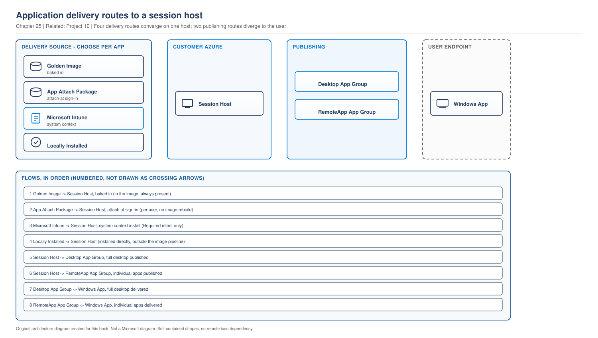

# Chapter 25 - Application Delivery Strategy and RemoteApp Design

> **Book:** Azure Virtual Desktop - Architect to Hands-on Implementation
> **Part VI:** Images, Endpoint Management and Application Delivery
> **Technical baseline:** August 2026

---

## Chapter Information

| Item | Detail |
|---|---|
| **Chapter number** | 25 |
| **Objective** | Choose a delivery route for each application, and design RemoteApp publishing that users can actually work with |
| **Prerequisites** | Chapters 1 to 24. Labs 1 to 4 complete |
| **Dependencies** | Uses the object model from [Chapter 3](ch03-avd-object-model.md), the image split from [Chapter 23](ch23-golden-image-engineering.md) and the Intune rules from [Chapter 24](ch24-intune-and-avd-endpoint-management.md) |
| **Estimated lab time** | Application groups are built in Lab 9 |
| **Azure resources required** | None for the chapter |
| **Cost** | $0.00 for the chapter |

---

## What You Will Learn

- The four delivery routes and a framework for choosing between them per application
- RemoteApp against full desktop, decided from the user's work rather than preference
- How publishing actually works, including the tooling gap that surprises people
- Why an application inventory is the real deliverable, not the delivery mechanism
- Three production scenarios in the full format

---

## Why This Matters

Application delivery is where most AVD projects lose time. Not because the technology is hard, but because nobody made a decision per application, so every application became a separate argument.

The delivery route also decides how often you rebuild the image, how fast you can respond to an application update, and how much your session hosts cost. Those are architecture outcomes, and they follow from a decision most teams make application by application under time pressure.

---

## 1. The Four Delivery Routes

> **OUR ORIGINAL ARCHITECTURE DIAGRAM.** Based on Microsoft's documented delivery options. Not a Microsoft image.

> **OUR ORIGINAL ARCHITECTURE DIAGRAM.** Created for this book. Not a Microsoft diagram.
> Editable source: [`ch25-application-delivery-routes.drawio`](../diagrams/architecture/ch25-application-delivery-routes.drawio)



**What this diagram shows.** Four ways an application reaches a session host on the left, and two ways it is presented to a user on the right. Delivery and publishing are separate decisions, and mixing them up is where confusion starts.

**What each component does.** The golden image contains applications present at first boot. App Attach delivers packages dynamically. Intune installs applications in system context. Locally installed covers anything placed on the host by other means. Application groups then publish what is on the host, either as a full desktop or as individual applications.

**Normal flow.** An application arrives on the session host by one of the four routes. It is then published through a desktop application group or a RemoteApp application group, and appears to the user in Windows App.

**Architect's view.** The left side is a delivery decision and the right side is a user experience decision. They are independent. The same application can be baked into the image and published as a RemoteApp, or delivered by App Attach and used inside a full desktop.

**Failure points.**

| Point | Symptom | Where to look |
|---|---|---|
| Image | Application missing on new hosts | Image version and build record |
| App Attach | Package fails to attach | Package state and assignment |
| Intune | Deploys successfully, never installs | Install context and intent ([Chapter 24](ch24-intune-and-avd-endpoint-management.md#3-the-rules-that-differ-from-a-laptop)) |
| Publishing | Application on the host but not visible | Application group assignment |
| Both group types on one pool | User sees only one type | Preferred application group type ([Chapter 3](ch03-avd-object-model.md#4-preferred-application-group-type)) |

**Official Microsoft reference:** https://learn.microsoft.com/en-us/azure/virtual-desktop/publish-applications-stream-remoteapp

---

## 2. Choosing a Route Per Application

Do not choose one route for everything. Choose per application, using the same four questions each time.

1. **Does every user in the pool need it?** If yes, the image is usually right.
2. **How often does it change?** More often than the image cadence means App Attach or Intune.
3. **Does it need to be isolated or versioned separately?** App Attach.
4. **Is it needed by a subset of users on a shared host?** App Attach, because per-user assignment is its strength.

| Route | Best for | Cost |
|---|---|---|
| Golden image | Applications everyone needs, stable versions, anything needed at first boot | Image rebuild for every change |
| App Attach | Per-user applications, frequent updates, version isolation | Packaging effort, storage, a new operational surface |
| Intune | Applications with existing packaging, mixed physical and virtual estates | System context only, no self-service |
| Locally installed by hand | Nothing in production | Lost at the next update |

**That last row matters.** With session host configuration from [Chapter 16](ch16-automated-host-pools-session-host-configuration.md#3-what-a-session-host-update-actually-does), an application installed by hand disappears when hosts are replaced. There is no supported route that involves logging on to a host and installing something.

### What App Attach gives you

Microsoft's summary is the clearest statement of why it exists: applications are delivered using RemoteApp or as part of a desktop session. Permissions are applied per application per user, giving you greater control over which applications your users can access in a remote session. Desktop users only see the App Attach applications assigned to them. The same application package can be used across multiple host pools. Applications can run on any session host running a Windows client or supported Windows server operating system in the same Azure region as the application package. Applications can be upgraded to a new application version with a new disk image without the need for a maintenance window. Users can run multiple versions of the same application concurrently on the same session host.

Four capabilities in that paragraph that the image cannot give you:

- **Per user, per application permissions on a shared host.** Two users on the same session host can see different applications.
- **One package across host pools.** Package once, use in several pools.
- **Upgrade without a maintenance window.** New version, new disk image, no host rebuild.
- **Multiple versions concurrently.** Genuinely useful for line of business applications during a migration.

**The region constraint is a design input.** The package must be in the same Azure region as the session hosts that use it. In a multi-region design that means a package per region and a process to keep them aligned.

`CURRENCY FLAG - verified August 2026. App Attach now supports MSIX, Appx and App-V packages, and as of 14 April 2026 Windows Server 2022 and 2025 are supported. The original MSIX App Attach was retired on 1 June 2025. Older material describing MSIX App Attach is out of date.`

---

## 3. RemoteApp or Full Desktop

Two ways to present applications, and the choice comes from how the user works.

Microsoft's definition: there are two ways to make applications available to users in Azure Virtual Desktop: as part of a full desktop or as individual applications with RemoteApp. You publish applications by adding them to an application group, which is associated with a host pool and workspace, and assigned to users.

**Publish a full desktop when** the user spends their day in the environment, needs several applications together, needs file management, or needs a familiar Windows desktop.

**Publish RemoteApp when** the user needs one or two applications alongside a working local device, or when you want to avoid giving access to a full Windows environment.

### The publishing rules that matter

Two constraints from Microsoft that shape the design.

**Desktop application groups and App Attach.** For desktop application groups, you can only publish a full desktop and all applications in MSIX packages using app attach to appear in the user's start menu in a desktop session. If you use app attach, applications aren't added to a desktop application group. And from the setup guidance: adding a package, setting it to active, and assigning it to a host pool and users automatically makes the application available in a desktop session. You can't add MSIX or Appx applications to the desktop application group with App Attach.

So for desktop sessions, assigning the App Attach package is the whole job. There is no publishing step. For RemoteApp, you also add the application to a RemoteApp application group.

**Both group types on one host pool.** Users who have access to both a desktop application group and RemoteApp application group assigned to the same host pool only have access to the type of applications from the application group determined by the preferred application group type for the host pool.

This is the setting from [Chapter 3](ch03-avd-object-model.md#4-preferred-application-group-type), and here is its practical consequence: publishing RemoteApps on a pool whose preferred type is Desktop means users never see them. Nothing errors. The applications simply are not there.

### The tooling gap

Worth knowing before you plan automation: you can't publish applications using Azure CLI.

Portal and PowerShell only. If your deployment pipeline is CLI based, application publishing needs PowerShell, and that has to be in the design rather than discovered during build.

Publishing also has a prerequisite that catches people: make sure you have at least one session host powered on in the host pool the application group is assigned to. The portal reads the Start menu from a live host to offer the application list. On a pool that scales to zero overnight, publishing fails at 7am for a reason that has nothing to do with the application.

**Permissions.** As a minimum, the Azure account you use must have the Desktop Virtualization Application Group Contributor built-in role-based access control role, and as covered in [Chapter 10](ch10-rbac-delegation-administrative-model.md#2-the-built-in-roles), assigning users to the group additionally needs User Access Administrator.

---

## 4. Publishing in Practice

```powershell
# Add an application installed locally on session hosts to a RemoteApp group
New-AzWvdApplication `
  -ResourceGroupName rg-avd-service-lab-eus2-01 `
  -GroupName ag-apps-lab-eus2-01 `
  -Name "Contoso LOB" `
  -FilePath "C:\Program Files\Contoso\LOB.exe" `
  -IconPath "C:\Program Files\Contoso\LOB.exe" `
  -IconIndex 0 `
  -CommandLineSetting DoNotAllow `
  -ShowInPortal:$true
```

**What this does.** Publishes an application that is installed on the session hosts, as an individual application in the RemoteApp group.
**Prerequisites.** The RemoteApp application group exists and is attached to a host pool. At least one session host is powered on. The application is installed on the hosts. You hold Desktop Virtualization Application Group Contributor.
**Expected result.** The application appears in the group, and assigned users see it in Windows App after re-subscribing.
**Common failures.** The file path differs between hosts, so the application launches on some and not others. The host pool preferred application group type is Desktop, so nothing appears. No host is powered on, so the portal cannot enumerate applications.

**On `CommandLineSetting`.** Allowing command line arguments on a published application means a user can pass parameters to it. For a line of business application that is sometimes required. For anything else, `DoNotAllow` is the safer default, and it is worth a deliberate decision rather than accepting whatever was set.

**Application source options.** When adding through the portal, from the application source drop-down list, select App Attach, Start menu, or File path. Start menu is easier and depends on a powered-on host. File path is explicit and survives a pool with no running hosts, provided you know the path.

---

## 5. The Real Deliverable: The Application Inventory

The delivery mechanism is the easy part. The work that decides whether the project succeeds is the inventory, and it is usually underestimated.

For each application you need:

| Field | Why |
|---|---|
| Name and version | Obvious, and frequently missing |
| Who uses it | Decides image, App Attach or Intune |
| Business owner | Someone must approve testing and sign off |
| Update frequency | Decides route against image cadence |
| Licensing model | Per device licensing behaves differently on shared hosts |
| Dependencies | Runtimes, drivers, services, other applications |
| Delivery route | The decision, recorded |
| Test evidence | Who tested it, on what, when |

**Licensing deserves a warning.** An application licensed per device behaves unexpectedly on a pooled host, where many users share a device. Some vendors handle this and some do not. Check before you commit to a delivery route, because the answer can force an application onto a personal host pool.

**Dependencies are where migrations slip.** An application that needs a specific runtime, a printer driver, or a service account is not a packaging problem, it is a design problem. Find those early by building the inventory before choosing routes, not after.

---

## 6. How This Changes With Scale

**Around 100 users.** Everything in the image. App Attach adds an operational surface that a small estate does not need. Publish a full desktop and move on.

**Around 1,000 users.** Personas need different applications, so a single image no longer fits. This is where App Attach earns its place, because per-user assignment on a shared host removes the need for one image per persona. The inventory becomes a maintained document rather than a project artifact.

**Around 5,000 users and beyond.** Application delivery is a service with its own lifecycle. Packages need versioning, testing and a release process. The region constraint means packages replicated per region with a process to keep them aligned. Multiple versions running concurrently becomes genuinely useful during migrations. And the inventory must be authoritative, because at this size nobody can hold the application estate in their head, and an unowned application is one nobody will test before an image change.

---

## 7. Architect's Reality Check

**What engineers commonly get wrong.** They choose one delivery route for the whole estate. Everything in the image means a rebuild for every application change. Everything in App Attach means packaging effort for applications that never change.

**What I would check first in production.** Whether the application is on the host at all. That splits the problem cleanly between delivery and publishing, and people usually start on the wrong side of it.

**What I would ask the customer.** For the application list with an owner per application. If there is no owner, there is nobody to test it and nobody to approve the migration, and that application will hold up go-live.

**What I would decide as the architect.** Route per application against the four questions. Image for the common set, App Attach for per-user and frequently changing applications, Intune where packaging already exists. And the inventory as a maintained deliverable with a named owner, because it is the thing that decays fastest.

**What I would say in an interview.** That delivery and publishing are separate decisions, then the preferred application group type trap: publishing RemoteApps to a pool set to Desktop means users never see them and nothing errors.

---

## 8. Production Scenarios

### Scenario 1: Published applications that nobody can see

**Problem.** A RemoteApp application group is created with twelve applications for a partner user group. Users subscribe successfully and see only their desktop.

**Symptoms.** The applications are visible in the portal, assigned to the correct group. Users are in that group. Their desktop works. The RemoteApps are simply absent from Windows App.

**Business impact.** A partner onboarding programme blocked for 200 external users, with a contractual start date. No error to escalate, which makes it look like a user problem for the first day.

**Initial assumption.** The host pool preferred application group type. When both group types are attached to one pool, users only get the type set as preferred, and nothing reports this as a failure.

**Investigation.**

```powershell
Get-AzWvdHostPool -ResourceGroupName rg-avd-service-lab-eus2-01 -Name hp-avd-lab-eus2-01 |
  Select-Object Name, PreferredAppGroupType

Get-AzWvdApplicationGroup -ResourceGroupName rg-avd-service-lab-eus2-01 |
  Select-Object Name, ApplicationGroupType, HostPoolArmPath
```

Then confirm the users are assigned to the RemoteApp group, not only to the desktop group.

**Evidence.** Both a desktop application group and a RemoteApp application group are attached to the same host pool. Preferred application group type is Desktop. The users hold assignments on both.

**Root cause.** The RemoteApp group was added to an existing desktop host pool without changing or considering the preferred type.

**Resolution.** Separate the delivery. Create a dedicated host pool for the RemoteApp workload with preferred type set to RemoteApp, and move the partner users to it.

Changing the preferred type on the existing pool would fix the partner users and break every desktop user on that pool. That is why a separate pool is the right answer, and it is the same reasoning as [Chapter 15](ch15-host-pool-design-decisions.md#4-how-many-host-pools): different delivery needs justify a separate pool.

**Validation.** A partner user signs out fully, re-subscribes and sees the applications. Then confirm desktop users on the original pool are unaffected.

**Prevention.** Set preferred application group type deliberately at host pool creation and record it. Add a check to the publishing runbook that confirms the pool's preferred type matches the application group being published.

**Architect lesson.** A silent constraint is worse than an error. This one is documented, and the design review is where it should be caught.

**Interview lesson.** Naming this trap unprompted shows you have published applications rather than only read the object model.

### Scenario 2: The application that works on some hosts

**Problem.** A published RemoteApp launches for some users and fails for others. It is not consistent by user, and moving a user does not fix it reliably.

**Symptoms.** The application launches on most hosts. On a few, users get an error that the application cannot be found. Which hosts fail changes after image updates.

**Business impact.** Around 15 percent of launch attempts fail across 600 users. Users retry and often get a working host, so the ticket count is far lower than the failure rate, which delays investigation.

**Initial assumption.** The application is not present on every host, or the file path differs. Publishing uses a path, and a path that is correct on the build host is not automatically correct everywhere.

**Investigation.**

Check the published path, then check the hosts:

```powershell
Get-AzWvdApplication -ResourceGroupName rg-avd-service-lab-eus2-01 `
  -GroupName ag-apps-lab-eus2-01 | Select-Object Name, FilePath, CommandLineSetting
```

```bash
az vm run-command invoke -g rg-avd-hosts-lab-eus2-01 -n <vm> \
  --command-id RunPowerShellScript \
  --scripts "Test-Path 'C:\Program Files\Contoso\LOB.exe'"
```

Run that across a sample of hosts, including one that works and one that fails.

**Evidence.** The application is present on hosts built from the current image and absent from hosts built from an older version that has not yet been replaced.

**Root cause.** The application was added to a new image version, and the rolling update had not completed. Publishing does not check whether the application exists on every host.

**Resolution.** Complete the rolling update so every host is on the current image. Where a mixed state must persist, deliver the application through App Attach instead, so it is attached at sign-in regardless of image version.

**Validation.** Confirm the path exists on every host in the pool, not a sample. Then confirm launch success across several users on different hosts.

**Prevention.** Treat application publishing and image rollout as one change. Publish after the rollout completes, or use App Attach where the application must be available during a mixed-image period. Add a host-level presence check to the publishing runbook.

**Architect lesson.** Publishing declares a path. It does not verify the application exists. During a rolling update, the pool is deliberately inconsistent, and any path-based publishing is unreliable until it completes.

**Interview lesson.** Connecting an application failure to an in-progress image rollout shows you think across the estate rather than at one host.

### Scenario 3: An application that cannot be shared

**Problem.** A specialist engineering application is deployed to a pooled host pool. It fails licence validation whenever more than one user runs it on the same host.

**Symptoms.** Works for the first user on a host, fails for the second. Reproducible. The vendor confirms the licence is per device.

**Business impact.** 60 engineers unable to use a core tool reliably, on a platform that was procured partly to give them access to it.

**Initial assumption.** Per device licensing against a shared host. Many users on one machine is exactly the case per device licensing does not anticipate.

**Investigation.** Confirm the licensing model with the vendor in writing, then check whether the vendor supports a concurrent or per user model. Then confirm the behaviour by testing two concurrent users on one host.

**Evidence.** The vendor confirms per device licensing with no multi-session support. Testing matches.

**Root cause.** Not a technical fault. The application's licensing model is incompatible with a shared host, and the inventory did not record licensing.

**Resolution.** Three options, presented with trade-offs.

1. Move those users to a personal host pool, where one user per machine matches the licence.
2. Negotiate a concurrent or per user licence with the vendor.
3. Publish the application from a small dedicated pool sized so licensing works, and keep users on the pooled desktop for everything else.

Option one is usually cleanest for a small group of engineers, and it costs more per user because personal hosts are always allocated.

**Validation.** Two engineers use the application at the same time without licence errors, on the chosen design.

**Prevention.** Record licensing model in the application inventory and check it during assessment, before choosing a delivery route. Ask specifically whether the application is supported on Windows Enterprise multi-session, because vendor support statements often do not mention it.

**Architect lesson.** Licensing can decide host pool type. An application assessment that only covers technical compatibility will miss it, and it is expensive to discover after the pools are built.

**Interview lesson.** Saying that licensing sometimes forces a personal host pool shows you have run application assessments rather than assuming everything can be shared.

---

## 9. The Architect's Four Questions

**What do I check first?** Whether the application is on the session host. That splits delivery problems from publishing problems in one step.

**What can I safely change now?** Publishing an application to a group. Adding an assignment. Reading application group configuration. Testing on one host.

**What must not be changed blindly?**
- Preferred application group type on a live host pool. It changes what every user sees.
- Removing an application from a group. Users lose it at their next sign-in.
- Changing a published file path, which can break launch for everyone.
- Enabling command line arguments on a published application without considering what a user can pass to it.

**When do I escalate to Microsoft?** When an application is confirmed present on every host, the application group and assignments are correct, the preferred type matches, and launch still fails. Collect: the application group and host pool configuration, the published path and command line setting, evidence the file exists on the failing host, the client error and correlation ID, and whether it fails for all users or some.

---

## 10. Common Mistakes

- Choosing one delivery route for the whole estate.
- Publishing RemoteApps to a pool whose preferred application group type is Desktop.
- Adding MSIX or Appx applications to a desktop application group. App Attach packages are assigned, not published, for desktop sessions.
- Publishing during a rolling image update, when the pool is deliberately inconsistent.
- Assuming Azure CLI can publish applications. It cannot.
- Trying to publish when no session host is powered on.
- Installing applications on hosts by hand. They disappear at the next update.
- Ignoring per device licensing on shared hosts.
- Treating the application inventory as a project document rather than a maintained one.
- Forgetting that App Attach packages must be in the same region as the session hosts.

---

## 11. Interview Preparation

### Q72. How do you decide how to deliver an application in AVD?

**Simple answer**
Per application, not per estate. Image for what everyone needs and rarely changes. App Attach for per-user applications, frequent updates and version isolation. Intune where packaging already exists. Never by hand on the host.

**Strong senior architect answer**
"I use four questions per application. Does everyone in the pool need it, how often does it change, does it need version isolation, and is it needed by a subset of users on a shared host. Everyone plus stable means the image. Frequent change or per-user means App Attach, because it applies permissions per application per user, so two people on the same session host can see different applications. That is the capability the image cannot give you, and it is what stops you building one image per persona. Intune fits where packaging already exists for a physical estate, remembering it has to be system context with Required intent on multi-session. And nothing gets installed by hand, because with session host configuration anything applied to a host disappears when it is replaced. The other thing I would separate clearly is that delivery and publishing are different decisions. The same application can be baked into the image and published as a RemoteApp."

**Follow-up you should expect**
"What are App Attach's constraints?" The package must be in the same region as the session hosts, so multi-region means a package per region and a process to keep them aligned. And packaging is real work, so it is not the right route for an application that never changes.

### Q73. RemoteApp or full desktop?

**30 second answer**
"It depends on how the user works. Full desktop where they spend the day in the environment and need several applications and file management. RemoteApp where they need one or two applications alongside a working local device, or where you do not want to hand out a full Windows environment."

**2 minute answer**
Add the constraint that shapes the design. If both a desktop application group and a RemoteApp group are attached to the same host pool, users only get the type set as the preferred application group type. So publishing RemoteApps on a desktop pool means users never see them, and nothing errors. That usually pushes me to a separate host pool for RemoteApp workloads, which is also cleaner because the sizing and the image are often different. Then the practical note that for desktop sessions with App Attach you assign the package and there is no publishing step, whereas RemoteApp needs the application added to the group as well.

**Deep dive answer**
There is a security angle worth adding. RemoteApp limits the user to an application rather than a Windows environment, which is genuinely useful for external partners and contractors, though it is not an isolation boundary on its own and should be paired with the session controls from [Project 06](../scenarios/project-06-byod-remote-workforce.md). Then the operational note that publishing reads the Start menu from a live host, so a pool that scales to zero cannot have applications published until a host is running, which is the sort of thing that turns a 7am change into a failure.

### Q74. What would you ask for before designing application delivery?

**Strong answer**
"The application inventory, with an owner per application. Name, version, who uses it, update frequency, licensing model, dependencies and a business owner. The delivery mechanism is the easy part. The inventory is what decides whether the project lands, because without an owner nobody tests the application and nobody signs it off, and that is what holds up go-live. Two fields matter more than people expect. Licensing, because per device licensing on a shared host can force a persona onto a personal pool. And dependencies, because a runtime or a printer driver is a design problem rather than a packaging problem, and finding it late is expensive."

---

## 12. Key Takeaways

- Delivery and publishing are separate decisions. Choose a delivery route per application.
- Four routes: golden image, App Attach, Intune, and locally installed, which is not viable in production.
- App Attach applies permissions per application per user, so users on the same host can see different applications.
- App Attach packages must be in the same Azure region as the session hosts.
- App Attach supports upgrading to a new version without a maintenance window, and running multiple versions concurrently.
- For desktop sessions with App Attach you assign the package. There is no publishing step. You cannot add MSIX or Appx applications to a desktop application group.
- If both group types are attached to a host pool, users only get the preferred application group type.
- You cannot publish applications with Azure CLI. Portal or PowerShell only.
- At least one session host must be powered on to publish from the Start menu.
- Per device licensing on a shared host can force a persona onto a personal host pool.

---

## 13. Official References

- Publish applications with RemoteApp in Azure Virtual Desktop - https://learn.microsoft.com/en-us/azure/virtual-desktop/publish-applications-stream-remoteapp
- App Attach in Azure Virtual Desktop - https://learn.microsoft.com/en-us/azure/virtual-desktop/app-attach-overview
- Add and manage App Attach applications - https://learn.microsoft.com/en-us/azure/virtual-desktop/app-attach-setup
- Preferred application group type behavior for pooled host pools - https://learn.microsoft.com/en-us/azure/virtual-desktop/preferred-application-group-type
- Deliver applications from partner solutions with App Attach - https://learn.microsoft.com/en-us/azure/virtual-desktop/app-attach-partner-solutions
- Azure Virtual Desktop terminology - https://learn.microsoft.com/en-us/azure/virtual-desktop/terminology

---

## Hands-on Lab

Application groups and publishing are in **Lab 9**.

---

## Chapter Close

**What was completed**
You can choose a delivery route per application, decide between RemoteApp and full desktop, publish correctly, and build the inventory that makes the whole thing manageable.

**What you should test**
Take any application estate you know and fill in the inventory fields from section 5 for five applications. The fields you cannot fill in are the risks.

**What comes next**
[Project 10](../scenarios/project-10-remoteapp-line-of-business.md) covers App Attach in practice, including packaging, image formats, certificates and the failure modes.

**Interview preparation carried forward**
Q71 rewards the four questions and the point that delivery and publishing are separate. Q72 rewards knowing the preferred application group type trap.

---

## Chapter Self-Review

**Pass 1, technical verification.** The two ways to make applications available, the RemoteApp application group behaviour for locally installed and App Attach delivered applications, the rule that App Attach applications are not added to a desktop application group, the preferred application group type behaviour when both group types are attached to one host pool, the requirement for at least one powered-on session host, the Desktop Virtualization Application Group Contributor minimum role, the statement that applications cannot be published using Azure CLI, and the application source options of App Attach, Start menu and File path were all verified against the current Microsoft publish applications with RemoteApp page and the App Attach setup page. The App Attach capability list covering per application per user permissions, package reuse across host pools, the same-region requirement, upgrade without a maintenance window and concurrent versions was verified against the App Attach overview. The Windows Server 2022 and 2025 support date and the retirement of the original MSIX App Attach carry a currency flag. The `New-AzWvdApplication` example uses documented parameters.

**Pass 2, human readability review.** The chapter separates delivery from publishing early, because conflating them is the main source of confusion in this area. The four questions are given before the comparison table, since the questions are the method and the table is reference. The inventory section is deliberately placed after the mechanics, because readers need to understand the routes before they can see why the inventory fields matter. Sentences kept short, scenarios written as narrative, no long dash characters. Read back as an engineer planning an application migration, and the licensing warning was promoted from a table row to its own paragraph, because it can change host pool design.

**Pass 3, visual and topic accuracy review.** One diagram. Topic test applied: with the title removed it reads as application delivery routes reaching a session host and then being published to a user, which is the chapter subject. It is not a generic AVD architecture diagram. Delivery source, session host, publishing and endpoint are separate boundaries, and the split between the four inbound routes and the two outbound presentation options is the visual point. Every node is a component name. Carries the `OUR ORIGINAL ARCHITECTURE DIAGRAM` label. Checked against the fourteen question review in the [diagram standard](../DIAGRAM-STANDARD.md).

**Consistency check against earlier chapters.** The preferred application group type behaviour is consistent with [Chapter 3](ch03-avd-object-model.md#4-preferred-application-group-type) and is applied here rather than restated. The Intune system context and Required intent rules are referenced to [Chapter 24](ch24-intune-and-avd-endpoint-management.md#3-the-rules-that-differ-from-a-laptop). The statement that hand-installed applications do not survive is consistent with [Chapter 16](ch16-automated-host-pools-session-host-configuration.md#3-what-a-session-host-update-actually-does). The image cadence argument is consistent with [Chapter 23](ch23-golden-image-engineering.md#6-what-goes-in-the-image-and-what-does-not). The separate host pool reasoning in Scenario 1 matches the criteria in [Chapter 15](ch15-host-pool-design-decisions.md#4-how-many-host-pools). RBAC requirements match [Chapter 10](ch10-rbac-delegation-administrative-model.md#2-the-built-in-roles). No earlier chapter required correction.

| Check | Result |
|---|---|
| Technical accuracy | Verified against current Microsoft pages |
| Current capability verified | Yes, August 2026, with a currency flag on App Attach package and OS support |
| Supported versus unsupported separated | Yes. The CLI limitation and desktop application group rule stated explicitly |
| Commands, portal paths, PowerShell | Exact, with prerequisites, expected results and common failures |
| Production scenarios | Three, in the extended format |
| Architect's Reality Check | Section 7 |
| Architect's four questions | Section 9 |
| Scale behaviour at 100, 1,000 and 5,000 users | Section 6 |
| Diagrams | One, topic tested, with a classification label |
| Architecture consistency | Consistent with Chapters 3, 10, 15, 16, 23 and 24 |
| Cost statements | Packaging effort and personal pool cost consequence stated |
| Security implications | Command line arguments and RemoteApp as scope reduction rather than isolation |
| Interview answers | Read aloud |
| Duplicate content | Preferred type referenced to Chapter 3, Intune rules to Chapter 24 |
| Simple English | Reviewed |
| Long dash characters | None |
