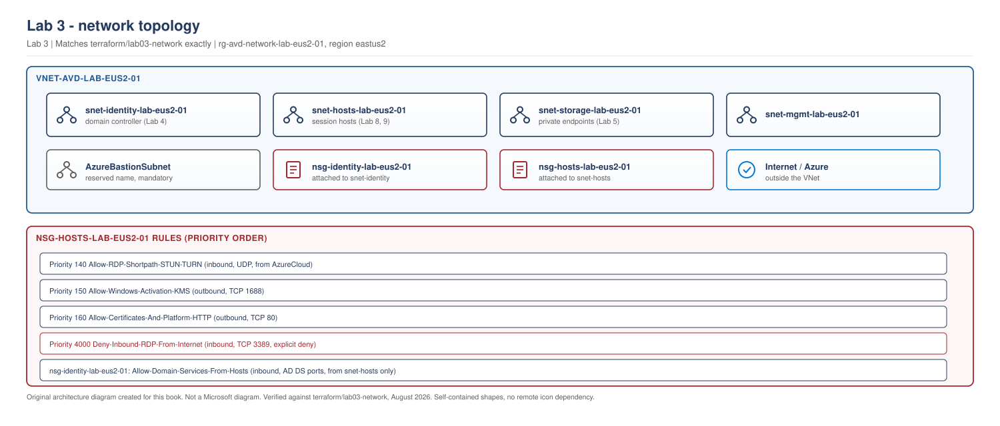

> **Part of:** [Azure Virtual Desktop - Architect to Hands-on Implementation](../README.md)
> **Chapter:** [Chapter 4 - The Connection Flow, End to End](../chapters/ch04-connection-flow-end-to-end.md)
> **Terraform:** [`terraform/lab03-network`](../terraform/lab03-network/)
> **Technical baseline:** August 2026

# LAB 3 - Virtual Network, Subnets, NSGs and DNS

> **LAB ARCHITECTURE** - the environment you build across Labs 1-20. Not a Microsoft reference design.

## Objective

Build the network foundation every later lab sits on. Size the address space so it still works at Lab 20, apply NSGs that permit the outbound traffic AVD actually needs, and set up DNS so that domain join in Lab 4 works first time.

## Lab architecture

> **OUR ORIGINAL ARCHITECTURE DIAGRAM.** Created for this book. Not a Microsoft diagram.
> Editable source: [`lab03-network-topology.drawio`](../diagrams/architecture/lab03-network-topology.drawio)



Four subnets in one virtual network. Session hosts reach Azure and the internet outbound only, with no inbound RDP path. They reach the domain controller in the identity subnet and profile storage in the storage subnet. Azure Bastion is not deployed, only its subnet reserved.

---

## Cost summary

| Resource | Monthly cost |
|---|---|
| Virtual network | **$0.00** - VNets are free |
| Subnets | **$0.00** |
| Network security groups | **$0.00** |
| **Base lab total** | **$0.00/month** |
| *Optional* Azure Bastion (Basic) | **~$140/month plus data** |
| *Optional* NAT Gateway | **~$32/month plus data processing** |

> ⚠️ **Cost warning - Azure Bastion.** Bastion is billed hourly whether or not you use it, and it cannot be stopped - only deleted. At roughly $140/month it is the most expensive thing in this book after session hosts. **Do not deploy it in this lab.** Lab 4 shows a cheaper access pattern. If you later decide you want Bastion, deploy it, use it, and delete it the same day.

**Cost if left running:** $0.00 for the base build. Keep everything - Lab 4 onwards depends on it.

## Prerequisites

- [Lab 2](lab-02-terraform-foundation-and-governance.md) complete: remote state, resource groups, naming and tagging standards
- Terraform initialised against your azurerm backend

---

## Step 1 - Plan the address space before writing any code

This is the step that separates a network you can grow into from one you rebuild in six months.

**Address space:** `10.10.0.0/16` for the lab. In production, take a block from your organisation's IPAM that does not overlap on-premises or any peered network. Overlap is not fixable later without renumbering.

**Subnet plan:**

| Subnet | CIDR | Usable IPs | Purpose |
|---|---|---|---|
| `snet-identity-lab-eus2-01` | `10.10.1.0/24` | 251 | Domain controller (Lab 4) |
| `snet-hosts-lab-eus2-01` | `10.10.2.0/23` | 507 | Session hosts (Lab 8 onwards) |
| `snet-storage-lab-eus2-01` | `10.10.4.0/24` | 251 | Private endpoints for storage (Lab 5) |
| `snet-mgmt-lab-eus2-01` | `10.10.5.0/24` | 251 | Management and jump host |
| `AzureBastionSubnet` | `10.10.250.0/26` | 59 | Reserved, not deployed in this lab |

### Subnet sizing maths - do this properly

Azure reserves **5 addresses in every subnet**: network address, broadcast, and three for platform use (default gateway plus two for DNS and platform mapping). A `/24` gives 256 addresses and therefore **251 usable**, not 254.

For session hosts, size against your *maximum* host count, not today's. A pooled host pool that serves 500 users at 8 users per host needs about 63 hosts - but during a rolling image update you may briefly run double that. A `/23` giving 507 usable addresses handles the lab and demonstrates the reasoning. For Northwind's 3,200 users, work the same calculation per host pool and add headroom for rolling updates, then round up to the next power of two.

**Architect's rule.** Address space is free. Rebuilding a network because you allocated a `/26` is not. Be generous within your IPAM allocation.

**Reserved subnet names.** `AzureBastionSubnet` and `AzureFirewallSubnet` must use exactly those names - Azure will reject anything else. Bastion requires a `/26` or larger.

---

## Step 2 - Understand what the NSG must allow

Refer to [Chapter 4, section 3](../chapters/ch04-connection-flow-end-to-end.md#3-what-session-hosts-actually-need-outbound) for the full FQDN list. The NSG design follows from it:

**Outbound - required:**

| Destination | Port | Why |
|---|---|---|
| Service tag `WindowsVirtualDesktop` | TCP 443 | AVD service traffic and reverse connect |
| Service tag `AzureMonitor` | TCP 443 | Agent traffic and diagnostics |
| Service tag `AzureCloud` | TCP 443 | Agent and SxS stack updates, portal support |
| Service tag `AzureFrontDoor.Frontend` | TCP 443 | Marketplace |
| Service tag `AzureActiveDirectory` | TCP 443 | Authentication |
| Internet | UDP 3478 | STUN/TURN for public-network RDP Shortpath |
| Internet | TCP 1688 | Windows activation (KMS) |
| Internet | TCP 80 | Certificate checks, IMDS, health monitoring |

**Inbound - required from the internet:** none. This is the point of reverse connect.

**Important limitation.** NSGs work with IP addresses, ports and **service tags** - not FQDNs. Some required endpoints (`azkms.core.windows.net`, `oneocsp.microsoft.com`, `catalogartifact.azureedge.net`) can only be filtered by FQDN in Azure Firewall or an NGFW. In this lab, the NSG allows the service tags explicitly and permits the remaining outbound traffic; Chapter 13 covers proper egress control with Azure Firewall and the AVD FQDN tag.

---

## Step 3 - Write the Terraform

Create `terraform/lab03-network/` alongside your Lab 2 configuration. Full files are in [`terraform/lab03-network`](../terraform/lab03-network/). The key pieces:

```hcl
resource "azurerm_virtual_network" "avd" {
  name                = "vnet-avd-${local.suffix}"
  location            = var.location
  resource_group_name = azurerm_resource_group.network.name
  address_space       = ["10.10.0.0/16"]
  tags                = local.common_tags
}

resource "azurerm_subnet" "hosts" {
  name                 = "snet-hosts-${local.suffix}"
  resource_group_name  = azurerm_resource_group.network.name
  virtual_network_name = azurerm_virtual_network.avd.name
  address_prefixes     = ["10.10.2.0/23"]
}
```

The NSG rules that matter:

```hcl
resource "azurerm_network_security_rule" "hosts_out_avd_service" {
  name                        = "Allow-AVD-Service-Traffic"
  priority                    = 100
  direction                   = "Outbound"
  access                      = "Allow"
  protocol                    = "Tcp"
  source_port_range           = "*"
  destination_port_range      = "443"
  source_address_prefix       = "*"
  destination_address_prefix  = "WindowsVirtualDesktop"
  resource_group_name         = azurerm_resource_group.network.name
  network_security_group_name = azurerm_network_security_group.hosts.name
}

resource "azurerm_network_security_rule" "hosts_rdp_udp" {
  name                        = "Allow-AVD-Relayed-RDP-UDP"
  priority                    = 140
  direction                   = "Outbound"
  access                      = "Allow"
  protocol                    = "Udp"
  source_port_range           = "*"
  destination_port_range      = "3478"
  source_address_prefix       = "*"
  destination_address_prefix  = "WindowsVirtualDesktop"
  resource_group_name         = azurerm_resource_group.network.name
  network_security_group_name = azurerm_network_security_group.hosts.name
}

resource "azurerm_network_security_rule" "hosts_deny_inbound_rdp" {
  name                        = "Deny-Inbound-RDP-From-Internet"
  priority                    = 4000
  direction                   = "Inbound"
  access                      = "Deny"
  protocol                    = "Tcp"
  source_port_range           = "*"
  destination_port_range      = "3389"
  source_address_prefix       = "Internet"
  destination_address_prefix  = "*"
  resource_group_name         = azurerm_resource_group.network.name
  network_security_group_name = azurerm_network_security_group.hosts.name
}
```

**Why the explicit inbound RDP deny.** Azure's default rules already block inbound internet traffic, so this rule changes nothing functionally. It is there so that an auditor, a reviewer or a future engineer can see the intent written down. Making security decisions visible is part of the job.

**Why UDP 3478 outbound is called out separately.** It is the rule that keeps public-network RDP Shortpath working. When a network team tightens egress, this is the first thing they remove, and nobody notices until users start describing the session as "laggy" ([Chapter 4, section 4](../chapters/ch04-connection-flow-end-to-end.md#4-rdp-shortpath)).

---

## Step 4 - Deploy

```bash
cd terraform/lab03-network
terraform init
terraform fmt
terraform validate
terraform plan -out=tfplan
terraform apply tfplan
```

**Expected output:** VNet, four subnets, three NSGs and their rules created, with the NSG-to-subnet associations.

---

## Step 5 - Configure DNS

DNS is the single most common cause of failed domain joins in Lab 4, so set it deliberately now.

**For this lab:** leave the VNet on Azure-provided DNS for the moment. In Lab 4 you will deploy a domain controller and then change the VNet's DNS servers to point at it.

**The order that works:**

1. Deploy the domain controller with a **static** private IP (Lab 4).
2. Promote it and confirm the DNS role is running.
3. Change the VNet DNS servers to that static IP.
4. **Restart every VM in the VNet.** VMs cache DNS settings from DHCP and will not pick up the change otherwise.
5. Only then join session hosts to the domain.

**The mistake to avoid:** changing VNet DNS before the DC is actually resolving. Every VM in the VNet then loses name resolution, including the DC itself if it was mid-configuration.

```bash
# Verify current DNS configuration on the VNet
az network vnet show \
  --resource-group rg-avd-network-lab-eus2-01 \
  --name vnet-avd-lab-eus2-01 \
  --query dhcpOptions.dnsServers \
  --output tsv
```

**Expected output:** empty for now, meaning Azure-provided DNS. That is correct at this stage.

---

## Step 6 - Verify the NSG effective rules

Creating a rule is not the same as it applying. Check the effective rules once a NIC exists in the subnet (do this again after Lab 8):

```bash
az network nsg rule list \
  --resource-group rg-avd-network-lab-eus2-01 \
  --nsg-name nsg-hosts-lab-eus2-01 \
  --output table
```

For a deployed VM, the definitive check is:

```bash
az network nic list-effective-nsg \
  --resource-group rg-avd-hosts-lab-eus2-01 \
  --name <nic-name>
```

**Common error:** rules created but the NSG never associated with the subnet. The Terraform in this lab includes the association - confirm it in the plan output rather than assuming.

---

## Validation Checklist

- [ ] VNet `vnet-avd-lab-eus2-01` exists with address space `10.10.0.0/16`
- [ ] Four subnets created with the planned CIDRs
- [ ] Subnet address ranges do not overlap, and none overlaps your home or corporate network if you plan to VPN later
- [ ] NSG associated with the hosts subnet (verify in the portal, not just in code)
- [ ] Outbound rule for service tag `WindowsVirtualDesktop` on TCP 443 present
- [ ] Outbound rule for UDP 3478 present
- [ ] Explicit inbound deny for TCP 3389 from Internet present
- [ ] No inbound allow rules from Internet on any subnet
- [ ] All resources carry the seven standard tags
- [ ] `terraform plan` reports no changes after apply
- [ ] Azure Bastion **not** deployed

## Troubleshooting

| Problem | Likely cause | Fix |
|---|---|---|
| `InvalidResourceName` on the Bastion subnet | Wrong name | Must be exactly `AzureBastionSubnet` |
| `NetcfgInvalidSubnet` | Subnet outside the VNet address space, or overlapping another subnet | Recheck the CIDR plan in Step 1 |
| NSG rule rejected: unknown destination | Service tag name typo | Tags are case-sensitive: `WindowsVirtualDesktop`, not `windowsvirtualdesktop` |
| Cannot delete a subnet | Resources still attached | Remove NICs and private endpoints first |
| Terraform wants to recreate the VNet | Address space changed in code | Changing address space is destructive - plan carefully, and never do this in production without a migration plan |

## Cleanup

**Keep everything.** Base cost is $0.00/month and Labs 4 onward depend on this network.

**If you deployed Bastion despite the warning:** delete it now. It bills hourly and cannot be stopped.

```bash
# Only if you deployed Bastion
az network bastion delete \
  --resource-group rg-avd-network-lab-eus2-01 \
  --name bas-avd-lab-eus2-01
```

## Lab 3 Interview Questions

**Q. How do you size subnets for an AVD deployment?**
Start from the maximum session host count per host pool, not the current count, then add headroom for rolling image updates where old and new hosts coexist. Remember Azure reserves five addresses per subnet. Then take the allocation from corporate IPAM so it never overlaps on-premises or peered ranges, because overlap can only be fixed by renumbering. I size generously - address space costs nothing and rebuilding a network costs a project.

**Q. What inbound rules do AVD session hosts need?**
None from the internet. All required AVD traffic is outbound over 443 to the AVD service. The only inbound case is RDP Shortpath for managed networks with the UDP listener enabled, where clients reach the host on 3390 over ExpressRoute or VPN - and even that is optional, because managed networks can use ICE/STUN without a listener.

**Q. Why can't you just allow AVD's IP ranges on the firewall?**
Because Microsoft doesn't publish a static IP range list for AVD. The supported approach is service tags in NSGs and Azure Firewall, and the AVD FQDN tag in Azure Firewall. On a third-party NGFW you need a dynamic Azure IP address list. This comes up constantly with network teams who want a fixed list, and the honest answer is that one doesn't exist.

---

## What comes next

[Lab 4 - Identity Integration](lab-04-identity-integration.md) deploys the domain controller and completes the DNS change described in Step 5. **Lab 4 is the first lab with running compute cost** - a single small VM, roughly $30-70/month if left running continuously, and the lab shows you how to deallocate it between sessions.
