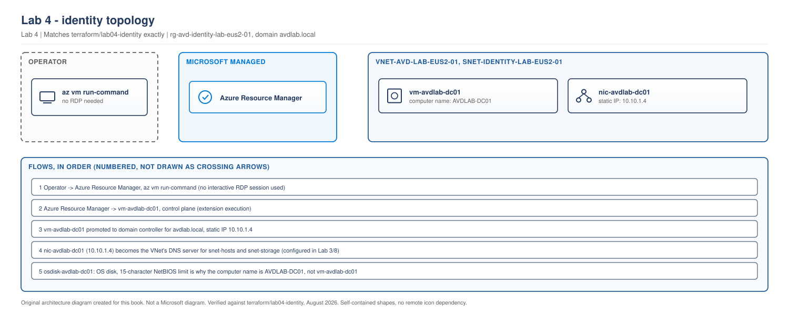

> **Part of:** [Azure Virtual Desktop - Architect to Hands-on Implementation](../README.md)
> **Chapter:** [Chapter 7 - Identity Architecture Foundations](../chapters/ch07-identity-architecture-foundations.md)
> **Terraform:** [`terraform/lab04-identity`](../terraform/lab04-identity/)
> **Technical baseline:** August 2026

# LAB 4 - Identity Integration

> **LAB ARCHITECTURE** - the environment you build across Labs 1 to 20. Not a Microsoft reference design.

## Objective

Deploy a domain controller into the identity subnet, promote it, point the VNet at it for DNS, and prove that name resolution works. This gives you the hybrid join model used from Lab 8 onwards.

You build the DC even though [Chapter 7](../chapters/ch07-identity-architecture-foundations.md) argues that many designs no longer need one. There are two reasons. Most enterprise environments you will work in have this model, and you cannot properly understand what Entra Kerberos removes until you have seen what it replaces.

---

## ⚠️ Cost warning. Read this before you start.

This is the first lab that costs real money.

| Resource | Size | Running cost | Deallocated cost |
|---|---|---|---|
| Domain controller VM | Standard_B2s (2 vCPU, 4 GB) | ~$30 per month | $0 for compute |
| OS managed disk | 127 GB Standard SSD (E10) | ~$10 per month | ~$10 per month, disks bill whether or not the VM runs |
| Network interface, static private IP | | $0 | $0 |
| **Total if left running 24/7** | | **~$40 per month** | |
| **Total if deallocated between sessions** | | | **~$10 per month** |

A Standard_D2s_v5 instead of B2s would be around $70 per month running. B2s is enough for a lab domain controller with a handful of objects. Do not size a production DC this way.

**The rule for the rest of this book: deallocate compute when you finish a session.** Stopping a VM from inside Windows does not stop billing. You must deallocate it from Azure.

```bash
# Deallocate at the end of every lab session
az vm deallocate \
  --resource-group rg-avd-identity-lab-eus2-01 \
  --name vm-avdlab-dc01

# Start it again next session
az vm start \
  --resource-group rg-avd-identity-lab-eus2-01 \
  --name vm-avdlab-dc01
```

**Keep this VM.** Labs 5, 6, 8 and 12 all depend on it. Deallocate it, do not delete it.

---

## Lab architecture

> **OUR ORIGINAL ARCHITECTURE DIAGRAM.** Created for this book. Not a Microsoft diagram.
> Editable source: [`lab04-identity-topology.drawio`](../diagrams/architecture/lab04-identity-topology.drawio)



One domain controller with a static private IP and no public IP. All configuration goes through Azure Resource Manager using `az vm run-command`, so no management port is exposed. Dotted components are built in later labs and are not created here.

---

## Prerequisites

- [Lab 3](lab-03-vnet-subnets-nsg-dns.md) complete. VNet and subnets exist
- Terraform initialised against your azurerm backend
- A strong local administrator password ready. It goes in `terraform.tfvars`, which is gitignored

## Lab design decisions

Two choices in this lab are deliberate and worth understanding.

**No public IP address and no Azure Bastion.** The DC has no public exposure at all. You configure it entirely through `az vm run-command`, which sends PowerShell to the VM through the Azure control plane. No RDP, no inbound rules, no Bastion cost. This is also a good habit. Production domain controllers should not have public IPs.

**Static private IP.** A domain controller's IP becomes the DNS server for the whole VNet. It cannot change. Terraform sets it explicitly to `10.10.1.4`, the first usable address in the identity subnet.

---

## Step 1 - Deploy the VM with Terraform

Full configuration is in [`terraform/lab04-identity`](../terraform/lab04-identity/). The important parts:

```hcl
resource "azurerm_network_interface" "dc" {
  name                = "nic-avdlab-dc01"
  location            = var.location
  resource_group_name = var.identity_resource_group_name

  ip_configuration {
    name                          = "internal"
    subnet_id                     = data.azurerm_subnet.identity.id
    private_ip_address_allocation = "Static"
    private_ip_address            = var.dc_private_ip
  }

  tags = local.common_tags
}

resource "azurerm_windows_virtual_machine" "dc" {
  name                  = "vm-avdlab-dc01"
  computer_name         = "AVDLAB-DC01"
  location              = var.location
  resource_group_name   = var.identity_resource_group_name
  size                  = var.dc_vm_size
  admin_username        = var.dc_admin_username
  admin_password        = var.dc_admin_password
  network_interface_ids = [azurerm_network_interface.dc.id]

  os_disk {
    caching              = "ReadWrite"
    storage_account_type = "StandardSSD_LRS"
  }

  source_image_reference {
    publisher = "MicrosoftWindowsServer"
    offer     = "WindowsServer"
    sku       = "2022-datacenter-azure-edition"
    version   = "latest"
  }

  tags = local.common_tags
}
```

**Why `computer_name` is set separately.** Windows computer names have a 15 character limit. The Azure resource name follows the book's convention, and the Windows name is kept short enough to be valid. This bites people at Lab 8 when session host names are generated automatically.

**Why Standard SSD and not Premium.** A lab DC does almost no IO. Premium SSD would roughly triple the disk cost for no benefit. Production DCs are a different conversation.

```bash
cd terraform/lab04-identity
cp terraform.tfvars.example terraform.tfvars
# edit terraform.tfvars: set owner and dc_admin_password
terraform init
terraform fmt
terraform validate
terraform plan -out=tfplan
terraform apply tfplan
```

**Expected output:** network interface and virtual machine created. Deployment takes three to five minutes.

**Common errors:**

- *Password does not meet complexity requirements.* Azure requires 12 to 123 characters with three of: lowercase, uppercase, digit, special character.
- *Quota exceeded.* Go back to [Lab 1 Step 3](lab-01-azure-prerequisites-and-tooling.md) and request an increase.
- *Subnet not found.* The data source is reading Lab 3's output. Confirm the VNet and subnet names match.

---

## Step 2 - Install the AD DS role

Everything from here uses `az vm run-command`. No RDP session is needed.

```bash
az vm run-command invoke \
  --resource-group rg-avd-identity-lab-eus2-01 \
  --name vm-avdlab-dc01 \
  --command-id RunPowerShellScript \
  --scripts "Install-WindowsFeature -Name AD-Domain-Services -IncludeManagementTools"
```

**What this does:** installs the Active Directory Domain Services role and the management tools. It does not promote the server yet.

**Expected output:** JSON containing `Success` and `RestartNeeded : No`.

**How long:** one to two minutes. `run-command` has a timeout, so if it returns nothing, run the check again rather than assuming failure.

---

## Step 3 - Promote to a domain controller

This creates a new forest. The lab domain is `avdlab.local`.

```bash
az vm run-command invoke \
  --resource-group rg-avd-identity-lab-eus2-01 \
  --name vm-avdlab-dc01 \
  --command-id RunPowerShellScript \
  --scripts "\$securePassword = ConvertTo-SecureString 'ReplaceWithYourDsrmPassword1!' -AsPlainText -Force; Install-ADDSForest -DomainName 'avdlab.local' -DomainNetbiosName 'AVDLAB' -SafeModeAdministratorPassword \$securePassword -InstallDns -Force -NoRebootOnCompletion:\$false"
```

**What this does:** creates a new AD forest, installs and configures the DNS role, sets the Directory Services Restore Mode password, and reboots.

**A note on the domain name.** `.local` is used here because this is a disconnected lab. For production, use a subdomain of a domain you own, such as `ad.contoso.com`. Do not use `.local` in production, and do not use the same name as your public domain.

**Expected behaviour:** the command may return an error or time out because the VM reboots while it is running. That is normal. Wait three to five minutes, then verify.

**Common errors:**

- *DSRM password complexity.* Same rules as the admin password.
- *The command appears to hang.* The reboot killed the connection. Wait and verify rather than re-running the promotion.

---

## Step 4 - Verify the promotion

```bash
az vm run-command invoke \
  --resource-group rg-avd-identity-lab-eus2-01 \
  --name vm-avdlab-dc01 \
  --command-id RunPowerShellScript \
  --scripts "Get-ADDomain | Select-Object DNSRoot, NetBIOSName, DomainMode; Get-Service ADWS, DNS, NTDS | Select-Object Name, Status"
```

**Expected output:** `DNSRoot : avdlab.local`, `NetBIOSName : AVDLAB`, and all three services showing `Running`.

If `Get-ADDomain` errors, the promotion did not complete. Check the Windows System and Directory Service event logs before re-running anything.

---

## Step 5 - Point the VNet at the domain controller

This is the step that breaks environments when it is done in the wrong order. Only do it now that Step 4 has passed.

```bash
az network vnet update \
  --resource-group rg-avd-network-lab-eus2-01 \
  --name vnet-avd-lab-eus2-01 \
  --dns-servers 10.10.1.4
```

**What this does:** every VM in the VNet will now receive `10.10.1.4` as its DNS server through DHCP.

**Then restart the VMs.** VMs cache DNS settings from DHCP and will not pick up the change until they restart.

```bash
az vm restart \
  --resource-group rg-avd-identity-lab-eus2-01 \
  --name vm-avdlab-dc01
```

**Why the DC itself needs restarting too:** it is a VM in the same VNet and it also caches its DNS setting.

**The mistake to avoid.** Do not set VNet DNS before the DC is resolving. If you do, every VM in the VNet loses name resolution, including the DC while it is mid-configuration. If that happens, set the DNS servers back to empty, restart, fix the DC, and try again.

> **Terraform note.** This lab sets DNS with the CLI so that you can see the ordering clearly. In production this belongs in Terraform, on the `azurerm_virtual_network` resource using the `dns_servers` argument. The reason it is not in the Terraform here is that Terraform would try to set it during the same apply that creates the DC, before the DC exists. Ordering problems like this are exactly why some steps stay imperative. [Project 03](../scenarios/project-03-global-enterprise-governance.md) covers how to handle this properly with separate applies at scale.

---

## Step 6 - Create test users and groups

These are used from Lab 16 onwards for assignment testing (Labs 11-20 build a second, centralus-based identity and a non-overlapping group assignment pattern across both regions - see the [Labs 11-20 plan](../appendices/labs-11-20-plan.md)).

```bash
az vm run-command invoke \
  --resource-group rg-avd-identity-lab-eus2-01 \
  --name vm-avdlab-dc01 \
  --command-id RunPowerShellScript \
  --scripts "New-ADOrganizationalUnit -Name 'AVD' -Path 'DC=avdlab,DC=local'; New-ADOrganizationalUnit -Name 'Users' -Path 'OU=AVD,DC=avdlab,DC=local'; New-ADOrganizationalUnit -Name 'SessionHosts' -Path 'OU=AVD,DC=avdlab,DC=local'; New-ADGroup -Name 'AVD-Task-Users' -GroupScope Global -Path 'OU=Users,OU=AVD,DC=avdlab,DC=local'; \$pw = ConvertTo-SecureString 'ReplaceWithYourUserPassword1!' -AsPlainText -Force; 1..3 | ForEach-Object { New-ADUser -Name \"avdtest0\$_\" -SamAccountName \"avdtest0\$_\" -UserPrincipalName \"avdtest0\$_@avdlab.local\" -AccountPassword \$pw -Enabled \$true -Path 'OU=Users,OU=AVD,DC=avdlab,DC=local'; Add-ADGroupMember -Identity 'AVD-Task-Users' -Members \"avdtest0\$_\" }"
```

**What this does:** creates an OU structure, one group, and three test users in that group.

**Why a separate OU for session hosts:** so that GPO can be scoped to them without affecting anything else. You will use this in Lab 6 for FSLogix settings.

**Verify:**

```bash
az vm run-command invoke \
  --resource-group rg-avd-identity-lab-eus2-01 \
  --name vm-avdlab-dc01 \
  --command-id RunPowerShellScript \
  --scripts "Get-ADUser -Filter * -SearchBase 'OU=Users,OU=AVD,DC=avdlab,DC=local' | Select-Object Name, UserPrincipalName; Get-ADGroupMember -Identity 'AVD-Task-Users' | Select-Object Name"
```

**Expected output:** three users listed, all three shown as members of the group.

---

## Step 7 - A note on Entra Connect

A real hybrid environment syncs these accounts to Entra ID, because [Chapter 7 section 1](../chapters/ch07-identity-architecture-foundations.md#1-start-with-the-rule-that-applies-to-everyone) established that users must be discoverable in Entra ID.

This lab does not install Entra Connect, for a practical reason. Syncing a `.local` domain to a real tenant creates accounts you then have to clean up, and it can conflict with an existing tenant. If you have a dedicated test tenant, install Entra Cloud Sync and sync the `OU=Users,OU=AVD` container only.

For the rest of the labs, session hosts join `avdlab.local` and users are assigned from Entra ID directly. The [Chapter 8](../chapters/ch08-authentication-flows-in-detail.md) walkthrough explains how the two identities line up in a production hybrid design.

`[VERIFY BEFORE IMPLEMENTATION]` Entra Connect and Entra Cloud Sync have different supported topologies and version requirements. Check the current guidance before deploying either into a real tenant.

---

## Validation Checklist

- [ ] VM `vm-avdlab-dc01` deployed with no public IP address
- [ ] Private IP is exactly `10.10.1.4` and set to Static
- [ ] `Get-ADDomain` returns `avdlab.local`
- [ ] ADWS, DNS and NTDS services all Running
- [ ] VNet DNS servers set to `10.10.1.4`
- [ ] DC restarted after the DNS change
- [ ] OU structure created: `OU=AVD`, with `Users` and `SessionHosts` beneath it
- [ ] Three test users created and in the `AVD-Task-Users` group
- [ ] All resources tagged with the seven standard tags
- [ ] `terraform plan` reports no changes after apply
- [ ] **VM deallocated at the end of the session**

## Troubleshooting

| Problem | Likely cause | Fix |
|---|---|---|
| `run-command` returns nothing | VM rebooting, or the command exceeded the timeout | Wait, then run a verification command rather than repeating the action |
| `Get-ADDomain` fails after promotion | Promotion did not finish | Check the Directory Service event log before re-running |
| Other VMs cannot resolve `avdlab.local` | VMs not restarted after the DNS change | Restart them. DNS comes from DHCP and is cached |
| Domain join fails in Lab 8 | VNet DNS not pointing at the DC, or the DC is deallocated | Check both. A deallocated DC is the most common cause |
| Terraform wants to replace the VM | `source_image_reference` version drift or a size change | Read the plan carefully. Replacing a promoted DC means rebuilding the domain |
| Password rejected | Complexity rules | 12 to 123 characters, three of the four character classes |

## Cleanup

**Do not delete this VM.** Labs 5, 6, 8 and 12 depend on it.

**Do deallocate it at the end of every session.**

```bash
az vm deallocate \
  --resource-group rg-avd-identity-lab-eus2-01 \
  --name vm-avdlab-dc01
```

Running cost drops to the disk only, about $10 per month. Over the rest of the book that is the difference between roughly $40 and roughly $10 per month for this component alone. Get into the habit now, because Lab 8 adds session hosts and the same discipline saves considerably more there.

## Lab 4 Interview Questions

**Q. Where would you place domain controllers for an AVD deployment?**
At least one in every region where session hosts run, in a dedicated subnet, with no public IP. The reason is logon latency and failure isolation. If session hosts in one region have to authenticate across a WAN link to another region, logon time becomes unpredictable and a single link failure takes down desktops that are otherwise healthy. I would also use static private IPs, because those addresses become the VNet DNS servers and cannot move.

**Q. Why does the order matter when changing VNet DNS?**
Because every VM in the VNet gets its DNS server from DHCP. If you point the VNet at a DC that is not yet resolving, everything in that VNet loses name resolution, including the DC while it is being configured. Promote and verify the DC first, then change VNet DNS, then restart the VMs so they pick up the new setting.

**Q. You configured this domain controller without ever opening RDP. Why does that matter?**
Because a domain controller with a public IP is an unnecessary attack surface, and adding Bastion just for setup would have cost about $140 a month. `az vm run-command` sends PowerShell through the Azure control plane, so configuration goes through Azure RBAC and the activity log instead of an open port. It is the same reason AVD itself uses reverse connect. Keep the management path off the network path.

---

## What comes next

[Chapter 8](../chapters/ch08-authentication-flows-in-detail.md) explains the authentication stages in an AVD connection. **Lab 5 builds profile storage** and uses the identity foundation from this lab.

**Before you close this session, deallocate the VM.**
