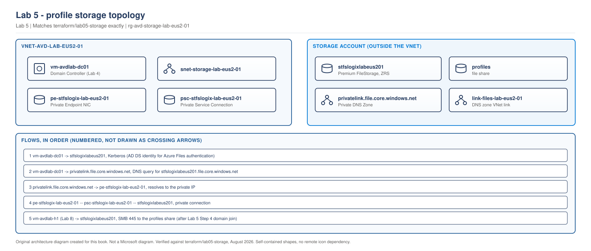

# Lab 5 - Profile Storage

> **Book:** Azure Virtual Desktop - Architect to Hands-on Implementation
> **Depends on:** Lab 2 (foundation), Lab 3 (network), Lab 4 (identity)
> **Feeds into:** Lab 6 (FSLogix configuration)

---

## Objective

Deploy the Azure Files share that will hold FSLogix profile containers, with the identity, permission, and network design decided in [Chapter 20](../chapters/ch20-profile-storage-architecture.md) actually built rather than only discussed: AD-based Kerberos authentication, the two-layer permission model (share RBAC plus NTFS), a private endpoint so the share has no public exposure, and private DNS resolution from inside the lab VNet.

## Learning objectives

By the end of this lab you will be able to:

- Deploy a Premium `FileStorage` account correctly, and explain why account kind and tier matter for FSLogix
- Configure Azure Files identity-based authentication against Active Directory Domain Services
- Apply both layers of the FSLogix permission model and explain why getting one right without the other produces the same symptom as getting neither right
- Configure a private endpoint and private DNS zone, and prove that resolution actually uses the private path
- Validate storage access from a domain-joined context before any session host exists

## Dependency on previous labs

| From | What this lab consumes |
|---|---|
| Lab 2 | `rg-avd-storage-lab-eus2-01` resource group |
| Lab 3 | The lab VNet and the `snet-storage` subnet the private endpoint attaches to |
| Lab 4 | The domain controller, used both as the AD DS identity source for Azure Files authentication and as the DNS server that must resolve the private endpoint correctly |

If Lab 4's domain controller is currently deallocated, start it before Step 4. Everything through Step 3 works without it.

## Architecture context

> **LAB ARCHITECTURE.** Storage layer added to the environment built in Labs 1-4.

> **OUR ORIGINAL ARCHITECTURE DIAGRAM.** Created for this book. Not a Microsoft diagram.
> Editable source: [`lab05-storage-topology.drawio`](../diagrams/architecture/lab05-storage-topology.drawio)



This is the storage half of [Chapter 20](../chapters/ch20-profile-storage-architecture.md#5-the-two-layer-permission-model)'s access-path diagram, built against the actual lab environment rather than a fictional customer.

## Prerequisites

- Labs 2, 3 and 4 applied successfully
- Lab 4's domain controller reachable (running, not deallocated) for Steps 4-6
- An Entra ID security group to receive share permissions: reuse the test group from Lab 4, or create one: `az ad group create --display-name "avd-lab-users" --mail-nickname "avd-lab-users"`
- Azure CLI signed in with Storage Account Contributor and User Access Administrator on the storage resource group

## Estimated cost

`[VERIFY BEFORE IMPLEMENTATION]`: priced August 2026, re-check with the [Azure Pricing Calculator](https://azure.microsoft.com/pricing/calculator/) for your region before relying on this figure.

| Resource | Approximate cost |
|---|---|
| Premium FileStorage account, 100 GiB provisioned | ~$16-20/month while it exists |
| Private endpoint | ~$0.01/hour (~$7/month) plus a small per-GB processing charge |
| Private DNS zone | Negligible |

**This lab has no power state to manage.** Unlike compute, storage bills continuously while it exists regardless of whether anyone is using it. If you are not continuing to Lab 6 immediately, either delete the storage account (`terraform destroy` in this folder) or accept the small ongoing cost and clean up at the end of the lab sequence.

## Required tools

Azure CLI, Terraform, and (for Steps 4-6) a way to run commands against the domain-joined VM from Lab 4 (`az vm run-command`, no RDP needed, consistent with Lab 4).

---

## Security considerations

- `public_network_access_enabled = false` from the first apply. The share is never reachable except through the private endpoint, before any data is stored.
- `shared_access_key_enabled = true` is left on for this lab because it simplifies initial validation; the chapter's production guidance is to disable it once identity-based authentication is confirmed working, which Step 7 walks through.
- Two permission layers are configured deliberately in separate steps (Step 3 share RBAC, Step 6 NTFS) rather than one broad grant, so you experience the actual failure mode ([Chapter 20](../chapters/ch20-profile-storage-architecture.md#5-the-two-layer-permission-model)) rather than reading about it.

---

## Step 1 - Deploy storage with Terraform

Full configuration is in [`terraform/lab05-storage`](../terraform/lab05-storage/). The important parts:

```hcl
resource "azurerm_storage_account" "fslogix" {
  name                 = "stfslogix${var.environment}${var.location_short}01"
  account_kind          = "FileStorage" # required for premium file shares
  account_tier           = "Premium"
  account_replication_type = "ZRS"        # premium shares support LRS or ZRS only

  public_network_access_enabled = false

  azure_files_authentication {
    directory_type = "AD"
  }
}
```

**Why `FileStorage`, not `StorageV2`.** Premium file shares (the tier this lab and the chapter recommend for FSLogix) are only available on the `FileStorage` account kind. Choosing `StorageV2` here is the single most common mistake when building this by hand in the portal, because the option to add a premium share simply does not appear and it is not obvious why.

**Why ZRS.** [Chapter 20](../chapters/ch20-profile-storage-architecture.md#4-redundancy-the-decision-most-designs-skip) explains the constraint this satisfies: premium file shares support only LRS or ZRS, never GRS or GZRS, so a design that wants both premium performance and geo-redundancy on a single Azure Files share cannot have it. ZRS is the default worth arguing for.

```bash
cd terraform/lab05-storage
cp terraform.tfvars.example terraform.tfvars
# edit terraform.tfvars: set owner and avd_users_group_object_id
terraform init
terraform fmt
terraform validate
terraform plan -out=tfplan
terraform apply tfplan
```

**Expected output:** storage account, file share, private endpoint, private DNS zone and A record created. Takes three to six minutes.

**Common errors:**

- *Account kind cannot be changed after creation.* If you created a `StorageV2` account by hand first and are now trying to import it, delete and recreate rather than trying to convert it.
- *Private endpoint subnet does not support private endpoint policies.* Confirm `private_endpoint_network_policies_enabled` is not blocking it on the storage subnet from Lab 3.
- *Quota errors on the storage account name.* Storage account names are globally unique; if `stfslogixlabeus01` is taken, adjust the name in `storage.tf`.

---

## Step 2 - Validate the private endpoint and DNS resolution

This is worth proving before going further, because a DNS misconfiguration here produces a confusing symptom three labs from now rather than an obvious one today.

```bash
# From Cloud Shell or any machine that can reach the storage account's public identity plane
az storage account show \
  --name <storage_account_name> \
  --resource-group rg-avd-storage-lab-eus2-01 \
  --query "{publicAccess:publicNetworkAccess, kind:kind, tier:accountTier}" -o table
```

**Expected output:** `publicAccess: Disabled`, `kind: FileStorage`, `tier: Premium`.

Then, from the domain controller (which sits inside the VNet and uses the private DNS zone):

```bash
az vm run-command invoke -g rg-avd-identity-lab-eus2-01 -n vm-avdlab-dc01 \
  --command-id RunPowerShellScript \
  --scripts "Resolve-DnsName <storage_account_name>.file.core.windows.net"
```

**Expected output:** the private endpoint's IP address (from the Lab 5 Terraform output `private_endpoint_ip`), not a public Azure Files IP. If you see a public IP, the private DNS zone link to the VNet did not take effect: check `azurerm_private_dns_zone_virtual_network_link` applied cleanly.

---

## Step 3 - Assign share-level RBAC (permission layer one)

Already applied by the Terraform in `rbac.tf`, assigning **Storage File Data SMB Share Contributor** to your AVD users group at the share scope. Confirm it:

```bash
az role assignment list \
  --scope "$(az storage account show -n <storage_account_name> -g rg-avd-storage-lab-eus2-01 --query id -o tsv)/fileServices/default/fileshares/profiles" \
  -o table
```

**Expected output:** one role assignment, your AVD users group, role `Storage File Data SMB Share Contributor`.

**This is layer one only.** At this point, a domain-joined identity in that group can reach the share. It cannot yet create or write to a profile folder inside it, because layer two (NTFS) is not configured. That is deliberate: Step 5 proves the failure this produces before Step 6 fixes it, which is a far better way to learn the two-layer model than being told about it.

---

## Step 4 - Join the storage account to the domain for AD authentication

This step cannot be done by the Terraform AzureRM provider: it requires running `Join-AzStorageAccountForAuth` from a domain-joined machine with the Az PowerShell module, which is exactly the kind of manual post-apply step this lab calls out explicitly rather than hiding.

```bash
az vm run-command invoke -g rg-avd-identity-lab-eus2-01 -n vm-avdlab-dc01 \
  --command-id RunPowerShellScript \
  --scripts "
    Install-Module -Name Az.Storage -Force -AllowClobber -Scope AllUsers
    Connect-AzAccount -Identity
    Import-Module Az.Storage
    Join-AzStorageAccountForAuth \
      -ResourceGroupName 'rg-avd-storage-lab-eus2-01' \
      -StorageAccountName '<storage_account_name>' \
      -DomainAccountType 'ComputerAccount' \
      -OrganizationalUnitDistinguishedName 'CN=Computers,DC=avdlab,DC=local'
  "
```

`[VERIFY BEFORE IMPLEMENTATION]`: the domain controller VM needs a system-assigned managed identity with Contributor on the storage account for `Connect-AzAccount -Identity` to work non-interactively; if it does not already have one, assign it first (`az vm identity assign` plus a role assignment) rather than embedding credentials in the script.

**Expected output:** command completes without error. This creates a computer account in AD representing the storage account, which is what makes Kerberos authentication to the share possible.

**Common errors:**

- *Access denied joining the domain.* Confirm the DC's managed identity has Contributor on the storage account, not just Reader.
- *Module not found.* The `Install-Module` step needs outbound internet from the DC, which Lab 3's NSG should already permit for PowerShell Gallery; if it is blocked, install offline or temporarily relax the outbound rule for this step.

---

## Step 5 - Prove the two-layer failure (deliberately)

Before fixing NTFS, confirm what an incomplete permission model actually looks like, because recognising this symptom is worth more than being told about it in the abstract.

```bash
az vm run-command invoke -g rg-avd-identity-lab-eus2-01 -n vm-avdlab-dc01 \
  --command-id RunPowerShellScript \
  --scripts "New-Item -Path '\\\\<storage_account_name>.file.core.windows.net\\profiles\\testfolder' -ItemType Directory"
```

**Expected output at this point: Access Denied.** The share-level RBAC in Step 3 permits reaching the share. There is no NTFS permission yet granting write access inside it. This is exactly the symptom [Chapter 20](../chapters/ch20-profile-storage-architecture.md#5-the-two-layer-permission-model) describes: both layers must be correct, and this is what "correct on layer one, missing on layer two" looks like from the client's side: indistinguishable from getting both layers wrong.

---

## Step 6 - Apply NTFS permissions (permission layer two)

```bash
az vm run-command invoke -g rg-avd-identity-lab-eus2-01 -n vm-avdlab-dc01 \
  --command-id RunPowerShellScript \
  --scripts "
    \$share = '\\\\<storage_account_name>.file.core.windows.net\\profiles'
    \$acl = Get-Acl \$share
    \$rule = New-Object System.Security.AccessControl.FileSystemAccessRule('AVDLAB\\avd-lab-users','Modify','ContainerInherit,ObjectInherit','None','Allow')
    \$acl.SetAccessRule(\$rule)
    Set-Acl -Path \$share -AclObject \$acl
  "
```

Then repeat Step 5's test:

```bash
az vm run-command invoke -g rg-avd-identity-lab-eus2-01 -n vm-avdlab-dc01 \
  --command-id RunPowerShellScript \
  --scripts "New-Item -Path '\\\\<storage_account_name>.file.core.windows.net\\profiles\\testfolder' -ItemType Directory; Remove-Item -Path '\\\\<storage_account_name>.file.core.windows.net\\profiles\\testfolder'"
```

**Expected output:** the folder is created and removed without error. Both permission layers are now correct.

**Design note carried into Lab 6.** Production NTFS permissions should grant each user rights to their own profile folder only, not blanket Modify to the whole group at the share root: this lab uses a simpler group-wide grant to keep the validation step short. [Chapter 20](../chapters/ch20-profile-storage-architecture.md#5-the-two-layer-permission-model) covers the per-user model and why a blanket grant is a data protection problem at production scale.

---

## Step 7 - Optional: disable the storage account key

Once identity-based authentication is proven working end to end, the chapter's production recommendation is to remove the key-based fallback:

```bash
az storage account update \
  --name <storage_account_name> \
  --resource-group rg-avd-storage-lab-eus2-01 \
  --allow-shared-key-access false
```

Leave this until after Lab 6 confirms FSLogix mounts correctly using identity-based authentication, so you have a working fallback while you debug the FSLogix configuration itself.

---

## Validation checklist

- [ ] Storage account is `FileStorage` kind, `Premium` tier, `ZRS` replication
- [ ] `publicNetworkAccess` is `Disabled`
- [ ] DNS resolution of the storage account FQDN from inside the VNet returns the private endpoint IP, not a public IP
- [ ] Share-level RBAC assignment exists and targets the correct group
- [ ] Domain join for AD authentication (`Join-AzStorageAccountForAuth`) completed without error
- [ ] Write access to the share fails before NTFS permissions are applied (Step 5), and succeeds after (Step 6)

## Common errors

| Symptom | Likely cause | Fix |
|---|---|---|
| Portal will not offer a premium file share option | Account kind is `StorageV2`, not `FileStorage` | Recreate the account with the correct kind; it cannot be converted |
| DNS resolves to a public IP | Private DNS zone not linked to the VNet, or linked to the wrong VNet | Check `azurerm_private_dns_zone_virtual_network_link` |
| `Join-AzStorageAccountForAuth` fails with access denied | DC's managed identity lacks Contributor on the storage account | Assign the role, retry |
| Access Denied writing to the share after Step 6 | NTFS rule targeted the wrong group name, or `Set-Acl` silently failed | Re-run `Get-Acl` and inspect the returned rules before assuming the write succeeded |

## Troubleshooting

If DNS resolves correctly and share RBAC is confirmed but writes still fail after Step 6, check both layers independently rather than assuming which one is wrong: this is the exact investigation sequence in [Chapter 20, Scenario 3](../chapters/ch20-profile-storage-architecture.md#9-production-scenarios): confirm the share-level role assignment first, then read the NTFS ACL directly with `Get-Acl` rather than trusting that `Set-Acl` applied what you intended.

## Cleanup versus keep

**Keep** if continuing to Lab 6 immediately: the storage account, share, private endpoint and DNS zone are all consumed by the next lab.

**Cleanup** if pausing here for more than a few days:

```bash
cd terraform/lab05-storage
terraform destroy
```

This is a full teardown; if you keep the storage account, the only ongoing cost is the small figures in the cost table above, not compute, so pausing here without destroying is a reasonable choice if you plan to continue within a week or two.

## Portfolio evidence to capture

- Screenshot of the storage account overview showing `FileStorage` kind, `Premium` tier, `ZRS` replication, and public access disabled
- The DNS resolution output from Step 2 showing the private IP
- The before/after output of Step 5 and Step 6, showing the Access Denied failure and then the successful write: this is the single most interview-relevant piece of evidence from this lab, because it demonstrates you have actually seen the two-layer failure rather than only read about it

## Interview questions from this lab

**Q. Why does Azure Files for FSLogix need two separate permission grants?**

Because Azure Files layers share-level RBAC (an Azure control plane concept, controlling whether an identity can reach the share at all) underneath standard NTFS permissions (a file-system concept, controlling what that identity can do once inside). Both have to be correct. Getting one right and the other wrong produces exactly the same symptom to the user (a failed mount or a permission error) as getting both wrong, which is why the fastest diagnosis checks both independently rather than assuming.

**Q. Why did you choose FileStorage over StorageV2 for this account?**

Premium file shares, which this lab and the underlying chapter recommend for FSLogix because of the IOPS a sign-in burst needs, are only available on the FileStorage account kind. StorageV2 does not offer a premium file share tier at all, and the two kinds cannot be converted into one another after creation.

**Q. What would you change about this lab's NTFS permissions for a production deployment?**

Move from a blanket group-wide Modify grant at the share root to per-user folder permissions, so a user can access only their own profile folder rather than every colleague's. This lab keeps the simpler group-wide grant to keep the validation step short; production identity design should not.

---

## What comes next

[Lab 6 - FSLogix](lab-06-fslogix.md) installs the FSLogix agent on a session host (deployed in Lab 8: this lab's validation was deliberately done from the domain controller so it did not need to wait for one) and points it at the share built here.
