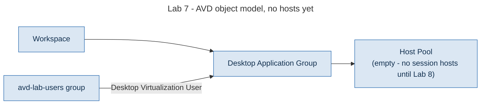

# Lab 7 - Core AVD Objects

> **Book:** Azure Virtual Desktop - Architect to Hands-on Implementation
> **Depends on:** Lab 2 (foundation)
> **Feeds into:** Lab 8 (session hosts register into the host pool built here)

---

## Objective

Build the AVD control-plane objects (host pool, workspace, and desktop application group) and get the object model from [Chapter 3](../chapters/ch03-avd-object-model.md) right at creation time, including the one setting that cannot be safely changed afterward.

## Learning objectives

- Create a host pool with `preferred_app_group_type` set correctly at creation, and explain why this cannot be changed safely later
- Associate a workspace with an application group and understand why assignment lives on the application group, never the host pool
- Generate and handle a host pool registration token as a short-lived secret, not a long-lived credential
- Assign users through a group on the application group, matching the RBAC model from Chapter 10

## Dependency on previous labs

Only Lab 2 (resource groups). This lab deliberately has no network or identity dependency: host pools, workspaces and application groups are AVD control-plane objects with no VNet attachment of their own. The dependency arrives in Lab 8, when session hosts (which do sit in the network) register into the host pool created here.

## Architecture context

> **LAB ARCHITECTURE.** AVD control-plane objects, still with no session hosts.



This is deliberately the object model from Chapter 3, section 1, with the layers built in the actual order a reader should build them: workspace and application group can exist and be assigned before a single host is running.

## Prerequisites

Lab 2 applied. An Entra group for AVD users (reuse from Lab 5/6, or create one).

## Estimated cost

$0.00. Host pools, workspaces and application groups carry no charge of their own; the cost arrives with session hosts in Lab 8.

---

## Security considerations

- The registration token output is marked `sensitive` in Terraform and expires 24 hours after creation. Do not paste it into chat, an issue, or a commit: retrieve it fresh, right before Lab 8, with `terraform output -raw registration_token`.
- Assignment is via group (`Desktop Virtualization User` role on the application group), never on individual users, matching [Chapter 10](../chapters/ch10-rbac-delegation-administrative-model.md).

---

## Step 1 - Deploy the host pool, workspace, and application group

Full configuration in [`terraform/lab07-avd-core`](../terraform/lab07-avd-core/).

```hcl
resource "azurerm_virtual_desktop_host_pool" "lab" {
  type                      = "Pooled"
  load_balancer_type        = "BreadthFirst"
  maximum_sessions_allowed  = var.max_session_limit
  preferred_app_group_type  = "Desktop" # locked at creation
  start_vm_on_connect        = true
}
```

**Why `preferred_app_group_type` gets its own callout, again.** [Chapter 3](../chapters/ch03-avd-object-model.md#4-preferred-application-group-type) and [Project 10](../scenarios/project-10-remoteapp-line-of-business.md#8-l3-incident-application-missing-for-everyone-on-four-hosts) both cover the same failure: if a RemoteApp application group is later attached to a host pool whose preferred type is Desktop, users assigned to it see nothing, with no error anywhere. Setting it correctly here, in code, at creation, is what prevents that.

```bash
cd terraform/lab07-avd-core
cp terraform.tfvars.example terraform.tfvars
terraform init
terraform fmt
terraform validate
terraform plan -out=tfplan
terraform apply tfplan
```

**Expected output:** host pool, workspace, application group, association, role assignment, and a registration token all created. Under a minute: these are control-plane objects, not compute.

---

## Step 2 - Retrieve the registration token safely

```bash
terraform output -raw registration_token
```

**Do not** run this and paste the output anywhere persistent. Copy it directly into the Lab 8 deployment step, or note only that it exists and re-run this command when Lab 8 needs it. It expires in 24 hours by design: if it has expired by the time you reach Lab 8:

```bash
terraform apply -replace=azurerm_virtual_desktop_host_pool_registration_info.lab
```

---

## Step 3 - Validate the object model

```bash
az desktopvirtualization hostpool show \
  --name hp-avd-lab-eus2-01 \
  --resource-group rg-avd-service-lab-eus2-01 \
  --query "{type:hostPoolType, preferredType:preferredAppGroupType, maxSessions:maxSessionLimit}" -o table
```

**Expected output:** `type: Pooled`, `preferredType: Desktop`, `maxSessions: 4` (or your configured value).

```bash
az role assignment list \
  --scope "$(az desktopvirtualization applicationgroup show -n ag-desktop-lab-eus2-01 -g rg-avd-service-lab-eus2-01 --query id -o tsv)" \
  -o table
```

**Expected output:** one assignment, your AVD users group, role `Desktop Virtualization User`.

---

## Validation checklist

- [ ] Host pool created, type `Pooled`, `preferredAppGroupType` = `Desktop`
- [ ] Workspace created and associated with the application group
- [ ] `Desktop Virtualization User` assigned to the group on the application group scope, not the host pool
- [ ] Registration token retrieved and treated as a short-lived secret, not committed anywhere

## Common errors

| Symptom | Likely cause | Fix |
|---|---|---|
| `preferred_app_group_type` rejected on apply | Value must be exactly `Desktop` or `RemoteApp`, case-sensitive | Correct the value in `host-pool.tf` |
| Role assignment fails with `PrincipalNotFound` | The group object ID doesn't exist yet, or replication lag after creating it | Wait a minute after group creation and retry |
| Registration token expired before Lab 8 | More than 24 hours passed between this lab and the next | `terraform apply -replace=azurerm_virtual_desktop_host_pool_registration_info.lab` |

## Troubleshooting

If the application group does not appear in the workspace when checked from the Azure portal (Workspaces > Application groups), confirm the association resource applied: `azurerm_virtual_desktop_workspace_application_group_association` is a separate resource from both the workspace and the group, and a partial apply can create both without linking them.

## Cleanup versus keep

Keep: these objects cost nothing while empty and Lab 8 needs them.

## Portfolio evidence to capture

- `az desktopvirtualization hostpool show` output confirming the object model settings
- The role assignment listing showing group-based, application-group-scoped assignment

## Interview questions from this lab

**Q. Why can't you safely change preferred application group type after creating a host pool?**

Because it determines which application group type (Desktop or RemoteApp) is honoured for any user assigned to both types on that pool. Changing it after users are assigned and using the platform changes what every affected user sees, silently, with no error to warn anyone. It is treated as a creation-time decision for that reason.

**Q. Where does user assignment actually live in the AVD object model?**

On the application group, not the host pool and not the workspace. A host pool has no concept of "who can use it" directly: the workspace surfaces the application group's assignments to the client, and the application group is what a role assignment actually targets.

---

## What comes next

[Lab 8 - Session Hosts](lab-08-session-hosts.md) deploys the virtual machines that register into this host pool, using the registration token generated here and the FSLogix configuration prepared in Lab 6.
