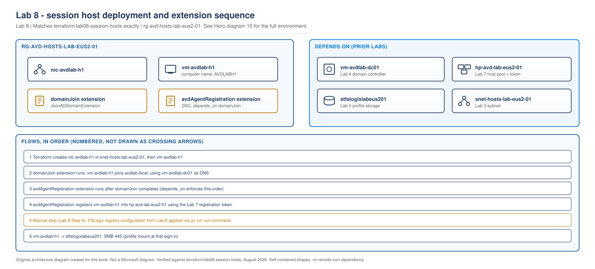

# Lab 8 - Session Hosts

> **Book:** Azure Virtual Desktop - Architect to Hands-on Implementation
> **Depends on:** Lab 3 (network), Lab 4 (identity), Lab 5 (storage), Lab 6 (FSLogix config), Lab 7 (host pool)
> **Feeds into:** Lab 9 (application delivery), Lab 10 (scaling and monitoring)

---

## ⚠️ Cost warning. Read this before you start.

This is the first lab in the sequence with a real, ongoing compute cost while the VM runs. Everything through Lab 7 was free or near-free. From here on, deallocate session hosts (`az vm deallocate`, or the Terraform output `deallocate_all_command`) whenever you are not actively using them.

## Objective

Deploy a session host, domain-join it, register it into the Lab 7 host pool, and apply the FSLogix configuration produced in Lab 6: bringing every prior lab together into a session host that actually works, rather than six components that have never been connected.

## Learning objectives

- Deploy a Windows 11 multi-session session host and understand why the computer name and Azure resource name are deliberately different
- Register a session host into a host pool using the same DSC mechanism the Azure portal uses, and know what "registered" actually verifies
- Apply the Lab 6 FSLogix configuration to a real host and prove it live, closing the loop this book has been building toward since Lab 5
- Diagnose the two most common Day 1 session host failures: agent registration and DNS/domain reachability

## Dependency on previous labs

| From | What this lab consumes |
|---|---|
| Lab 3 | The hosts subnet the session host NIC attaches to |
| Lab 4 | The domain controller, both for domain join and as the DNS server session hosts must resolve through |
| Lab 5 | The profile share this host's FSLogix configuration points at |
| Lab 6 | The `fslogix-profile-config.ps1` script and exclusion list produced there |
| Lab 7 | The host pool and the (short-lived) registration token |

If the Lab 7 registration token has expired, regenerate it before starting: `cd terraform/lab07-avd-core && terraform apply -replace=azurerm_virtual_desktop_host_pool_registration_info.lab`.

## Architecture context

> **LAB ARCHITECTURE.** The full lab environment, session host added.

> **OUR ORIGINAL ARCHITECTURE DIAGRAM.** Created for this book. Not a Microsoft diagram.
> Editable source: [`lab08-session-host-join.drawio`](../diagrams/architecture/lab08-session-host-join.drawio)



## Prerequisites

Labs 3, 4, 5, 6 and 7 complete. Lab 7's registration token retrieved and not yet expired.

## Estimated cost

`[VERIFY BEFORE IMPLEMENTATION]`: priced August 2026, re-check with the [Azure Pricing Calculator](https://azure.microsoft.com/pricing/calculator/).

| State | Approximate cost |
|---|---|
| One `Standard_D2s_v5` host, running | ~$70-90/month if left running continuously |
| Deallocated | Disk cost only, a few dollars/month |

**Deallocate when not actively working through this lab.** This is the first lab where forgetting to do so has a real cost.

## Required tools

Azure CLI, Terraform, `az vm run-command` (no RDP needed, consistent with every prior lab).

---

## Security considerations

- `registration_token` and `admin_password` are Terraform `sensitive` inputs, sourced from `terraform.tfvars` (gitignored), never hardcoded.
- The domain join extension's `protected_settings` block keeps the admin password out of the extension's plaintext settings and out of the Azure activity log.
- FSLogix exclusions from Lab 6 are applied narrowly (specific paths and processes), not as a blanket antivirus exclusion.

---

## Step 1 - Deploy the session host

Full configuration in [`terraform/lab08-session-hosts`](../terraform/lab08-session-hosts/).

```bash
cd terraform/lab08-session-hosts
cp terraform.tfvars.example terraform.tfvars
# edit terraform.tfvars: owner, admin_password, and registration_token
# (get the token: cd ../lab07-avd-core && terraform output -raw registration_token)
terraform init
terraform fmt
terraform validate
terraform plan -out=tfplan
terraform apply tfplan
```

**Expected output:** one VM, one NIC, domain join extension, and the AVD agent DSC extension all applied. This takes considerably longer than previous labs (eight to fifteen minutes) because it includes an OS boot, a domain join and restart, and the AVD agent installation and registration handshake.

**Why the computer name and resource name differ**, as first flagged in Lab 4: `vm-avdlab-h1` is the Azure resource name; `AVDLABH1` is the Windows computer name, kept inside the 15-character NetBIOS limit deliberately.

**Common errors:**

- *`JsonADDomainExtension` times out or fails.* Almost always DNS. Confirm the NIC's `dns_servers` actually points at the Lab 4 domain controller's IP, and that the domain controller is running, not deallocated.
- *DSC extension fails with a download error.* The `modulesUrl` artifact is fetched over the internet; confirm the hosts subnet's NSG and any egress control from Lab 3/13 permits outbound HTTPS.
- *Image SKU not found.* Marketplace SKU strings change. Run `az vm image list --publisher MicrosoftWindowsDesktop --all -o table` and update `source_image_reference` in `session-hosts.tf` to a current SKU.

---

## Step 2 - Confirm domain join

```bash
az vm run-command invoke -g rg-avd-hosts-lab-eus2-01 -n vm-avdlab-h1 \
  --command-id RunPowerShellScript \
  --scripts "(Get-WmiObject Win32_ComputerSystem).Domain"
```

**Expected output:** `avdlab.local`. If it returns `WORKGROUP`, the domain join extension did not complete: check its status before continuing, because the AVD agent registration in Step 1 depends on domain join having succeeded first (`depends_on` in the Terraform enforces the order, but a failed domain join can still leave the VM in a state where the agent extension reports success without full functionality).

---

## Step 3 - Confirm AVD agent registration

This is the check from [Chapter 18](../chapters/ch18-session-host-lifecycle-hybrid.md#3-registration-and-how-it-goes-wrong), run for real against a host you deployed yourself.

```bash
az vm run-command invoke -g rg-avd-hosts-lab-eus2-01 -n vm-avdlab-h1 \
  --command-id RunPowerShellScript \
  --scripts "Get-Service RDAgentBootLoader, RDAgent | Select-Object Name, Status; Get-ItemProperty -Path 'HKLM:\SOFTWARE\Microsoft\RDInfraAgent' -Name IsRegistered -ErrorAction SilentlyContinue"
```

**Expected output:** both services `Running`, `IsRegistered : 1`.

Then confirm from the AVD service side:

```bash
az desktopvirtualization sessionhost list \
  --host-pool-name hp-avd-lab-eus2-01 \
  --resource-group rg-avd-service-lab-eus2-01 \
  --query "[].{name:name, status:status}" -o table
```

**Expected output:** one session host, status `Available`.

**If `IsRegistered` is not `1`:** work through the exact sequence from Chapter 18: check the registration token validity first (it expires 24 hours after Lab 7 created it), then the RDAgentBootLoader service state (a service that starts and immediately stops is a token problem, not a service problem), then the event log at `Applications and Services Logs > Microsoft > Windows > WVD-Agent`.

---

## Step 4 - Apply the FSLogix configuration from Lab 6

```bash
# Copy the script produced in Lab 6, then run it
az vm run-command invoke -g rg-avd-hosts-lab-eus2-01 -n vm-avdlab-h1 \
  --command-id RunPowerShellScript \
  --scripts "\$VHDLocations = '\\\\<storage_account_name>.file.core.windows.net\profiles'; New-ItemProperty -Path HKLM:\SOFTWARE\FSLogix\Profiles\ -Name Enabled -PropertyType dword -Value 1 -Force; New-ItemProperty -Path HKLM:\SOFTWARE\FSLogix\Profiles\ -Name VHDLocations -PropertyType MultiString -Value \$VHDLocations -Force; New-ItemProperty -Path HKLM:\SOFTWARE\FSLogix\Profiles\ -Name VolumeType -PropertyType string -Value 'VHDX' -Force; New-ItemProperty -Path HKLM:\SOFTWARE\FSLogix\Profiles\ -Name DeleteLocalProfileWhenVHDShouldApply -PropertyType dword -Value 1 -Force; New-ItemProperty -Path HKLM:\SOFTWARE\FSLogix\Profiles\ -Name FlipFlopProfileDirectoryName -PropertyType dword -Value 1 -Force"
```

`[VERIFY BEFORE IMPLEMENTATION]` this host image does not include the FSLogix agent by default; if `frxsvc` is not present, install it first (`choco install fslogix` or the Microsoft-published MSI) before the registry configuration has any effect. In a production build this belongs in the golden image per Chapter 23; this lab installs it post-deployment for simplicity.

Then apply the exclusions documented in Lab 6, Step 3, via `Add-MpPreference -ExclusionPath` for each path listed.

---

## Step 5 - End-to-end validation: sign in and confirm the profile mounts

This is the moment every prior lab has been building toward.

1. Assign yourself (or a test account) to the `avd-lab-users` group from Lab 5/7, if not already a member.
2. Open [the Windows App](https://learn.microsoft.com/en-us/windows-app/get-started-connect-devices-desktops-apps) or the web client and subscribe using the workspace URL / feed discovery.
3. Sign in and launch the desktop published from Lab 7's application group.

**Validate the profile from the host side:**

```bash
az vm run-command invoke -g rg-avd-hosts-lab-eus2-01 -n vm-avdlab-h1 \
  --command-id RunPowerShellScript \
  --scripts "Get-ChildItem 'C:\ProgramData\FSLogix\Logs\Profile' | Sort-Object LastWriteTime -Descending | Select-Object -First 1 | Get-Content -Tail 40"
```

**Expected output:** the FSLogix log shows a successful attach, not an attach failure or a temporary profile. Cross-reference this against Lab 5 and Lab 6: if this fails but Lab 6's mechanics test succeeded, the problem is specific to the FSLogix agent or its configuration on this host, not the underlying storage.

---

## Validation checklist

- [ ] Session host shows `Available` in `az desktopvirtualization sessionhost list`
- [ ] Domain join confirmed (`avdlab.local`, not `WORKGROUP`)
- [ ] `IsRegistered : 1` and both agent services running
- [ ] FSLogix registry configuration applied and exclusions in place
- [ ] A real sign-in completes and the FSLogix log shows a successful attach, not a temporary profile

## Common errors

| Symptom | Likely cause | Fix |
|---|---|---|
| Session host never appears in `sessionhost list` | Registration token expired before the DSC extension ran | Regenerate in Lab 7, then re-run the `avd_agent` extension: `terraform apply -replace=azurerm_virtual_machine_extension.avd_agent` |
| Session host shows `Unavailable` | Side-by-side stack failed to install, separate from agent registration | Reinstall per Chapter 18; in a lab, redeploying the VM is usually faster |
| Sign-in succeeds but desktop is empty of personalisation, repeatedly | FSLogix not installed, or registry values not applied | Confirm `frxsvc` service exists before checking registry values |
| Sign-in fails entirely, feed shows no desktop | Assignment not applied, or Windows App subscribed to the wrong workspace | Re-check Lab 7 Step 3's role assignment and the workspace URL used to subscribe |

## Troubleshooting

Work the isolation sequence from Chapter 18 in order: token validity, then boot loader service state, then event log, then side-by-side stack. Do not jump to "rebuild the host" as a first response in a one-host lab the way you might on a 40-host production pool: in a lab, understanding *why* it failed is the point.

## Cleanup versus keep

**Deallocate between sessions**, always: `az vm deallocate -g rg-avd-hosts-lab-eus2-01 -n vm-avdlab-h1`, or the Terraform-output command.

**Destroy** only when finished with the whole lab sequence, since Labs 9 and 10 both extend this host pool rather than replacing it.

## Portfolio evidence to capture

- `az desktopvirtualization sessionhost list` output showing `Available`
- The FSLogix log excerpt from Step 5 showing a successful attach
- A screenshot of a real signed-in desktop session: this is the single most valuable piece of evidence in the whole lab sequence so far, because it proves an end-to-end working environment rather than six components that have never been connected

## Interview questions from this lab

**Q. Walk me through what "registered" actually means for a session host, and how you would prove it rather than assume it.**

Registered means the RDAgent has successfully authenticated to the AVD broker using the registration token and is reporting health. I would prove it two ways: on the host, checking `IsRegistered : 1` in the registry and both agent services running; and from the service side, confirming the host pool shows the host as `Available`. Checking only one side is not sufficient: a host can be registered but Unavailable due to a broken side-by-side stack, which is a different failure with a different fix.

**Q. You just deployed a session host and it never appears in the host pool. What's your first check?**

Registration token validity. It is the single most common cause, because tokens expire after a short window (24 hours in this lab, similarly short in production designs) and a deployment pipeline built before the token was generated, or run after a delay, hands the agent an expired token. The signature is a boot loader that starts and immediately stops: that specific behaviour points at the token rather than a service fault.

---

## What comes next

[Lab 9 - Application Delivery](lab-09-application-groups.md) publishes real applications to this host pool and validates delivery through Windows App, including the RemoteApp path this lab's Desktop-only application group does not cover.
