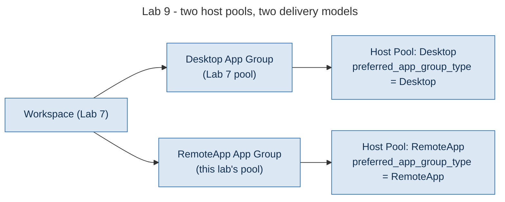

# Lab 9 - Application Delivery

> **Book:** Azure Virtual Desktop - Architect to Hands-on Implementation
> **Depends on:** Lab 7 (workspace), Lab 8 (working session host pattern, repeated here for the RemoteApp pool)
> **Feeds into:** Lab 10 (scaling and monitoring, applied across both host pools)

---

## Objective

Publish a RemoteApp alongside the Desktop delivery from Lab 7, and validate both through Windows App: proving the object model constraint from [Chapter 3](../chapters/ch03-avd-object-model.md#4-preferred-application-group-type) rather than only reading about it: a RemoteApp application group needs a host pool whose `preferred_app_group_type` is `RemoteApp`, which Lab 7's Desktop pool is not.

## Learning objectives

- Explain why this lab creates a second host pool rather than adding a RemoteApp group to Lab 7's pool
- Publish an application and understand the difference between an App Attach assignment and a locally-installed application publish
- Validate application delivery from the client side, through Windows App, not just from the Azure control plane
- Reproduce and recognise the specific silent failure this book has flagged twice already (Chapter 25, Project 10): a published RemoteApp on the wrong preferred-type pool

## Dependency on previous labs

Lab 7's workspace (referenced by data source). This lab deploys a second small session host into the new RemoteApp pool, following the exact same domain-join-and-register pattern as Lab 8: copy `terraform/lab08-session-hosts`, point it at `hp-avd-remoteapp-lab-eus2-01` instead, and reuse the same registration flow. That repetition is deliberate: it reinforces the Lab 8 mechanism rather than hiding a second copy of it behind abstraction this early in the book.

## Architecture context



One workspace, two application groups, two host pools: the pattern [Chapter 25](../chapters/ch25-application-delivery-remoteapp-design.md) recommends whenever a Desktop and a RemoteApp workload genuinely need different sizing or delivery models, rather than fighting one pool's preferred-type setting.

## Prerequisites

Lab 7 complete. A second session host deployed into the RemoteApp pool (see the note above).

## Estimated cost

Same as Lab 8, doubled while the second host runs: `[VERIFY BEFORE IMPLEMENTATION]`, roughly $70-90/month per host if left running continuously; deallocate between sessions.

---

## Step 1 - Deploy the RemoteApp host pool and application group

```bash
cd terraform/lab09-app-delivery
cp terraform.tfvars.example terraform.tfvars
terraform init
terraform fmt
terraform validate
terraform plan -out=tfplan
terraform apply tfplan
```

**Expected output:** a second host pool (`preferred_app_group_type = RemoteApp`), its application group, workspace association, role assignment, and Notepad published as the example application.

---

## Step 2 - Deploy a session host into the RemoteApp pool

Reuse Lab 8's module with a different host pool target:

```bash
cp -r terraform/lab08-session-hosts terraform/lab09-remoteapp-host
cd terraform/lab09-remoteapp-host
# Edit variables.tf: change the host_pool_name default to hp-avd-remoteapp-lab-eus2-01
# Get a fresh registration token for THIS pool (Lab 7's token is for the Desktop pool)
```

Registration tokens are per host pool, which is the detail this step exists to make concrete: the token from Lab 7 will not register a host into this pool.

```bash
az desktopvirtualization hostpool update \
  --name hp-avd-remoteapp-lab-eus2-01 \
  --resource-group rg-avd-service-lab-eus2-01 \
  --registration-info expiration-time="$(date -u -d '+1 day' '+%Y-%m-%dT%H:%M:%SZ')" registration-token-operation=Update \
  --query "registrationInfo.token" -o tsv
```

Use that token in `terraform.tfvars`, then `terraform apply` as in Lab 8.

---

## Step 3 - Reproduce the preferred-type failure, deliberately

Before validating the correct configuration, see the failure this lab's design avoids: it is worth experiencing once.

```bash
# Do NOT run this against production. In the lab, temporarily:
az desktopvirtualization hostpool show \
  --name hp-avd-lab-eus2-01 \
  --resource-group rg-avd-service-lab-eus2-01 \
  --query preferredAppGroupType -o tsv
```

If you were to associate the RemoteApp application group with Lab 7's Desktop-preferred pool instead of this lab's own pool (do not actually do this: it is described, not performed, to avoid disrupting Lab 7's working Desktop delivery), a user assigned to both groups would see only the desktop in their feed. The RemoteApp icon would not appear, and no error would be logged anywhere: exactly the failure documented in [Project 10, Scenario 1](../scenarios/project-10-remoteapp-line-of-business.md#8-l3-incident-application-missing-for-everyone-on-four-hosts).

---

## Step 4 - Validate through Windows App

1. Sign in to Windows App (or the web client) as a test user in the assigned group.
2. Confirm the feed shows **both** the Lab 7 desktop and the Lab 9 Notepad RemoteApp as separate icons.
3. Launch the RemoteApp. Confirm it opens directly, without a full desktop shell around it.

```bash
az desktopvirtualization sessionhost list \
  --host-pool-name hp-avd-remoteapp-lab-eus2-01 \
  --resource-group rg-avd-service-lab-eus2-01 \
  --query "[].{name:name, status:status}" -o table
```

**Expected output:** the RemoteApp pool's host shows `Available`, and the application launches from a fresh sign-in within roughly the same time as a desktop launch in Lab 8.

---

## Validation checklist

- [ ] Two host pools exist, with distinct `preferredAppGroupType` values
- [ ] Both application groups associated with the same workspace
- [ ] Notepad appears as a separate published application, distinct from the desktop icon, in the client feed
- [ ] RemoteApp launches directly into the application, not a full desktop

## Common errors

| Symptom | Likely cause | Fix |
|---|---|---|
| RemoteApp not visible in the feed | Application group attached to a Desktop-preferred pool, or role assignment missing | Confirm the pool's `preferredAppGroupType` and the role assignment scope |
| Notepad path not found on the session host | Published `path` does not match the actual binary location on that image | Confirm with `az vm run-command` that `C:\Windows\System32\notepad.exe` exists (it always does on a standard image; a custom image could differ) |
| Registration fails on the second host | Reused the Lab 7 token instead of generating one for the new pool | Registration tokens are host-pool-scoped; generate a fresh one as in Step 2 |

## Troubleshooting

If both objects look correctly configured and the RemoteApp still does not appear, check the client cache: Windows App does not always refresh the feed immediately after an assignment change. Sign out fully and back in, rather than just reconnecting.

## Cleanup versus keep

Deallocate the RemoteApp pool's session host between working sessions, same as Lab 8. Keep the control-plane objects (host pool, application group, published app): no ongoing cost.

## Portfolio evidence to capture

- Screenshot of Windows App showing both a Desktop icon and a RemoteApp icon in the same feed
- The `preferredAppGroupType` value for both host pools, side by side, as evidence you understand and applied the constraint deliberately

## Interview questions from this lab

**Q. A user is assigned to both a desktop and a RemoteApp application group on the same host pool. What do they see?**

Whichever type matches that host pool's `preferredAppGroupType` setting: never both. This is documented, deliberate behaviour, not a bug, and it is why a workload that genuinely needs both delivery models needs two host pools, as this lab builds, rather than one pool trying to serve both.

**Q. Why did this lab build a second host pool instead of adding a RemoteApp group to the existing one?**

Because the existing pool was created with `preferred_app_group_type = Desktop`, and that setting is effectively fixed once real users are assigned and working against it: changing it would silently change what every desktop user sees, with no warning. Building a dedicated pool for the RemoteApp workload avoids touching a setting that Chapter 3 and Lab 7 both flag as a creation-time decision.

---

## What comes next

[Lab 10 - Scaling, Monitoring and Operational Validation](lab-10-operations.md) applies a scaling plan and diagnostic settings across both host pools built in this lab and Lab 7, and closes the lab sequence with the operational checklist a real handover would require.
