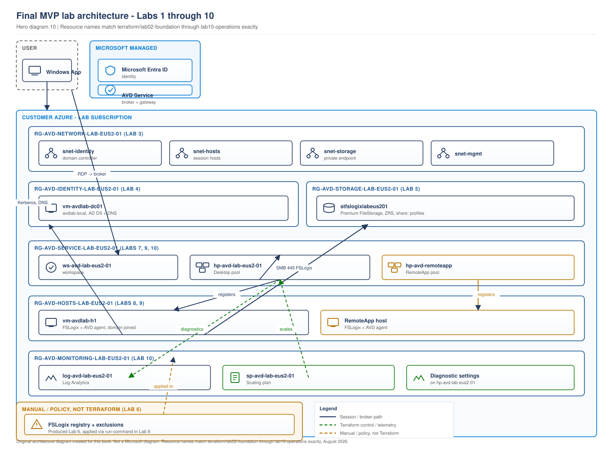

# Lab 10 - Scaling, Monitoring and Operational Validation

> **Book:** Azure Virtual Desktop - Architect to Hands-on Implementation
> **Depends on:** Labs 1-9, all of them
> **Closes:** the Labs 1-10 sequence

---

## Objective

Turn the working environment built across Labs 1-9 into an operated one: diagnostic data flowing, a scaling plan applied, drain mode exercised, and a full end-to-end validation: a real user connecting, a profile mounting, a scaling action occurring: checked off against a closing operational checklist rather than assumed.

## Learning objectives

- Configure diagnostic settings and confirm data actually arrives, not just that the resource was created
- Apply a scaling plan and understand what each phase's settings do, using the mechanics from [Project 07](../scenarios/project-07-call-centre-high-density.md#4-concept-introduced-scaling-plans-and-how-autoscale-actually-decides)
- Use drain mode correctly, including the reconnect behaviour that catches people in production
- Run the six KQL queries from [Project 02](../scenarios/project-02-enterprise-850-users.md#5-concept-introduced-the-kql-an-avd-engineer-actually-uses) against your own environment's real data
- Complete a full safe-shutdown and cost-conscious cleanup of the entire Labs 1-10 environment

## Dependency on previous labs

Every prior lab. This is the closing lab and validates the whole chain, not just its own new resources.

## Architecture context

> **LAB ARCHITECTURE.** The complete Labs 1-10 environment.

> **DIAGRAM NOTE.** This lab completes the environment shown in full in [Hero diagram 10 - Final MVP lab architecture](../diagrams/architecture/hero-10-final-mvp-lab-architecture.svg) ([source](../diagrams/architecture/hero-10-final-mvp-lab-architecture.drawio)), which already shows every resource across Labs 2-10 with exact Terraform names, including the monitoring and scaling resources this lab creates (`log-avd-lab-eus2-01`, `sp-avd-lab-eus2-01`). A separate diagram here would duplicate it. See that diagram rather than a second copy.



This is the diagram this whole lab sequence has been building toward: every box on it was built by name in a specific earlier lab, and this lab's caption tells you which.

## Prerequisites

Labs 1-9 complete, at least the Desktop session host from Lab 8 running for the live validation steps.

## Estimated cost

`[VERIFY BEFORE IMPLEMENTATION]`. New in this lab: a Log Analytics workspace (ingestion-based cost, small for lab-scale data: a few dollars for the whole lab sequence's worth of diagnostics at 30-day retention) and a scaling plan (no direct cost; it changes compute cost by changing host power state, which is the whole point).

---

## Security considerations

- Diagnostic logs contain connection metadata (usernames, IP information, session timing). Treat the Log Analytics workspace with the same access control rigour as any other store of user activity data, even in a lab.
- The scaling plan's `ramp_down_force_logoff_users = false` in this lab's Terraform is deliberate: forced logoff is a production decision with a business trade-off (Project 07 covers it in depth), not something to default to `true` without thinking about it, even in a lab.

---

## Step 1 - Apply monitoring and the scaling plan

```bash
cd terraform/lab10-operations
cp terraform.tfvars.example terraform.tfvars
terraform init
terraform fmt
terraform validate
terraform plan -out=tfplan
terraform apply tfplan
```

**Expected output:** Log Analytics workspace, diagnostic settings on the Lab 7 host pool, and a scaling plan associated with it and enabled.

---

## Step 2 - Confirm diagnostic data is actually flowing

Not just that the resource exists: that data has arrived, which takes roughly 15 minutes after first configuration.

```bash
az monitor log-analytics query \
  --workspace "$(az monitor log-analytics workspace show -g rg-avd-monitoring-lab-eus2-01 -n log-avd-lab-eus2-01 --query customerId -o tsv)" \
  --analytics-query "WVDConnections | take 5" -o table
```

**Expected output, once data has arrived:** rows showing your Lab 8/9 sign-in activity. `[VERIFY BEFORE IMPLEMENTATION]` table names have changed historically; if `WVDConnections` returns nothing after 20+ minutes, confirm the exact table name in your workspace under *Log Analytics workspace > Logs > Tables*.

---

## Step 3 - Run the KQL an AVD engineer actually uses

Against your own real (if small) dataset, from [Project 02](../scenarios/project-02-enterprise-850-users.md#5-concept-introduced-the-kql-an-avd-engineer-actually-uses):

```kusto
// Errors by type, ranked - start every investigation here
WVDErrors
| where TimeGenerated > ago(1d)
| summarize Count = count() by CodeSymbolic, ServiceError
| order by Count desc
```

```kusto
// Which hosts users actually land on
WVDConnections
| where TimeGenerated > ago(1d)
| where State == "Connected"
| summarize Sessions = count() by SessionHostName
```

Run both. With a one- or two-host lab, the second query will look trivial: that is fine. The point of this step is to have run the exact query you would run in production, against real (if small) data, so the muscle memory exists before you need it at scale.

---

## Step 4 - Exercise drain mode and confirm the reconnect behaviour

This is the specific behaviour that catches people in production, reproduced deliberately here.

```bash
az desktopvirtualization sessionhost update \
  --host-pool-name hp-avd-lab-eus2-01 \
  --resource-group rg-avd-service-lab-eus2-01 \
  --name vm-avdlab-h1 \
  --allow-new-session false
```

**Now, without signing out, disconnect your session (close the client, do not sign out) and reconnect.** You will land back on the same host, despite it being in drain mode. This is the exact behaviour Chapter 15 and Project 02 both document: drain mode stops *new* sessions, not reconnects to existing disconnected ones. Confirm it, then re-enable:

```bash
az desktopvirtualization sessionhost update \
  --host-pool-name hp-avd-lab-eus2-01 \
  --resource-group rg-avd-service-lab-eus2-01 \
  --name vm-avdlab-h1 \
  --allow-new-session true
```

---

## Step 5 - Observe a scaling action

With the scaling plan applied, sign out fully and wait past the ramp-down window (or temporarily edit the schedule's start times to be a few minutes from now for lab purposes, then revert). Confirm a power-state change:

```bash
az vm get-instance-view -g rg-avd-hosts-lab-eus2-01 -n vm-avdlab-h1 \
  --query "instanceView.statuses[?starts_with(code,'PowerState')].displayStatus" -o tsv
```

**Expected output:** a transition from `VM running` toward `VM deallocated` as ramp-down and off-peak phases take effect, or the reverse during ramp-up.

---

## Step 6 - Final operational checklist

Work through this as a real handover would require it, not as a formality:

- [ ] Every session host registers and shows `Available`
- [ ] A real sign-in completes end to end, with a mounted FSLogix profile, for both the Desktop and RemoteApp delivery paths
- [ ] Diagnostic data confirmed flowing, not just configured
- [ ] Drain mode behaviour understood and demonstrated, including the reconnect exception
- [ ] Scaling plan applied and at least one power-state transition observed
- [ ] Cost for the full Labs 1-10 environment checked against the Azure Pricing Calculator for your actual region and usage, not assumed from the lab's estimates

---

## Common errors

| Symptom | Likely cause | Fix |
|---|---|---|
| KQL query returns nothing after 30+ minutes | Diagnostic setting applied to the wrong resource, or table name has changed | Re-check `target_resource_id` in `monitoring.tf` points at the host pool, and confirm the current table name in the workspace |
| Scaling plan shows enabled but no power state change occurs | Schedule times are in the plan's configured time zone, not yours | Check `time_zone` in `scaling-plan.tf` against your actual working hours, or temporarily narrow the schedule for testing |
| Drain mode blocks a reconnect you expected to work | You actually signed out rather than disconnecting | Reconnect behaviour specifically requires a disconnected, not signed-out, session |

## Troubleshooting

If diagnostic data never arrives, work the same checklist Project 02 uses: confirm the diagnostic setting exists on the correct resource ID, confirm the workspace ID matches, and confirm you are querying the same workspace the setting points at: a surprisingly common lab mistake is having two workspaces from an earlier experiment and querying the wrong one.

## Cleanup versus keep: full Labs 1-10 teardown

If you are finished with the lab sequence:

```bash
for lab in lab10-operations lab09-app-delivery lab09-remoteapp-host lab08-session-hosts lab07-avd-core lab05-storage; do
  echo "Destroying $lab"
  (cd "terraform/$lab" && terraform destroy -auto-approve)
done
# Labs 2-4 (foundation, network, identity) are usually kept longer as a base
# to rebuild from; destroy them too only if you are done with the book entirely.
```

Destroy in this order (later labs first) because Terraform's own dependency graph within each module handles intra-module ordering, but cross-module dependencies (Lab 9's data source read of Lab 7's workspace, for example) are not tracked by Terraform across separate state files, so destroying Lab 7 before Lab 9 can leave Lab 9 referencing a resource that no longer exists.

## Portfolio evidence to capture

- The full checklist from Step 6, completed
- Screenshots of both KQL queries from Step 3 returning real data from your own environment
- The drain-mode-then-reconnect demonstration from Step 4: this is a detail few candidates can describe having actually seen rather than read about
- A before/after power-state screenshot from Step 5

## Interview questions from this lab

**Q. You configure diagnostic settings and want to prove they are actually working. What do you check, and when?**

Not immediately: diagnostic data typically takes around 15 minutes to begin appearing after first configuration, and querying too early produces a false negative. I would confirm the diagnostic setting is attached to the correct resource ID, wait the appropriate window, then run a simple query like `WVDConnections | take 5` against the workspace and confirm real rows return, not just that the Azure resource for the diagnostic setting exists.

**Q. What does drain mode actually stop, and what does it not stop?**

It stops new session connections to that host. It does not stop a user with a disconnected session on that host from reconnecting to it: reconnects go to the existing session regardless of drain mode. This is the reason a maintenance runbook has to message users and wait, or force sign-out after a warning period, rather than assuming drain mode alone clears a host.

---

## What comes next

Labs 1-10 complete the single-region path. Continue with the published [Labs 11-20](README.md#multi-region-and-recovery-path) for multi-region networking, regional identity and storage, host pools, user assignment, autoscale, security monitoring, recovery, final validation, and teardown.
