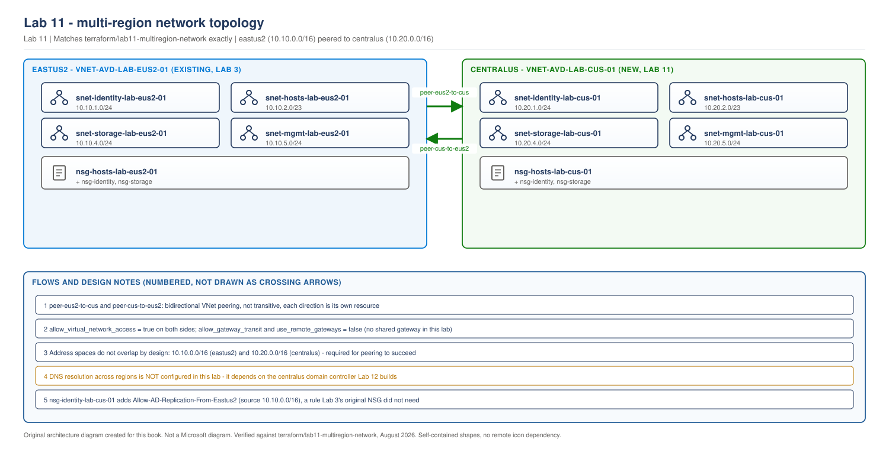

> **Part of:** [Azure Virtual Desktop - Architect to Hands-on Implementation](../README.md)
> **Chapter:** [Chapter 12 - Enterprise Topologies and IP Planning](../chapters/ch12-enterprise-topologies-ip-planning.md), [Chapter 13 - Hybrid Connectivity and Egress Control](../chapters/ch13-hybrid-connectivity-egress-control.md)
> **Terraform:** [`terraform/lab11-multiregion-network`](../terraform/lab11-multiregion-network/)
> **Technical baseline:** August 2026
> **Plan:** [Labs 11-20 plan](../appendices/labs-11-20-plan.md)

# LAB 11 - Multi-Region Network Foundation

> **LAB ARCHITECTURE** - the environment you build across Labs 1-20. Not a Microsoft reference design.

## Objective

Build the `centralus` half of a two-region active-active AVD environment and connect it to the existing `eastus2` build from Labs 1-10. By the end of this lab you have two peered virtual networks, matching subnet and NSG layouts in both regions, and nothing else - no AVD objects, no domain controller, no session hosts. Every later lab in this set builds on top of what's here.

This lab is the foundation for a true active-active design, not a disaster-recovery standby. Both regions will end up serving real users at the same time (Lab 14 onward). If you only need a DR pattern, see [Lab 19](lab-19-disaster-recovery-failover.md) instead, which is a deliberately different, cheaper configuration.

## Lab architecture

> **OUR ORIGINAL ARCHITECTURE DIAGRAM.** Created for this book. Not a Microsoft diagram.
> Editable source: [`lab11-multiregion-network-topology.drawio`](../diagrams/architecture/lab11-multiregion-network-topology.drawio)



Two virtual networks, one per region, each with the same four-subnet layout Lab 3 established (identity, hosts, storage, mgmt). Peered bidirectionally. No gateway transit, no shared hub in this lab - each region is a self-contained spoke that happens to be directly peered to the other, which is enough for the identity replication and Cloud Cache traffic later labs need, without building a full hub-and-spoke topology this book's single-region labs never needed either.

---

## A note on product accuracy before you start

Microsoft's Regional Host Pools feature (a newer host pool deployment scope with per-region metadata storage) is currently in **public preview**, and while in preview it does not support Dynamic Autoscaling, Private Link, or App Attach - all of which Labs 14-19 use. This lab set deliberately uses classic (geographical) host pools throughout, not Regional Host Pools, for that reason. See the [Labs 11-20 plan](../appendices/labs-11-20-plan.md) section 1 for the full research behind this decision, with Microsoft Learn sources. If you're reading this after Regional Host Pools reaches general availability, re-check [learn.microsoft.com/azure/virtual-desktop/regional-host-pools](https://learn.microsoft.com/en-us/azure/virtual-desktop/regional-host-pools) before assuming the constraint still applies.

---

## Cost summary

| Resource | Monthly cost |
|---|---|
| Virtual network (centralus) | **$0.00** - VNets are free |
| Subnets | **$0.00** |
| Network security groups | **$0.00** |
| VNet peering (both directions) | **$0.00** hourly charge - billed only on data transferred |
| Peering data transfer (lab validation traffic) | **under $1.00/month** |
| **Total** | **under $1.00/month** |

No compute is deployed in this lab. The cost stays negligible until Lab 12 (domain controller) and Lab 14 (session hosts).

## Prerequisites

- Labs 1-3 complete: `eastus2` VNet, subnets, and NSGs exist and `terraform apply` reports no pending changes
- Your Terraform identity (the credentials `terraform apply` runs as) has write access to both the existing `eastus2` network resource group and permission to create new resource groups in `centralus`
- Lab 3's Terraform state re-applied at least once since this book added a `resource_group_name` output - see the note below

> ⚠️ **If you built Lab 3 before this lab existed:** Lab 3's `outputs.tf` gained a new output (`resource_group_name`) to support this lab's cross-region peering. Run `terraform apply` in `terraform/lab03-network` once before starting this lab, even though nothing about your `eastus2` network actually changes - Terraform needs to refresh state to populate the new output value.

---

## Step 1 - Plan the second region's address space

**Region:** `centralus`. Any Azure region works for this pattern; `centralus` is chosen here because it is well-connected to `eastus2` and keeps this lab's cost estimates realistic for readers following along in the same regions this book has used throughout.

**Address space:** `10.20.0.0/16`. This must not overlap `eastus2`'s `10.10.0.0/16` from Lab 3 - VNet peering fails outright if the two address spaces overlap, and there is no partial-overlap tolerance.

| Subnet | CIDR | Purpose |
|---|---|---|
| `snet-identity-lab-cus-01` | `10.20.1.0/24` | Domain controller (Lab 12) |
| `snet-hosts-lab-cus-01` | `10.20.2.0/23` | Session hosts (Lab 14 onward) |
| `snet-storage-lab-cus-01` | `10.20.4.0/24` | Private endpoints for storage (Lab 13) |
| `snet-mgmt-lab-cus-01` | `10.20.5.0/24` | Management |

Notice this is the same relative layout as Lab 3, offset into the `10.20.0.0/16` block. Keeping the subnet purposes and their relative position identical across regions is deliberate: anyone who has read Lab 3 already understands this lab's layout without re-learning it.

## Step 2 - Understand what changes in the NSG rule set

Lab 3's `nsg-hosts` rules apply identically in `centralus` - the outbound requirements in Chapter 4 section 3 are per session host, not per region. One rule is genuinely new: `nsg-identity` in `centralus` needs an inbound allow rule from the entire `eastus2` address range (`10.10.0.0/16`), not just its own local hosts subnet, because Active Directory replication traffic between the two domain controllers (Lab 12) can originate from either side.

## Step 3 - Write the Terraform

The full module is in [`terraform/lab11-multiregion-network/`](../terraform/lab11-multiregion-network/). The structure mirrors Labs 2 and 3 combined for a second region: resource groups, VNet, subnets, NSGs, plus the peering this lab adds that Labs 2 and 3 never needed.

The part worth reading closely is the peering itself, because it is easy to get half-right:

```hcl
# terraform/lab11-multiregion-network/peering.tf

resource "azurerm_virtual_network_peering" "centralus_to_eastus2" {
  name                          = "peer-cus-to-eus2"
  resource_group_name           = azurerm_resource_group.network.name
  virtual_network_name          = azurerm_virtual_network.avd.name
  remote_virtual_network_id     = data.terraform_remote_state.lab03_network.outputs.vnet_id
  allow_virtual_network_access  = true
  allow_forwarded_traffic       = false
  allow_gateway_transit         = false
  use_remote_gateways           = false
}

resource "azurerm_virtual_network_peering" "eastus2_to_centralus" {
  name                          = "peer-eus2-to-cus"
  resource_group_name           = data.terraform_remote_state.lab03_network.outputs.resource_group_name
  virtual_network_name          = data.terraform_remote_state.lab03_network.outputs.vnet_name
  remote_virtual_network_id     = azurerm_virtual_network.avd.id
  allow_virtual_network_access  = true
  allow_forwarded_traffic       = false
  allow_gateway_transit         = false
  use_remote_gateways           = false
}
```

**Why two resources, not one.** Peering is not a single bidirectional object. Each side of the connection is its own resource, in its own resource group, and both need to exist and report `Connected` before traffic flows either direction. It is entirely possible to create one side successfully and have the other fail silently if you only check one - Step 5's validation checks both.

**Why `allow_gateway_transit` and `use_remote_gateways` are both `false`.** Gateway transit lets one VNet share its VPN or ExpressRoute gateway with a peered VNet. This lab doesn't build a gateway in either region, so there's nothing to transit or use remotely. If a later engagement adds hybrid connectivity, these settings are exactly where that decision gets made.

## Step 4 - Deploy

```bash
cd terraform/lab11-multiregion-network
cp terraform.tfvars.example terraform.tfvars   # edit owner and primary_state_storage_account
terraform init
terraform fmt
terraform validate
terraform plan -out=tfplan
terraform apply tfplan
```

> This Terraform has not been run against a live Azure subscription as part of writing this lab. The HCL has been structurally reviewed, but `terraform validate` and `terraform apply` output shown in this guide is expected behaviour, not captured execution evidence. Confirm the plan output before applying it in your own subscription.

**Expected plan output, in shape:** roughly 25-30 resources to add (6 resource groups, 1 VNet, 4 subnets, 3 NSGs, a double-digit number of NSG rules, 2 peering connections), 0 to change, 0 to destroy.

## Step 5 - Validate peering, both directions

```bash
# Check the centralus side
az network vnet peering show \
  --resource-group rg-avd-network-lab-cus-01 \
  --vnet-name vnet-avd-lab-cus-01 \
  --name peer-cus-to-eus2 \
  --query peeringState \
  --output tsv

# Check the eastus2 side
az network vnet peering show \
  --resource-group rg-avd-network-lab-eus2-01 \
  --vnet-name vnet-avd-lab-eus2-01 \
  --name peer-eus2-to-cus \
  --query peeringState \
  --output tsv
```

**Expected output, both commands:** `Connected`

**If one side shows `Connected` and the other shows `Initiated`:** the other side's peering resource either failed to apply or hasn't applied yet. Peering only reaches `Connected` once both sides exist and agree on each other's address space. Check `terraform apply`'s output for errors on whichever side is stuck, not just the side you're currently looking at.

## Step 6 - Confirm DNS is deliberately not configured yet

```bash
az network vnet show \
  --resource-group rg-avd-network-lab-cus-01 \
  --name vnet-avd-lab-cus-01 \
  --query dhcpOptions.dnsServers \
  --output tsv
```

**Expected output:** empty, meaning Azure-provided DNS. This is correct at this stage, for the same reason Lab 3 left `eastus2` on Azure-provided DNS until Lab 4's domain controller existed. Setting DNS server IPs before the servers they point to exist breaks name resolution for every VM in the VNet, not just the ones you're testing. Lab 12 configures both regions' DNS server settings once both domain controllers exist and can actually answer queries.

---

## Validation Checklist

- [ ] `vnet-avd-lab-cus-01` exists with address space `10.20.0.0/16`
- [ ] Four `centralus` subnets created with the planned CIDRs, none overlapping `eastus2`'s `10.10.0.0/16`
- [ ] `peer-cus-to-eus2` reports `Connected`
- [ ] `peer-eus2-to-cus` reports `Connected`
- [ ] `nsg-identity-lab-cus-01` includes `Allow-AD-Replication-From-Eastus2` with source `10.10.0.0/16`
- [ ] All six `centralus` resource groups carry the same tag set as their `eastus2` equivalents
- [ ] VNet DNS servers on both VNets remain empty (Azure-provided) - not yet pointed at anything
- [ ] `terraform plan` in `lab11-multiregion-network` reports no changes after apply

## Troubleshooting

| Problem | Likely cause | Fix |
|---|---|---|
| Peering creation fails with an address space overlap error | `centralus` address space collides with `eastus2`'s `10.10.0.0/16` | Confirm `vnet_address_space` is `10.20.0.0/16`, not a value copied from Lab 3 |
| One peering resource applies, the other errors on a missing remote VNet ID | Lab 3's state doesn't yet have the `resource_group_name` output populated | Re-run `terraform apply` in `lab03-network` first, per the prerequisites note above |
| `terraform_remote_state` data source fails to read | Backend storage account name or container mismatch between this lab's `remote-state.tf` and Lab 3's actual backend | Confirm `primary_state_storage_account` in this lab's `terraform.tfvars` matches the storage account Lab 3's `backend.tf` actually uses |
| Peering shows `Connected` but a later lab's cross-region traffic still fails | NSG blocking the traffic, not a peering problem | Peering only enables the network path to exist; NSGs still apply on top of it. Check the specific NSG rule for the traffic type before assuming peering is broken |

## Cleanup

**Keep everything.** Cost is under $1.00/month and Labs 12-20 depend on this network existing.

If you are stopping the multi-region labs here and not continuing to Lab 12, see [Lab 20](lab-20-validation-cost-teardown.md)'s teardown ordering before deleting anything - destroying this lab's resource groups while later labs still reference them in remote state will fail with dependency errors, not silently succeed.

## Lab 11 Interview Questions

**Q. Why build two separate VNets peered together, rather than one VNet spanning two regions?**
Azure VNets are regional resources - a single VNet cannot span two regions at all, so this isn't actually an optional design choice. What is a choice is how the two regional VNets relate to each other: peered directly, as this lab does, or connected through a shared hub. Direct peering is enough here because the only cross-region traffic this environment needs is AD replication and FSLogix Cloud Cache traffic, both of which work fine over a direct peering link without needing hub-level routing or a shared gateway.

**Q. Why does `centralus`'s identity NSG need a rule for the entire `eastus2` address range, when the original design only allowed the local hosts subnet?**
Active Directory replication is server-to-server, domain-controller-to-domain-controller, not client-to-server the way a session host's request to a DC is. Once Lab 12 promotes a second domain controller in `centralus`, that DC and the `eastus2` DC replicate directory changes to each other directly, and depending on AD site topology that traffic isn't guaranteed to originate only from a single subnet. Scoping the rule to the whole `eastus2` range rather than trying to predict the exact source subnet is the simpler, more reliable choice for a two-region lab at this scale.

**Q. This lab explicitly doesn't configure DNS. Why not just point both VNets at each other's future DNS servers now, to save a step later?**
Because those servers don't exist yet. Configuring a VNet's DNS server setting to point at an IP address with nothing listening on it doesn't fail loudly - it just means every VM in that VNet silently loses working name resolution until something actually answers on that address. This lab leaves both VNets on Azure-provided DNS specifically so that every VM deployed before Lab 12 keeps working normally, and Lab 12 makes the DNS change at the one point where it's safe to make: after both domain controllers exist and can actually respond.

---

## What comes next

[Lab 12 - Regional Identity](lab-12-regional-identity.md) deploys a second domain controller into the `centralus` identity subnet, promotes it as an additional domain controller for `avdlab.local`, and makes the DNS change this lab deliberately deferred.
