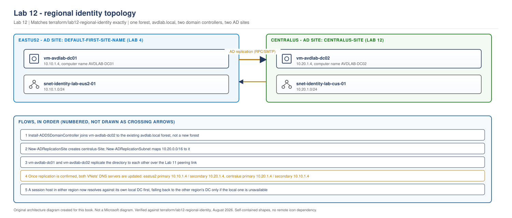

> **Part of:** [Azure Virtual Desktop - Architect to Hands-on Implementation](../README.md)
> **Chapter:** [Chapter 7 - Identity Architecture Foundations](../chapters/ch07-identity-architecture-foundations.md)
> **Terraform:** [`terraform/lab12-regional-identity`](../terraform/lab12-regional-identity/)
> **Technical baseline:** August 2026
> **Plan:** [Labs 11-20 plan](../appendices/labs-11-20-plan.md)

# LAB 12 - Regional Identity

> **LAB ARCHITECTURE** - the environment you build across Labs 1-20. Not a Microsoft reference design.

## Objective

Give `centralus` its own domain controller, so session hosts in that region authenticate and resolve DNS locally instead of crossing the region pair for every sign-in. This is a second domain controller in the same `avdlab.local` forest Lab 4 created, not a new domain and not a new forest.

By the end of this lab, both regions have a working local domain controller, AD replication between them is confirmed, and both VNets' DNS server settings point at the local DC first and the remote one second.

## Lab architecture

> **OUR ORIGINAL ARCHITECTURE DIAGRAM.** Created for this book. Not a Microsoft diagram.
> Editable source: [`lab12-regional-identity-topology.drawio`](../diagrams/architecture/lab12-regional-identity-topology.drawio)



---

## ⚠️ Cost warning. Matches Lab 4 exactly.

| Resource | Size | Running cost | Deallocated cost |
|---|---|---|---|
| Domain controller VM | Standard_B2s (2 vCPU, 4 GB) | ~$30 per month | $0 for compute |
| OS managed disk | 127 GB Standard SSD | ~$10 per month | ~$10 per month, disks bill whether or not the VM runs |
| **Total if left running 24/7** | | **~$40 per month** | |
| **Total if deallocated between sessions** | | | **~$10 per month** |

```bash
# Deallocate at the end of every lab session
az vm deallocate \
  --resource-group rg-avd-identity-lab-cus-01 \
  --name vm-avdlab-dc02

# Start it again next session
az vm start \
  --resource-group rg-avd-identity-lab-cus-01 \
  --name vm-avdlab-dc02
```

**Keep this VM.** Labs 13-19 all depend on it. Deallocate it, do not delete it.

---

## Prerequisites

- [Lab 11](lab-11-multiregion-network-foundation.md) complete: `centralus` VNet, subnets, and peering confirmed `Connected` in both directions
- [Lab 4](lab-04-identity-integration.md) complete: `vm-avdlab-dc01` exists and `avdlab.local` is a working forest
- The same domain admin credentials you used for Lab 4 (or any account with rights to add a domain controller to the forest)

## Lab design decisions

**An additional domain controller, not a new domain.** A common mistake extending a single-region AD design to a second region is standing up a second, separate domain and trying to trust it to the first. That creates a trust relationship to manage and two separate directories to keep synchronised. This lab does the simpler, more standard thing: `vm-avdlab-dc02` joins the existing `avdlab.local` forest as an additional domain controller, so there is still exactly one directory, replicated to two locations.

**AD Sites and Services, not just two DCs on the network.** Without site configuration, a session host in `centralus` has no way to know that `vm-avdlab-dc02` is the "close" domain controller - Active Directory's default site-selection logic assumes everything is in one location unless told otherwise. This lab creates a second AD site (`centralus-Site`), maps `10.20.0.0/16` to it, and confirms that a client in that subnet range prefers the local DC.

---

## Step 1 - Deploy the VM with Terraform

Full configuration is in [`terraform/lab12-regional-identity`](../terraform/lab12-regional-identity/). The shape matches Lab 4's domain controller exactly, at the `centralus` address and with a different computer name:

```hcl
resource "azurerm_windows_virtual_machine" "dc" {
  name                  = "vm-avdlab-dc02"
  computer_name         = "AVDLAB-DC02"
  location              = var.location
  resource_group_name   = data.terraform_remote_state.lab11_network.outputs.resource_group_names.identity
  size                  = var.dc_vm_size
  admin_username        = var.dc_admin_username
  admin_password        = var.dc_admin_password
  network_interface_ids = [azurerm_network_interface.dc.id]

  os_disk {
    caching              = "ReadWrite"
    storage_account_type = "StandardSSD_LRS"
  }

  source_image_reference {
    publisher = "MicrosoftWindowsServer"
    offer     = "WindowsServer"
    sku       = "2022-datacenter-azure-edition"
    version   = "latest"
  }

  tags = local.common_tags
}
```

```bash
cd terraform/lab12-regional-identity
cp terraform.tfvars.example terraform.tfvars   # edit owner, dc_admin_password, primary_state_storage_account
terraform init
terraform fmt
terraform validate
terraform plan -out=tfplan
terraform apply tfplan
```

> This Terraform has not been run against a live Azure subscription while writing this lab. It has been checked for balanced syntax and built directly from Lab 4's already-applied module, with only the region, computer name, and remote-state source changed. Confirm your own plan output before applying.

**Expected plan output, in shape:** 2 resources to add (network interface, virtual machine), 0 to change, 0 to destroy.

## Step 2 - Install AD DS and join the existing forest

```bash
# Install the role (same as Lab 4 Step 2)
az vm run-command invoke \
  --resource-group rg-avd-identity-lab-cus-01 \
  --name vm-avdlab-dc02 \
  --command-id RunPowerShellScript \
  --scripts "Install-WindowsFeature -Name AD-Domain-Services -IncludeManagementTools"
```

**Expected output:** JSON containing `Success` and `RestartNeeded : No`.

```bash
# Join the existing forest as an additional domain controller
az vm run-command invoke \
  --resource-group rg-avd-identity-lab-cus-01 \
  --name vm-avdlab-dc02 \
  --command-id RunPowerShellScript \
  --scripts "\$securePassword = ConvertTo-SecureString 'ReplaceWithYourDsrmPassword1!' -AsPlainText -Force; \$domainCred = New-Object System.Management.Automation.PSCredential('AVDLAB\\avdlabadmin', (ConvertTo-SecureString 'ReplaceWithYourDomainAdminPassword1!' -AsPlainText -Force)); Install-ADDSDomainController -DomainName 'avdlab.local' -Credential \$domainCred -SafeModeAdministratorPassword \$securePassword -InstallDns -Force -NoRebootOnCompletion:\$false"
```

**What this does, and how this differs from Lab 4's `Install-ADDSForest`.** `Install-ADDSDomainController` joins an existing domain rather than creating one. It needs a domain administrator credential to authorise the join, which `Install-ADDSForest` didn't need because there was no domain to join yet.

**Expected behaviour:** the command may return an error or time out because the VM reboots while it is running, exactly as Lab 4's Step 3 describes. Wait three to five minutes, then verify.

## Step 3 - Configure AD Sites and Services

```bash
az vm run-command invoke \
  --resource-group rg-avd-identity-lab-cus-01 \
  --name vm-avdlab-dc02 \
  --command-id RunPowerShellScript \
  --scripts "New-ADReplicationSite -Name 'centralus-Site'; New-ADReplicationSubnet -Name '10.20.0.0/16' -Site 'centralus-Site'; Move-ADDirectoryServer -Identity 'AVDLAB-DC02' -Site 'centralus-Site'"
```

**What this does:** creates a second AD site, maps the entire `centralus` address range to it, and moves `vm-avdlab-dc02` into that site. Without this step, both domain controllers sit in `Default-First-Site-Name` and AD has no way to prefer the geographically closer one.

**Expected output:** no output on success. Verify with:

```bash
az vm run-command invoke \
  --resource-group rg-avd-identity-lab-cus-01 \
  --name vm-avdlab-dc02 \
  --command-id RunPowerShellScript \
  --scripts "Get-ADReplicationSite -Filter * | Select-Object Name; Get-ADDomainController -Filter * | Select-Object Name, Site"
```

**Expected output:** two sites listed (`Default-First-Site-Name`, `centralus-Site`), and `AVDLAB-DC02` showing `Site : centralus-Site`.

## Step 4 - Confirm replication

```bash
az vm run-command invoke \
  --resource-group rg-avd-identity-lab-cus-01 \
  --name vm-avdlab-dc02 \
  --command-id RunPowerShellScript \
  --scripts "repadmin /showrepl"
```

**Expected output:** a report showing `vm-avdlab-dc01` as a replication partner, with `Last replication` timestamps recent (within the last few minutes) and no error codes.

**If replication shows an error:** the most common cause at this stage is the Lab 11 peering not actually being `Connected` in both directions, or the `Allow-AD-Replication-From-Eastus2` NSG rule not having applied. Re-check Lab 11's Step 5 validation before troubleshooting AD itself.

## Step 5 - Point both VNets at both domain controllers

This is the step Lab 11 deliberately deferred. Only do it now that Step 4 has passed.

```bash
# centralus: local DC primary, eastus2 DC secondary
az network vnet update \
  --resource-group rg-avd-network-lab-cus-01 \
  --name vnet-avd-lab-cus-01 \
  --dns-servers 10.20.1.4 10.10.1.4

# eastus2: local DC primary, centralus DC secondary
az network vnet update \
  --resource-group rg-avd-network-lab-eus2-01 \
  --name vnet-avd-lab-eus2-01 \
  --dns-servers 10.10.1.4 10.20.1.4
```

**Then restart every VM in both VNets** so the new DNS setting is actually picked up, exactly as Lab 4's Step 5 explains for the single-region case:

```bash
az vm restart --resource-group rg-avd-identity-lab-eus2-01 --name vm-avdlab-dc01
az vm restart --resource-group rg-avd-identity-lab-cus-01 --name vm-avdlab-dc02
```

**Why each region lists its own DC first, not both regions using the same order.** DNS server order is a preference list, tried in sequence. Listing the local DC first means normal-case name resolution never crosses the region pair; the remote DC is only consulted if the local one doesn't answer, which is exactly the fallback behaviour you want without paying its latency cost on every query.

---

## Validation Checklist

- [ ] `vm-avdlab-dc02` exists in `rg-avd-identity-lab-cus-01` with static IP `10.20.1.4`
- [ ] `Get-ADDomain` on `vm-avdlab-dc02` returns `DNSRoot : avdlab.local` - the same forest as `vm-avdlab-dc01`, not a new one
- [ ] `centralus-Site` exists and `10.20.0.0/16` is mapped to it
- [ ] `AVDLAB-DC02` shows `Site : centralus-Site`, not `Default-First-Site-Name`
- [ ] `repadmin /showrepl` on both domain controllers shows the other as a healthy, recent replication partner
- [ ] `centralus` VNet DNS servers: `10.20.1.4`, then `10.10.1.4`
- [ ] `eastus2` VNet DNS servers: `10.10.1.4`, then `10.20.1.4`
- [ ] `nltest /dsgetdc:avdlab.local` run from a temporary test VM in the `centralus` hosts subnet returns `AVDLAB-DC02`, confirming site-aware DC selection actually works, not just that it's configured

## Troubleshooting

| Problem | Likely cause | Fix |
|---|---|---|
| `Install-ADDSDomainController` fails with an authentication error | Domain admin credential wrong, or the account lacks rights | Confirm the credential is a real domain account, not the local VM admin account used for Lab 4's forest creation |
| `repadmin /showrepl` shows a replication error referencing RPC | Lab 11's peering or NSG rule not actually applied | Re-run Lab 11's Step 5 validation before troubleshooting further here |
| `nltest /dsgetdc:avdlab.local` from `centralus` still returns `AVDLAB-DC01` | AD site subnet mapping not applied, or client hasn't refreshed its site cache | Confirm `Get-ADReplicationSubnet` shows `10.20.0.0/16` mapped correctly; a fresh VM picks up site membership faster than one that's been running since before the site existed |
| VNet DNS update seems to break name resolution entirely | DNS servers changed before Step 4's replication check passed | Set VNet DNS servers back to empty, restart affected VMs, confirm replication, then retry Step 5 |

## Cleanup

**Keep everything.** Labs 13-19 depend on this domain controller. Deallocate `vm-avdlab-dc02` between sessions using the command in the cost warning above; do not delete it.

## Lab 12 Interview Questions

**Q. Why join the existing forest with a second domain controller, rather than create a separate domain in `centralus` and trust it?**
A second domain means a second directory to keep consistent, plus a trust relationship to configure and maintain between the two - real ongoing operational cost for no benefit here, since both regions serve the same organisation and the same users. An additional domain controller in the same forest gives every region a local, fast authentication and DNS path while keeping exactly one directory. Separate domains earn their complexity when there's a genuine reason for administrative separation - a merger, a subsidiary with its own IT team - not just because the compute happens to be in a different region.

**Q. What actually breaks if you deploy a second domain controller in `centralus` but skip the AD Sites and Services configuration?**
Both domain controllers technically work and replicate correctly - Sites and Services doesn't affect replication in a two-DC forest this small. What breaks is efficiency: without a site mapped to the `centralus` subnet range, AD's default site-selection logic doesn't know `vm-avdlab-dc02` is the "close" one for `centralus` clients, so a session host there might authenticate against `vm-avdlab-dc01` in `eastus2` just as often as the local DC, defeating the entire point of deploying regional identity in the first place. The failure mode is silent - sign-ins still work, just with unnecessary cross-region latency nobody notices without specifically checking which DC actually answered.

**Q. Why change the VNet DNS server settings only after confirming replication, rather than as part of the same deployment?**
Because DNS resolution for `avdlab.local` depends on the domain controller actually being a functioning, replicated DC first. Pointing the VNet at `vm-avdlab-dc02` before it has finished promoting or before replication is healthy risks every VM in that VNet losing name resolution against a DC that can't yet answer authoritatively - the exact failure mode Lab 4 warns about for the single-region case, and it applies identically here. The order that works is: deploy, promote, confirm site configuration, confirm replication, and only then touch DNS.

---

## What comes next

[Lab 13 - Regional Storage Foundation](lab-13-regional-storage-foundation.md) builds `centralus`'s storage account and private endpoint, mirroring Lab 5, using this lab's domain controller for share-level RBAC in the new region.
