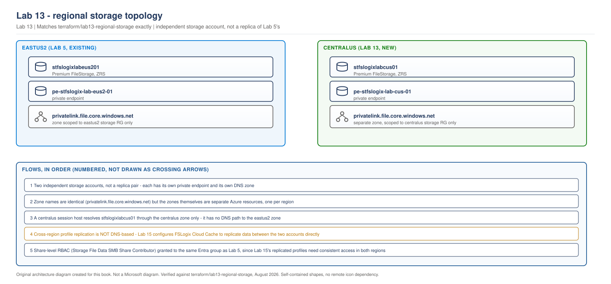

# Lab 13 - Regional Storage Foundation

> **Book:** Azure Virtual Desktop - Architect to Hands-on Implementation
> **Depends on:** Lab 11 (multi-region network), Lab 12 (regional identity)
> **Feeds into:** Lab 15 (FSLogix Cloud Cache replication)
> **Terraform:** [`terraform/lab13-regional-storage`](../terraform/lab13-regional-storage/)
> **Plan:** [Labs 11-20 plan](../appendices/labs-11-20-plan.md)

---

## Objective

Build `centralus`'s FSLogix profile storage, following exactly the same design Lab 5 used for `eastus2`: AD-based Kerberos authentication, the two-layer permission model, a private endpoint, and private DNS resolution. This is a separate storage account, not a copy or extension of Lab 5's - Lab 15 is where the two accounts start replicating to each other.

## Learning objectives

By the end of this lab you will be able to:

- Deploy a second, independent regional storage account using the identical pattern Lab 5 established, and explain why repeating a proven pattern beats inventing a new one for the second region
- Confirm that identity-based authentication against a *different* domain controller (`vm-avdlab-dc02`, not `vm-avdlab-dc01`) still works, because both are domain controllers in the same forest
- Recognise that two private DNS zones can share the same zone name without conflicting, because each is scoped to its own resource group and linked to its own VNet
- State precisely what this lab does *not* yet give you: cross-region profile access, which is Lab 15's job

## Dependency on previous labs

| From | What this lab consumes |
|---|---|
| Lab 11 | `rg-avd-storage-lab-cus-01` resource group, the `centralus` VNet ID, and the `snet-storage-lab-cus-01` subnet the private endpoint attaches to |
| Lab 12 | `vm-avdlab-dc02`, used as the AD DS identity source for this storage account's authentication, and as the DNS server that must resolve the private endpoint correctly |

If Lab 12's domain controller is currently deallocated, start it before Step 4. Everything through Step 3 works without it, exactly as Lab 5 notes for Lab 4's DC.

## Architecture context

> **LAB ARCHITECTURE.** Regional storage layer added to the environment built in Labs 11-12.

> **OUR ORIGINAL ARCHITECTURE DIAGRAM.** Created for this book. Not a Microsoft diagram.
> Editable source: [`lab13-regional-storage-topology.drawio`](../diagrams/architecture/lab13-regional-storage-topology.drawio)



## Prerequisites

- [Lab 11](lab-11-multiregion-network-foundation.md) complete: `centralus` network, subnets, and peering confirmed `Connected`
- [Lab 12](lab-12-regional-identity.md) complete: `vm-avdlab-dc02` promoted and replicating
- The same Entra ID group object ID you used for Lab 5's `avd_users_group_object_id` - profiles will eventually replicate between regions, so the same users need access to both shares

## Estimated cost

Premium file share, provisioned capacity: ~$20-30/month for the default 100 GiB quota. Private endpoint: ~$7/month. No compute deployed. Matches Lab 5's cost shape exactly.

## Required tools

Same as Lab 5: Azure CLI, Terraform, and a way to run commands against the `centralus` domain controller for Steps 4-6.

## Security considerations

Identical to Lab 5: `public_network_access_enabled = false`, TLS 1.2 minimum, and the two-layer permission model (share RBAC plus NTFS) - neither layer alone is sufficient, and Step 5 proves that deliberately before Step 6 fixes it.

---

## Step 1 - Deploy storage with Terraform

Full configuration is in [`terraform/lab13-regional-storage`](../terraform/lab13-regional-storage/). The resource shape is identical to Lab 5's, at the `centralus` address:

```hcl
resource "azurerm_storage_account" "fslogix" {
  name                = "stfslogix${var.environment}${var.location_short}01"
  resource_group_name = data.terraform_remote_state.lab11_network.outputs.resource_group_names.storage
  location            = var.location

  account_kind             = "FileStorage"
  account_tier              = "Premium"
  account_replication_type  = "ZRS"

  azure_files_authentication {
    directory_type = "AD"
  }

  tags = local.common_tags
}
```

```bash
cd terraform/lab13-regional-storage
cp terraform.tfvars.example terraform.tfvars   # edit owner, avd_users_group_object_id, primary_state_storage_account
terraform init
terraform fmt
terraform validate
terraform plan -out=tfplan
terraform apply tfplan
```

> This Terraform has not been run against a live Azure subscription while writing this lab. It has been checked for balanced syntax and built directly from Lab 5's already-applied module, with only the region, remote-state source, and resource-group reference changed. Confirm your own plan output before applying.

**Expected plan output, in shape:** 7 resources to add (storage account, file share, private endpoint, private DNS zone, VNet link, A record, role assignment), 0 to change, 0 to destroy.

## Step 2 - Validate the private endpoint and DNS resolution

```bash
az network private-endpoint show \
  --resource-group rg-avd-storage-lab-cus-01 \
  --name pe-stfslogix-lab-cus-01 \
  --query "privateLinkServiceConnections[0].privateLinkServiceConnectionState.status" \
  --output tsv
```

**Expected output:** `Approved`

```bash
az network private-dns record-set a list \
  --resource-group rg-avd-storage-lab-cus-01 \
  --zone-name privatelink.file.core.windows.net \
  --output table
```

**Expected output:** one A record, matching your `centralus` storage account name, resolving to a private IP inside `10.20.4.0/24`.

## Step 3 - Assign share-level RBAC (permission layer one)

Already applied by the Terraform in `rbac.tf`, assigning **Storage File Data SMB Share Contributor** to your AVD users group at the share scope, the same role and the same group Lab 5 used. Confirm it:

```bash
az role assignment list \
  --scope "$(az storage account show -n <storage_account_name> -g rg-avd-storage-lab-cus-01 --query id -o tsv)/fileServices/default/fileshares/profiles" \
  -o table
```

**Expected output:** one role assignment, your AVD users group, role `Storage File Data SMB Share Contributor`.

**This is layer one only**, exactly as Lab 5 explains. Step 5 proves the resulting failure before Step 6 fixes it.

---

## Step 4 - Join the storage account to the domain for AD authentication

```bash
az vm run-command invoke -g rg-avd-identity-lab-cus-01 -n vm-avdlab-dc02 \
  --command-id RunPowerShellScript \
  --scripts "
    Install-Module -Name Az.Storage -Force -AllowClobber -Scope AllUsers
    Connect-AzAccount -Identity
    Import-Module Az.Storage
    Join-AzStorageAccountForAuth \
      -ResourceGroupName 'rg-avd-storage-lab-cus-01' \
      -StorageAccountName '<storage_account_name>' \
      -DomainAccountType 'ComputerAccount' \
      -OrganizationalUnitDistinguishedName 'CN=Computers,DC=avdlab,DC=local'
  "
```

`[VERIFY BEFORE IMPLEMENTATION]`: same requirement Lab 5 flags - `vm-avdlab-dc02` needs a system-assigned managed identity with Contributor on this storage account for `Connect-AzAccount -Identity` to work non-interactively.

**Why `vm-avdlab-dc02`, not `vm-avdlab-dc01`.** This step must run from a domain-joined machine in the same forest, but it does not need to be a specific domain controller - `avdlab.local` is one forest with two domain controllers now, and either can create the computer account this command produces. Using the local, `centralus` domain controller avoids an unnecessary cross-region round trip for an operation the local DC is equally able to perform.

**Expected output:** command completes without error.

---

## Step 5 - Prove the two-layer failure (deliberately)

```bash
az vm run-command invoke -g rg-avd-identity-lab-cus-01 -n vm-avdlab-dc02 \
  --command-id RunPowerShellScript \
  --scripts "New-Item -Path '\\\\<storage_account_name>.file.core.windows.net\\profiles\\testfolder' -ItemType Directory"
```

**Expected output at this point: Access Denied.** Same failure Lab 5 demonstrates, for the same reason: share-level RBAC alone permits reaching the share, not writing inside it.

---

## Step 6 - Apply NTFS permissions (permission layer two)

```bash
az vm run-command invoke -g rg-avd-identity-lab-cus-01 -n vm-avdlab-dc02 \
  --command-id RunPowerShellScript \
  --scripts "
    \$share = '\\\\<storage_account_name>.file.core.windows.net\\profiles'
    \$acl = Get-Acl \$share
    \$rule = New-Object System.Security.AccessControl.FileSystemAccessRule('AVDLAB\\avd-lab-users','Modify','ContainerInherit,ObjectInherit','None','Allow')
    \$acl.SetAccessRule(\$rule)
    Set-Acl -Path \$share -AclObject \$acl
  "
```

Then repeat Step 5's test:

```bash
az vm run-command invoke -g rg-avd-identity-lab-cus-01 -n vm-avdlab-dc02 \
  --command-id RunPowerShellScript \
  --scripts "New-Item -Path '\\\\<storage_account_name>.file.core.windows.net\\profiles\\testfolder' -ItemType Directory; Remove-Item -Path '\\\\<storage_account_name>.file.core.windows.net\\profiles\\testfolder'"
```

**Expected output:** the folder is created and removed without error.

**The group being granted access, `AVDLAB\avd-lab-users`, is the same group in both regions.** It's one AD group in one forest, and both storage accounts' NTFS permissions reference it identically. This matters for Lab 15 and Lab 16: the same users need to be able to authenticate against either region's share, even though only one region's share is where their profile actually lives at any given moment.

## Step 7 - Optional: disable the storage account key

Same recommendation as Lab 5, deferred the same way:

```bash
az storage account update \
  --name <storage_account_name> \
  --resource-group rg-avd-storage-lab-cus-01 \
  --allow-shared-key-access false
```

Leave this until after Lab 15 confirms FSLogix Cloud Cache mounts correctly using identity-based authentication in both directions.

---

## Validation checklist

- [ ] `stfslogixlabcus01` exists, kind `FileStorage`, tier `Premium`, replication `ZRS`
- [ ] Private endpoint `pe-stfslogix-lab-cus-01` shows connection status `Approved`
- [ ] Private DNS A record resolves to an IP inside `10.20.4.0/24`
- [ ] Share-level RBAC confirmed: `Storage File Data SMB Share Contributor` assigned to the AVD users group
- [ ] Step 5's deliberate failure reproduced (`Access Denied`) before Step 6
- [ ] Step 6's NTFS permission applied, and the repeated test succeeds
- [ ] `public_network_access_enabled` is `false`

## Common errors

Identical failure modes to Lab 5, at the `centralus` addresses: access denied joining the domain (check `vm-avdlab-dc02`'s managed identity permissions, not `vm-avdlab-dc01`'s), and PowerShell Gallery module installation blocked by NSG egress rules.

## Troubleshooting

| Problem | Likely cause | Fix |
|---|---|---|
| Private endpoint stuck in `Pending` | Auto-approval didn't trigger | Manually approve: `az network private-endpoint-connection approve` |
| DNS resolves to a public IP, not private | VNet link missing or private DNS zone not correctly scoped | Confirm `azurerm_private_dns_zone_virtual_network_link.files` applied and targets the `centralus` VNet, not `eastus2`'s |
| `Join-AzStorageAccountForAuth` succeeds on `eastus2` DC but not `centralus` DC | The managed identity role assignment was only granted once, against the wrong storage account, or against `vm-avdlab-dc01` instead of `vm-avdlab-dc02` | Confirm `vm-avdlab-dc02` specifically has Contributor on the `centralus` storage account - the two DCs' permissions are independent |

## Cleanup versus keep

**Keep everything.** Labs 15-19 depend on this storage account existing. There is no compute to deallocate in this lab; the storage account itself continues billing at its provisioned quota regardless of use, the same as Lab 5's.

## Portfolio evidence to capture

A screenshot or CLI output showing both regions' storage accounts side by side (`az storage account list --output table`, filtered to the `avd-storage` resource groups), demonstrating the deliberate two-account design rather than a single shared account - this is the evidence that distinguishes an active-active design from a naive "just point centralus at the same storage" shortcut that would defeat the whole purpose of regional independence.

## Interview questions from this lab

**Q. Why build a second, completely independent storage account for `centralus`, rather than just letting `centralus` session hosts use the existing `eastus2` share over the peered network?**
Because that would silently turn an active-active design into a design where one region depends on the other being reachable and performant, exactly the coupling active-active is supposed to avoid. A `centralus` session host mounting `eastus2`'s share works technically - the peering link supports it - but every profile operation now crosses the region pair, adding latency to every sign-in and making `centralus`'s user experience depend on `eastus2`'s network path being healthy. A second, independent account keeps each region's session hosts talking to local storage for their normal operations, with Lab 15's Cloud Cache handling the deliberate, asynchronous cross-region replication instead of every read and write crossing regions synchronously.

**Q. Two private DNS zones in this build share the exact same name, `privatelink.file.core.windows.net`. Why doesn't that conflict?**
Azure private DNS zone names are scoped to the resource group they're created in, not globally unique the way a public DNS zone name would need to be. Lab 5's zone lives in `rg-avd-storage-lab-eus2-01` and is linked only to the `eastus2` VNet; this lab's zone lives in `rg-avd-storage-lab-cus-01` and is linked only to `centralus`'s VNet. A session host only ever queries the zone reachable through its own VNet's DNS configuration, so it only ever resolves its own region's storage account through that zone, never the other one.

---

## What comes next

[Lab 14 - Active-Active Host Pools, Workspaces and Application Groups](lab-14-active-active-hostpools-workspaces.md) builds the second, fully independent host pool in `centralus`, using an Automated Host Pool with Session Host Configuration, and the separate workspace Microsoft's own multi-region guidance requires for the active-active pattern.
