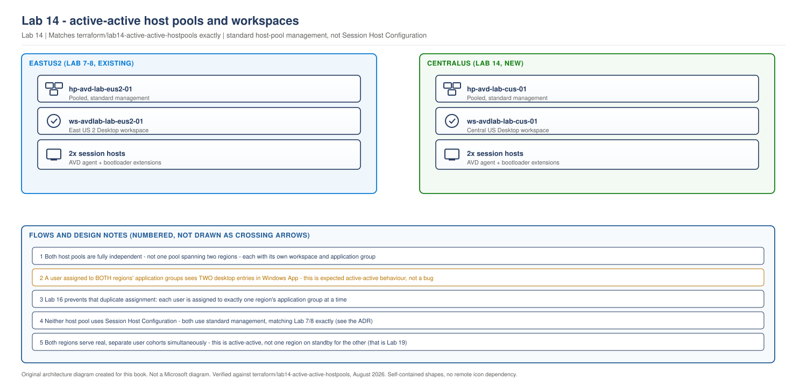

> **Part of:** [Azure Virtual Desktop - Architect to Hands-on Implementation](../README.md)
> **Chapter:** [Chapter 15 - Host Pool Design Decisions](../chapters/ch15-host-pool-design-decisions.md)
> **Terraform:** [`terraform/lab14-active-active-hostpools`](../terraform/lab14-active-active-hostpools/)
> **ADR:** [Standard host-pool management, not Session Host Configuration](../appendices/adr-shc-vs-standard-host-pools.md)
> **Technical baseline:** August 2026
> **Plan:** [Labs 11-20 plan](../appendices/labs-11-20-plan.md)

# LAB 14 - Active-Active Host Pools, Workspaces and Application Groups

> **LAB ARCHITECTURE** - the environment you build across Labs 1-20. Not a Microsoft reference design.

## Objective

Build a second, fully independent host pool in `centralus`, with its own workspace and application group, making this environment genuinely active-active for the first time. Both `eastus2` (Labs 1-10) and `centralus` (this lab) will serve real, separate user cohorts simultaneously once Lab 16 assigns users to each region.

This lab uses **standard host-pool management**, the same mechanism Lab 7 and Lab 8 already built, not Session Host Configuration. See the callout below and the [ADR](../appendices/adr-shc-vs-standard-host-pools.md) for why.

## Lab architecture

> **OUR ORIGINAL ARCHITECTURE DIAGRAM.** Created for this book. Not a Microsoft diagram.
> Editable source: [`lab14-active-active-workspaces.drawio`](../diagrams/architecture/lab14-active-active-workspaces.drawio)



---

## ⚠️ Why standard host-pool management, not Automated Host Pools

Automated Host Pools, built on Session Host Configuration (SHC), reached general availability on the Azure resource-provider side in June 2026. Building this lab surfaced a real gap between that and what's actually deployable: **no stable Terraform resource exists for SHC**, the PowerShell cmdlets that manage it are explicitly marked preview by Microsoft, and the ARM API has never shipped a non-preview version. This lab uses standard host-pool management instead, exactly matching Lab 7 and Lab 8's proven pattern. Automated Host Pools are covered in an optional section near the end of this lab, sourced to current Microsoft Learn documentation, not deployed here. See the [full ADR](../appendices/adr-shc-vs-standard-host-pools.md) for the complete reasoning and sources.

---

## Cost summary

| Resource | Monthly cost |
|---|---|
| Host pool, workspace, application group | **$0.00** - these AVD control-plane objects carry no direct charge |
| Two session hosts (Standard_D2s_v5) | ~$140/month running continuously |
| Two session hosts, deallocated between sessions | ~$20/month (disks only) |
| **Total, disciplined lab use** | **~$20/month** |
| **Total, left running continuously** | **~$140/month** |

Identical cost shape to Lab 8's `eastus2` session hosts.

## Prerequisites

- Labs 11-13 complete
- The same Entra AVD users group object ID used throughout Labs 5-13, or a distinct one if you want `centralus` assigned to a different population from the start (Lab 16 covers this properly)

---

## Lab design decisions

**Two host pools, not one host pool spanning two regions.** A single host pool with session hosts placed in multiple regions is technically possible, but Microsoft's own multi-region guidance explicitly discourages it for this use case: you cannot enforce regional connection preferences for users in that model, and profile storage assignment becomes complex. Two separate host pools, one per region, is the pattern this lab builds and the pattern Microsoft's Architecture Center documents for active-active AVD.

**Two workspaces, not one shared workspace.** This is the detail most likely to surprise someone building this for the first time: a user assigned to both regions' application groups sees **two separate desktop entries** in Windows App, one labelled for each region. This is expected active-active behaviour, not a configuration mistake. Microsoft's own guidance recommends separate, clearly-labelled workspaces specifically so this duplication is legible to the user rather than confusing. This lab names the `centralus` workspace `ws-avdlab-lab-cus-01` with a friendly name of "AVD Lab - Central US", distinct enough that a user seeing both entries understands immediately what each one is.

**No shared application group across regions.** Each region's application group is scoped to that region's host pool only. Lab 16 builds the non-overlapping user-to-region assignment that, in normal operation, keeps most users seeing only one desktop entry, not two, despite both existing.

---

## Step 1 - Deploy with Terraform

Full configuration is in [`terraform/lab14-active-active-hostpools/`](../terraform/lab14-active-active-hostpools/). The host pool itself is identical in shape to Lab 7's:

```hcl
resource "azurerm_virtual_desktop_host_pool" "centralus" {
  name                      = "hp-avd-${local.suffix}"
  location                  = var.location
  resource_group_name       = data.terraform_remote_state.lab11_network.outputs.resource_group_names.avd
  type                       = "Pooled"
  load_balancer_type         = "BreadthFirst"
  maximum_sessions_allowed   = var.max_session_limit
  preferred_app_group_type   = "Desktop"
  start_vm_on_connect         = true
  validate_environment        = true

  tags = local.common_tags
}
```

The workspace is where this lab diverges from a simple copy-paste of Lab 7 - notice the explicit, distinguishing friendly name and description:

```hcl
resource "azurerm_virtual_desktop_workspace" "centralus" {
  name                = "ws-avdlab-${local.suffix}"
  location            = var.location
  resource_group_name = data.terraform_remote_state.lab11_network.outputs.resource_group_names.avd
  friendly_name        = "AVD Lab - Central US"
  description          = "Central US desktop feed. Distinct from the East US 2 workspace by design - see Lab 14."
  tags                 = local.common_tags
}
```

```bash
cd terraform/lab14-active-active-hostpools
cp terraform.tfvars.example terraform.tfvars   # edit owner, admin_password, avd_users_group_object_id, primary_state_storage_account
terraform init
terraform fmt
terraform validate
terraform plan -out=tfplan
terraform apply tfplan
```

> This Terraform has not been run against a live Azure subscription while writing this lab. It has been checked for balanced syntax and built directly from Lab 7 and Lab 8's already-applied modules, with resource group, subnet, and DNS references switched to Lab 11 and Lab 12's remote state outputs. Confirm your own plan output before applying.

**Expected plan output, in shape:** roughly 12-14 resources to add (host pool, registration info, workspace, application group, workspace association, role assignment, 2 NICs, 2 VMs, 2 domain-join extensions, 2 AVD agent extensions), 0 to change, 0 to destroy.

## Step 2 - Confirm both session hosts registered

```bash
az desktopvirtualization hostpool list-session-host \
  --resource-group rg-avd-service-lab-cus-01 \
  --host-pool-name hp-avd-lab-cus-01 \
  --query "[].{name:name, status:properties.status}" \
  --output table
```

**Expected output:** two session hosts, both `status: Available`. If a host shows `NoHeartbeat` or `Unavailable`, the AVD agent extension likely failed or is still completing - allow five minutes after `terraform apply` finishes before troubleshooting.

## Step 3 - Confirm the workspaces are genuinely separate

```bash
az desktopvirtualization workspace list --output table
```

**Expected output:** two distinct workspaces, `ws-avdlab-lab-eus2-01` (from Lab 7) and `ws-avdlab-lab-cus-01` (this lab), each with its own friendly name.

## Step 4 - See the duplicate feed yourself

Assign your test user to **both** regions' application groups temporarily (Lab 16 will make this assignment properly non-overlapping):

```bash
az role assignment create \
  --assignee <test-user-object-id> \
  --role "Desktop Virtualization User" \
  --scope $(az desktopvirtualization applicationgroup show -g rg-avd-service-lab-cus-01 -n ag-desktop-lab-cus-01 --query id -o tsv)
```

Sign in with Windows App as that test user. **Expected result:** two desktop entries, one labelled for each region's workspace friendly name. This is the concrete evidence of the duplicate-feed behaviour Microsoft's documentation describes - seeing it once, deliberately, makes Lab 16's non-overlapping design make sense as a solution to a real, observed behaviour, not an abstract requirement.

---

## Validation Checklist

- [ ] `hp-avd-lab-cus-01` exists, type `Pooled`, both session hosts show `Available`
- [ ] `ws-avdlab-lab-cus-01` exists as a workspace distinct from `ws-avdlab-lab-eus2-01`
- [ ] `ag-desktop-lab-cus-01` exists, associated with `ws-avdlab-lab-cus-01`, host pool ID matches `hp-avd-lab-cus-01`
- [ ] A test user assigned to both regions' application groups sees two distinct desktop entries in Windows App
- [ ] Neither host pool object references Session Host Configuration - both were created with standard management, confirmed by the absence of a `sessionHostConfiguration` block in `az desktopvirtualization hostpool show` output

## Troubleshooting

| Problem | Likely cause | Fix |
|---|---|---|
| Session host stuck at `NoHeartbeat` | AVD agent extension failed, often a stale artifact URL | Re-check the `modulesUrl` in `session-hosts.tf` against the current Azure portal deployment template, per the `[VERIFY BEFORE IMPLEMENTATION]` note in the code |
| Domain join extension fails | Session host can't reach `vm-avdlab-dc02` | Confirm Lab 12's DNS change actually applied and the VM was restarted after it |
| Only one desktop entry appears for a test user assigned to both regions | Windows App feed cache | Sign out and back in, or manually refresh the feed in Windows App settings |
| `terraform apply` fails on the workspace association | Application group not yet fully provisioned when the association resource runs | Terraform's dependency graph should sequence this correctly; if it still races, re-run `terraform apply` once more |

## Cleanup

**Keep everything.** Labs 15-20 depend on this host pool. Deallocate the session hosts between sessions:

```bash
az vm deallocate --resource-group rg-avd-hosts-lab-cus-01 --name vm-avdlab-cus-h1
az vm deallocate --resource-group rg-avd-hosts-lab-cus-01 --name vm-avdlab-cus-h2
```

If you assigned your test user to both application groups for Step 4, remove the temporary `centralus` assignment before Lab 16, so Lab 16's non-overlapping design starts from a clean state.

---

## Optional: Automated Host Pools and Session Host Configuration

> **This section is informational only. Nothing here is deployed in this lab, and nothing in Labs 14-20 depends on it.**

**What it is.** Automated Host Pools use a Session Host Configuration object attached to the host pool, which defines the image, domain join method, disk type, and security settings declaratively. Microsoft's Session Host Update feature can then apply changes to that configuration by replacing session hosts automatically, rather than an administrator manually rebuilding them. The primary practical difference from standard management: session hosts in an SHC-based pool join the domain through the AVD agent itself, not a separate domain-join extension.

**Current tooling status, checked directly against Microsoft Learn for this book:**

- **PowerShell.** [`learn.microsoft.com/azure/virtual-desktop/session-host-update-configure`](https://learn.microsoft.com/en-us/azure/virtual-desktop/session-host-update-configure) says the Azure Virtual Desktop cmdlets for this management approach are in preview and require the preview Az.DesktopVirtualization module, version 5.3.0 or later. The relevant cmdlets include `New-AzWvdSessionHostConfiguration`, `Get-AzWvdSessionHostConfiguration`, and `Update-AzWvdSessionHostConfiguration`.
- **ARM/Bicep/AzAPI.** The `Microsoft.DesktopVirtualization/hostPools/sessionHostConfigurations` resource type has no non-preview API version in the Microsoft Learn version list. The newest version checked on 6 September 2026 is `2026-04-01-preview`.
- **Terraform.** No published `azurerm_virtual_desktop_session_host_configuration` resource exists in the `hashicorp/azurerm` provider as of this book's research.
- **Portal.** Creating a host pool with a session host configuration through the Azure portal is documented and does not require the preview PowerShell module or a specific API version pin - the portal handles that internally. If you want to see what this looks like without adopting any preview tooling into your own automation, the portal walkthrough is the lowest-risk way to observe it.

**What to check before relying on this in a real deployment:** re-visit [`learn.microsoft.com/azure/virtual-desktop/session-host-update-configure`](https://learn.microsoft.com/en-us/azure/virtual-desktop/session-host-update-configure) and the [Terraform Registry's azurerm provider resources list](https://registry.terraform.io/providers/hashicorp/azurerm/latest/docs) for whether a stable Terraform resource has shipped. If both the PowerShell preview banner is gone and a stable Terraform resource exists, Automated Host Pools become a reasonable candidate to migrate this lab's design toward, and the migration is additive: the workspace and application group objects this lab built don't need to change, only the host pool's session host management layer.

---

## Lab 14 Interview Questions

**Q. Why does Microsoft's active-active design produce two visible desktop entries for a user assigned to both regions, and why is that treated as correct rather than a bug to fix?**
It's a direct, honest consequence of building two genuinely independent host pools with two genuinely independent workspaces - which is exactly what active-active requires, since a single shared workspace would mean a single point of failure across both regions, undermining the whole point of building them independently. Rather than trying to hide that duplication behind clever routing logic, which would reintroduce exactly the kind of hidden complexity and failure risk this design is trying to avoid, Microsoft's guidance leans into it: name the workspaces clearly enough that a user seeing two entries understands what each one is. In practice this lab's non-overlapping assignment design (Lab 16) means most users only see one, but the underlying capability to see both is preserved deliberately, not eliminated.

**Q. This lab explicitly avoids Session Host Configuration even though the Azure feature is GA. Walk me through how you'd evaluate whether a new AVD capability is actually ready to build a required deployment on.**
Azure-side general availability is necessary but not sufficient - the actual question is whether every tool you need to build and operate it is also ready. Here, that meant checking three separate paths: Terraform, which is this lab's primary tool and has no stable resource for this; PowerShell, where Microsoft's own documentation states plainly that the relevant cmdlets are preview; and the underlying ARM API, which has never shipped a non-preview version. Any one of those being preview would be a reason for caution. All three being preview simultaneously, on a feature whose Azure-side status is GA, is a strong signal that "GA" here describes the resource provider capability, not the whole ecosystem needed to safely depend on it in a required, reproducible build.

**Q. If Session Host Configuration's tooling reaches full stability next year, what would actually need to change in this lab's design to adopt it?**
Less than it might seem. The workspace, application group, and the overall two-region, two-workspace active-active pattern don't change at all - those decisions were driven by Microsoft's multi-region guidance, not by which host-pool management type is underneath. What would change is the host pool resource itself and how session hosts get their configuration: instead of Terraform-managed VMs with a domain-join extension and an AVD agent DSC extension, the host pool would reference a Session Host Configuration object, and Session Host Update would replace hosts rather than this lab's current golden-image drain-and-replace pattern. That's a genuinely additive migration, which is exactly why this design was structured this way rather than trying to guess at SHC's eventual shape today.

---

## What comes next

[Lab 15 - FSLogix Cloud Cache Active-Active Replication and User Affinity](lab-15-cloud-cache-replication.md) configures the two independent storage accounts from Lab 13 to actually replicate profile data between regions, and deliberately reproduces the `ERROR_LOCK_VIOLATION` failure mode Microsoft's documentation describes, before Lab 16 builds the assignment pattern that prevents it.
