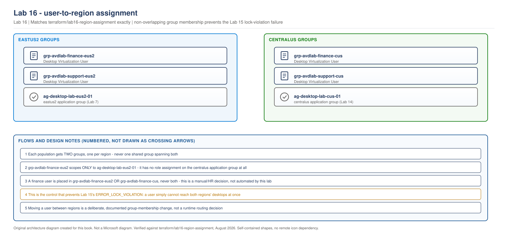

> **Part of:** [Azure Virtual Desktop - Architect to Hands-on Implementation](../README.md)
> **Terraform:** [`terraform/lab16-region-assignment`](../terraform/lab16-region-assignment/)
> **Technical baseline:** August 2026
> **Plan:** [Labs 11-20 plan](../appendices/labs-11-20-plan.md)

# LAB 16 - User-to-Region Assignment and Routing Strategy

> **LAB ARCHITECTURE** - the environment you build across Labs 1-20. Not a Microsoft reference design.

## Objective

Build the non-overlapping group structure that gives each user access to exactly one region's application group at a time - the concrete control that prevents the `ERROR_LOCK_VIOLATION` failure Lab 15 deliberately reproduced. By the end of this lab, "which region does this user belong to" is a single, auditable group membership, not something that can accidentally end up true for both regions at once.

## Lab architecture

> **OUR ORIGINAL ARCHITECTURE DIAGRAM.** Created for this book. Not a Microsoft diagram.
> Editable source: [`lab16-user-region-assignment.drawio`](../diagrams/architecture/lab16-user-region-assignment.drawio)



## Prerequisites

- Lab 14 complete: both regions' application groups exist
- Lab 15 complete: you've seen the lock-violation failure this lab prevents
- Lab 7's Terraform re-applied at least once since it gained an `application_group_id` output (see the note in [`terraform/lab07-avd-core/README.md`](../terraform/lab07-avd-core/README.md))
- The temporary dual-region test user assignment from Labs 14-15 removed, so this lab starts from a clean state

---

## Lab design decisions

**Two groups per population, never one shared group.** A single group with role assignments on both regions' application groups would let Terraform express "this population can reach both regions," which is exactly the state this design needs to make structurally impossible, not just discouraged by convention. Two groups, each scoped to one region only, means a user's actual reach is fully determined by which group or groups they're a member of - visible, auditable, and impossible to get subtly wrong through a single role assignment mistake.

**Group creation is Terraform. Population membership is not.** This lab's Terraform builds the group objects and their scoping to the correct application group. It deliberately does not add any specific user to any group. Deciding that a specific person belongs to the `eastus2` finance population rather than the `centralus` one is a business and HR decision, not an infrastructure one, and automating it here would hide that decision inside code a platform team owns rather than the business function that should actually be making it.

---

## Step 1 - Deploy the groups with Terraform

Full configuration is in [`terraform/lab16-region-assignment/`](../terraform/lab16-region-assignment/). The core pattern, building both regions' groups from one list:

```hcl
locals {
  region_groups = {
    for pair in setproduct(var.populations, ["eus2", "cus"]) :
    "${pair[0]}-${pair[1]}" => {
      population = pair[0]
      region     = pair[1]
    }
  }
}

resource "azuread_group" "region" {
  for_each = local.region_groups

  display_name     = "grp-avdlab-${each.key}"
  description       = "AVD access, ${each.value.population} population, ${each.value.region == "eus2" ? "East US 2" : "Central US"} only."
  security_enabled  = true
}
```

**Why `setproduct` instead of writing each group as its own resource block.** With two populations (`finance`, `support`) this saves four resource blocks; the real payoff is that adding a third population later means editing one list, not writing two more `resource` blocks and remembering to scope them correctly. This is the same "reduce the chance of a copy-paste mistake" reasoning behind most of this book's `for_each` usage.

```bash
cd terraform/lab16-region-assignment
cp terraform.tfvars.example terraform.tfvars   # edit owner, populations, primary_state_storage_account
terraform init
terraform fmt
terraform validate
terraform plan -out=tfplan
terraform apply tfplan
```

> This Terraform has not been run against a live Azure subscription while writing this lab. It has been checked for balanced syntax and reviewed against the established `for_each`/`setproduct` pattern already used elsewhere in this book's labs. Confirm your own plan output before applying.

**Expected plan output, in shape:** with the default two populations, 4 groups and 4 role assignments to add (2 populations x 2 regions), 0 to change, 0 to destroy.

## Step 2 - Confirm scoping is correct, per group

```bash
az role assignment list \
  --assignee $(az ad group show --group grp-avdlab-finance-eus2 --query id -o tsv) \
  --output table
```

**Expected output:** exactly one role assignment, `Desktop Virtualization User`, scoped to `ag-desktop-lab-eus2-01`. No entry referencing the `centralus` application group at all.

Repeat for `grp-avdlab-finance-cus`, expecting the reverse: scoped only to `ag-desktop-lab-cus-01`.

## Step 3 - Assign your test user to exactly one group

```bash
az ad group member add \
  --group grp-avdlab-finance-eus2 \
  --member-id <test-user-object-id>
```

Confirm the user is **not** a member of `grp-avdlab-finance-cus`:

```bash
az ad group member check \
  --group grp-avdlab-finance-cus \
  --member-id <test-user-object-id> \
  --query value \
  --output tsv
```

**Expected output:** `false`

## Step 4 - Confirm the fix, against Lab 15's exact failure

Sign in as this test user with Windows App. **Expected result: one desktop entry**, the `eastus2` one, not two. Attempt to reach the `centralus` desktop directly - it should not appear in the feed at all, because the user has no role assignment granting access to it.

This is the direct, working resolution to Lab 15 Step 6's reproduced failure: the lock-violation scenario required the same user reaching both regions, and that path no longer exists.

## Step 5 - Run the non-overlap audit

```powershell
# audit-region-assignment.ps1
# Confirms zero users hold membership in both an -eus2 and -cus group
# for the same population.

$populations = @("finance", "support")

foreach ($pop in $populations) {
    $eus2Members = Get-AzADGroupMember -GroupObjectId (Get-AzADGroup -DisplayName "grp-avdlab-$pop-eus2").Id | Select-Object -ExpandProperty Id
    $cusMembers  = Get-AzADGroupMember -GroupObjectId (Get-AzADGroup -DisplayName "grp-avdlab-$pop-cus").Id  | Select-Object -ExpandProperty Id

    $overlap = $eus2Members | Where-Object { $cusMembers -contains $_ }

    if ($overlap) {
        Write-Warning "Population '$pop' has $($overlap.Count) user(s) in BOTH region groups: $($overlap -join ', ')"
    } else {
        Write-Output "Population '$pop': no overlap. $($eus2Members.Count) users in eus2, $($cusMembers.Count) users in cus."
    }
}
```

**Expected output:** `no overlap` for every population. Run this periodically in a real deployment, not just once at build time - group membership drifts as people join, leave, and change roles, and this audit is what catches a manual mistake before it produces a support ticket about a mysteriously failing sign-in.

---

## Validation Checklist

- [ ] Four groups exist (with the default two populations): `grp-avdlab-finance-eus2`, `grp-avdlab-finance-cus`, `grp-avdlab-support-eus2`, `grp-avdlab-support-cus`
- [ ] Each `-eus2` group's only role assignment is on `ag-desktop-lab-eus2-01`
- [ ] Each `-cus` group's only role assignment is on `ag-desktop-lab-cus-01`
- [ ] Test user assigned to exactly one group, confirmed absent from that population's other-region group
- [ ] Test user's Windows App feed shows exactly one desktop entry, not two
- [ ] The audit script reports zero overlap across all populations

## Troubleshooting

| Problem | Likely cause | Fix |
|---|---|---|
| User still sees two desktop entries after Step 3 | Leftover assignment from Lab 14/15's temporary dual-region test | Confirm the user's direct (non-group) role assignments are clear; `az role assignment list --assignee <user-object-id>` should show only the group-inherited one |
| `azurerm_role_assignment` fails with a scope error | Lab 7's `application_group_id` output not yet populated | Re-run `terraform apply` in `lab07-avd-core` once, per the prerequisites note |
| Audit script reports overlap immediately after a clean deploy | A stale group membership from testing, not a Terraform problem | Group membership isn't Terraform-managed in this lab by design; remove the overlapping membership directly with `az ad group member remove` |

## Cleanup

**Keep the groups.** Labs 17-20 assume this assignment structure exists. Entra groups carry no cost, so there's no reason to remove them between sessions.

## Interview questions from this lab

**Q. Why build two separate groups per population instead of one group with conditional logic deciding which region a member reaches?**
Because "conditional logic deciding access at runtime" is exactly the kind of hidden complexity that makes a system hard to audit and easy to get wrong. Two groups, each with a single, static role assignment to exactly one region's application group, means a user's actual access is fully readable from group membership alone - no logic to trace through, no runtime state to reason about. If someone asks "can this user reach centralus," the answer is a group membership check, not a conversation about what conditions currently evaluate to true.

**Q. This lab's Terraform creates the groups but not their membership. Why draw the boundary there instead of automating membership too?**
Because deciding that a specific person belongs to the `eastus2` finance population rather than the `centralus` one is a business decision - who reports to which office, who's licensed for which market's data, who's actually located where - not an infrastructure decision. Automating it inside Terraform would mean a business decision lives in code a platform team owns and reviews through pull requests, rather than a process the actual business stakeholders control. The boundary here matches who should own the decision, not just what's technically automatable.

**Q. How would you extend this design if a user genuinely needs access to both regions, say a manager overseeing both desks?**
Not by adding them to both groups, since that reintroduces exactly the lock-violation risk this whole lab exists to prevent. The better answer is a documented exception process: a named, reviewed decision to grant that specific person cross-region access, with the understanding that they personally now carry the responsibility of never having simultaneous active sessions in both regions, and ideally with monitoring that flags if they ever do. This is a genuinely different risk profile from the general population, and it should look different in the design, not be quietly absorbed into "just add them to both groups."

---

## What comes next

[Lab 17 - Regional Autoscaling with Power Management Autoscale](lab-17-regional-autoscaling.md) gives each region's host pool its own independent scaling plan, tuned to that region's own demand pattern.
