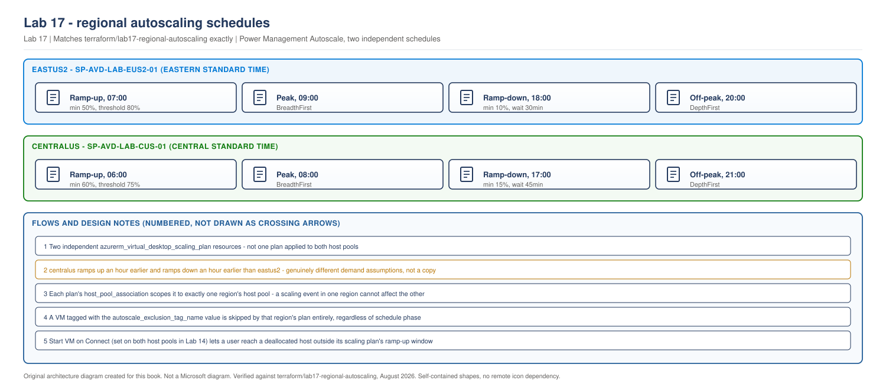

> **Part of:** [Azure Virtual Desktop - Architect to Hands-on Implementation](../README.md)
> **Chapter:** [Chapter 15 - Host Pool Design Decisions](../chapters/ch15-host-pool-design-decisions.md)
> **Terraform:** [`terraform/lab17-regional-autoscaling`](../terraform/lab17-regional-autoscaling/)
> **ADR:** [Standard host-pool management and Power Management Autoscale](../appendices/adr-shc-vs-standard-host-pools.md)
> **Technical baseline:** August 2026
> **Plan:** [Labs 11-20 plan](../appendices/labs-11-20-plan.md)

# LAB 17 - Regional Autoscaling with Power Management Autoscale

> **LAB ARCHITECTURE** - the environment you build across Labs 1-20. Not a Microsoft reference design.

## Objective

Give each region's host pool its own independent scaling plan, tuned to that region's own demand pattern, using Power Management Autoscale, this book's required, production-safe implementation. Dynamic Autoscaling is covered as an optional comparison at the end of this lab, not deployed here. See the [ADR](../appendices/adr-shc-vs-standard-host-pools.md) for the full reasoning.

## Lab architecture

> **OUR ORIGINAL ARCHITECTURE DIAGRAM.** Created for this book. Not a Microsoft diagram.
> Editable source: [`lab17-regional-autoscaling-schedules.drawio`](../diagrams/architecture/lab17-regional-autoscaling-schedules.drawio)



## Cost summary

| | Impact |
|---|---|
| Scaling plan objects | **$0.00** - no direct charge |
| Effect on Lab 14's baseline | **Reduction, not addition** - Power Management Autoscale deallocates idle session hosts during ramp-down and off-peak, cutting compute charges during those windows |
| Estimated saving | 30-50% against Lab 14's always-on baseline for a typical business-hours pattern |

## Prerequisites

- Labs 7 and 14 complete, with `host_pool_id` outputs populated (both gained this output for this lab - re-run `terraform apply` once in each if you built them earlier)
- Lab 10's original single-region scaling plan removed or accepted as superseded, since this lab's `eastus2` plan replaces it for the active-active design

---

## Lab design decisions

**Two scaling plans, not one plan with region-conditional logic.** Same reasoning as Lab 16's group design: a single scaling plan trying to express two regions' different schedules through conditional logic would be harder to audit than two separate, statically-configured plans, each fully readable on its own.

**Genuinely different schedules, not a copy with the region name changed.** `centralus`'s plan starts ramp-up an hour earlier (06:00 versus 07:00), uses different minimum-hosts and capacity-threshold percentages, and has a longer ramp-down wait time. This is deliberate. Two active-active regions serving different user cohorts have no structural reason to share a demand curve, and this lab's Terraform makes that difference visible rather than hiding it behind identical defaults that happened to be copied from one region to the other.

---

## Step 1 - Deploy with Terraform

Full configuration is in [`terraform/lab17-regional-autoscaling/`](../terraform/lab17-regional-autoscaling/). The two plans side by side, showing the deliberate difference:

```hcl
# eastus2
schedule {
  ramp_up_start_time                 = "07:00"
  ramp_up_minimum_hosts_percent      = 50
  ramp_up_capacity_threshold_percent = 80
  ramp_down_start_time               = "18:00"
  ramp_down_wait_time_minutes        = 30
  off_peak_start_time                = "20:00"
}

# centralus - not the same numbers
schedule {
  ramp_up_start_time                 = "06:00"
  ramp_up_minimum_hosts_percent      = 60
  ramp_up_capacity_threshold_percent = 75
  ramp_down_start_time               = "17:00"
  ramp_down_wait_time_minutes        = 45
  off_peak_start_time                = "21:00"
}
```

```bash
cd terraform/lab17-regional-autoscaling
cp terraform.tfvars.example terraform.tfvars   # edit owner, primary_state_storage_account
terraform init
terraform fmt
terraform validate
terraform plan -out=tfplan
terraform apply tfplan
```

> This Terraform has not been run against a live Azure subscription while writing this lab. It has been checked for balanced syntax and built directly from Lab 10's already-applied scaling plan module, adapted to two regions with intentionally different schedule values. Confirm your own plan output before applying.

**Expected plan output, in shape:** 2 resources to add (one scaling plan per region), 0 to change, 0 to destroy.

## Step 2 - Confirm both plans are attached correctly

```bash
az desktopvirtualization scalingplan show \
  --resource-group rg-avd-service-lab-eus2-01 \
  --name sp-avd-lab-eus2-01 \
  --query "hostPoolReferences[0].hostPoolArmPath" \
  --output tsv
```

**Expected output:** the resource ID of `hp-avd-lab-eus2-01` (Lab 7's host pool), not `centralus`'s.

```bash
az desktopvirtualization scalingplan show \
  --resource-group rg-avd-service-lab-cus-01 \
  --name sp-avd-lab-cus-01 \
  --query "hostPoolReferences[0].hostPoolArmPath" \
  --output tsv
```

**Expected output:** the resource ID of `hp-avd-lab-cus-01` (Lab 14's host pool).

## Step 3 - Observe an independent scaling action per region

The most convincing evidence that the two plans are genuinely independent is watching them act on different schedules, not just reading their configuration:

```bash
# Check eastus2 session host power state around its ramp-down window (18:00 Eastern)
az vm list -g rg-avd-hosts-lab-eus2-01 -d --query "[].{name:name, powerState:powerState}" -o table

# Check centralus session host power state around its ramp-down window (17:00 Central)
az vm list -g rg-avd-hosts-lab-cus-01 -d --query "[].{name:name, powerState:powerState}" -o table
```

**Expected behaviour:** `centralus` hosts begin deallocating at 17:00 Central while `eastus2` hosts remain running (its ramp-down doesn't start until 18:00 Eastern, a different wall-clock moment in absolute UTC terms). Recording the timestamps of each region's actual scaling action, not just the configured schedule, is the validation evidence this lab asks for - configuration matching intent is necessary but observing it acting independently is the real proof.

---

## Validation Checklist

- [ ] `sp-avd-lab-eus2-01` exists, attached to `hp-avd-lab-eus2-01` only
- [ ] `sp-avd-lab-cus-01` exists, attached to `hp-avd-lab-cus-01` only
- [ ] The two plans' schedules are confirmed different (ramp-up time, capacity thresholds, ramp-down wait time), not copies
- [ ] An observed scaling action in each region, with timestamps, showing they occur independently rather than in lockstep
- [ ] A VM tagged with the exclusion tag value confirmed skipped by that region's scaling action

## Troubleshooting

| Problem | Likely cause | Fix |
|---|---|---|
| `hostPoolReferences` empty on either plan | `host_pool_association` block missing or referencing the wrong host pool ID | Confirm the `hostpool_id` in each region's `.tf` file points at that region's own remote-state output, not the other region's |
| Both regions' hosts deallocate at the same wall-clock time | Schedules were accidentally copied identically, or the wrong time zone was set on one plan | Confirm `time_zone` differs correctly and the schedule times are the intentionally different values from Step 1, not both regions using Lab 10's original numbers |
| Session host doesn't deallocate at the expected ramp-down time | An active session is preventing it (expected, matches `ramp_down_force_logoff_users = false`), or `ramp_down_wait_time_minutes` hasn't elapsed yet | Check for active sessions on that host before assuming a fault; the wait time is deliberate, not a bug |

## Cleanup

**Keep both scaling plans.** They reduce Lab 14's ongoing cost, which is the opposite of something to remove for cost reasons. No manual deallocation needed for this lab specifically - that's the whole point of building it.

---

## Optional: Dynamic Autoscaling as a comparison and future upgrade path

> **This section is informational only. Nothing here is deployed in this lab, and nothing in Labs 14-20 depends on it.**

**What it is, and how it differs from Power Management Autoscale.** Dynamic Autoscaling can create and delete session hosts, not just start and stop them, scaling the actual number of VMs in a pool up and down based on demand rather than cycling a fixed set of hosts through running and deallocated states. It requires a pooled host pool built with Session Host Configuration (Automated Host Pool), which this book's Labs 14-20 do not use, per the [ADR](../appendices/adr-shc-vs-standard-host-pools.md).

**What to check before relying on it.** Re-visit [`learn.microsoft.com/azure/virtual-desktop/autoscale-glossary`](https://learn.microsoft.com/en-us/azure/virtual-desktop/autoscale-glossary) for Dynamic Autoscaling's current status, and the SHC tooling status covered in Lab 14's optional section (Terraform provider support, the PowerShell module's preview state, the ARM API version) - Dynamic Autoscaling is only reachable once an SHC-based pool exists, so its own status is secondary to whether SHC itself has become genuinely deployable.

**This has not been deployed, Terraform-validated, or tested anywhere in this book.** It is documented here as the upgrade path this lab's design deliberately leaves open, not as a claim about what it does in practice.

---

## Lab 17 Interview Questions

**Q. Why do the two regions' scaling plans use genuinely different schedule values instead of the same conservative defaults everywhere?**
Because copying one region's schedule into the other would be an unexamined default masquerading as a decision, and this book deliberately avoids that pattern elsewhere too. `centralus` and `eastus2` serve different user cohorts in this design, and there's no reason to assume they log on, work, and log off at the same times just because their infrastructure happens to be built from the same Terraform module structure. Giving each region its own tuned schedule, informed by that region's actual demand pattern once you have real telemetry, is what makes "regional autoscaling" a genuine design decision rather than a checkbox that happens to be ticked twice.

**Q. What would you actually check to confirm two scaling plans are truly independent, beyond reading their Terraform configuration?**
Configuration correctness proves intent, not behaviour. The real test is observing a scaling action happen in one region without a corresponding action in the other at the same moment, with timestamps recorded, exactly what this lab's Step 3 does. If you only checked that the Terraform applied without error, you'd have confirmed the plans were created correctly, not that they actually operate independently at runtime - and a shared dependency you didn't notice, like both plans accidentally pointing at the same host pool, would only show up in the behavioural test, not the configuration read.

**Q. Dynamic Autoscaling can create and delete hosts, which sounds more efficient than Power Management Autoscale's start-and-stop model. Why isn't it this lab's required implementation, given the Azure feature is GA?**
Because the Azure-side feature being GA doesn't mean every tool needed to build and depend on it safely is also ready, and Dynamic Autoscaling specifically requires a Session Host Configuration pool, which this book's research found isn't currently buildable with a stable Terraform resource, and whose PowerShell and ARM API paths are both still explicitly marked preview by Microsoft. Building a required lab dependency on three simultaneously-preview tooling paths, just to get a theoretically more efficient scaling model, is a worse trade than accepting Power Management Autoscale's real but smaller efficiency gap in exchange for a design that's fully GA and fully reproducible today. The upgrade path stays open and documented for when that changes.

---

## What comes next

[Lab 18 - Regional Security and Monitoring](lab-18-regional-security-monitoring.md) gives `centralus` its own egress control and its own Log Analytics workspace, joined by a cross-workspace dashboard, following the same per-region independence reasoning this lab and Lab 16 both apply.
