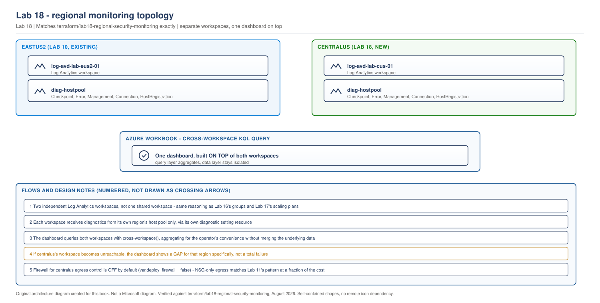

> **Part of:** [Azure Virtual Desktop - Architect to Hands-on Implementation](../README.md)
> **Chapter:** [Chapter 13 - Hybrid Connectivity and Egress Control](../chapters/ch13-hybrid-connectivity-egress-control.md)
> **Terraform:** [`terraform/lab18-regional-security-monitoring`](../terraform/lab18-regional-security-monitoring/)
> **Technical baseline:** August 2026
> **Plan:** [Labs 11-20 plan](../appendices/labs-11-20-plan.md)

# LAB 18 - Regional Security and Monitoring

> **LAB ARCHITECTURE** - the environment you build across Labs 1-20. Not a Microsoft reference design.

## Objective

Give `centralus` its own Log Analytics workspace and diagnostic settings, kept genuinely separate from `eastus2`'s (Lab 10), then build one Azure Workbook dashboard on top of both so an operator gets a single view without the underlying monitoring data ever being merged into a shared, single-point-of-failure workspace.

## Lab architecture

> **OUR ORIGINAL ARCHITECTURE DIAGRAM.** Created for this book. Not a Microsoft diagram.
> Editable source: [`lab18-regional-monitoring-topology.drawio`](../diagrams/architecture/lab18-regional-monitoring-topology.drawio)



## Cost summary

| Resource | Monthly cost |
|---|---|
| Log Analytics workspace | ~$5-15/month at lab scale, ingestion-based |
| Diagnostic settings | $0.00 |
| Azure Firewall, if enabled | **~$900/month running, regardless of traffic** |
| **Default configuration (Firewall off)** | **~$5-15/month** |

`deploy_firewall` defaults to `false`. This lab uses NSG-only egress control for `centralus`, matching Lab 11's already-built NSGs, rather than defaulting to the expensive option silently.

## Prerequisites

- Lab 11 complete: `centralus` monitoring and network resource groups exist
- Lab 14 complete: `centralus` host pool exists to attach diagnostics to

---

## Lab design decisions

**Two workspaces, not one shared workspace.** The same reasoning behind Lab 16's non-overlapping groups and Lab 17's independent scaling plans applies here: a shared monitoring workspace would be a single component whose failure, misconfiguration, or access-policy mistake could affect visibility into both regions simultaneously, which directly undermines the point of building two independent regions in the first place.

**One dashboard, built on top, not one workspace underneath.** The operational need for a single view across both regions doesn't require merging the data - it requires a query layer that can read from both. A cross-workspace KQL query, wrapped in one Azure Workbook, gives an operator that single view while the two workspaces underneath stay fully independent. If `centralus`'s workspace becomes unreachable, the dashboard should show a gap for that region specifically, not fail entirely - Step 3 validates this directly rather than assuming it.

---

## Step 1 - Deploy with Terraform

Full configuration is in [`terraform/lab18-regional-security-monitoring/`](../terraform/lab18-regional-security-monitoring/), mirroring Lab 10's workspace and diagnostic-setting pattern exactly, at the `centralus` address:

```hcl
resource "azurerm_log_analytics_workspace" "centralus" {
  name                = "log-avd-${local.suffix}"
  location            = var.location
  resource_group_name = data.terraform_remote_state.lab11_network.outputs.resource_group_names.monitoring
  sku                 = "PerGB2018"
  retention_in_days   = var.log_retention_days
  tags                = local.common_tags
}

resource "azurerm_monitor_diagnostic_setting" "centralus_hostpool" {
  name                       = "diag-hostpool"
  target_resource_id         = data.terraform_remote_state.lab14_hostpools.outputs.host_pool_id
  log_analytics_workspace_id = azurerm_log_analytics_workspace.centralus.id

  enabled_log { category = "Checkpoint" }
  enabled_log { category = "Error" }
  enabled_log { category = "Management" }
  enabled_log { category = "Connection" }
  enabled_log { category = "HostRegistration" }
}
```

```bash
cd terraform/lab18-regional-security-monitoring
cp terraform.tfvars.example terraform.tfvars   # edit owner, primary_state_storage_account
terraform init
terraform fmt
terraform validate
terraform plan -out=tfplan
terraform apply tfplan
```

> This Terraform has not been run against a live Azure subscription while writing this lab. It has been checked for balanced syntax and built directly from Lab 10's already-applied monitoring module. Confirm your own plan output before applying.

**Expected plan output, in shape (with `deploy_firewall = false`, the default):** 2 resources to add (workspace, diagnostic setting), 0 to change, 0 to destroy.

## Step 2 - Confirm diagnostics flow into the correct workspace, not cross-contaminated

```bash
az monitor log-analytics query \
  --workspace $(az monitor log-analytics workspace show -g rg-avd-monitoring-lab-cus-01 -n log-avd-lab-cus-01 --query customerId -o tsv) \
  --analytics-query "WVDConnections | where TimeGenerated > ago(1h) | summarize count() by _ResourceId" \
  --output table
```

**Expected output:** any rows returned reference `hp-avd-lab-cus-01`'s resource ID only. If a row references `hp-avd-lab-eus2-01`, diagnostics have been misconfigured to point at the wrong workspace somewhere.

## Step 3 - Build the cross-workspace dashboard query

```kql
// Cross-workspace query: run this from an Azure Workbook, not a single
// workspace's Log Analytics blade, since cross-workspace() only works
// in a context that supports specifying multiple workspace IDs.
union
  (workspace("log-avd-lab-eus2-01").WVDConnections | extend Region = "eastus2"),
  (workspace("log-avd-lab-cus-01").WVDConnections | extend Region = "centralus")
| where TimeGenerated > ago(24h)
| summarize ConnectionCount = count() by Region, bin(TimeGenerated, 1h)
| order by TimeGenerated desc
```

Save this as an Azure Workbook (`Azure Monitor > Workbooks > New`), pinned to your subscription, not scoped to either individual workspace, so the query can read both.

**Expected output:** a table or chart with rows for both `eastus2` and `centralus`, each showing hourly connection counts from that region's own data only.

## Step 4 - Prove graceful degradation, deliberately

```bash
# Temporarily remove your own read access to the centralus workspace to
# simulate it becoming unreachable, then re-run the Workbook query.
az role assignment list \
  --scope $(az monitor log-analytics workspace show -g rg-avd-monitoring-lab-cus-01 -n log-avd-lab-cus-01 --query id -o tsv) \
  --output table
# Note your own assignment's ID, remove it temporarily, re-add it after this test.
```

**Expected result:** the dashboard's `eastus2` data continues to display normally; the `centralus` portion shows an empty result or an access error scoped to that query only, not a failure of the entire Workbook. This is the concrete evidence that the two workspaces are genuinely independent at the query layer, not just in name.

---

## Validation Checklist

- [ ] `log-avd-lab-cus-01` exists, receiving diagnostics from `hp-avd-lab-cus-01` only
- [ ] A KQL query against the `centralus` workspace returns zero rows referencing the `eastus2` host pool's resource ID
- [ ] The cross-workspace Workbook query returns rows for both regions, correctly labelled
- [ ] Graceful degradation confirmed: blocking access to one workspace does not break the dashboard's display of the other region's data
- [ ] `deploy_firewall` confirmed `false` unless you specifically intended to enable it and accept the ~$900/month cost

## Troubleshooting

| Problem | Likely cause | Fix |
|---|---|---|
| Cross-workspace query returns an error, not partial results | Workbook created scoped to a single workspace rather than subscription-wide | Recreate the Workbook without pre-selecting a specific workspace scope |
| `centralus` workspace shows no data at all | Diagnostic setting not actually applied, or applied to the wrong host pool ID | Confirm `target_resource_id` in `monitoring.tf` resolves to `hp-avd-lab-cus-01`, not a stale or incorrect reference |
| `deploy_firewall = true` applied by accident | Left over from testing, or copied from an example without reading the cost warning | `terraform apply` again with `deploy_firewall = false`; Terraform will remove the Firewall, public IP, and subnet cleanly |

## Cleanup

**Keep the workspace.** Cost is low and Lab 20's validation depends on both regions' monitoring being in place. If you enabled the optional Firewall for testing, set `deploy_firewall = false` and re-apply before ending your session, given its cost.

## Interview questions from this lab

**Q. Why build two separate Log Analytics workspaces instead of pointing both regions' diagnostics at one shared workspace, which would be simpler to query?**
Because "simpler to query" and "resilient" are pulling in opposite directions here, and this design prioritises resilience. A shared workspace is a single point of failure for monitoring visibility into both regions - a misconfigured access policy, an accidental deletion, or a workspace-level quota issue would affect both regions' observability at once, which defeats the purpose of having built them as independent regions in the first place. The cross-workspace query in Step 3 gets back most of the "simpler to query" benefit anyway, without accepting that shared-failure risk.

**Q. How would you actually verify that two Log Analytics workspaces are genuinely independent, rather than just configured with different names?**
The same way this lab validates it: deliberately break access to one and confirm the other keeps working. Reading the Terraform configuration only proves intent - two diagnostic settings pointed at two different workspace IDs. The real test, which this lab's Step 4 performs, is temporarily removing access to the `centralus` workspace and confirming the dashboard's `eastus2` data is unaffected. If both regions' data disappeared together, that would reveal a shared dependency the configuration alone didn't expose.

**Q. Azure Firewall is a common recommendation for egress control. Why does this lab default it to off, and when would you turn it on?**
Because a full Azure Firewall costs roughly $900 a month running, regardless of how much traffic actually passes through it, which is a disproportionate cost for a lab environment that Lab 11's NSGs already secure adequately for outbound-only egress control. Defaulting it off, with the cost stated plainly in the variable description rather than buried in a comment, respects the reader's ability to make an informed cost decision instead of silently defaulting to the more expensive, more impressive-sounding option. You'd turn it on in a real production deployment that needs Firewall-specific capabilities NSGs don't provide - FQDN-based filtering, threat intelligence feeds, centralised logging of all egress traffic across many spokes - none of which this lab-scale, two-region environment actually requires to demonstrate its architecture.

---

## What comes next

[Lab 19 - Disaster Recovery and Failover (Active-Passive), Contrasted Against Active-Active](lab-19-disaster-recovery-failover.md) builds a genuinely different pattern from Labs 11-18: a lower-cost, admin-triggered failover design, so you have hands-on evidence of what actually changes between active-active and active-passive, not just a written comparison.
