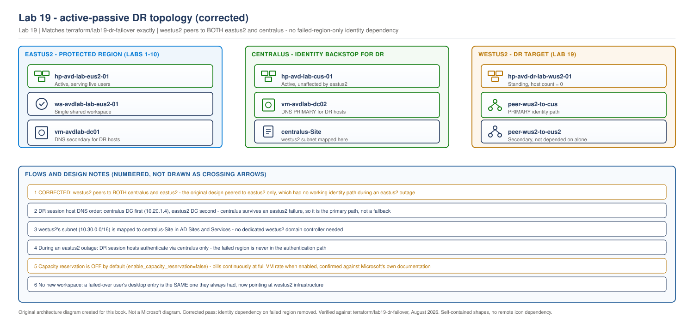
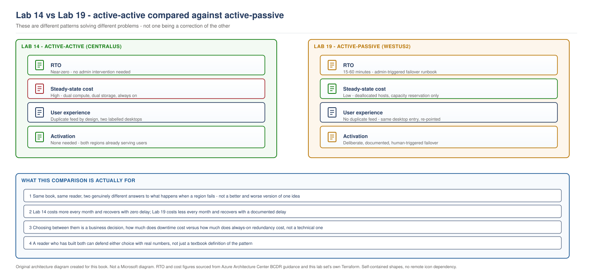

> **Part of:** [Azure Virtual Desktop - Architect to Hands-on Implementation](../README.md)
> **Terraform:** [`terraform/lab19-dr-failover`](../terraform/lab19-dr-failover/)
> **Technical baseline:** August 2026
> **Plan:** [Labs 11-20 plan](../appendices/labs-11-20-plan.md)

# LAB 19 - Disaster Recovery and Failover (Active-Passive), Contrasted Against Active-Active

> **LAB ARCHITECTURE** - the environment you build across Labs 1-20. Not a Microsoft reference design.

## Objective

Build a genuinely different pattern from Labs 11-18: active-passive disaster recovery, protecting `eastus2` (Labs 1-10's original region) with a warm-standby target in a third region. Execute a real, timed failover and a real, timed failback, so you have hands-on evidence of what changes between active-active and active-passive, not just a written comparison.

## A plan correction, stated plainly

The Labs 11-20 plan originally described this lab's DR target as living "in `centralus`." Building it revealed why that doesn't hold up: `centralus` already hosts Lab 14's active production host pool, serving real users. A DR target for `eastus2` needs to sit in a region that shares neither `eastus2`'s nor `centralus`'s failure domain, so this lab uses a third region, `westus2`, instead. The active-active architecture in Labs 11-18 is completely unchanged by this correction.

## Lab architecture

> **OUR ORIGINAL ARCHITECTURE DIAGRAM.** Created for this book. Not a Microsoft diagram.
> Editable source: [`lab19-active-passive-dr.drawio`](../diagrams/architecture/lab19-active-passive-dr.drawio)



> **OUR ORIGINAL ARCHITECTURE DIAGRAM.** Created for this book. Not a Microsoft diagram.
> Editable source: [`lab19-active-active-vs-active-passive-comparison.drawio`](../diagrams/architecture/lab19-active-active-vs-active-passive-comparison.drawio)



## Correction pass, applied after initial review

Two corrections were made to this lab after it was first built, both documented in full in the [Lab 19 correction report](../appendices/lab-19-correction-report.md):

1. **The identity dependency on the failed region has been removed.** The original design gave DR session hosts a DNS and authentication path only to `eastus2`'s domain controller. During an actual `eastus2` outage, the exact scenario this lab exists to survive, that meant DR session hosts had no working identity path at all - a DR design that fails specifically when its protected region fails is not a working DR design. `westus2` now also peers to `centralus`, and DR session hosts list `centralus`'s domain controller (Lab 12, independently healthy during an `eastus2` failure) first in DNS server order. See "Identity and networking during an eastus2 outage" below for the full design.
2. **`enable_capacity_reservation` now defaults to `false`**, renamed from `reserve_capacity`. Confirmed directly against Microsoft's own documentation (`learn.microsoft.com/azure/virtual-machines/capacity-reservation-overview`): a capacity reservation bills at the full VM rate continuously from the moment it's created, regardless of `deploy_active`, whether or not any VM is ever deployed against it. This is off by default; see the corrected cost table below.

## Cost summary

Four distinct billing states, not two. `deploy_active` (session hosts) and `enable_capacity_reservation` are independent variables, and treating them as one "warm standby cost" understates the real cost of some combinations.

| State | Session hosts | Capacity reservation | Monthly cost |
|---|---|---|---|
| **Default** (both `false`) | 0 deployed | Not created | **$0** compute |
| `deploy_active = true`, reservation off | 1+ running | Not created | ~$70/host running |
| `deploy_active = false`, reservation on | 0 deployed | Billing continuously | **~$70/reserved host slot, even though nothing is running** |
| `deploy_active = true`, reservation on | 1+ running | Billing continuously | Charged once per matched VM, not twice - see the capacity reservation section below |

Network (both peering links, VNet, subnet, NSG): ~$1/month regardless of the above, peering data transfer only.

This is materially lower than Lab 14's always-on active-active baseline (~$140/month per region) in every state except "reservation on, hosts running," which is the direct trade-off for accepting a 15-60 minute RTO instead of near-zero, further compounded if you also choose to pay for capacity assurance via the reservation.

## Prerequisites

- Labs 1-10 complete (this lab protects `eastus2` specifically)
- Labs 11 and 12 complete (`centralus` network and domain controller - the corrected design depends on both)
- A test user assigned to the `eastus2` application group already (from Lab 7 or Lab 16)

---

## Lab design decisions

**A genuinely separate Terraform module, not a flag inside Lab 14's.** Keeping active-active and active-passive as structurally distinct modules means they stay comparable side by side - a reader can look at `terraform/lab14-active-active-hostpools/` and `terraform/lab19-dr-failover/` independently and see two different architectures, rather than one confusing module with an `is_dr` toggle that quietly changes half its resources' behaviour.

**No new workspace for the DR application group.** Unlike Lab 14's deliberate second workspace, this lab's DR application group is not pre-associated with any workspace at apply time. Microsoft's documented active-passive user experience has no duplicate feed: a failed-over user's desktop entry is the same one they always had, now serving from DR infrastructure, not a second entry they'd need to learn to recognise only during an actual incident.

**Capacity reservation, off by default, and billed standing when enabled.** Enabling `enable_capacity_reservation` improves capacity assurance - confidence the DR VM SKU will actually be available during a real, regionally-constrained failover, when every other affected customer wants the same SKU in the same region. It is not free assurance: the reservation bills at the full VM rate continuously from the moment it exists, independent of `deploy_active`. This lab does not default to paying that cost silently; it is an explicit, opt-in decision.

---

## Identity and networking during an eastus2 outage

This section exists because the first version of this lab got it wrong, and the correction is worth understanding, not just applying.

**Normal operation.** `westus2` has no domain controller of its own. DR session hosts do not exist under normal operation (`deploy_active = false`), so there is nothing to authenticate. The standing infrastructure - network, host pool, application group - has no identity dependency at all in this state.

**What the original design got wrong.** The first version of this lab peered `westus2` only to `eastus2`, and set DR session hosts' DNS servers to `eastus2`'s domain controller alone. This meant that during an actual `eastus2` regional outage - the only scenario in which this lab's failover runbook would ever genuinely be needed - the DR session hosts created during failover would have no reachable domain controller to authenticate against. A DR design that depends exclusively on the region it is meant to protect against is not a DR design; it is a more expensive way of having no DR design.

**The corrected design.** `westus2` peers to **both** `eastus2` and `centralus`. DR session hosts' DNS server order lists `centralus`'s domain controller (Lab 12) **first**, with `eastus2`'s domain controller second:

```hcl
dns_servers = [
  data.terraform_remote_state.lab12_identity.outputs.dc_private_ip, # centralus DC - primary
  "10.10.1.4",                                                      # eastus2 DC (Lab 4) - secondary, not depended on alone
]
```

**Why centralus, not a dedicated third domain controller in westus2.** Three options exist for removing the failed-region dependency: peer to a surviving region's identity plane (what this correction does), build a dedicated `westus2` domain controller, or build a resilient hub/transit design. A dedicated `westus2` domain controller adds a standing ~$30-40/month cost (matching Lab 12's own domain controller sizing) for a component that would sit almost entirely idle between DR exercises - full regional independence, but paid for continuously. A hub/transit design is the right answer at a larger scale, but this environment has exactly three regions and two existing, already-healthy domain controllers; building hub infrastructure to route between them is solving a problem this environment doesn't yet have. Peering to `centralus`'s already-existing, independently healthy domain controller costs nothing beyond the peering link itself (no standing hourly charge, data transfer only) and directly closes the actual gap: DR session hosts need a working identity path that does not run through `eastus2`, and `centralus`'s domain controller is exactly that, already built, already validated in Lab 12.

**Why eastus2's domain controller stays listed, second, rather than being removed entirely.** Not every eastus2 problem is a full regional outage. A planned failover test, or a partial application-level failure that leaves eastus2's identity plane intact, are both scenarios where eastus2's domain controller is still the geographically closer, faster-responding option. Listing it second costs nothing when it's unavailable (DNS simply falls through to the next entry) and provides a marginal latency benefit when it's available. What changed is that it is no longer the *only* entry.

**AD Sites and Services.** `westus2` has no domain controller of its own, so it needs no new AD site. Its subnet (`10.30.0.0/16`) is mapped to the existing `centralus-Site` (created in Lab 12), associating DR session hosts with `centralus`'s domain controller for site-aware authentication rather than falling back to `Default-First-Site-Name`'s undifferentiated behaviour:

```powershell
# Run against vm-avdlab-dc02 (centralus), once, after Lab 19's network is applied
New-ADReplicationSubnet -Name "10.30.0.0/16" -Site "centralus-Site"
```

**Authentication dependencies, stated explicitly.** During an active DR failover, a DR session host's authentication path is: session host to `centralus`'s domain controller (via the `westus2`-to-`centralus` peering), never through `eastus2`. FSLogix profile access during failover is a separate dependency, covered by Lab 15's Cloud Cache replication between `eastus2` and `centralus` - a failed-over user's profile is available from `centralus`'s storage account regardless of `eastus2`'s state, because Cloud Cache already replicated it there before the outage.

**Failback.** No special identity consideration beyond what Lab 19's existing failback runbook already covers (Step 4). Once `eastus2` is confirmed recovered, session assignment reverts to `eastus2`'s application group; `westus2`'s DR session hosts are torn down via `terraform apply -var=deploy_active=false`, and the `centralus` peering remains in place afterward at its near-zero standing cost, ready for the next exercise or incident.

**What this design does and does not claim.** `westus2` is now independently recoverable with respect to identity: it does not depend on `eastus2` being reachable to authenticate DR session hosts. It is not independent of Microsoft Entra ID as a global service, which no region-level design can be, and it is not independent of `centralus` remaining healthy - if both `eastus2` and `centralus` were to fail simultaneously, this design has no further fallback. That is an accepted, disclosed limitation, not a gap the lab claims to have closed.

---

## Step 1 - Deploy the standing DR infrastructure

```bash
cd terraform/lab19-dr-failover
cp terraform.tfvars.example terraform.tfvars   # edit owner, admin_password, avd_users_group_object_id, primary_state_storage_account
terraform init
terraform fmt
terraform validate
terraform plan -out=tfplan
terraform apply tfplan
```

> This Terraform has not been run against a live Azure subscription while writing this lab. It has been checked for balanced syntax and built directly from Labs 3, 7, 11, and 14's already-applied patterns, adapted for a third region and a conditionally-created session host set. Confirm your own plan output before applying.

**Expected plan output, in shape, with `deploy_active = false` and `enable_capacity_reservation = false` (both defaults):** network resources including **two peering pairs** (`westus2`-to-`eastus2` and `westus2`-to-`centralus`, four peering resources total), host pool, registration info, application group - but zero session host resources and zero capacity reservation resources (all show `count = 0`).

## Step 2 - Confirm the warm-standby state, both dimensions

**First, confirm zero session hosts** - this has not changed:

```bash
az vm list --resource-group rg-avd-dr-lab-wus2-01 --output table
```

**Expected output:** empty. No VMs exist. This is the concrete evidence that `deploy_active = false` genuinely means zero standing compute, not just deallocated compute (Lab 14's pattern) - a stronger cost position specifically appropriate for a rarely-activated DR target.

**Second, confirm no capacity reservation exists by default** - this is new, and matters because a capacity reservation left enabled by accident bills regardless of the check above passing:

```bash
az capacity-reservation-group show \
  --resource-group rg-avd-dr-lab-wus2-01 \
  --name crg-avd-dr-lab-wus2-01 \
  --output table
```

**Expected output with the default `enable_capacity_reservation = false`:** `ResourceNotFound`. This is the correct, cost-free result. If a reservation group exists here and you did not deliberately set `enable_capacity_reservation = true`, you are being billed for it right now, independent of whether any VM exists - check `terraform.tfvars` immediately.

**Third, confirm both peering links are `Connected`** - the actual correction this pass made:

```bash
az network vnet peering show --resource-group rg-avd-dr-lab-wus2-01 --vnet-name vnet-avd-dr-lab-wus2-01 --name peer-wus2-to-eus2 --query peeringState -o tsv
az network vnet peering show --resource-group rg-avd-dr-lab-wus2-01 --vnet-name vnet-avd-dr-lab-wus2-01 --name peer-wus2-to-cus --query peeringState -o tsv
```

**Expected output, both commands:** `Connected`. Both links must be healthy for the corrected identity design to actually hold - a `westus2`-to-`centralus` peering that exists in Terraform state but hasn't reached `Connected` provides no real protection against an `eastus2` outage.

## Step 3 - The failover runbook

This is the operational core of the lab. Run it as a real, timed exercise, not a read-through.

```powershell
# failover-runbook.ps1
# Run this ONLY when a genuine (or deliberately simulated, for this lab)
# eastus2 regional incident has been confirmed via Azure Service Health,
# and a named incident commander has approved proceeding - a DR
# declaration is a real cost and business decision, not a default
# reaction to any alert.

$startTime = Get-Date
Write-Output "Failover declared at $startTime"

# Step 1: Remove user access to the eastus2 application group
Remove-AzRoleAssignment `
  -ObjectId $avdUsersGroupObjectId `
  -RoleDefinitionName "Desktop Virtualization User" `
  -Scope $eastus2ApplicationGroupId

# Step 2: Force-disconnect any still-connected eastus2 sessions
Get-AzWvdUserSession -HostPoolName "hp-avd-lab-eus2-01" -ResourceGroupName "rg-avd-service-lab-eus2-01" |
  ForEach-Object { Disconnect-AzWvdUserSession -HostPoolName "hp-avd-lab-eus2-01" -ResourceGroupName "rg-avd-service-lab-eus2-01" -SessionHostName $_.SessionHostName -Id $_.Id }

# Step 3: Terraform - deploy_active=true, creates the DR session hosts
# Run separately: terraform apply -var="deploy_active=true" -auto-approve
Write-Output "Now run: terraform apply -var=deploy_active=true -auto-approve"
Write-Output "Wait for apply to complete, then continue this script."
Read-Host "Press Enter once terraform apply has finished"

# Step 4: Assign the same user group to the DR application group
New-AzRoleAssignment `
  -ObjectId $avdUsersGroupObjectId `
  -RoleDefinitionName "Desktop Virtualization User" `
  -Scope $drApplicationGroupId

# Step 5: Associate the DR application group with the eastus2 workspace
# (the SAME workspace users already have - no new feed entry)
New-AzWvdWorkspaceApplicationGroupAssociation `
  -WorkspaceName "ws-avdlab-lab-eus2-01" `
  -ResourceGroupName "rg-avd-service-lab-eus2-01" `
  -ApplicationGroupPath $drApplicationGroupId

$endTime = Get-Date
Write-Output "Failover complete at $endTime. Total time: $($endTime - $startTime)"
```

**Expected behaviour, timed:** from declaration to a test user successfully signing in against the DR host pool, this should land within Microsoft's documented 15-60 minute active-passive RTO range. Record the actual time - this is the validation evidence this lab asks for, not the runbook's existence alone.

## Step 4 - The failback runbook, a distinct exercise

**Do not assume failback is failover in reverse.** The two regions' data may have diverged during the incident - any profile changes made during DR operation exist only in whatever storage the DR session hosts wrote to, and reconciling that against `eastus2`'s original storage is failback's actual hard problem, not a mechanical reversal.

```powershell
# failback-runbook.ps1
# Run only after eastus2 is confirmed genuinely recovered (Azure Service
# Health, plus your own validation), and only after reconciling any data
# written during DR operation - this step is intentionally NOT automated
# here, because the reconciliation approach depends entirely on what
# actually changed during the specific incident.

$startTime = Get-Date
Write-Output "Failback declared at $startTime"

# Step 1: Remove user access to the DR application group
Remove-AzRoleAssignment `
  -ObjectId $avdUsersGroupObjectId `
  -RoleDefinitionName "Desktop Virtualization User" `
  -Scope $drApplicationGroupId

# Step 2: Force-disconnect DR sessions
Get-AzWvdUserSession -HostPoolName "hp-avd-dr-lab-wus2-01" -ResourceGroupName "rg-avd-dr-lab-wus2-01" |
  ForEach-Object { Disconnect-AzWvdUserSession -HostPoolName "hp-avd-dr-lab-wus2-01" -ResourceGroupName "rg-avd-dr-lab-wus2-01" -SessionHostName $_.SessionHostName -Id $_.Id }

# Step 3: Re-assign the group back to eastus2
New-AzRoleAssignment `
  -ObjectId $avdUsersGroupObjectId `
  -RoleDefinitionName "Desktop Virtualization User" `
  -Scope $eastus2ApplicationGroupId

# Step 4: Terraform - deploy_active=false, tears down the DR session hosts
Write-Output "Now run: terraform apply -var=deploy_active=false -auto-approve"
Write-Output "This removes the DR session hosts, returning westus2 to its warm-standby state."
Read-Host "Press Enter once terraform apply has finished"

$endTime = Get-Date
Write-Output "Failback complete at $endTime. Total time: $($endTime - $startTime)"
```

## Step 5 - Run both exercises, timed, and record the results

Execute the failover runbook against a real test user. Confirm sign-in success against the DR host pool. Then execute the failback runbook. Record both durations - this is the concrete RTO evidence for this specific environment, not the generic 15-60 minute range quoted from Microsoft's documentation.

---

## Validation Checklist

- [ ] Standing state confirmed: zero session host VMs exist in `westus2` while `deploy_active = false`
- [ ] Capacity reservation confirmed **absent** with the default `enable_capacity_reservation = false` - not present and billing, present and not billing
- [ ] Both peering links (`peer-wus2-to-eus2`, `peer-wus2-to-cus`) confirmed `Connected`
- [ ] `westus2`'s subnet (`10.30.0.0/16`) confirmed mapped to `centralus-Site` in AD Sites and Services
- [ ] DR session host DNS server order confirmed as `centralus` DC first, `eastus2` DC second (not the reverse, and not `eastus2` alone)
- [ ] Simulated failover test: with `eastus2`'s domain controller deliberately unreachable (stop `vm-avdlab-dc01`, or block its IP via NSG temporarily), confirm a DR session host can still authenticate via `centralus`'s domain controller
- [ ] Failover runbook executed as a real, timed exercise, not read through
- [ ] Test user confirmed successfully signed in against DR infrastructure post-failover
- [ ] Failover duration recorded and compared against the 15-60 minute expected range
- [ ] Failback runbook executed as a separate, distinct, timed exercise
- [ ] Post-failback state confirmed: user reassigned to `eastus2`, DR session hosts torn down, `westus2` back to warm standby, capacity reservation removed if it was enabled for the exercise

## Troubleshooting

| Problem | Likely cause | Fix |
|---|---|---|
| DR session host fails to domain-join | Either peering (`westus2`-`eastus2` or `westus2`-`centralus`) not `Connected`, or the `Allow-Auth-From-Westus2-DR` NSG rule on `centralus`'s identity subnet missing | Confirm both peering links per Step 2; confirm the NSG rule exists on `nsg-identity-lab-cus-01` (added in Lab 11's correction pass) |
| DR session host domain-joins but authenticates slowly, or against the wrong DC | AD Sites and Services subnet mapping missing or incorrect | Confirm `Get-ADReplicationSubnet -Identity "10.30.0.0/16"` shows `Site : centralus-Site` |
| Simulated eastus2-outage test still fails | `centralus`'s domain controller listed second instead of first in `dns_servers`, or the `westus2`-`centralus` peering itself not `Connected` | Re-check `session-hosts.tf`'s `dns_servers` order; confirm peering state again after any recent change |
| Failover exceeds 60 minutes | `terraform apply` taking longer than expected, often VM image pull time | Compare against Lab 14's own apply timing as a baseline; investigate specifically which step consumed the excess time, don't just note the total was long |
| User doesn't see DR desktop after failover | Workspace association step (runbook Step 5) didn't complete, or wasn't given time to propagate | Confirm `Get-AzWvdWorkspaceApplicationGroupAssociation` shows the DR application group associated; feed refresh can take a few minutes client-side |
| Failback leaves orphaned DR session hosts | `terraform apply -var=deploy_active=false` wasn't run, or failed | Re-run explicitly; confirm with `az vm list -g rg-avd-dr-lab-wus2-01` returning empty |
| Capacity reservation still billing after a test | `enable_capacity_reservation` left `true` in `terraform.tfvars` after the exercise | Set back to `false` and re-apply; confirm with the `ResourceNotFound` check in Step 2 |

## Cleanup

**Keep the standing infrastructure** (network, both peering links, host pool) - Lab 20's validation depends on it. This has no meaningful standing cost with the corrected defaults.

**Confirm `deploy_active = false` after any failover exercise**, so you're not paying for DR session hosts outside an actual test or incident.

**Confirm `enable_capacity_reservation = false` after any exercise where you deliberately enabled it.** This is the cost item most likely to be left on by accident, precisely because it produces no visible symptom (no running VM, no obvious activity) while it continues billing. Re-run Step 2's `ResourceNotFound` check as the specific, positive confirmation it's actually off, not just an assumption based on not remembering to change it back.

## Interview questions from this lab

**Q. Walk me through why this lab's DR target had to move from `centralus` to a third region during the build.**
The original plan's instinct, putting the DR target in `centralus`, treated "a second region" as interchangeable with "a DR region," which isn't the same thing once you look closely. `centralus` in this environment is already Lab 14's active production region, serving real users as part of the active-active design. A DR target's entire purpose is protecting `eastus2` against `eastus2` specifically failing - it needs to sit somewhere that doesn't share `eastus2`'s failure domain, and ideally doesn't share `centralus`'s either, so a DR exercise doesn't get entangled with unrelated active-active traffic. Using a genuine third region, `westus2`, is what actually delivers the isolation a DR design is supposed to provide, rather than just technically satisfying "put it somewhere else."

**Q. Why does this lab treat failback as a separate runbook rather than just running the failover script in reverse?**
Because the two regions' data can genuinely diverge during however long DR was active, and a naive reversal risks losing or conflicting with whatever changed during that window. Real users doing real work on the DR host pool during an incident produce real profile and session data that lives only in DR-region storage until someone reconciles it. Failback's actual hard problem is that reconciliation, not the mechanical steps of reassigning groups and tearing down infrastructure - and this lab's runbook deliberately leaves the reconciliation approach unautomated, because the right method depends entirely on what specifically changed during that particular incident, not something a generic script can safely assume.

**Q. You built both an active-active region pair and an active-passive DR pair in this book. How would you explain to a stakeholder which one their business actually needs?**
Not by which one sounds more sophisticated, but by what a real outage would actually cost them, in money and in acceptable delay, against what always-on redundancy costs every single month regardless of whether an outage ever happens. Active-active's near-zero RTO costs real money every month, all the time, for a benefit that only pays off during an outage. Active-passive costs much less every month but accepts a real, documented delay when an outage does happen. A trading desk where every minute of downtime is measurably expensive might genuinely need active-active despite the steady cost. A back-office application where a 30-minute recovery window is genuinely fine has no business paying for infrastructure it's using at half capacity every day of the year. Having built both, with real Terraform and real timed exercises behind each, means defending either recommendation with actual numbers rather than a generic best-practice claim.

**Q. Your DR region's session hosts originally authenticated only against the protected region's domain controller. Why is that a real design flaw, and how did you fix it?**
Because it means the DR path fails specifically under the one condition DR exists to survive. If `eastus2`'s domain controller is unreachable because `eastus2` itself has failed, and DR session hosts have no other authentication path, then declaring a failover produces infrastructure that can be created but never signed into - a DR capability that looks complete in every test except the one that matters. The fix wasn't building a third domain controller, which would add real standing cost for a component sitting mostly idle. It was recognising that `centralus` already has its own independent, healthy domain controller as part of this environment's active-active design, and that peering `westus2` to `centralus` as well as `eastus2` gives DR session hosts a genuinely surviving identity path at essentially no additional standing cost - VNet peering has no hourly charge, only data transfer. The DNS server order then lists `centralus` first specifically because it's the one guaranteed not to share `eastus2`'s failure domain.

**Q. You said an on-demand capacity reservation "guarantees capacity during failover" at "no extra cost beyond the reserved VM rate." Is that accurate?**
Not quite, and the imprecision matters. A capacity reservation does guarantee capacity, and it is priced at the VM's normal rate rather than some premium - but that rate applies continuously from the moment the reservation exists, regardless of whether a VM is actually running against it. Saying it costs "the VM rate" without saying "billed all the time, not just when in use" makes it sound contingent, like insurance that only costs something when claimed. It isn't. A reservation sitting unused for months, because no failover happened, has cost exactly as much as if a VM had been running the whole time. That's not a reason to avoid capacity reservations - it's a reason to make enabling one a deliberate, informed decision rather than a default, which is why this lab now ships with it off by default and a cost table that shows all four combinations of session-host state and reservation state explicitly, rather than one blended "DR standing cost" number that hides which part is actually driving it.

---

## What comes next

[Lab 20 - End-to-End Validation, Cost Control and Teardown](lab-20-validation-cost-teardown.md) validates the complete ten-lab environment as one system, both patterns included, and provides the dependency-safe teardown sequence for when you're done.
