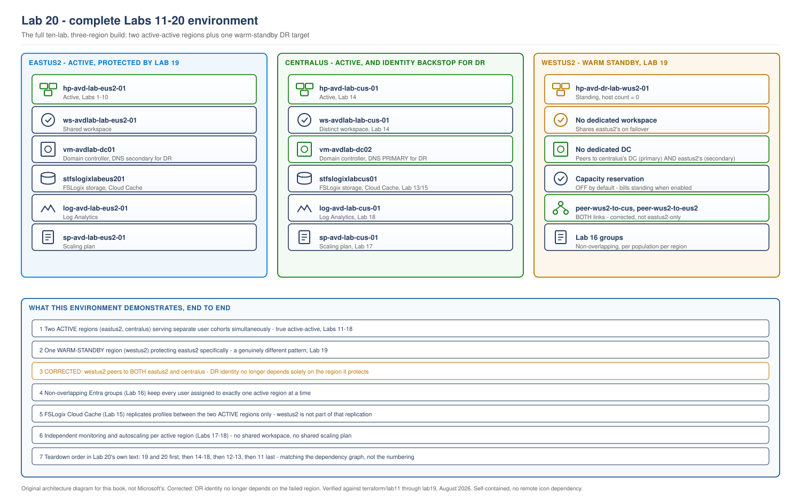

> **Part of:** [Azure Virtual Desktop - Architect to Hands-on Implementation](../README.md)
> **Technical baseline:** August 2026
> **Plan:** [Labs 11-20 plan](../appendices/labs-11-20-plan.md)

# LAB 20 - End-to-End Validation, Cost Control and Teardown

> **LAB ARCHITECTURE** - the environment you build across Labs 1-20. Not a Microsoft reference design.

## Objective

Validate the complete ten-lab, two-and-a-third-region environment as one system, produce a single cost view across every region and both patterns (active-active and DR), and provide the dependency-safe teardown sequence so the environment doesn't silently keep billing after you're done. This lab plays the same role for Labs 11-19 that Lab 10 plays for Labs 1-9.

## What this lab does not do

No new AVD infrastructure is created here. This lab queries and validates what Labs 11-19 already built, and adds one Cost Management view scoped across all three regions.

## Lab architecture

> **OUR ORIGINAL ARCHITECTURE DIAGRAM.** Created for this book. Not a Microsoft diagram.
> Editable source: [`lab20-full-environment-topology.drawio`](../diagrams/architecture/lab20-full-environment-topology.drawio)



## Prerequisites

Labs 11-19 completed in your authorized subscription, with their validation checklists and evidence retained. This is a prerequisite for the exercise, not a claim that those labs were run while this repository was written.

---

## Step 1 - Full end-to-end sign-in test, both active regions

```bash
# Confirm both host pools show healthy session hosts
az desktopvirtualization hostpool list-session-host -g rg-avd-service-lab-eus2-01 --host-pool-name hp-avd-lab-eus2-01 --query "[].properties.status" -o tsv
az desktopvirtualization hostpool list-session-host -g rg-avd-service-lab-cus-01 --host-pool-name hp-avd-lab-cus-01 --query "[].properties.status" -o tsv
```

**Expected output:** `Available` for every session host in both regions. Sign in with Windows App against a test user assigned per Lab 16's non-overlapping pattern, confirming a single desktop entry appears for that user's assigned region, not two.

## Step 2 - Full failover-and-failback cycle, re-run as final confirmation

Re-run Lab 19's failover and failback runbooks in full, not just reviewing the earlier result. This is deliberately a second execution, not a re-read of Lab 19's own recorded timing:

```bash
# Failover
pwsh ./failover-runbook.ps1
# Confirm DR sign-in success, then:
pwsh ./failback-runbook.ps1
```

**Expected result:** both complete within their expected windows (near-immediate infrastructure readiness given the DR network already exists; 15-60 minutes total including the Terraform apply for session hosts), and `westus2` returns cleanly to zero standing session hosts afterward.

**Why re-run this rather than trust an earlier result.** A capability that worked once is not proof that it still works after later configuration changes. Re-running it here supports your own claim that the ten-lab environment works together, rather than only showing that each lab worked at an earlier point.

## Step 3 - Cross-region cost validation

```bash
az costmanagement query \
  --type ActualCost \
  --timeframe MonthToDate \
  --scope "/subscriptions/<subscription-id>" \
  --dataset-filter '{"dimensions":{"name":"ResourceGroupName","operator":"In","values":["rg-avd-hosts-lab-eus2-01","rg-avd-hosts-lab-cus-01","rg-avd-dr-lab-wus2-01"]}}' \
  --dataset-grouping name="ResourceGroupName" type="Dimension"
```

**Expected output:** a cost breakdown by resource group, comparable against the [Labs 11-20 plan](../appendices/labs-11-20-plan.md)'s section 4 cost roll-up. This is the validation step that confirms the plan's cost estimates matched reality, not just that they sounded reasonable when written.

## Step 4 - Teardown, in dependency-safe order

**Destroy in this order.** Labs 19 and 20 depend only on Labs 3, 7, and 11-13, not on Labs 14-18, so they can come down first. Labs 14-18 depend on each other and on Labs 11-13. Labs 12-13 depend on Lab 11. Lab 11 depends on nothing this book built after Lab 3.

```bash
# 1. Labs with no downstream dependents within Labs 11-20
for lab in lab19-dr-failover lab18-regional-security-monitoring lab17-regional-autoscaling lab16-region-assignment; do
  echo "Destroying $lab"
  (cd "terraform/$lab" && terraform destroy -auto-approve)
done

# 2. Lab 15 has no Terraform of its own (host-level config only) - nothing to destroy here.
#    If you want to remove its FSLogix registry changes from Lab 8's original hosts,
#    that is a manual per-host step, not a terraform destroy.

# 3. Lab 14, once nothing above still references its host pool or application group IDs
(cd "terraform/lab14-active-active-hostpools" && terraform destroy -auto-approve)

# 4. Labs 12-13, once Lab 14 no longer references their outputs
(cd "terraform/lab13-regional-storage" && terraform destroy -auto-approve)
(cd "terraform/lab12-regional-identity" && terraform destroy -auto-approve)

# 5. Lab 11 last - every other lab in this set depends on its network
(cd "terraform/lab11-multiregion-network" && terraform destroy -auto-approve)
```

**Why this order, not simply the reverse of build order.** Build order (11 through 19) and safe-teardown order are not perfect mirrors, because Lab 19 deliberately does not depend on Lab 14 (by design, so the two patterns stay separable), while Labs 15-18 do depend on Lab 14. Destroying strictly in reverse numeric order would attempt to destroy Lab 14 before Lab 16 and Lab 17, which still hold role assignments and a scaling plan referencing Lab 14's host pool ID - Terraform would either fail cleanly on the dependency or, worse, leave an orphaned reference in the earlier lab's state. The order above respects the actual dependency graph, not just the numbering.

**If you built Labs 1-10 as well and want a complete teardown**, follow Lab 10's own teardown section afterward, since Labs 11-20 depend on Labs 3, 4, and 7 remaining in place until this point.

## Step 5 - Confirm the teardown is genuinely complete

```bash
az resource list --resource-group rg-avd-hosts-lab-cus-01 --output table
az resource list --resource-group rg-avd-dr-lab-wus2-01 --output table
az resource list --resource-group rg-avd-network-lab-cus-01 --output table
```

**Expected output:** empty, or "resource group not found" if the destroy also removed the resource groups themselves. Either result confirms no billing continues from this lab set.

---

## Validation Checklist

- [ ] Both active-active regions' host pools show healthy session hosts
- [ ] A test user's feed shows exactly one desktop entry, matching their Lab 16 region assignment
- [ ] Failover and failback re-run in full as a final confirmation, not assumed from Lab 19's earlier result
- [ ] Cost Management report reviewed against the Labs 11-20 plan's cost roll-up
- [ ] Teardown executed in the dependency-safe order above, not reverse-numeric order
- [ ] `az resource list` confirms zero remaining resources in every `centralus` and `westus2` resource group created by this lab set

## Common errors

| Error | Cause | Fix |
|---|---|---|
| `terraform destroy` fails on Lab 14 with a dangling reference error | Labs 16 or 17 destroyed out of order, after Lab 14 rather than before | Destroy in the order specified in Step 4, not reverse-numeric order |
| Cost Management query returns no data | Resource groups already destroyed before running Step 3 | Run Step 3 before Step 4's teardown, not after |
| `westus2` resource group still shows resources after `terraform destroy` | The capacity reservation group has its own deletion dependency on the reservation itself | Confirm `azurerm_capacity_reservation` destroyed before `azurerm_capacity_reservation_group` - Terraform's dependency graph should sequence this automatically within the lab19 module, but verify if the destroy reports an error |

## Cleanup versus keep: full Labs 11-20 teardown

Covered in Step 4 above. This is the full teardown for this lab set - there is no "keep everything, deallocate between sessions" option for Lab 20 itself, since this lab creates no standing infrastructure of its own beyond the Cost Management query, which has no resource to tear down.

## Portfolio evidence to capture

- The full validation checklist above, completed against your own environment
- Timed results from both the re-run failover and re-run failback exercises, compared against Lab 19's original timing
- The cross-region Cost Management report from Step 3, as evidence you can produce a real, current cost figure for a multi-region estate, not just estimate one
- A screenshot of the teardown's final `az resource list` calls returning empty, as evidence the environment doesn't silently keep billing

## Interview questions from this lab

**Q. Why isn't the teardown order for Labs 11-20 simply the reverse of the build order?**
Because build order and dependency order aren't the same thing once a lab set has a deliberately non-linear dependency graph, which this one does by design. Lab 19 was built after Lab 14 numerically, but it doesn't actually depend on Lab 14 - that separation was intentional, so active-active and active-passive stayed comparable as genuinely independent patterns. Labs 16 and 17, on the other hand, do depend on Lab 14's host pool and application group IDs. Reverse-numeric teardown would try to destroy Lab 14 while Lab 16's role assignments and Lab 17's scaling plan still reference it, which Terraform would either refuse or, worse, leave in an inconsistent state. Teardown order has to follow the actual dependency graph, which you get from tracing `terraform_remote_state` references across modules, not from assuming the numbering encodes it.

**Q. What's the actual value of re-running Lab 19's failover exercise here, in Lab 20, rather than trusting the result from when Lab 19 was originally built?**
A capability checked once is a weaker result than one confirmed after every later change. Labs 15 through 19 touch configuration that could affect failover behaviour: Cloud Cache settings, group assignments, scaling plans, and monitoring. Re-running the full cycle here is the evidence you need before stating that your ten-lab environment works as a system.

**Q. If you were presenting this environment's cost to a stakeholder who wasn't technical, how would you use the Labs 11-20 plan's cost table and this lab's Step 3 output together?**
The plan's table is the estimate made before anything was built, and Step 3's Cost Management query is the actual measured result - presenting both together, and specifically calling out where they matched and where they didn't, is a categorically more credible position than presenting either alone. A stakeholder who only sees the pre-build estimate has no way to know if it held up. A stakeholder who only sees a live cost number has no way to know if that number reflects the disciplined-use pattern this design assumes or a costlier configuration left running by accident. Showing both, and being honest about any variance between them, is what turns a cost figure into evidence rather than a claim.

---

## This is the end of Labs 11-20

This exercise covers ten labs, three regions, and two multi-region patterns. It becomes lab validated only after you complete the steps and retain the evidence listed here. See the [Labs 11-20 plan](../appendices/labs-11-20-plan.md) for the full scope.
