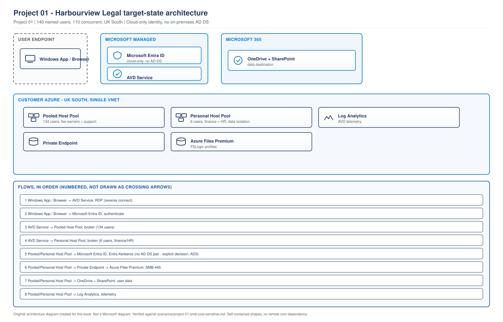

# Project 01 - Harbourview Legal: Cost-Sensitive SMB Deployment

> **Fictional architecture case study:** Harbourview Legal is not a customer delivery record. Requirements, measurements, costs, tests, and outcomes are worked examples or validation targets unless separate lab evidence is linked.

> **Book:** Azure Virtual Desktop - Architect to Hands-on Implementation
> **Part XI:** Architecture Case Studies
> **Standard:** [PROJECT-STANDARD.md](../PROJECT-STANDARD.md)
> **Technical baseline:** August 2026
> **Defining challenge:** Making the economics work at small scale, and knowing when the answer is no

---

## How to use this project

Read the requirements. Design it yourself before reading the decisions. Then compare, and pay attention to where we disagree, because that is where the learning is.

Every number in this project is either an assumption, a measurement or a decision, and each is labelled. Costs are indicative shapes rather than quotes, because prices change and vary by region. `[VERIFY BEFORE IMPLEMENTATION]` price any real design with the Azure pricing calculator for the target region on the day.

---

## 1. Business requirements

**Harbourview Legal.** A 140 person law firm with offices in Manchester and Leeds, plus 30 staff who work from home two or three days a week.

The partners have asked for three things.

**Get off the laptop refresh cycle.** They are facing a £180,000 hardware refresh over eighteen months. They want to know whether that money is better spent on a virtual desktop platform.

**Protect client data.** They handle confidential case material. A stolen laptop is a reportable incident under their professional obligations and their insurer has raised it twice.

**Stop paying for IT they cannot use.** Their previous IT partner sold them a solution they never fully adopted. The managing partner said, in the first meeting, "I do not want to buy something clever that we cannot run."

**Commercial constraint.** Total run cost must not exceed £6,500 per month. That figure came from the finance partner and it is not negotiable without a board paper.

**Team constraint.** One internal IT manager and a part-time contractor two days a week. No VDI experience.

---

## 2. Technical requirements

| ID | Requirement | How it will be tested |
|---|---|---|
| TR1 | 140 named users, 110 concurrent at peak | Concurrency measured during pilot |
| TR2 | Case management system, Office, Adobe, two dictation tools | All five launch and function for a real user |
| TR3 | No client data stored on endpoint devices | Attempt to copy a file to a local drive and confirm it is blocked |
| TR4 | Sign-in under 45 seconds at peak | Measured across the busiest 15 minutes for a week |
| TR5 | Multifactor authentication for all access | Conditional Access policy enforced, verified with a test account |
| TR6 | Recover a user's profile within one working day | Timed restore test before go-live |
| TR7 | Run cost under £6,500 per month | Monthly Azure invoice plus licence cost |
| TR8 | Operable by one IT manager | Runbooks completed by the IT manager unaided |

TR8 is a real requirement and it constrains the architecture more than any other item on this list.

---

## 3. Assumptions

| Assumption | Risk if wrong | How to test it early |
|---|---|---|
| 110 concurrent users at peak | Undersized host pool | Measure current laptop sign-ins for two weeks |
| Average profile 12 GB | Storage undersized | Measure existing profiles on ten laptops |
| Peak sign-in window 08:45 to 09:15, roughly 70 users | Storage IOPS undersized | Same two week measurement |
| Case management system supported on Windows 11 multi-session | Whole design changes | Vendor statement in writing, before design sign-off |
| Dictation tools work over RDP audio | Persona may need a different design | Test with two fee earners in week one |
| Microsoft 365 Business Premium already held by all staff | AVD access rights not covered | Licence audit |

**The dictation assumption is the dangerous one.** Legal dictation tools are latency sensitive and some use hardware devices with driver requirements. If it fails, that persona needs local devices or a different delivery model, and it changes the business case. Test it in week one, not week six.

---

## 4. User personas

| Persona | Count | Concurrent | Working pattern | Applications |
|---|---|---|---|---|
| Fee earners | 78 | 62 | 08:45 start, long days, heavy document work | Case management, Office, Adobe, dictation |
| Support staff | 44 | 36 | Fixed hours, high document throughput | Case management, Office, Adobe |
| Partners | 12 | 8 | Irregular, mobile, often remote | All of the above plus finance reporting |
| Finance and HR | 6 | 4 | Fixed hours, sensitive data | Finance system, Office |

**Concurrency is 110, not 140.** That distinction is worth £1,000 a month here and it is the first number people get wrong.

---

## 5. Architecture decisions

### AD1: AVD or Windows 365

**Requirement.** Give 140 users a Windows desktop within a £6,500 monthly ceiling, operable by one person.

**Option A, Windows 365.** A Cloud PC per user, fixed monthly price, almost no operational load.

**Option B, AVD pooled.** Shared multi-session hosts with autoscaling.

| Dimension | Windows 365 | AVD pooled |
|---|---|---|
| Cost shape | Fixed per user, 140 users billed | Consumption, scales with concurrency and hours |
| Operational load | Very low | Image, FSLogix, monitoring, scaling |
| Fit for TR8 | Excellent | The main risk |
| Cost at this size | Roughly £5,500 to £7,000 depending on SKU | Roughly £4,000 to £4,800 with aggressive scaling |

**Decision. AVD pooled.**

**Reason.** Two things decide it. The working pattern is concentrated office hours, so autoscaling genuinely applies and hosts can be switched off from 19:00 to 07:00 and at weekends. And the persona mix means multi-session works: fee earners and support staff are document workers, not power users. That gives roughly a 25 to 30 percent saving against Windows 365 at this size.

**But note what this decision costs.** It puts TR8 at risk, and TR8 is a hard requirement. The mitigation is the whole design: fewest possible moving parts, service-managed lifecycle, and runbooks the IT manager writes themselves during handover.

**When this decision would flip.** If the concurrency ratio were higher, if the working pattern were spread across the day, or if the IT manager left. We wrote that into the design document as a review trigger, because it is a decision that can become wrong later without anything else changing.

### AD2: Session host configuration or standard management

**Decision.** Session host configuration, as covered in [Chapter 16](../chapters/ch16-automated-host-pools-session-host-configuration.md).

**Reason.** TR8. Rolling image updates without building a pipeline is exactly what a one-person IT team needs. It removes registration token management entirely, and it makes hosts genuinely disposable so the answer to a broken host is always the same.

**Trade-off accepted.** No per-host control and no bespoke deployment steps. At this size we do not want either.

### AD3: Entra join or hybrid join

**Decision.** Entra join. No domain controller anywhere.

**Reason.** They have no on-premises Active Directory that anything depends on. Their file server is being retired as part of this project. Building a domain controller pair to authenticate a file share would add two VMs, patching, backup and DR for no requirement. Entra Kerberos handles FSLogix on Azure Files, as covered in [Chapter 7](../chapters/ch07-identity-architecture-foundations.md#3-entra-kerberos-changed-the-design).

**Trade-off accepted.** Azure NetApp Files is ruled out, because it requires Kerberos backed by AD DS or Entra Domain Services ([Chapter 20](../chapters/ch20-profile-storage-architecture.md#1-start-with-identity-not-performance)). At this size we do not need it.

**Verification required.** `[VERIFY BEFORE IMPLEMENTATION]` Confirm current support for cloud-only identities with Entra Kerberos for Azure Files in the target cloud before committing. If it changes, the fallback is a DC pair and the cost model needs revisiting.

### AD4: One host pool or several

**Decision.** One pooled host pool for all 140 users. One personal host pool of two hosts for the finance and HR persona.

**Reason.** Fee earners, support staff and partners have the same sizing profile and the same application set. Splitting them would create three capacity floors for no benefit ([Chapter 15](../chapters/ch15-host-pool-design-decisions.md#4-how-many-host-pools)). Finance and HR are separated for data isolation, which is a stated requirement rather than a preference, and six users on a personal pool is cheap.

**The decision that goes against the obvious answer.** Textbook guidance would give partners their own pool because they are the most senior users. We did not, because eight concurrent partners do not justify a capacity floor, and the fee earner host size suits them. That was an uncomfortable conversation and the right call.

---

## 6. Architecture diagram

> **EXAMPLE CUSTOMER ARCHITECTURE.** Harbourview Legal. Our design, not a Microsoft reference architecture.

> **OUR ORIGINAL ARCHITECTURE DIAGRAM.** Created for this book. Not a Microsoft diagram.
> Editable source: [`project01-harbourview-architecture.drawio`](../diagrams/architecture/project01-harbourview-architecture.drawio)



**What this diagram shows.** The whole platform. Two host pools in one virtual network in one region, profile storage reached through a private endpoint, identity and AVD service both Microsoft managed, and Microsoft 365 as the data destination.

**What each component does.** The pooled host pool serves 134 users. The personal pool serves six finance and HR users. Azure Files holds FSLogix profiles, reached privately. Log Analytics collects AVD telemetry.

**Normal flow.** A user authenticates to Entra ID, connects through the AVD service, is brokered to a session host, and their profile mounts over SMB from Azure Files using Entra Kerberos.

**Architect's view.** Deliberately small. No hub, no firewall, no domain controller, no second region. Every component removed is a component the IT manager does not have to run, and TR8 made that the governing principle.

**Failure points.** Azure Files is the single point of failure for profiles. Region loss takes the platform down, which is accepted in section 21. Entra ID availability is a hard dependency and not something we control.

---

## 7. Identity architecture

**Join model.** Entra join for both host pools.

**Groups.** Four Entra security groups, one per persona, dynamic where possible so joiners and leavers flow automatically. Assignment is on the application group, never on individual users ([Chapter 3](../chapters/ch03-avd-object-model.md)).

**RBAC.** The IT manager holds Desktop Virtualization Contributor and Virtual Machine Contributor scoped to the session host resource group. The contractor holds Desktop Virtualization User Session Operator plus Reader, which covers everything in their runbook and nothing else ([Chapter 10](../chapters/ch10-rbac-delegation-administrative-model.md#3-a-delegation-model-that-works)).

**The role people forget.** Entra joined hosts need users to hold Virtual Machine User Login on the session host resource group in addition to their application group assignment ([Chapter 5](../chapters/ch05-operating-systems-multisession-licensing.md#5-entra-joined-session-hosts-change-the-prerequisites)). It is in the Terraform so it cannot be missed.

**Break glass.** Two cloud-only accounts excluded from all Conditional Access, credentials in the firm's safe, sign-in alerting enabled.

---

## 8. Authentication, MFA and Conditional Access

Two policies, matched except for sign-in frequency, following [Chapter 9](../chapters/ch09-conditional-access-mfa-zero-trust.md).

| Policy | Target app | Grant | Session |
|---|---|---|---|
| CA-AVD-Service | Azure Virtual Desktop | Require MFA | Periodic reauthentication, 12 hours |
| CA-AVD-Host | Windows Cloud Login | Require MFA | Sign-in frequency aligned to the service policy |

**Not used.** Every time sign-in frequency on the AVD app. It causes constant prompts on feed refresh and diagnostics upload, and it is only supported on Windows Cloud Login.

**Single sign-on enabled**, so users authenticate once. All four configuration steps from [Chapter 8](../chapters/ch08-authentication-flows-in-detail.md#2-single-sign-on-with-entra-authentication), with the Kerberos server object not required because there is no AD DS.

**Legacy per-user MFA audited and disabled** before go-live. On this tenant three users had it enabled from an old project.

---

## 9. Network architecture

Deliberately minimal.

| Item | Value | Reason |
|---|---|---|
| Region | UK South | Client data residency expectation, and both offices are in the north of England |
| Address space | 10.20.0.0/16 from the firm's IPAM | No overlap with either office network |
| `snet-hosts` | 10.20.1.0/24, 251 usable | See sizing below |
| `snet-storage` | 10.20.2.0/26 | Private endpoint only |
| NSGs | Per subnet, outbound service tags, explicit inbound deny for 3389 | [Chapter 11](../chapters/ch11-network-fundamentals-required-connectivity.md) |
| Firewall | None | See trade-offs |
| Hub | None | Single workload, nothing to share |

**Subnet sizing.** Peak 14 hosts, doubled to 28 for rolling updates, plus five reserved. A /24 gives 251 usable, which is generous and costs nothing ([Chapter 12](../chapters/ch12-enterprise-topologies-ip-planning.md#3-address-space-planning)).

**Egress.** NSG rules with service tags, plus outbound UDP 3478 for RDP Shortpath. No Azure Firewall, because at roughly £700 a month it would consume eleven percent of the entire budget for a single workload with no other tenant traffic to control. That is documented as an accepted risk in section 29, not as an oversight.

---

## 10. DNS and connectivity

**Session host DNS.** Azure-provided DNS. There is no domain controller and no on-premises resolver to reach.

**Private DNS zone** `privatelink.file.core.windows.net`, linked to the virtual network, so the storage account resolves to the private endpoint rather than the public one.

**Connectivity to offices.** None. Users connect over the internet to the AVD service, which is the whole point of reverse connect. The office internet circuits were reviewed for bandwidth and both were adequate.

**Required endpoints.** Session hosts need outbound access to the AVD required FQDN list ([Chapter 11](../chapters/ch11-network-fundamentals-required-connectivity.md#1-required-and-optional-are-different-things)), plus Microsoft 365 endpoints for OneDrive and SharePoint, plus KMS on 1688.

**Validation.** Run the AVD Agent URL Tool from a session host after deployment. Not a firewall rule review.

---

## 11. Host pool design

| Pool | Type | Users | Hosts at peak | Algorithm | Max session limit |
|---|---|---|---|---|---|
| `hp-hvl-general-prd-uks-01` | Pooled | 134 | 14 | Breadth-first ramp-up, depth-first later | 8 |
| `hp-hvl-finance-prd-uks-01` | Personal | 6 | 6 | Not applicable | Not applicable |

**Preferred application group type.** Desktop on both pools, set at creation.

**Load balancing.** Breadth-first during the 08:45 ramp so the sign-in wave does not overwhelm one host, depth-first afterwards so hosts consolidate and can be shut down. Managed by the scaling plan ([Chapter 15](../chapters/ch15-host-pool-design-decisions.md#3-breadth-first-and-depth-first)).

---

## 12. Session host sizing methodology

| Step | Value | Type |
|---|---|---|
| Persona workload type | Light to medium, document work | Assessment |
| Microsoft floor for that workload | Applied as a minimum, not the answer | Reference |
| Chosen VM size | Standard D8as v5, 8 vCPU, 32 GB | Decision |
| Assumed users per host | 10 | Assumption |
| Pilot result | 8 sustained, memory bound at 10 with Adobe and browser tabs | Measurement |
| Session limit set | 8 | Decision |
| Concurrent users at peak | 110 | Assumption to be validated |
| Hosts required at peak | 110 ÷ 8 = 14 | Calculation |

**The pilot changed the answer.** Ten looked reasonable and eight was correct. That is two extra hosts, roughly £280 a month, and finding it during pilot rather than at go-live is the difference between a planned cost and an escalation.

**Memory bound, not CPU bound.** Fee earners run Adobe alongside a case management client and many browser tabs. CPU sat comfortably at ten users. Memory did not. This is the pattern from [Chapter 17](../chapters/ch17-session-host-sizing-compute-selection.md#2-a-sizing-method-you-can-defend), and it is why sizing on vCPU alone produces a host pool that feels slow for reasons the metrics do not obviously show.

**Why 8 vCPU and not 16.** Two 8 vCPU hosts cost the same as one 16 vCPU host and give twice the failure domains, plus finer-grained autoscaling. Multi-session guidance also puts a practical ceiling on host size.

---

## 13. Image strategy

**Method.** Custom image templates, as covered in [Chapter 23](../chapters/ch23-golden-image-engineering.md#4-three-ways-to-build). Azure Image Builder handles sysprep, which removes the manual build step most likely to go wrong in a one-person IT team.

**Contents.** Windows 11 Enterprise multi-session, Office, Adobe, the case management client, dictation software, FSLogix agent, Teams and the WebRTC redirector, VDI optimisation.

**Not in the image.** FSLogix configuration, security baseline, anything that changes more often than the image ([Chapter 23](../chapters/ch23-golden-image-engineering.md#6-what-goes-in-the-image-and-what-does-not)).

**Cadence.** Monthly. Gallery with versioning, two versions retained, no replication because there is one region.

**Owner.** The IT manager, with the contractor as backup. Named in the runbook, because an unowned image goes stale ([Chapter 23](../chapters/ch23-golden-image-engineering.md#9-production-scenarios), Scenario 3).

---

## 14. FSLogix and storage

**Platform.** Azure Files. Azure NetApp Files is ruled out by AD3, and its 2 TiB minimum capacity pool would be poor value for 1.7 TB of profiles.

**Tier.** Premium SSD, provisioned. Sized from the sign-in burst.

| Step | Value | Type |
|---|---|---|
| Users signing in during the busiest 15 minutes | 70 | Assumption from laptop sign-in data |
| IOPS for the burst, 50 per user | 3,500 | Calculation |
| Users already working, 40 at 10 IOPS | 400 | Calculation |
| Peak IOPS requirement | 3,900 | Calculation |
| Average profile size | 12 GB | Measurement |
| Capacity for 140 users plus headroom | 2.5 TB | Calculation |

**Redundancy.** ZRS. Premium SSD shares cannot use geo-redundancy ([Chapter 20](../chapters/ch20-profile-storage-architecture.md#4-redundancy-the-decision-most-designs-skip)), and ZRS means a zone failure does not take every profile down. LRS would have been cheaper and was rejected, because a zone failure with LRS is a total outage of the desktop service for a firm that bills by the hour.

**Identity.** Entra Kerberos, cloud-only identities.

**Permissions.** Both layers. Share-level RBAC for the AVD user groups, plus NTFS permissions so each user has rights to their own folder and no other. Isolation tested with two accounts before go-live.

**FSLogix configuration.** In Intune policy, not the image. Profile container only, no ODFC. `SizeInMBs` 30000. `DeleteLocalProfileWhenVHDShouldApply` enabled, because silent data loss is the worst failure mode for a law firm ([Chapter 21](../chapters/ch21-fslogix-production-implementation.md#2-the-settings-that-matter)).

**Exclusions from day one.** Browser and Teams caches. Adding them later does not shrink existing containers.

**Antivirus exclusions** applied in Defender and verified on a host, not assumed ([Chapter 21](../chapters/ch21-fslogix-production-implementation.md#3-antivirus-and-security-tool-exclusions)).

---

## 15. Application delivery

| Application | Route | Reason |
|---|---|---|
| Office | Image | Everyone, stable |
| Adobe | Image | Everyone, stable |
| Case management client | Image | Everyone, quarterly updates align with image cadence |
| Dictation software | Image | Everyone in the fee earner persona, driver dependencies |
| Finance system | Image on the personal pool only | Six users, isolated pool |

**No App Attach.** Deliberately. Packaging effort and a new operational surface for an estate where every user needs the same five applications is not justified ([Chapter 25](../chapters/ch25-application-delivery-remoteapp-design.md#2-choosing-a-route-per-application)).

**Publishing.** Full desktop only. No RemoteApp. Users work in the environment all day.

**Licensing check.** The case management vendor confirmed in writing that per-user licensing applies and that Windows 11 multi-session is supported. That statement was obtained before design sign-off, and it is the kind of thing that can force a persona onto a personal pool if the answer is different.

---

## 16. Security controls

| Layer | Control | Evidence |
|---|---|---|
| Identity | MFA through Conditional Access on both apps | Policy export plus a tested block |
| Identity | Break glass accounts excluded and alerted | Alert rule and test |
| Device | Compliance policy targeting device groups | Compliance state per host |
| Network | No public IPs, no inbound rules, explicit 3389 deny | NSG export |
| Network | Private endpoint for storage, public access disabled | Storage account configuration |
| Session | Drive redirection blocked, clipboard restricted | RDP properties, tested by attempting a copy |
| Data | Client data in OneDrive and SharePoint, not the profile | Known Folder Move configured |
| Data | Storage encryption at rest, TLS 1.2 minimum | Storage account configuration |
| Audit | Sign-in logs and AVD diagnostics retained 12 months | Diagnostic settings and workspace retention |

**TR3 is the requirement that matters most commercially.** Drive redirection is blocked at the host pool, so a user cannot copy a case file to a local drive. Tested by attempting exactly that, from a personal laptop, before go-live. The test evidence goes to the insurer.

**OneDrive Known Folder Move is a security control here, not just a convenience.** It moves documents out of the profile container, which means a corrupted profile is an inconvenience rather than data loss ([Chapter 22](../chapters/ch22-profile-operations-failure-recovery.md#4-corruption)).

---

## 17. Monitoring and KQL

**Collected.** AVD diagnostics into Log Analytics, performance counters from session hosts, storage metrics, Entra sign-in logs.

**Workspace retention.** 90 days interactive, 12 months archive for audit. Log ingestion is a real cost line at this budget, so collection is deliberate rather than everything.

**Alerts.**

| Alert | Threshold | Why |
|---|---|---|
| No host accepting new sessions | Any occurrence | The Monday morning failure from [Chapter 2](../chapters/ch02-control-plane-management-plane-data-plane.md) |
| Session host unavailable | More than one host, 15 minutes | Capacity risk |
| Storage latency | Sustained above baseline during 08:45 to 09:15 | Profile storage is the single point of failure |
| Logon duration | 95th percentile above 45 seconds | TR4 |
| Host CPU | Sustained above 80 percent for 15 minutes | Density check |
| Image version age | Older than 45 days | Prevents the stale image problem |

**Logon duration query**, used weekly by the IT manager:

```kusto
WVDConnections
| where TimeGenerated > ago(7d)
| where State == "Connected"
| extend Hour = datetime_part("hour", TimeGenerated)
| summarize Sessions = count() by bin(TimeGenerated, 5m)
| order by Sessions desc
| take 20
```

`[VERIFY BEFORE IMPLEMENTATION]` Confirm diagnostic table names in the workspace. Table naming has changed over time and depends on when diagnostics were configured.

**The reporting that matters to the partners** is one number each month: average sign-in time at 09:00. It is the thing they notice, and reporting it before they ask changes the relationship.

---

## 18. Scaling

**Scaling plan** on the pooled host pool, with dynamic autoscaling.

| Phase | Time | Behaviour |
|---|---|---|
| Ramp-up | 07:30 to 09:00 | Breadth-first, capacity for 110 users available by 08:40 |
| Peak | 09:00 to 17:00 | Depth-first, full capacity |
| Ramp-down | 17:00 to 19:30 | Depth-first, consolidate and deallocate, forced logoff at 20:00 with a warning |
| Off-peak | 19:30 to 07:30 | Two hosts available for evening working |

**Weekends.** Two hosts. Partners work weekends and the cost of two hosts is far lower than the cost of a partner unable to work on a Sunday.

**The saving.** Running 14 hosts continuously against an average of roughly 6 host-hours equivalent is the difference between about £2,800 and about £1,400 a month on compute. That saving is the business case.

**Ephemeral OS disks not used.** This design uses standard host-pool management. AVD supports ephemeral OS disks only for pooled host pools with session host configuration, so this design uses managed OS disks. See [Chapter 17](../chapters/ch17-session-host-sizing-compute-selection.md#4-ephemeral-os-disks).

---

## 19. Cost considerations

`[VERIFY BEFORE IMPLEMENTATION]` Indicative monthly shape, UK South, priced at design time. Re-price before commitment.

| Line | Basis | Monthly |
|---|---|---|
| Session host compute, pooled | 14 hosts, D8as v5, autoscaled to roughly 40 percent of continuous | £1,450 |
| Session host compute, personal | 6 hosts, D4as v5, deallocated overnight | £420 |
| Managed disks | 20 hosts, 128 GB Standard SSD | £180 |
| Azure Files Premium, provisioned | 2.5 TB, ZRS | £480 |
| Log Analytics ingestion and retention | Estimated 8 GB per month plus archive | £120 |
| Networking, egress and private endpoint | | £90 |
| Backup for profile storage | Snapshots | £60 |
| **Azure subtotal** | | **£2,800** |
| Microsoft 365 Business Premium | Already held, no incremental cost for AVD access | £0 |
| Managed support retainer | Contractor two days a week | £2,600 |
| **Total** | | **£5,400** |

**Against a £6,500 ceiling, with £1,100 of headroom.** That headroom is deliberate. A design that lands exactly on the ceiling fails the first time anything is added.

**The biggest lever is autoscaling.** Turn it off and compute roughly doubles, which alone would breach the ceiling. The second lever is the session limit: if the pilot had accepted ten users per host, we would need eleven hosts rather than fourteen and would save around £300, at the cost of a slower desktop for fee earners. We chose experience over £300, and documented that we did.

**Against the laptop refresh.** £180,000 over eighteen months is £10,000 a month equivalent. AVD at £5,400 including support is a clear commercial case, and the partners can also stop replacing laptops with cheaper endpoints. That comparison is what got the project approved.

---

## 20. High availability

**Within the region.** Session hosts spread across three availability zones. Azure Files on ZRS.

**What survives a zone failure.** Roughly two thirds of capacity remains, which at 110 concurrent users means some queuing at peak but a working service. Profiles are unaffected because storage is zone redundant.

**What does not survive.** A region failure. See section 21.

**Sized for zone loss.** Not fully. Fourteen hosts across three zones leaves nine after a zone failure, which is 72 users at a session limit of 8. At peak that is a shortfall. We documented it rather than paying for full zone-loss capacity, and the partners accepted degraded service during a zone failure. That is a decision they made with the number in front of them.

---

## 21. Disaster recovery

**RTO. Eight working hours. RPO. 24 hours for profiles.**

Both derived from the business, not assumed. The finance partner's position was that a day of degraded working is survivable and a week is not.

**What is recovered.** Profile data, from snapshots.

**What is rebuilt.** Everything else. Host pools, session hosts, network and configuration are all in Terraform and can be redeployed into a second region in under two hours.

**Why not a warm second region.** It would add roughly £900 a month for a risk the firm has accepted. Instead the recovery position is documented, the Terraform is tested in a second region twice a year, and the restore is timed.

**The honest limitation.** Premium Azure Files cannot use geo-redundancy. So the DR position depends on snapshots being copied out of region, and that copy job is the single most important thing in this DR plan. `[VERIFY BEFORE IMPLEMENTATION]` confirm the current snapshot and backup capabilities for the chosen storage tier before relying on them.

**Tested.** Twice a year, with the time recorded. The measured figure goes in the service description so nobody guesses during an incident.

---

## 22. Terraform implementation

Structure follows the book's conventions from [Lab 2](../labs/lab-02-terraform-foundation-and-governance.md).

```
terraform/project01-harbourview/
├── versions.tf
├── backend.tf
├── variables.tf
├── locals.tf
├── network.tf
├── storage.tf
├── avd-hostpools.tf
├── avd-appgroups.tf
├── rbac.tf
├── monitoring.tf
└── outputs.tf
```

Core AVD objects:

```hcl
resource "azurerm_virtual_desktop_host_pool" "general" {
  name                     = "hp-hvl-general-prd-uks-01"
  location                 = var.location
  resource_group_name      = azurerm_resource_group.avd.name
  type                     = "Pooled"
  load_balancer_type       = "BreadthFirst"
  maximum_sessions_allowed = 8
  preferred_app_group_type = "Desktop"
  start_vm_on_connect      = true
  tags                     = local.common_tags
}

resource "azurerm_virtual_desktop_application_group" "general_desktop" {
  name                = "ag-hvl-desktop-prd-uks-01"
  location            = var.location
  resource_group_name = azurerm_resource_group.avd.name
  type                = "Desktop"
  host_pool_id        = azurerm_virtual_desktop_host_pool.general.id
  tags                = local.common_tags
}

resource "azurerm_virtual_desktop_workspace_application_group_association" "general" {
  workspace_id         = azurerm_virtual_desktop_workspace.hvl.id
  application_group_id = azurerm_virtual_desktop_application_group.general_desktop.id
}
```

The role assignment that is easy to forget, made impossible to forget:

```hcl
resource "azurerm_role_assignment" "avd_users_desktop" {
  scope                = azurerm_virtual_desktop_application_group.general_desktop.id
  role_definition_name = "Desktop Virtualization User"
  principal_id         = var.avd_users_group_object_id
}

# Required for Entra joined session hosts. Without this, users authenticate
# successfully and are rejected at Windows sign-in.
resource "azurerm_role_assignment" "avd_users_vm_login" {
  scope                = azurerm_resource_group.hosts.id
  role_definition_name = "Virtual Machine User Login"
  principal_id         = var.avd_users_group_object_id
}
```

**Prerequisites.** Remote state configured, providers pinned to `~> 5.0`.
**Expected result.** Host pool, application group and workspace association created, with both role assignments present.
**Common failure.** Omitting `preferred_app_group_type` at creation. It cannot be corrected without affecting users.

`[VERIFY BEFORE IMPLEMENTATION]` Confirm AzureRM provider support for session host configuration resources before designing the session host deployment in Terraform. Where coverage is incomplete, the session host configuration is created through the service and that split is stated in the design document rather than left implicit ([Chapter 16](../chapters/ch16-automated-host-pools-session-host-configuration.md#4-what-you-give-up)).

---

## 23. Step-by-step deployment

Each step has a validation gate. Do not proceed past a failed gate.

| Step | Action | Gate |
|---|---|---|
| 1 | Register providers, confirm quota for 20 D-series hosts in UK South | `az vm list-usage` shows headroom |
| 2 | Terraform: resource groups, network, NSGs | `terraform plan` clean after apply |
| 3 | Create storage account, enable Entra Kerberos, create share | Share reachable, identity source confirmed |
| 4 | Configure both permission layers, test isolation with two accounts | User A cannot read User B's folder |
| 5 | Build image with custom image template | Image version published, applications present |
| 6 | Terraform: host pools, application groups, workspace, RBAC | Objects created, both role assignments present |
| 7 | Create session host configuration, deploy 3 hosts | Hosts Available with a recent status timestamp |
| 8 | Configure FSLogix and antivirus exclusions in Intune | Verified on a host, not in policy |
| 9 | Pilot with 10 users across all personas for two weeks | Sign-in under 45 seconds, all applications work |
| 10 | Adjust session limit from measurement | Documented decision |
| 11 | Scale to 14 hosts, configure scaling plan | Capacity available by 08:40 |
| 12 | Conditional Access in report only, then enforced | Test account challenged and blocked appropriately |
| 13 | Configure monitoring, alerts and the dashboard | Alerts fire on a deliberately induced condition |
| 14 | Timed profile restore test | Under one working day, time recorded |
| 15 | Migrate users in waves by persona | Ticket volume flat per wave |
| 16 | Handover: IT manager completes each runbook unaided | TR8 evidenced |

**Step 16 is a real gate.** If the IT manager cannot complete the runbooks without help, the design has failed TR8 regardless of whether the technology works.

---

## 24. Validation and testing

| Requirement | Test | Evidence |
|---|---|---|
| TR1 | Measure concurrency during pilot and first month | Connection data |
| TR2 | Each application launched by a real user from that persona | Signed test record |
| TR3 | Attempt to copy a file to a local drive from a personal laptop | Screen recording for the insurer |
| TR4 | Logon duration 95th percentile during 08:45 to 09:15 for a week | KQL output |
| TR5 | Sign in without MFA and confirm the block | Sign-in log entry |
| TR6 | Restore a profile, timed, by the IT manager | Recorded time |
| TR7 | First two monthly invoices against the model | Cost analysis export |
| TR8 | IT manager completes all runbooks unaided | Handover sign-off |

**Test with real users from each persona, not with IT staff.** The dictation persona is the one that will find problems, and they will find them in week one if you let them.

---

## 25. Failure scenarios

Induce each one deliberately in the pilot, before go-live, and record what the user sees.

| Induced failure | Expected user experience | Expected alert |
|---|---|---|
| Stop one session host | Users reconnect elsewhere, brief interruption | Host unavailable |
| Put all hosts in drain mode | New connections fail, existing sessions continue | No host accepting sessions |
| Block outbound UDP 3478 | Sessions work, feel worse on home connections | None. This is the silent one |
| Break storage permissions for one user | That user gets a temporary profile | Temporary profile alert |
| Storage unreachable | Every user gets a temporary profile | Storage latency and temporary profile |
| Delete a session host mid-session | That user disconnects, reconnects to another host | Host count change |
| Expire an image version | New hosts still deploy from the pinned version | Image age alert |

**The UDP 3478 test is the important one**, because it produces no alert and no ticket. The point of inducing it is to show the IT manager what a silent degradation feels like, so they recognise it later.

---

## 26. Troubleshooting

Two scenarios most likely in this environment, in the [operations standard](../OPERATIONS-AND-TROUBLESHOOTING-STANDARD.md) format.

### Everyone has an empty desktop at 09:00

**Problem.** Users across the firm sign in to a desktop with none of their files or settings.

**Symptoms.** Sessions connect. Desktop loads. Everything personal missing. Hosts Available, CPU low.

**Business impact.** The whole firm unable to work at the start of the billing day. For a firm billing by the hour this is quantifiable: 110 users at an average charge-out rate is thousands of pounds per hour.

**Initial assumption.** Containers failing to mount. Hosts are healthy, so the fault is on the storage or identity path.

**Investigation.** Check for temporary profiles on a host. Read the FSLogix log at `C:\ProgramData\FSLogix\Logs\Profile`. Test port 445 to the storage account from a host. Check the storage account identity configuration.

**Evidence.** FSLogix log shows an authentication failure. Port 445 reachable, so this is not connectivity.

**Root cause.** Entra Kerberos configuration on the storage account changed, or a Windows update altered Kerberos encryption defaults ([Chapter 19](../chapters/ch19-why-profiles-cause-avd-failure.md#5-the-kerberos-encryption-change)).

**Resolution.** Restore the identity configuration. Do not delete containers. They are intact and they contain client work.

**Validation.** Test user signs in and the FSLogix log shows a successful attach. Confirm on a second host.

**Prevention.** Alert on temporary profile creation. Keep a dependency list including Kerberos encryption on the storage share, with the IT manager as owner.

**Architect lesson.** The most damaging failures come from dependencies outside AVD. Every host was healthy and the firm could not work.

**Interview lesson.** Saying you would not delete containers under pressure shows judgement, which is what the question is testing.

### Sign-in takes three minutes at 08:50

**Problem.** Sign-in is slow only in the morning window.

**Symptoms.** Fine by 09:30. No errors. Host CPU moderate.

**Business impact.** 110 users losing two to three minutes each at the start of the billing day, every day.

**Initial assumption.** Storage IOPS during the sign-in burst.

**Investigation.** Storage metrics for 08:45 to 09:15, specifically latency and throttling. Container attach time in the FSLogix logs. Session count per five minute bin from the KQL in section 17.

**Evidence.** Storage latency rises with the burst and returns to normal afterwards. Attach time tracks it.

**Root cause.** Provisioned IOPS below the burst requirement, most likely because concurrency grew past the 70 assumed in section 14.

**Resolution.** Increase provisioned capacity on the premium share. Re-measure. If profile size has grown, review exclusions.

**Validation.** Sign-in duration at 08:45 for a full week, and storage latency flat through the burst.

**Prevention.** Alert on storage latency. Re-run the burst calculation whenever headcount changes by more than ten percent.

**Architect lesson.** Profile storage is sized by burst, and the burst changes when the firm hires.

**Interview lesson.** The time-of-day pattern is the detail that makes the diagnosis credible.

---

## 27. Operational runbook

Four runbooks, written in the standard format, and completed by the IT manager during handover.

```
Runbook: Monthly image update
Trigger:        First Tuesday of each month
Owner:          IT manager
Prerequisites:  Contributor on the image resource group, change approved
Impact:         Hosts replaced in batches. Users on a replaced host are signed out
Rollback:       Deploy from the previous image version
Steps:
  1. Trigger the custom image template build
  2. Confirm the new version is published and excluded from latest
  3. Deploy two validation hosts from the new version
  4. Test all five applications with a real user from each persona
  5. Promote the version to latest
  6. Schedule the session host update outside working hours, batch size 3
  7. Confirm all hosts report the new version
Validation:     All hosts on the new version, applications tested, no ticket spike
Escalation:     If the initial host fails, stop and do not continue the batches
```

```
Runbook: Clear a locked profile container
Trigger:        A user repeatedly gets a temporary profile
Owner:          Contractor or IT manager
Prerequisites:  Storage File Data privileged access
Impact:         None if the handle is genuinely stale
Rollback:       Not applicable
Steps:
  1. Confirm from the FSLogix log that the failure is a lock
  2. List open handles on the user's container
  3. Confirm the handle belongs to a host or session that no longer exists
  4. Close the handle
  5. Have the user sign in again
Validation:     FSLogix log shows a successful attach and the user's data is present
Escalation:     If the handle belongs to a live session, stop. Do not close it
```

Plus: **add or remove a user**, and **respond to a session host failure**. Both short, both completed unaided during handover.

---

## 28. Change and patching strategy

| Item | Approach |
|---|---|
| Session host patching | Image replacement, monthly. Hosts are never patched in place |
| Out-of-cycle patch | Out-of-cycle image build. Measured: 4 hours build and validation, 3 hours rollout at batch size 3 |
| Application updates | New image version, aligned to the monthly cadence where possible |
| Configuration changes | Intune policy, effective within hours, no rebuild |
| Terraform changes | Plan reviewed, applied in a change window, state in remote backend |
| Emergency changes | IT manager may act, with a written record within 24 hours |

**Those two measured numbers matter.** Four hours plus three hours means a 72 hour security deadline is comfortably achievable, and the firm knows that before they need it.

---

## 29. Architecture trade-offs

Stated plainly, because these are the questions a reviewer will ask.

| Trade-off | What we gave up | Why | What would change it |
|---|---|---|---|
| No Azure Firewall | FQDN-level egress control and central logging | £700 a month against a £6,500 ceiling, for one workload | A second workload, or a regulatory requirement |
| No second region | Fast regional recovery | £900 a month for an accepted risk | A change in the firm's risk appetite, or a client contract requiring it |
| Not sized for full zone loss | Full capacity during a zone failure | Cost. Degraded service accepted with the number in front of the partners | Growth in concurrency, or a partner objection |
| One pooled host pool | Persona-specific tuning | Three capacity floors for no benefit at this size | Divergent application sets or a security separation requirement |
| No App Attach | Per-user application assignment and fast application updates | Packaging effort for five applications everyone uses | A persona-specific application, or an application updating monthly |
| Managed disks, not ephemeral | Some compute and disk saving | One variable too many at go-live for a learning team | The first annual review |
| Premium storage, so no geo-redundancy | Native cross-region storage protection | The sign-in burst needs premium IOPS | Lower concurrency, or a hard cross-region requirement |

**The one that will be challenged.** No Azure Firewall. The honest answer is that it is a real reduction in egress control, mitigated by NSG service tags, no inbound path, no public IPs and private storage access. It is documented as an accepted risk with a named owner and a review date, which is the difference between a decision and an oversight.

---

## 30. Interview questions from this project

### Q. Walk me through how you sized this environment.

**Strong answer**
"I started from concurrency rather than headcount, because 140 named users were 110 concurrent, and that difference is about a thousand pounds a month. Then workload type: document workers, light to medium. I picked an 8 vCPU, 32 GB host and assumed ten users per host, then piloted. The pilot said eight, memory bound rather than CPU bound, because fee earners run Adobe alongside a case management client and a lot of browser tabs. So fourteen hosts at peak rather than eleven. I chose 8 vCPU over 16 because two smaller hosts cost the same, give twice the failure domains and let autoscaling shed capacity in finer increments. Storage I sized from the sign-in burst, not capacity: seventy users signing in during the busiest fifteen minutes at roughly fifty IOPS each, plus the users already working, so about 3,900 IOPS, which put us on premium."

### Q. You had a hard budget ceiling. What did you sacrifice?

**Strong answer**
"Azure Firewall and a second region, and I would defend both. The firewall is about £700 a month, which is eleven percent of the ceiling, for one workload with no other tenant traffic to control. I mitigated with NSG service tags, no public IPs, no inbound path and private endpoint storage, and I documented it as an accepted risk with an owner and a review date. The second region is about £900 a month for a risk the partners accepted after I gave them the recovery position in hours. What I did not sacrifice was ZRS on the profile storage, because a zone failure with LRS is a total outage for a firm that bills by the hour, and that is a far worse outcome than the saving."

### Q. Why AVD rather than Windows 365 at this size?

**Strong answer**
"Two conditions made it work. The working pattern is concentrated office hours, so autoscaling genuinely applies and hosts are off overnight and mostly off at weekends. And the personas are document workers, so multi-session density works. That is roughly a 25 to 30 percent saving. But I flagged that this decision has a dependency: it puts real operational load on a one-person IT team, and if that person left, the calculation changes. So I wrote it into the design as a review trigger, and I built the whole design around minimising moving parts. Session host configuration so they never build hosts, Entra join so there is no domain controller, one host pool, no firewall. If any of those had to be reversed I would revisit the Windows 365 comparison honestly rather than defend the original decision."

### Q. How do you know the design met the requirement that data stays off endpoints?

**Strong answer**
"I tested it rather than configured it. Drive redirection is blocked at the host pool, and before go-live we attempted to copy a case file to a local drive from a personal laptop and recorded the failure. That evidence went to the insurer. The complementary control is OneDrive Known Folder Move, which moves documents out of the profile container into a system with versioning, so a corrupted profile becomes an inconvenience rather than data loss. The general principle is that a configured control and an enforced control are different things, and sign-off should require evidence of enforcement."

### Q. What would you do differently?

**Honest answer**
"Two things. I would test the dictation software in week one rather than week three, because it was the highest risk assumption in the whole design and a failure there would have changed the persona model. And I would have pushed harder on the £6,500 ceiling before accepting it, because the number came from a finance partner rather than from an analysis, and a slightly higher ceiling would have bought the firewall. I landed £1,100 under the ceiling, which suggests the constraint was tighter than it needed to be."

---

## Project Self-Review

**Pass 1, technical verification.** The identity, storage, RBAC, sizing, FSLogix, and OS disk positions link to the relevant chapters and Microsoft references. Costs are worked examples, not quotes. KQL table names must be checked against the target workspace.

**Pass 2, human readability review.** Written as an engagement rather than a description. Requirements before decisions, so the reader can design it themselves first. Every number labelled as assumption, measurement or decision. Sentences kept short. No long dash characters. Read back as an engineer handed this customer, and section 5 was reordered so the AVD against Windows 365 decision comes first, because every later decision depends on it.

**Pass 3, visual and topic accuracy review.** One diagram. Topic test applied: with the title removed it reads as a small single-region AVD deployment with private storage and no domain controller, which is exactly what this customer is. It is not a generic AVD diagram, because the absence of a hub, firewall and directory is visible. Every node is a component name. Carries the `EXAMPLE CUSTOMER ARCHITECTURE` label.

**Project standard check.**

| Requirement | Result |
|---|---|
| All thirty sections present | Yes |
| Real numbers throughout | Yes. User counts, host counts, IOPS, costs, timings |
| Competing requirements named and resolved | Cost against control, cost against resilience, experience against £300 |
| Constraints that cannot be designed away | £6,500 ceiling, one-person IT team |
| At least one decision against the obvious answer | Partners not given their own host pool. Also managed disks over ephemeral |
| Nothing artificially simple | Trade-offs stated, including the ones a reviewer will attack |
| Terraform consistent with book conventions | Yes, Lab 2 structure and naming |
| References concept chapters rather than repeating | Yes throughout |
| Customer name unique, Northwind reserved for the capstone | Yes |
