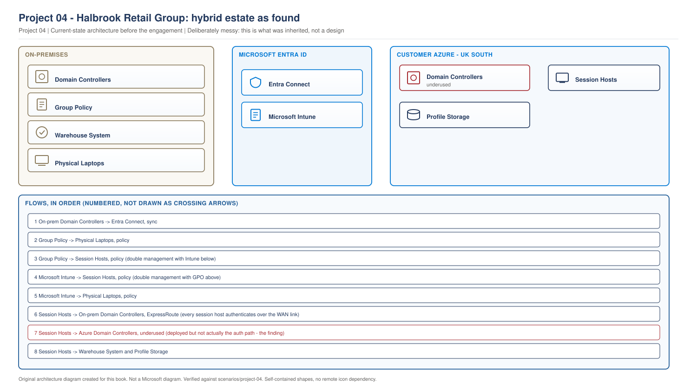
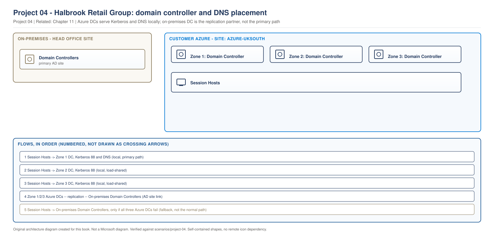
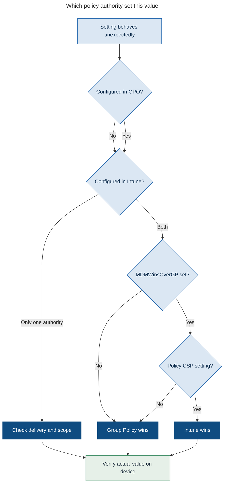
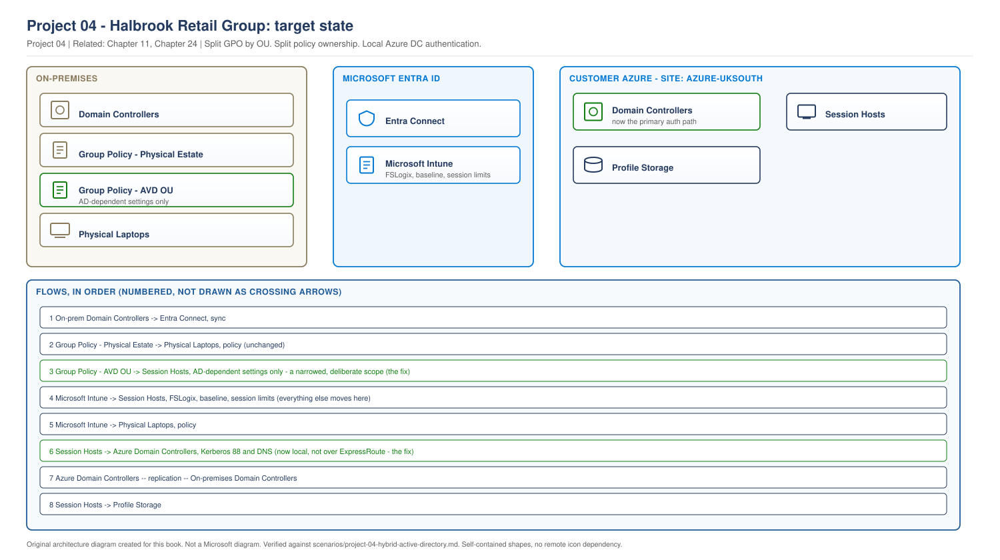

# Project 04 - Halbrook Retail Group: Hybrid AD, 18 Years of Group Policy, and an AVD Estate in the Middle

> **Fictional architecture case study:** Halbrook Retail Group is not a customer delivery record. Requirements, measurements, costs, tests, and outcomes are worked examples or validation targets unless separate lab evidence is linked.

> **Book:** Azure Virtual Desktop - Architect to Hands-on Implementation
> **Part XI:** Architecture Case Studies
> **Standard:** [PROJECT-STANDARD.md](../PROJECT-STANDARD.md)
> **Technical baseline:** August 2026
> **Concepts introduced here:** AD Sites and Services for Azure subnets, DC placement for AVD at scale, GPO and Intune coexistence, policy precedence and MDMWinsOverGP, determining which policy actually applied, staged policy migration

---

## Engagement brief

**What this represents.** An enterprise that has run Active Directory since 2008, has 400-plus Group Policy Objects nobody fully understands, and has been told by its own cloud team that AVD should be managed with Intune. Both statements are true and they are pulling the estate in two directions.

**The business problem.** Halbrook's AVD estate is inconsistent. The same setting behaves differently on different session hosts. Two teams change policy and neither knows what the other did. Logon times vary from 20 seconds to over two minutes with no pattern anyone has found. The IT director's actual question was "why is our AVD unreliable when our laptops are fine".

**Constraints that cannot be designed away.** Active Directory is not going away. The warehouse management system, the EPOS back office and two finance applications all authenticate against it. Group Policy manages 3,400 physical devices as well as the AVD estate, so GPOs cannot simply be unlinked. There is no appetite and no budget for an identity modernisation programme this year.

**Previously learned concepts applied.** Join models and DC placement principles ([Chapter 7](../chapters/ch07-identity-architecture-foundations.md)), authentication stages ([Chapter 8](../chapters/ch08-authentication-flows-in-detail.md)), Intune management of multi-session hosts ([Chapter 24](../chapters/ch24-intune-and-avd-endpoint-management.md)), FSLogix configuration ownership ([Chapter 21](../chapters/ch21-fslogix-production-implementation.md)), monitoring ([Project 02](project-02-enterprise-850-users.md)).

**New concepts introduced here.** AD Sites and Services for Azure virtual network subnets and why AVD breaks without it. Domain controller placement as an architecture decision with rejected alternatives. GPO and Intune coexistence, real precedence behaviour, MDMWinsOverGP and its caveats. How an engineer determines which policy actually applied. A staged migration that does not require a big bang.

**Architectural decisions to make.** Where domain controllers live. Which policy authority owns which setting. What migrates, what stays on GPO, and in what order.

**What could realistically go wrong.** A setting configured in both systems producing the wrong result and reporting success in both. Session hosts authenticating to the wrong domain controller. A migration that removes a GPO before its Intune replacement is proven.

**Validation and handover.** Every migrated setting proven on the device rather than in a console, and two teams who agree in writing who owns what.

---

## 1. The environment as found

**Halbrook Retail Group.** 340 stores, three distribution centres, a head office in Leeds. 3,400 staff, of whom 900 use AVD: buying, merchandising, finance and the central support functions.

### Active Directory

| Item | Detail | Type |
|---|---|---|
| Forest | Single forest, single domain, established 2008 | Measurement |
| Functional level | Windows Server 2016 | Measurement |
| Domain controllers | 6 on-premises, 2 in Azure UK South | Measurement |
| AD Sites | 5, all reflecting physical locations | Measurement |
| Sites containing Azure subnets | **0** | Measurement |
| GPOs | 412 | Measurement |
| GPOs linked to the AVD OU | 34 | Measurement |
| GPOs modified in the last 12 months | 19 | Measurement |
| GPO owner | Nobody. Two teams both change them | Finding |

**Read the AD Sites rows together.** Two domain controllers exist in Azure. Not one Azure subnet is defined in AD Sites and Services. Section 3 is about what that actually does, and it is the single biggest technical finding of the engagement.

### Intune

Deployed 14 months ago for physical laptops. Session hosts were enrolled six months later by a different team. There are 22 configuration profiles targeting the AVD device group, several of which duplicate settings already in GPO.

**Nobody had compared the two lists.** That comparison took a day and produced the finding in section 5.

### The AVD estate

Three pooled host pools, hybrid Entra joined, 900 users. Session hosts sit in a spoke virtual network in UK South, connected to on-premises over ExpressRoute.

> **EXAMPLE CUSTOMER ARCHITECTURE.** Halbrook Retail Group as found.

> **OUR ORIGINAL ARCHITECTURE DIAGRAM.** Created for this book. Not a Microsoft diagram.
> Editable source: [`project04-hybrid-estate-as-found.drawio`](../diagrams/architecture/project04-hybrid-estate-as-found.drawio)



**What this shows.** Two policy authorities reaching the same session hosts, and session hosts authenticating across ExpressRoute to on-premises domain controllers while two local domain controllers sit underused.

**The two red flags in one picture.** Group Policy and Intune both have heavy arrows into the session hosts, with no defined boundary between them. And the dashed line to the Azure domain controllers is the problem: they exist, they are healthy, and session hosts largely ignore them.

**What is not shown and matters.** There is no diagram of policy ownership because there was no policy ownership.

---

## 2. Requirements

| ID | Requirement | Source | Test |
|---|---|---|---|
| BR1 | AVD behaves consistently across all session hosts | IT director | Same setting produces the same result on every host in a pool |
| BR2 | One team accountable for policy on session hosts | IT director | Written ownership matrix, agreed by both teams |
| BR3 | No disruption to the 3,400 physical device estate | Desktop team | Physical device configuration unchanged and verified |
| TR1 | Logon under 45 seconds at the 95th percentile | Derived from complaints | Measured across the morning window |
| TR2 | Session hosts authenticate to a domain controller in the same region | Derived from TR1 | DC locator result confirmed on every host |
| TR3 | Every policy setting on a session host traceable to one authority | BR2 | Setting-level audit produces a single source per setting |
| TR4 | Domain controller failure does not prevent logon | Availability review | Failure test with a DC offline |

**BR3 is the constraint that shapes the migration.** Every GPO change has to be assessed for its effect on 3,400 physical devices as well as 900 AVD users, and the desktop team has a veto they are entitled to use.

---

## 3. Concept introduced: AD Sites and Services, and why AVD breaks without it

This is the finding that explained most of the logon variability, and it is a configuration nobody thinks about until it hurts.

### What Sites and Services does

Active Directory uses sites and subnets to work out which domain controllers are close to a client. When a machine authenticates, the DC locator process asks the domain for a domain controller, and the domain answers based on which site the client's IP address belongs to.

If a subnet is not defined in AD Sites and Services, the domain cannot place the client in a site. The client is then given a domain controller from anywhere in the domain, and it may keep using it.

### What that means for AVD

Halbrook's session host subnet was not defined. So 900 users' session hosts were authenticating against whichever domain controller they happened to be handed, which in practice meant on-premises domain controllers across the ExpressRoute link. Two healthy domain controllers sat in the same virtual network, largely unused.

**The symptom that reaches the service desk** is not "wrong domain controller". It is inconsistent logon times, because a host that landed on a local DC performs well and a host that landed on a DC in a distribution centre does not.

### How to check it

On a session host, ask which domain controller it is actually using and which site it thinks it is in:

```powershell
nltest /dsgetdc:halbrook.local
nltest /dsgetsite
```

**Expected output on a correctly configured estate.** `nltest /dsgetdc` returns a domain controller in the Azure site, and `nltest /dsgetsite` returns the Azure site name.

**What Halbrook returned.** Domain controllers varied by host. `nltest /dsgetsite` returned the head office site on every session host, because the Azure subnet was not defined and the default site was being used.

Then confirm from the domain side which subnets are defined:

```powershell
# Run from a machine with the AD PowerShell module
Get-ADReplicationSubnet -Filter * | Select-Object Name, Site | Sort-Object Site
Get-ADReplicationSite -Filter * | Select-Object Name
```

**The fix.** Create an AD site for the Azure region and associate the session host and identity subnets with it.

```powershell
New-ADReplicationSite -Name "Azure-UKSouth"
New-ADReplicationSubnet -Name "10.30.0.0/16" -Site "Azure-UKSouth"
```

Then create the site link and confirm the Azure domain controllers are in that site. Site link cost and replication schedule matter for replication, not for DC locator, and both were reviewed.

**Validation.** `nltest /dsgetsite` on a session host returns `Azure-UKSouth`, and `nltest /dsgetdc` returns an Azure domain controller. Confirm on several hosts, not one, because DC locator caches.

**The operational point.** This is not an AVD setting. It is an Active Directory configuration that the AVD team did not know existed and the AD team did not know was needed, which is exactly the kind of gap a hybrid engagement is for.

---

## 4. Domain controller placement

**Requirement.** 900 AVD users, plus the existing 3,400 device estate, with logon under 45 seconds and tolerance of a domain controller failure.

### Options considered

**Option A. No domain controllers in Azure. Authenticate over ExpressRoute.**

Rejected. Every logon depends on the circuit. A circuit failure becomes a total AVD outage even though everything in Azure is healthy. Halbrook had experienced two ExpressRoute incidents in eighteen months, both short, and both would have taken AVD down under this design.

**Option B. Two domain controllers in Azure, single availability zone.**

This was effectively what existed. Rejected for the target state because both DCs shared a failure domain, and because two DCs for 900 users plus the region's other workloads is thin during patching. Patching one leaves one.

**Option C. Three domain controllers in Azure across three availability zones.** Selected.

**Option D. Microsoft Entra Domain Services instead of IaaS domain controllers.**

Rejected, and worth explaining because it is a reasonable question. Halbrook's applications need schema extensions and Domain Admin level operations that the managed service does not provide. It would also have created a second directory to synchronise and reason about, which is the opposite of what the engagement was trying to achieve.

### The selected design

| Item | Decision | Reason |
|---|---|---|
| Count | 3 domain controllers in Azure UK South | Two is thin during patching. Three tolerates one failure and one maintenance |
| Placement | One per availability zone | Zone failure removes one third of capacity, not all of it |
| Subnet | Dedicated identity subnet, static private IPs | DNS servers cannot move |
| DNS | Session host VNet points at all three | Failure of one does not break resolution |
| Site | New `Azure-UKSouth` site, session host and identity subnets associated | Section 3 |
| Global catalog | All three | Standard for a single domain, avoids cross-site lookups |
| Replication | Site link to head office, default schedule reviewed | Replication latency was not a problem and did not need tuning |

**Why not four.** Cost against benefit. Three tolerates one failure plus one maintenance window, which was the stated requirement. A fourth adds cost and no new failure tolerance for this user count.

**The alternative that was genuinely close.** Two DCs in Azure plus a documented dependency on ExpressRoute for the third. It was cheaper by roughly £180 a month and it kept a dependency on a link that had already failed twice. The third DC was the cheapest risk removal in the whole engagement.

> **RECOMMENDED ARCHITECTURE.** Halbrook target state for identity placement.

> **OUR ORIGINAL ARCHITECTURE DIAGRAM.** Created for this book. Not a Microsoft diagram.
> Editable source: [`project04-dc-dns-placement.drawio`](../diagrams/architecture/project04-dc-dns-placement.drawio)



**What this shows.** Session hosts authenticating locally to three zone-separated domain controllers in their own AD site, with the on-premises path as a fallback rather than the normal route.

**The dashed line is the design point.** After the site definition, on-premises domain controllers are a fallback, not the default. Before it, they were the default by accident.

**Where it fails.** All three Azure DCs unavailable, in which case the estate falls back over ExpressRoute and behaves as it did before the engagement. Degraded rather than down, which is the correct outcome.

---

## 5. Concept introduced: GPO and Intune coexistence

Halbrook had both, targeting the same devices, with no boundary. This section is what an engineer needs to work in that situation.

### The default precedence

When the same setting is configured by both Group Policy and Intune, **Group Policy wins by default**. Microsoft's guidance is direct: when conflicts happen, domain-level Group Policy takes precedence over Intune policy.

That single sentence explains a large share of "Intune policy not applying" tickets in hybrid estates.

### MDMWinsOverGP, and its caveats

There is a control to flip that behaviour. Starting with Windows 10 1803, there's a setting named MDMWinsOverGP can allow the IT admin to control which policy will be used whenever both the MDM policy and its equivalent Group Policy (GP) are set on the device. But it only applies to policies in Policy CSP. It does not apply to other MDM settings with equivalent GP settings that are defined in other CSPs.

Read the second half carefully. It is not a general override. It covers Policy CSP settings only, and a setting delivered through a different CSP is unaffected.

**Microsoft's own advice on using it is cautious.** The same guidance says: we strongly recommend that you avoid using this policy setting. It has many caveats that almost certainly will cause you issues. Control conflicts by not targeting the same settings from both authorities to the same devices.

**That last sentence is the actual design principle**, and it is what Halbrook adopted. One setting, one authority. MDMWinsOverGP is a transitional aid at best, not an architecture.

**One more caveat worth knowing.** It does not help with Windows Update for Business policies. Where Windows Update is managed from Intune, the related Group Policy settings must be removed rather than overridden.

**And on unenrolment.** If applicable, Group Policy will re-apply the policies in this scenario. A device removed from Intune reverts to Group Policy behaviour for those settings, which is a useful safety property during a migration and a surprising one if you did not expect it.

### Determining which policy actually applied

This is the practical skill, and it is a sequence rather than a single command.

**Step 1. What does Group Policy think it applied?**

```powershell
gpresult /h C:\temp\gpresult.html /f
gpresult /r /scope:computer
```

The HTML report shows applied and denied GPOs, and for each setting the winning GPO. That answers "did GPO configure this, and from which object".

**Step 2. What does Intune think it applied?**

Portal path: *Microsoft Intune admin center > Devices > Windows > the device > Device configuration*, then open the profile for per-setting status.

Remember from [Chapter 24](../chapters/ch24-intune-and-avd-endpoint-management.md#3-the-rules-that-differ-from-a-laptop) that a status of success means the setting was delivered, not that it is the value in effect.

**Step 3. Is MDMWinsOverGP set on this device?**

```powershell
Get-ItemProperty -Path "HKLM:\Software\Microsoft\PolicyManager\current\device\ControlPolicyConflict" -Name "MDMWinsOverGP" -ErrorAction SilentlyContinue
```

Absent or zero means Group Policy wins on conflict. One means Intune wins for Policy CSP settings.

**Step 4. What is the actual value on the device?**

Read the registry location the setting lands in, or observe the behaviour. This is the only authoritative answer, and it is the step people skip.

**Step 5. If it still does not add up, enable MDM diagnostics.**

Event Viewer, *Applications and Services Logs > Microsoft > Windows > DeviceManagement-Enterprise-Diagnostics-Provider*. The Debug channel is hidden until you enable *View > Show Analytics and Debug Logs*, then enable the Debug log. It records policy application including conflict handling.

Or collect the full diagnostic bundle:

```powershell
mdmdiagnosticstool.exe -area DeviceEnrollment;DeviceProvisioning;Autopilot -zip C:\temp\mdmdiag.zip
```

`[VERIFY BEFORE IMPLEMENTATION]` Confirm the current area names for the version of Windows in use.

**Step 6. Is this even a conflict, or a scope problem?**

Check whether the policy targets user or device, and whether the object is in the right group or OU. In a multi-session estate, user-targeted policy behaves differently from device-targeted policy, and several Halbrook profiles were targeted at users when they needed to be at devices.

### The policy decision flow

> **RECOMMENDED ARCHITECTURE.** Investigation flow used by Halbrook's support teams.



> Decision flow diagram. It uses the reduced explanation set defined in the [diagram standard](../DIAGRAM-STANDARD.md).

**What this shows.** The order an engineer works through when a setting does not behave as expected.

**Step by step.** Establish whether each authority configures the setting. If only one does, the problem is delivery or scope rather than precedence. If both do, the answer depends on MDMWinsOverGP and on whether the setting is a Policy CSP setting, because the override does not cover everything.

**Architect's interpretation.** The last box is the important one. Whatever the flow concludes, verify the actual value on the device. Every step before it is inference.

---

## 6. The ownership matrix

BR2 asked for accountability. This is what delivered it, and it took three workshops rather than three hours.

| Setting area | Authority | Reason |
|---|---|---|
| FSLogix configuration | Intune | Covers all session hosts including any future Entra joined pool. Changes take hours, not an image rebuild |
| Session host security baseline | Intune | Compliance feeds Conditional Access. See [Chapter 24](../chapters/ch24-intune-and-avd-endpoint-management.md) |
| Windows Update for session hosts | Neither. Image replacement | Pooled hosts are replaced, not patched ([Chapter 18](../chapters/ch18-session-host-lifecycle-hybrid.md#4-patching-strategy)) |
| Drive mappings and printers | GPO | AD-dependent, shared with the physical estate, works today |
| Legacy application settings | GPO | Twelve applications with ADMX templates and no MDM equivalent |
| Certificate deployment | GPO | Auto-enrolment against the on-premises CA |
| Folder redirection | GPO, being retired | Replaced by OneDrive Known Folder Move over the following year |
| Screen lock and idle timeout | Intune | Migrated. Low risk, high visibility, good first migration |
| Session time limits | Intune | AVD specific, no physical device impact |

**The rule that made this work.** One setting, one authority, and the matrix is the record. Where a setting appears in both, it is a defect to be fixed, not a preference to be argued.

**What stayed on GPO and why that is correct.** Anything AD-dependent, anything shared with the 3,400 physical devices, and anything with no MDM equivalent. Moving those to Intune would have been modernisation for its own sake, and BR3 forbade it anyway.

---

## 7. Migration strategy

Not a big bang, and not everything. Four rings, with a rule for each decision.

**The decision rule per setting.** Business reason, then technical dependency, then risk, then pilot, then rollout, then rollback path. If any of the first three does not produce an answer, the setting does not move this year.

| Ring | Scope | Settings | Duration |
|---|---|---|---|
| 0 | 10 session hosts, IT staff only | Screen lock, idle timeout, session time limits | 2 weeks |
| 1 | One host pool, 180 users | Ring 0 plus FSLogix configuration | 3 weeks |
| 2 | Remaining host pools, 900 users | Ring 1 settings | 3 weeks |
| 3 | Security baseline settings, all pools | Baseline configured in the Settings catalog | 6 weeks |

### The migration procedure per setting

Used for every setting that moved. It is deliberately slow at the point where things go wrong.

1. **Record the current effective value on a device.** Not the GPO value. The value in effect.
2. **Configure the equivalent in Intune**, targeted at the ring's device group.
3. **Leave the GPO in place.** Do not remove it yet.
4. **Verify on a device that the value is unchanged.** At this point GPO still wins, so nothing should change. If something changed, stop, because the two configurations are not equivalent.
5. **Remove the setting from the GPO** for the AVD OU only, using a separate GPO scoped to that OU rather than editing a GPO shared with physical devices.
6. **Verify the value on a device again.** It should now come from Intune and be the same value.
7. **Leave it for a week.** Then move to the next ring.

**Step 4 is the one people skip and it is the one that catches errors.** Configuring the Intune equivalent and immediately removing the GPO means that if the Intune setting is wrong, you find out from users rather than from a test.

**Why a separate GPO scoped to the AVD OU.** BR3. Editing a GPO that also applies to 3,400 physical devices to solve an AVD problem is how you turn an AVD project into a desktop incident. Halbrook created `GPO-AVD-Overrides` linked only to the AVD OU, and removals happened there.

**MDMWinsOverGP was not used.** It was considered and rejected, on Microsoft's own advice and because it would have masked exactly the errors step 4 is designed to catch. The one exception considered was the security baseline ring, where the volume of settings made per-setting removal slow, and even there the team chose to do the work rather than take the shortcut.

**Rollback.** At any step before 5, rollback is removing the Intune profile. After step 5, rollback is re-adding the setting to the AVD-scoped GPO, which is a two minute change and a `gpupdate`. That is why removals happen in a dedicated GPO.

---

## 8. L3 incident: the security setting that reported success everywhere and was not applied

**Incident.** During the ring 3 pilot, a security review found that a required Windows Update deferral setting was not in effect on session hosts, despite an Intune policy reporting success on every host.

**Impact.** Session hosts were receiving updates on a schedule the security team had not approved. No outage, and a compliance finding on a control the security team believed was in force. This is the same class of problem as Project 06's incident, which is why it is worth showing the different root cause.

**Scope.** All session hosts in the pilot ring. Physical laptops with an equivalent policy were compliant.

**Initial triage.** Confirm the setting is genuinely not in effect rather than reported incorrectly.

```powershell
Get-ItemProperty -Path "HKLM:\SOFTWARE\Policies\Microsoft\Windows\WindowsUpdate\AU" -ErrorAction SilentlyContinue
Get-ItemProperty -Path "HKLM:\SOFTWARE\Microsoft\PolicyManager\current\device\Update" -ErrorAction SilentlyContinue
```

**Evidence collection.**

Group Policy side:

```powershell
gpresult /h C:\temp\gpresult.html /f
```

The report showed a Windows Update GPO applying to the AVD OU, inherited from a domain-level link created in 2019.

Intune side: the profile reported success for all settings.

Conflict control:

```powershell
Get-ItemProperty -Path "HKLM:\Software\Microsoft\PolicyManager\current\device\ControlPolicyConflict" -Name "MDMWinsOverGP" -ErrorAction SilentlyContinue
```

Returned nothing, so the value was not set.

**Hypothesis.** Group Policy is configuring the same setting and winning by default, which is the documented behaviour.

**Testing.** On one host, temporarily block the Windows Update GPO by placing the computer object in a test OU with inheritance blocked, then `gpupdate /force`, restart and re-read the registry.

**Root cause.** A domain-level Windows Update GPO from 2019, still linked, applying to every domain-joined machine including session hosts. Group Policy takes precedence by default, so the Intune setting was delivered and overridden. Both consoles reported success because both had done their job.

**A second finding during the same investigation.** Even if MDMWinsOverGP had been set, it would not have helped here, because the override does not apply to Windows Update for Business policies. Where Windows Update is managed from Intune, the Group Policy settings have to be removed rather than overridden. That would have been a second day of investigation if the team had reached for the override as a fix.

**Remediation.** Remove the Windows Update settings from the scope of the AVD OU using the `GPO-AVD-Overrides` object, leaving the domain-level GPO intact for the physical estate. Then re-verify.

**Validation.** Registry values on five hosts show the Intune-configured behaviour. Then confirm the physical laptop estate is unchanged, because BR3 makes that mandatory, and confirm with the desktop team rather than assuming.

**Rollback.** Not required. If it had been, removing the override GPO restores the previous behaviour within one policy refresh.

**Prevention.** Three changes. A quarterly audit comparing GPO settings against Intune profiles targeting the AVD device group. A rule that any new domain-level GPO link is assessed for AVD impact before it is created. And the ownership matrix from section 6 published where both teams see it.

**Runbook update.** New KB: "A setting reports success in Intune and is not in effect." Steps are the six-step sequence in section 5, with the note that Windows Update settings are not covered by MDMWinsOverGP.

**Lesson.** Both systems reporting success is not evidence of agreement. It is evidence that both delivered their configuration, and precedence decided which one the operating system used. The only authoritative check is the value on the device.

---

## 9. L3 incident: intermittent slow logon with no pattern

**Incident.** Logon times vary between 20 seconds and over two minutes. Same user, same client, different result on different days. Reported for months and never resolved.

**Impact.** 900 users, unpredictable. The unpredictability was worse than consistent slowness, because users could not plan around it and the service desk could not reproduce it.

**Scope.** All host pools. No correlation with time of day, office, user or client version.

**Initial triage.** Decompose logon time rather than treat it as one number. Profile mount time from the FSLogix logs, and Group Policy processing time from the operational log.

Event Viewer, *Applications and Services Logs > Microsoft > Windows > GroupPolicy > Operational*. Event 8001 records the total time for policy processing at computer startup or user logon.

**Evidence collection.** Across twenty logons on ten hosts:

| Logon | Profile mount | GP processing | Total |
|---|---|---|---|
| Fast, 12 cases | 6 to 9 seconds | 4 to 7 seconds | 20 to 26 seconds |
| Slow, 8 cases | 6 to 9 seconds | 70 to 110 seconds | 95 to 140 seconds |

**Profile mount was consistent. Group Policy processing was not.** That single table removed FSLogix, storage and the network path to storage from the investigation.

**Hypothesis.** Group Policy processing is contacting a distant domain controller on the slow logons.

**Testing.** On hosts showing slow logons, check which domain controller is in use and which site the host believes it is in:

```powershell
nltest /dsgetdc:halbrook.local
nltest /dsgetsite
```

Then measure the path to that domain controller:

```powershell
Test-NetConnection -ComputerName <dc-fqdn> -Port 389
```

**Root cause.** The finding from section 3. The Azure session host subnet was not defined in AD Sites and Services, so DC locator returned domain controllers from anywhere in the domain. Hosts that happened to select an Azure domain controller processed policy quickly. Hosts that selected a distribution centre domain controller processed 34 GPOs across a WAN link.

**Why nobody found it for months.** The behaviour is per host and it changes when a host is rebuilt, which in a pooled estate is often. So a user reporting slow logon on Monday and fast logon on Tuesday was not imagining it, and every attempt to reproduce it landed on a fast host.

**Remediation.** Two parts.

Immediate: define the Azure site and associate the subnets, as in section 3. Then restart session hosts so DC locator re-evaluates.

Structural: reduce the 34 GPOs applying to the AVD OU. Ten were legacy, three targeted operating systems no longer in use, and four duplicated settings now in Intune. Removing them cut policy processing further and was possible because section 6 had established who owned what.

**Validation.** `nltest /dsgetsite` returns `Azure-UKSouth` on every host, checked across all three pools. Logon time 95th percentile measured for a full week: 27 seconds, from a previous range of 20 to 140. TR1 met.

**Rollback.** Site definition is additive and low risk. If it had caused a problem, removing the subnet association reverts to the previous behaviour, though nothing about that behaviour was worth reverting to.

**Prevention.** Add subnet registration to the network provisioning runbook, so any new Azure subnet is defined in AD Sites and Services when it is created. Alert if a session host reports a site other than the expected one, which is a simple scheduled check.

**Runbook update.** New KB: "Intermittent slow logon on hybrid joined session hosts." First check is `nltest /dsgetsite`, then GP processing time from event 8001, before touching profiles.

**Lesson.** Logon time is several independent processes and the only way to work it is to decompose them. Two months of investigation had focused on FSLogix because profiles are the usual suspect, and profile mount was never the problem. The measurement that solved it took two hours.

---

## 10. Target state

> **RECOMMENDED ARCHITECTURE.** Halbrook target state after migration.

> **OUR ORIGINAL ARCHITECTURE DIAGRAM.** Created for this book. Not a Microsoft diagram.
> Editable source: [`project04-target-state.drawio`](../diagrams/architecture/project04-target-state.drawio)



**What changed from section 1.** Group Policy is now split into two objects with different scopes, so an AVD change cannot affect the physical estate. Each authority has a labelled purpose on its arrow rather than an undefined one. Session hosts authenticate locally because they are in an AD site that exists.

**What did not change.** Active Directory is still there, still authoritative, still synchronising to Entra ID. The engagement did not modernise identity, and it was never asked to.

**Where it fails.** Loss of all Azure domain controllers falls back to on-premises over ExpressRoute. Loss of Entra Connect stops new user provisioning but does not stop existing users signing in.

---

## 11. Validation and handover

| Requirement | Test | Result |
|---|---|---|
| BR1 | Same setting checked on 15 hosts across 3 pools | Identical on all 15 |
| BR2 | Ownership matrix signed by both team leads | Signed, published on the intranet |
| BR3 | Physical device configuration compared before and after | No change, confirmed by the desktop team |
| TR1 | Logon p95, morning window, one week | 27 seconds |
| TR2 | `nltest /dsgetsite` on every host | `Azure-UKSouth` on all |
| TR3 | Setting-level audit of the AVD device group | Single authority for every setting in the matrix |
| TR4 | One Azure DC shut down during working hours | Logon time unchanged, no failures |

**TR4 was run during business hours deliberately**, with a rollback plan and the AD team present. Testing a failure scenario out of hours proves it works when nobody is using it, which is not the case you care about.

**Handover.** Both teams worked the six-step policy investigation from section 5 against a deliberately created conflict, unaided, before the engagement closed. That was the real handover gate, not the documentation.

---

## 12. Day-2 operations

**Ownership.** The matrix in section 6 is the operating agreement. It has a review date and a named owner on each side.

**The quarterly audit.** Compare GPO settings applying to the AVD OU against Intune profiles targeting the AVD device group. Any setting appearing in both is a defect with a ticket, not a discussion.

```powershell
# Starting point for the audit: what is linked to the AVD OU
Get-GPInheritance -Target "OU=AVD,OU=Servers,DC=halbrook,DC=local" |
  Select-Object -ExpandProperty InheritedGpoLinks |
  Select-Object DisplayName, Enabled, Enforced
```

**New subnet procedure.** Any new Azure subnet is registered in AD Sites and Services as part of provisioning. This is now in the network runbook with the AD team as approver.

**Domain controller patching.** One at a time, never two, with the third providing tolerance. Confirmed as a standing rule after TR4 demonstrated the failure behaviour.

**The KB that gets used most.** "Which policy set this value", which is the six-step sequence. It went into the service desk knowledge base rather than only into the engineering documentation, because the first question usually arrives at tier one.

---

## 13. Trade-offs

| Trade-off | Given up | Why | What would change it |
|---|---|---|---|
| Three Azure DCs, not two | Roughly £180 a month | Removes an ExpressRoute dependency that had already failed twice | Nothing realistic. This was the cheapest risk removal available |
| MDMWinsOverGP not used | A faster migration | Microsoft advises against it, it does not cover all CSPs or Windows Update, and it masks the errors the migration procedure is designed to catch | A migration under extreme time pressure, and even then reluctantly |
| Several settings stay on GPO | Full modernisation | AD-dependent, shared with 3,400 physical devices, or no MDM equivalent | Retiring the on-premises applications that depend on them |
| Separate AVD override GPO | A tidier GPO structure | BR3. An AVD change must not touch physical devices | A future where AVD and physical estates are managed separately |
| Slow migration procedure | Speed | Step 4 catches errors before users do | Nothing. This one paid for itself in ring 0 |
| No identity modernisation | A cleaner target state | No budget, no appetite, and it was not the problem | A separate programme with its own funding |

**The one that will be challenged.** Not using MDMWinsOverGP looks conservative, and a reviewer will point out it exists for exactly this situation. The defence is Microsoft's own recommendation to avoid it and to control conflicts by not targeting the same settings from both authorities, plus the practical point that it does not cover Windows Update, which was where the first real conflict appeared.

---

## 14. Interview questions from this engagement

### Q. In a hybrid estate, which wins, Group Policy or Intune?

**Strong answer**
"Group Policy, by default, when both configure the same setting. There is a control called MDMWinsOverGP that flips it, but it only applies to Policy CSP settings, it does not cover other CSPs with equivalent Group Policy settings, and it does not help with Windows Update for Business policies. Microsoft's own guidance is to avoid it and instead control conflicts by not targeting the same setting from both authorities, which is the design principle I would use. In the engagement I am describing, an Intune Windows Update setting reported success on every host and was not in effect, because a domain-level GPO from 2019 was still linked and winning. Both consoles said success. Both had done their job. Precedence decided the outcome and only the device knew."

**Follow-up you should expect**
"How would you prove which one applied?" A sequence: `gpresult /h` for the Group Policy side, the Intune per-setting status for the MDM side, the ControlPolicyConflict registry key to see whether the override is set, then read the actual value on the device. The last step is the only authoritative one. If it still does not add up, enable the DeviceManagement-Enterprise-Diagnostics-Provider debug log.

### Q. Session hosts have inconsistent logon times with no pattern. Where do you look?

**Strong answer**
"I would decompose the logon rather than guess. Profile mount time from the FSLogix logs, Group Policy processing time from event 8001 in the GroupPolicy operational log. In this engagement profile mount was consistent at six to nine seconds and Group Policy processing varied from four seconds to a hundred and ten, which eliminated FSLogix in one table after two months of it being the prime suspect. The root cause was that the Azure session host subnet was not defined in AD Sites and Services, so the DC locator handed out domain controllers from anywhere in the domain. Hosts that got an Azure DC were fast, hosts that got one in a distribution centre processed thirty-four GPOs over a WAN link. The check is `nltest /dsgetsite` and `nltest /dsgetdc` on the host, and it takes seconds."

### Q. How would you place domain controllers for an AVD estate?

**Strong answer**
"In every region where session hosts run, and enough of them that patching does not remove your resilience. For this customer that was three in Azure UK South, one per availability zone, in a dedicated identity subnet with static IPs because those addresses become the VNet DNS servers. Two was rejected because patching one leaves one. No Azure DCs at all was rejected because every logon would depend on ExpressRoute, and that circuit had already failed twice in eighteen months. Entra Domain Services was rejected because the applications need schema extensions and Domain Admin level operations. The part people forget is that placing the domain controllers is not enough. You have to define the Azure subnets in AD Sites and Services, or the DC locator will not know they are close and your hosts will authenticate somewhere else."

### Q. How do you migrate a setting from GPO to Intune safely?

**Strong answer**
"Seven steps, and the important one is in the middle. Record the effective value on a device. Configure the Intune equivalent. Leave the GPO in place and verify the value is unchanged, because Group Policy still wins at that point, so if anything changed the two configurations are not equivalent and you have just found a mistake before users did. Only then remove the setting from a GPO scoped to the AVD OU specifically, not from a GPO shared with physical devices. Verify again, wait a week, then move to the next ring. Rollback before the removal is deleting the Intune profile, and after the removal it is re-adding the setting to the AVD-scoped GPO, which is a two minute change. That is why the removals live in a dedicated override GPO rather than in the original object."

### Q. What would you do differently?

**Honest answer**
"I would have checked AD Sites and Services in the first week rather than the third. It explained the largest complaint in the environment, the check takes two commands, and I did not run them early because the symptom looked like a profile problem and I followed the obvious lead. And I would have got the ownership matrix agreed before touching any policy. We did the technical work first and the organisational work second, and the technical findings would have been easier to act on if both teams had already agreed who decides what."

---

## Project Self-Review

**Pass 1, technical verification.** The default precedence of domain-level Group Policy over Intune, the existence and scope of MDMWinsOverGP as a Policy CSP setting that does not cover other CSPs, Microsoft's recommendation to avoid it and to control conflicts by not targeting the same settings from both authorities, the fact that it does not apply to Windows Update for Business policies, the registry location under PolicyManager ControlPolicyConflict, the re-application of Group Policy on unenrolment, and Group Policy analytics as a migration aid were verified against current Microsoft guidance and the ControlPolicyConflict documentation. AD Sites and Services behaviour, `nltest` usage, `gpresult`, event 8001 in the GroupPolicy operational log, and the DeviceManagement-Enterprise-Diagnostics-Provider debug channel are documented Windows behaviour. `mdmdiagnosticstool.exe` area names carry a verification marker because they vary by Windows version. Nothing about DC placement contradicts [Chapter 7](../chapters/ch07-identity-architecture-foundations.md).

**Pass 2, human readability review.** Written in the order the engagement happened: what was found, what it meant, what was decided, what broke, and who owns it afterwards. The precedence section deliberately refuses the simple answer and gives the caveats, because the simple answer is what causes the incident in section 8. Sentences kept short. No long dash characters. Read back as a consultant handed this estate, and the Sites and Services concept was moved ahead of DC placement, because placement decisions are meaningless if the site definition is missing.

**Pass 3, visual and topic accuracy review.** Four diagrams, each carrying a decision. As-found shows two policy authorities with no boundary and session hosts ignoring local domain controllers, which is the engagement in one picture. DC and DNS placement shows zone separation and the fallback path. The policy decision flow is a decision tree and is labelled as one. Target state shows the split GPO structure and labelled policy responsibilities. Topic test applied to each: none reads as a generic AVD diagram. A fifth diagram of the migration rings was considered and rejected, because it is a table with arrows added.

**Concepts introduced, for the coverage map.** AD Sites and Services for Azure subnets and DC locator behaviour. Domain controller placement for AVD with rejected alternatives. GPO and Intune coexistence and real precedence behaviour. MDMWinsOverGP scope and caveats. The six-step method for determining which authority set a value. Staged policy migration with a per-setting procedure and rollback.

| Standard check | Result |
|---|---|
| Engagement brief answering all eight questions | Yes |
| Real numbers, typed | Yes. GPO counts, DC counts, logon measurements, cost deltas |
| Competing requirements resolved | Modern management against an untouchable physical estate |
| Constraints that cannot be designed away | AD dependency, 3,400 physical devices, no modernisation budget |
| Decision against the obvious answer | MDMWinsOverGP rejected. Several settings deliberately left on GPO |
| Problems that actually happen | Both consoles reporting success, months-long unexplained logon variance |
| Operational ownership addressed | Ownership matrix, quarterly audit, subnet registration procedure |
| L3 incident workflow complete | Two incidents run incident to KB update, including rollback position |
| New concepts taught practically | Yes, at the point of need |
| No repetition of concept chapters | Checked. Join models, patching and Intune rules referenced |
