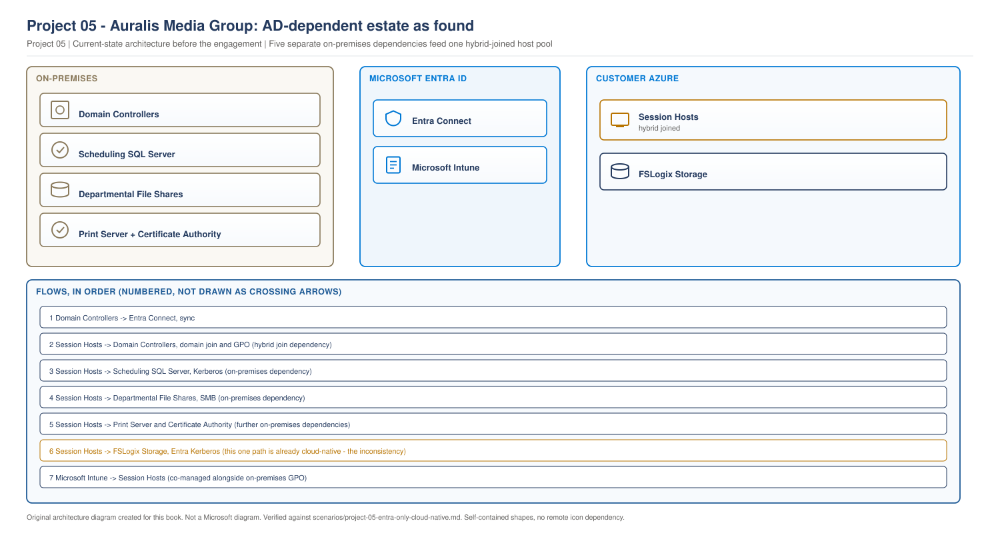
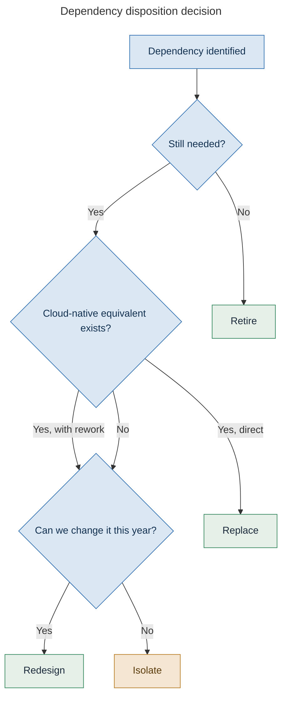
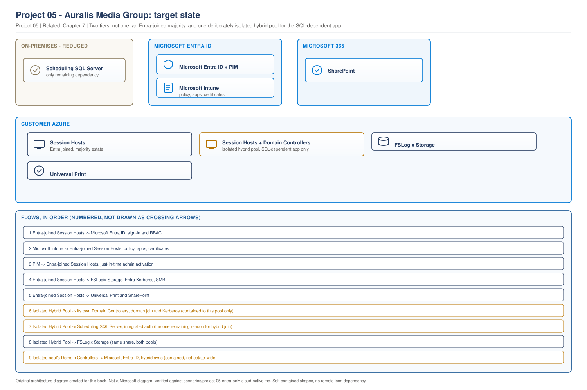
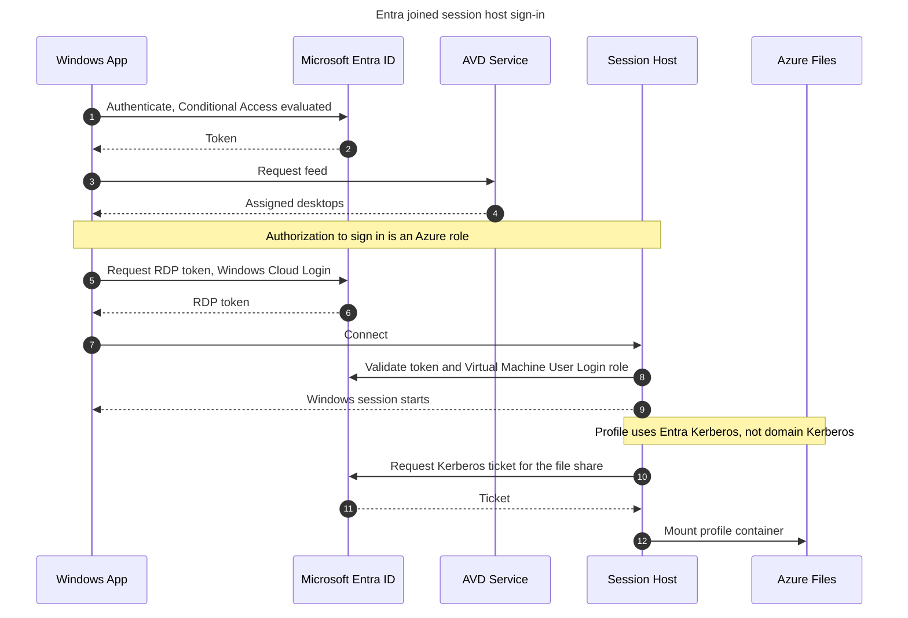

# Project 05 - Auralis Media Group: Entra-Only AVD Design and Operating Cost

> **Fictional architecture case study:** Auralis Media Group is not a customer delivery record. Requirements, measurements, costs, tests, and outcomes are worked examples or validation targets unless separate lab evidence is linked.

> **Book:** Azure Virtual Desktop - Architect to Hands-on Implementation
> **Part XI:** Architecture Case Studies
> **Standard:** [PROJECT-STANDARD.md](../PROJECT-STANDARD.md)
> **Technical baseline:** August 2026
> **Concepts introduced here:** Entra joined session host operating model, dependency discovery and disposition, cloud-only identity constraints, RBAC-based sign-in and local admin, rebuild-first recovery, honest cost comparison of an operating model change

---

## Engagement brief

**What this represents.** An enterprise that has been told cloud-native is the destination and wants to know what it actually costs. The board has heard that removing Active Directory simplifies everything. The engagement's first job is to find out whether that is true here.

**The business problem.** Auralis runs 1,900 users on AVD with hybrid joined session hosts. Their domain controllers are on Windows Server 2016 and need replacing. Somebody asked the reasonable question: if we are rebuilding the domain controllers anyway, do we still need them.

**Constraints that cannot be designed away.** A scheduling application central to production planning uses integrated Windows authentication against an on-premises SQL Server, and the vendor's roadmap for modern authentication is at least two years out. Finance runs a month-end process on a departmental file share with NTFS permissions built over a decade. The security team requires certificate-based authentication for one external portal.

**Previously learned concepts applied.** Join models and Entra Kerberos ([Chapter 7](../chapters/ch07-identity-architecture-foundations.md)), the three authentications and SSO ([Chapter 8](../chapters/ch08-authentication-flows-in-detail.md)), Intune rules for multi-session ([Chapter 24](../chapters/ch24-intune-and-avd-endpoint-management.md)), profile storage identity constraints ([Chapter 20](../chapters/ch20-profile-storage-architecture.md)), RBAC ([Chapter 10](../chapters/ch10-rbac-delegation-administrative-model.md)), hybrid policy coexistence ([Project 04](project-04-hybrid-active-directory.md)).

**New concepts introduced here.** What the Entra joined operating model actually changes. Dependency discovery and the retain, redesign, replace, isolate, retire framework. Cloud-only identity constraints and the current support position. RBAC-based Windows sign-in and how local administrator works without a domain. Rebuild-first recovery. And a cost comparison that includes the operating model rather than only Azure resources.

**Architectural decisions to make.** Which workloads can move. What happens to the ones that cannot. Whether a partial migration is a failure or the correct answer.

**What could realistically go wrong.** An application that works on every test host and fails in production because the test host was hybrid joined. A profile that mounts for some users and not others because identity types differ.

**Validation and handover.** Every application tested on a genuinely Entra joined host by the people who use it, and an operations team who can rebuild a session host without a domain.

---

## 1. Why this engagement exists

**Auralis Media Group.** A broadcast and production business. 1,900 staff across London, Manchester and a post-production facility in Dublin.

| Item | Detail | Type |
|---|---|---|
| AVD users | 1,900, four host pools | Measurement |
| Session host join type | Entra hybrid joined | Measurement |
| Domain controllers | 4, two on-premises and two in Azure, all Server 2016 | Measurement |
| Domain age | Migrated from a 2011 forest during a 2018 merger | Measurement |
| Applications on session hosts | 34 | Measurement |
| Applications with a documented owner | 11 | Finding |
| GPOs applying to the AVD OU | 22 | Measurement |
| Intune maturity | Good. Physical estate fully managed | Measurement |

**The trigger.** Four domain controllers reaching end of support, with a replacement project costed at roughly £48,000 including licensing, build and testing. That is the number that made someone ask whether the domain was still needed for AVD.

**The question we were actually asked.** Not "design an Entra-only environment". It was "tell us whether we can get rid of Active Directory for AVD, and what it would take". Those are different engagements, and the second one starts with discovery rather than design.

> **EXAMPLE CUSTOMER ARCHITECTURE.** Auralis Media Group as found.

> **OUR ORIGINAL ARCHITECTURE DIAGRAM.** Created for this book. Not a Microsoft diagram.
> Editable source: [`project05-ad-dependent-as-found.drawio`](../diagrams/architecture/project05-ad-dependent-as-found.drawio)



**What this shows.** Six separate dependencies on the on-premises estate, only one of which is domain join itself.

**The point of drawing it first.** Everyone in the room believed the dependency was "the session hosts are domain joined". The diagram shows five more, and each one has to be dealt with individually. Removing domain join without dealing with the other five gives you an estate that joins nothing and works for nobody.

---

## 2. Requirements

| ID | Requirement | Source | Test |
|---|---|---|---|
| BR1 | Avoid the £48,000 domain controller replacement if possible | Finance | Documented decision with a costed comparison |
| BR2 | No loss of function for any of the 34 applications | Heads of department | Every application tested by a real user on a target host |
| BR3 | Month-end finance process unaffected | Finance director | Full month-end run completed on the new platform |
| BR4 | Faster session host rebuild than today | Operations | Timed rebuild, before and after |
| TR1 | Users sign in without a password prompt | Existing behaviour, must not regress | SSO confirmed on the host |
| TR2 | Administrators do not use domain accounts on session hosts | Security | Role assignments audited, no domain admin sign-ins |
| TR3 | Profiles mount for every identity type in use | Derived from BR2 | Tested with cloud-only and synced accounts |
| TR4 | Certificate-based access to the external portal preserved | Security | Portal access tested from a target host |

**BR1 is the commercial driver and it is not the deciding requirement.** BR2 is. If any application cannot work, the saving is irrelevant, and section 4 is where that gets decided.

---

## 3. Concept introduced: what Entra join actually changes

Before discovery, the team needed a shared understanding of what changes and what does not. Three things change, and they are not the ones people expect.

### Windows sign-in becomes an RBAC decision

On a domain joined host, a user with an account in the domain can sign in. On an Entra joined host, they cannot, unless they hold an Azure role.

Microsoft is explicit: assign your users the Virtual Machine User Login role so they can sign in to the VMs. Assign administrators who need local administrative privileges the Virtual Machine Administrator Login role.

And on where to assign it: you can assign the Virtual Machine User Login or Virtual Machine Administrator Login role either on the VMs, the resource group containing the VMs, or the subscription. We recommend assigning the Virtual Machine User Login role to the same user group you used for the application group at the resource group level to make it apply to all the VMs in the host pool.

**Two consequences.** Application group assignment is no longer sufficient for access, which is the failure mode from [Chapter 5](../chapters/ch05-operating-systems-multisession-licensing.md#5-entra-joined-session-hosts-change-the-prerequisites). And local administrator is now a role assignment rather than group membership, which is a genuine improvement because it is auditable in the Azure activity log and can be made eligible through PIM.

### There is no Kerberos ticket for on-premises resources

This is the dependency that decides most engagements. An Entra joined host has no domain membership, so it cannot obtain a Kerberos ticket for an on-premises service in the way a domain joined host can.

FSLogix on Azure Files is a different path and is supported. Microsoft's current position: Microsoft Entra joined VM access to Azure Files shares for hybrid, cloud-only and external identities using Microsoft Entra Kerberos for FSLogix user profiles is fully supported.

`CURRENCY FLAG - verified August 2026, with a documentation discrepancy worth knowing.` Some Microsoft Learn pages, particularly localised versions, still carry the older statement that Entra joined VMs can only access Azure Files shares for hybrid users. The current English page states hybrid, cloud-only and external identities are fully supported. Where pages disagree, check the most recently updated English page. `[VERIFY BEFORE IMPLEMENTATION]`

**What is not covered by Entra Kerberos.** An arbitrary on-premises SMB share or SQL Server using integrated Windows authentication. Entra Kerberos is scoped to Azure Files for FSLogix, not a general replacement for domain Kerberos. That single sentence eliminated two of Auralis's assumptions in the first workshop.

### Documented limitations

Microsoft lists constraints to weigh before committing. In the version of the guidance current at the time of this engagement, these included that Microsoft Entra joined VMs don't currently support external identities, such as Microsoft Entra Business-to-Business (B2B) and Microsoft Entra Business-to-Consumer (B2C) and that the Remote Desktop Store app for Windows doesn't support Microsoft Entra joined VMs.

`CURRENCY FLAG` External identity support has since been developing. The current authentication guidance describes external identity support with specific prerequisites, including that the session host must be Entra joined, single sign-on must be configured for the host pool, particular Windows Server 2025 cumulative update levels for server hosts, and notes that FSLogix support is in preview for external identities. Auralis has no external identity requirement, so this was recorded and set aside. `[VERIFY BEFORE IMPLEMENTATION]` if your engagement has one.

### What does not change

Profiles, images, host pools, scaling, monitoring and application delivery all behave the same. That is worth saying plainly, because the anxiety in the room was much broader than the actual change.

---

## 4. Discovery: finding the dependencies

Four weeks, and it is the part of the engagement that determines the outcome.

### Method

**Step 1. Inventory the applications.** 34 applications, 11 with owners. Finding owners for the other 23 took two weeks and was the slowest part of the engagement.

**Step 2. Classify by authentication.** For each application, how does it authenticate. Integrated Windows authentication, a service account, a certificate, a form, or nothing.

**Step 3. Test on a genuinely Entra joined host.** Not a hybrid joined host with the domain unreachable. A real Entra joined host, because the two behave differently and testing on the wrong one produces false confidence.

**Step 4. Find the non-application dependencies.** Scripts, scheduled tasks, printing, certificates and administrative processes. These are the ones that do not appear in an application inventory and break after go-live.

### What was found

| Dependency | Type | Disposition | Reason |
|---|---|---|---|
| Scheduling application, integrated Windows auth to on-premises SQL | Application | **Isolate** | Vendor roadmap two years out. Rewriting is not available to us |
| Departmental file shares, NTFS permissions | File service | **Redesign** | Migrate to SharePoint with Known Folder Move. Twelve month programme |
| Print server, Kerberos printing | Infrastructure | **Replace** | Universal Print. Removes the dependency and a server |
| Certificate auto-enrolment from on-premises CA | Security | **Replace** | Certificate delivery through Intune |
| Nightly script using the computer account to write to a share | Automation | **Replace** | Rewritten to use a managed identity against Azure Storage |
| Administrative access using domain accounts on hosts | Process | **Replace** | Virtual Machine Administrator Login through PIM |
| Legacy reporting tool, hard-coded UNC path | Application | **Retire** | Superseded 18 months ago. Nobody had removed it |
| Two departmental Access databases on a share | Application | **Retain** | Move with the file share programme. Not an AVD problem |

**Eight dependencies. One application blocked the whole thing.**

> **RECOMMENDED ARCHITECTURE.** Disposition framework used at Auralis.



> Decision flow diagram. It uses the reduced explanation set defined in the [diagram standard](../DIAGRAM-STANDARD.md).

**What this shows.** The order the questions must be asked in, and the fact that isolate is the outcome when nothing else is available this year.

**Step by step.** Ask whether the dependency is still needed, because some are not. Then whether a cloud-native equivalent exists. Then whether change is possible within the programme. Isolate is not failure, it is the honest answer when the constraint is somebody else's roadmap.

**Architect's interpretation.** Isolate is coloured amber deliberately. It is an acceptable outcome and it carries a cost, because it means keeping the thing you were trying to remove. Every isolate decision needs a review date.

---

## 5. Architecture decisions

### AD1: Full migration, partial migration, or stay

**Requirement.** BR1 wants the domain controller spend avoided. BR2 forbids breaking any application. The scheduling application cannot move.

**Option A. Full Entra-only.** Move everything, and accept that the scheduling application stops working.

Rejected immediately. Production planning runs on it and there is no manual fallback.

**Option B. Stay hybrid joined.** Replace the domain controllers, change nothing.

Rejected, but not immediately, and it was a real conversation. It is the lowest-risk option and it spends £48,000 to preserve an operating model the business had already decided to move away from.

**Option C. Partial migration.** Move the four host pools that can move to Entra join. Keep one hybrid joined host pool for the scheduling application. Selected.

**Constraints that shaped it.** The scheduling application is used by 210 people, not 1,900. That ratio is what made partial migration viable. Had it been used by everyone, option B would have won.

**Decision. Option C.**

**Rejected alternatives and why.** Option A breaks the business. Option B spends money to stand still. A fourth option, publishing the scheduling application as a RemoteApp from a small domain joined pool while users work on Entra joined desktops, was considered seriously and rejected because users need it alongside other applications continuously, and two concurrent sessions on separate pools is a poor experience with real profile implications ([Chapter 3](../chapters/ch03-avd-object-model.md#4-preferred-application-group-type)).

**Operational impact, stated honestly.** Auralis still has Active Directory. They still have domain controllers. They have gone from four to two, both in Azure, serving 210 users and one application instead of the whole estate. The domain controller replacement cost falls from £48,000 to roughly £19,000 and the domain's blast radius shrinks from everything to one host pool.

**This is the decision that goes against the obvious answer.** The cloud-native answer is to remove Active Directory. We kept it, deliberately, scoped to one workload, with a review date tied to the vendor's roadmap.

### AD2: Local administrator without a domain

**Requirement.** TR2. Administrators must not use domain accounts on session hosts, and support still needs elevated access occasionally.

**Decision.** Virtual Machine Administrator Login, assigned to a support group, made eligible through Privileged Identity Management with approval and a four hour activation.

**Reason.** It removes standing local admin, it is auditable in the Azure activity log, and it does not depend on the domain. The previous model was a domain group in the local Administrators group on every host, which nobody could audit and which survived host rebuilds silently.

**Rejected alternative.** LAPS-managed local accounts, which the Cloud Adoption Framework recommends for session hosts generally. It remains valid and Auralis kept it for the isolated hybrid pool. For Entra joined hosts the role-based path is better, because it uses the identity system rather than a password store.

**Operational impact.** Support staff must activate a role before working on a host, which adds a step and produces an audit trail. The support lead objected during design and agreed after the first month, because the audit trail resolved a dispute about who had changed a host.

### AD3: Profile storage identity

**Decision.** Keep Azure Files with Entra Kerberos. No change.

**Reason.** It already worked, and it is supported for hybrid and cloud-only identities on Entra joined hosts. This is the decision that required no work and it is worth recording, because a migration document that only lists changes leaves people wondering what happened to everything else.

**One change made.** Cloud-only accounts created after the merger were not members of the synced group used for share-level permissions. That is section 8, and it was found during testing rather than in production, which was luck as much as method.

---

## 6. Target architecture

> **RECOMMENDED ARCHITECTURE.** Auralis target state.

> **OUR ORIGINAL ARCHITECTURE DIAGRAM.** Created for this book. Not a Microsoft diagram.
> Editable source: [`project05-target-state.drawio`](../diagrams/architecture/project05-target-state.drawio)



**What this shows.** Four Entra joined host pools with no domain dependency, and one isolated hybrid pool containing the domain and the application that needs it.

**The dashed amber boundary is the honest part of the design.** Active Directory did not go away. It got smaller and it got a boundary, and everything outside that boundary is free of it.

**Traffic worth noting.** The Entra joined hosts reach Entra ID for sign-in, Intune for policy and applications, Azure Files for profiles, Universal Print for printing and SharePoint for documents. Nothing they need is on-premises. The isolated pool keeps its domain join and its Kerberos path to SQL.

**Where it fails.** The isolated pool depends on two Azure domain controllers. If both fail, 210 users lose the scheduling application. That is a smaller blast radius than before and it is not zero, and it is in the risk register with the review date attached to the vendor roadmap.

---

## 7. Authentication flow on an Entra joined host

Worth drawing, because the sequence is what the two production incidents turn on.



**What this shows.** The order of sign-in on an Entra joined host, and the two places where an Azure role or an Entra Kerberos ticket is required rather than domain membership.

**Step 7 is the one that surprises people.** The host validates the role assignment. A user with a perfect token and a correct application group assignment is still rejected here without Virtual Machine User Login.

**Step 11 is the other one.** The profile ticket comes from Entra ID, not from a domain controller. That is why the profile works without a domain and why an on-premises SMB share still does not.

**How to confirm SSO is actually working on a host**, rather than a silent password fallback:

```powershell
dsregcmd /status
```

Look for `AzureAdJoined : YES` and `AzureAdPrt : YES`. A primary refresh token present means the token path was used.

---

## 8. L3 incident: the application that worked everywhere except production

**Incident.** During wave 2, the finance reporting tool fails for every user on the new Entra joined pool. It worked throughout testing.

**Impact.** 140 finance users unable to run reports, three days before month end. BR3 is at risk, and month end is not moveable.

**Scope.** Only the Entra joined pool. The same application works on the remaining hybrid joined hosts. Same user accounts, same client.

**Initial triage.** Confirm it is not a delivery problem. Is the application installed and launching, or failing at a specific point.

```bash
az vm run-command invoke -g rg-aur-hosts-prd-uks-01 -n <vm> \
  --command-id RunPowerShellScript \
  --scripts "Get-ItemProperty 'HKLM:\SOFTWARE\Microsoft\Windows\CurrentVersion\Uninstall\*' | Where-Object DisplayName -like '*Report*' | Select-Object DisplayName, DisplayVersion"
```

The application is installed and launches. It fails when connecting to its data source.

**Evidence collection.** In a user session on the failing host:

```powershell
# What Kerberos tickets does this session hold?
klist

# Is the host actually Entra joined, and is there a PRT?
dsregcmd /status

# Can the host reach the SQL Server at all?
Test-NetConnection -ComputerName sqlrep01.auralis.local -Port 1433
```

Then the application's own log, and the SQL Server error log for the failed connection attempt.

**Evidence.** `klist` shows a cloud ticket and no ticket for the on-premises realm. `dsregcmd` confirms `AzureAdJoined : YES` and no domain join. Port 1433 is reachable, so it is not networking. The SQL error log shows a failed login for an anonymous or NT AUTHORITY principal rather than the user.

**Hypothesis.** The application uses integrated Windows authentication to SQL Server. An Entra joined host cannot obtain a Kerberos ticket for that service, so the connection falls back and fails.

**Testing.** Two tests. Run the same application on a hybrid joined host as the same user, which works and shows a Kerberos ticket for the on-premises realm in `klist`. Then attempt the connection on the Entra joined host using SQL authentication with a test account, which succeeds and confirms the data path is fine.

**Root cause.** Integrated Windows authentication to an on-premises SQL Server. This dependency was in the discovery register for the scheduling application and had not been recorded for the reporting tool, because the reporting tool's owner said it "just uses the finance database" and nobody had asked how it authenticates.

**Why testing missed it.** The test host used during application validation had been built from the hybrid pool image and joined to the domain by an earlier deployment script. It was believed to be Entra joined. It was not. Every application tested on that host produced a false pass.

**Remediation.** Immediate: move the 140 finance users back to the hybrid pool for month end. That is a rollback, and it was the right call three days before month end.

Then re-run application validation on a verified Entra joined host, confirmed with `dsregcmd /status` before testing rather than after.

Then the disposition decision for the reporting tool, using the framework in section 4. It moved to isolate alongside the scheduling application, and the vendor confirmed SQL authentication support in their next release, which changed it to redesign with a date.

**Validation.** Finance completes month end on the hybrid pool with no issues. Then the reporting tool is re-tested on a verified Entra joined host and fails in the same way, which confirms the diagnosis rather than the fix.

**Rollback.** Performed. Users were moved back within four hours by changing application group assignment. Profiles were unaffected because both pools use the same storage.

**Prevention.** Three changes. Every test host is verified with `dsregcmd /status` and the output attached to the test record. Application discovery asks "how does it authenticate" as a mandatory field with an owner signature, not a verbal answer. And the migration wave gate now requires evidence of a passed test on a verified host, not a completed test.

**Runbook update.** New KB: "Application works on hybrid joined hosts and fails on Entra joined hosts." First checks are `klist` for an on-premises realm ticket and `dsregcmd /status` for join type, before touching networking.

**Lesson.** The most expensive failure in this engagement came from testing on a host that was not what everyone believed it to be. Verifying the test environment is not bureaucracy, it is the difference between a test and a guess.

---

## 9. L3 incident: profiles failing for a subset of users

**Incident.** During wave 1, roughly 60 users out of 400 receive a temporary profile on the Entra joined pool. The rest are fine.

**Impact.** 60 users with an empty desktop. Individually severe, and the pattern was not obvious, which delayed diagnosis by a day.

**Scope.** Only the Entra joined pool. Consistent per user, not per host. A failing user fails on every host, a working user works everywhere.

**Initial triage.** Consistent per user rules out host configuration and points at identity or permissions.

```bash
az vm run-command invoke -g rg-aur-hosts-prd-uks-01 -n <vm> \
  --command-id RunPowerShellScript \
  --scripts "Get-ChildItem 'C:\Users' | Sort-Object CreationTime -Descending | Select-Object -First 5 Name, CreationTime"
```

Fresh profile folders confirm temporary profiles.

**Evidence collection.** The FSLogix log on a host where an affected user signed in, under `C:\ProgramData\FSLogix\Logs\Profile`, shows the container failing to attach with an access error rather than a not-found error. That distinction matters: not-found means path, access means permission or authentication.

Then compare an affected user with a working user:

```powershell
# Identity type and source
Get-MgUser -UserId affected.user@auralis.com -Property Id,UserPrincipalName,OnPremisesSyncEnabled
Get-MgUser -UserId working.user@auralis.com -Property Id,UserPrincipalName,OnPremisesSyncEnabled
```

Then check the group used for share-level permissions on the storage account, and whether the affected users are members.

**Evidence.** Affected users show `OnPremisesSyncEnabled : false`. Working users show true. The share-level role assignment is against a group synced from Active Directory, which by definition contains no cloud-only accounts.

**Hypothesis.** Cloud-only accounts created since the merger are not in the synced group, so they hold no share-level permission and cannot access the profile share.

**Testing.** Add one affected user directly to the share-level role assignment, have them sign out fully and sign in again. The profile mounts.

**Root cause.** Share-level permissions were assigned to a synced security group when the platform was built and every user was hybrid. Sixty cloud-only accounts had been created since, mostly contractors and post-merger joiners, and nothing in the joiner process added them to that group because it lives in Active Directory.

**Remediation.** Create a cloud group containing all AVD users regardless of identity source, assign the share-level role to it, and make membership dynamic so it cannot drift.

Confirm the storage account configuration supports cloud-only accounts, including admin consent on the storage account's generated Entra application and cloud-only group support. `[VERIFY BEFORE IMPLEMENTATION]` confirm the current configuration steps for cloud-only identities against the Microsoft guidance for your storage authentication method.

**Validation.** All 60 users sign in and their profiles mount with their data intact. Then create a new cloud-only test account, confirm it lands in the dynamic group and that its profile mounts on first sign-in. The second test is the one that proves the fix rather than the remediation.

**Rollback.** Not required. The change was additive.

**Prevention.** Group membership driven from the identity source of truth rather than from Active Directory. Alert on temporary profile creation, which would have surfaced this within an hour rather than a day. Add "which identity types exist in this tenant" to the discovery checklist, because the assumption that everyone is synced is common and easy to check.

**Runbook update.** KB updated: "Profile fails for some users and not others." First check is the identity type of an affected user compared with a working one, before looking at hosts or storage.

**Lesson.** A migration exposes assumptions that were true when the platform was built. Everyone was synced in 2018. Nobody re-checked, and the permission model quietly stopped covering part of the population.

---

## 10. Migration approach

Four waves, with acceptance criteria that had to be met before the next wave started.

| Wave | Scope | Acceptance criteria |
|---|---|---|
| Pilot | 25 users, IT and one business team | All applications tested on a verified Entra joined host. SSO confirmed with `dsregcmd`. Profiles mount. No P1 or P2 for 10 working days |
| Wave 1 | 400 users, two departments | Ticket volume within 20 percent of baseline. Logon p95 unchanged. Zero profile failures after the wave 1 fix |
| Wave 2 | 800 users | Same, plus one full month-end cycle completed |
| Wave 3 | 490 users, remainder | Same |
| Isolated pool | 210 scheduling users | Remain hybrid joined. Domain controllers reduced from four to two |

**The rollback position at every wave.** Move users back by changing application group assignment. Profiles are unaffected because both pools use the same storage. That single design property is what made the waves low risk, and it was deliberate.

**What was rolled back.** Wave 2 finance users, for three days over month end, described in section 8.

**What was not moved.** 210 users on the scheduling application, and by the end of the engagement the reporting tool users as well. Roughly 12 percent of the estate remains hybrid joined by design.

---

## 11. Cost and operating model

The honest comparison, which is not the one the board expected.

| Line | Before | After | Note |
|---|---|---|---|
| Domain controllers | 4, replacement costed at £48,000 | 2, replacement roughly £19,000 | One-off |
| Domain controller run cost | Roughly £420 a month | Roughly £210 a month | Halved, not removed |
| Intune licensing | Already held | Already held | No change |
| Migration cost | | Roughly £62,000 in effort over five months | One-off |
| Session host rebuild time | 40 minutes including domain join and GPO | 22 minutes | BR4 met |
| Applications requiring a domain | Unknown at the start | 2, both with review dates | The real output of discovery |

**Payback on infrastructure alone is poor.** £62,000 of migration effort to avoid £29,000 of domain controller replacement and save £2,500 a year in run cost. On that arithmetic the project does not justify itself, and that was said plainly to the board.

**What justified it.** Three things that are not Azure resource cost.

**Rebuild time nearly halved**, because there is no domain join, no GPO processing at build and no computer object to clean up. For an estate that replaces hosts monthly, that is real operational time.

**The blast radius of Active Directory shrank from everything to one host pool.** A domain controller problem used to be a total AVD outage. It now affects 210 users and one application.

**Discovery produced a dependency register that did not exist.** Auralis now knows which of its applications depend on Active Directory, with owners and review dates. That was arguably worth the engagement on its own, and it is not a line in any cost model.

**Architect lesson.** If you justify an Entra-only migration on infrastructure cost, the numbers will usually be marginal at this size. Justify it on the operating model, and be honest when the infrastructure saving is small.

---

## 12. Day-2 operations

**Recovery model changes, and improves.** A broken Entra joined session host is rebuilt, not repaired. There is no computer object to clean up, no domain join to repeat and no GPO to wait for. The runbook is shorter than the hybrid equivalent and the operations team preferred it within a fortnight.

**Administrative access.** Virtual Machine Administrator Login activated through PIM, four hour window, approval required. Standing local admin does not exist. The audit trail is the Azure activity log.

**What operations must now know that they did not before.**

| Question | Where the answer is |
|---|---|
| Why can a user not sign in to a host | Role assignment, not group membership |
| Why does this application fail here and work there | Join type of the host. Check `dsregcmd /status` |
| Why does this user have no profile | Identity type and share-level group membership |
| How do I get admin on a host | PIM activation, not a domain account |

**Quarterly.** Review the isolate decisions against vendor roadmaps. Both have review dates and an owner. Without that, isolate quietly becomes permanent.

**Annually.** Re-check the Entra joined support position against Microsoft's current guidance, because the constraints in section 3 have changed twice in two years and will change again.

---

## 13. Trade-offs

| Trade-off | Given up | Why | What would change it |
|---|---|---|---|
| Partial migration | The clean cloud-native story | One application blocks it and 210 users depend on it | Vendor delivering modern authentication |
| Kept two domain controllers | The £48,000 saving in full | Isolating the dependency still needs a domain | Retiring the scheduling application |
| Isolated pool rather than RemoteApp | A smaller legacy footprint | Users need the application alongside others continuously, and two sessions on separate pools is a poor experience | Users needing it occasionally rather than continuously |
| PIM activation for admin access | Speed for the support team | Auditable and no standing privilege | Nothing. The support lead came round after the first month |
| Migration justified on operating model | A simple financial case | The infrastructure arithmetic is marginal at this size | A larger estate, where domain controller count scales |
| File share migration deferred | A faster route to cloud-only | Twelve month programme with its own dependencies | Nothing. Rushing it would have created a second incident |

**The one that will be challenged.** Spending £62,000 to save £29,000. The defence is the operating model: halved rebuild time, a domain blast radius reduced to 12 percent of the estate, and a dependency register that did not previously exist. If the board wanted a payback calculation on infrastructure alone, the correct advice would have been to replace the domain controllers and do nothing else, and that was said before the work started.

---

## 14. Interview questions from this engagement

### Q. What does it actually take to run AVD without Active Directory?

**Strong answer**
"More discovery than design. The technical change is small: session hosts join Entra ID, Windows sign-in becomes an Azure role assignment through Virtual Machine User Login, local admin becomes Virtual Machine Administrator Login, and profiles use Entra Kerberos against Azure Files, which is supported for hybrid and cloud-only identities. What takes the time is finding everything built on the assumption of domain membership. At this customer that was eight dependencies, and only one of them was domain join itself. Integrated Windows authentication to an on-premises SQL Server, Kerberos printing, certificate auto-enrolment from the on-premises CA, a script using the computer account, and an administrative process based on domain accounts. Each one needs a decision: retain, redesign, replace, isolate or retire. Entra-only is an operating model, not a checkbox."

**Follow-up you should expect**
"What if one application cannot move?" Isolate it. A small hybrid joined host pool with the domain scoped to it, and a review date tied to the vendor's roadmap. That is not a failure, it is the honest answer when the constraint belongs to someone else.

### Q. An application works on hybrid joined hosts and fails on Entra joined hosts. What is happening?

**Strong answer**
"Almost always integrated Windows authentication to an on-premises resource. An Entra joined host has no domain membership, so it cannot get a Kerberos ticket for that service. I would check `klist` in the user's session for a ticket in the on-premises realm, `dsregcmd /status` to confirm the join type of the host, and then test the port to rule out networking, because networking usually is not the problem. Entra Kerberos covers Azure Files for FSLogix profiles, and people assume it is a general replacement for domain Kerberos. It is not. In the engagement I am describing the real lesson was worse than the diagnosis: the host used for application testing had been domain joined by an old deployment script, so every application had been tested on the wrong join type and produced a false pass. Now every test record carries `dsregcmd` output as evidence."

### Q. How does administrative access work without a domain?

**Strong answer**
"Virtual Machine Administrator Login, assigned to a group and made eligible through PIM rather than standing. It removes local administrator as a persistent state, it is auditable in the Azure activity log, and it does not depend on the domain being reachable. The alternative is LAPS-managed local accounts, which the Cloud Adoption Framework recommends for session hosts generally and which we kept for the hybrid pool. For Entra joined hosts I prefer the role, because it uses the identity system rather than a password store. The operational cost is that support has to activate before working, which they disliked until the audit trail settled a dispute about who had changed a host."

### Q. Is Entra-only cheaper?

**Honest answer**
"Not necessarily, and I would not sell it that way. At this customer, migration effort was around £62,000 to avoid £29,000 of domain controller replacement and save about £2,500 a year in run cost. On infrastructure alone it does not pay back. What justified it was the operating model: session host rebuild time fell from 40 minutes to 22 because there is no domain join, no GPO processing at build and no computer object to clean up, and the blast radius of an Active Directory failure went from the whole estate to 12 percent of it. Plus a dependency register they did not have before. If a board wants a payback calculation on Azure resource cost, the right advice at this size is usually to replace the domain controllers and do nothing else, and I would say that before the work starts rather than after."

### Q. What would you do differently?

**Honest answer**
"Verify the test environment on day one. The single most expensive failure in the engagement was three days of finance disruption before month end, caused by a test host everyone believed was Entra joined and was not. One command would have caught it. And I would have asked 'how does this authenticate' as a signed field in the application discovery rather than accepting verbal answers from owners, because the answer 'it just uses the finance database' turned out to hide the exact dependency the project was about."
