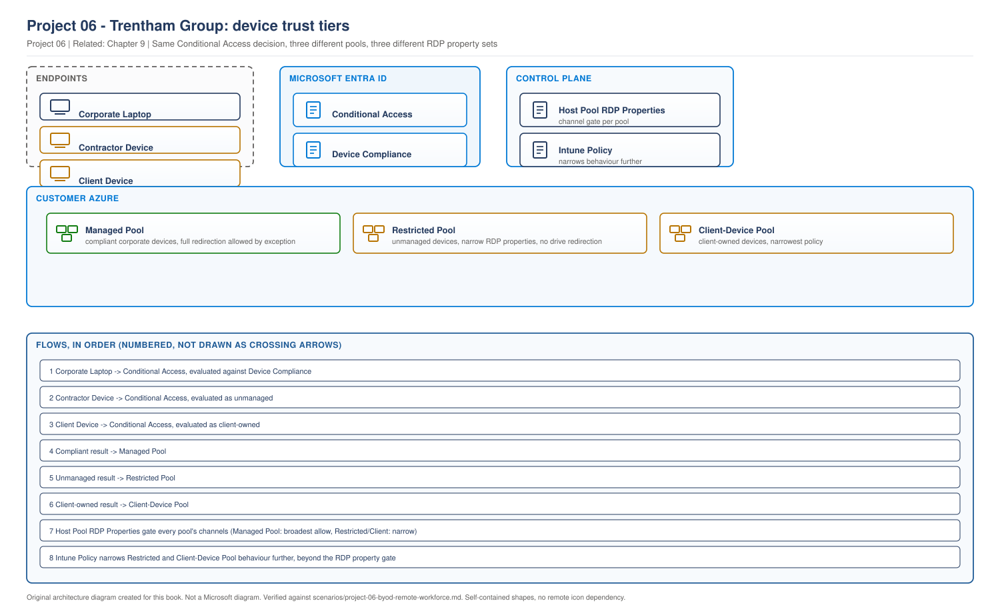

# Project 06 - Trentham Group: BYOD, Contractors and a Remote Workforce

> **Fictional architecture case study:** Trentham Group is not a customer delivery record. Requirements, measurements, costs, tests, and outcomes are worked examples or validation targets unless separate lab evidence is linked.

> **Book:** Azure Virtual Desktop - Architect to Hands-on Implementation
> **Part XI:** Architecture Case Studies
> **Standard:** [PROJECT-STANDARD.md](../PROJECT-STANDARD.md)
> **Technical baseline:** August 2026
> **Concepts introduced here:** session hardening, redirection controls and their defaults, clipboard transfer direction and data types, screen capture protection, watermarking, policy precedence, exception handling

---

## Engagement brief

**What this represents.** A consultancy that has to give access to people it does not employ, on devices it does not manage, without letting client material leave the session. This is the most common security engagement in AVD and the one where security teams and business teams argue hardest.

**The business problem.** Trentham won a large financial services client whose contract includes a data handling schedule. That schedule says client material must not be stored on any device outside Trentham's control. Trentham currently gives contractors a laptop, which costs money and takes ten days, and the client has now asked for evidence of the control rather than a policy statement.

**Constraints that cannot be designed away.** Contractors are onboarded in under 48 hours and Trentham will not ship hardware. Consultants must deliver documents to clients, so a total block on data leaving the session breaks the business. The security team has already written a standard that says maximum restriction, and it was written without consulting the delivery teams.

**Previously learned concepts applied.** Conditional Access and app targeting ([Chapter 9](../chapters/ch09-conditional-access-mfa-zero-trust.md)), Intune management of session hosts ([Chapter 24](../chapters/ch24-intune-and-avd-endpoint-management.md)), host pool design ([Chapter 15](../chapters/ch15-host-pool-design-decisions.md)), clients and browser access ([Chapter 6](../chapters/ch06-clients-and-the-endpoint-story.md)), monitoring ([Project 02](project-02-enterprise-850-users.md)).

**New concepts introduced here.** Redirection controls and the new secure defaults, clipboard transfer direction and data type limits, screen capture protection and what it breaks, watermarking, how the RDP property and the granular policy interact, and how to run an exception process that does not become a rubber stamp.

**Architectural decisions to make.** How many trust tiers. Where each control is enforced. What to allow rather than what to block. How exceptions are granted and reviewed.

**What could realistically go wrong.** A control that blocks a business process nobody documented. A control that appears configured and is not enforcing. An exception process that quietly becomes the default.

**Validation and handover.** Every control tested by attempting the thing it is supposed to prevent, with evidence the client can accept.

---

## 1. The organisation and the device landscape

**Trentham Group.** A 2,200 person management and technology consultancy. UK headquartered, delivery teams across three countries.

| Population | Count | Device | Managed by |
|---|---|---|---|
| Permanent consultants | 1,450 | Corporate Windows laptop | Trentham, Intune |
| Delivery centre staff | 310 | Corporate thin client, offshore site | Trentham |
| Contractors | 620 | Their own laptop or their agency's | Nobody |
| Client-site associates | 90 | Client-issued device | The client |

**Peak concurrency 1,680**, measured over six weeks.

**The device landscape is the architecture.** Four populations with four different levels of assurance about the endpoint. Applying one policy to all of them is how you either block the business or fail the contract, and the security standard as written did exactly the first.

**The uncomfortable population is the last one.** Ninety associates working on client-issued devices. Trentham cannot manage those devices and neither can it refuse them, because the client requires their staff to use client hardware. That group ended up driving several decisions.

---

## 2. Requirements

| ID | Requirement | Source | Test |
|---|---|---|---|
| BR1 | Client material must not persist on any device outside Trentham control | Client contract, data handling schedule | Demonstrated attempt to exfiltrate, blocked, evidenced |
| BR2 | Contractor onboarded and productive within 48 hours | Delivery operations | Timed onboarding of a real contractor |
| BR3 | Consultants can still deliver documents to clients | Delivery directors | Named business processes still work end to end |
| BR4 | Evidence pack the client's auditor accepts | Client contract | Auditor sign-off |
| TR1 | No corporate data written to an unmanaged local drive | Derived from BR1 | Attempt file copy, confirm blocked |
| TR2 | Screenshots of session content blocked on supported clients | Derived from BR1 | Attempt screenshot, confirm blocked |
| TR3 | Sessions traceable to a user if material appears elsewhere | Client request | Watermark decoded from a photograph of a screen |
| TR4 | Contractors get access without device enrolment | BR2 | Onboarding path has no enrolment step |

**BR1 and BR3 are in direct conflict** and everyone knew it before we arrived. The security standard resolved it by choosing BR1 and ignoring BR3, which is why the engagement existed. Section 5 resolves it properly.

---

## 3. Concept introduced: redirection, and what the defaults now are

Redirection is how data moves between the endpoint and the session. Clipboard, drives, printers, USB devices, cameras, smart cards, COM ports, location and WebAuthn. Every one is a path in or out.

### The default changed, and it changed in your favour

`CURRENCY FLAG - verified August 2026. This is recent and it changes what a new deployment looks like.`

Microsoft has moved AVD to secure defaults: Azure Virtual Desktop is enhancing its default security by disabling clipboard, drive, opaque low-level USB, and printer redirections for all newly created host pools. This change minimizes the risk of data exfiltration and malware injections, making it easier to have a more secure experience by default. IT admins can enable these redirections as needed using the host pool Remote Desktop Protocol (RDP) properties in the Microsoft Azure portal or by using other methods such as Microsoft Intune or Group Policy.

**Two consequences for this engagement.**

The design posture inverts. You are no longer disabling redirection, you are deciding what to enable and justifying it. That is a much better conversation to have with a security team, and it is a much harder one to have with delivery teams who expect things to work.

Older host pools do not change. Trentham's existing pools were created before this and carry the old permissive defaults. Nobody had checked.

### Where redirection is controlled

Two places, and understanding the relationship between them is the whole of section 6.

| Layer | What it does | Where |
|---|---|---|
| Host pool RDP properties | Allows or blocks a redirection channel entirely | Azure portal, host pool, RDP Properties |
| Session host policy | Narrows behaviour within an allowed channel | Intune Settings catalog or Group Policy |

**The RDP property is the gate.** If it blocks the channel, no policy can open it.

---

## 4. Concept introduced: the controls, one at a time

For each control: the threat, the control, the configuration, the user impact, how it is validated, what it costs operationally, and how exceptions work. That order matters, because a control chosen without the user impact is a control that gets removed under pressure six weeks later.

### Drive redirection

**Threat.** A contractor copies a client deliverable to their own laptop. This is BR1 in one sentence.

**Control.** Drive redirection disabled at the host pool.

**Configuration.** Host pool RDP properties, `drivestoredirect:s:` set to empty. Portal path: *Azure Virtual Desktop > Host pools > pool > RDP Properties > Device redirection*.

**User impact.** Users cannot see local drives in the session and cannot copy files out that way. For consultants this is significant, and it is addressed in section 5 rather than by weakening the control.

**Validation.** Sign in from an unmanaged laptop, open File Explorer in the session, confirm no local drives are mapped. Then attempt to copy a file to a mapped drive path and confirm it fails.

**Operational considerations.** This is the control users notice first. The service desk needs the approved alternative in front of them on day one, or they will raise it as a fault.

**Exception handling.** None. There is no business case for writing client material to an unmanaged device, and that is the one control where the security team's position was correct without qualification.

### Clipboard

**Threat.** Bulk copy of client material out of the session. Also the reverse, malicious content pasted in.

**Control.** Clipboard allowed in one direction only, client to session host, with data types limited.

This is where AVD gives you something better than on or off. Microsoft documents the options: you can configure whether users can use the clipboard from session host to client, or client to session host, and the types of data that can be copied, from the following options: disable clipboard transfers from session host to client, client to session host, or both. Allow plain text only. Allow plain text and images only.

**Configuration.** Two layers, and this is the precedence point. The host pool RDP property must permit clipboard, then the granular policy narrows it. Microsoft is explicit: host pool RDP properties must allow clipboard redirection, otherwise it will be completely blocked.

Settings catalog path: *Administrative templates > Windows Components > Remote Desktop Services > Remote Desktop Session Host > Device and Resource Redirection*.

**Prerequisite that will catch you.** Your session hosts must be running one of the following operating systems: Windows 11 Enterprise or Enterprise multi-session, version 22H2 or 23H2 with the 2024-06 cumulative update (KB5039212) or later installed. Windows 11 Enterprise or Enterprise multi-session, version 21H2 with the 2024-06 cumulative update (KB5039213) or later installed. Windows Server 2022 with the 2024-07 cumulative update (KB5040437) or later installed.

An image older than those updates will accept the policy and not enforce the direction. That is a silent failure and section 8 is about exactly that happening.

**User impact.** Consultants can paste a client reference number into the session. They cannot copy a paragraph of a report out. Most people accept this once they understand it, and the one-direction design is what makes it acceptable rather than a flat block.

**Validation.** From an unmanaged device: copy text in the session, attempt to paste locally, confirm nothing arrives. Then copy text locally, paste into the session, confirm it works.

**Operational considerations.** Direction is not obvious to users. The KB article for the service desk needs a one-line explanation, because "the clipboard is broken" is how it will be reported.

**Exception handling.** Session-to-client plain text only, time-limited, for a named business process. Two were approved. Both are reviewed quarterly.

### Printer redirection

**Threat.** Print to PDF locally, which is a file copy wearing a disguise.

**Control.** Printer redirection disabled for unmanaged devices, allowed for corporate managed devices.

**User impact.** Contractors cannot print. Consultants on corporate laptops can, because the endpoint is managed and the file lands somewhere Trentham controls.

**Validation.** From an unmanaged device, confirm no local printers appear. From a corporate laptop, confirm printing works.

**Exception handling.** Client-site associates print to client printers, which is the client's requirement and their risk. Documented as a client-accepted exception rather than a Trentham decision.

### Screen capture protection

**Threat.** A screenshot of the session, which no redirection control prevents.

**Control.** Screen capture protection enabled on the session hosts for the unmanaged tiers.

**How it works.** Microsoft describes it as follows: screen capture protection, alongside watermarking, helps prevent sensitive data from being captured on client devices using specific operating system (OS) features and APIs. When you enable screen capture protection, remote content is automatically blocked in screenshots and screen sharing.

There are two modes, and the difference matters: block screen capture on client and server: the session host instructs a supported Remote Desktop client to enable screen capture protection for a remote session. This option prevents screen capture from the client of applications running in the remote session, but also prevents tools and services within the session host from capturing the screen.

**The cost, stated plainly.** When screen capture protection is enabled, users can't share their remote window using local collaboration software, such as Microsoft Teams. With Teams, the local Teams app or using Teams with media optimization can't share protected content.

For a consultancy that runs client workshops over Teams, that sentence is a business problem, not a footnote. Section 5 is largely about it.

**Prerequisites.** Session hosts must be running a Windows 11, version 22H2 or later, or Windows 10, version 22H2 or later. Users must connect to Azure Virtual Desktop with Windows App or the Remote Desktop app to use screen capture protection.

**Configuration.** Intune device configuration policy or Group Policy on the session hosts. Microsoft notes for Windows and macOS endpoints that Windows App or the Remote Desktop client enforces screen capture protection settings without further configuration, so the enforcement is client-side once the host instructs it.

**Validation.** From a Windows endpoint, attempt a screenshot of the session. The captured image should show blocked content. Repeat on macOS. Then attempt to share the session window in a local Teams call and confirm it is blocked, because that is the user impact you must be able to demonstrate to the business, not just to security.

**Operational considerations.** Support cannot take a screenshot of a user's session either, which changes how the service desk works. They now ask users to describe or photograph, or they use a session shadowing approach where policy allows.

**Exception handling.** By host pool, not by user. A user who needs to share their session in Teams moves to the pool where it is permitted, which is a deliberate design choice explained in section 5.

### Watermarking

**Threat.** A photograph of the screen with a phone. No software control prevents this.

**Control.** Watermarking, which does not prevent capture but makes it traceable.

Microsoft's framing: to discourage other methods of screen capture, such as taking a photo of a screen with a physical camera, you can enable watermarking, where admins can use a QR code to trace the session.

**User impact.** A visible QR pattern over the session. Users dislike it, and the dislike is proportional to how dense you make it.

**Validation.** TR3 requires more than enabling it. Photograph a session with a phone, decode the QR code, and confirm it resolves to a session that can be traced to a user. If that end-to-end test has not been done, the control is decorative.

**Operational considerations.** Somebody must know how to decode it and where the mapping lives. That is a documented procedure with a named owner, otherwise the first time it is needed is during an incident.

**Exception handling.** None. It is applied to every unmanaged tier.

### USB and low-level device redirection

**Threat.** Copy to a USB stick, or attach a device that presents as storage.

**Control.** Disabled for unmanaged tiers. This is now the default for new host pools.

**Exception handling.** One approved exception for accessibility hardware, granted at the device class level rather than by opening USB redirection generally.

---

## 5. Architecture decisions

### AD1: Trust tiers, and how many

**Requirement.** Four device populations, one platform, contract obligations that differ by population.

**Options.** One host pool with the strictest policy. One host pool per population. Trust tiers, where several populations share a tier.

**Decision. Three host pools mapped to three trust tiers.**

| Tier | Populations | Endpoint assurance | Control posture |
|---|---|---|---|
| Managed | Permanent consultants, delivery centre | Intune managed, compliant | Clipboard both directions, printers, drives allowed. No screen capture protection |
| Restricted | Contractors | None | Clipboard client to host only, no drives, no printers, screen capture protection, watermarking |
| Client-device | Client-site associates | Managed by the client, not by Trentham | As Restricted, plus printing allowed to client printers as a client-accepted exception |

**Reason.** Two tiers were not enough, because client-site associates need printing that contractors must not have, and that difference is contractual rather than technical. Four tiers would have meant a fourth capacity floor for ninety users.

**The decision against the obvious answer.** The security standard as written said apply the strictest posture everywhere. We did not, and the argument that won was BR3. If consultants cannot deliver documents to clients, they work around the platform, and a control users route around is worse than a weaker control they comply with.

**What would change it.** If the corporate device estate stopped being reliably managed, the Managed tier's justification disappears and it collapses into Restricted.

### AD2: Where each control is enforced

**Decision.** Redirection at the host pool RDP properties. Granular clipboard behaviour, screen capture protection and watermarking through Intune policy scoped to device groups.

**Reason.** The RDP property is the gate and it is per host pool, which maps cleanly to the trust tiers. Everything narrower belongs in policy where it can be changed without touching the host pool, which affects every user at their next connection.

**The precedence rule that has to be documented.** The host pool RDP property must allow a channel before any policy can shape it. A clipboard direction policy on a pool where clipboard is blocked at the RDP property does nothing, and it looks correctly configured. That sentence went into the design document and the KB.

### AD3: Browser or installed client for contractors

**Decision.** Windows App, installed, for contractors. Browser only as a fallback.

**Reason.** This one reversed during the engagement. The obvious BYOD answer is browser access, because there is nothing to install and nothing to remove at offboarding. But screen capture protection requires a supported client, and TR2 is a contract obligation. Browser access would have failed the requirement the whole project exists to meet.

**The trade accepted.** Contractors install something on their own device, which is a small onboarding step and a small support burden. Browser access remains available for short-lived access where TR2 does not apply, and that distinction is written into the access request form.

**This is worth remembering.** The textbook BYOD answer is browser access. Here the security requirement made it wrong, and finding that out in week two rather than at the audit was the value of reading the requirement properly.

---

## 6. Trust tier architecture

> **RECOMMENDED ARCHITECTURE.** Trentham Group. Our design, technically consistent with Microsoft's documented redirection and session protection behaviour.

> **OUR ORIGINAL ARCHITECTURE DIAGRAM.** Created for this book. Not a Microsoft diagram.
> Editable source: [`project06-device-trust-tiers.drawio`](../diagrams/architecture/project06-device-trust-tiers.drawio)



**What this shows.** Three endpoint populations, routed by Conditional Access to three host pools, with controls applied at two enforcement points.

**The routing decision.** Conditional Access evaluates device compliance and directs users to the appropriate workspace. A compliant corporate device reaches the Managed pool. Everything else reaches a restricted pool.

**The two enforcement points, and their order.** RDP properties gate the channel per host pool. Intune policy narrows behaviour inside an allowed channel. Policy cannot open a channel the RDP property has closed, which is why the arrows point the way they do.

**Where it fails.** If Conditional Access does not correctly distinguish compliant from non-compliant devices, a contractor could reach the Managed pool. That is the single highest risk in the design and section 8 covers finding out it was happening.

**Microsoft managed versus customer managed.** Entra ID and the evaluation are Microsoft's. Host pools, policies and the RDP properties are Trentham's.

---

## 7. The control matrix

The output the client's auditor actually wanted, and the artefact the service desk uses.

| Control | Managed | Restricted | Client-device | Enforced at |
|---|---|---|---|---|
| Drive redirection | Allowed | Blocked | Blocked | RDP property |
| Clipboard, client to host | Allowed | Allowed | Allowed | RDP property |
| Clipboard, host to client | Allowed | Blocked | Blocked | Intune policy |
| Clipboard data types | All | Plain text only | Plain text only | Intune policy |
| Printer redirection | Allowed | Blocked | Allowed, client exception | RDP property |
| USB and low-level devices | Restricted | Blocked | Blocked | RDP property |
| Camera and microphone | Allowed | Allowed | Allowed | RDP property |
| Screen capture protection | Off | On | On | Intune policy |
| Watermarking | Off | On | On | Intune policy |
| Teams window sharing | Works | Blocked | Blocked | Consequence of screen capture protection |

**Camera and microphone stay allowed everywhere.** Contractors join client calls. Blocking them would break the job for no data protection benefit, because a camera is an input, not an exfiltration path for documents.

**The last row is the one to point at in the design review.** It is a consequence, not a decision, and it is the single biggest user impact in the project. Writing it into the matrix as a row means nobody discovers it later.

---

## 8. Production incidents

Two, both from the first six weeks, both worked end to end.

### Incident 1: Clipboard direction not enforcing on half the estate

**Symptom.** During validation, a tester on the Restricted pool copies a paragraph from the session and pastes it successfully into a local text editor. TR1 fails.

**Scope.** Reproduced on some Restricted pool hosts and not others. Same user, same client, same policy. Not reproducible on the Client-device pool at all.

**Evidence.** Policy shows as applied and successful in Intune for every host. The RDP property permits clipboard, which it must for the direction policy to have any effect. Session hosts on the Restricted pool were built from two image versions, because a rollout was mid-flight.

**Hypothesis.** The session host operating system build does not support clipboard transfer direction. The policy applies without error and does nothing.

**Testing.** Check the build and update level on a working host and a failing host.

```bash
az vm run-command invoke -g rg-tgp-hosts-prd-uks-01 -n <vm> \
  --command-id RunPowerShellScript \
  --scripts "Get-ComputerInfo | Select-Object OsName, OsVersion, WindowsVersion; Get-HotFix | Sort-Object InstalledOn -Descending | Select-Object -First 5 HotFixID, InstalledOn"
```

Then confirm the registry values the policy sets are present on both.

**Root cause.** Hosts built from the older image predate the cumulative update required for clipboard transfer direction. The policy targets them, reports success, and the direction restriction is not enforced. A supported control silently not applying.

**Remediation.** Complete the image rollout so every host in the pool meets the documented prerequisite. Then re-test.

**Validation.** Repeat the copy-out test on ten hosts across the pool rather than one, because the failure was host-specific and a single test would have proven nothing. Confirm the build level on every host as part of the same check.

**Prevention.** Add a prerequisite check to the image build validation: every host must meet the minimum build and update level for the controls assigned to its tier. Alert on hosts running an image version older than current, which also serves the patching requirement.

**Runbook update.** New KB entry: "A security control reports applied but is not enforcing." First check is always the host build level against the control's documented prerequisite.

**Lesson.** Intune reporting on policy assignment is not evidence of enforcement. For a security control, the only acceptable evidence is attempting the thing the control prevents. That principle went into the validation approach for every remaining control.

### Incident 2: Contractors reaching the Managed pool

**Symptom.** During an access review, four contractors are found with sessions on the Managed pool, where drive redirection is allowed.

**Scope.** Four users out of 620 contractors. All four onboarded in the same week.

**Business impact.** A direct contract breach if any of them copied client material to their own device. Trentham had to determine whether that had happened, which meant reconstructing four users' activity, and had to disclose to the client. That disclosure cost more in relationship terms than any technical remediation.

**Evidence.** Check which workspaces and application groups the four users are assigned to.

```powershell
Get-AzRoleAssignment -ResourceGroupName rg-tgp-avd-prd-uks-01 |
  Where-Object { $_.RoleDefinitionName -eq "Desktop Virtualization User" } |
  Select-Object DisplayName, ObjectType, Scope
```

Then check their Entra group membership and the Conditional Access evaluation from their sign-ins.

```kusto
SigninLogs
| where TimeGenerated > ago(30d)
| where UserPrincipalName in ("<affected users>")
| project TimeGenerated, UserPrincipalName, AppDisplayName, DeviceDetail, ConditionalAccessStatus
| order by TimeGenerated desc
```

`[VERIFY BEFORE IMPLEMENTATION]` Confirm table and column names in your workspace.

**Hypothesis.** Group membership, not Conditional Access. Conditional Access controls how a user connects, but assignment controls what appears in their feed, and the two are separate.

**Testing.** Compare the four users against a correctly onboarded contractor. Trace back how they were added.

**Root cause.** The onboarding process added contractors to an Entra group by hand. During a busy week someone added four people to the consultant group instead of the contractor group. Conditional Access did exactly what it was configured to do. Nothing about their device made them ineligible for the Managed pool, because the Managed pool's protection came from assignment rather than from device state.

**Remediation.** Two parts, and the second is the real fix.

Immediately: correct the group membership, sign the four users out, and audit the full contractor population against the correct group.

Structurally: add a device compliance requirement to the Conditional Access policy protecting the Managed pool, so an unmanaged device cannot reach it even with wrong group membership. Assignment stops being the only control.

**Validation.** A test account with contractor-equivalent group membership on an unmanaged device is blocked from the Managed pool by Conditional Access, not only absent from its feed. Then the same account with deliberately incorrect group membership is still blocked, which is the test that proves defence in depth rather than a corrected list.

**Prevention.** Dynamic group membership driven by the HR and contractor management system rather than manual addition. Monthly reconciliation between the contractor register and group membership, reported to the security team.

**Runbook update.** Access review procedure now compares the contractor register against group membership and against actual sessions on each pool, because a user can be in the right group and still have an old session.

**Lesson.** A control that depends on one mechanism is a single point of failure. Assignment was doing all the work and a clerical error defeated it. The fix was not better process discipline, it was making the device state an independent control so that a process failure alone cannot cause a breach.

---

## 9. Monitoring and validation

Building on [Project 02](project-02-enterprise-850-users.md), with what this engagement specifically needs.

| What | Why | How |
|---|---|---|
| Sessions per host pool by user group | Detects a user on the wrong tier | Weekly reconciliation query |
| Conditional Access failures for AVD apps | Detects policy problems and probing | Sign-in logs, alerted |
| Host build level against control prerequisites | Incident 1 | Configuration report, alerted on drift |
| Policy assignment status per tier | Assignment, not enforcement. Still worth watching | Intune device configuration report |
| Screen capture protection state on hosts | Enforcement evidence for the auditor | Registry state collected from hosts |

**The reconciliation query that would have caught Incident 2 in week one:**

```kusto
WVDConnections
| where TimeGenerated > ago(7d)
| where State == "Connected"
| summarize Sessions = count() by UserName, _ResourceId
| extend Pool = tostring(split(_ResourceId, "/")[-1])
| summarize Pools = make_set(Pool) by UserName
| where array_length(Pools) > 1 or Pools has "managed"
```

`[VERIFY BEFORE IMPLEMENTATION]` Confirm table names and adjust the pool matching to your naming convention.

**The evidence pack for BR4.** Six artefacts, produced once and refreshed quarterly.

1. Control matrix from section 7
2. Screen recording of each blocked action, per tier, from an unmanaged device
3. Decoded watermark traced to a session and a user
4. Conditional Access policy export with the device compliance requirement
5. Group membership reconciliation report
6. Host build level report proving control prerequisites are met

**Item 6 exists because of Incident 1.** The auditor did not ask for it. We added it because without it the other evidence proves configuration rather than enforcement.

---

## 10. Exceptions

An exception process that is not designed becomes the default within a year. This one has four rules.

**Rule 1. Exceptions are granted to a business process, not to a person.** "Marcus needs clipboard" is not an exception. "Bid submissions require pasting formatted text into the client portal" is.

**Rule 2. Every exception has an owner, an expiry and a compensating control.** Expiry is at most six months. No permanent exceptions.

**Rule 3. Exceptions are implemented by moving users to a pool, not by weakening a pool.** This is the design decision that makes the process workable. A user needing Teams window sharing moves to the Managed pool if eligible, or gets a documented business decision that they cannot.

**Rule 4. The exception register is reviewed quarterly by the security team and a delivery director together.** Not by security alone, because they will refuse everything, and not by delivery alone, because they will approve everything.

**Approved at handover.** Three exceptions. Session-to-client plain text clipboard for bid submissions. Printing for client-site associates. One USB device class for accessibility hardware.

**Rejected and worth recording.** Nine requests for drive redirection, all from consultants wanting to work locally. Rejecting them was possible because BR3 had been solved properly with an approved file transfer path through a managed location, so there was somewhere to point people.

---

## 11. Change and rollback

Security controls affect every user at once, which makes the change approach different from a normal platform change.

| Change | Effect | Rollback |
|---|---|---|
| RDP property change | Every user in that pool, at their next connection | Restore the previous property string. Read before you write, because it overwrites |
| Intune policy change | Every host in the device group, at next sync | Revert the policy. Hosts pick it up on sync, not instantly |
| Conditional Access change | Immediate, estate wide | Report only mode first, always |

**The `CustomRdpProperty` warning applies here too.** It overwrites rather than merges ([Chapter 8](../chapters/ch08-authentication-flows-in-detail.md#2-single-sign-on-with-entra-authentication)). Read the current value, append, and keep the previous string in the change record so rollback is a paste rather than a reconstruction.

**Rollout approach used.** Each control was applied to the Restricted pool first, validated for a week, then to the Client-device pool. The Managed pool changed last and least. No control went to all three pools in one change window.

**One rollback happened.** Screen capture protection was briefly enabled on the Managed pool during testing and broke Teams window sharing for consultants running client workshops. It was reverted within two hours. That is the correct outcome of a staged rollout and it is why the Managed tier does not have it in the final design.

---

## 12. Day-2 operations

**Who owns what.** Security owns the control set and the exception register. Platform operations owns implementation and validation. Delivery owns raising exceptions with a business case.

**The KB the service desk needs on day one**, because these are the calls that will come.

| User reports | Actual cause | First response |
|---|---|---|
| "The clipboard is broken" | Direction restriction working as designed | Explain direction, point to the approved transfer path |
| "I cannot see my desktop files" | Drive redirection blocked by design | Approved transfer path |
| "My screenshot is black" | Screen capture protection working | Explain, and offer the supported way to share content |
| "I cannot share my screen in Teams" | Consequence of screen capture protection | Confirm tier, offer meeting room or Managed tier if eligible |
| "It works for my colleague" | Different trust tier | Check pool assignment before assuming a fault |

**That last row matters most.** In a tiered design, "it works for them" is expected behaviour and a service desk without that context will escalate it as an inconsistency.

**Quarterly.** Exception review, evidence pack refresh, group membership reconciliation.

**Annually.** Control set reviewed against current Microsoft capability, because the defaults and the available controls have both changed within the last year.

---

## 13. Trade-offs

| Trade-off | Given up | Why | What would change it |
|---|---|---|---|
| Three tiers, not one | Simplicity and one capacity floor per tier | A single strict policy breaks BR3 and gets routed around | Losing the client-device population |
| Screen capture protection off for Managed | Screenshot protection for 1,450 consultants | It breaks Teams window sharing, which is core to consulting delivery | A client contract extending the requirement to permanent staff |
| Installed client for contractors, not browser | The zero-install BYOD ideal | Screen capture protection requires a supported client, and TR2 is contractual | Browser gaining equivalent enforcement |
| Camera and microphone allowed everywhere | A theoretically tighter posture | Contractors join client calls. No document exfiltration benefit | Evidence of a real threat through these channels |
| Watermarking on unmanaged tiers only | Traceability for all sessions | User experience cost on the largest population, for a threat that is lower there | A specific incident involving a managed device |
| Exceptions by pool movement, not policy weakening | Flexibility | It keeps each tier's posture intact and auditable | Nothing. This one has held well |

**The one that will be challenged.** No screen capture protection on the Managed tier. The honest answer is that it is a real gap, accepted because the alternative breaks a core business process for 1,450 people, and mitigated by device management, compliance-based Conditional Access and the fact that those devices are Trentham's to inspect. It is in the risk register with an owner and a review date.

---

## 14. Interview questions from this engagement

### Q. How do you secure AVD for BYOD users?

**Strong answer**
"By deciding what to allow rather than what to block, which is now the default posture anyway since Microsoft disabled clipboard, drive, USB and printer redirection for newly created host pools. Then I would split by device trust rather than applying one policy to everyone, because a single strict posture breaks the business and gets routed around. In the engagement I am describing that meant three host pools: managed corporate devices with a normal posture, contractor devices with clipboard restricted to one direction and plain text only, no drives, no printers, screen capture protection and watermarking, and a third tier for client-owned devices which needed printing for contractual reasons. The control that surprises people is that screen capture protection blocks Teams window sharing, so on a consultancy that runs client workshops you cannot simply enable it everywhere."

**Follow-up you should expect**
"How do users get data out then?" An approved path through a managed location, agreed with the business before the controls went in. If you block every route without providing one, people find their own, and that is worse than the control you were trying to apply.

### Q. Explain how redirection controls interact.

**Strong answer**
"Two layers with a precedence rule. The host pool RDP property is the gate for the channel, and Intune or Group Policy narrows behaviour within an allowed channel. So clipboard transfer direction and data type restrictions only work if the RDP property permits clipboard in the first place. If it is blocked at the host pool, clipboard is blocked entirely and the direction policy does nothing while appearing correctly configured. There is also an operating system prerequisite for the granular clipboard controls, specific builds with specific cumulative updates, and if a host predates them the policy applies successfully and does not enforce. That happened in this engagement, and it is why I validate a security control by attempting the action it prevents rather than by reading the policy status."

### Q. A security standard says maximum restriction everywhere. How do you respond?

**Strong answer**
"I would take it seriously and then test it against the business processes it affects, because a standard written without the delivery teams usually blocks something nobody knew about. In this case it would have stopped consultants delivering documents to clients, which is the business. So I would agree the controls that have no legitimate business case and hold them absolutely, drive redirection to unmanaged devices being the obvious one, and then design tiers for the rest. The argument that carried it was not technical: a control users route around is worse than a slightly weaker control they comply with, because you lose visibility as well as the control. And I would put the exception process in the design rather than leaving it to be invented under pressure, with exceptions granted to a business process rather than a person, time limited, and implemented by moving users between pools rather than weakening a pool."

### Q. Four contractors ended up on the pool with drive redirection enabled. What went wrong?

**Strong answer**
"Group membership, added by hand during a busy onboarding week. Conditional Access behaved exactly as configured. The real finding was that the protection depended entirely on assignment being correct, so one clerical error caused a contract breach. The immediate fix was to correct membership and audit the whole contractor population. The structural fix was to add a device compliance requirement to the Conditional Access policy on that pool, so an unmanaged device is blocked even with the wrong group membership. Then dynamic group membership driven by the contractor management system, so it is not a manual step. The lesson I took is that if a control has a single mechanism, a process failure alone can defeat it, and defence in depth here was cheap."

### Q. What would you do differently?

**Honest answer**
"I would have validated by attempting the blocked action from the very first control rather than trusting policy reporting, because that is how the clipboard direction problem stayed hidden through most of the build. And I would have brought a delivery director into the control design in week one instead of week four. The security standard was written without them, we rediscovered every business process the hard way, and the Teams window sharing conflict should have been found in a conversation rather than in a rollback."

---

## Project Self-Review

**Pass 1, technical verification.** The change of redirection defaults for newly created host pools, the clipboard transfer direction and data type options, the requirement that host pool RDP properties must allow clipboard for direction policies to apply, the operating system and cumulative update prerequisites for clipboard transfer direction, the screen capture protection modes and their prerequisites, the statement that screen capture protection blocks sharing the remote window in local collaboration software including Teams with media optimisation, the client-side enforcement behaviour, and watermarking with QR-based session tracing were all verified against the current Microsoft screen capture protection, clipboard transfer direction, RDP properties and What's new pages. A currency flag records the redirection default change. KQL carries verification markers for table naming.

**Pass 2, human readability review.** Written in engagement order, with each control presented as threat, control, configuration, impact, validation, operations and exceptions, because a control described without its user impact is how designs get reversed later. The two incidents are told as investigations rather than summaries. Sentences kept short. No long dash characters. Read back as a security architect handed this account, and the control catalogue was moved ahead of the architecture decisions, because the decisions only make sense once the cost of each control is known.

**Pass 3, visual and topic accuracy review.** One diagram, deliberately. The trust tier and enforcement point diagram communicates the two architectural decisions that matter: routing by device trust, and the precedence between RDP properties and policy. A second diagram of the control matrix would have been a table drawn as boxes, which the [diagram standard](../DIAGRAM-STANDARD.md) forbids. Topic test applied: with the title removed it reads as a BYOD access control design, not a generic AVD architecture. Every node is a component name.

**Concepts introduced, for the coverage map.** Redirection controls and the new secure defaults. Clipboard transfer direction and data type limits. Screen capture protection, its modes, prerequisites and the Teams consequence. Watermarking and traceability. The two-layer enforcement model and its precedence rule. Exception process design.

| Standard check | Result |
|---|---|
| Engagement brief answering all eight questions | Yes |
| Real numbers, typed | Yes. Populations, concurrency, exception counts |
| Competing requirements resolved | Data protection against document delivery, resolved with tiers and an approved path |
| Constraints that cannot be designed away | 48 hour onboarding, no shipped hardware, client-issued devices |
| Decision against the obvious answer | Installed client rather than browser for BYOD. Tiers rather than one strict policy |
| Problems that actually happen | Silent non-enforcement, group membership error causing a contract breach |
| Operational ownership addressed | Yes. Ownership split, service desk KB, quarterly reviews |
| L3 incident workflow complete | Both incidents run symptom to KB update |
| New concepts taught practically | Yes, each with user impact and validation |
| No repetition of concept chapters | Checked. Conditional Access, Intune and host pool design referenced |
